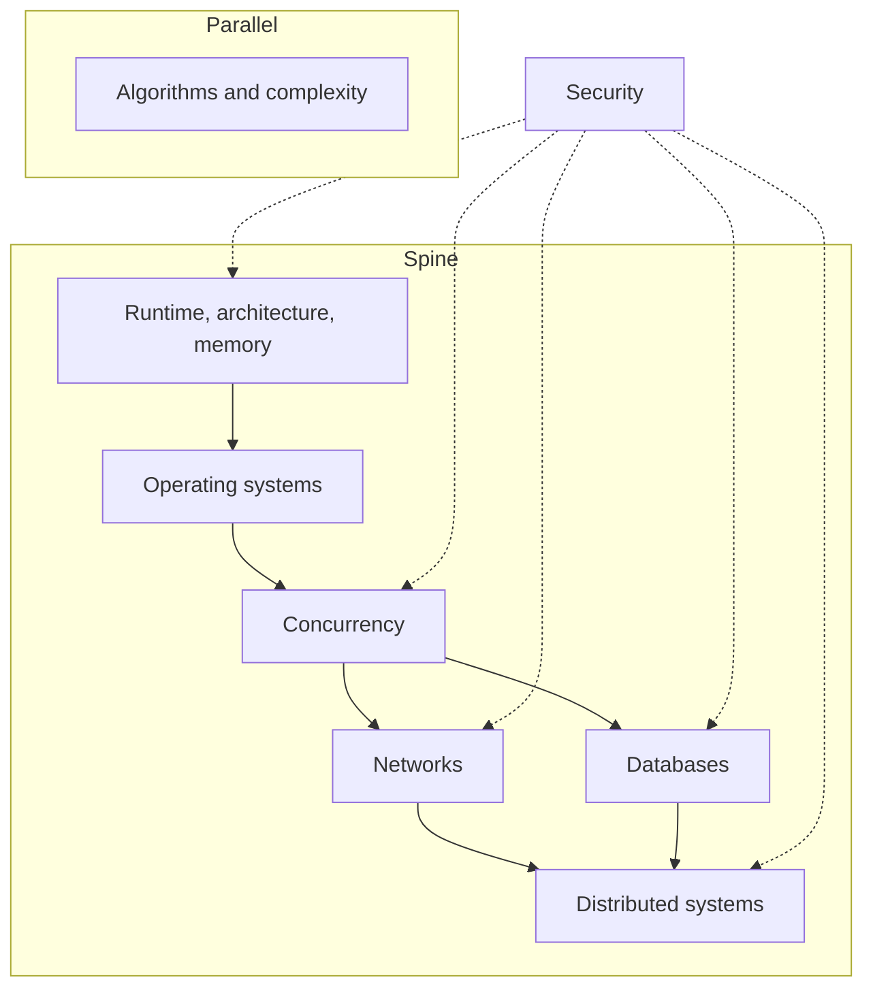

Production software 不是一叠 libraries。在 React tree、Hono handler 与 Postgres query 底下，是更小的一组模型：程序如何占用 memory、operating system 如何调度工作、不止一件事如何同时发生、数据如何穿过 network、database 如何陈述真相，以及当机器不止一台时这些真相如何分叉。

 

这篇 note 是这些模型在 production TypeScript 系统里的地图——browsers、Node、HTTP、Postgres。它不是一份课程目录。每个 node 都是可工作的定义、它在 production 出现的位置，以及一种值得辩护的 failure mode。Algorithms 坐在主脊旁边。Security 横切过去。

 

 

顺着箭头走。若还说不清什么是 process，就不要从 distributed systems 开始。

 

---

## Runtime、architecture、memory

程序不是 source file。它是占用 CPU、caches 与 RAM 的 instructions 和 data。**Runtime** 决定这种占用长什么样：JavaScript engine（Chrome 与 Node 里的 V8）编译 functions、在 **heap** 上分配，并在 **stack** 上记录进行中的 calls。Architecture 解释为什么 locality 重要——miss 一条 cache line，就是会被当成 jank 感受到的 stall——以及为什么 main thread 是稀缺机器，不是无限循环。

 

每次 component 把大型 array close over、module-level cache 把 parsed JSON 永远留住，或 React list 在写完 styles 之后强迫 layout，都会撞上这个模型。Engine 不会因为仍有 live reference 就替 runtime 丢掉它。Unbounded recursion 导致的 stack overflow 是同一套模型：每次 call 都是一个 frame，frame 是有限的。Event loop 与 rendering path，是 stack 空到能做其他工作时发生的事。

 

**Failure mode：** 一个随每个 request 或 navigation 增长的 closure 或 singleton cache。Memory 不是因为 JavaScript「有 garbage collection」就不 leak。它 leak，是因为 reference 还在。Process 撞上 limit，tab 死掉，heap snapshot 里是一张没有设界的 map。

 

Runtime 模型见 [JavaScript 核心概念](/notes/core-javascript-concepts)。Host 在 stack 为空时做什么，见 [深入理解 JavaScript Event Loop](/notes/javascript-event-loop-in-depth)。Main-thread 工作如何变成 pixels，见 [Browser 中的 Critical Rendering Path](/notes/critical-rendering-path-in-the-browser)。

 

---

## Operating systems

OS 是「许多 programs 共用一台机器」的虚构。**Process** 是一块 address space 加上一组 resources。**Thread** 是这块空间里被调度的一条执行。**Virtual memory** 让每个 process 相信自己拥有 RAM。**I/O** 是向 kernel 提出的请求，不是 JavaScript promise——promise 只是 runtime 听见回音的方式。

 

Node 的 JavaScript 跑在一条 thread 上。Timers、DNS 与多数 filesystem 工作发生在 host 里，然后 callback 入队。`worker_threads` 与 child processes 是取得更多 JS threads 或更多 processes 的方式。Browser 是若干 processes（site isolation）透过 IPC 协调。这些都不等于「JavaScript 是 multi-threaded」。那是 OS 提供 isolation 与 scheduling，runtime 只切了薄薄一片。

 

**Failure mode：** 把 Node process 当成 thread pool。Request handler 里对巨大 payload 做 CPU-heavy 的 `JSON.parse`、一段 tight loop，或同步的 `fs.readFileSync`，会停掉这个 process 上的每一个其他 request。OS 仍在调度。JS thread 没有。

 

这份契约的 host 一侧是 [深入理解 JavaScript Event Loop](/notes/javascript-event-loop-in-depth)。

 

---

## Concurrency

Concurrency 是重叠的工作。**Parallelism** 是在不止一个 core 上重叠。JavaScript 让 concurrency 很便宜（`async`/`await`、queues、event loop），parallelism 只有付出代价才有（workers、多个 processes）。两个 `await` 会交错。它们不会拿 lock。React 的「concurrent」rendering 是一条 thread 上的 cooperative scheduling，不是 OS threads 在 shared state 里赛跑。

 

Coalesce 相同的 `fetch`、Hono handler await Drizzle 时不能假设 in-memory counters 跨 request 安全、UI 因为两次 update 顺序颠倒而显示 stale data——这些场景都会用到它。有用的工具是 queues、single-flight maps，以及「这个值只属于一个 task」。Shared mutable memory 是昂贵的工具。

 

**Failure mode：** 隔着 `await` 对 module-level object 做 read-modify-write，并因为「Node 是 single-threaded」就称它安全。Single-threaded 表示一次只有一个 stack，不是一次只有一个 request。第二个 request 跑在空隙里。Counter、cache 或 in-flight map 现在是错的。

 

交错本身见 [深入理解 JavaScript Event Loop](/notes/javascript-event-loop-in-depth)。

 

---

## Networks

Network 是带可变 delay 的会丢东西的 queue。**TCP** 试图按序送达 bytes。**TLS** 认证对端并加密这条管。**HTTP** 是叠在上面的 request/response 约定。Timeout 不是 negative acknowledgment。CORS 是 browser policy，不是 server 的 access-control 系统。Cookies 是 credentials 的运输层，server 仍必须验证。

 

这在没有 timeout 的 `fetch`、Hono 前面的 API Gateway、把本该 private 的 JSON cache 住的 CDN，以及 `Domain` 宽了一档的 cookie 里都会出现。Latency 不是平均值。它是 tail。Rendering path 等的是 critical bytes；其余都可以等。

 

**Failure mode：** Client timeout 后重试 `POST`，timeout 被当成「server 从没见过它」。Server 可能已经 commit。现在有两笔 orders、两次 side effects，或两行 rows。Network 并没有以唯一的方式失败。失败的是对「缺失的 response 意味着什么」的假设。

 

Bytes 如何变成 first paint，见 [Browser 中的 Critical Rendering Path](/notes/critical-rendering-path-in-the-browser)。这套 stack 实际部署的 API 与 edge 形状见 [用 Hono、Drizzle、Zod OpenAPI 与 SST 打造 Backend APIs](/notes/backend-apis-hono-sst)。Cookie lifetime 与 `HttpOnly` 属于 [Local Storage、Session Storage 与 Cookies](/notes/browser-storage-localstorage-sessionstorage-cookies)。

 

---

## Databases

Database 不是一桶 rows。它是一组 **constraints**、**indexes** 与 **transactions**，决定哪些 statements 可以同时为真。Index 是让 lookup 变便宜、write 稍贵一点的 data structure。Isolation 是 concurrent transactions 之间的契约——一个 transaction 被允许看到别人 in-flight 工作的哪些部分。Schema 才是 API。Application 里的 `WHERE` 是习惯，不是保证。

 

这套 stack 用 Postgres、Drizzle 与 row-level security 处理这件事。只活在 Hono 里的 tenant isolation，少一个 filter 就会 leak。笔电上瞬间返回的 query，在 production 是 sequential scan。没有 transaction 或 constraint 的 read-modify-write，是等流量到来的 lost update。

 

**Failure mode：** 两个 requests 读同一行，都 increment，都 write。每个 transaction 看起来都正确。Counter 跳过了一个数字。Isolation 没有神秘地失败。模式是 check-then-act，而 database 从未被要求把它做成 atomic。

 

Isolation 路径见 [用 Hono、Better Auth、Drizzle 与 Postgres RLS 打造 Multi-Tenant 后端](/notes/multi-tenant-backend-drizzle-hono-better-auth)。Statement 模型见 [SQL 核心概念](/notes/core-sql-concepts)。

 

---

## Distributed systems

一旦机器不止一台，failure 就是常态。Networks 会 partition。Processes 会重启。Lambda 可能把同一个 handler invoke 两次。Clocks 会不一致。**Consistency** 是选择让 readers 可以相信什么。**Idempotency** 是让 retry 不再变成 duplicate 的方法。有趣的 bugs 不是「server 挂了」，而是「server 还在，而不知道上一个 request 有没有 commit」。

 

这在 SST stages 与 Lambda、必须撑过 replay 的 agent workflows，以及 ingest 与 retrieval 共用、绝不能跨 tenants 的 RAG index 里都会出现。Durable run、namespace 与 idempotency key 是同一个想法：给工作命名，让做两次是安全的。

 

**Failure mode：** 没有 idempotency key 的 retry。第一次 invocation 写了 row，回来的路上 timeout，第二次又写了一次。系统「highly available」。它也 duplicated。没有 write identity 的 availability，只是多了几步的 at-least-once delivery。

 

Stages 与 deploy loop 见 [用 SST 管理 AWS 基础设施与 DevOps](/notes/using-sst-for-aws-infra-and-devops)。Tenant-scoped index 见 [如何搭建一套 RAG 系统](/notes/how-to-build-a-rag-system)。Agent 被允许记住什么、记在哪里，见 [Agent memory 的四个层级](/notes/four-levels-of-agent-memory)。

 

---

## Data structures、algorithms、complexity

Algorithms 不是问题名称的清单。它们是穿过 data 的一小套 **patterns**：hash map 回答「这个见过吗？」，sorted array 上的 two pointers，heap 回答「top K」，graph walk 回答 connectivity。**Complexity** 是 cost model——input 变大时的 time 与 memory——让 ship 之前就能把 nested loop 和 linear scan 分开。Input 形状通常已经点名该用哪把工具。

 

当 list search 其实是 lookup、对每个 organization row 的「简单」filter 本该是 index、UI 每次 keystroke 做 O(n²) 工作时，这套 pattern 就派上用场。解决 Two Sum 的那张 map，也是 de-duplicate in-flight requests 的那张 map。Big-O 不是叫对二十个 items 做 micro-optimize。它指出哪份工作会在两万时倒下。

 

**Failure mode：** 对本来可以 keyed 的 data 套 nested loops，而真正的 bottleneck 是从未测量的 network round trip。CPU 故事被优化了，I/O 故事被错过。Complexity 是决策工具，不是竞技。

 

这套 stack 实际实现的 patterns 见 [常用 Algorithms](/notes/common-algorithms)。

 

---

## Security

Security 是 **trust boundary** 问题：这台机器被允许对来自那台机器的 message 相信什么。**Authentication** 回答是谁。**Authorization** 回答他们可以做什么。Client 送来的任何东西都不是 source of truth——JSON 里的 `organizationId` 不是，未 verify 的 JWT 里的 role 不是，hidden form field 也不是。Browser 是 untrusted host。React Native bundle 也是。

 

上面每个 node 都会用到它。Cache 进其他 tenants 数据的 memory、相信某个 header 的 handlers、没有 `HttpOnly` 的 cookies、少了一张表的 RLS、能搜到错误 namespace 的 model——都是同一类 bug。Exploit 就是这条 boundary 没检查到的东西。

 

**Failure mode：** Client 声明它属于哪个 organization，API 相信了。Query 返回另一个 tenant 的 rows。Transit 中的 encryption 帮不上忙。User 被 authenticate 了，然后被允许自己挑 authorization。

 

这类 failures 见 [Web Security and the OWASP Top 10](/notes/web-security-owasp-top-10)。这套 stack 的两个 hosts 见 [Frontend Security in Next.js and React Native](/notes/frontend-security-nextjs-react-native)。作为 database constraint 的 tenant isolation，见上面的 multi-tenant note。

 

---

## 怎么走这张图

地图按 dependency 顺序读，不当成日历。Runtime 与 memory 先于 OS，因为 process 是机器托住 program 的方式。OS 先于 concurrency，因为 threads 与 I/O 才是「同时」的建材。Concurrency 先于 networks 与 databases，因为后两者本身就是带各自 failure modes 的 concurrent systems。Networks 与 databases 先于 distributed systems，因为 distribution 就是那些 failures，外加不共享 memory 的机器。只要问题是 data 形状，algorithms 就可以并行学。Security 不是后面一章。它是每个 node 都要问的问题：这一层相信什么，谁教它的？

 

当 production bug 能叫出它的 node 时，这张地图才有用。Hung tab 常常是 runtime。卡住的 event loop 是 OS 契约。错误的 counter 是 concurrency。重复扣款是 network 或 distributed retry。慢的 list 是 algorithms 或缺失的 index。跨 tenants 的 leak 是 security，也是 database。知道正在用哪套模型，才是工作。Libraries 会换。模型不会。
