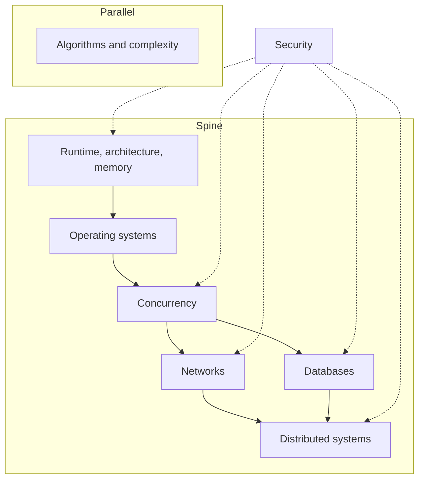

Production software 不是一叠 libraries。在 React tree、Hono handler 与 Postgres query 底下，是更小的一组模型：程序如何占用 memory、operating system 如何调度工作、不止一件事如何同时发生、数据如何穿过 network、database 如何陈述真相，以及当机器不止一台时这些真相如何分叉。

 

- 这篇 note 是这些模型在 production TypeScript 系统里的地图——browsers、Node、HTTP、Postgres。它不是一份课程目录。
- 每个 node 都是可工作的定义、它在 production 出现的位置，以及一种值得辩护的 failure mode。
- Algorithms 坐在主脊旁边。Security 横切过去。

 

 

顺着箭头走。在能叫出一个 process 之前，不要从 distributed systems 开始。

 

---

## Runtime、architecture、memory

程序不是 source file。它是占用 CPU、caches 与 RAM 的 instructions 和 data。

 

- **Runtime** 决定这种占用长什么样：JavaScript engine（Chrome 与 Node 里的 V8）编译 functions、在 **heap** 上分配，并在 **stack** 上记录进行中的 calls。
- Architecture 解释为什么 **locality** 重要——miss 一条 cache line，就是会被当成 jank 感受到的 stall——以及为什么 main thread 是稀缺机器，不是无限循环。
- 每次 component 把大型 array close over、module-level cache 把 parsed JSON 永远留住，或 React list 在写完 styles 之后强迫 layout，都会撞上这个模型。Engine 不会丢掉仍有 live reference 的东西。Unbounded recursion 导致的 stack overflows 是同一套模型：每次 call 都是一个 frame，frame 是有限的。
- **Failure：** 一个随每个 request 或 navigation 增长的 closure 或 singleton cache。Memory 不是因为 JavaScript「有 garbage collection」就不 leak。它 leak，是因为 **reference 还在**。Process 撞上 limit，tab 死掉，heap snapshot 里是一张没有设界的 map。
- Runtime 模型见 [JavaScript 核心概念](/notes/core-javascript-concepts)。Host 在 stack 为空时做什么，见 [深入理解 JavaScript Event Loop](/notes/javascript-event-loop-in-depth)。Main-thread 工作如何变成 pixels，见 [Browser 中的 Critical Rendering Path](/notes/critical-rendering-path-in-the-browser)。

 

---

## Operating systems

OS 是「许多 programs 共用一台机器」的虚构。

 

- **Process** 是一块 address space 加上一组 resources。**Thread** 是这块空间里被调度的一条执行。**Virtual memory** 让每个 process 相信自己拥有 RAM。**I/O** 是向 kernel 提出的请求，不是 JavaScript promise——promise 只是 runtime 听见回音的方式。
- Node 的 JavaScript 跑在 **一条 thread** 上。Timers、DNS 与多数 filesystem 工作发生在 host 里，然后 callback 入队。`worker_threads` 与 child processes 是取得更多 JS threads 或更多 processes 的方式。
- Browser 是若干 processes（site isolation）透过 IPC 协调。这些都不等于「JavaScript 是 multi-threaded」。那是 OS 提供 isolation 与 scheduling，runtime 只切了薄薄一片。
- **Failure：** 把 Node process 当成 thread pool。在 request handler 里对大型 payload 做 CPU-heavy 的 `JSON.parse`、紧密 loop，或 synchronous 的 `fs.readFileSync`，会停掉该 process 上的每一个其他 request。OS 仍在调度。JS thread 没有。
- 这份契约的 host 一侧是 [深入理解 JavaScript Event Loop](/notes/javascript-event-loop-in-depth)。

 

---

## Concurrency

**Concurrency** 是重叠的工作。**Parallelism** 是在不止一个 core 上重叠的工作。

 

- JavaScript 便宜地提供 concurrency（`async`/`await`、queues、event loop），parallelism 只有付了代价才有（workers、多个 processes）。两个 `await` 会交错。它们不会拿 lock。
- React 的「concurrent」rendering 是一条 thread 上的 cooperative scheduling，不是 OS threads 在 shared state 里赛跑。
- 合并相同的 `fetch` calls、Hono handler await Drizzle 却不能假设 in-memory counters 跨 requests 是安全的、UI 因为两次 updates 乱序而显示 stale data——都会撞上这个模型。有用的工具是 queues、single-flight maps，以及「这个值由一个 task 拥有」。Shared mutable memory 是昂贵的工具。
- **Failure：** 跨 `await` 点对 module-level object 做 read-modify-write，并因为「Node 是 single-threaded」就称它安全。Single-threaded 的意思是一次一条 **stack**，不是一次一个 **request**。第二个 request 跑在那个空隙里。Counter、cache，或 in-flight map 现在是错的。
- 交错本身见 [深入理解 JavaScript Event Loop](/notes/javascript-event-loop-in-depth)。

 

---

## Networks

Network 是一条 **带可变 delay 的 lossy queue**。

 

- **TCP** 试图按顺序交付 bytes。**TLS** 认证对端并加密这条管道。**HTTP** 是叠在上面的 request/response 约定。Timeout 不是 negative acknowledgment。CORS 是 browser policy，不是 server access-control system。Cookies 是 credentials 的 transport，server 仍然必须验证。
- `fetch` 没有 timeout、API Gateway 坐在 Hono 前面、CDN cache 了一份本该 private 的 JSON response、cookie `Domain` 宽了一档——都会撞上这个模型。Latency 不是平均值。它是 tail。Rendering path 等的是关键 bytes；其他一切都可以等。
- **Failure：** Client timeout 了，retry 一次 `POST`，并把 timeout 当成「server 从没看见它」。Server 可能已经 committed。现在有两笔 orders、两次 side effects，或两行 rows。Network 并没有以独特方式失败。失败的是「缺失的 response 意味着什么」这个假设。
- Bytes 如何变成 first paint，见 [Browser 中的 Critical Rendering Path](/notes/critical-rendering-path-in-the-browser)。这套 stack 实际部署的 API 与 edge 形状见 [用 Hono、Drizzle、Zod OpenAPI 与 SST 打造 Backend APIs](/notes/backend-apis-hono-sst)。HTTP contract 见 [System Design 里的 API Design](/notes/api-design-in-system-design)。Cookie lifetime 与 `HttpOnly` 属于 [Local Storage、Session Storage 与 Cookies](/notes/browser-storage-localstorage-sessionstorage-cookies)。

 

---

## Databases

Database 不是一桶 rows。它是一组 **constraints**、**indexes** 与 **transactions**，决定哪些 statements 可以在同一时刻为真。

 

- Index 是让 lookup 变便宜、write 稍微变贵的 data structure。Isolation 是 concurrent transactions 之间的契约——一笔 transaction 被允许看见别人进行中工作的哪些部分。Schema 就是 API。Application 的 `WHERE` clauses 是习惯，不是保证。
- 这套 stack 用 Postgres、Drizzle 与 row-level security。只活在 Hono 里的 tenant isolation，离 leak 只差一个被忘掉的 filter。在 laptop 上瞬间完成的 query，在 production 里是 sequential scan。没有 transaction 或 constraint 的 read-modify-write，是在等流量到来的 lost update。
- **Failure：** 两个 requests 读同一行，都 increment，都 write。每笔 transaction 看起来都正确。Counter 跳过了一个数字。Isolation 并没有神秘地失败。这个 pattern 是 check-then-act，而 database 从未被告知要让它 atomic。
- Isolation 路径见 [用 Hono、Better Auth、Drizzle 与 Postgres RLS 打造 Multi-Tenant 后端](/notes/multi-tenant-backend-drizzle-hono-better-auth)。Statement 模型见 [SQL 核心概念](/notes/core-sql-concepts)。Postgres 前面的 read path 见 [System Design 里的 Caching](/notes/caching-in-system-design)。

 

---

## Distributed systems

一旦机器不止一台，failure 就是常态。

 

- Networks 会 partition。Processes 会 restart。Lambda 可以两次 invoke 同一个 handler。Clocks 会对不上。**Consistency** 是关于允许 readers 相信什么的选择。**Idempotency** 是让 retry 不再变成 duplicate 的方式。有意思的 bugs 不是「server 挂了」。而是「server 还在，而且不知道上一笔 request 有没有 committed」。
- SST stages 与 Lambda、必须撑过 replay 的 agent workflows、ingest 与 retrieval 共用一份绝不能跨 tenants 的 index 的 RAG pipelines——都会撞上这个模型。Durable run、namespace 与 idempotency key 是同一个想法：给工作命名，让做两次是安全的。
- **Failure：** 没有 idempotency key 的 retry。第一次 invocation 写了 row，回来的路上 timeout 了，第二次 invocation 又写了一次。系统是「highly available」。它也是 duplicated。没有 write identity 的 availability，只是多了几步的 at-least-once delivery。
- Stages 与 deploy loop 见 [用 SST 管理 AWS 基础设施与 DevOps](/notes/using-sst-for-aws-infra-and-devops)。Tenant-scoped index 见 [如何搭建一套 RAG 系统](/notes/how-to-build-a-rag-system)。Agent 被允许记住什么、记在哪里，见 [Agent memory 的四个层级](/notes/four-levels-of-agent-memory)。

 

---

## Data structures、algorithms、complexity

Algorithms 不是一份问题名称清单。它们是一小套在 data 里移动的 **patterns**。

 

- Hash map 用来问「见过这个吗？」，sorted array 上的 two pointers，heap 用来取「top K」，graph walk 用来看 connectivity。**Complexity** 是 cost model——input 变大时的 time 与 memory——这样在 shipping 之前就能把 nested loops 与 linear scan 分开。Input 形状通常已经点名了工具。
- 当 list search 其实是 lookup、当「简单」地 filter 每一个 organization row 本该是 index、当 UI 每个 keystroke 都做 O(n²) 工作时，就是这套 pattern。解开 Two Sum 的同一张 map，也是把 in-flight requests 去重的那张 map。Big-O 并不要求对二十个 items 做 micro-optimize。它标出哪份工作会在两万时倒下。
- **Failure：** 对本来可以 keyed 的 data 做 nested loops，而真正的瓶颈是从未被衡量过的 network round trip。CPU 故事被优化了，I/O 故事被错过了。Complexity 是决策工具，不是竞技。
- 这套 stack 实际实现的 patterns 见 [常用 Algorithms](/notes/common-algorithms)。

 

---

## Security

Security 是 **trust boundary** 问题：这台机器被允许对那台机器传来的 message 相信什么。

 

- **Authentication** 回答是谁。**Authorization** 回答他们可以做什么。Client 送来的任何东西都不是 source of truth——不是 JSON 里的 `organizationId`，不是未验证 JWT 里的 role，不是 hidden form field。Browser 是不受信任的 host。React Native bundle 也是。
- 这适用于上面每一个 node。把其他 tenants 的 data 放进 memory caches、相信 header 的 handlers、没有 `HttpOnly` 的 cookies、某张 table 上缺失的 RLS、能搜到错误 namespace 的 model——都是同一类 bug。Exploit 就是这条边界没检查到的东西。
- **Failure：** Client 声明它属于哪个 organization，API 相信了。Query 返回另一个 tenant 的 rows。Transit 中的 encryption 帮不上忙。User 被 authenticate 了，然后被允许自己挑 authorization。
- 这类 failures 见 [Web Security and the OWASP Top 10](/notes/web-security-owasp-top-10)。这套 stack 的两个 hosts 见 [Frontend Security in Next.js and React Native](/notes/frontend-security-nextjs-react-native)。作为 database constraint 的 tenant isolation，见上面的 multi-tenant note。

 

---

## 怎么走这张图

地图按 dependency 顺序读，不当成日历。

 

- Runtime 与 memory 先于 OS，因为 process 是机器托住 program 的方式。OS 先于 concurrency，因为 threads 与 I/O 才是「同时」的建材。
- Concurrency 先于 networks 与 databases，因为后两者本身就是带各自 failure modes 的 concurrent systems。Networks 与 databases 先于 distributed systems，因为 distribution 就是那些 failures，外加不共享 memory 的机器。
- 只要问题是 data 形状，algorithms 就可以并行学。Security 不是后面一章。它是每个 node 都要问的问题：这一层相信什么，谁教它的？
- 当 production bug 能叫出它的 node 时，这张地图才有用。Hung tab 常常是 runtime。卡住的 event loop 是 OS 契约。错误的 counter 是 concurrency。重复扣款是 network 或 distributed retry。慢的 list 是 algorithms 或缺失的 index。跨 tenants 的 leak 是 security，也是 database。
- 知道正在用哪套模型，才是工作。Libraries 会换。模型不会。

---

## Recap Q&A

<Accordion type="single" collapsible>
  <AccordionItem value="cs-runtime">
    <AccordionTrigger>1. 什么是 runtime，为什么有 garbage collection 仍然会 leak memory？</AccordionTrigger>
    <AccordionContent>

      - 程序是占用 CPU、caches 与 RAM 的 instructions 和 data。**Runtime** 决定这种占用长什么样：JavaScript engine 在 **heap** 上分配，并在 **stack** 上记录进行中的 calls。
      - Architecture 解释为什么 locality 重要，以及为什么 main thread 是稀缺机器。Engine 不会丢掉仍有 live reference 的东西。Unbounded recursion 是同一套模型：frames 是有限的。
      - **Failure：** 一个随每个 request 增长的 closure 或 singleton cache。Memory 不是因为 JavaScript「有 garbage collection」就不 leak。它 leak，是因为 **reference 还在**。
      - 顺着箭头走。在能叫出一个 process 之前，不要从 distributed systems 开始。

    </AccordionContent>
  </AccordionItem>

  <AccordionItem value="cs-os">
    <AccordionTrigger>2. OS 实际提供给 Node 或 browser process 的是什么？</AccordionTrigger>
    <AccordionContent>

      - **Process** 是一块 address space。**Thread** 是里面被调度的一条执行。**Virtual memory** 让每个 process 相信自己拥有 RAM。**I/O** 是向 kernel 提出的请求；promise 只是 runtime 听见回音的方式。
      - Node 的 JavaScript 跑在 **一条 thread** 上。Timers、DNS 与多数 filesystem 工作发生在 host 里。`worker_threads` 与 child processes 是取得更多 JS threads 或 processes 的方式。
      - Browser 是若干透过 IPC 协调的 processes。这些都不等于「JavaScript 是 multi-threaded」。
      - **Failure：** 把 Node process 当成 thread pool。在 handler 里做 CPU-heavy 的 `JSON.parse`、紧密 loop，或 `fs.readFileSync`，会停掉该 process 上的每一个其他 request。OS 仍在调度。JS thread 没有。

    </AccordionContent>
  </AccordionItem>

  <AccordionItem value="cs-concurrency">
    <AccordionTrigger>3. 在这套 stack 里，concurrency 与 parallelism 差在哪里？</AccordionTrigger>
    <AccordionContent>

      - **Concurrency** 是重叠的工作。**Parallelism** 是在不止一个 core 上重叠的工作。
      - JavaScript 便宜地提供 concurrency（`async`/`await`、queues、event loop），parallelism 只有付了代价才有（workers、多个 processes）。两个 `await` 会交错。它们不会拿 lock。
      - React 的「concurrent」rendering 是一条 thread 上的 cooperative scheduling，不是 OS threads 在 shared state 里赛跑。
      - **Failure：** 跨 `await` 点对 module-level object 做 read-modify-write，并因为「Node 是 single-threaded」就称它安全。Single-threaded 的意思是一次一条 **stack**，不是一次一个 **request**。第二个 request 跑在那个空隙里。

    </AccordionContent>
  </AccordionItem>

  <AccordionItem value="cs-networks">
    <AccordionTrigger>4. 什么是 network，timeout 并不代表什么？</AccordionTrigger>
    <AccordionContent>

      - Network 是一条 **带可变 delay 的 lossy queue**。TCP 试图按顺序交付 bytes。TLS 认证并加密。HTTP 是叠在上面的 request/response 约定。
      - Timeout **不是** negative acknowledgment。CORS 是 browser policy，不是 server access-control system。Cookies 是 credentials 的 transport，server 仍然必须验证。Latency 是 tail，不是平均值。
      - **Failure：** Client timeout 了，retry 一次 `POST`，并把 timeout 当成「server 从没看见它」。Server 可能已经 committed。现在有两笔 orders。失败的是「缺失的 response 意味着什么」这个假设。

    </AccordionContent>
  </AccordionItem>

  <AccordionItem value="cs-db-dist">
    <AccordionTrigger>5. Databases 与 distributed systems 逼你命名的是什么？</AccordionTrigger>
    <AccordionContent>

      - Database 是 **constraints**、**indexes** 与 **transactions**。Schema 就是 API。Application 的 `WHERE` clauses 是习惯。Isolation 是 concurrent transactions 之间的契约。
      - **Failure：** 两个 requests 都读、都 increment、都 write——check-then-act，从未被告知要 atomic。
      - 一旦机器不止一台，failure 就是常态。**Consistency** 是 readers 可以被允许相信什么。**Idempotency** 是让 retry 不再变成 duplicate 的方式。
      - 有意思的 bug 是「server 还在，而且不知道上一笔 request 有没有 committed」。Durable run、namespace 与 idempotency key 是同一个想法：给工作命名，让做两次是安全的。
      - Security 横切每一个 node：client 送来的任何东西都不是 source of truth。

    </AccordionContent>
  </AccordionItem>
</Accordion>
