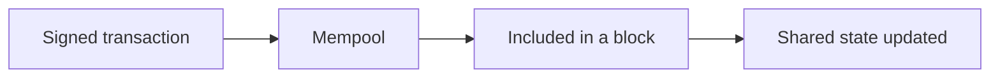
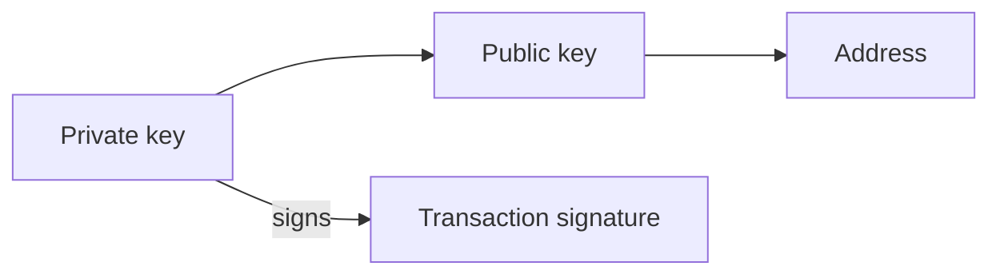
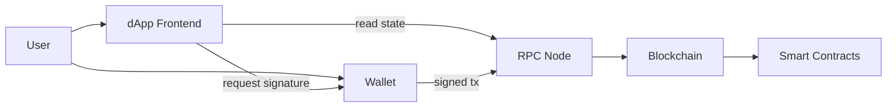
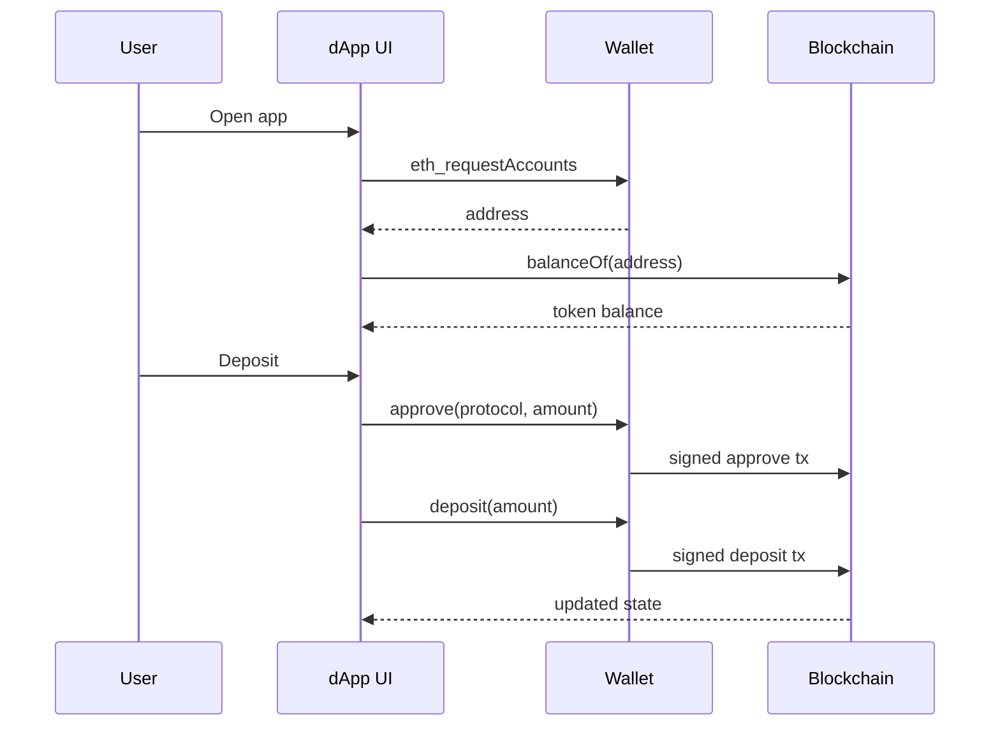

大多数 on-chain applications 都由同一小撮零件组成：**wallets**、**smart contracts**、**tokens** 与 **dApps**。搞清楚它们如何串连，以及每一块建立什么 trust model，就足以读懂多数 Web3 architectures，而不必淹没在 cryptography 里。

<br />

这篇 note 用 Ethereum / EVM 作为框架，因为 ERC token standards 住在那里。同样的想法可以转移到其他 chains，即使名称不同。

<br />

---

## Blockchain 基础

Blockchain 是一份由许多独立 nodes 共同同意的 shared ledger。一旦 transaction 被确认，改写历史在设计上就是昂贵的。那份 shared state 让陌生人可以转移 assets，中间不必有中央银行。

<br />

对 application 工作真正重要的零件：

- **Accounts**：chain 上的身份。Externally owned accounts (EOAs) 由 private keys 控制。Contract accounts 由 code 控制。
- **Transactions**：已签署的 messages，提出一次 state change：送 value、调用 contract、deploy code。
- **Consensus**：网络同意哪些 transactions 有效、以及顺序为何的方式。
- **Gas**：在 on-chain 执行工作所付的 fee。每次 write 都有成本；通过 RPC node 的 reads 通常没有。

<br />



<br />

我把 chain 当成 **programmable settlement layer**：跟普通 database 相比又慢又贵，但当 ownership 与规则必须可公开验证时，它就有用。

<br />

---

## Wallets

Wallet 是持有 cryptographic keys、并帮你签署 transactions 的软件（或硬件）。它不是银行账户。Chain 存 balances；wallet 存你控制某个 address 的证明。

<br />



<br />

核心想法：

- **Private key** 证明控制权。任何人拿到它，就可以从该 address 移走 assets。
- **Public key / address** 是别人用来送你 assets，或在 on-chain 识别你的东西。
- **Signing** 代表授权一笔特定 transaction，而不广播 private key 本身。
- **Custody** 是谁持有 keys。Self-custody 代表你自己持有。Custodial wallets 代表服务代表你持有。

<br />

Browser extensions 与 mobile wallets 主要是 keys 周围的 UX：连到一个 site、检视一笔 transaction、批准或拒绝。Hardware wallets 把 private key 留在 offline，只暴露 signatures。

<br />

当 dApp 说「connect wallet」，它是在要一个 address 与一条 signing channel，而不是要你登录某间公司 database 的密码：

<br />

```ts
// EIP-1193 provider injected by an extension wallet (e.g. window.ethereum)
const accounts = (await window.ethereum.request({
  method: "eth_requestAccounts",
})) as string[]

const address = accounts[0]
// address is public; the private key never leaves the wallet
```

<br />

这个区别会出现在每一次 security review：phishing sites 要你签署错的东西，而不是 Web2 意义上的「登录」。

<br />

---

## Smart Contracts

Smart contract 是 deploy 到 blockchain 上的程序。在 Ethereum 上通常用 Solidity 写，跑在 EVM 上。一旦 deployed，它的 code 与 storage 住在一个 contract address。

<br />

Contracts 跟普通 backend 不同的地方：

- **Public state**：任何人都可以读 balances、ownership，常常还能读 bytecode。
- **Deterministic execution**：相同 inputs 与 state，在诚实 nodes 上产生相同结果。
- **Permissionless calling**：任何付了 gas 的人都可以调用 public function，但受 contract 自己的 access checks 约束。
- **Hard to change**：upgrades 需要明确 pattern（proxy、governance、migration）。Immutable code 没有 silent hotfix。

<br />

最小形状看起来像这样：

<br />

```solidity
// SPDX-License-Identifier: MIT
pragma solidity ^0.8.24;

contract Escrow {
    address public payer;
    address public payee;
    bool public released;

    constructor(address _payee) payable {
        payer = msg.sender;
        payee = _payee;
    }

    function release() external {
        require(msg.sender == payer, "only payer");
        require(!released, "already released");
        released = true;
        payable(payee).transfer(address(this).balance);
    }
}
```

<br />

Contracts 编码规则：谁可以调用什么、在什么条件下、以及什么 state changes。Bugs 很昂贵，因为 funds 与 ownership 往往就坐在 contract 本身里面。

<br />

我把 smart contract 想成 **一套开放、按 fee 计量的 API，而其 database 就是 chain**。UI 可以说谎；真正 settle 的是 contract 的 state。

<br />

---

## Tokens

Tokens 是由遵循共享 interfaces 的 smart contracts 所代表的 assets。Wallets、explorers 与 dApps 不必为每个项目写自定义 code 就能支持它们，这正是 ERC standards 重要的原因。

<br />

### ERC-20：fungible tokens

**ERC-20** 是 fungible tokens 的 standard：每个单位都可互换，像货币或 points。

<br />

```solidity
interface IERC20 {
    function balanceOf(address account) external view returns (uint256);
    function transfer(address to, uint256 amount) external returns (bool);
    function approve(address spender, uint256 amount) external returns (bool);
    function transferFrom(address from, address to, uint256 amount) external returns (bool);
}
```

<br />

`approve` + `transferFrom` 是 protocol 代表你花费 tokens 的方式：你授权一个 spender，然后那个 contract 把金额拉走。

<br />

Stablecoins、governance tokens 与 in-game currencies 通常是 ERC-20。重要的心智模型是 **balances**，不是 unique items。

<br />

### ERC-721：non-fungible tokens (NFTs)

**ERC-721** 是 unique tokens 的 standard。每个 `tokenId` 都是自己的 asset，只有一个 owner。

<br />

```solidity
interface IERC721 {
    function ownerOf(uint256 tokenId) external view returns (address);
    function safeTransferFrom(address from, address to, uint256 tokenId) external;
    function tokenURI(uint256 tokenId) external view returns (string memory);
}
```

<br />

Collectibles、tickets 与 on-chain deeds 是常见的 ERC-721 用途。同一个 contract 的两个 tokens，只要 IDs 不同，就 **不可** 互换。

<br />

### ERC-1155：multi-token standard

**ERC-1155** 让一个 contract 管理多种 token types（fungible、non-fungible，或两者），并支持 batch transfers。

<br />

```solidity
interface IERC1155 {
    function balanceOf(address account, uint256 id) external view returns (uint256);
    function safeBatchTransferFrom(
        address from,
        address to,
        uint256[] calldata ids,
        uint256[] calldata amounts,
        bytes calldata data
    ) external;
}
```

<br />

Games 与 marketplaces 在单一 collection 混了 gold coins（fungible）、unique swords（supply 为一）与 limited skins（supply 为 N）时，往往偏好 ERC-1155。更少 deployments，更便宜的 batch operations。

<br />

### 比较

| Standard | Fungibility | Identity model | Common uses |
| --- | --- | --- | --- |
| ERC-20 | Fungible | Amount per address | Currencies, points, governance |
| ERC-721 | Non-fungible | One owner per `tokenId` | Collectibles, tickets, unique rights |
| ERC-1155 | Mixed | Balance per address per `id` | Games, multi-asset collections |

<br />

三者仍然只是 smart contracts。ERC number 是共享 interface，让 tooling 能一致地对待它们。

<br />

---

## Decentralized Applications (dApps)

**dApp** 是 critical logic 或 ownership 住在 on-chain 的应用。熟悉的形状是：

<br />

1. 一个 **frontend**（常常是普通 web app）负责 UX
2. 一个 **wallet** 负责 identity 与 transaction signing
3. **Smart contracts** 作为 assets 与规则的 source of truth
4. 一个 **RPC provider**，让 frontend 能读 chain state 并广播已签署的 transactions

<br />



<br />

Reads 可以免费且频繁。Writes 需要 signature 与 gas。搭配 typed client，一次 read 常常长这样：

<br />

```ts
import { createPublicClient, http, parseAbi } from "viem"
import { mainnet } from "viem/chains"

const client = createPublicClient({
  chain: mainnet,
  transport: http(),
})

const erc20Abi = parseAbi([
  "function balanceOf(address owner) view returns (uint256)",
])

const balance = await client.readContract({
  address: "0xA0b86991c6218b36c1d19D4a2e9Eb0cE3606eB48", // USDC
  abi: erc20Abi,
  functionName: "balanceOf",
  args: ["0xYourAddress"],
})
```

<br />

许多 dApps 仍然使用 centralized pieces：indexers、APIs、IPFS gateways、admin keys。「Decentralized」是一个光谱。我看的是哪些部分可以失败或审查，而不拿走用户的 assets。

<br />

---

## 它们如何组合

许多产品共享的具体流程：

<br />



<br />

1. 用户打开 dApp 并 **connects a wallet**。App 得知他们的 address。
2. UI 通过 RPC **reads** balances 与 ownership（`balanceOf`、`ownerOf` 等）。
3. 用户要把 ERC-20 deposit 进 protocol。他们先 **approve** contract 作为 spender，再调用 deposit function：两次 signatures、两笔 transactions（除非被更高层 pattern 批次处理）。
4. **Smart contract** 更新 on-chain state。
5. UI 从 chain（或 indexer）刷新，并显示新的 balances。

<br />

在 TypeScript 搭配 wallet client 时，write 这一侧大致是：

<br />

```ts
import { parseAbi, parseUnits } from "viem"

const erc20Abi = parseAbi([
  "function approve(address spender, uint256 amount) returns (bool)",
])

const protocol = "0xProtocolAddress"
const amount = parseUnits("100", 6) // 100 USDC (6 decimals)

// 1) User signs: allow the protocol to pull tokens
await walletClient.writeContract({
  address: "0xA0b86991c6218b36c1d19D4a2e9Eb0cE3606eB48",
  abi: erc20Abi,
  functionName: "approve",
  args: [protocol, amount],
})

// 2) User signs: protocol pulls and records the deposit
await walletClient.writeContract({
  address: protocol,
  abi: parseAbi(["function deposit(uint256 amount)"]),
  functionName: "deposit",
  args: [amount],
})
```

<br />

把那个 ERC-20 换成 ERC-721 mint，或 ERC-1155 batch claim，wallet / contract / RPC 的形状仍然一样。改变的只有 token interface 与 contract 的 business rules。

<br />

---

## 要点

有用的心智模型很精简：

- **Wallet 持有 keys**，不是 ledger 本身；custody 关乎谁可以签署。
- **Smart contract** 是公开、按 fee 计量的 logic，其 state 结算 ownership。
- **ERC-20**、**ERC-721** 与 **ERC-1155** 的差异，主要在 fungibility 以及 identity 如何被建模。
- **dApp** 组合 frontend、wallet signatures、RPC 与 contracts；对 assets 来说，source of truth 是 chain，不是 UI。

<br />

其余一切（L2s、account abstraction、indexers、bridges）都建立在这个基础上。
