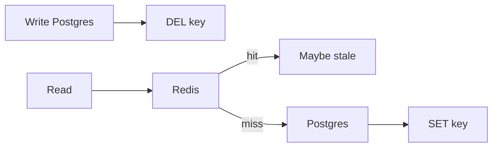

**Cache** 是一份更快、更小的副本。Disk 大约一毫秒。RAM 大约一百纳秒。Caching 用 storage 与 invalidation 换 latency 与 load。Database 仍是 source of truth。Cache 是一个可能出错的 hint。

这篇 note 依 [Evan 的 walkthrough](https://www.youtube.com/watch?v=1NngTUYPdpI)。Statement 模型见 [SQL 核心概念](/notes/core-sql-concepts)。这套 stack 上的 HTTP 与 CDN reuse 见 [深入理解 Next.js](/notes/understanding-next-js-in-depth)。这篇 note 讲的是 application cache。

<br />

---

## Pattern Map

| Pattern | Who talks to the DB | Reach for it when |
| --- | --- | --- |
| Cache-aside | App，在 miss 时 | Default。只有被请求过的 keys 活在 Redis 里 |
| Write-through | Cache，同步地 | Reads 必须新鲜，且可以接受更慢的 writes |
| Write-behind | Cache，稍后 | 高 write throughput；可以接受一点 loss |
| Read-through / CDN | Cache，在 miss 时 | Proxy 自己填自己 —— CDN edges，不是 Hono + Redis |

<br />

---

## 1. 为什么需要 cache

先点名 bottleneck。没有 bottleneck 的 cache，只是带 TTL 的复杂度。

<br />

- **Load.** 一条 read-heavy 的路径正在拖垮 Postgres。Profile fetches、homepage feed、每次 request 都重算的 join。
- **Latency.** Disk path 达不到的 non-functional。Memory 离 CPU 更近；query 不是。
- **Cost of compute.** 把 posts、follows、likes join 起来的 personalized feed。把结果 cache 六十秒。不要每次 scroll 都重算。

<br />

**Failure:** 因为「我们总是 cache」就在每张表前面丢一个 Redis。Write path 多了 dual-write。Read path 多了 stale keys。Postgres 从来不是问题。

<br />

---

## 2. 它住在哪

四个地方。Application data 的 production 默认是 **external**。

<br />


<br />

| Layer | What it buys | What it costs |
| --- | --- | --- |
| **External**（Redis、Memcached） | 跨 replicas 共享。一次 miss 填满每一个 Hono process。 | 一次 network hop。又一个要跑的 component。 |
| **In-process** | 没有 hop。最快。Config、小 lookup tables、Redis 前面的 hot key。 | 每个 replica 有自己的副本。不 coherent。跟 process 一起死。 |
| **CDN** | Network latency，不是 disk vs RAM。Media、public assets，有时 public HTML。 | Shared cache。Private responses 需要 `Vary`，通常不该来这里。 |
| **Client** | Request 根本不离开设备。HTTP cache、`localStorage`、on-device。 | 控制最少。Stale 是用户的问题，直到他们 sync。 |

<br />

- 所有 Hono tasks 共享一个 Redis。一个 replica 填了 key，其他就能复用。这就是 external 作为默认的原因。
- In-process 适合每个 request 都需要、几乎不变的东西——feature flags、一张 country table——或作为 hot Redis key 前面的盾。它不是 fleet 里 Redis 的替代。
- CDN 是 edge 上的 read-through。Origin 是 S3 或 API。常见的 production 用法是 images、video segments、static files。这套 repo 的 HTTP/CDN 故事见 [深入理解 Next.js](/notes/understanding-next-js-in-depth)。Browser storage 见 [Local Storage、Session Storage 与 Cookies](/notes/browser-storage-localstorage-sessionstorage-cookies)。

<br />

**Failure:** 把 in-process map 当成唯一的 cache，然后扩到两个 ECS tasks。Replica A 有新 profile。Replica B 还握着旧的。Local cache 是 performance hint，不是 source of truth。

<br />

---

## 3. Cache-aside

App 拥有 cache。先查 Redis。Hit：返回。Miss：load Postgres，填 Redis，返回。只有真正被请求过的 keys 占用 memory。

<br />

```ts title="src/lib/cache.ts"
async function getProfile(orgId: string, userId: string) {
  const key = `profile:${orgId}:${userId}`
  const hit = await redis.get(key)
  if (hit) return JSON.parse(hit)

  const row = await db.query.profiles.findFirst({
    where: and(eq(profiles.organizationId, orgId), eq(profiles.id, userId)),
  })
  if (row) await redis.set(key, JSON.stringify(row), "EX", 60)
  return row
}
```

<br />

- 这是 production 默认。Redis 不需要 write-through adapter。Hono 跟两边说话。Redis 挂了，reads 落到 Postgres——更慢，仍然正确。
- Miss 是贵的路径：DB + fill + return。这正是让 cache 保持 warm 的理由，不是另选 architecture 的理由。
- App 拥有 TTL 与 invalidation。这份控制，是 cache-aside 胜过把 miss 藏起来的 library 的原因。

<br />

**Failure:** miss 时填进去却没有 TTL，然后永不删 key。Cache 变成第二份无界、stale 的 database。

<br />

---

## 4. Write-through、write-behind、read-through

这套 stack 用 cache-aside 读。另外三个改的是谁写、以及 database 何时听到。

<br />

| Pattern | Write path | Trade |
| --- | --- | --- |
| **Write-through** | App（或 library）在 success 之前写 cache **和** DB | Fresh reads。更慢的 writes。Dual-write。Cache 填满没人读的 keys。 |
| **Write-behind** | 写 cache；稍后 flush DB，常常成批 | Fast writes。**Durability** 是代价。Flush 前 cache crash 就是 loss。 |
| **Read-through** | App 只跟 cache 说话；cache 在 miss 时 load DB | 以 cache 为 proxy 的 cache-aside。CDN 就是这样填的。需要 Redis 并不提供的 library。 |

<br />

- Redis 与 Memcached 并不原生做 write-through。要靠 library（或你自己的两次 writes）。两次 writes 就是 dual-write：cache 成功、DB 失败，或反过来。两边完美一致，就是 [outbox](/notes/message-queues-in-system-design) 在 queue 路径上要避开的同一个问题。
- Write-behind 属于可以接受丢掉一批的 analytics 与 counters。缓冲在 Redis、再 flush 到 Postgres 的 view counts 就是这个 pattern。Invoices 不是。
- Read-through 是 CDN miss：edge 去 fetch origin，存下来，返回。对 Hono + Redis，cache-aside 是同一想法，只是没有 adapter。

<br />

**Failure:** 在钱上用 write-behind。把 Redis 当成它并不是的 write-through engine，然后奇怪一次 crash 弄丢了那次 write 的唯一副本。

<br />

---

## 5. Keys、TTL、eviction

Memory 比 dataset 小。必须有东西离开。先给 key 起名，再给 policy 起名。

<br />

- Key 就是 cached value 的 identity：`profile:${orgId}:${userId}`，不是 `user:${userId}`。Permission decision 永远不要 cache 在省略 user 或 tenant 的 key 下。Isolation 只活在 Hono 里，少一个 filter 就会漏 —— [用 Hono、Better Auth、Drizzle 与 Postgres RLS 打造 Multi-Tenant 后端](/notes/multi-tenant-backend-drizzle-hono-better-auth)。
- **LRU** 赶走最近没被碰过的。通常的默认。**LFU** 赶走很少被碰的，哪怕一秒前刚碰过——适合少数 keys 占绝大多数访问。**FIFO** 简单，很少正确。LRU 的实现见 [常用 Algorithms](/notes/common-algorithms)。
- **TTL** 是 freshness bound，不是用来取代 LRU 的 eviction policy。Sessions、feeds、API responses 用时钟。集合在时钟响之前就满了，仍由 LRU 决定谁离开。
- Payload shape 变了就 version key（`profile:v2:...`）。靠扫 Redis 来 invalidating「所有 profiles」，等于承认 key 太宽。

<br />

**Failure:** cache `canEdit:${docId}` 却没有 `userId` 或 `organizationId`。每个 principal 共享一个 decision。Cache 没有泄漏。Key 泄漏了。

<br />

---

## 6. Invalidation

大多数系统读 cache、写 database。那扇窗口就是 stale data。没有完美修法。Freshness 是产品选择。

<br />



<br />

- **Invalidate on write.** `UPDATE` row，`DEL` key。下一次 read miss 再填。优先 **delete** 而不是 update-in-place：并发的 miss 可能 reload 旧 row，在你的 write 之后再 `SET` 回去。
- **Short TTL** 当一点 staleness 可以接受。Newsfeed 六十秒。Profile picture 五分钟。把这个 bound 说出来。
- **Accept eventual** 给 feeds、counts、search。刚保存的那个人仍然需要 read-your-writes——在 `POST` 里返回写进去的 entity，或短窗口内读 primary。Cache 是给其他人的。

<br />

**Failure:** writer 往 Redis `SET` 新值，同时一次在 `COMMIT` 之前开始的 miss 把旧 row 写回去。Delete the key。让 cache-aside refill。

<br />

---

## 7. Stampede

一把热 key 过期。有一秒每条 request 都 miss。一条 query 变成十万条。Database 就是那群羊。

<br />

- **Singleflight / request coalescing.** 第一次 miss load Postgres。其余等待，再读这次 fill。跨 replicas，用一把短 Redis lock（`SET key:lock NX EX 5`），只让一个 process rebuild。
- **Cache warming.** 在 55s 刷新 homepage，让 60s TTL 永远别响。Warming 帮的是 TTL expiry。它帮不了 invalidate-on-write——那次 miss 才是目的。
- **Stale-while-revalidate.** Soft TTL 之后仍返回旧值，同时一条 request refresh。只在 hard TTL 之后才 block。
- **TTL jitter.** 不要让每把 feed key 在同一秒过期。随机散开，相关 keys 就不会一起 miss。

<br />

**Failure:** stampede 再加上把 **transient failure** cache 很久——dependency 的 500 存成 `"not found"`。接下来一分钟每个 client 都确信这个 profile 不存在。Stampede 就是「每个 client 都在 expiry 上同步了」。

<br />

---

## 8. Hot keys

一把 key 吃掉几乎全部 traffic。Cluster hit rate 看起来很好。一个 shard 着火了。Caching 放大 reads。它不能让 Taylor Swift 变成无限。

<br />

- **Replicate the hot key** 到各个 shards，让 Hono 可以挑任意 replica。其余 keyspace 仍保持 partitioned。
- **In-process 放在 Redis 前面**，挡住那几把否则会打爆一个 node 的 keys。App memory 吸收重复；Redis 只在 cold start 或 eviction 时看到 miss storm。
- Hot key 与 hot row 是同一种形状。Redis 没有创造它。它把它集中了。

<br />

**Failure:** 加了 Redis 就宣布 read path 解决了，因为 p99 下降——除了一把现在在高峰熔化单个 node 的 `profile:` key。Bottleneck 搬家了。它没有消失。

<br />

---

## 9. 什么不该 cache

不是所有慢的东西都该被记住。

<br />

- **Secrets 与 session tokens** 放进 shared cache，却没有与 source 相同的控制。Crash dumps、`KEYS *`、不该看见它们的 replica。
- **Authorization** 放在省略 principal 的 key 下。可以 cache 渲染好的 public document。不要 cache「这个 user 可不可以 edit」。
- **Private HTML 与 JSON 放上 shared CDN。** `Vary` 是必须的，而且经常仍是错的。Personalized 或 tenant-scoped payloads 离开 edge。[深入理解 Next.js](/notes/understanding-next-js-in-depth) 是 `Vary` 与 Cache Components 那条路径。
- **Negative transients.** 真的是 404 的 404 可以短暂 cache。503 不行。

<br />

**Failure:** CDN cache 了一份本该 private 的 JSON，或 in-process map 随每个 `organizationId` 增长直到 task OOM。Memory 不会因为 Redis 有 LRU 就不泄漏。它泄漏是因为 **这个 process** 握着一份 reference。

<br />

---

## Recap Q&A

<Accordion type="single" collapsible>
  <AccordionItem value="cache-when">
    <AccordionTrigger>1. 什么时候该让 read 离开 database，进 cache？</AccordionTrigger>
    <AccordionContent>

      - 先点名 bottleneck：一条正在拖垮 Postgres 的 **read-heavy** 路径、一次 **expensive** 的 join 或 feed、disk path 达不到的 latency bound。
      - Cache 那些读得多、变得够慢、fetch 或 compute 很贵的数据。不是每张表。
      - Database 仍是 source of truth。Cache 是一份更快、更小的副本。
      - **Failure:** 没有 bottleneck 的 cache——write path 上的 dual-writes，read path 上的 stale keys，而 Postgres 从来不是问题。

    </AccordionContent>
  </AccordionItem>

  <AccordionItem value="cache-aside">
    <AccordionTrigger>2. 什么是 cache-aside，另外三个 pattern 何时赢？</AccordionTrigger>
    <AccordionContent>

      - **Cache-aside**：app 查 Redis，miss 时 load Postgres 再填。只有被请求过的 keys 占用 memory。Redis 挂了，reads 落到 Postgres。这是 production 默认。
      - **Write-through**：success 之前写 cache 和 DB——fresh reads，更慢的 writes，dual-write。**Write-behind**：写 cache，稍后 flush——fast writes；**durability** 是代价。**Read-through**：cache 在 miss 时自己 load，CDN 就是这样填的。
      - Redis 并不原生做 write-through。Analytics counters 可以 write-behind。Invoices 不行。
      - **Failure:** 在钱上用 write-behind，或把 Redis 当成它并不是的 write-through engine。

    </AccordionContent>
  </AccordionItem>

  <AccordionItem value="cache-invalidate">
    <AccordionTrigger>3. 怎么不让 cache 继续返回 database 已经换掉的值？</AccordionTrigger>
    <AccordionContent>

      - 大多数系统读 cache、写 database。那扇窗口就是 stale。Freshness 是产品选择，不是 checkbox。
      - **Invalidate on write** —— `DEL` key，让 cache-aside refill。优先 delete 而不是 update-in-place。一点 staleness 可接受时用 **short TTL**。Feeds 与 counts **接受 eventual**；用别的方式给 writer read-your-writes。
      - **Failure:** writer `SET` 的同时，一次并发 miss 把旧 row 写回去。Delete the key。

    </AccordionContent>
  </AccordionItem>

  <AccordionItem value="cache-stampede">
    <AccordionTrigger>4. 什么是 cache stampede，怎么挡住它？</AccordionTrigger>
    <AccordionContent>

      - 一把热 key 过期，一千条 requests 一起 miss。一条 query 变成羊群。Database 是受害者。
      - **Singleflight** 让一次 miss 去填，其余等待。跨 replicas，一把短 lock。TTL keys 死前先 **warm**。**Stale-while-revalidate**。**Jitter** 让相关 keys 不要在同一秒过期。
      - **Failure:** 把一次 transient 500 cache 成很久的 `"not found"`。Stampede 就是「每个 client 都在 expiry 上同步了」。

    </AccordionContent>
  </AccordionItem>

  <AccordionItem value="cache-hot">
    <AccordionTrigger>5. 什么是 hot key，为什么好看的 hit rate 救不了你？</AccordionTrigger>
    <AccordionContent>

      - 一把 key 吃掉几乎全部 traffic。Cluster hit rate 看起来很好。一个 shard 着火了。Caching 放大 reads。它不能让一个 profile 变成无限。
      - 把 hot key **replicate** 到各个 shards。在 Redis 前面放一个很小的 **in-process** cache 挡住那几把 keys。
      - Permission decision 永远不要 cache 在省略 user 或 tenant 的 key 下。Private JSON 不属于 shared CDN。
      - **Failure:** 加了 Redis 就宣布这条 path 解决了，因为 p99 下降，除了一把现在熔化一个 node 的 key。

    </AccordionContent>
  </AccordionItem>
</Accordion>
