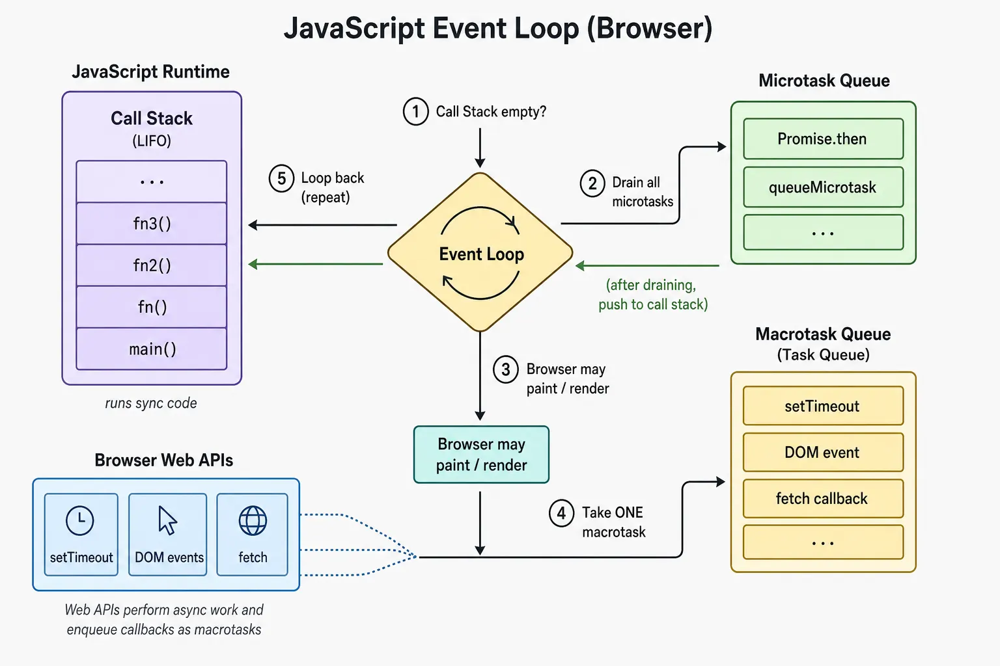

同步代码跑在 **call stack** 上。Host 在 stack 之外处理工作。**Event loop** 协调何时可以跑队列中的 callbacks。Closures 保留 lexical state。Promises、`async`/`await` 与 generators 暂停并恢复工作。

这篇 note 讲的是 code 何时运行。`class`、prototype 与 `this` 在 [TypeScript Class 与 Runtime Identity](/notes/typescript-classes-and-runtime-identity)。Queues 与 `5 1 3 4 2` 谜题：[深入理解 JavaScript Event Loop](/notes/javascript-event-loop-in-depth)。

<br />



<br />

- 同步代码跑在 stack 上。
- Host APIs 在 stack 外做完工作并 enqueue 一个 callback。
- 当 stack 为空，loop 排空 **microtask queue**，然后把 **一个** task 推上 stack。

---

## 1. Event Loop

浏览器每次 iteration 通常会跑 **一个 task**、排空 **所有 microtasks**、也许 render，然后再取另一个 task。

<br />

```ts
log.push("sync start")
setTimeout(() => log.push("macrotask"), 0)
Promise.resolve().then(() => log.push("microtask"))
log.push("sync end")
// ["sync start", "sync end", "microtask", "macrotask"]
```

<br />

- JavaScript 不会中断目前在 stack 上的代码。
- Timer 可能在后台结束；它的 callback 要等当前 task 及其 microtasks。
- **Failure:** 零毫秒的 timer 仍然不是立刻执行。Delay 只是 **timer task** 的下限。

---

## 2. Call Stack

**Call stack** 是 engine 目前正在执行什么的 last-in, first-out 记录。调用 function 会 push 一个 frame；return 或 throw 会把它 pop 掉。只有最顶端的 frame 在跑。

<br />

```ts
function factorialRecursive(n: number): number {
  if (n <= 1) return 1
  return n * factorialRecursive(n - 1)
}

function factorialIterative(n: number): number {
  let result = 1
  for (let i = 2; i <= n; i++) result *= i
  return result
}
```

<br />

- 深层 recursion 每次 call 消耗一个 frame，直到 engine 撞上上限。
- ES2015 规定了 proper tail calls；主流 engines 里只有 JavaScriptCore 实现了。Recursion depth 仍是实务上限。
- **Failure:** 紧密的 loop 并不分享 thread。它占有 thread —— 在它 return 之前没有 paint、clicks 或 timers。

---

## 3. Macrotask Queue

**Macrotask** 是非正式说法；HTML spec 通常说 **tasks**。Timers、用户交互与 messages 会 enqueue 工作。浏览器可能维持多条 queues 并 **选出** 一个可跑的 task，所以「一条全局 FIFO」只是漫画。

- Loop 跑一个被选出的 task，然后做一次 microtask checkpoint，再跑另一个 task。
- 嵌套的 `setTimeout` 调度的是 **未来** 的工作。典型顺序：`timeout-1` → `timeout-3` → `timeout-2`。
- **Failure:** 把 `setTimeout(fn, 0)` 当成「下一行之前」。它的意思是「一旦允许跑 timer task」。

---

## 4. Microtask Queue

**Microtasks** —— Promise handlers、`queueMicrotask`、`MutationObserver` —— 是 **同一条** thread 上优先级更高的 queue。一个 task 结束且 stack 为空之后，runtime 会把它们排空，**直到 queue 空掉**。

- 一个 microtask 再 queue 另一个 microtask，加进的是 **同一次** checkpoint。典型顺序：`micro-1` → `promise` → `micro-2` → `macrotask`。
- 这就是为什么 promise handler 会在已经就绪的 `setTimeout` 之前跑。
- **Failure:** 无界的 microtask chain 会无限推迟 timers、input 与 rendering —— 没有 `while` 的冻结。

---

## 5. Execution Context

**Execution context** 是 JavaScript 进入 global code 或调用 function 时创建的环境：bindings、outer lexical environment，以及 `this`。

<br />

```ts
const obj = {
  label: "object",
  regular(this: { label: string }): string {
    const arrow = (): string => this.label
    return arrow()
  },
}

obj.regular() // "object" — arrow captures the method's `this`
```

<br />

- 每次 call 都有自己的 context 与 stack frame。
- Function return 后 frame 被拿掉，但如果返回的 function close over 了它，lexical environment 仍可触达。
- Arrow functions 不创建自己的 `this`；它们从周围的 context 捕获。

---

## 6. Closures

**Closure** 不是一种特殊的 function。Function 带着它被创建时的 **lexical environment** 的访问权，即使外层 function 已经 return。

<br />

```ts
function createCounter(start = 0) {
  let count = start
  return {
    inc(): number {
      count += 1
      return count
    },
    value(): number {
      return count
    },
  }
}

const counter = createCounter(10)
counter.inc() // 11
counter.value() // 11 — `count` is private to the closure
```

<br />

- Private state、event handlers，以及许多 hook patterns 都是 closures。
- 被捕获的 objects 仍可触达。Callback close over 一棵大 tree，就可以把它 leak 住。
- **Failure:** 在 loop 里用 `var` 创建的 callbacks 共用一个 function-scoped binding。`let` 每次 iteration 创建一个新 binding。Closure 是活的 environment，不是值的副本。

---

## 7. Promises

**Promise** 是 `pending`，然后变成 `fulfilled` 或 `rejected`。调用 `.then`、`.catch` 或 `.finally` 并不会立刻跑 handler；settled 的 promise 把它排成 **microtask**。

<br />

```ts
function delay<T>(value: T, ms: number): Promise<T> {
  return new Promise((resolve) => setTimeout(() => resolve(value), ms))
}

const user = delay({ name: "Ada" }, 100)
const settings = delay({ theme: "dark" }, 50)

Promise.all([user, settings]).then(([u, s]) => {
  // "Ada", "dark" — after ~100 ms, not 150 ms
  console.log(u.name, s.theme)
})
```

<br />

- `Promise.all` 快速失败。`Promise.allSettled` 记录每一个 outcome。`Promise.race` 随第一个结果 settle。
- 在 await 它们之前先启动彼此独立的 promises，让底层工作重叠。
- **Failure:** 把 timer 包进 Promise 并不会让 timer 变成 microtask。`setTimeout` 仍然调度一个 **task**；`.then` 作为 microtask 跑在那个 task **之后**。

---

## 8. Async/Await

`async`/`await` 是 promises 上的语法，不是第二套 concurrency 系统。`async` function 永远返回一个 promise。碰到 `await` 就 yield；promise settle 之后，其余部分作为 **microtask** 继续。

<br />

```ts
async function loadDashboard(userId: string) {
  const userPromise = getJson<User>(`/api/users/${userId}`)
  const settingsPromise = getJson<Settings>("/api/settings")
  const [user, settings] = await Promise.all([userPromise, settingsPromise])
  return { user, settings }
}
```

<br />

- `await` 不会挡住 JavaScript thread，也不会让 JavaScript 变成多线程。它暂停的是 **那个** async function。连 `await Promise.resolve()` 都会 yield。
- `response.json() as T` assertion 描述期望的形状；它并不验证。
- **Failure:** 对彼此独立的 fetches 做顺序 `await` 就是 waterfall。一起启动，再 `Promise.all`。

---

## 9. Generators

**Generator**（`function*`）被调用时并不跑 body。它返回一个 iterator。每次 `.next()` 恢复执行，直到下一个 `yield` 或 function return。

<br />

```ts
function* range(start: number, end: number): Generator<number> {
  for (let i = start; i < end; i++) yield i
}

const values = range(0, 3) // body has not run
values.next() // { value: 0, done: false }
values.next() // { value: 1, done: false }
// 2 is not produced unless another value is requested.
```

<br />

- 值只在被请求时才产生 —— lazy sequence，不是一次性的 eventual result。
- **Async generator** 让 `.next()` 返回 promise；`for await...of` 等待每一个结果。这适合 paginated responses 与 streams。
- **Failure:** 在非 async generator 里把 `yield` 当成 `await`。Promises 协调一个 eventual value。Generators 协调一连串 pauses。

---

## 要点

Call stack 与 execution contexts 解释 **目前** 在跑什么。Task queues、microtasks 与 event loop 解释延后的工作 **何时** 可以跑。Closures 解释为什么 state 仍可触达。Promises、`async`/`await` 与 generators 组织会暂停与恢复的工作。

当 async 代码出乎意料时：**目前 stack 上是什么？什么被排成 microtask？什么必须等下一个 task？**

---

## Recap Q&A

<Accordion type="single" collapsible>
  <AccordionItem value="js-event-loop-stack">
    <AccordionTrigger>1. Call stack 与 event loop 如何共用同一条 thread？</AccordionTrigger>
    <AccordionContent>

      - 同步代码跑在 **call stack** 上。只有最顶端的 frame 在执行。JavaScript 不会中断目前在 stack 上的 function。
      - Timer 可能在后台结束，但它的 callback 要等当前 task 及其 microtasks 做完。
      - 深层 recursion 仍会消耗 frames；主流 engines 里，recursion depth 仍是实务上限。
      - **Event loop** 是协调者，不是第二条 thread：**一个 task**，排空 **所有 microtasks**，也许 render，再另一个 task。
      - **Failure:** 紧密的 loop「分享 thread」—— 它占有 thread。

    </AccordionContent>
  </AccordionItem>

  <AccordionItem value="js-macro-micro">
    <AccordionTrigger>2. Task 与 microtask 有什么差别？</AccordionTrigger>
    <AccordionContent>

      - 非正式写法说 **macrotasks**；HTML spec 通常说 **tasks**。Timers、用户交互与 messages enqueue tasks。
      - 跑完一个被选出的 task 之后，runtime 在选出下一个之前做一次 microtask checkpoint。嵌套的 `setTimeout` 不能在父级当前这一轮里继续。
      - **Microtasks** —— Promise handlers、`queueMicrotask`、`MutationObserver` —— 会排空，**直到 queue 空掉**。
      - 这就是为什么 promise handler 会在已经就绪的 `setTimeout` 之前跑。它们是 **同一条** thread 上优先级更高的 queue，不是更快的 queue。
      - **Failure:** 无界的 microtask chain 会无限推迟 timers、input 与 rendering。

    </AccordionContent>
  </AccordionItem>

  <AccordionItem value="js-closures">
    <AccordionTrigger>3. Closure 是什么，它保留了什么？</AccordionTrigger>
    <AccordionContent>

      - **Closure** 不是一种特殊的 function。Function 带着它被创建时的 **lexical environment** 的访问权，即使外层 function 已经 return。
      - 这就是 private state、event handlers，以及许多 hook patterns 之所以可能。
      - 被捕获的 objects 仍可触达，所以 callback close over 一棵大 tree，就可以把它 leak 住。
      - 在 loop 里用 `var` 创建的 callbacks 共用一个 function-scoped binding；`let` loop 变量每次 iteration 创建一个新 binding。
      - **Failure:** 把 closure 当成值的副本，而不是活的 environment。

    </AccordionContent>
  </AccordionItem>

  <AccordionItem value="js-promises-await">
    <AccordionTrigger>4. Promises 与 async/await 实际上如何暂停工作？</AccordionTrigger>
    <AccordionContent>

      - **Promise** 是 `pending`，然后变成 `fulfilled` 或 `rejected`。调用 `.then` 并不会立刻跑 handler；settled 的 promise 把它排成 **microtask**。
      - `Promise.all` 快速失败，`allSettled` 记录每一个 outcome，`race` 随第一个结果 settle。在 await 它们之前先启动彼此独立的 promises，让工作重叠。
      - `async`/`await` 是 promises 上的语法。`async` function 永远返回一个 promise。`await` 会 yield；settle 之后，其余部分作为 microtask 继续。
      - 它不会挡住 thread，也不会让 JavaScript 变成多线程。
      - **Failure:** 对彼此独立的 fetches 做顺序 `await` 就是 waterfall。把 timer 包进 Promise，`resolve` 仍然走 **task**。

    </AccordionContent>
  </AccordionItem>

  <AccordionItem value="js-generators">
    <AccordionTrigger>5. 什么时候该用 generator 而不是 Promise？</AccordionTrigger>
    <AccordionContent>

      - 调用 **generator**（`function*`）并不跑 body。它返回一个 iterator；每次 `.next()` 恢复执行，直到下一个 `yield` 或 function return。
      - 值只在被请求时才产生 —— lazy sequence，不是一次性的 eventual result。
      - **Async generator** 让 `.next()` 返回 promise；`for await...of` 等待每一个。这适合 paginated responses 或 streams。
      - Promises 协调一个 eventual value。Generators 协调一连串 pauses。
      - **Failure:** 在非 async generator 里把 `yield` 当成 `await`。

    </AccordionContent>
  </AccordionItem>
</Accordion>
