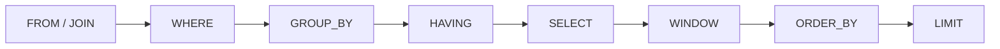

可以每天用 Drizzle 出货，却仍然不清楚 Postgres 对一条 statement 做了什么。ORM 给 query 加上类型。Database 求值的仍然是一个 **relation**：rows 进去，rows 出来，逻辑顺序固定。

这些笔记把 SQL 当成一条 pipeline。`FROM` 与 `JOIN` 造出工作中的 row set。`WHERE` 丢掉 rows。`GROUP BY` 与 `HAVING` 折叠并过滤 groups。`SELECT` 给 output 命名。Window functions 在那份 output 上计算，但不折叠它。`ORDER BY` 与 `LIMIT` 是最后一刀。Schema、RLS 与 migrations 是接线 —— [用 Hono、Drizzle、Zod OpenAPI 与 SST 打造 Backend APIs](/notes/backend-apis-hono-sst) 和 [用 Hono、Better Auth、Drizzle 与 Postgres RLS 打造 Multi-Tenant 后端](/notes/multi-tenant-backend-drizzle-hono-better-auth)。这篇 note 讲的是 statement。

<br />

例子共用一家 shop：customers、orders、line items。Constraints 写在 `CREATE TABLE` 里。Indexes 等到讲 cost 再出现。

<br />

```sql
CREATE TABLE customers (
  id         uuid PRIMARY KEY DEFAULT gen_random_uuid(),
  email      text NOT NULL UNIQUE,
  name       text NOT NULL,
  created_at timestamptz NOT NULL DEFAULT now()
);

CREATE TABLE orders (
  id          uuid PRIMARY KEY DEFAULT gen_random_uuid(),
  customer_id uuid NOT NULL REFERENCES customers (id),
  status      text NOT NULL,
  created_at  timestamptz NOT NULL DEFAULT now()
);

CREATE TABLE order_items (
  id         uuid PRIMARY KEY DEFAULT gen_random_uuid(),
  order_id   uuid NOT NULL REFERENCES orders (id),
  sku        text NOT NULL,
  qty        integer NOT NULL CHECK (qty > 0),
  unit_cents integer NOT NULL CHECK (unit_cents >= 0),
  UNIQUE (order_id, sku)
);
```

<br />

---

## Pattern 地图

| Pattern | Typical input | Reach for it when |
| --- | --- | --- |
| Exists | Outer row，related table | 需要「至少有一条」/「一条都没有」，又不想把 outer row 复制出来 |
| Keyset pagination | Ordered list | 从已知的 `(created_at, id)` 取下一页，而不是 `OFFSET` |
| Upsert | 可能碰撞的 insert | Unique key 已经存在 —— 用 `ON CONFLICT`，不要 check-then-insert |
| Top-N-per-group | 按 key 分区的 rows | 每个 customer 最新的 order、每个 order 的 top SKUs —— `ROW_NUMBER()` |

<br />

Patterns 是最后一段。Pipeline 在先。

<br />

---

## 1. Relation 进去，relation 出来

Table 是一个有名字的 relation：一袋 rows，每行是一组 columns 的 tuple。`SELECT` 不是一段去拜访 table 的 procedure。它是一个表达式：吃进 relations，吐出 relation。结果的形状 —— 哪些 columns、多少 rows —— 由 statement 决定，不是由 application code 里的 loop 决定。

<br />

**Key** 是对「哪些 rows 可以存在」的 constraint，不是给 planner 的 hint。`PRIMARY KEY` 说这一列标识这行。`customers.email` 上的 `UNIQUE` 说两个 customers 不能共用一个 email。`REFERENCES` 说 order 不能点名一个不存在的 customer。Application 里的 `WHERE` 替代不了其中任何一条。

<br />

**`NULL` 不是一个值。** 它是值的缺席。`WHERE email = NULL` 永远不为 true；predicate 是 `IS NULL`。与 `NULL` 比较得到 unknown，而 `WHERE` 只留下 true。所以 subquery 可能返回 `NULL` 时，`NOT IN (SELECT …)` 会变成陷阱；`NOT EXISTS` 才是仍然说它所声称之事的 anti-join。

<br />

---

## 2. 逻辑求值顺序

Postgres 不会按书写顺序从左到右跑 statement。它跑的是一条 **logical** pipeline。物理执行 —— hash vs nested loop、index vs seq scan —— 是必须保住这层含义的后续选择。

<br />



<br />

`FROM` / `JOIN` 造出工作中的 row set。`WHERE` 过滤 **rows**。`GROUP BY` 把 rows 折叠成 groups；`HAVING` 过滤 **groups**。`SELECT` 给 output columns 命名。Window functions 再在那份结果上计算，而不继续折叠。`ORDER BY` 排序。`LIMIT` 截断。`WITH` CTE 是插进 `FROM` 的 named subquery。它不是另一台引擎。

<br />

这个顺序解释了为什么 `SELECT` alias 对 `WHERE` 不可见，以及为什么 window function 不能出现在 `WHERE` 或 `HAVING` 里。那些子句已经跑完了。要按 window 过滤，用 subquery 或 CTE —— 再一次 `FROM`。

<br />

```sql
-- legal: filter rows before grouping
SELECT customer_id, count(*) AS order_count
FROM orders
WHERE status = 'shipped'
GROUP BY customer_id
HAVING count(*) >= 3;

-- illegal: alias and window are not in scope for WHERE
-- SELECT count(*) AS order_count FROM orders WHERE order_count > 0;
-- SELECT row_number() OVER (ORDER BY created_at) AS n FROM orders WHERE n = 1;
```

<br />

---

## 3. JOIN

Join 是 `FROM` 造出更宽一行的方式。**Inner** 留下 matches。**Left** 留下每一行左边，右边没有 match 时填 `NULL`。**Anti-join** 留下 **没有** match 的左边 —— 没有 orders 的 customers，没有 items 的 orders。

<br />

```sql
-- inner: orders that have a customer (all of them, given the FK)
SELECT c.email, o.id AS order_id, o.status
FROM orders o
JOIN customers c ON c.id = o.customer_id;

-- left: every customer, orders if they exist
SELECT c.email, o.id AS order_id
FROM customers c
LEFT JOIN orders o ON o.customer_id = c.id;
```

<br />

Left join 会按 order 的数量把 customer 复制出来。那是 cardinality 陷阱：join 之后不做 grouping 就 aggregate，会把同一个 customer 数成他们有多少张 orders。问题是「谁一张都没有？」时，不要把 `LEFT JOIN … WHERE right.id IS NULL` 当成第一反射。`NOT EXISTS` 是不会复制、也不会被 `NULL` 弄坏的 anti-join。

<br />

```sql
SELECT c.email
FROM customers c
WHERE NOT EXISTS (
  SELECT 1
  FROM orders o
  WHERE o.customer_id = c.id
);
```

<br />

---

## 4. Aggregation

`GROUP BY` 是折叠。`WHERE` 之后，剩下的 rows 按 grouping keys 分区。每个 group 变成一行 output。未分组的 columns 不能出现在 `SELECT` 里，除非包进 aggregate —— Postgres 会拒绝这条 statement，而不是随便挑一个值。

<br />

`HAVING` 是 groups 的 `WHERE`。`WHERE` 看不见 `count(*)`。`HAVING` 可以。

<br />

```sql
SELECT
  c.id,
  c.email,
  count(o.id) AS order_count,
  coalesce(sum(oi.qty * oi.unit_cents), 0) AS revenue_cents
FROM customers c
LEFT JOIN orders o ON o.customer_id = c.id
LEFT JOIN order_items oi ON oi.order_id = o.id
GROUP BY c.id, c.email
HAVING count(o.id) >= 1;
```

<br />

`count(o.id)` 会忽略 left join 带来的 `NULL`，所以没有 orders 的 customers 是 `0`，会被 `HAVING` 丢掉。`count(*)` 会把那行空的 joined row 算成一。你选的 aggregate 是在陈述哪些 rows 存在，不是「多少」的同义词。

<br />

---

## 5. Windows

Window function 在相关 rows 上计算，**但不折叠它们**。`PARTITION BY` 是 group。`OVER` 里的 `ORDER BY` 是这个 group 内部的顺序。结果是每个 input row 一个值，不是每个 group 一行。

<br />

这就是与 `GROUP BY` 的差别。Aggregation 回答「这个 customer 的 sum 是多少？」Windows 回答「这一行在该 customer 的 orders 里排第几？」并且仍然返回每一张 order。

<br />

```sql
SELECT
  o.customer_id,
  o.id AS order_id,
  o.created_at,
  row_number() OVER (
    PARTITION BY o.customer_id
    ORDER BY o.created_at DESC, o.id DESC
  ) AS recency,
  sum(order_total.cents) OVER (
    PARTITION BY o.customer_id
    ORDER BY o.created_at, o.id
  ) AS running_cents
FROM orders o
JOIN (
  SELECT order_id, sum(qty * unit_cents) AS cents
  FROM order_items
  GROUP BY order_id
) order_total ON order_total.order_id = o.id;
```

<br />

`row_number()` 是那条 essential window。在外层 query 里过滤 `recency = 1`，就得到每个 customer 最新的 order。Running `sum()` 是另一半：一个随每张 order 增长的 frame。Join 先做 aggregation，line items 才不会把 window 炸开。两个 windows 都不属于 `WHERE`。

<br />

---

## 6. Patterns

开头那张地图是四种形状。每一种都是 shop 上的一条短 statement。

<br />

**Exists。** 「至少有一张 shipped order」是 semi-join。`JOIN` 加 `DISTINCT` 也能答，同时会把 row count 炸开。`EXISTS` 在第一条 match 处停下，并保持 outer row 完整。

<br />

```sql
SELECT c.email
FROM customers c
WHERE EXISTS (
  SELECT 1
  FROM orders o
  WHERE o.customer_id = c.id
    AND o.status = 'shipped'
);
```

<br />

**Keyset pagination。** `OFFSET n` 仍然要走过 `n` 行。Keyset seek 从你已经拿到的最后一行之后开始。Sort key 必须 unique —— `(created_at, id)` —— 否则共享同一个 timestamp 的 rows 会跳过或重复。

<br />

```sql
SELECT id, customer_id, created_at
FROM orders
WHERE (created_at, id) < (:cursor_created_at, :cursor_id)
ORDER BY created_at DESC, id DESC
LIMIT 20;
```

<br />

**Upsert。** Check-then-insert 会 race。`ON CONFLICT` 是对着 schema 已经声明的 unique key 的一条 statement —— `customers.email`，或 `(order_id, sku)`。

<br />

```sql
INSERT INTO customers (email, name)
VALUES ('ada@example.com', 'Ada')
ON CONFLICT (email) DO UPDATE
SET name = excluded.name
RETURNING id;
```

<br />

**Top-N-per-group。** `GROUP BY` 没法在一次里留下「top」那一行的未分组 columns。给 rows 编号，再留下 `n <= 2`。

<br />

```sql
SELECT customer_id, order_id, created_at
FROM (
  SELECT
    o.customer_id,
    o.id AS order_id,
    o.created_at,
    row_number() OVER (
      PARTITION BY o.customer_id
      ORDER BY o.created_at DESC, o.id DESC
    ) AS n
  FROM orders o
) ranked
WHERE n <= 2;
```

<br />

---

## 7. Cost

**Index** 是让 lookup 变便宜、write 稍贵一点的 data structure。它不是 constraint。强制 `customers.email` 的 unique index 两者都是；`orders.customer_id` 上的普通 index 只是 access path。

<br />

没有这条 path，`WHERE customer_id = $1` 就是 sequential scan：每次每一行。笔电上瞬间返回。Production 里随数据线性变慢。

<br />

```sql
EXPLAIN SELECT id, status
FROM orders
WHERE customer_id = '11111111-1111-1111-1111-111111111111';

-- Seq Scan on orders
--   Filter: (customer_id = '11111111-…')
```

<br />

```sql
CREATE INDEX orders_customer_id_created_at_idx
  ON orders (customer_id, created_at DESC, id DESC);

EXPLAIN SELECT id, status
FROM orders
WHERE customer_id = '11111111-1111-1111-1111-111111111111';

-- Index Scan using orders_customer_id_created_at_idx on orders
--   Index Cond: (customer_id = '11111111-…')
```

<br />

同一个 index 也覆盖 keyset query：`customer_id` 上的 equality，再沿 `created_at DESC, id DESC` 走。`EXPLAIN` 用来确认你写的 statement 是你以为的 access path。`EXPLAIN (ANALYZE)` 用来对照真实 row counts。凭本地数据猜测，是 seq scan 被送上线的方式。

<br />

---

## 8. Failure

两个 requests 读 `qty`，都加一，都 write。每个 transaction 看起来都正确。这一行跳过了一个数字。Isolation 没有神秘地失败。模式是 check-then-act，而 database 从未被要求把它做成 atomic —— 没有 `UPDATE order_items SET qty = qty + 1`，也没有 `UNIQUE` 去拒绝重复 insert。

<br />

```sql
-- lost update if two sessions do: read qty, add 1, write qty
UPDATE order_items
SET qty = qty + 1
WHERE id = :id;

-- missing unique: two inserts of the same email both succeed
-- UNIQUE (email) on customers is the constraint; ON CONFLICT is the statement
```

<br />

忘掉 unique constraint，是再多小心的 `WHERE` 事后也修不好的 data bug。没有 atomic update 或 constraint 的 read-modify-write，是等流量到来的 lost update。Schema 才是 API。Application filters 是习惯。

<br />

这套 stack 的 isolation 路径 —— transactions、row-level security、tenant context —— 见 [用 Hono、Better Auth、Drizzle 与 Postgres RLS 打造 Multi-Tenant 后端](/notes/multi-tenant-backend-drizzle-hono-better-auth)。Typed schema、pool，以及作为 deploy step 的 migrations，见 [用 Hono、Drizzle、Zod OpenAPI 与 SST 打造 Backend APIs](/notes/backend-apis-hono-sst)。

<br />
