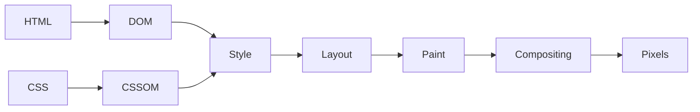
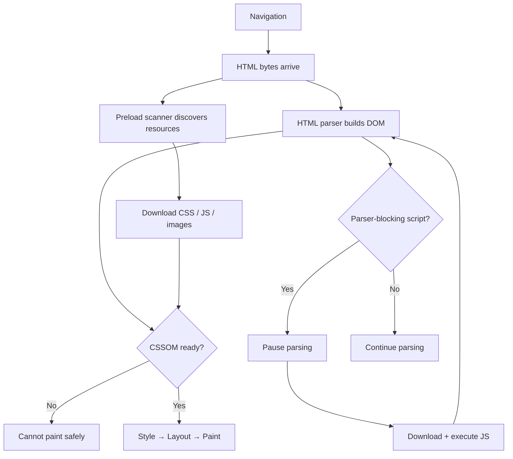
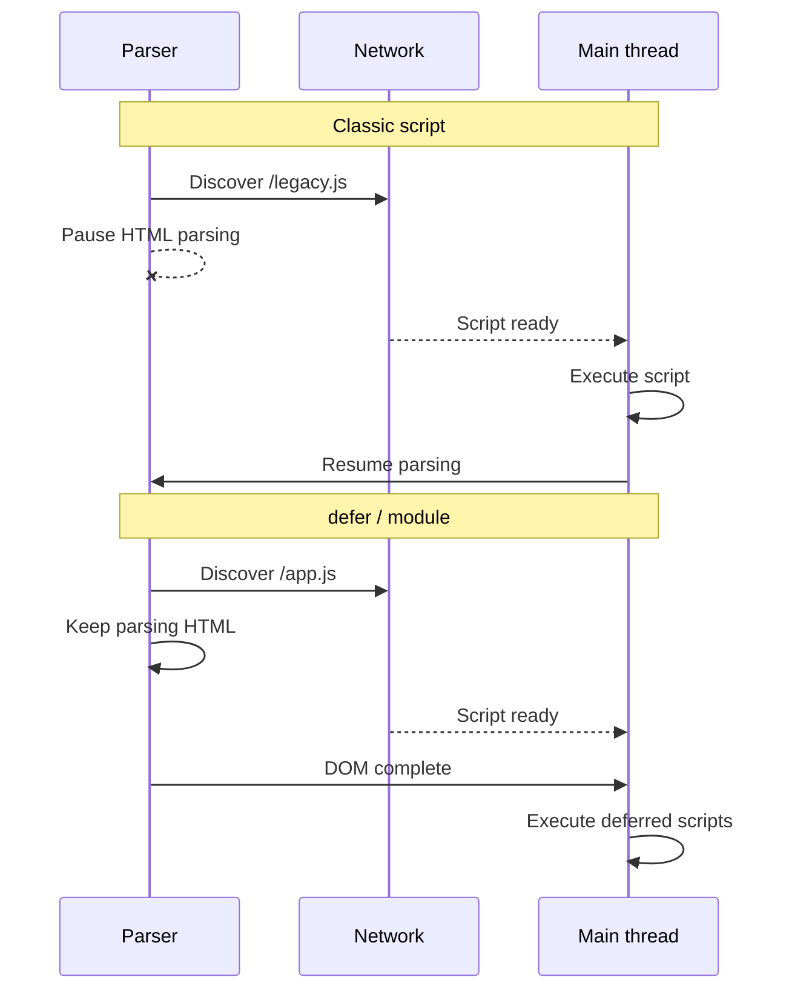
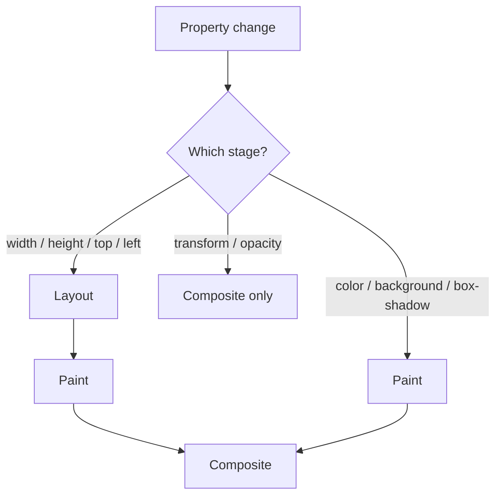
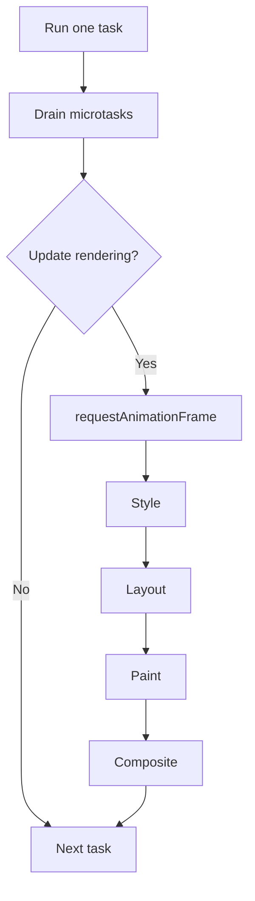
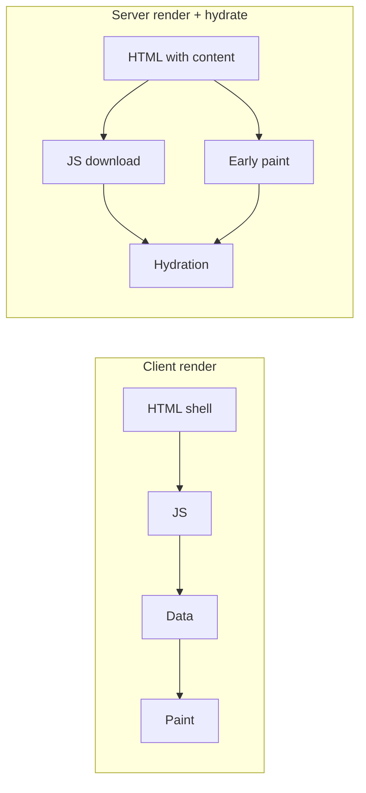
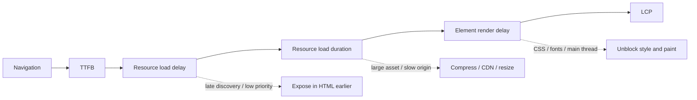

Browser 不会等整页下载完才一次渲染。它会串流 HTML、发现资源、构建内部 trees、执行 JavaScript、计算 geometry，并逐步 paint。

**Critical rendering path** 是从 navigation 到初始视图所需 pixels 之间的依赖链。它横跨 network、HTML parser、CSS engine、JavaScript runtime，以及 rendering pipeline。

有用的性能问题不只是「页面有多大？」，而是：**哪一项资源或 main-thread 任务，正在阻止 browser 产出下一个重要的 frame？**

<br />

---

## 1. The Rendering Pipeline

简化模型如下：

<br />



<br />

真实的 browser 会 pipeline 并重复这些阶段。DOM 可以在 HTML 仍在到达时构建，资源可以并行下载，browser 也可以在 document 尚未完成时就 paint。之后 JavaScript 仍可能让 style、layout 或 paint 失效。

因此 critical path 是一张 **dependency graph**，而不是固定序列。晚到的 stylesheet 会延迟 rendering。Parser-blocking script 会延迟 markup 与资源发现。即使所有资源都已 cached，大型 JavaScript task 仍会延迟 painting。

<br />



<br />

---

## 2. Network、HTML 与 Resource Discovery

Rendering 始于 document request。DNS、connection setup、TLS、redirects，以及 server response time，都发生在 browser 能解析有用 HTML 之前。缓慢的 **Time to First Byte** 会把后面每个阶段都往后推。

串流 HTML 让 browser 能在 server 尚未完成生成响应前就开始处理。因此 critical CSS、fonts、images，以及可见的 markup，应尽早出现在 response 中。

HTML parser 把 bytes 解码成 tokens，并逐步构建 DOM。Browsers 也会使用 **speculative preload scanner** 预先查找 declarative resources，例如：

- `<link rel="stylesheet">`
- `<script src>`
- `` 与 `srcset`
- `<link rel="preload">`

这个 scanner 可以在 main parser 被挡住时仍开始发 request。它无法可靠地发现由 JavaScript 创建、由稍后 API request 返回，或引用于尚未加载 CSS 中的资源。

因此 declarative HTML 本身就是一项性能特性。`` 对 browser 立刻可见；在 JavaScript 与数据抓取之后才算出来的 image URL，则变成晚到的依赖。

<br />

---

## 3. CSS 与 JavaScript Blocking

CSS 会被解析成 **CSSOM**。Browser 需要适用的 styles，才能决定有哪些 boxes，以及它们应如何呈现。

放在 document head 的外部 stylesheet，通常是 render-blocking：

<br />

```html
<link rel="stylesheet" href="/app.css" />
```

<br />

CSS 通常不会阻止 DOM construction，但会阻止依赖未完成 styles 的内容被 paint。它也可能延迟后面的 script，因为 JavaScript 可能会检查 computed styles：

<br />

```html
<link rel="stylesheet" href="/app.css" />
<script>
  console.log(getComputedStyle(document.body).color)
</script>
```

<br />

Script 要等 CSS，parser 又要等 script。一份 stylesheet 现在同时影响 rendering 与 parsing。

CSS `@import` 会造成另一条 waterfall，因为 imported files 要等到 parent stylesheet 下载并解析后才会被发现。直接的 `<link>` 元素能更早暴露 requests。

### Script loading

没有额外 attributes 的 classic script，在遇到时会挡住 parser：

<br />

```html
<script src="/legacy.js"></script>
```

<br />

替代方案有不同语义：

| Script | Execution | Ordering |
| --- | --- | --- |
| Classic | Blocks parser | Document order |
| `defer` | After parsing | Document order |
| `async` | As soon as ready | Load order |
| `type="module"` | Deferred by default | Module dependency order |

<br />



<br />

应用代码通常应使用 module 或 `defer`。独立的 analytics 可以用 `async`。

Defer 一个 script 能移除 parser blocking，但不会消除它的 CPU 成本。Browser 仍需要 transfer、parse、compile 并 execute。大型 startup tasks 即使在 DOM ready 之后，仍可能延迟 rendering 与交互。

<br />

---

## 4. Style、Layout、Paint 与 Compositing

### Style calculation

Browser 会把 DOM 与 CSSOM 结合，并解析 cascade、inheritance、relative values，以及 matching rules。结果决定哪些 boxes 参与 rendering。

DOM nodes 与 boxes 并非一对一对应：

- `display: none` 会把 subtree 从 layout 移除。
- `visibility: hidden` 会保留 layout 空间。
- Pseudo-elements 可以在没有 DOM nodes 的情况下创建 boxes。
- Text 可以产生多个 line boxes。

大型 DOMs 与大范围 invalidation，通常比微优化普通 selectors 更重要。

### Layout

Layout 计算 box positions、dimensions、line breaks 与 relationships。宽度变更可能影响 descendants、重排文本，并移动 container 下方的所有内容。

Browsers 会把这类工作 batch 到需要 geometry 为止。交错 writes 与 reads 可能迫使重复的 synchronous layouts：

<br />

```ts
for (const card of cards) {
  card.style.width = "50%"
  console.log(card.offsetWidth)
}
```

<br />

Write 会让 layout 失效；`offsetWidth` 则要求当前 geometry。应改为先 batch reads，再写入：

<br />

```ts
const widths = cards.map((card) => card.offsetWidth)

for (const [index, card] of cards.entries()) {
  card.style.width = `${widths[index] / 2}px`
}
```

<br />

像 `getBoundingClientRect`、`offsetWidth` 与 `getComputedStyle` 这类 APIs 本身并不慢。当它们迫使 browser flush 尚未完成的 style 或 layout 工作时，才会变得昂贵。

### Paint and compositing

Paint 会记录文本、背景、边框、images、阴影与特效的 drawing commands。Browser 会把这些工作 rasterize 成 tiles，并可能把内容放到 composited layers。

<br />



<br />

使用 `transform` 与 `opacity` 的 animations，往往可以在 compositor 上执行，而不需新的 layout 或 paint：

<br />

```css
.panel {
  transition:
    transform 180ms ease,
    opacity 180ms ease;
}
```

<br />

动画化 `width`、`height`、`top` 或 `left`，通常会触发 layout 与 paint。Compositor 工作也不是免费的：layers 占用内存、需要 rasterization，而且每 frame 都要组装。到处套用 `will-change` 可能反而让性能更差。

<br />

---

## 5. Main Thread 与 Rendering Opportunities

JavaScript 与大部分 rendering 工作共用 main thread。简化的 event-loop turn 如下：

<br />



<br />

Browser 不会在每个 task 之后都 paint，但它需要 main thread 变得可用。长时间的 JavaScript tasks 会延迟 input 与 frames。无上限的 microtask chain 也可能饿死 rendering，因为 browser 会先 drain microtasks 才继续往下。

当 UI 需要响应机会时，应把 CPU-heavy 工作拆成较小的 tasks。用 `requestAnimationFrame` 让视觉 writes 对齐 frame，而不是拿它做昂贵计算。当通信成本合理时，可把适合的 CPU 工作移到 Web Worker。

<br />

---

## 6. 优化初始视图

初始 render 通常需要可见 HTML、适用的 CSS、blocking scripts、main-thread rendering time，以及结果所需的任何 image 或 font。它不需要 below-the-fold media、analytics、chat widgets，或大部分交互代码。

该依赖链可按以下顺序优化：

1. 减少 redirects 与 TTFB；尽早串流有用的 HTML。
2. 让 critical CSS、fonts 与 LCP image 可从 HTML 被发现。
3. 移除 parser-blocking scripts 与 CSS import chains。
4. 减少 critical CSS 与 JavaScript，而不只是总页面大小。
5. 把 third-party 代码留在初始 path 之外。
6. 减少 style、layout、paint 与 hydration 工作。

有选择地使用 resource hints：

<br />

```html
<link rel="preconnect" href="https://cdn.example.com" crossorigin />
<link
  rel="preload"
  href="/hero.avif"
  as="image"
  type="image/avif"
  fetchpriority="high"
/>
```

<br />

`preconnect` 会消耗资源来准备 connection。`preload` 会竞争 bandwidth，且必须与最终 request 的 type 与 credentials mode 一致。过度使用任何一个，都可能延迟更重要的资源。

为 images 提供 dimensions，让 layout 空间在加载前就存在：

<br />

```html

```

<br />

不要 lazy-load LCP image。对屏幕外的 media 使用 `loading="lazy"`。

对于 fonts，提供 WOFF2 subsets，并允许 fallback text 先渲染：

<br />

```css
@font-face {
  font-family: "Inter";
  src: url("/fonts/inter-latin.woff2") format("woff2");
  font-display: swap;
  font-weight: 100 900;
}
```

<br />

在长页面上，`content-visibility: auto` 可以跳过屏幕外的 rendering 工作。CSS containment 与 list virtualization 也能减少工作量，但两者都会改变行为，应在测量之后才引入。

<br />

---

## 7. Framework Rendering 与 Hydration

Client-rendered application 往往要等到 JavaScript、framework startup 与 data fetching 完成后，才会出现有意义的内容。

Server rendering 把内容与资源引用移进 HTML，让更早的 discovery 与 paint 成为可能。它并没有消除 JavaScript 成本。一页可以很快 paint，然后在大型 hydration task 执行时变得无法响应。

<br />



<br />

Streaming SSR、selective hydration、islands 与 Server Components，都在处理同一个问题：减少 startup 工作，并把非关键 JavaScript 留在初始 dependency chain 之外。

相关的架构问题是：

- 哪些内容必须出现在第一份 HTML response？
- 哪些 components 需要 client-side JavaScript？
- Code 与 data 何时变得可被发现？
- Hydration 能否在更小的 boundaries 进行？
- Framework 是否正在造成 server-to-client request waterfalls？

<br />

---

## 8. 测量这条 Path

使用 production build，并同时检查 Network waterfall 与 Performance trace：

- **Network** 揭示晚到的 discovery、priority、queueing 与 transfer time。
- **Main** 揭示 parsing、script execution、style、layout、paint 与 long tasks。
- **Frames** 揭示错过的 rendering deadlines。
- **Experience** 揭示 layout shifts 与 Core Web Vitals。

对于缓慢的 **Largest Contentful Paint**，把时间拆成：

1. **TTFB**
2. **Resource load delay**
3. **Resource load duration**
4. **Element render delay**

<br />



<br />

高 load delay 指向 discovery 或 priority。高 load duration 指向 asset 大小或 origin 速度。高 render delay 指向 CSS、fonts、decoding、JavaScript，或 main-thread contention。

周围的 metrics 说明不同失败：

- **FCP**：第一个内容何时出现。
- **LCP**：最大可见内容何时出现。
- **CLS**：非预期的位移。
- **INP**：交互到下一次 paint 的延迟。

一页可以有很快的 LCP，但若 hydration 或 third-party scripts 之后占用 main thread，INP 仍可能很差。Lab traces 解释原因；real-user monitoring 显示用户有多常遇到它们。

<br />

---

## 最终心智模型

Critical rendering path 消耗三种有限资源：

- **Network time**：发现并传输关键 bytes。
- **Main-thread time**：parse、execute、style 与 lay out。
- **Rendering capacity**：paint、rasterize 与 composite frames。

快速的页面会尽早暴露重要资源、避免意外 blockers、减少 startup JavaScript、预留 layout 空间，并把初始 viewport 之外的工作延后。

目标不是让每个资源立刻加载，而是在 navigation 与用户前来查看的那些 pixels 之间，建立最短可能的 dependency chain。
