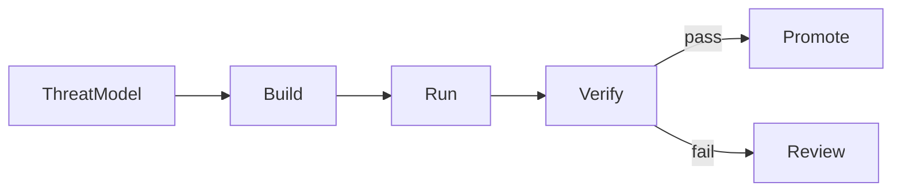

**DevSecOps** 是把信息安全整合到软件交付生命周期的实践。安全不再只是发布前的最后一次检查，而是覆盖设计、开发、持续集成、部署与日常运维的一系列决策和控制。

本文集中讨论交付流程。应用层风险见 [Web Security and the OWASP Top 10](/notes/web-security-owasp-top-10)，完整的交付管线见 [React 与 React Native 的 Frontend CI/CD](/notes/frontend-ci-cd-for-react-and-react-native)，以 stage 管理基础设施则见 [用 SST 管理 AWS 基础设施与 DevOps](/notes/using-sst-for-aws-infra-and-devops)。

<br />

---

## 1. 心智模型

DevSecOps 流程可以分成三项持续进行的活动：

- **Build** — 控制哪些代码、依赖和工作流定义可以进入代码库。
- **Run** — 限制 CI/CD 管线及其凭证可以执行的操作。
- **Verify** — 收集足够证据，判断制品是否适合发布。



<br />

| 活动       | 主要问题                                       | 风险示例                                            |
| ---------- | ---------------------------------------------- | --------------------------------------------------- |
| **Build**  | 变更是否加入了非预期的代码、依赖或工作流行为？ | 被入侵的包或可变的 CI Action 被纳入 build           |
| **Run**    | 管线使用哪个身份？它可以访问哪些资源？         | Pull-request job 获得 production 凭证或过大的云权限 |
| **Verify** | 制品被 promote 前，哪些检查必须通过？          | 未经安全扫描、来源证明或审批便直接发布              |

这些控制是应用安全的补充，而不是替代品。应用仍然需要身份验证、授权、输入验证与数据保护。[Next.js 里的 Security](/notes/security-in-next-js) 详细说明这些 web application concerns。

<br />

---

## 2. 把安全放进整个生命周期

不同的安全活动会提供不同类型的证据：

- **威胁建模（threat modeling）** 在开发前识别重要资产、信任边界、可能的滥用场景与合适的控制。
- **自动化检查** 对每项相关变更提供可重复的反馈。
- **人工审查和渗透测试** 检查自动化工具未必能理解的行为。
- **运行时监控** 在发布后检测可疑或非预期行为。

**Shift left** 是把有用的反馈提前到生命周期较早的阶段，让问题更容易修正。它不代表所有安全责任都交给开发人员。平台与安全团队仍然需要提供可复用的控制、指南与事故支持；开发人员则把这些控制应用到自己负责的系统。

自动化检查也需要明确的处理政策。检测结果可以阻挡 pull request、要求发布前审批，或建立有期限的修复项。应采取哪种处理方式，取决于严重程度、可达性、可信度和系统本身的风险。

<br />

---

## 3. 从 Threat Model 开始

团队先确认需要保护的对象，工具才有清晰目的。

| Asset                   | Security concern                     | 常见位置                                                                     |
| ----------------------- | ------------------------------------ | ---------------------------------------------------------------------------- |
| **User session**        | 攻击者可能冒充用户                   | Better Auth session cookie；见 [OWASP A07](/notes/web-security-owasp-top-10) |
| **Runtime secrets**     | 攻击者可能获得应用或数据库访问权限   | Link 到服务器端资源的 SST Secrets                                            |
| **Deployment identity** | 攻击者可能改变 production 执行的内容 | GitHub OIDC federation 到 AWS IAM role                                       |
| **Release artifact**    | 未经审查或被篡改的代码可能到达用户   | CI 生成的 web 或 mobile 制品                                                 |

从这些资产可以推导出具体的安全目标：

- Release 只包含已审查的代码与获准使用的依赖。
- Secrets 只留在需要它们的环境和 workload。
- Deployment credentials 使用短有效期，并限制权限范围。
- Promoted artifact 可以追溯到来源 commit 和 build process。
- 基础设施变更以可审查的 diff 呈现。

这些目标可用于选择控制，并决定哪些失败需要阻挡交付。

<br />

---

## 4. 各类安全检查提供什么

每一类检查观察系统的不同部分。任何单一扫描工具都不能证明应用已经安全。

| Control                                          | 提供的证据                                          | 常见执行位置                                   |
| ------------------------------------------------ | --------------------------------------------------- | ---------------------------------------------- |
| **Software composition analysis（SCA）**         | 识别依赖中已知的漏洞和违反政策的情况                | Pull request 或 scheduled scan                 |
| **Secret scanning**                              | 检测提交到代码库或出现在 logs 的凭证和 private keys | Pre-commit、pull request 与 repository history |
| **Static application security testing（SAST）**  | 在不运行应用的情况下找出指定的不安全模式            | Pull request                                   |
| **Infrastructure-as-code scanning**              | 检查资源定义中过大的权限或 network exposure         | Pull request                                   |
| **Dynamic application security testing（DAST）** | 从运行中的应用观察安全问题                          | Preview、staging 或 release                    |
| **SBOM 与 provenance**                           | 记录 release artifact 的内容和来源                  | Build 与 release                               |

检查结果仍需要结合实际场景。例如，一项 SCA finding 可能位于 production 不会执行的代码路径；相反，分数较低的问题也可能影响公开的身份验证流程。团队应记录哪些严重程度和条件会阻挡交付、例外如何审批，以及例外何时到期。

Pull-request workflow 可以避免质量与安全 jobs 获得不必要的权限：

```yaml title="quality job"
name: CI

on:
  pull_request:
  push:
    branches: [main, develop]

permissions:
  contents: read

jobs:
  build:
    runs-on: ubuntu-latest
    timeout-minutes: 60
    steps:
      - uses: actions/checkout@fbc6f3992d24b796d5a048ff273f7fcc4a7b6c09 # v5
      - uses: oven-sh/setup-bun@0c5077e51419868618aeaa5fe8019c62421857d6 # v2
        with:
          bun-version: 1.3.14
      - run: bun install --frozen-lockfile
      - run: bun run lint
      - run: bun run check-types
      - run: bun run --filter web test
      - run: bun run build
      - run: bun run security:scan # project-defined security checks
```

<br />

- `permissions: contents: read` 只提供 job 所需的代码库访问权限。
- `--frozen-lockfile` 确保 CI 使用 pull request 中已审查的 dependency graph。
- Project-level security script 为本地和 CI 提供一致的扫描入口。
- 第三方 actions 可以 pin 到完整 commit SHA，避免可变的 version tag 在未经审查时改变实际执行的代码。

Preview 与 artifact promotion 等完整结构见 [Frontend CI/CD 文章](/notes/frontend-ci-cd-for-react-and-react-native)。

<br />

---

## 5. 管线身份与最小权限

CI/CD workflow 是一种机器身份，其权限管理方式应与其他服务身份一致。

这个代码库会在 deployment branch 成功 push 后部署。Deploy job 使用 GitHub OIDC，为 AWS IAM role 获取短有效期凭证：

```yaml title="deploy job"
deploy:
  needs: build
  if: github.event_name == 'push'
  environment:
    name: ${{ github.ref_name == 'main' && 'production' || 'dev' }}
  permissions:
    id-token: write
    contents: read
  steps:
    - uses: aws-actions/configure-aws-credentials@ff717079ee2060e4bcee96c4779b553acc87447c # v4
      with:
        role-to-assume: ${{ secrets.AWS_ROLE_ARN }}
        aws-region: ap-east-1
    - run: bunx sst deploy --stage "$SST_STAGE"
```

<br />

- **OIDC federation** 以临时凭证取代长期有效的 AWS access keys。AWS 可以按 repository、branch、workflow 和 environment 限制 trust policy。用户登录所用的 OIDC 是另一个 use case，见 [OAuth 2.0 与 OIDC 解释](/notes/oauth-2-and-oidc-explained)。
- **`id-token: write`** 只应授予需要获取 OIDC token 的 jobs。
- **GitHub Environments** 可以隔离 `dev` 与 `production`、保存各环境的设置，并在 production deployment 前要求审批。
- **Pull-request workflows** 不应获得 production secrets。使用 `pull_request_target` 时要特别小心，因为它在 base repository 的执行环境中运行。

本地 deployment 使用开发人员的 AWS profile，CI 则使用 federated role。分开这两种身份，能让权限和 audit trails 更清晰。

<br />

---

## 6. Secret 边界

Secret 的存储位置应由使用者和使用时机决定。

| 位置                    | 合适内容                                                     | Access boundary                  |
| ----------------------- | ------------------------------------------------------------ | -------------------------------- |
| **SST Secrets**         | Database URL、Better Auth secret、edge credentials、API keys | Link 到特定 stage 的服务器端资源 |
| **GitHub Environments** | Deployment role ARN、notification webhook、signing material  | 获准使用该 environment 的 jobs   |
| **Client bundle**       | 仅限公开设置                                                 | 所有可以下载应用的人             |

由此可以得到几项重要原则：

- SST-linked values 是供服务器端使用的数据。[用 SST](/notes/using-sst-for-aws-infra-and-devops) 有更详细的 linking 说明。
- `NEXT_PUBLIC_*` values 会进入浏览器端代码，因此必须视为公开数据。见 [Next.js 里的 Security](/notes/security-in-next-js)。
- Secret 一旦提交到 Git，只从最新 revision 移除并不足够；相关凭证应立即 revoke 或 rotate。
- Logs 也需要数据政策。Security events 有助于调查，但 tokens、cookies、connection strings 与敏感个人数据应被遮蔽。

<br />

---

## 7. 软件供应链与完整性

OWASP **A03 Software Supply Chain Failures** 涵盖被入侵的依赖和 build paths。**A08 Software or Data Integrity Failures** 则包括在缺乏足够完整性检查时接受 artifacts。

常见控制包括：

- **提交 lockfile** 并使用 frozen installs，避免 CI resolve 出未经审查的 dependency graph。
- **把第三方 workflow actions pin 到完整 commit SHA**，再由 update bot 提出升级 pull requests。
- **Build once, promote the same artifact**：在平台支持的情况下，preview、testing 与 production 使用同一份 artifact。
- **生成 SBOM**，记录 artifact 包含哪些组件。
- **记录 provenance**，把 artifact 关联到来源 commit、workflow 和 builder。

SBOM 和 provenance 改善可追溯性，但不取代代码审查、测试或漏洞管理。React Native 也包含由 Gradle 和 CocoaPods 管理的 native dependencies，因此供应链审查不能只检查 JavaScript dependency graph。详见 [React Native 里的 Security](/notes/security-in-react-native)。

<br />

---

## 8. 运行时运维

DevSecOps 在部署后仍然继续。运行时控制与运维反馈能确认开发阶段的假设在 production 是否仍然成立。

这个网站的例子包括：

- Production CloudFront Router 上的 **Web Application Firewall（WAF）**。
- Non-production environments 的 **Basic Authentication**，凭证来自 SST Secrets。
- 对授权拒绝、管理操作和 webhook signature failures 建立日志与告警。

每项告警都应有明确负责人和预期处理方式。Logs 要保留足够的调查信息，同时避免泄漏相关 secret 或个人数据。

部分安全决策应采用 **fail closed**。例如，授权依赖服务超时不应变成允许访问；必要的 security check 无法执行时，也不应视为成功。这项原则需要按系统情况使用，因为每个系统对可用性和安全性的要求不同。

Disaster recovery 是相关但独立的议题，处理严重故障后如何恢复服务和数据。RTO、RPO、backup 与 failover strategies 见 [System Design 里的 Disaster Recovery](/notes/disaster-recovery-in-system-design)。

<br />

---

## 9. 权责与审查

当权责清晰时，controls 才能稳定运行。

| Control                             | 一般由谁编写                     | Enforcement                                | Operational owner            |
| ----------------------------------- | -------------------------------- | ------------------------------------------ | ---------------------------- |
| Threat model 与 SAST policy         | Feature 和 security engineers    | Pull-request CI                            | 负责分类 findings 的团队     |
| Lockfile、action pins、scan scripts | Developers 和 platform engineers | CI configuration                           | Dependency update process    |
| IAM trust 与 environments           | Platform 或 infrastructure team  | OIDC conditions 和 environment rules       | Cloud 与 GitHub audit owners |
| Runtime secrets                     | Service owner                    | Resource linking 与 server-only boundaries | Secret rotation process      |
| WAF、edge authentication、alerts    | Infrastructure 与 service teams  | Infrastructure deployment                  | On-call team                 |

Dependency、workflow 或 IAM 变更应按照新引入的访问权限接受相应审查。Infrastructure as code 让这些变更与 application code 一样，能在同一个 review process 中被看到。

<br />

---

## 10. 实用默认值

以下默认值适合作为这套 stack 的起点：

- 选择安全工具前先定义 threat model。
- CI deployment 使用 OIDC federation，避免长期有效的云 access keys。
- 每个 workflow job 只获得必要权限。
- 提交 lockfile、使用 frozen installs，并 pin 第三方 actions。
- Runtime secrets 放在 SST；各环境的部署数据放在 GitHub Environments。
- 把 `NEXT_PUBLIC_*` values 视为公开数据。
- 交付平台支持时，build 一次并 promote 同一份 artifact。
- 定义哪些 findings 会阻挡交付，以及例外的审查流程。
- 为告警指定负责人，并记录预期处理方式。
- 把 WAF 和 non-production access policy 放在可审查的 infrastructure code。

因此，DevSecOps 不只是一套工具，也是一种协作模式：安全要求指导开发，自动化 controls 提供及时证据，而运维工作则确认已部署系统继续按预期运行。

---

## Recap Q&A

<Accordion type="single" collapsible>
  <AccordionItem value="dso-what">
    <AccordionTrigger>1. 什么是 DevSecOps？</AccordionTrigger>
    <AccordionContent>

      - DevSecOps 把安全整合到设计、开发、CI/CD、部署与运行时运维。
      - 一个实用模型是 **build**（控制输入）、**run**（限制管线权限）与 **verify**（收集发布证据）。
      - 它是应用安全和人工审查的补充，而不是替代品。

    </AccordionContent>

  </AccordionItem>

  <AccordionItem value="dso-signals">
    <AccordionTrigger>2. 为什么需要多种安全检查？</AccordionTrigger>
    <AccordionContent>

      - SCA 检查依赖，secret scanning 查找泄漏的凭证，SAST 检查 source patterns，而 IaC scanning 检查基础设施定义。
      - DAST 观察运行中的应用；SBOM 和 provenance 则记录构建了什么，以及它来自哪里。
      - 每项 control 只提供有限证据，因此结果仍需要风险政策和审查。

    </AccordionContent>

  </AccordionItem>

  <AccordionItem value="dso-identity">
    <AccordionTrigger>3. Deployment pipeline 应如何向 AWS 验证身份？</AccordionTrigger>
    <AccordionContent>

      - GitHub OIDC 可为权限范围明确的 IAM role 提供短有效期 AWS credentials。
      - 只有 deployment jobs 需要 `id-token: write`；build 和 pull-request jobs 应保持最小权限。
      - GitHub Environments 可以隔离 stages，并为 production 加入审批规则。

    </AccordionContent>

  </AccordionItem>

  <AccordionItem value="dso-secrets-supply">
    <AccordionTrigger>4. Secrets 与软件供应链完整性应如何处理？</AccordionTrigger>
    <AccordionContent>

      - Runtime secrets 放在 SST，部署设置放在受保护的 GitHub Environments，client bundle 只放公开数据。
      - 提交 lockfile、使用 frozen installs、pin 第三方 actions，并在测试后 promote 同一份 artifact。
      - SBOM 描述 artifact contents；provenance 记录来源和 build process。

    </AccordionContent>

  </AccordionItem>

  <AccordionItem value="dso-owner">
    <AccordionTrigger>5. 一项安全控制需要具备什么才算有效？</AccordionTrigger>
    <AccordionContent>

      - Control 需要清晰目的、执行位置、负责人和处理程序。
      - Findings 要有明确的阻挡和例外政策。
      - Runtime alerts 要发送到负责团队；logs 则保留有用信息，同时避免暴露 secrets。

    </AccordionContent>

  </AccordionItem>
</Accordion>
