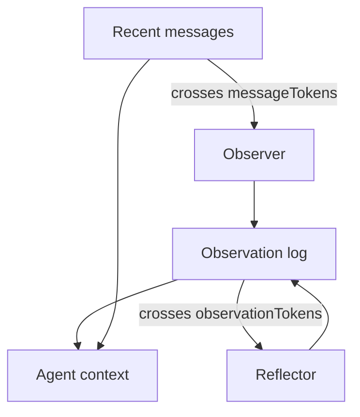

LLM 的记忆像金鱼。你可以写自己喜欢自行车，再问相关事实，模型就会像《记忆碎片》里的人一样一脸茫然。Naive 的修法是把最近 *N* 条 messages 塞进每次 request。十轮还能撑。遇到 tool dumps、新 thread，或目标写在第一条 message 里，就会崩。

这是 Mastra 的四级阶梯，按他们推出的顺序。Alex Becker 在 [Four levels of agent memory](https://www.youtube.com/watch?v=18iIHQtIPmc) 里走的是同一套 stack。这不是 CoALA taxonomy（working / episodic / semantic / procedural）。那些名字描述的是*知识种类*。这四个层级描述的是*tokens 住在哪里*，以及*你为留下它们付了什么代价*。

所有层级都需要 storage。不带 options 的 `new Memory()` 已经是第一级。其余都是同一个 object 上的 flags。

<br />

---

## 1. Conversation history

Thread 是一次 conversation。Resource 是 owner：一个 user、一个 org、一个 project。Studio 会两边都生成。自己调用 `generate` 或 `stream` 时，你要传进去。

Mastra 从 storage 加载最近 *N* 条 messages，放进 context window。默认 `lastMessages` 是 10。能用的原因很简单：你说「告诉我相关事实」时，model 能看见「我喜欢自行车」。

<br />

```ts
import { Agent } from "@mastra/core/agent"
import { Memory } from "@mastra/memory"

export const agent = new Agent({
  id: "chat-agent",
  name: "Chat agent",
  instructions: "You are a helpful assistant.",
  model: "openai/gpt-5-mini",
  memory: new Memory({
    options: {
      lastMessages: 10,
    },
  }),
})
```

<br />

从 client 只送**新 message**。Mastra 已经有 thread。把完整 history 再寄一遍是多余的，而且 client timestamps 会跟 store 里的 messages 抢顺序。

这一级会以两种看起来像 bug、其实不是的方式失败：

- Window 是滑动切割。若用户的目标在第一条 message，接着烧掉 30 轮 tool turns，目标就没了。
- 新 thread 没有 history。同一个 agent、同一个人、空的 context。那不是 intelligence。那是 session cookie。

Tool results 会让切割来得比你预期更早。一次 `llms.txt` fetch 就可以是 10k tokens。History 是短聊天的正确默认。它不是一套 memory 系统。

<br />

---

## 2. Working memory

Working memory 是一块 scratchpad，model 每一轮都能看见，即使几百条 messages 之后，即使换了新 thread（只要 scope 是 `resource`）。你给它空字段。Agent 用 `updateWorkingMemory` 填进去。填好的 block 注入 system instruction，用户看不见。

它补充 history，不取代 history。用来放不变的 facts：名字、「讨厌犯错」、「偏好简洁回复」、「做一套 $10M SaaS」。Coding agents 和任何 long-horizon task 都活在这里。

<br />

```ts
import { Agent } from "@mastra/core/agent"
import { Memory } from "@mastra/memory"

export const agent = new Agent({
  id: "personal-assistant",
  name: "Personal assistant",
  instructions: "You are a helpful personal assistant.",
  model: "openai/gpt-5-mini",
  memory: new Memory({
    options: {
      workingMemory: {
        enabled: true,
        scope: "resource",
        template: `# User Profile
- **Name**:
- **Preferences**:
- **Current Goal**:
`,
      },
    },
  }),
})
```

<br />

`scope: "resource"` 是默认：每个 user 跨 threads 共用一块 scratchpad。`scope: "thread"` 把它隔离在这次 conversation。切换 scope 不会迁移数据。

可以用 Zod `schema` 代替 Markdown `template`。不能两者都用。Templates 每次 update 都替换整块。Schemas 会 merge：只送改过的 fields；把 field 设为 `null` 来删除。

Working memory 故意很小。你必须预先定义 fields，这感觉不像 agentic。它也不适合不断增长的 event log。若你把 conversation summaries 塞进 template，直接跳到第四级。

打开 observational memory 时，`observationalMemory.observation.manageWorkingMemory` 让 Observer 写 scratchpad，主 agent 就不必记住这个 tool。

<br />

---

## 3. Semantic recall

Semantic recall 是针对 *message history* 的 RAG，不是针对你的产品 corpus。这个区别很重要。[如何搭建一套 RAG 系统](/notes/how-to-build-a-rag-system) 里的 org-scoped document index，是 agent 用 tool 搜索的图书馆。Semantic recall 是自动的：每条新 message 都会被 embed，后续 messages 再查询那个 vector store 找相似的 turns。

「我喜欢狗，我的叫 Nas Barkley。」后来在另一个 thread：「我喜欢什么动物？」查找靠的是意思，不是 `dogs` 这个词。Mastra 把 hits 注入成额外的 system block：从另一段 conversation 里记起来的。

<br />

```ts
import { Agent } from "@mastra/core/agent"
import { Memory } from "@mastra/memory"
import { LibSQLStore, LibSQLVector } from "@mastra/libsql"
import { ModelRouterEmbeddingModel } from "@mastra/core/llm"

export const agent = new Agent({
  id: "support-agent",
  name: "Support agent",
  instructions: "You are a helpful support agent.",
  model: "openai/gpt-5-mini",
  memory: new Memory({
    storage: new LibSQLStore({
      id: "agent-storage",
      url: "file:./local.db",
    }),
    vector: new LibSQLVector({
      id: "agent-vector",
      url: "file:./local.db",
    }),
    embedder: new ModelRouterEmbeddingModel("openai/text-embedding-3-small"),
    options: {
      semanticRecall: {
        topK: 3,
        messageRange: 2,
        scope: "resource",
      },
    },
  }),
})
```

<br />

`topK` 是 hit 数量。`messageRange` 是每个 hit 要一并拉来的周围 turns。太多，model 会淹死。太少，你会漏掉 fact。`scope: "resource"` 搜索该 user 的所有 threads；LibSQL、Postgres、MongoDB、OracleDB 与 Upstash 支持它。

默认关闭。需要 vector store 和 embedder。Write 与 query 用同一个 embedding model，和 document RAG 同一条规则。

代价是真的：

- Recall 不精确。你会按产品调 `topK` 和 `messageRange`。
- 你现在要跑 embedder 和 vector store。每一轮都有 latency。
- 注入的 system block 随 query 变。Prompt prefix 永远不够稳定，打不中 cache。Production 里，cached input tokens 通常是最大的节省。Semantic recall 把它们花掉。

收益也是真的：按意思查找、跨 thread recall，以及 history 可以增长，而不必把整份 log 塞进 window。

不要跟 Pinecone document pipeline 搞混。Message RAG 解决「我们说过什么」。Document RAG 解决「handbook 里有什么」。不同 indexes。不同 tenancy。不同 tools。

<br />

---

## 4. Observational memory

Observational memory 是按人如何记住、如何遗忘来建模的那一级。两个 ambient agents：**Observer** 与 **Reflector**。它们一直在。它们不是一直在跑。

当 message tokens 越过阈值（默认 30,000；demos 常用 2k 好让你看见过程），Observer 把原始 history 压成一份 dense observation log：priority markers、timestamps、仍重要的那一小片。一份 10k-token 的 tool result 可以变成 ~160 tokens。其余被允许死去。

当 observation log 自己越过阈值（默认 40,000），Reflector 重写整份 log。它丢掉低优先级行、合并相关 facts，无论 thread 跑多久都让 window 有界。Reflections 不会叠成第三层无限层。每次 reflection *就是* 新的 log。新 observations 接在后面。

<br />



<br />

Observations 是**稳定的**。它们 append。它们不会每一轮重排 system prefix。这是对付 semantic recall 的 cache 论点，反过来。

Observer 与 Reflector 在后台跑。Studio 里你可以点它们做 demo。真实 agent 里它们是 async、non-blocking。Coding harness 里的 compaction 常常让用户停一分钟，还丢掉错误的细节。这个 loop 两边都不该做。

<br />

```ts
import { Agent } from "@mastra/core/agent"
import { LibSQLStore } from "@mastra/libsql"
import { Memory } from "@mastra/memory"

export const agent = new Agent({
  id: "long-horizon-agent",
  name: "Long-horizon agent",
  instructions: "You are a helpful assistant.",
  model: "openai/gpt-5-mini",
  memory: new Memory({
    storage: new LibSQLStore({
      id: "memory-storage",
      url: "file:./memory.db",
    }),
    options: {
      observationalMemory: {
        model: "google/gemini-2.5-flash",
      },
    },
  }),
})
```

<br />

`observationalMemory: true` 会把 Observer/Reflector model 默认成 `google/gemini-2.5-flash`。Storage 是必需的。目前支持的 adapters：`@mastra/pg`、`@mastra/libsql`、`@mastra/mysql`、`@mastra/mongodb`、`@mastra/convex`、`@mastra/oracledb`。

视频里 Mastra 的 LongMemEval 数字，前三行同一套 model：working memory ~55%（不是为这个 benchmark 设计的）、semantic recall ~80%、observational memory ~84%。Gemini 2.5 Flash 跑 OM 报了 ~95%，是他们引用过最高的可核验分数。把这些当 Mastra 公布的分数，不是独立 bake-off。

这是能撑过 noisy tool calls 的层级：page snapshots、`llms.txt`、MCP dumps。它也是会累积的层级。一个连续几周写活动文案的 workshop-helper agent，会开始把「第二人称、短 hook、不要 hype」当成 observations 留下，而不是你记得塞进 template 的某个 field。

两个值得知道的 extras：

- `retrieval: true` 给 agent 一个 `recall` tool，可以回到产生 observation 的原始 messages。`{ vector: true }` 再给那个 store 加上 semantic search。Compression 不必等于原文消失。
- `observation.manageWorkingMemory` 让 OM 接管 scratchpad。Working memory 保持小而 structured；OM 让主 agent 不必为此花一次 tool call。

<br />

---

## 5. Which level

<br />

| Level | Primitive | 适用场景 | 何时失效 |
| --- | --- | --- | --- |
| Conversation history | `lastMessages` | 短 threads、UI transcript | Goal 滑出 window；新 thread |
| Working memory | `workingMemory` | 稳定 facts 与当前 goal | 你需要 event log 或未声明的 fields |
| Semantic recall | `semanticRecall` | 跨很长、多 thread history 的稀疏 facts | 你需要 prompt cache，或 recall 太模糊 |
| Observational memory | `observationalMemory` | Long horizon、noisy tools、cache-stable context | 你拒绝跑 storage adapter |

<br />

Mastra 目前对 long-context agents 的建议是 observational memory。前面几级仍然存在，仍然可以组合。History 是 model *此刻*看见的。Working memory 是表单。Semantic recall 是搜索。Observational memory 是让 window 保持小、又不至于空白的方式。

不带 options 的 `new Memory()` 就是 conversation history。这个 repo 里的 weather agent 就是这样。当 thread 不再只是聊天时，再升级。

<br />

---

## 6. Invariants

1. 通过 storage adapter 持久化。Memory 不是 context window。
2. Client 送新 message。Server 加载 thread。绝不要两边都做。
3. `thread` 是 conversation。`resource` 是 owner。跨 thread recall 是一次 resource query，不是缺了 `threadId`。
4. Working memory 是一块小的、始终在线的 block。不要把它养成日记。
5. 针对 messages 的 semantic recall 不是 document RAG。不同 index，不同 tenant 故事。两边 write 与 query 都用同一个 embedding model。
6. Observational memory 靠 append observations 保持可 cache 的 prefix。Semantic recall 是故意打爆那个 prefix。
7. Isolation 是 server 的事。`resource` 不是 model 可以自己挑的。

四个层级。同一个 `Memory` object。精妙之处在于你留下哪些 tokens，以及你愿意忘掉哪些。
