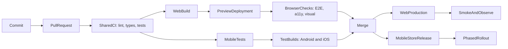

Frontend CI/CD 是把一个 commit 转化成证据，最终成为 release 的系统。它不只是一份 YAML：它定义哪些检查必须通过、哪个 artifact 值得信任、谁可以 promote，以及 production 不健康时团队如何恢复。

本文使用一个**虚构的** TypeScript 产品：包含 React web app、React Native mobile app，以及共享 packages。像 `pnpm deploy:web` 这类 command 是刻意保留的 provider-neutral 边界；真实团队会用所选 hosting 或 mobile delivery 平台实现它们。

<br />

---

## 1. CI、Continuous Delivery 与 Continuous Deployment

三个术语承诺的事情不同。

| Practice                        | Promise                                   | Typical trigger           |
| ------------------------------- | ----------------------------------------- | ------------------------- |
| **Continuous Integration (CI)** | 每次变更都经常合并并自动验证              | Pull request 或 push      |
| **Continuous Delivery**         | 每个获接受的 commit 都产生可发布 artifact | CI 成功后由人工批准       |
| **Continuous Deployment**       | 每个获接受的 commit 都自动发布            | Release branch 的 CI 成功 |

对 frontend 产品而言，“CD”会分成两种 delivery model：

- **Web：**团队通常可在数分钟内发布 immutable artifact，并把流量切换到该版本。
- **React Native：**native binaries 必须签署、提交 stores、经过审核，再逐步 rollout。自动化可让 build 持续保持 **deliverable**，但 Apple 与 Google 仍控制部分 release 时间。

不要因 pipeline 执行了 `build` 就称它为“continuous deployment”。只留在 CI runner 上的 build 并未 delivery 到任何地方。

<br />

---

## 2. 一个接近 Production 的示例

假设 workspace 有清晰边界：

```text
apps/
  web/                  React web application
  mobile/               React Native application
packages/
  api-client/           typed transport and generated contracts
  domain/               framework-independent business rules
  ui-tokens/            shared colors, spacing, and typography
scripts/
  deploy-web.mjs        provider adapter for preview and production
  submit-mobile.mjs     store submission adapter
.github/workflows/
  pull-request.yml
  release-web.yml
  release-mobile.yml
```

具体使用哪个 monorepo 工具不是重点。重要的是：每个 check 都必须可以在本机用与 CI 相同的 command 执行。

```json title="package.json"
{
  "packageManager": "pnpm@10.15.0",
  "scripts": {
    "format:check": "prettier --check .",
    "lint": "eslint . --max-warnings=0",
    "typecheck": "tsc -b --pretty false",
    "test": "vitest run --coverage",
    "test:mobile": "jest --ci --runInBand",
    "build:web": "pnpm --filter web build",
    "test:e2e:web": "playwright test",
    "test:e2e:mobile": "maestro test apps/mobile/e2e",
    "deploy:web": "node scripts/deploy-web.mjs",
    "submit:mobile": "node scripts/submit-mobile.mjs"
  }
}
```

固定 package manager 版本并 commit lockfile。当 `package.json` 与 lockfile 不一致时，`pnpm install --frozen-lockfile` 应该失败；CI 不应悄悄 resolve 另一套 dependency graph。

<br />

---

## 3. End-to-End Pipeline

共享 validation path 应保持快速。Web 与 mobile 只在通过共同 quality gates 后才分流。



一个实用目标：

1. **Push 前：**format 与 lint 已修改文件。
2. **Pull request：**install、lint、format、type-check、test、build 和 scan。
3. **Preview：**deploy web artifact；针对 URL 跑 browser、accessibility 与 visual checks。
4. **Mobile test builds：**产生 unsigned simulator builds 或有 internal signing 的 device builds。
5. **Merge：**由已 review 的 commit 建立 production candidate。
6. **Release：**promote 同一个 web artifact；签署并提交 native binaries。
7. **Verify：**执行 smoke tests，观察 errors、performance 与 business signals。
8. **Recover：**rollback web traffic 或停止 mobile rollout。

<br />

---

## 4. 用 GitHub Actions 建立 Pull-Request CI

由 least privilege、取消过时 runs、deterministic installation 和 parallel jobs 开始。

```yaml title=".github/workflows/pull-request.yml"
name: Pull request

on:
  pull_request:

permissions:
  contents: read

concurrency:
  group: pr-${{ github.event.pull_request.number }}
  cancel-in-progress: true

env:
  NODE_VERSION: "22"
  PNPM_VERSION: "10.15.0"

jobs:
  quality:
    runs-on: ubuntu-latest
    timeout-minutes: 15
    steps:
      - uses: actions/checkout@v4
      - uses: pnpm/action-setup@v4
        with:
          version: ${{ env.PNPM_VERSION }}
      - uses: actions/setup-node@v4
        with:
          node-version: ${{ env.NODE_VERSION }}
          cache: pnpm
      - run: pnpm install --frozen-lockfile
      - run: pnpm format:check
      - run: pnpm lint
      - run: pnpm typecheck
      - run: pnpm test

  web-build:
    needs: quality
    runs-on: ubuntu-latest
    timeout-minutes: 15
    steps:
      - uses: actions/checkout@v4
      - uses: pnpm/action-setup@v4
        with:
          version: ${{ env.PNPM_VERSION }}
      - uses: actions/setup-node@v4
        with:
          node-version: ${{ env.NODE_VERSION }}
          cache: pnpm
      - run: pnpm install --frozen-lockfile
      - run: pnpm build:web
      - uses: actions/upload-artifact@v4
        with:
          name: web-${{ github.sha }}
          path: apps/web/dist
          if-no-files-found: error
          retention-days: 7

  mobile-js:
    needs: quality
    runs-on: ubuntu-latest
    timeout-minutes: 15
    steps:
      - uses: actions/checkout@v4
      - uses: pnpm/action-setup@v4
        with:
          version: ${{ env.PNPM_VERSION }}
      - uses: actions/setup-node@v4
        with:
          node-version: ${{ env.NODE_VERSION }}
          cache: pnpm
      - run: pnpm install --frozen-lockfile
      - run: pnpm test:mobile
```

在较大型系统，可把 Node 和 package manager setup 抽成 **composite action** 或 reusable workflow。不要为第一天的三行 YAML 过早 abstraction；当多个 workflows 必须保持同步时才抽取。

### 为何这个结构有效

- `permissions: contents: read` 拒绝 write access，除非某个 job 明确需要。
- `concurrency` 在 pull request 收到新 commit 后取消过时 run。
- `timeout-minutes` 防止 deadlocked test 无限占用 runner。
- `needs` 让 dependencies 可见，独立 jobs 可 parallel 执行。
- Artifact name 包含 commit SHA，较容易追踪 provenance。
- Package-store cache 加快 install，但不把 `node_modules` 当作 deployable artifact。

如要提高 supply-chain assurance，可把 third-party actions pin 到完整 commit SHA，再用 update bot 提出升级。`@v4` 这类 version tags 易读，但属于 mutable references。

<br />

---

## 5. 按成本与信号设计 Quality Gates

快速且 deterministic 的 checks 放前面；昂贵并依赖 environment 的 checks 放后面。

| Gate               | 证明什么                                   | Failure 应阻挡         |
| ------------------ | ------------------------------------------ | ---------------------- |
| Prettier / ESLint  | Syntax 一致并遵守 agreed static rules      | Pull request           |
| `tsc --noEmit`     | Type contracts 可正确组合                  | Pull request           |
| Unit tests         | Pure logic 与 domain rules 正确            | Pull request           |
| Component tests    | 用户可观察的 component behavior 正常       | Pull request           |
| Web build          | Bundler 与 production config 有效          | Pull request           |
| Browser E2E        | 关键 journeys 在 real browser 正常         | Merge 或 release       |
| Accessibility      | 没有严重 automated WCAG violations         | Merge                  |
| Visual regression  | 经 review 的页面没有非预期改变             | Merge，baseline 需批准 |
| Performance budget | Bundle 与 key journeys 保持在 limits 内    | Merge 或 release       |
| Native build       | Gradle/Xcode project 可 compile 和 package | Release                |
| Post-release smoke | Deployed system 可连接且可用               | 继续 rollout           |

Coverage 是 supporting evidence，不是目标。即使 pipeline 有 95% line coverage，也可能漏掉坏掉的 login redirect、无效 iOS entitlement，或在 CDN 后无法加载的 JavaScript chunk。

只有在 flaky test 有 owner、reason 与 expiry date 时才 quarantine。盲目 retry 会隐藏间歇性 production risk。

<br />

---

## 6. Web Preview、Browser Tests 与 Promotion

Preview deployment 把 E2E 从“app 能在 localhost 启动”提升为“candidate 能跨越真实 hosting boundary 正常工作”。

```yaml title="Preview and browser checks"
web-preview:
  needs: web-build
  runs-on: ubuntu-latest
  environment: preview
  permissions:
    contents: read
    pull-requests: write
  outputs:
    url: ${{ steps.deploy.outputs.url }}
  steps:
    - uses: actions/checkout@v4
    - uses: actions/download-artifact@v4
      with:
        name: web-${{ github.sha }}
        path: apps/web/dist
    - id: deploy
      env:
        DEPLOY_TOKEN: ${{ secrets.WEB_PREVIEW_TOKEN }}
      run: |
        url="$(pnpm deploy:web --environment preview --artifact apps/web/dist)"
        echo "url=$url" >> "$GITHUB_OUTPUT"

web-e2e:
  needs: web-preview
  runs-on: ubuntu-latest
  timeout-minutes: 20
  steps:
    - uses: actions/checkout@v4
    - uses: pnpm/action-setup@v4
      with:
        version: "10.15.0"
    - uses: actions/setup-node@v4
      with:
        node-version: "22"
        cache: pnpm
    - run: pnpm install --frozen-lockfile
    - run: pnpm exec playwright install --with-deps chromium
    - run: pnpm test:e2e:web
      env:
        BASE_URL: ${{ needs.web-preview.outputs.url }}
```

Deploy command 是 adapter：上传指定 artifact 并打印 URL。它不可重新 build。应该只 build 一次、记录 digest、test 该 artifact，再 promote 相同 bytes。

### Frontend-specific preview gates

- 执行少量但能保护 revenue、authentication、data loss 与 navigation 的 journeys。
- 用 Axe 扫描代表性页面，但仍保留 manual accessibility testing，因为自动化无法评估所有 WCAG requirements。
- 在固定 viewport sizes 与 fonts 下 capture visual baselines。
- 限制 compressed JavaScript budget，调查大型 route-level 变更。
- 在稳定 environment 执行 Lighthouse 或 user-flow performance tests；noise 大的 synthetic score 应先 warning，稳定后才 blocking。
- 把 source maps 上传到 error-monitoring system；若产品需要，避免 source maps 可被公开 listing。

### Production promotion

在 GitHub `production` Environment 设置 required reviewers。Production job 应接收已 test artifact 的 identifier 或 digest：

```yaml title="Production promotion"
deploy-production:
  needs: [web-preview, web-e2e]
  if: github.ref == 'refs/heads/main'
  runs-on: ubuntu-latest
  environment: production
  permissions:
    contents: read
    id-token: write
  steps:
    - uses: actions/download-artifact@v4
      with:
        name: web-${{ github.sha }}
        path: apps/web/dist
    - run: pnpm deploy:web --environment production --artifact apps/web/dist
    - run: pnpm smoke:web
      env:
        BASE_URL: https://example.invalid
```

当 provider 支持时，`id-token: write` 可让 OpenID Connect 获取 short-lived cloud credentials。它比 permanent access keys 安全。只授予 deployment job，不要授予 pull-request workflow。

<br />

---

## 7. Web Configuration、Artifacts 与 Rollback

Browser code 无法保存 secret。任何嵌入 web bundle 的值——包括使用 `PUBLIC_` 之类 convention 的 variables——都必须视为 public。

分开管理：

- **Build-time public configuration：**API origin、analytics project ID、feature defaults。
- **Runtime server configuration：**只供 server functions 或 backend-for-frontend 使用的 credentials。
- **Deployment credentials：**只供 deployment job 使用。

团队要决定 config 是 bake 进每个 artifact，还是在 runtime inject。Baked config 较简单并容易 reproduce；runtime config 可让同一 artifact 跨 environments，但需要经过设计的 loading mechanism。

Rollback 流程：

1. 保留以 digest 或 release ID 定址的 immutable releases。
2. 把 production alias 或 traffic pointer 指回 last known-good release。
3. 只 purge 必须改变的 CDN entries；fingerprinted assets 应保持 immutable。
4. Rollback 后执行 smoke checks。
5. 保存 logs 与 failed artifact 供 diagnosis。

重新 build 旧 Git commit 不如 promote 原始 artifact 安全，因为 dependencies、base images 与 external build services 可能已改变。

<br />

---

## 8. React Native CI 其实是两条 Pipelines

React Native 有快速的 JavaScript pipeline，以及较慢的 native pipeline。

### JavaScript layer

大部分 pull requests 可在 Linux 执行：

- ESLint、formatting 与 TypeScript
- Jest 与 React Native Testing Library
- reducers、state machines、deep links、API adapters 和 offline behavior tests
- Metro bundle generation，用来发现 unresolved modules

### Native layer

当 native files、dependencies、release config 或 release tag 改变时执行：

- 在 Linux 用 Gradle 与适当 JDK 建 Android build
- 在 macOS 用 Xcode、CocoaPods 或 Swift Package Manager 建 iOS build
- simulator/emulator smoke tests
- 用 Maestro 或 Detox 跑 device E2E
- 只在受保护 release jobs 中进行 signing、packaging 与 store submission

macOS runners 较慢、成本较高，而且受已安装 Xcode 版本限制。不要每次 documentation-only change 都跑完整 signed iOS archive。可以谨慎使用 path filters，同时安排 periodic full builds 来发现 drift。

<br />

---

## 9. Mobile Test Builds 与 E2E

Internal builds 让 product 和 QA 在 store submission 前测试 candidate。

```yaml title="Mobile internal builds"
jobs:
  android-internal:
    runs-on: ubuntu-latest
    environment: mobile-internal
    steps:
      - uses: actions/checkout@v4
      - uses: actions/setup-java@v4
        with:
          distribution: temurin
          java-version: "17"
          cache: gradle
      - run: corepack enable
      - run: pnpm install --frozen-lockfile
      - run: pnpm mobile:build:android --profile internal
        env:
          ANDROID_KEYSTORE_BASE64: ${{ secrets.ANDROID_KEYSTORE_BASE64 }}
          ANDROID_KEYSTORE_PASSWORD: ${{ secrets.ANDROID_KEYSTORE_PASSWORD }}
      - uses: actions/upload-artifact@v4
        with:
          name: android-internal-${{ github.sha }}
          path: apps/mobile/android/app/build/outputs/**/*.apk

  ios-simulator:
    runs-on: macos-latest
    steps:
      - uses: actions/checkout@v4
      - run: corepack enable
      - run: pnpm install --frozen-lockfile
      - run: pnpm mobile:build:ios --profile simulator
      - run: pnpm test:e2e:mobile --platform ios
```

Pull-request smoke tests 优先使用 unsigned iOS simulator build。只有受保护 job 真正需要 signed device 或 App Store archive 时，才 import certificates 与 provisioning profiles。

Mobile E2E 天生比 unit tests 更容易受环境影响。可用以下方式稳定：

- 固定 simulator/OS versions；
- 使用 isolated test accounts 与可 reset backend state；
- 保留 accessibility IDs 作稳定 interactions；
- failure 时上传 screenshots、videos 与 device logs；
- 保持一套小型 release-blocking suite，另以 scheduled jobs 跑较广 coverage。

<br />

---

## 10. 用 Tag 建立 Mobile Releases

Native releases 需要明确 versioning 与受控 credentials。常见 policy：

- source 内有 marketing version，例如 `3.4.0`；
- 单调递增的 iOS build number；
- 单调递增的 Android version code；
- annotated tag，例如 `mobile-v3.4.0`；
- submission 前须经 protected GitHub Environment approval。

```yaml title=".github/workflows/release-mobile.yml"
name: Release mobile

on:
  push:
    tags:
      - "mobile-v*"

permissions:
  contents: read

jobs:
  validate-tag:
    runs-on: ubuntu-latest
    outputs:
      version: ${{ steps.version.outputs.value }}
    steps:
      - uses: actions/checkout@v4
      - id: version
        run: |
          value="${GITHUB_REF_NAME#mobile-v}"
          node scripts/assert-version.mjs "$value"
          echo "value=$value" >> "$GITHUB_OUTPUT"
      - run: corepack enable
      - run: pnpm install --frozen-lockfile
      - run: pnpm lint && pnpm typecheck && pnpm test && pnpm test:mobile

  build-android:
    needs: validate-tag
    runs-on: ubuntu-latest
    environment: mobile-production
    steps:
      - uses: actions/checkout@v4
      - run: pnpm mobile:build:android --profile production
      - uses: actions/upload-artifact@v4
        with:
          name: android-${{ needs.validate-tag.outputs.version }}
          path: apps/mobile/android/app/build/outputs/**/*.aab

  build-ios:
    needs: validate-tag
    runs-on: macos-latest
    environment: mobile-production
    steps:
      - uses: actions/checkout@v4
      - run: pnpm mobile:build:ios --profile production
      - uses: actions/upload-artifact@v4
        with:
          name: ios-${{ needs.validate-tag.outputs.version }}
          path: apps/mobile/build/**/*.ipa

  submit:
    needs: [validate-tag, build-android, build-ios]
    runs-on: ubuntu-latest
    environment: mobile-store-submit
    steps:
      - uses: actions/download-artifact@v4
      - run: pnpm submit:mobile --track internal
        env:
          APP_STORE_API_KEY: ${{ secrets.APP_STORE_API_KEY }}
          PLAY_SERVICE_ACCOUNT_JSON: ${{ secrets.PLAY_SERVICE_ACCOUNT_JSON }}
```

以上 shortened build jobs 假设 setup 与 signing 隐藏在经 audit scripts 或 reusable workflows 内。Production implementation 要让相关 steps 足够明确，便于 diagnosis 和 rotation。

先 submit 到 TestFlight 与 Play internal testing。把经批准 binary promote 到 beta 与 production tracks，而不是每个 track 都重新 build。

<br />

---

## 11. Signing 与 Secret Boundaries

Mobile signing 需要比一般 CI 更严格的 threat model。

- 把 signing files 存成 encrypted CI secrets，或放在专用 secrets manager。
- Production signing 只限 protected environments 与 trusted branches/tags。
- 绝不向来自 forks 的 pull requests 暴露 production secrets。
- 避免用 `pull_request_target` checkout untrusted code；这可能把具 write 权限 secrets 与 attacker-controlled code 放在一起。
- Mask sensitive output，并确保 shell tracing 不会打印 credentials。
- 在 certificates、API keys 与 service accounts 到期前 rotate。
- 分开 build credentials 和 store-submission credentials。
- Store API accounts 只给可 upload 或 promote builds 的最小 roles。

可行时使用 short-lived identity federation。部分 store-signing materials 因平台设计仍是 long-lived，因此要用 access controls、audit logs 与 rotation 补偿。

<br />

---

## 12. Mobile Rollout 与 Recovery

Mobile rollback 不是 web deployment 的反向操作。已安装 binary 通常无法从所有 devices 移除。

采用分层 response：

1. 在 App Store Connect 或 Play Console **停止 phased rollout**。
2. 可行时用 server-side flag **关闭受影响 feature**。
3. 只有旧 installed clients 仍 compatible 时才 **rollback backend contract**。
4. 只对与 installed native runtime compatible 的 JavaScript/assets **发布 OTA update**。
5. Native crashes、entitlement 错误、SDK changes 或 incompatible native modules 要 **提交 hotfix binary**。
6. 若 backend 最终必须拒绝不安全 clients，清晰传达 **minimum supported versions**。

OTA system 必须把 update 绑定 runtime 或 compatibility version。向 installed binary 发送依赖不存在 native module 的 JavaScript，可能造成即时 crash loop。

应使用 staged rollout percentages，并监控：

- crash-free users 与 sessions；
- app start 与 screen-render latency；
- 依 app version 分组的 API error rate；
- login、checkout 或其他 critical conversion；
- device model 与 OS-specific regressions。

<br />

---

## 13. Reusable Workflows，而不是 YAML Monolith

Pipeline 变大时，要分开 responsibilities：

```text
pull-request.yml       orchestration and PR permissions
release-web.yml        production web policy
release-mobile.yml     tag and store policy
reusable-node.yml      install, lint, types, unit tests
reusable-android.yml   JDK, Gradle, signing, artifact
reusable-ios.yml       Xcode, signing, archive, artifact
```

以明确 inputs 调用 reusable workflows；只有必要时才传 secrets：

```yaml title="Reusable quality workflow"
jobs:
  quality:
    uses: ./.github/workflows/reusable-node.yml
    with:
      node-version: "22"
    secrets: {}
```

Policy 留在 caller：

- 哪些 branches 或 tags trigger；
- 哪个 environment 必须 approve；
- 授予什么 permissions；
- failure 是否阻止 promotion。

Mechanics 留在 reusable workflow：

- toolchain setup；
- deterministic install；
- build commands；
- artifact naming 与 upload。

避免用一份 workflow 加数十个 conditionals 同时处理 web、iOS、Android、preview、staging 与 production。否则很难理解每条 path 获取哪些 permissions 与 secrets。

<br />

---

## 14. Observability 是 Delivery 的一部分

Green deployment command 只能证明平台接受了 artifact。

Web deploy 后：

- request health page 与一个 critical authenticated journey；
- 检测 console errors 与 failed asset requests；
- verify app exposed release identifier；
- 比较新旧 release 的 error rate、latency 与 key business signals；
- 确认 source maps 把 stack traces 对应到正确 commit。

Mobile submission 与 rollout 后：

- verify store processing status；
- 从 internal track 安装同一个 build；
- 检查 deep links、push registration、permissions、login 与 upgrade paths；
- 按 version 和 platform segment crash 与 API telemetry。

在 logs 与 telemetry 加上 release identity：commit SHA、web artifact digest、mobile version 与 build number。缺少这些数据，就难以证明和逆转“release 后 errors 上升”。

<br />

---

## 15. 常见 Failure Modes

| Symptom                                | Likely cause                                                            | First response                                             |
| -------------------------------------- | ----------------------------------------------------------------------- | ---------------------------------------------------------- |
| CI 本机成功但 runner 失败              | Runtime 未 pin、lockfile drift、case-sensitive path、hidden local state | 在 clean container reproduce；比较 tool versions           |
| 旧 PR deploy 覆盖较新 preview          | 缺少 concurrency 或 environment-specific release ID                     | 取消 stale runs；preview names 加 PR ID                    |
| E2E 间歇性变红                         | Shared data、animation/timing assumptions、unstable selector            | Capture traces；隔离 state；等待 observable behavior       |
| Production 与 preview 不同             | Rebuilt artifact 或 build-time variables 不同                           | Promote tested digest；记录 configuration                  |
| Web deploy 成功但 users 看到混合 files | Mutable filenames 或 CDN cache headers 错误                             | Fingerprint assets；不要把 HTML 当 immutable cache         |
| iOS build 突然失败                     | Runner Xcode 改变、certificate expired、Pods drifted                    | 尽量 pin runner/toolchain；检查 signing 与 lockfiles       |
| Android release 可安装但不能 call API  | Release-only network/security config 或 wrong environment               | 对 production-like services 测试 signed internal build     |
| Store 拒绝 binary                      | Metadata、entitlement、privacy manifest、SDK policy                     | Submission 前 validate；明确 compliance ownership          |
| OTA update 令旧 clients crash          | 未 enforce runtime compatibility                                        | Halt update；target compatible runtime；发布 binary hotfix |
| Rollback 恢复 code 但未恢复 behavior   | Backend/schema/config change 非 backward-compatible                     | 使用 expand-contract changes 与 version-aware flags        |

Failure summary 应直接连到 traces、screenshots、logs、artifacts 与 commit。没有 diagnostic context 的 notification 只会制造 noise。

<br />

---

## 16. 合理的 Adoption Order

不要在一个 pull request 建造最终平台。

1. 先让 lint、type-check、unit tests 与 builds 在本机 deterministic。
2. 每个 pull request 都执行，并设置 branch protection。
3. Upload immutable artifacts，记录 commit SHA。
4. 加入 web previews 与小型 Playwright release-blocking suite。
5. 加入 accessibility、visual 与 performance signals。
6. 用 environment approval 与 short-lived credentials 保护 production。
7. 加入 React Native simulator 与 Android debug builds。
8. 自动化 signed internal builds，再自动化 store submission。
9. 加入 post-release verification、phased rollout 与演练过的 rollback。
10. 量度 duration、failure rate、flaky tests 与 deployment recovery time。

成熟 pipeline 不是 jobs 最多的 pipeline，而是能快速提供可信证据、把 privileged work 减到最少、promote 真正测试过的 artifact，并让 recovery 成为日常操作的 pipeline。
