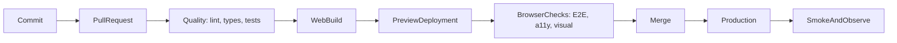

Frontend CI/CD 是把一个 commit 转化成证据，最终成为 release 的系统。它不只是一份 YAML：它定义哪些检查必须通过、哪个 artifact 值得信任、谁可以 promote，以及 production 不健康时团队如何恢复。

本文使用一个**虚构的** TypeScript 产品：包含 React web app 与共享 packages。像 `pnpm deploy:web` 这类 command 是刻意保留的 provider-neutral 边界；真实团队会用所选 hosting 平台实现它们。示例 artifact 是静态 `dist` 目录。Server-rendered React app 产出的 bundle 形状不同，但规则不变：**只 build 一次、记录 digest、test 那些 bytes，再 promote 同一个 artifact**。React Native 的交付——EAS Workflows、stage secrets、store submission——见 [用 EAS Workflows 做 React Native CI/CD](/notes/react-native-ci-cd-with-eas-workflows)。

<br />

---

## 1. CI、Continuous Delivery 与 Continuous Deployment

三个术语承诺的事情不同。

| Practice                        | Promise                                   | Typical trigger           |
| ------------------------------- | ----------------------------------------- | ------------------------- |
| **Continuous Integration (CI)** | 每次变更都经常合并并自动验证              | Pull request 或 push      |
| **Continuous Delivery**         | 每个获接受的 commit 都产生可发布 artifact | CI 成功后由人工批准       |
| **Continuous Deployment**       | 每个获接受的 commit 都自动发布            | Release branch 的 CI 成功 |

React web 可以支持两种 delivery model。团队通常可在数分钟内发布 immutable artifact，并把流量切换到该版本。Production 是否必须人工批准，是 **policy** 选择，不是平台限制。

不要因 pipeline 执行了 `build` 就称它为“continuous deployment”。只留在 CI runner 上的 build 并未 delivery 到任何地方。

<br />

---

## 2. 一个接近 Production 的示例

假设 workspace 有清晰边界：

```text
apps/
  web/                  React web application
packages/
  api-client/           typed transport and generated contracts
  domain/               framework-independent business rules
  ui-tokens/            shared colors, spacing, and typography
scripts/
  deploy-web.mjs        provider adapter for preview and production
.github/workflows/
  pull-request.yml
  release-web.yml
```

具体用哪种 monorepo tool 不如这一条重要：每个 check 都必须能在本机用与 CI 相同的 command 执行。

```json title="package.json"
{
  "packageManager": "pnpm@10.15.0",
  "scripts": {
    "format:check": "prettier --check .",
    "lint": "eslint . --max-warnings=0",
    "typecheck": "tsc -b --pretty false",
    "test": "vitest run --coverage",
    "build:web": "pnpm --filter web build",
    "test:e2e:web": "playwright test",
    "smoke:web": "pnpm test:e2e:web --grep @smoke",
    "deploy:web": "node scripts/deploy-web.mjs"
  }
}
```

Pin package-manager version 并 commit lockfile。若 `package.json` 与 lockfile 不一致，`pnpm install --frozen-lockfile` 应失败；CI 不可静默 resolve 另一套 dependency graph。

<br />

---

## 3. End-to-End Pipeline

Validation path 应保持快速。Preview 与 production 是同一个 artifact，只是 traffic pointer 不同。



一个实用目标：

1. **Push 前：**format 与 lint 已修改文件。
2. **Pull request：**install、lint、format、type-check、test、build 和 scan。「scan」必须证明什么，见 [DevSecOps](/notes/devsecops)。
3. **Preview：**deploy web artifact；针对 URL 跑 browser、accessibility 与 visual checks。
4. **Merge：**由已 review 的 commit 建立 production candidate。
5. **Release：**promote 同一个 artifact，不要重新 build。
6. **Verify：**执行 smoke tests，观察 errors、performance 与 business signals。
7. **Recover：**把 production traffic 指回 last known-good release。

<br />

---

## 4. 用 GitHub Actions 建立 Pull-Request CI

由 least privilege、取消过时 runs、deterministic installation 和 parallel jobs 开始。

```yaml title=".github/workflows/pull-request.yml"
name: Pull request

on:
  pull_request:

permissions:
  contents: read

concurrency:
  group: pr-${{ github.event.pull_request.number }}
  cancel-in-progress: true

env:
  NODE_VERSION: "22"
  PNPM_VERSION: "10.15.0"

jobs:
  quality:
    runs-on: ubuntu-latest
    timeout-minutes: 15
    steps:
      - uses: actions/checkout@v4
      - uses: pnpm/action-setup@v4
        with:
          version: ${{ env.PNPM_VERSION }}
      - uses: actions/setup-node@v4
        with:
          node-version: ${{ env.NODE_VERSION }}
          cache: pnpm
      - run: pnpm install --frozen-lockfile
      - run: pnpm format:check
      - run: pnpm lint
      - run: pnpm typecheck
      - run: pnpm test

  web-build:
    needs: quality
    runs-on: ubuntu-latest
    timeout-minutes: 15
    steps:
      - uses: actions/checkout@v4
      - uses: pnpm/action-setup@v4
        with:
          version: ${{ env.PNPM_VERSION }}
      - uses: actions/setup-node@v4
        with:
          node-version: ${{ env.NODE_VERSION }}
          cache: pnpm
      - run: pnpm install --frozen-lockfile
      - run: pnpm build:web
      - uses: actions/upload-artifact@v4
        with:
          name: web-${{ github.sha }}
          path: apps/web/dist
          if-no-files-found: error
          retention-days: 7
```

在较大型系统，可把 Node 和 package manager setup 抽成 **composite action** 或 reusable workflow。不要为第一天的三行 YAML 过早 abstraction；当多个 workflows 必须保持同步时才抽取。

### 为何这个结构有效

- `permissions: contents: read` 拒绝 write access，除非某个 job 明确需要。
- `concurrency` 在 pull request 收到新 commit 后取消过时 run。
- `timeout-minutes` 防止 deadlocked test 无限占用 runner。
- `needs` 让 dependencies 可见，独立 jobs 可 parallel 执行。
- Artifact name 包含 commit SHA，较容易追踪 provenance。
- Package-store cache 加快 install，但不把 `node_modules` 当作 deployable artifact。

如要提高 supply-chain assurance，可把 third-party actions pin 到完整 commit SHA，再用 update bot 提出升级。`@v4` 这类 version tags 易读，但属于 mutable references。

<br />

---

## 5. 按成本与信号设计 Quality Gates

快速且 deterministic 的 checks 放前面；昂贵并依赖 environment 的 checks 放后面。

| Gate               | 证明什么                                 | Failure 应阻挡         |
| ------------------ | ---------------------------------------- | ---------------------- |
| Prettier / ESLint  | Syntax 一致并遵守 agreed static rules    | Pull request           |
| `tsc --noEmit`     | Type contracts 可正确组合                | Pull request           |
| Unit tests         | Pure logic 与 domain rules 正确          | Pull request           |
| Component tests    | 用户可观察的 component behavior 正常     | Pull request           |
| Web build          | Bundler 与 production config 有效        | Pull request           |
| Browser E2E        | 关键 journeys 在 real browser 正常       | Merge 或 release       |
| Accessibility      | 没有严重 automated WCAG violations       | Merge                  |
| Visual regression  | 经 review 的页面没有非预期改变           | Merge，baseline 需批准 |
| Performance budget | Bundle 与 key journeys 保持在 limits 内  | Merge 或 release       |
| Post-release smoke | Deployed system 可连接且可用             | 继续 rollout           |

Coverage 是 supporting evidence，不是目标。即使 pipeline 有 95% line coverage，也可能漏掉坏掉的 login redirect、hydration mismatch，或在 CDN 后无法加载的 JavaScript chunk。

只有在 flaky test 有 owner、reason 与 expiry date 时才 quarantine。盲目 retry 会隐藏间歇性 production risk。

<br />

---

## 6. Preview、Browser Tests 与 Promotion

Preview deployment 把 E2E 从“app 能在 localhost 启动”提升为“candidate 能跨越真实 hosting boundary 正常工作”。

```yaml title="Preview and browser checks"
web-preview:
  needs: web-build
  runs-on: ubuntu-latest
  environment: preview
  permissions:
    contents: read
    pull-requests: write
  outputs:
    url: ${{ steps.deploy.outputs.url }}
  steps:
    - uses: actions/checkout@v4
    - uses: actions/download-artifact@v4
      with:
        name: web-${{ github.sha }}
        path: apps/web/dist
    - id: deploy
      env:
        DEPLOY_TOKEN: ${{ secrets.WEB_PREVIEW_TOKEN }}
      run: |
        url="$(pnpm deploy:web --environment preview --artifact apps/web/dist)"
        echo "url=$url" >> "$GITHUB_OUTPUT"

web-e2e:
  needs: web-preview
  runs-on: ubuntu-latest
  timeout-minutes: 20
  steps:
    - uses: actions/checkout@v4
    - uses: pnpm/action-setup@v4
      with:
        version: "10.15.0"
    - uses: actions/setup-node@v4
      with:
        node-version: "22"
        cache: pnpm
    - run: pnpm install --frozen-lockfile
    - run: pnpm exec playwright install --with-deps chromium
    - run: pnpm test:e2e:web
      env:
        BASE_URL: ${{ needs.web-preview.outputs.url }}
```

Deploy command 是 adapter：上传指定 artifact 并打印 URL。它不可重新 build。应该只 build 一次、记录 digest、test 该 artifact，再 promote 相同 bytes。

### Frontend-specific preview gates

- 执行少量但能保护 revenue、authentication、data loss 与 navigation 的 journeys。
- 用 Axe 扫描代表性页面，但仍保留 manual accessibility testing，因为自动化无法评估所有 WCAG requirements。
- 在固定 viewport sizes 与 fonts 下 capture visual baselines。
- 限制 compressed JavaScript budget，调查大型 route-level 变更。
- 在稳定 environment 执行 Lighthouse 或 user-flow performance tests；noise 大的 synthetic score 应先 warning，稳定后才 blocking。
- 把 source maps 上传到 error-monitoring system；若产品需要，避免 source maps 可被公开 listing。

### Production promotion

在 GitHub `production` Environment 设置 required reviewers。Production job 应接收已 test artifact 的 identifier 或 digest：

```yaml title="Production promotion"
deploy-production:
  needs: [web-preview, web-e2e]
  if: github.ref == 'refs/heads/main'
  runs-on: ubuntu-latest
  environment: production
  permissions:
    contents: read
    id-token: write
  steps:
    - uses: actions/download-artifact@v4
      with:
        name: web-${{ github.sha }}
        path: apps/web/dist
    - run: pnpm deploy:web --environment production --artifact apps/web/dist
    - run: pnpm smoke:web
      env:
        BASE_URL: https://example.invalid
```

当 provider 支持时，`id-token: write` 可让 OpenID Connect 获取 short-lived cloud credentials。它比 permanent access keys 安全。只授予 deployment job，不要授予 pull-request workflow。

<br />

---

## 7. Configuration、Artifacts 与 Rollback

Browser code 无法保存 secret。任何嵌入 web bundle 的值——包括使用 `PUBLIC_` 之类 convention 的 variables——都必须视为 public。

分开管理：

- **Build-time public configuration：**API origin、analytics project ID、feature defaults。
- **Runtime server configuration：**只供 server functions 或 backend-for-frontend 使用的 credentials。
- **Deployment credentials：**只供 deployment job 使用。

团队要决定 config 是 bake 进每个 artifact，还是在 runtime inject。Baked config 较简单并容易 reproduce；runtime config 可让同一 artifact 跨 environments，但需要经过设计的 loading mechanism。

静态 React build 与 server-rendered React app 在这里的失败方式不同。Vite `dist` 没有 private server runtime：所有到达 client 的 `import.meta.env` 都是 public。Next.js 或类似 server bundle 可以把 secrets 留在 server，但前提是那些值从未被 inline 进 Client Component 或 public environment prefix。

Rollback 流程：

1. 保留以 digest 或 release ID 定址的 immutable releases。
2. 把 production alias 或 traffic pointer 指回 last known-good release。
3. 只 purge 必须改变的 CDN entries；fingerprinted assets 应保持 immutable。
4. Rollback 后执行 smoke checks。
5. 保存 logs 与 failed artifact 供 diagnosis。

重新 build 旧 Git commit 不如 promote 原始 artifact 安全，因为 dependencies、base images 与 external build services 可能已改变。

Percentage canary 可选但有用。Feature flags 可以隐藏一条 risky path，而不必 rollback 整个 release；但 flag 不能替代一次 traffic switch 就能恢复的 immutable artifact。

<br />

---

## 8. Secret Boundaries 与 Deployment Identity

Web deployment 看起来简单，也因此更容易做错：一把带 production scope 的 preview token，就足以发布错误的站点。

- 把 production deploy credentials 限制在 protected GitHub Environment 与 trusted branches。
- Preview deployments 使用另一把、权限更低的 token。
- 永不把 production secrets 暴露给来自 forks 的 pull requests。
- 避免对 untrusted code checkout 使用 `pull_request_target`；它可能把可写 secrets 与攻击者控制的 code 组合在一起。
- Mask 敏感 output，并确保 shell tracing 不会打印 credentials。
- 在到期前 rotate deploy tokens、cloud roles 与 monitoring keys。
- 优先使用 short-lived identity federation，而不是 long-lived access keys。

Pull-request workflow 不应能 deploy production。Production job 不应能执行 untrusted pull-request code。即使两者在同一 repository，这两套 identity 也必须分开。

<br />

---

## 9. Reusable Workflows，而不是 YAML Monolith

Pipeline 变大时，要分开 responsibilities：

```text
pull-request.yml       orchestration and PR permissions
release-web.yml        production web policy
reusable-node.yml      install, lint, types, unit tests
reusable-preview.yml   download artifact, deploy, emit URL
```

以明确 inputs 调用 reusable workflows；只有必要时才传 secrets：

```yaml title="Reusable quality workflow"
jobs:
  quality:
    uses: ./.github/workflows/reusable-node.yml
    with:
      node-version: "22"
    secrets: {}
```

Policy 留在 caller：

- 哪些 branches 或 tags trigger；
- 哪个 environment 必须 approve；
- 授予什么 permissions；
- failure 是否阻止 promotion。

Mechanics 留在 reusable workflow：

- toolchain setup；
- deterministic install；
- build commands；
- artifact naming 与 upload。

避免用一份 workflow 加数十个 conditionals 同时处理 preview、staging 与 production。否则很难理解每条 path 获取哪些 permissions 与 secrets。

<br />

---

## 10. Observability 是 Delivery 的一部分

Green deployment command 只能证明平台接受了 artifact。

Web deploy 后：

- request health page 与一个 critical authenticated journey；
- 检测 console errors 与 failed asset requests；
- verify app exposed release identifier；
- 比较新旧 release 的 error rate、latency 与 key business signals；
- 确认 source maps 把 stack traces 对应到正确 commit。

在 logs 与 telemetry 加上 release identity：commit SHA 与 artifact digest。缺少这些数据，就难以证明和逆转“release 后 errors 上升”。

<br />

---

## 11. 常见 Failure Modes

| Symptom                                | Likely cause                                                            | First response                                             |
| -------------------------------------- | ----------------------------------------------------------------------- | ---------------------------------------------------------- |
| CI 本机成功但 runner 失败              | Runtime 未 pin、lockfile drift、case-sensitive path、hidden local state | 在 clean container reproduce；比较 tool versions           |
| 旧 PR deploy 覆盖较新 preview          | 缺少 concurrency 或 environment-specific release ID                     | 取消 stale runs；preview names 加 PR ID                    |
| E2E 间歇性变红                         | Shared data、animation/timing assumptions、unstable selector            | Capture traces；隔离 state；等待 observable behavior       |
| Production 与 preview 不同             | Rebuilt artifact 或 build-time variables 不同                           | Promote tested digest；记录 configuration                  |
| Web deploy 成功但 users 看到混合 files | Mutable filenames 或 CDN cache headers 错误                             | Fingerprint assets；不要把 HTML 当 immutable cache         |
| Deploy 后 client routes 404            | Hosting 只 serve files；缺少 SPA fallback 或 SSR routing                | 先配置 platform fallback，再把 deploy 视为 green           |
| Source maps 可被公开 listing           | Maps 与 assets 一起上传且没有 access control                            | Maps 只上传到 error service；阻止 public listing           |
| Rollback 恢复 code 但未恢复 behavior   | Backend/schema/config change 非 backward-compatible                     | 使用 expand-contract changes 与 version-aware flags        |

Failure summary 应直接连到 traces、screenshots、logs、artifacts 与 commit。没有 diagnostic context 的 notification 只会制造 noise。

<br />

---

## 12. 合理的 Adoption Order

不要在一个 pull request 建造最终平台。

1. 先让 lint、type-check、unit tests 与 web build 在本机 deterministic。
2. 每个 pull request 都执行，并设置 branch protection。
3. Upload immutable artifacts，记录 commit SHA。
4. 加入 web previews 与小型 Playwright release-blocking suite。
5. 加入 accessibility、visual 与 performance signals。
6. 用 environment approval 与 short-lived credentials 保护 production。
7. 加入 post-release verification、演练过的 traffic rollback，以及可选 canary。
8. 量度 duration、failure rate、flaky tests 与 deployment recovery time。

成熟 pipeline 不是 jobs 最多的 pipeline，而是能快速提供可信证据、把 privileged work 减到最少、promote 真正测试过的 artifact，并让 recovery 成为日常操作的 pipeline。

Native binaries、over-the-air JavaScript 与 Expo EAS 见 [用 EAS Workflows 做 React Native CI/CD](/notes/react-native-ci-cd-with-eas-workflows)。
