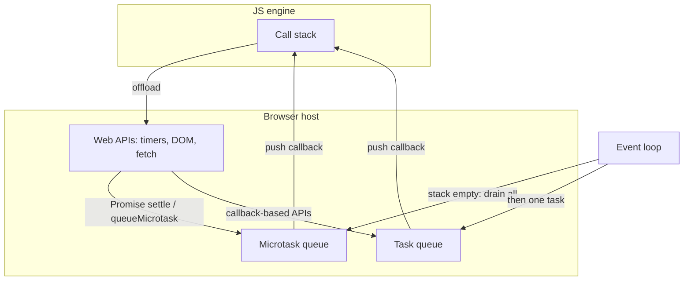
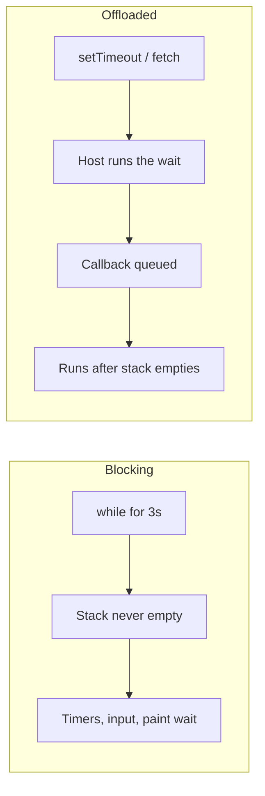
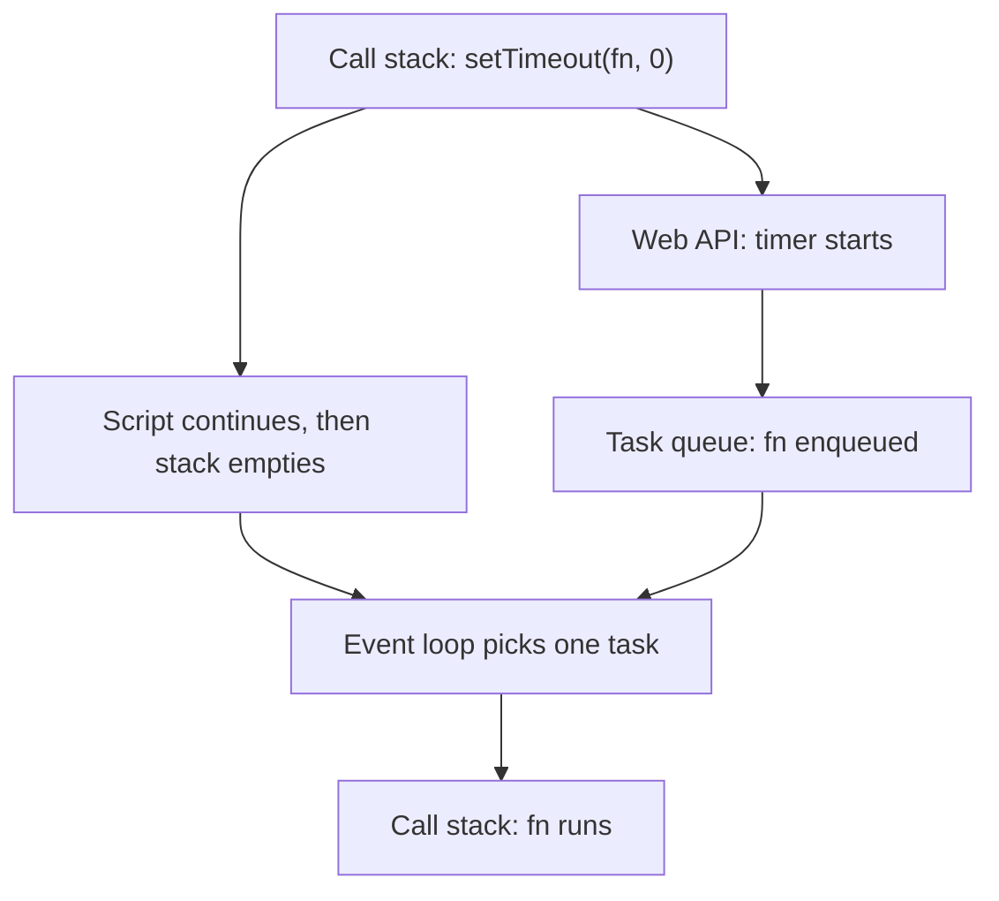
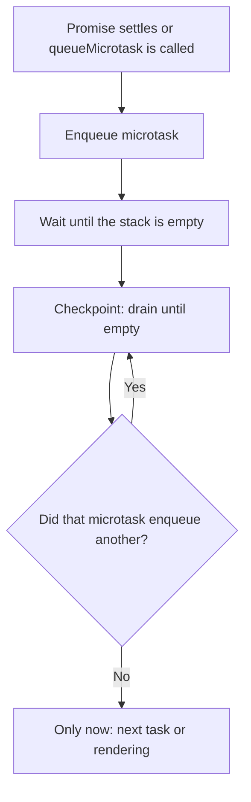
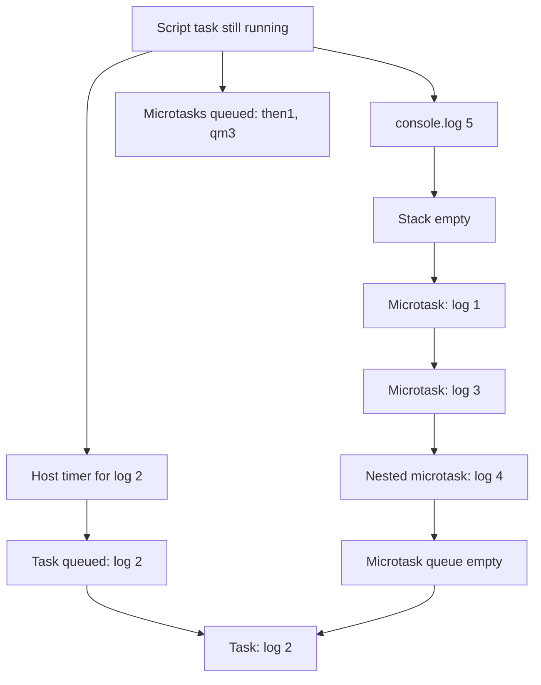
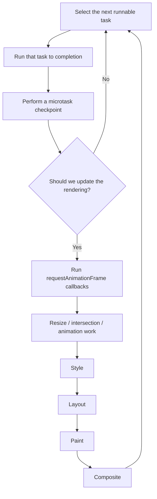
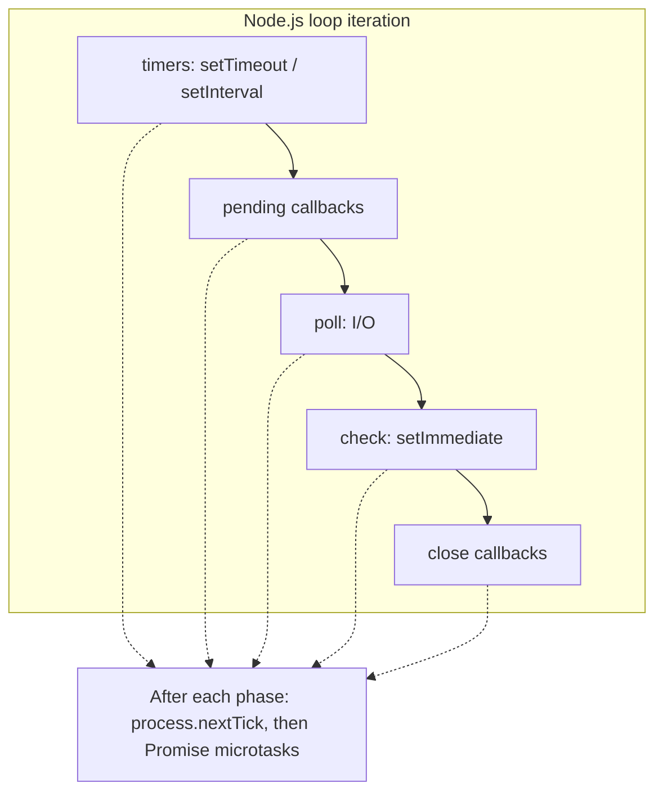

JavaScript 是 single-threaded。这不代表 timer 在走、或 network response 抵达时，browser 就闲着。它的意思是：**engine 一次只跑一段 JavaScript**，在 **call stack** 上；而 **host**——browser、Node.js、Deno——在后台做其他工作，稍后再请 engine 跑 callbacks。

负责这次交接的协调者是 **event loop**。它不是 JavaScript 语言功能。ECMAScript 规定 functions 如何互相调用、Promise jobs 如何被 queue。HTML Standard 规定 browser 如何把这些 jobs、timers、input、networking 与 rendering 变成重复的一轮：跑一个 **task**、排空 **所有 microtasks**、也许 **update the rendering**，然后再取下一个 task。

这篇笔记依 [Lydia Hallie 的可视化](https://www.youtube.com/watch?v=eiC58R16hb8) 同样顺序走完这个模型：stack、host APIs、task queue、microtask queue，然后是经典的 `5 1 3 4 2` 排序谜题。在影片的 recap 之后，会继续进入 WHATWG algorithm、rendering starvation、作为另一个 host 的 Node.js，以及 workers。同一套 runtime 的概览版是 [JavaScript 核心概念](/notes/core-javascript-concepts)。

<br />



<br />

同步代码在 stack 上跑。Host APIs 在 stack 外做完工作并 enqueue 一个 callback。每当 stack 为空，event loop 优先处理 **microtask queue** 并把它完全排空，然后才把 **一个** task 推上 stack。

---

## 1. Call Stack

**Call stack** 是 engine 目前正在执行什么的 last-in, first-out 记录。调用 function 会 push 一个 **execution context**。return 或 throw 会把它 pop 掉。只有最顶端的 frame 在跑。

<br />

```ts
function add(a: number, b: number): number {
  return a + b
}

function printSum(): void {
  const result = add(2, 3)
  console.log(result)
}

printSum()
```

<br />

Stack 会成长为 `printSum` → `add`，再随着每个 function return 而缩小。在这些 frames 还在的时候，没有别的东西能跑——没有 timer callback、没有 click handler、没有 Promise `.then`。JavaScript 不会为了去做别的事而抢占目前这个 function。

这就是 single-threaded 的约束。紧密的 loop 不会「分享 thread」。它占有 thread：

<br />

```ts
const start = Date.now()
while (Date.now() - start < 3000) {
  // The page cannot paint, handle clicks, or fire timers.
}
```

<br />



<br />

有用的问题不是「这是不是 asynchronous？」而是：**这会把 frame 留在 stack 上，还是会 return、让 host 把工作做完？**

---

## 2. Web APIs 是 Host，不是 Engine

V8、JavaScriptCore 与 SpiderMonkey 负责 evaluate JavaScript。它们不实现 `setTimeout`、`document.querySelector` 或 `fetch`。那些是 **Web APIs**：host 暴露给 script 的接口。

当 script 调用 callback-based host API 时，典型路径是：

1. 这次调用在 stack 上跑，几乎立刻 return。
2. Host 开始真正的工作——timer、network request、DOM listener。
3. 工作完成时，host **不会**把 callback 推进 stack。它把它放到 queue，等 event loop。

<br />

```ts
console.log("A")

setTimeout(() => {
  console.log("C")
}, 1000)

console.log("B")

// A, B, then C after the timer and after the stack is empty
```

<br />

`setTimeout` 本身是 synchronous。它只是 **schedule**。Delay 参数交给 host。一秒后 host 有一个就绪的 callback。这个 callback 是在 1000ms、1004ms，还是更晚才跑，取决于 stack 与下面要讲的 queues——不是只取决于 timer。

同样的切分也适用于其他 callback-based APIs：`addEventListener`、`XMLHttpRequest`、`MessageChannel`、旧的 Node `fs.readFile(path, cb)`。完成发生在 host。恢复执行则经过 queue。

Promise-based APIs 仍然用 host 做 I/O。差别在于 **continuation** 加入哪一条 queue。`fetch(url).then(onResponse)` 在 host 里等 network，Promise settle 之后把 `onResponse` 排成 **microtask**。这个区别就是本篇其余部分。

---

## 3. Task Queue

HTML Standard 称这些为 **tasks**。非正式写作常说 **macrotasks**。Timers、user input、`postMessage`、解析一段 classic `<script>`，以及许多 networking callbacks，都会变成 tasks。

对大多数调试来说，一条简化规则就够用：

- Event loop 跑 **一个** 被选中的 task。
- 然后做一次 **microtask checkpoint**。
- 只有在那之后，才会考虑下一个 task。

因此嵌套的 `setTimeout` 不能在父级目前这一轮里继续跑。它调度的是 **未来** 的工作：

<br />

```ts
const order: string[] = []

setTimeout(() => {
  order.push("timeout-1")
  setTimeout(() => {
    order.push("timeout-2")
  }, 0)
}, 0)

setTimeout(() => {
  order.push("timeout-3")
}, 0)

// Typical order: timeout-1 → timeout-3 → timeout-2
```

<br />

一条全局 FIFO queue 只是卡通。Host 维护多个 **task sources**——timer、DOM manipulation、user interaction、networking、history traversal——而且可能有不只一条 queue。Event loop 从某个 source **选出** 一个可跑的 task。理论上某个 source 可能被饿死；实务上「一个 task，然后 microtasks」这个心智模型仍能预测你的代码会做什么。

Script evaluation 本身就是一个 task。你加载的文件，或 parser 执行的 classic script，就是这个故事的第一个 task。Module 或 script **顶层**发生的一切，都是那个 task 跑到完成。

---

## 4. `setTimeout(fn, 0)` 不是立刻执行

Delay 为 `0` 的意思是「一旦你被允许跑 timer task 就尽快」，不是「在下一行之前」。Host 也可能 clamp 嵌套 timers——HTML 规定 nesting level 到 5 之后最少 4ms——但 clamp 是次要的。主要延迟来自 event loop。

<br />



<br />

Callback 必须等 **以下全部**：

- 目前这个 task 结束，且 stack 清空。
- 目前已 queue 的每一个 microtask，以及那些 microtasks 再 enqueue 的每一个 microtask。
- 任何已经在等的更早 tasks。

这就是为什么零延迟 timer 仍然会输给 `Promise.resolve().then(...)` 与 `queueMicrotask(...)`。Timer 已经就绪。它只是在错误的 queue。

---

## 5. Microtask Queue

**Microtasks** 是多数入门解释会漏掉的一块。当一个 task 结束、JavaScript execution context stack 为空之后，host 会做一次 **microtask checkpoint**：跑最旧的 microtask，重复直到 queue **清空**。

会 enqueue microtasks 的来源：

- Promise reaction jobs：`.then`、`.catch`、`.finally`
- `await` 之后的 `async` function continuation
- `queueMicrotask(fn)`
- `MutationObserver` callbacks

<br />



<br />

「排空直到清空」是重要规则。一个 microtask 若调用 `queueMicrotask` 或 resolve 另一个 Promise，会把工作加进 **同一轮** checkpoint。那些工作会在下一个 timer、click 或 paint 之前跑完。

<br />

```ts
const order: string[] = []

setTimeout(() => {
  order.push("task")
}, 0)

queueMicrotask(() => {
  order.push("micro-1")
  queueMicrotask(() => {
    order.push("micro-2")
  })
})

Promise.resolve().then(() => {
  order.push("promise")
})

// After the timeout finally runs:
// micro-1 → promise → micro-2 → task
```

<br />

`queueMicrotask` 与 `Promise.resolve().then` 共用一条 queue。顺序就是它们被 schedule 的顺序。它们不是比较快的 thread。它们是 **同一条 thread 上优先级更高的 queue**。

风险是好处的另一面。无界的 microtask 链永远回不到 task queue，也回不到 rendering：

<br />

```ts
function starve(): void {
  queueMicrotask(starve)
}

starve()
// Timers, clicks, and frames wait until this stops.
```

<br />

这不是理论。一个总是再 schedule 下一个 `then` 的 Promise `then`，或一个从不 yield 到 task 的 `await` loop，可以在没有任何 `while` 的情况下把页面冻住。

`await` 是建在 Promises 上的语法，不是第二套 scheduler。`async` function 永远返回 Promise。碰到 `await` 会暂停该 function，让目前的 stack unwind。等 awaited value settle 后，函数其余部分会被 queue 成 microtask。即使 `await Promise.resolve()` 也会 yield。它不会在下一行同步继续。

---

## 6. 把 Callback Promisify 会移动 Continuation

把 callback-based API 包进 Promise，并不会把 host 工作变成 microtask。它改变的是 host task 跑完 **之后**发生什么。

<br />

```ts
function delay(ms: number): Promise<void> {
  return new Promise((resolve) => {
    setTimeout(resolve, ms)
  })
}

delay(0).then(() => {
  console.log("then")
})
```

<br />

`setTimeout` 仍然 schedule 一个 **task**。当那个 task 跑起来，它调用 `resolve`。Promise settle 之后，才把 `.then` handler 排成 **microtask**。这个 microtask 会在下一个 timer 或 click 之前跑，但在 resolve 这个 Promise 的 **timer task 之后**。

比较：

<br />

```ts
Promise.resolve().then(() => console.log("microtask first"))
setTimeout(() => console.log("task second"), 0)

delay(0).then(() => console.log("microtask after its timer task"))
```

<br />

第一个 `.then` 在目前这个 task 期间就被 queue，所以它赢下第一轮 checkpoint。`delay(0).then` 必须等它的 timer task 跑过才能跑。Promisify 会让 **continuation** 相对已经 queue 的 microtasks 变晚，相对更后面的 tasks 变早。

这就是影片里 "promisify" 那一段：host API 仍然走 task queue；Promise reactions 仍然走 microtask queue。你必须知道自己站在 `resolve` 的哪一边。

---

## 7. Walkthrough：为什么 log 是 `5 1 3 4 2`

Hallie 的挑战是最短、却能逼出模型每一块的程序：

<br />

```ts
Promise.resolve().then(() => console.log(1))

setTimeout(() => console.log(2), 10)

queueMicrotask(() => {
  console.log(3)
  queueMicrotask(() => console.log(4))
})

console.log(5)

// 5, 1, 3, 4, 2
```

<br />

**在 script task 期间**，stack 仍在跑这个 module：

1. `Promise.resolve()` 建立一个已经 fulfilled 的 Promise。`.then` 立刻把它的 handler 排进 **microtask** queue。还没有任何 log。
2. `setTimeout` 把 callback 与 10ms delay 交给 host。Host 启动 timer。Callback 此时还不在任何 JS queue 上。
3. `queueMicrotask` 排入第二个 microtask。
4. `console.log(5)` 是 synchronous。它印出 **5**。
5. 与此同时 timer 可能到期。到期时 host 把 `() => console.log(2)` 排进 **task** queue。那仍然不是下一个该跑的 queue。

Script task 结束。Stack 为空。

**Microtask checkpoint：**

6. 最旧的 microtask：Promise handler。印出 **1**。
7. 下一个：`queueMicrotask` callback。印出 **3**，再 queue 另一个 microtask。
8. Checkpoint 还没结束。嵌套 callback 跑起来，印出 **4**。
9. Microtask queue 清空。

**下一个 task：**

10. Timer callback 被推上 stack，印出 **2**。

<br />



<br />

即使 10ms timer 在 checkpoint 之前还没到期，log 仍然会是 `5 1 3 4 2`——timer 只是稍晚一点加入 task queue。Microtasks 不等 timer。Timer 等 microtasks。

把 `queueMicrotask` 换成另一个 `Promise.resolve().then`，这些数字仍在同一类 queues。谜题重点不是 `queueMicrotask` 这个特别 API，而是 **stack 何时清空**，以及 **每个 callback 加入了哪一条 queue**。

---

## 8. HTML Event-Loop Algorithm

可视化是地图。HTML Standard 是领地。简化后、但更接近 spec 的 browser event-loop 一轮：

<br />



<br />

卡通通常跳过的三个细节：

**只要 JS stack 为空，checkpoint 就可以跑**，不只在某个被命名的 "turn" 结束时。Promise reactions 从不打断 resolve 它们的那个 function。它们在该 stack unwind 之后立刻跑。

**Rendering 是可选的。** Browser 对齐的是屏幕刷新——常常是 60Hz 或 120Hz——而不是「每个 task 之后」。跳过一次 rendering opportunity 是正常的。因为 main thread 忙碌而跳过每一次 opportunity，才是 jank。

**`requestAnimationFrame` 不是 microtask。** 它在 "update the rendering" 期间跑，在 checkpoint 之后、style 与 layout 之前。把 DOM writes 排进 rAF，是让它们对齐一个 frame。在那里做沉重计算仍然会挡住 paint；只是把这次挡住对准 vsync。

[Browser 中的 Critical Rendering Path](/notes/critical-rendering-path-in-the-browser) 就是那个 rendering 分支里发生的事：style、layout、paint、composite。Event loop 决定这个分支 **何时**被允许跑。长 task 会延迟它。永远排不空的 microtask 链会无限延迟它，因为 checkpoint 必须先结束。

这种耦合解释了为什么「async」JavaScript 仍然会掉 frames。紧密 loop 里的 `await` yield 的是 microtasks，不是 tasks。要给 browser 机会 paint 或处理 input，工作必须回到一个 **task**——`setTimeout`、有的地方的 `scheduler.yield()`、`MessageChannel`，或 Worker。

---

## 9. Node.js 是另一个 Host

语言相同。Loop 不同。Node.js 由 **libuv** phases 驱动，不是 HTML 的「task、microtasks、也许 render」。

一次 Node iteration 的精简图：

<br />



<br />

| Mechanism | Browser | Node.js |
| --- | --- | --- |
| Timer callback | Task（timer source） | `timers` phase |
| Promise `.then` / `queueMicrotask` | Microtask queue | Microtask queue，在 `nextTick` 之后 |
| `process.nextTick` | 不存在 | 在目前 operation 之后、Promises 之前排空 |
| `setImmediate` | 不存在 | `check` phase |
| `setTimeout(fn, 0)` vs `setImmediate` | N/A | 顺序取决于你从哪个 phase schedule |
| Rendering | "Update the rendering" | 没有；这是 server |

<br />

`process.nextTick` 是锋利的边缘。它 **不是** HTML 意义上的 microtask，而且优先级 **高于** Promise jobs。`nextTick` loop 会饿死 I/O，就像 microtask loop 会饿死 rendering。若你要的是「这个 stack 之后、I/O 之前」，又不想插队到 Promise queue 前面，优先用 `queueMicrotask` 或 Promise。

不要把 browser 的排序谜题搬到 Node 还指望同一份 log。从 main module schedule 的 `setImmediate` 与 `setTimeout(fn, 0)` 出名地不保证顺序。从 I/O callback 里，`setImmediate` 通常会赢，因为同一轮 iteration 里 `check` 接在 `poll` 后面。

Deno 与 Bun 在 timers 与 microtasks 上更接近 browser，然后加上各自的 I/O。可携规则仍然是：**要认识 host 的 queues，而不只是语言的 Promises。**

---

## 10. Workers 有自己的 Loops

**Web Worker**、**Shared Worker** 或 **Service Worker** 不是同一条 loop 上的第二个 stack。它是另一个 agent：自己的 heap、自己的 call stack、自己的 task 与 microtask queues、自己的 event loop。

`postMessage` 是 host API。消息被 serialize、传递，并在接收端 agent 的 loop 上被 queue 成 **task**。Worker 可以在页面的 loop 正在 paint 时计算。它不能碰页面的 DOM。共享内存需要 `SharedArrayBuffer` 与明确协调；它不会把两条 loops 合并。

这才是 browser JavaScript 真正取得 parallelism 的方式：另一条 event loop，通过 tasks 交谈。把 `while` offload 到 worker，会释放页面的 stack。它不会让 worker 自己的 stack 变得可抢占。Worker 仍然能用长 task 或 microtask 链饿死 **它自己的** timers 与 **它自己的** message handlers。

---

## 11. 什么会进哪一条 Queue

| API | Queue | Notes |
| --- | --- | --- |
| Sync function call | Call stack，立刻 | 挡住其他一切 |
| `setTimeout` / `setInterval` | Task | Delay 是下限 |
| `addEventListener` callback | Task | User-interaction 或其他 DOM source |
| `postMessage` / `MessageChannel` | Task | 用来 yield 给 rendering 很有用 |
| `fetch` completion then `.then` | Host I/O，然后 microtask | Network 本身不是 microtask |
| `Promise.then` / `.catch` / `.finally` | Microtask | 即使 Promise 已经 settled |
| `queueMicrotask` | Microtask | 与 Promise jobs 同一条 queue |
| `async` function after `await` | Microtask | `await` 永远 yield |
| `MutationObserver` | Microtask | 在同一轮 checkpoint 跑 |
| `requestAnimationFrame` | Rendering | Microtasks 之后、paint 之前 |
| `requestIdleCallback` | Idle task | 不是 microtask；负载高时可能永不跑 |
| `process.nextTick` | Node nextTick queue | 每个 phase 里，在 Promise microtasks 之前 |
| `setImmediate` | Node `check` phase | Poll 之后 |

<br />

当 log 顺序让你意外时，三个问题通常就能定位：

1. **现在 stack 上是什么？** 那段代码永远先跑完。
2. **什么被 queue 成 microtask？** 它们全部会在下一个 task 与 rendering 之前跑完。
3. **什么必须等下一个 task？** Timers、input、messages，以及下一段 script。

背下 `5 1 3 4 2` 不如能对任何片段画出这三个桶。Event loop 不是魔法，也不是 parallelism。它是一条政策：单一 thread 何时被允许跑下一个 callback。
