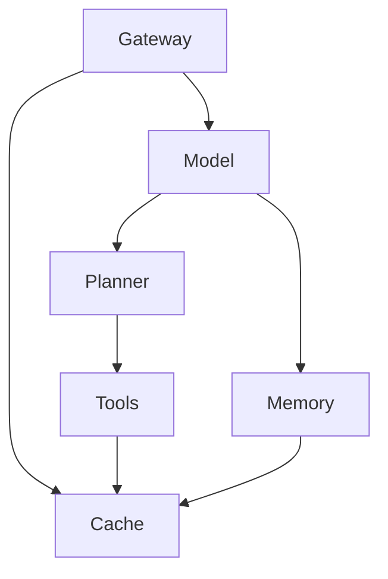
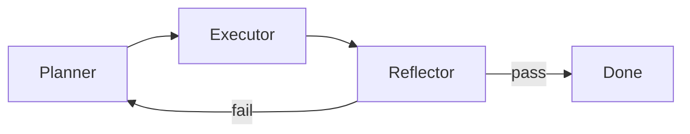

Production agents 死在 harness，不是死在 model。更强的 LLM 取代不了 identity checks、retry bounds、cache invalidation，或 capacity isolation。Model 选下一步动作。System 决定那个动作允不允许、能跑多久、错了之后怎么办。

白白说大模型用一组 ByteDance 风格的面试题走同一片地，见 [Agent系统架构与工程落地十连问快问快答](https://www.youtube.com/watch?v=x-s1Dbp4BE4)。这份 note 是那十题对 **Mastra**、**Hono**、**Better Auth**、**Pinecone** stack 的 production 读法。Tokens 住在哪里，见 [Agent memory 的四个层级](/notes/four-levels-of-agent-memory)。Documents 怎么变成可搜，见 [如何搭建一套 RAG 系统](/notes/how-to-build-a-rag-system)。Cache 与 queues 跟 [System Design 里的 Caching](/notes/caching-in-system-design) 和 [System Design 里的 Message Queues](/notes/message-queues-in-system-design) 是同一套 primitives。

<br />

---

## 1. 六层 production 形状

不要先画框。先讲清楚谁被允许做什么。Production agent 是普通后端本来就有的六层，model 坐在 request 中间：

<br />



<br />

| Layer        | Job                                                                 | 在这套 stack                                                |
| ------------ | ------------------------------------------------------------------- | ---------------------------------------------------------- |
| **Gateway**  | Authenticate、rate-limit、route session                             | Hono + Better Auth。Agent 跑之前先做 org membership        |
| **Model**    | Infer，决定下一步                                                   | LLM。不是 identity 的来源                                  |
| **Memory**   | 读写对话与长期 context                                              | Mastra `Memory` 加一个 store                               |
| **Planner**  | 把 intent 拆成带 acceptance criteria 的可执行步骤                   | Agent loop，或一个 bound 这个 loop 的 Mastra workflow      |
| **Tools**    | 碰世界：APIs、databases、search                                     | `createTool` 配 Zod schemas                                |
| **Cache**    | 重用热结果。永远不是第二个 source of truth                          | Redis 或同等物，有 key、有 version                         |

Gateway 像机场安检：贵的东西还没开始就先跑。Session、`userId`、`organizationId` 来自 verified Better Auth session 与 membership check，再放进 Mastra `requestContext` — 同一份契约见 [用 Hono、Better Auth、Drizzle 与 Postgres RLS 打造 Multi-Tenant 后端](/notes/multi-tenant-backend-drizzle-hono-better-auth)。Model 从不挑选 tenant。

**Failure：** 把 org、role、或 namespace 放进 model 填得了的 tool argument。那是泄漏，不是 feature。

<br />

---

## 2. Plan、execute、reflect 当成 state machine

有用的 agent 不是「再想硬一点」。它是一台有三个角色的 **state machine**：

- **Planner** — 产出有序步骤，每步带 acceptance check。复杂 intent 变成系统其余部分跟得上的 flow。
- **Executor** — 按那个顺序调用 tools 与 models。它跟计划走。它不发明新的 product surface。
- **Reflector** — 用 acceptance check 验证结果。失败时 **带着失败原因重新 plan**，像导航在路被堵住之后重算。

<br />



<br />

没有硬停止，loop 会一直救自己，把 context window 烧掉。三道锁不是可选的：

1. **Max retry rounds** — re-plan 的上限，不是建议。
2. **Per-step timeout** — hung 的 tool 是失败的一步，不是更长的等待。
3. **Human fallback** — 高风险或耗尽的路径停下来等人。

**Failure：** 无界的 ReAct loop。那是带 chat UI 的 token 焚化炉。

<br />

---

## 3. Memory 是条理，不是长度

更长的 context 不是更好的 memory。无法被寻址、过期、或 invalidation 的 memory，只是更大的 prompt。Ops 视角是四层。这不是 [Agent memory 的四个层级](/notes/four-levels-of-agent-memory) 里 Mastra 的 token-level 切法 — 那篇讲的是 *tokens 住在哪里*。这张表讲的是 *durable data 住在哪里*：

<br />

| Tier | 放什么                                | Typical store                         | 何时读                             |
| ---- | ------------------------------------- | ------------------------------------- | ----------------------------------- |
| **L1** | Short-term session context（热）    | Redis、session cache                  | 每个 turn                           |
| **L2** | Rolling session summary             | 压在 thread 旁边的 compressed text    | raw window 装不下时                 |
| **L3** | 长期 user 或 org profile            | Vector recall                         | 跨 sessions 的稀疏 facts            |
| **L4** | 不能漂的业务事实                    | Postgres / 产品数据库                 | 价格、库存、entitlements、policy    |

L4 是 source of truth。跟 Postgres 打架的 vector hit 是过期 index，不是更好的答案。

Cache keys 必须比「这个 user」更细。可重用的形状是 `userId + sessionId + toolId + result`，每个 key 绑 **TTL**、**version**、以及一条 **active invalidation** 路径。乱的 cache 比没有 cache 更糟：脏列会污染之后每一个 turn。

**Failure：** 把 context window 当成产品数据库，或 cache tool results 却没有 version，于是价格改了永远进不来。

<br />

---

## 4. 按 scale 选 vector store

选你真正有的 QPS 与 tenancy model，不是上周 demo 里的那一个。

<br />

| Store        | Fit                                      | 选错的代价                                                      |
| ------------ | ---------------------------------------- | -------------------------------------------------------------- |
| **Chroma**   | Local prototypes。上手快                 | 没有认真的 distribution。Corpus 长大，query quality 就掉        |
| **Pinecone** | Managed hybrid search。这份 repo 的路径  | Data 住在 vendor。QPS 与 dimension 上升，成本跟着升            |
| **Milvus**   | Private、cloud-native、storage/compute 分离 | 你自己运维。回报是 billion-scale retrieval                   |

高 QPS 的商品搜索不是「更多 vectors」。Category、price、stock 是 **filters**，不是 neighbors。RAG note 已经用 `namespace = organizationId` 切单一 Pinecone hybrid index。在 corpus 与 concurrency 真的需要自建 cluster 之前，留在那条路上。

**Failure：** 把 SKUs 当散文 embed，然后指望 cosine similarity 执行「这个地区有货」。

<br />

---

## 5. Function-calling 的装甲

Tool call 是带着 production credentials 的不信任实习生。Model 的 JSON 与 side effect 之间有五道检查：

1. **Schema validation** — call 符合 Zod（或 JSON Schema）契约。
2. **Parameter completion** — server-owned fields 从 `requestContext` 填，不从 model 填。
3. **Permission check** — 这个 session 真的可以对这行调用这个 tool。
4. **Idempotency** — 退款、写入、发送带 key，retry 不是双重扣款。
5. **Result validation** — tool output 先整形，再进 context window。

同一个 tool 失败两次，就 **circuit-break**：

- 记下 error class，把那个 tool **从当前 context 拿掉**，让 model 转不起来。
- 切断 executor，把错误喂回 planner，强制新 plan。
- 回 **rule-based fallback**，而不是再一次 hallucinated call。
- 在 token 账单与用户体验一起崩之前，转给人。

Permission checks 的 identity 是 session，绝不是 tool args 里的 role 字符串。

**Failure：** 解析 free-text「function calls」，或因为 model 又问了一次就重试 mutating tool。

<br />

---

## 6. Tool descriptions 是合约

Description 是 model 真正会读的说明书。模糊的 tools 会重叠。重叠的 tools 会被叫去做错的工作。合约有四块：

- **Purpose** — 何时调用。
- **Boundaries** — 碰哪些 data。
- **Input constraints** — 必填字段与格式。
- **Forbidden uses** — 绝对不能做什么，以及改叫哪个 tool。

库存查询不是价格查询。Description 不写清楚，model 就会用同一个 tool 做两件事。

<br />

```ts title="src/mastra/tools/query-inventory.ts"
import { createTool } from "@mastra/core/tools"
import { z } from "zod"

export const queryInventory = createTool({
  id: "query-inventory",
  description:
    "Call when the user asks whether a specific item is for sale or in stock in a region. Requires item_id (numeric) and region_code (province/city/district). Do not use this for price, coupons, recommendations, rankings, or shop search — call query-price or the matching catalog tool instead.",
  inputSchema: z.object({
    itemId: z.string().regex(/^\d+$/).describe("Numeric product id"),
    regionCode: z.string().min(1).describe("Standardized region code"),
  }),
  execute: async ({ itemId, regionCode }, { requestContext }) => {
    const organizationId = requestContext.get("organizationId")
    return lookupStock({ organizationId, itemId, regionCode })
  },
})
```

<br />

`organizationId` 从 context 读，不从 schema 读。Model 不能靠发明一个 id 去跨 tenant 购物。

**Failure：** 一个「什么都做」的 `search` tool，description 只有一句话。

<br />

---

## 7. 按 corpus 决定 chunk size

没有万能的 chunk size。单位是 **semantic integrity 加 recall accuracy**，而且随文件变：

<br />

| Corpus                   | Size / shape                 | Rule                                                                   |
| ------------------------ | ---------------------------- | ---------------------------------------------------------------------- |
| **Customer-service FAQ** | 300–500 characters           | 一题一答一个 chunk。不要跨两则 FAQ                                     |
| **Technical docs**       | 800–1200 characters          | 沿 Markdown headings 与 fenced code 切。绝不从中间剖开 code block      |
| **Product records**      | Structured JSON / metadata   | Price、material、stock、reviews 当字段。用 filter 取，不是用段落       |

Layout-aware parsing（RAG note 里的 Reducto）是让这些切法成真的 ingest step。这节只讲政策。不要在 chat turn 里再切一次。

**Failure：** 在 FAQ corpus 上滑 2k-token window。Retrieval 会回错误的问题配上看起来对的答案。

<br />

---

## 8. 当 retrieval 不相关

单靠 vector similarity 是开盲盒。Top hits 答不了问题，就按这个顺序 debug：**chunking → index → rank**。然后用 RAG read path 上已经有的四个杠杆：

1. **Hybrid search** — BM25（或 sparse）对 exact tokens，dense vectors 对 paraphrase。单独哪个都不够。
2. **Query rewrite** — embed 之前先正规化用户说法（「Apple phone」→「iPhone」），让 index 看到它被建出来时用的词。
3. **Reranker** — 先捞宽候选，打分，只留前两三条。把二十个 chunks 倒进 window，就是 relevance 死掉的方式。
4. **Hard business filters** — brand、price range、in-stock、`organizationId`。这些是 predicates，不是 similarities。

**Failure：** 把 `topK` 加到看起来对为止。那是用更大的 prompt 把坏 index 藏起来。

<br />

---

## 9. Latency 看 P95，不是平均

用户要的是 **赶快看到东西**，不是等完整 graph。优化尾巴：

- **Parallelize** 没有数据依赖的 tools。两个 call 互不依赖，就一起开（`Promise.all`）。默认串行是自己造成的 P95。
- **Cache** 高频、相同的 queries 进 Redis。答案不可能变时，跳过 model。
- **Precompute** 昂贵的 aggregations。一条写 snapshot 的 cron，比每个 turn 都 join 的 tool 便宜。
- **Route** 简单 intents 给小 model。大 model 留给需要它的决策。
- **Stream** 部分 tokens。长工作应该 async，带看得见的进度，而不是安静的 30 秒 request。
- **Time out**。不回来的外部 API 是失败的一步。切断，然后 reflect。永远等下去，P95 就变成 P100。

**Failure：** 在一个串行扇出五个 tools 的 chat 上量 mean latency，然后怪 model。

<br />

---

## 10. Scale 无状态那一侧

负载下的做法是 **把无状态 orchestration 跟有状态 storage 拆开**。

- **Gateway** — 在 agent loop 之前 rate-limit、queue、shed load。它是水坝，不是 passthrough。
- **Stateless workers** — plan/execute/reflect 过程、Hono handlers、没有 local session files 的 Mastra runs。Horizontal scale（依 queue depth 与 P95 的 HPA）可以在几秒内加 replicas。
- **Stateful resources** — model API concurrency、vector-index connection pools、第三方 tool quotas。这些不会因为加 pods 就变大。设上限，把等待者隔开。

把 **long tasks** 跟 **short tasks** 分开。一次占 model slot 好几分钟的 research crawl，若跟「我的订单状态？」共用一个 pool，会把短请求饿死。

**Failure：** 把 agent loop 跑在 web process 里，然后指望 Kubernetes 去复制 Postgres connections 和 vendor RPM limit。

<br />

---

Model 仍然选下一步动作。Harness 把 retries、identity、cache、capacity 框住，让那个选择不能把产品一起拖垮。上面十题是这句话的面试形式。视频在 [这里](https://www.youtube.com/watch?v=x-s1Dbp4BE4)。
