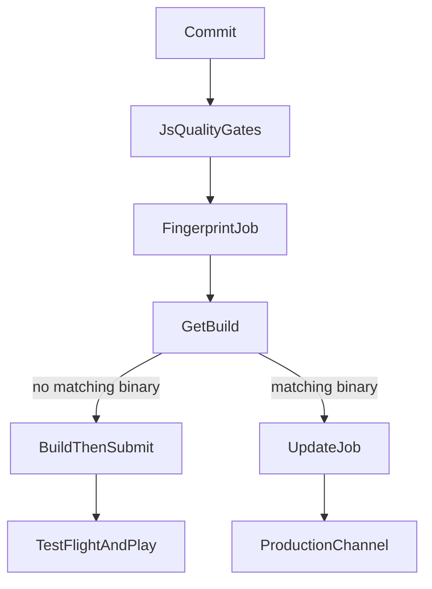
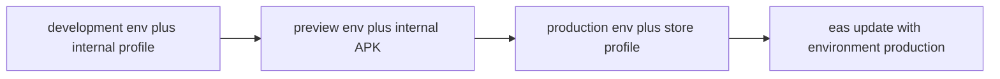
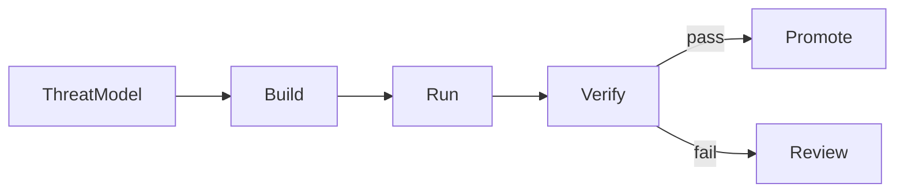

React Native CI/CD 是把一个 commit 转成 signed binary、over-the-air JavaScript bundle，或两者皆有的系统——并且能在设备已经装上之后停掉一次坏的 release。它不是一份跑 `eas build` 的 YAML。它决定哪个 native surface 值得信任、一个 job 可以读哪个 environment、谁可以 submit 到 store，以及 crash-free sessions 下跌时团队如何恢复。

Provider-neutral 的 web pipeline 见 [React 的 Frontend CI/CD](/notes/frontend-ci-cd-for-react)。整体安全流程见 [DevSecOps](/notes/devsecops)。设备威胁模型见 [React Native 里的 Security](/notes/security-in-react-native)。本文是 Expo playbook：**EAS Workflows** 编排 Build、Submit 与 Update，JavaScript quality gates 则留在 GitHub Actions 或其他组织 CI。

本文使用一个**虚构的** Expo app，以 Continuous Native Generation 发布。Native `ios/` 与 `android/` 目录是 generated，不是 committed。基线与 [深入理解 React Native](/notes/understanding-react-native-in-depth) 相同：Expo 是 orchestrator；React Native 是 renderer；EAS 是 delivery adapter。

<br />

---

## 1. Mobile CD 不是 Web CD

在 web，团队通常可以发布一个 immutable artifact，并在数分钟内把流量切过去。在 React Native，Apple 与 Google 仍拥有时间线的一部分。自动化可以让 build 持续 **deliverable**。它不能跳过 store review、signing，也不能假装已安装的 binary 能从每台设备拔走。

Expo app 可以送到三个 target。用哪个 EAS service，取决于改了什么：

| Target | EAS service | 何时使用 |
| --- | --- | --- |
| App stores | EAS Build 与 EAS Submit | 新 release、native code、permissions、SDK upgrades |
| 已安装设备 | EAS Update | 能放进已安装 native runtime 的 TypeScript 与 assets |
| Web | EAS Hosting | 与 native 并行的 Expo Router web app |

EAS Build 编译 native binary，耗时数分钟到数小时。EAS Update 在已经包含对应 native surface 的 binary 里替换 JavaScript bundle，耗时数秒。Config plugin、新的 Expo Module、permission 或 SDK bump 需要新 binary。EAS Update 无法凭空创造它们。这份合约与 [深入理解 React Native](/notes/understanding-react-native-in-depth) 对 prebuild 与 Metro 的区分相同。

不要因为触发了 cloud build 就称 pipeline 为「continuous deployment」。停在 expo.dev 的 binary 尚未 delivered。让旧 client crash 的 update 不是 hotfix。

<br />



<br />

---

## 2. EAS 是四个服务、一个 Dashboard

**EAS Workflows** 是 Expo 的 CI/CD 服务。Workflows 跑在 EAS-hosted 的 Linux 与 macOS workers。它们自动化 builds、over-the-air updates、store submissions、Maestro tests，以及 EAS Hosting deploys。EAS project 连到 GitHub 之后，push、pull request、label、cron schedule 或 App Store Connect event 都能启动一次 run。任何 workflow 也可以用 `eas workflow:run` 启动，不论 `on` trigger 如何设置。

另外三个服务是 Workflows 串起来的 primitives：

| Service | Job | 产出 |
| --- | --- | --- |
| **EAS Build** | `type: build` | `eas.json` 某个 profile 的 signed 或 simulator binary |
| **EAS Submit** | `type: submit` / `type: testflight` | 上传到 Play Console 或 App Store Connect |
| **EAS Update** | `type: update` / `type: update-rollout` | channel 或 branch 上的 JavaScript bundle |

没有 `needs` 的 jobs 默认并行执行。`needs` 等成功。`after` 等完成，不论 upstream 成功或失败。Artifacts、logs 与 test results 都落在 expo.dev。

Expo 自己的建议：Expo 形状的工作——builds、updates、submissions、Maestro——用 Workflows。Pipeline 依赖 Docker、custom runners 或大型非 mobile job graph 时，改用其他 CI。这不是贬低。Workflows 是 purpose-built；GitHub Actions 是 general-purpose。

文档写明的平台限制：**没有 shared workflow files**（每份 YAML 独立；custom functions 只能重用 step sequences）以及 **没有 matrix builds**。

<br />

---

## 3. Project Contract

假设一个 CNG workspace：

```text
app/                    Expo Router screens
app.config.ts           dynamic config; reads process.env
eas.json                build, submit, and CLI policy
.eas/workflows/         EAS Workflows YAML
.maestro/               thin device journeys
package.json
```

`eas build:configure` 写入默认 `eas.json` profiles。名称是惯例，不是魔法——profile 可以叫 `foo`——但三个默认对应团队真正的发布方式：

```json title="eas.json"
{
  "build": {
    "development": {
      "developmentClient": true,
      "distribution": "internal",
      "environment": "development"
    },
    "preview": {
      "distribution": "internal",
      "environment": "preview"
    },
    "production": {
      "environment": "production"
    }
  }
}
```

- **development** 包含 `expo-dev-client`。永不 submit 到 store。Internal distribution 把它放到实体设备；iOS Simulator variant 需要独立 profile 上的 `"ios": { "simulator": true }`。
- **preview** 是给 QA 的 production-like build：没有 dev tools，internal distribution。Android preview 通常是 APK；store production 是 AAB。
- **production** 是 store binary。经 TestFlight 或 Play 安装，不是 sideload，除非 Android 明确设 `"buildType": "apk"`。

Production signing 设置一次，不是写在 pull-request YAML：

```sh
eas credentials:configure-build -p android -e production
eas credentials:configure-build -p ios -e production
```

`eas update:configure` 安装 `expo-updates` 并接好 channels。该 library 第一次进入 binary 之后，需要一次新的 native build。

先用 templates 建立 workflows，再改：

```sh
npm install -g eas-cli
eas workflow:create --template build
eas workflow:create --template deploy
eas workflow:run .eas/workflows/build.yml
```

`deploy` template 会 fingerprint project，native characteristics 变了就 build 并 submit；已有 matching binary 就 publish update。

<br />

---

## 4. Stages 与 Environment Secrets

Stage 不是 Git branch。它是 Build、Update、Workflows 与 Hosting **用同一套方式 resolve 的 named variables**。本机 `.env` 是给 laptop 用的。它们被 gitignore，所以 remote job 看不到——除非有人 commit 了它们，那是 leak，不是 workflow。

EAS 默认三个 environments：`development`、`preview`、`production`。Custom names 在 Enterprise 与 Production plans 才有。一个 variable 可以活在一个或多个 environment。



### Build profile 对应 environment

在每个 profile 明确设 `environment`。省略时 EAS 会推断：

- `distribution` 是 `store` → `production`
- `developmentClient` 是 `true` → `development`
- 其余 → `preview`

```sh
eas env:set --name EXPO_PUBLIC_API_URL --value https://api.example.com --environment production --visibility plaintext
eas env:list --environment production
eas env:pull --environment production
```

`eas env:pull` 为该 environment 写一份本机 `.env`。文件保持 gitignored。Secret-visibility 的值不会写出来。

EAS Update 在 SDK 55 或之后，`--environment` 是必填。该 flag **只**用指定的 EAS environment，并忽略本机 `.env`，让 update bundle 与用同一 environment build 的 binary 一致。Secret-visibility variables 在 update 过程不可用：它们在 EAS servers 以外读不到，也不该是 bundle 需要的值。

```sh
eas update --environment production
eas env:exec --environment production 'npx sentry-expo-upload-sourcemaps dist'
```

### Workflow job environment

省略 `jobs.<job_id>.environment` 时，默认依 job type 而定：

| Job | Default environment |
| --- | --- |
| `build` | Profile 在 `eas.json` 的 `environment`，或上述推断规则 |
| `submit` | 继承被 submit 的 build |
| `maestro` / `maestro-cloud` | `preview` |
| `fingerprint`、`update`、`deploy`、custom | `production` |

Fingerprint 与 update jobs 要明确设 `environment`，与配对的 build 一致。在 `production` 算出的 fingerprint 不会 match 用 `preview` variables 建成的 binary。那是错的 hash，不是 flaky job。

```yaml title=".eas/workflows/fingerprint-and-build.yml"
name: Fingerprint and build

jobs:
  fingerprint:
    type: fingerprint
    environment: production
  build_ios:
    needs: [fingerprint]
    type: build
    params:
      platform: ios
      profile: production
```

### Visibility

| Visibility | 谁能读 | 用途 |
| --- | --- | --- |
| **Plain text** | Dashboard、EAS CLI、job logs | Public config：`EXPO_PUBLIC_API_URL`、`APP_VARIANT` |
| **Sensitive** | Dashboard（toggle）、EAS CLI；job logs 会 obfuscate | Laptop 必须看到的 tokens，例如 `SENTRY_AUTH_TOKEN` |
| **Secret** | 只有 EAS servers；logs 会 obfuscate | Job-time 值：`NPM_TOKEN`、`google-services.json` 文件 |

Expo 的规则写两次，因为团队最常跳过：**client-side code 里的任何东西都是 public**。`EXPO_PUBLIC_*` 会 inline 进 Metro bundle。`app.json` 的 `extra` 也在 bundle 里。Hermes bytecode 只是让随便读慢一点，不是加密。Secret visibility **不能**保护你 embed 进 app 的值。它存在是为了让 build job 安装 private npm packages，或读 runner 需要的文件。这句与 [React Native 里的 Security](/notes/security-in-react-native) 相同：binary 持有 public identifiers 与 user-bound tokens，不是 authority。

Scope 是 project-wide 或 account-wide。Account-wide variables 在 job 上与 project variables merge。类型是 strings 或 files。像 `GOOGLE_SERVICES_JSON` 这种 file variable，在 runner 上是一条 path：

```js title="app.config.ts"
export default {
  android: {
    googleServicesFile:
      process.env.GOOGLE_SERVICES_JSON ?? "/local/path/to/google-services.json",
  },
}
```

Plain-text 与 sensitive variables 在 EAS CLI resolve dynamic app config 时可用。Secret variables 不行：它们永不离开 EAS servers。

### Promotion 规则

每个 environment 一个 API origin、一个 bundle identifier、一个 update channel。不要靠事后改 env，把 preview binary promote 成 production。Public config 在 build 或 update 时 bake。真正的 secrets 留在 server——与 web app 同一套 Hono / Better Auth API。Signing material 与 store API keys 永不出现在 pull-request jobs。

<br />

---

## 5. Workflow Files、Triggers 与 Pre-Packaged Jobs

Workflows 放在项目根的 `.eas/workflows/`，就像 GitHub Actions 放在 `.github/workflows/`。Trigger syntax 看起来很熟。差别是 pre-packaged jobs：`type: build` 带上 worker、Xcode 或 Android SDK、credentials 与 artifact upload。常见路径不需要自制 `runs-on`。

```yaml title=".eas/workflows/build.yml"
name: Create Production Builds

on:
  push:
    branches: ["main"]

jobs:
  build_android:
    type: build
    params:
      platform: android
      profile: production
  build_ios:
    type: build
    params:
      platform: ios
      profile: production
```

Triggers（来自 syntax reference）：

- `on.push`、`on.pull_request`、`on.pull_request_labeled`、`on.pull_request_comment`、`on.ref_delete`
- `on.schedule.cron`
- `on.workflow_dispatch` 加上 inputs
- `on.app_store_connect`（`app_version`、`build_upload`、`external_beta`、`beta_feedback`），需先在 project 设置 App Store Connect connection
- `eas workflow:run` 与 REST API，有没有 `on` block 都可以

Production pipeline 真正会用的 pre-packaged jobs：

| `type` | 角色 |
| --- | --- |
| `build` | `android` 或 `ios` 某个 profile 的 native binary |
| `fingerprint` | Native-characteristic hashes（`android_fingerprint_hash`、`ios_fingerprint_hash`）。**只支持 CNG**——committed `ios/` 或 `android/` 会令此 job 失败 |
| `get-build` | 符合 fingerprint、profile 或其他 filters 的既有 EAS build |
| `update` | 把 OTA bundle publish 到 channel 或 branch |
| `update-rollout` | 改变收到 update 的用户百分比 |
| `submit` | 把 build 送到 Play 或 App Store Connect |
| `testflight` | Upload 及／或 submit 到 TestFlight |
| `maestro` | 对某个 `build_id` 跑 simulator/emulator flows（文档标为 **alpha**） |
| `repack` | 替换既有 binary 里的 JS bundle 并 re-sign——给 tests 用的 build-time update |
| `require-approval` | Human gate；approve 是成功，reject 是失败 |
| `github-comment` | 带 QR code 或 build link 的 PR comment |
| `slack` | Notification |
| `branch-delete` | git ref 删除时清理 update branch |
| `deploy` | EAS Hosting |
| `doc` | Run log 里的 Markdown |

Custom jobs 用 `steps`、`eas/checkout`、`eas/install_node_modules` 与 `set-output`。Fingerprint 与 build jobs 应优先用 EAS environment variables，而不是 inline `env`，让 hashes 保持一致。Inline `env` 会覆盖所选 environment，而且计算 hash 的每一处都要重复。

在 worker 上用 `${{ env.VARIABLE_NAME }}` 或 `process.env.NAME` / `$NAME` 读变量。

<br />

---

## 6. Preview：先 Fingerprint，再 Update 或 Build

大多数 pull requests 改的是 TypeScript，不是 native code。每次改 docs 都 rebuild iOS，浪费 macOS worker 与 signing slot。官方 pattern 是 fingerprint → get-build → 有 binary 就 update，没有就 build。

```yaml title=".eas/workflows/preview.yml"
name: Build or update preview

on:
  pull_request:
    branches: ["main"]

jobs:
  fingerprint:
    type: fingerprint
    environment: preview

  android_get_build:
    needs: [fingerprint]
    type: get-build
    params:
      fingerprint_hash: ${{ needs.fingerprint.outputs.android_fingerprint_hash }}
      platform: android
      profile: preview

  android_update:
    needs: [android_get_build]
    if: ${{ needs.android_get_build.outputs.build_id }}
    type: update
    environment: preview
    params:
      channel: preview
      platform: android

  android_build:
    needs: [android_get_build]
    if: ${{ !needs.android_get_build.outputs.build_id }}
    type: build
    params:
      platform: android
      profile: preview
```

iOS 重复同一套 get-build / update / build。加一个 `github-comment` job，让 reviewers 不用离开 pull request 就能安装 preview。

Fingerprint 哈希 native characteristics：dependencies、native project files、configuration。`environment` 要与 build profile 对齐。优先用 EAS environment variables，而不是 job-level `env`，让 fingerprint、build、update 解析到同一组值。

JavaScript quality gates——format、lint、`tsc`、Jest、React Native Testing Library——仍属于每个 pull request。放在 GitHub Actions 或 custom Workflows job。EAS 不能取代 [如何在 React Native 写 Tests](/notes/how-to-write-tests-in-react-native)。

<br />

---

## 7. Production：官方 Deploy Workflow

文档里「deploy to production」workflow，在 push 到 `main` 时：

1. 在 `production` environment 哈希 native characteristics。
2. 每平台查找既有 production build。
3. 没有就 build 并 `submit`。
4. 有就在 `production` branch publish update。

```yaml title=".eas/workflows/deploy.yml"
name: Deploy to production

on:
  push:
    branches: ["main"]

jobs:
  fingerprint:
    name: Fingerprint
    type: fingerprint
    environment: production
  get_android_build:
    name: Check for existing android build
    needs: [fingerprint]
    type: get-build
    params:
      fingerprint_hash: ${{ needs.fingerprint.outputs.android_fingerprint_hash }}
      profile: production
  get_ios_build:
    name: Check for existing ios build
    needs: [fingerprint]
    type: get-build
    params:
      fingerprint_hash: ${{ needs.fingerprint.outputs.ios_fingerprint_hash }}
      profile: production
  build_android:
    name: Build Android
    needs: [get_android_build]
    if: ${{ !needs.get_android_build.outputs.build_id }}
    type: build
    params:
      platform: android
      profile: production
  build_ios:
    name: Build iOS
    needs: [get_ios_build]
    if: ${{ !needs.get_ios_build.outputs.build_id }}
    type: build
    params:
      platform: ios
      profile: production
  submit_android_build:
    name: Submit Android Build
    needs: [build_android]
    type: submit
    params:
      build_id: ${{ needs.build_android.outputs.build_id }}
  submit_ios_build:
    name: Submit iOS Build
    needs: [build_ios]
    type: submit
    params:
      build_id: ${{ needs.build_ios.outputs.build_id }}
  publish_android_update:
    name: Publish Android update
    needs: [get_android_build]
    if: ${{ needs.get_android_build.outputs.build_id }}
    type: update
    params:
      branch: production
      platform: android
  publish_ios_update:
    name: Publish iOS update
    needs: [get_ios_build]
    if: ${{ needs.get_ios_build.outputs.build_id }}
    type: update
    params:
      branch: production
      platform: ios
```

这是对一个**决策**的 Continuous Delivery，不是把每个 commit Continuous Deployment 到每台手机。Store review 仍会发生。Update 仍须符合已安装的 runtime version。Expo 的 update FAQ 写得很清楚：App Store 与 Play 的 guidelines 约束 update 的**内容**，不只是机制。行为变更往往仍需 review。之后的 store binary 应包含同一修复，让新安装不必永远依赖 OTA。

Runtime version policy 是兼容性闸门。`fingerprint` policy 在 native characteristics 改变时更新 runtime。手动 `runtimeVersion` 字符串是完全控制，也是完全责任。送出调用已安装 binary 没有的 native module 的 JavaScript，就是 crash loop。`expo-updates` 可能 rollback 到上一个可用 update；不要设计成以为它一定救得了你。

Update 不健康时，把上一个 update republish 盖上去——这是 Expo 文档里的 revert——若 native surface 错了，再跟一发 store binary。

<br />

---

## 8. Approvals、TestFlight、Rollout 与 App Store Connect

Store submission 是 privileged work。组织要求时，前面加一道 human gate：

```yaml title="Approval before submit"
jobs:
  require_approval:
    name: Submit to stores?
    needs: [build_ios, build_android]
    type: require-approval
  submit_ios:
    needs: [require_approval]
    type: submit
    params:
      build_id: ${{ needs.build_ios.outputs.build_id }}
```

`require-approval` 没有 parameters。Approve 是成功；reject 是失败。`needs` 它的 jobs 只在 approve 后跑。`after` 它可以依 `failure()` 分支。

先走 TestFlight 与 Play internal testing，再上 production tracks。`type: testflight` 负责 upload，并可选择 submit。用**同一颗** binary 在 tracks 之间 promote；不要为每个 track rebuild。

`update-rollout` 改变已 publish update 的用户百分比。当 production JavaScript 是 blast radius 时，与 `require-approval` 配对。监察 crash-free sessions，再扩大或 republish 上一个 update。

App Store Connect triggers 补上 store 拥有的那一段。在 Project settings → General → Connections 接好 app 之后：

```yaml title=".eas/workflows/asc-ready.yml"
name: React to App Store Connect events

on:
  app_store_connect:
    app_version:
      states:
        - ready_for_review
        - waiting_for_review

jobs:
  send_slack_notification:
    type: slack
    environment: production
    params:
      webhook_url: ${{ env.SLACK_WEBHOOK_URL }}
      message: "App version is ready for review or waiting for review."
```

跑 workflow 前，先在 `production` environment 建立 `SLACK_WEBHOOK_URL`。

Tag-based releases 是另一种 production trigger。Expo 的 CI/CD tutorial 把 version tags 当成 `main` deploy 的延伸：同一套 fingerprint 决策，更慢的人为节奏。

<br />

---

## 9. React Native Pipeline 上的 DevSecOps

[DevSecOps](/notes/devsecops) 是 Build / Run / Verify。本节把该模型套到 Expo。它不取代应用层安全。UI 仍不是 authorization。API 仍 authenticates 每一次调用。



### Build——什么进入 graph

React Native 有**三条** dependency graphs：npm、Gradle、CocoaPods。Frozen JavaScript lockfile 必要但不充分。项目产生 Podfile.lock 与 Gradle lockfile 时要 commit；review config plugins 与 `app.config.ts`，就像 native 团队 review Xcode project。在 CNG 之下，那些文件**就是** native project。

- 每个 pull request 做 secret scanning。阻挡 committed `.env`、keystores、`.p8` keys，以及持有 server key 的 `google-services.json`。File-type EAS secrets 存在，就是为了让那些文件永不进 git。
- 对 npm **以及** native modules 做 software composition analysis。
- GitHub Actions 当 JS gate 时，把 third-party actions pin 到完整 commit SHA。Version tags 是 mutable。
- `EXPO_PUBLIC_*` 与 `extra` 的审查属于 code review，不是之后才做的 security pass。

### Run——pipeline identity

当另一套 CI 触发 EAS 时，`EXPO_TOKEN`（或 SSO-backed robot user）就是 EAS 的 machine identity。能 submit production 的 token，绝不能给来自 forks 的 `pull_request`。

- 分开 EAS environments，让 preview job 解析不到 production secrets。
- Signing 放在 `eas credentials`，不是 CI runner 上的 base64 blobs。Store API keys（App Store Connect `.p8`、Play service account）属于 submit 与 TestFlight jobs，政策要求时放在 approval 之后。
- 经 Expo GitHub app、在已链接的 repository 触发 production Workflows。不要用带 write-capable secrets 的 `pull_request_target` 去 checkout 不信任的 code。
- CI 上的 internal ad hoc iOS builds，要 refresh provisioning profile，让新登记设备被包含：build job 设 `refresh_ad_hoc_provisioning_profile: true`，或 `eas build --non-interactive` 加 `--refresh-ad-hoc-provisioning-profile`。

当 profile 必须从 CI re-sign 时，可选的 Apple repair credentials：`EXPO_ASC_API_KEY_PATH`、`EXPO_ASC_KEY_ID`、`EXPO_ASC_ISSUER_ID`、`EXPO_APPLE_TEAM_ID`、`EXPO_APPLE_TEAM_TYPE`。那些是 store-identity secrets，不是 app-bundle constants。

### Verify——promote 前的证据

| Gate | 证明什么 | 阻挡 |
| --- | --- | --- |
| Lint、types、Jest / RNTL | JS 行为与合约 | Pull request |
| Secret scan + SCA | 没有新 credential 或已知坏 dependency | Pull request |
| Fingerprint + get-build | Native surface 对上已知 binary，或需要新的 | Release 决策 |
| Maestro（thin suite） | Simulator/emulator 上的关键 journeys | Merge 或 release |
| `require-approval` | 有人接受 store 或 production OTA 风险 | Submit / rollout |
| 按 version 的 crash-free sessions | 已发布 artifact 可居住 | 继续 rollout |

Fingerprint 加 get-build 是 native 层的 provenance：你 promote 一颗已知 binary，或承认需要新的。你不会默默用另一个 Xcode rebuild「同一个」commit。

OTA 不是安全逃生口。Store guidelines 仍然适用。Runtime-incompatible update 是可靠性事故。回应顺序：

1. 停下 `update-rollout`，或 republish 上一个 update。
2. 停下 store phased release。
3. 合约允许时，用 server flag 关掉功能。
4. Native surface、entitlements 或 SDK 错了，就出 hotfix binary。

把 release identity——commit SHA、fingerprint hash、app version、build number——挂上 telemetry。没有它，「release 之后 errors 上升」只是感觉。

<br />

---

## 10. EAS 上的 Maestro

便宜的 tests 留在 Jest。Maestro 证明 native seams：Android Back、permission sheets、键盘盖住按钮。这份分工见 [如何在 React Native 写 Tests](/notes/how-to-write-tests-in-react-native)。Expo 的 `maestro` job 文档标为 **alpha**。把它当 thin release-blocking suite，不是 Jest graph 的第二份副本。

```yaml title="Maestro against a simulator build"
jobs:
  test:
    type: maestro
    environment: preview
    params:
      build_id: ${{ needs.build_ios_simulator.outputs.build_id }}
      flow_path: ./maestro/flows
```

Android emulator tests 需要 nested-virtualization worker（录屏或用重系统映像时用 `linux-large-nested-virtualization`）。`shards` 是 experimental。`retries` 默认 0；`retry_failed_only` 默认 true。Maestro 从 job 读 `MAESTRO_*` environment variables。

要让 pull-request E2E 便宜：fingerprint → get-build → 有 matching binary 就 `repack`，否则 `build`，然后 Maestro。Repack 重新 bundle JavaScript、换进旧 binary、再 re-sign。那是一到两分钟的 test binary，不是完整 native compile。

稳定 device tests 的方式与测试文相同：固定 simulator versions、隔离账号、accessibility IDs、失败时留 artifacts。隔离 flake 要有 owner 与到期日，不是无限 retry。

<br />

---

## 11. Hybrid：JS 用 GitHub Actions，Native 用 EAS

大多数组织已有 GitHub Actions（或 GitLab、CircleCI、Bitbucket）。Expo 同时写了完整 Workflows 迁移与 hybrid：lint 与 unit tests 留在公司其余部分所在之处；native 工作交给 EAS。

在 EAS dashboard 链接 GitHub repository，并安装 Expo GitHub app。然后在 workflow 文件加 `on.push`，或从 Actions 调用 Workflows。

官方「从 GitHub Actions 触发 build」形状（版本以 EAS Build CI 页为准）：

```yaml title=".github/workflows/eas-build.yml"
name: EAS Build
on:
  workflow_dispatch:
  push:
    branches:
      - main
jobs:
  build:
    name: Install and build
    runs-on: ubuntu-latest
    steps:
      - uses: actions/checkout@v5
      - uses: actions/setup-node@v6
        with:
          node-version: 24
          cache: npm
      - name: Setup Expo and EAS
        uses: expo/expo-github-action@v8
        with:
          eas-version: latest
          token: ${{ secrets.EXPO_TOKEN }}
      - name: Install dependencies
        run: npm ci
      - name: Build on EAS
        run: eas build --platform all --non-interactive --no-wait
```

`--no-wait` 在 build **被触发**后就结束。Actions job 变绿，只证明 EAS 接受了工作，不证明 IPA 存在。EAS 编译期间你不会被收 Actions minutes。只有下一步必须看到完成的 binary 时，才拿掉 `--no-wait`。

同一页也写了 Travis、GitLab、Bitbucket、CircleCI：`npx eas-cli build --platform all --non-interactive --no-wait` 加上 `EXPO_TOKEN`。

JS gates 留在 Actions、fingerprint 决策留在 EAS：

```yaml title="Lint, then eas workflow:run"
- name: Setup EAS
  uses: expo/expo-github-action@v8
  with:
    eas-version: latest
    token: ${{ secrets.EXPO_TOKEN }}
- name: Run EAS Workflow
  run: eas workflow:run .eas/workflows/deploy.yml --wait --json
```

`--wait --json` 是文档写明的做法：等到 workflow 结束再 parse job outputs。Production token 仍不可给 fork pull requests。

CI 要能 non-interactive 之前，先在 laptop 对每个 platform 跑一次 `eas build`，让 project id、identifiers 与 credentials 存在。

<br />

---

## 12. Enterprise Alternatives

EAS Workflows 是想要一个 dashboard、不想养 macOS fleet 的 Expo CNG app 的默认。当组织已标准化另一套 mobile CI、不能把 source 送到 Expo workers，或需要 Docker 与 custom runners 时，它是错的默认。最后一种，Expo 自己也这样写。

| 做法 | 何时用 | 取舍 |
| --- | --- | --- |
| **EAS Workflows** | Expo/RN、fingerprint/repack/update 是一等公民、managed signing | 没有 matrix、没有 shared YAML、只有 Expo 形状的 jobs |
| **GitHub Actions + EAS CLI** | 组织标准 JS CI；EAS 当 native backend | 仍要管 `EXPO_TOKEN`；`--wait` 会消耗 Actions minutes |
| **Bitrise** | Native + RN 混合舰队、visual editor、SSO / enterprise plans、Fastlane step | 你自己设置 Gradle/Xcode/signing；OTA 不是 EAS Update |
| **Codemagic** | YAML `codemagic.yaml`、builder 上 Expo prebuild、App Store Connect API publish | 比 pre-packaged Expo jobs 更多 shell；CNG apps 若没 commit `ios/` 必须在 CI prebuild |
| **Self-hosted macOS 上的 Fastlane** | Air-gapped、Apple Developer Enterprise Program、银行笔记本政策 | 你拥有 Ruby（建议 3.3+）、Bundler、Match 或 ASC API keys、Xcode pins |

Fastlane 仍是许多 stack——包括 EAS 自己的 iOS path——底下的 store-automation 层。官方 Fastlane setup 是 Bundler + `Gemfile`、`bundle exec fastlane`、UTF-8 locale，以及 App Store Connect API 认证——不是 shared CI user 上的 Apple ID + app-specific password。

不要在 **App Center**（已 retired）或 **Classic Updates** 开新工作。`expo publish` 不能再建立新 updates。既有 Classic Updates 仍服务旧 binaries；迁移到 EAS Update 或 self-hosted `expo-updates` server。

受监管的团队仍可用 EAS Build 当 compiler，把 promotion policy 留在 GitHub Environments 或 Bitrise pipelines。Fingerprint 决策可以在任何 CI 用 `@expo/fingerprint` 跑，只要 hashes 有存。约束是 identity：能上传 production binary 或 publish production channel 的人，就是一把 deploy key，必须当 deploy key 对待。

<br />

---

## 13. Failure Modes 与 Adoption Order

| 症状 | 可能原因 | 先做什么 |
| --- | --- | --- |
| Fingerprint 永不 match 已知 build | Job `environment` ≠ profile environment；只有一边有 inline `env`；committed `ios/`/`android/` | 对齐 environments；保持 CNG；丢掉 inline `env` |
| Preview update 指向 production API | `eas update` 用错 `--environment`，或 custom job 默认了 `production` | 在 update job 设 `environment:`；要求 `--environment` |
| Secret 进了 binary | `EXPO_PUBLIC_*` 或 `extra` 拿着 credential | Rotate；把 authority 移到 API；secret visibility 不能 un-bake bundle |
| CI 绿、没有 IPA | `--no-wait` 只证明 EAS 接受了 trigger | `--wait` 或先看 expo.dev 再称 delivered |
| iOS ad hoc 缺了新设备 | 过期 provisioning profile | `refresh_ad_hoc_provisioning_profile: true` |
| OTA crash loop | JS 期望 binary 没有的 native module | Republish 上一个 update；出 binary；收紧 runtime policy |
| Store 拒绝 binary | Privacy manifest、encryption、SDK policy | `submit` 前先 validate；合规 ownership 要明确 |
| Fork PR 看到 production secrets | Token 给了来自 forks 的 `pull_request`，或用了 `pull_request_target` | Scope tokens；production 只从 Expo GitHub app、trusted refs 触发 |

不要在一个 pull request 建造最终平台。

1. 让 lint、type-check 与 Jest 在本机 deterministic（`test:ci`）。
2. 每个 pull request 都跑。
3. 为 development 与 preview 设置 `eas.json` profiles 与 `eas credentials`。
4. 把 variables 放进 EAS environments；gitignore `.env*`；永不把 secrets 放进 `EXPO_PUBLIC_*`。
5. 加 preview workflow：fingerprint → get-build → update 或 build。
6. 对 simulator 或 repacked binary 加 thin Maestro suite。
7. 设置 production credentials 与 `eas update:configure`。
8. 采用官方 deploy workflow；政策要求时在 store submit 前加 `require-approval`。
9. Hybrid 或完整 Workflows：JS gates 在组织 CI、native 在 EAS——或只用 Workflows，若组织接受 Expo 的限制。
10. 演练 rollback：republish update、停下 rollout、停下 store phase。量度 duration、flake rate 与 recovery time。

成熟 pipeline 不是 job types 最多的那条。它是从 fingerprint 决定 build 还是 update、把 stage secrets 留在拥有它们的 environment、promote 已知 binary，并把 OTA 当成受兼容性约束的 delivery path——而不是绕过 store 的方法。
