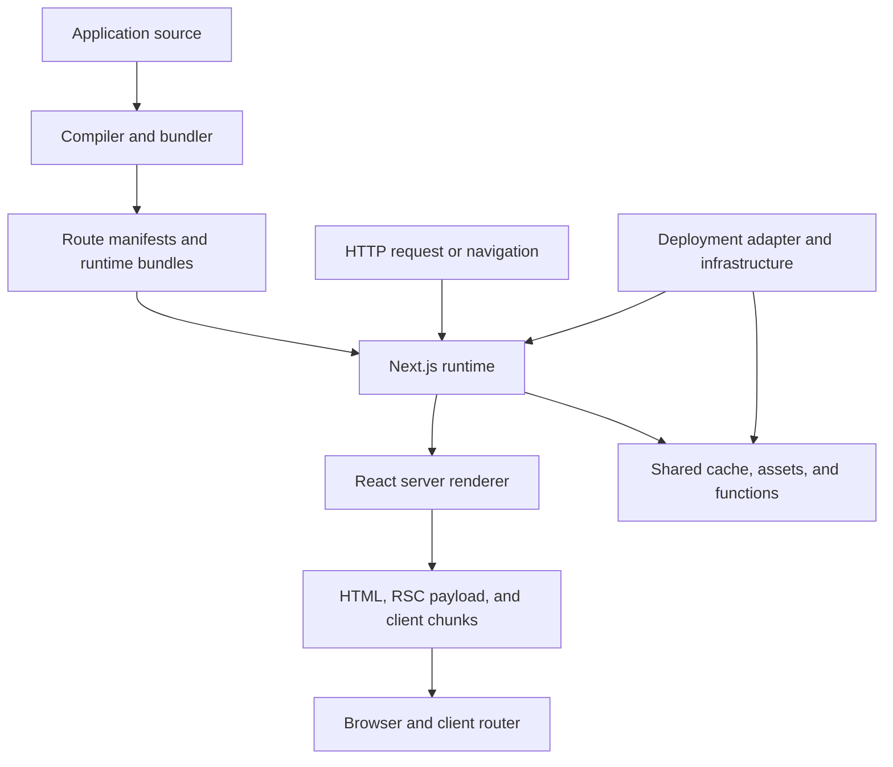
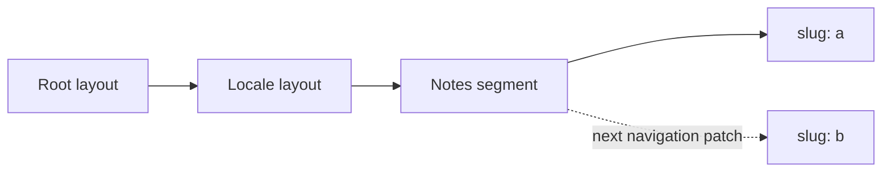
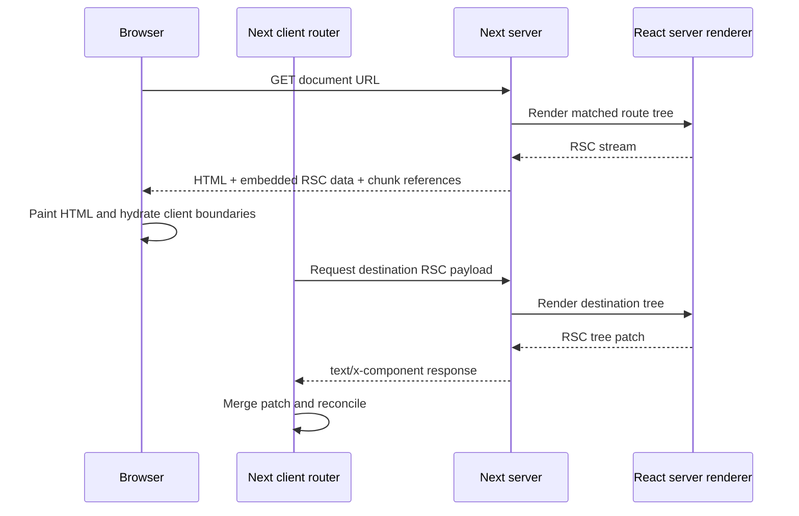
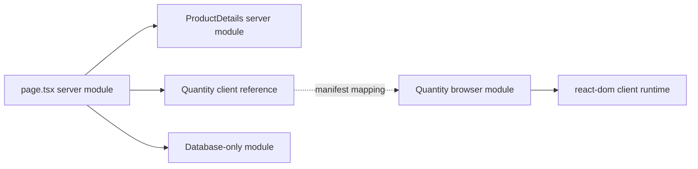
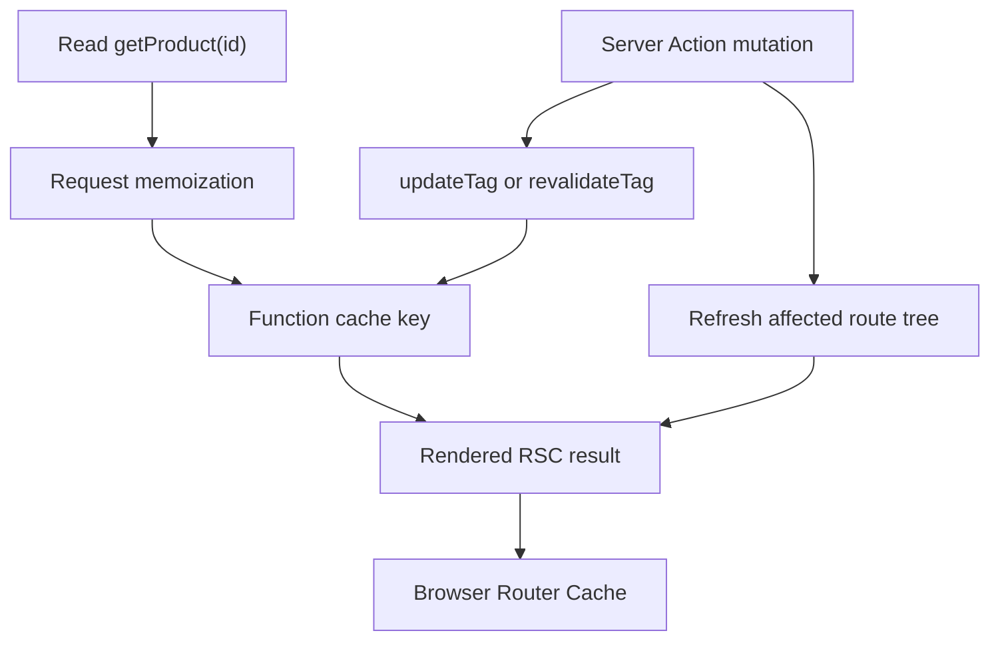
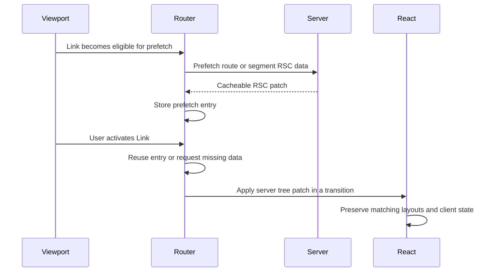
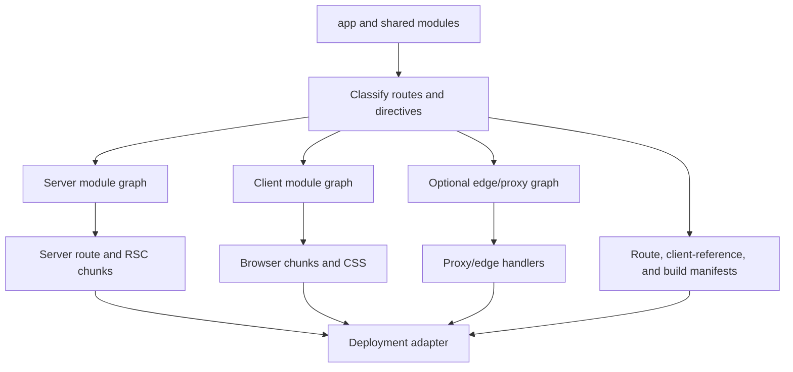
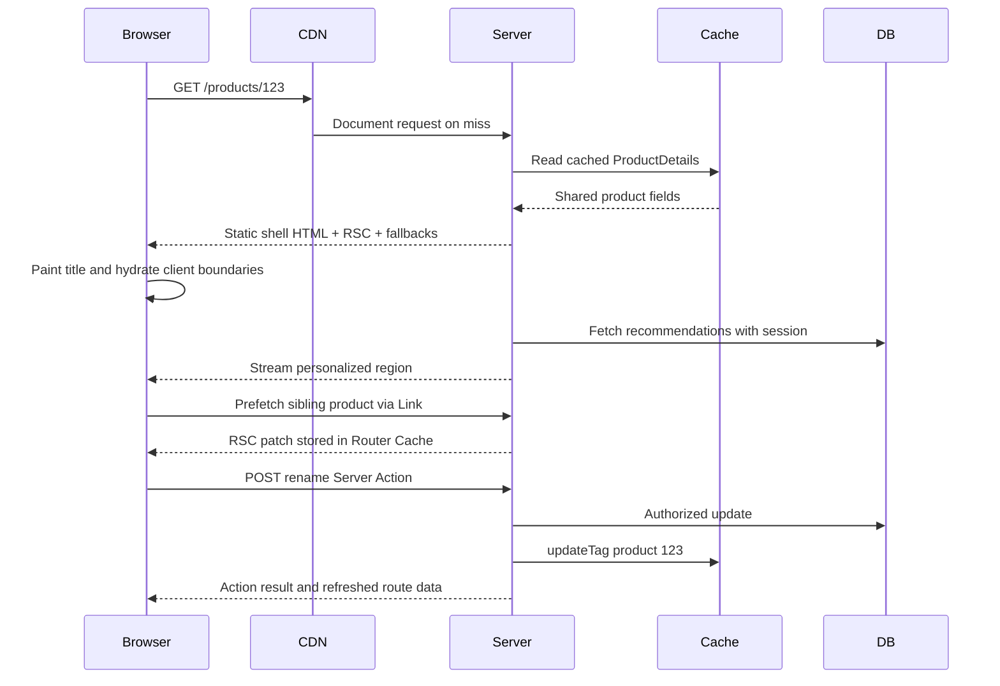

Next.js 常被介绍成「带有 file-system routing 与 SSR 的 React」。那个描述跳过了为什么 `'use client'` 会改变 bundle、为什么一个 request 返回 HTML 而另一个返回 `text/x-component`、为什么 cookie 会改变工作何时发生，以及为什么 invalidate server data 不一定会取代浏览器里已有的内容。

有用的模型：Next.js 是围绕 React 的 **orchestrator**。在 build time，它把一棵 source tree 转成数个 module graphs。在 runtime，它选出一棵 **route tree**、协调 caches、请 React 产生 Server Component stream、可选择把该 stream 转成 HTML，并让 client router 在不 reload document 的情况下 merge 稍后的 patches。

<br />

```text
source modules
  → classify routes and server/client boundaries
  → emit server, client, and optional edge artifacts
  → match a request to a route tree
  → resolve cached and request-time work
  → produce a React Server Component payload
  → optionally produce and stream HTML
  → hydrate client boundaries
  → fetch and merge later route-tree patches
```

<br />

这篇笔记针对 **Next.js 16.2.11 App Router**（这里是 React 19.2.4）。三种陈述：

- 一条 **React 规则**，例如 render purity，或 client-bound values 必须 serializable。
- 一份 **Next.js 契约**，例如 `page.tsx` 或 `cacheTag`。
- 一项 **实现观察**，例如 manifest field 或内部 header。有助于调试。应用代码不得依赖未文档化的格式。

App Router 不会执行 `getStaticProps` 或 `getServerSideProps`。Rendering 与 caching 在 route、component 与 function boundaries 组合。

---

## 1. Next.js 在 React 周围加上 Policy 与基础设施

React 定义 components、reconciliation、Suspense、Server Components 与 hydration。它不决定 URLs 如何对应到 trees、component 在哪里执行、route 如何被 cache，或 server function 如何通过 HTTP 寻址。

<br />



<br />

- **Compilation** 决定哪些 modules 可以出现在 browser chunk，并在 server 与 client graphs 之间建立 references。
- **Routing** 把 pathname 转成 layouts、pages、slots 与 boundaries。
- **Rendering policy** 决定哪些工作可以在 request 之前发生、哪些必须在 request 期间发生，以及 Suspense 在哪里切开两者。
- **Caching policy** 决定哪些 results 可以重用、给谁、多重久。
- **Deployment adapter** 把 output 对应到 processes、functions、CDN objects 与 shared caches。Vercel、长时间运行的 Node server，以及 AWS 上的 OpenNext，并不相同。

这个 repository 的 `next.config.ts` 启用 React Compiler、组合 Fumadocs 与 `next-intl`、定义 PostHog rewrites，并配置 image policy。`packages/infra/nextjs.ts` 再把 build 交给 SST 与 OpenNext。

耐用的模型是 **compiler 加上 request-time coordinator 加上 client router**，再通过 host-specific adapter 部署。

---

## 2. Route Tree 不只是 URL Matcher

`app` 底下的 folders 定义 **segments**。Special files 把行为挂到那些 segments。

<br />

```text
app/
  layout.tsx                  root layout
  [locale]/
    layout.tsx                locale layout
    loading.tsx               segment loading boundary
    error.tsx                 segment error boundary
    notes/
      page.tsx                /:locale/notes
      [slug]/
        page.tsx              /:locale/notes/:slug
```

<br />

- `page.tsx` 让一个 segment 可被寻址。`layout.tsx` 包住 descendants，并在该 segment 仍匹配时跨 navigations **保持 identity**。
- `template.tsx` 占类似位置，但在 navigation 时拿到 **新的 identity**，所以 client state 与 Effects 会重启。
- `loading.tsx`、`error.tsx` 与 `not-found.tsx` 在定义好的位置成为 boundaries。它们不是全局 event listeners。
- Route groups 如 `(marketing)` 只做组织，不增加 URL segment。`[id]`、`[...rest]` 与 `[[...rest]]` 贡献 parameters。`@modal` 是 parallel slot。`(.)photo` 拦截 client navigation，同时保留一条 canonical 的 direct-load route。
- Build manifests（`app-paths-manifest.json`、route regexes）解释 runtime 行为。它们的 schema 是 **internal**。受支持的界面仍是 file conventions。
- 在 `/en/notes/a` → `/en/notes/b` 期间，共享 layouts 可以保持 mounted。Client router 套用的是一份 server **tree patch**，不是一个新的 React root。

<br />



<br />

**Failure：** 把 URL observation 放进 server layout，并指望它看见每一次 navigation。Pathname 与 search params 属于带有 `usePathname` 或 `useSearchParams` 的 Client Component。Layout persistence 是功能，不是 bug。

---

## 3. Document Request 与 Navigation 是不同的 Pipelines

一次 document request 匹配一条 route、解析 caches、render 一份 **RSC payload**、把它转成 HTML、在 Suspense boundaries 就绪时 stream bytes，然后 hydrate Client Components。之后的 client navigation 通常 **不会** 再请求另一份 HTML document。

<br />



<br />

- Client router 送出目前的 tree state，请求到达 destination 所需的 RSC data，然后 **merge 这份 patch**。
- 本地 `routes-manifest.json` 记录 `rsc` 作为 request discriminator、`text/x-component` 作为 RSC content type，以及 `Vary` 于 `rsc, next-router-state-tree, next-router-prefetch, next-router-segment-prefetch`。
- 那些名字是操作证据，不是 API。Proxy 或 CDN 若剥掉它们，可能 cache 错误的 variant。
- `proxy.ts` 在 route render **之前**、response cache 能回答 **之前** 跑。便宜的 redirects、rewrites、粗粒度 gates。不是读取或突变 data 的那段代码的 authorization。
- Next.js 16 把 `middleware.ts` 改名为 `proxy.ts`。这个 repository 的 `src/proxy.ts` 只跑 `next-intl` locale routing，并设 `localeDetection: false`，让 `/` redirects 对 CDN caching 保持可确定。

---

## 4. `'use client'` 切开 Module Graph

Server Components 是默认。这个短语不代表「每次 HTTP request 跑一次」。它代表实现留在 **server graph**，而 rendered result 穿过 RSC boundary。

`'use client'` 是 **module-graph entry directive**。

<br />

```tsx
'use client'

import { useState } from 'react'

export function Quantity() {
  const [value, setValue] = useState(1)
  return <button onClick={() => setValue(value + 1)}>{value}</button>
}
```

<br />



<br />

- 这个 directive 在从 server graph import 时，把这个 module 的 exports 标成 client references。除非另一条 boundary 切开 graph，transitive imports 必须对 client 可达。
- 它 **不** 代表：没有 server HTML、每个 descendant 都是 client module、component 可以 import server secrets，或浏览器可以调用任意 server functions。
- Server 可以 render `<Quantity />`，因为 RSC stream 编码了一个 **reference** 加上 serializable props。Database module 留在 server graph。
- Client Component 可以通过 `children` 接收 Server Component result。它并不是在浏览器里 import 并执行那个 server module。
- 穿过 boundary 的 values 必须 serializable。**Server Functions** 是刻意的例外：一个 Next.js 知道如何 invoke 的 reference。
- 用 `server-only` 与 `client-only`，让泄漏在 compile time 失败。

**Failure：** 把 `'use client'` 放在高层 shell。Providers、utilities 与 descendants 会被拉进 browser-reachable chunks。把 directive 放在 **窄的 interactive leaves**。

---

## 5. Flight 携带一棵 Tree，HTML 携带初始画面

RSC payload——常称为 **Flight payload**——不是 HTML，也不是 DOM 的 JSON 画面。它是一条 stream：已 render 的 Server Component output、pending Suspense 工作、Client Component references，以及 serializable values。

<br />

```text
RSC render
  ├─ RSC payload: authoritative server-rendered React tree and references
  ├─ HTML: initial visual representation produced from that result
  └─ client chunks: executable code for Client Component references
```

<br />

- HTML 让浏览器在 application JavaScript 执行之前就能 paint。RSC 重建同一棵逻辑 tree。Client chunks 为 interactive boundaries 提供行为。
- **Hydration 作用在 Client Components**，不是 Server Component 的实现。浏览器收到的是 Server Component 的 **rendered result**，不是它的 function body。
- 「Zero JavaScript」是 per-subtree 的可能。靠近 root 的一个 client provider 仍可能加宽 interactive 表面。
- 之后的 navigations 跳过 HTML，因为浏览器已经拥有 document。把 RSC endpoint 当公开 JSON API 是错的：它耦合到该 build 的 module references 与 router state。

**Failure：** 在产品代码里 parse Flight bytes 或产生出来的 client-reference maps。检查它们来诊断 proxy、cache 或 bundle 问题。它们不是稳定的应用界面。

---

## 6. Rendering 是光谱，不是三种 Page Types

Pages Router 词汇——CSR、SSR、SSG、ISR——仍描述结果。App Router 的工作组合得更细，落在三个时间：**build 或 revalidation**、**request**，以及 **client**。

<br />

```tsx
import { Suspense } from 'react'

export default function ProductPage() {
  return (
    <>
      <ProductCatalog />
      <Suspense fallback={<RecommendationsSkeleton />}>
        <PersonalizedRecommendations />
      </Suspense>
    </>
  )
}
```

<br />

- 没有 Cache Components 时，Next.js 仍可以分类并 prerender routes。自 Next.js 15 起，`fetch` 默认 **不会** 放进 persistent cache。
- 打开 `cacheComponents: true` 后，一条 route 可以混合 prerendered 工作、`'use cache'`，以及读取 `cookies()`、`headers()` 或 `searchParams` 的 request-time 工作。
- Request-time 工作必须坐在 **Suspense** 下面，build 才能发出 static shell——Partial Prerendering。
- Suspense 是 **streaming** boundary。`'use cache'` 是在某个 key 与 lifetime 下的 **reuse**。
- 这个 repository 使用 `dynamic = 'force-static'`、`dynamicParams = false` 与 `generateStaticParams`。它 **没有** 启用 `cacheComponents`。这里的 caching 是 build-time SSG 加上 CDN。

**Failure：** 指望 Suspense 去 cache 一次 query，或指望 cached data 自动 stream。

---

## 7. Data Dependencies 决定 Streaming 质量

一个 async Server Component 可以直接 query database。把这次调用绕过这个应用的 Route Handler，会加上 HTTP serialization、另一次 router pass，以及一次取决于部署的 hop。改成共享一个 **server-only function**。

<br />

```tsx
const productPromise = getProduct(id)
const inventoryPromise = getInventory(id)

const [product, inventory] = await Promise.all([
  productPromise,
  inventoryPromise,
])
```

<br />

- 独立的 `await getProduct` 再 `await getInventory` 会把本可重叠的工作 **序列化**。先启动两者，再 `Promise.all`，或把它们放在 sibling Suspense boundaries 下揭示。
- Streaming 修不好真正的 data dependency。它可以修好一个 parent 在构造下一个 child 之前就 await 了前一个。
- Request **memoization** 在一次 render 里去重等价工作。**Persistent cache** 跨 requests 重用 result。一次 memoized 但未 cache 的 query 下次仍会再跑；persistent cache 仍可能返回 stale data。
- 浏览器拥有的 data——live collaboration、高频 polling、offline state、需要 browser credentials 的第三方 APIs——仍属于 client。

**Failure：** 对独立 reads 做 sequential `await`。那条 waterfall 是架构引入的，不是固有的。

---

## 8. Caching 是一组 Lifetimes 与 Identities

「这个 page 被 cache 了吗？」是错误的问题。一个 Next.js 应用可以在多个 scopes 重用工作。

<br />

```text
one render/request
  request memoization deduplicates equivalent reads

many requests
  a data or function cache reuses a result by key

route output
  prerendered HTML and RSC output can be reused

one browser session
  the client router reuses prefetched and visited route segments

network edge or host
  a CDN may reuse HTTP responses according to host policy
```

<br />

- 每一层有自己的 identity 与 invalidation。一行新鲜的 database row 不保证已经坐在 **Router Cache** 里的 RSC response 也是新鲜的。`router.refresh()` 可以请求新的 server result，而不删除 persistent data-cache entry。
- 用 `cacheComponents: true` 启用 Cache Components。然后 `'use cache'` 加上 `cacheLife` 与 `cacheTag`，让一个 function 选择进入 persistent reuse。

<br />

```tsx
import { cacheLife, cacheTag } from 'next/cache'

async function getProduct(id: string) {
  'use cache'
  cacheLife('hours')
  cacheTag(`product:${id}`)
  return db.product.findUniqueOrThrow({ where: { id } })
}
```

<br />

- Cache **key** 包含 build identifier、secure function identifier、serialized arguments，以及从 outer scope 捕捉到的 serialized values。Tags 是 **invalidation index**，不是主要 identity。
- Runtime request APIs 不能在 `'use cache'` 里面调用。在外面读 `cookies()`，只传入应参与 identity 的那个值。按 session ID cache 在机制上有效，但常常是坏政策。
- `cacheLife` 窗口：**stale**（重用不检查）、**revalidate**（先 serve stale 同时刷新）、**expire**（必须等新鲜工作）。
- `revalidateTag(tag, 'max')` 标成 stale。`updateTag` 立刻 expire，用于 read-your-own-writes，并限制在 **Server Actions**。`revalidatePath` 针对 route output；它不取代 scoped data tags。

<br />



<br />

Self-hosting 会把它变成分布式系统问题。Process-local cache 在 replicas 之间并不 coherent。Next.js 支持 custom cache handlers；host 仍必须协调 invalidation 与 build IDs。

**Failure：** tag 写成 `product:${productId}`，而 function 还吃 `tenantId`。Reads 仍按 arguments 隔离；invalidation 宽度错了。在共享 cached 工作里从 ambient mutable state 读 tenant，会让 isolation 无法审计。

---

## 9. Navigation 套用 Server 产生的 Tree Patches

`<Link>` 不只是带 `preventDefault()` 的 anchor。它给 router 一个可以 prefetch、cache，并在保留共享 segments 的同时 transition 过去的 destination。

<br />



<br />

- Prefetching 是 speculation。Render 必须能安全地开始、重复、cache 与丢弃。不要把 mutate 当 render 的 side effect。
- `router.push` 与 `router.replace` 请求另一种 route-tree state。`back` 与 `forward` 接入 browser history。`refresh` 重新请求当前 route 并 merge，保留兼容的 client state。
- `usePathname` 与 `useSearchParams` 观察 client router state。
- `router.refresh` 不是通用 invalidation API。若 server 工作被 persistent cache，refresh 可以忠实地返回同一个值。在 write boundary invalidate，然后再 refresh。

**Failure：** 把不受信任的 strings 拼进 `router.push` 或 `router.replace`。把 destinations 当 injection boundary；`javascript:` URL 可以在 page context 执行。

---

## 10. Server Actions 是有地址的 Mutations，不是受信任的 Functions

Server Action 是作为 mutation entry point 使用的 Server Function。`'use server'` 建立一个可以穿过 RSC boundary 的 server reference。

<br />

```ts
'use server'

import { updateTag } from 'next/cache'
import { z } from 'zod'
import { requireEditor } from '@/lib/auth'
import { db } from '@/lib/db'

const Input = z.object({
  id: z.string().uuid(),
  name: z.string().trim().min(1).max(120),
})

export async function renameProduct(formData: FormData) {
  const actor = await requireEditor()
  const input = Input.parse(Object.fromEntries(formData))

  await db.product.update({
    where: { id: input.id, tenantId: actor.tenantId },
    data: { name: input.name },
  })

  updateTag(`product:${actor.tenantId}:${input.id}`)
}
```

<br />

- Client 发送一次 HTTP **POST**，携带 action reference 与 serialized arguments。未使用的 actions 可以在 build time 被消除。
- 从 client 可达的 action 是 **可被外部调用的 entry point**。即使 TypeScript 另有说法，arguments 仍是 hostile input。
- Authentication 证明 identity。Authorization 证明这个 identity 可以对这个 resource 执行这个操作。Captured variables 不是 authorization 系统。IDs 是 opaque，不是 secret capabilities。
- Same-origin checks、encrypted closures、origin allowlists 与 body limits 缩小攻击面。它们不决定 tenant A 是否可以编辑 tenant B 的 row。
- Mutations 仍需要 idempotency keys、optimistic concurrency、transactions、commit **之后** 的 invalidation、不泄漏 secrets 的 error mapping，以及 observability。
- HTML forms 可以在 hydration 之前 invoke actions。Server 仍是权威。

---

## 11. 选最窄的 Server Entry Point

Server Components、Server Actions、Route Handlers 与 Proxy 都在 server 上执行。它们解决不同的问题。

- **Server Component：** 为了 render 一棵 React tree 而存在的 reads。可直接访问 server-only modules。不是公开 protocol boundary。
- **Server Action：** 由这个 React 应用发起的 mutations。把它当私有 HTTP endpoint。
- **Route Handler：** 明确的 HTTP resource——webhooks、公开 APIs、files、feeds、非 React clients。Web `Request` / `Response`。一个 `route.ts` 不能与 `page.tsx` 占同一 segment。
- **Proxy：** route handling 之前的拦截。保持便宜。它在每个匹配的 request 上跑。它不取代受保护 data 旁边的 authorization。

<br />

```text
Server Component ─┐
Server Action ────┼─→ shared server-only domain function → database/service
Route Handler ────┘
```

<br />

**Failure：** Server Component → HTTP fetch 到这个应用的 Route Handler → domain function，拿来当通用 reuse。HTTP boundary 只有在那个 boundary 本身就是被测试或被消费的能力时才成立。

---

## 12. Dynamic APIs 把工作绑到 Request

在 Next.js 16 里，`params`、`searchParams`、`cookies()` 与 `headers()` 是 **asynchronous**。

<br />

```tsx
import { cookies, headers } from 'next/headers'

export default async function Page({
  params,
  searchParams,
}: {
  params: Promise<{ id: string }>
  searchParams: Promise<{ preview?: string }>
}) {
  const [{ id }, query, cookieStore, headerStore] = await Promise.all([
    params,
    searchParams,
    cookies(),
    headers(),
  ])

  // ...
}
```

<br />

- 这个 async 形状让 Next.js 可以推迟 request-bound 工作。读一个 cookie 无法为每个用户产出一份共享的 prerendered 值。
- 有 Cache Components 时，request-time APIs 属于 `'use cache'` 之外，通常在 Suspense 下面。没有 Cache Components 时，它们会让相关 route 变成 dynamic，除非 configuration 另有说明。
- Page 上的 `searchParams` 是 request data。`useSearchParams` 是 client router hook。相关的值，不同的执行与 rendering 后果。
- 默认 runtime 是 **Node.js**。Edge 提供较小环境的 Web APIs。Cache Components 需要 Node，不支持 `runtime = 'edge'`。「更靠近用户」不会自动胜过 database 距离、cold starts，或不被支持的 dependencies。
- `NEXT_PUBLIC_*` 变量可能在 **build** time 被替换进 client bundles。它们是公开的。Client import 无法保住 secret。

---

## 13. Loading 与 Failure 跟随 Segment Boundaries

App Router 把 control-flow 结果变成 route-tree 行为。

- `loading.tsx` 为一个 segment 提供 Suspense fallback。
- `error.tsx` 为它下面未捕捉的 failures 提供 Client Component error boundary。
- `global-error.tsx` 在 root layout 失败时替换它，必须自己 render `<html>` 与 `<body>`。
- `not-found.tsx` 在其 boundary 处理 `notFound()` 与未匹配的 resources。
- `redirect()` 与 `permanentRedirect()` 终止当前 rendering 路径。

<br />

```ts
try {
  const product = await getProduct(id)
  if (!product) notFound()
} catch (error) {
  unstable_rethrow(error)
}
```

<br />

- 不要吞掉 framework control-flow errors。把 `try` 收窄到可能失败的那次操作，或用 `unstable_rethrow` 再抛出。
- Error boundary 不会让失败的 mutation 变成 transactional。Retry UI 不会让 action 变成 idempotent。已经 commit 到外部系统的 side effects 仍然 committed。

**Failure：** 一个过大的 Suspense boundary 拖住独立内容，或几十个过小的 boundaries 造成视觉 churn。按 reveal 顺序与 latency domain 放置 boundaries，而不是围住每个 async function。

---

## 14. Advanced Routing 用简单换 State Preservation

Parallel 与 intercepting routes 解决的是 URL、可见 layers 与 navigation history 不该对应到一棵简单 page tree 的情况。

<br />

```text
app/
  @modal/
    default.tsx
    (.)photo/[id]/page.tsx
  photo/[id]/page.tsx
  layout.tsx
```

<br />

- Soft navigation 可以把 `(.)photo/[id]` render 进当前 gallery 上的 `@modal` slot。对 `/photo/123` 的 direct request 渲染 canonical page。`router.back()` 恢复 history。`default.tsx` 在 full reload 之后提供 fallback。
- 若 modal 不需要可分享 URL、reload 语义或 history 集成，本地 state 更简单。
- 这个站点用 `[locale]` 作为第一个 dynamic segment，并用 `next-intl` 做 validation、messages 与 navigation。Locale layout await `params`，对不支持的 locales 以 `notFound()` 拒绝，并调用 `setRequestLocale`，让本来 static 的 routes 可以按 locale 生成。
- **Rewrites** 保持 browser URL。**Redirects** 改变它。Route groups 两者都不改。这个 repository 把 `/ingest/*` proxy 到 PostHog，同时让浏览器留在 first-party origin。

---

## 15. Metadata 与 Asset Pipelines 是 Render Contract 的一部分

Metadata 从 route tree 解析：static `metadata` exports、`generateMetadata`，以及 `opengraph-image`、`icon`、`robots` 这类 file conventions。Parent metadata 与 child metadata **merge**；一份不完整的 leaf export 不会抹掉 parent object。

- `generateMetadata` 可以 await 与 page 相同的 server data。共享底层 promise 或 cached function，这样 metadata 就不会把 body 序列化，除非那份工作已经被 memoized。
- `next/image` 产生定尺寸 variants、强制配置的 remote hosts，并注入 `srcset` / `sizes`。不受限的 remote host list 会变成 **open image proxy**。
- `next/font` 自托管 fonts、生成 subset CSS，并去掉常见的第三方 render-blocking request。Font metrics 与 `display` 仍决定 layout shift。
- `next/script` 控制第三方 JavaScript 何时争夺 main thread。Strategy 是性能决策，不是语法决策。
- Image optimization 可能在 function、edge 或 CDN 后面跑，取决于 host。公开 API 仍是 `next/image`；运营成本不是。

---

## 16. Compilation 把一棵 Source Tree 变成多份 Artifacts

一次 Next.js build 不是「bundle 这个 app」。它分类 modules、发出多份 graphs，并写出 runtime 稍后用来回答 requests 的 manifests。

<br />



<br />

- **SWC** 转换 TypeScript/JSX。这个 repository 启用的 **React Compiler** 可以自动 memoize 符合条件的 components。它不取代 Server Components、Suspense 或 cache policy。
- **Turbopack** 是 Next.js 16.2 的默认 bundler。这个 repository 的 `next dev` 与 `next build` scripts 不传 `--webpack`。
- 诊断 production 行为时，检查 route manifests、client-reference metadata、build identifiers 与 chunk lists。
- `NEXT_PUBLIC_*` 值可以被 inline 进某次 build 的 client assets。轮换一个公开 analytics key 需要重建那些 assets。运行时读取的 server-only secret 则不必。
- OpenNext 把 artifacts 对应到 host resources。这个 repository 的 `open-next.config.ts` override tag cache、incremental cache 与 queue backends（DynamoDB/S3/SQS lite），并使用 Lambda streaming wrapper。以目前完全 static 的表面，那些 adapters 大多闲置。[用 SST 管理 AWS 基础设施与 DevOps](/notes/using-sst-for-aws-infra-and-devops) 说明 SST 如何接上 adapter。
- Rolling deploys 必须让 build IDs 与 client references 对齐，这样旧的 browser session 才不会去调用一个已经不理解其 action IDs 的 server。CDN layers 必须尊重 content-type 与 `Vary`。这个站点把 Orama search indexes 当 static JSON 提供，因为 OpenNext on Lambda 继承了同步 response size 上限，让 `/api/search` 变得脆弱。

---

## 17. Security 与 Observability 落在每个 Boundary

Next.js 把 code 与 data 移过数个 trust boundaries。当那些 boundaries 被当成 framework 魔法时，安全工作就会失败。

| Boundary | What crosses it | Required controls |
| --- | --- | --- |
| Browser ↔ Server Action / Route Handler | Hostile input and cookies | Authn, authz, validation, rate limits, CSRF/origin policy |
| Server Component → Client Component | Serialized props and references | No secrets, no privileged objects, intentional public data |
| Proxy → Route | Request headers and redirects | Cheap checks only; no sole authorization |
| App → External service | Credentials and PII | Scoped secrets, least privilege, audited egress |
| CDN ↔ Origin | Cached responses | Correct `Vary`, no private HTML in shared caches |

<br />

- Authentication 回答「这是谁？」Authorization 回答「这个 actor 可以对这个 resource 执行这个操作吗？」用 schema parse input 之后，在 mutation 或 Route Handler **里面** validate 并 authorize。
- Secrets 属于 server-only modules 与 runtime configuration。Server Actions 里 closed-over 的值有传输保护，但一旦 action 可达，它们仍是可被外部调用界面的一部分。
- Defense in depth 仍然适用：CSP、origin allowlists、body-size limits、记录 actor/resource/outcome 而不 dump secrets 的 logs、给 error tracking 用但不成为公开 dump 的 source maps。
- `instrumentation.ts` 是注册 OpenTelemetry 的受支持位置。用同一套 trace model 关联 document requests、Flight navigations、Server Actions 与 Route Handlers。

---

## 18. Performance 是 Boundaries 的架构

多数 Next.js 性能失败都是 boundary 错误。

1. 树里过高的 `'use client'` 加宽 hydration 与 JavaScript。
2. Sequential awaits 把独立 latency domains 序列化。
3. 缺少 Suspense 迫使整个 response 等最慢的区域。
4. 过度 cache 个性化 data 会造成巨大的 key cardinality 或隐私事故。
5. 共享 data 缓存不足，会把每次 navigation 变成 origin 工作。
6. 只量本地 `next dev` 会藏起 production chunking、compression 与 cache 行为。

- **LCP** 关心关键 HTML、fonts 与 images 是否能尽早被发现，以及 server 工作是否挡住最大的内容。
- **INP** 关心 hydration、client JS 与 handlers 对 main thread 的争夺。
- **CLS** 关心预留的 image/font 空间与晚注入的 UI。
- 一个 subtree 的 time-to-interactive 关心那个 subtree 拉进了多少 Client Component JavaScript。

Browser critical path 仍统治最后一公里。见 [Browser 中的 Critical Rendering Path](/notes/critical-rendering-path-in-the-browser)。至于 React 的 speculative render、commit 与 hydration，见 [深入理解 React](/notes/understanding-react-in-depth)。

量 production builds：document 对比 `text/x-component`、client chunk size、一张 image 是否走了 `/_next/image`，以及一次 mutation 是否造成预期的 cache miss。

---

## 19. 从头到尾跟一页 Product Page

一个 product page 展示给所有用户 cache 的共享 catalog fields、基于 session cookie 的个性化 recommendations，以及一份需认证的 rename form。

<br />



<br />

- 共享的 `ProductDetails` 使用 `'use cache'` + `cacheTag`。Recommendations 在 cache **外面**、Suspense 下面读 `cookies()`。
- Document 可以在 recommendations 完成之前 paint product title。
- 授权去 **render** form，不等于授权去 **跑** action。Action 会再检查、validate、写入，然后 `updateTag`。
- 到另一个 product 的 client navigation 请求 RSC data，而不是完整 HTML document，除非 adapter 或 link configuration 另有强制。
- 两位 editors 并发 rename 需要应用层 concurrency 策略。Next.js 不会发明一个。
- 部署之后，旧 tab 可能无法 invoke action，直到它 reload 到新 build 的 references。

**Failure：** 把 `cookies()` 放进 `'use cache'`——build 应该拒绝这种组合。按 session ID cache 却没有隐私审查：机制有效，政策仍可能是错的。

---

## 20. 调试问题与常见误解

当 Next.js 行为让你意外时，按这个顺序问：

1. **这是哪条 pipeline？** Document request、Flight navigation、prefetch、Server Action、Route Handler，还是 proxy？
2. **哪个 graph 拥有这个 module？** Server、client，还是 edge？
3. **这个值何时被计算？** Build/revalidation time、request time，还是 client time？
4. **Cache identity 是什么？** Function arguments、captured values、tags、route path、build ID，以及 CDN variant。
5. **Network 实际返回了什么？** HTML、`text/x-component`、JSON、redirect，还是带错误 `Vary` 的 cached CDN object？
6. **React 是 commit 了，还是只尝试了一次 render？** Streaming 与 transitions 可以放弃工作。
7. **Authorization 是否在 write boundary 强制执行？** UI 隐藏不是 enforcement。
8. **Deployment adapter 是否保留 headers、content types 与 shared cache 语义？**

常见误解：

- **Next.js 不只是 SSR。** App Router routes 组合 prerendered、cached、streamed 与 request-time 工作。
- **`'use client'` 不代表只在 client render。** 它标记一条 module-graph boundary。Component 仍可以 SSR 成 HTML，然后再 hydrate。
- 自 Next.js 15 起，**`fetch` 默认不被 cache**。明确的 Cache Components 与 cache APIs 定义 reuse。
- **Server Actions 是可达的 mutation endpoints。** 每次调用都要 validate input 并 authorize。
- **Dynamic 不代表没有 caching。** Request-time 区域可以坐在 cached 区域旁边。
- **Edge 不总是更快。** 当 workload 适合 runtime、瓶颈是靠近用户时，它才有帮助。
- **RSC 不取代 APIs。** 公开 clients、webhooks 与非 React consumers 仍需要 Route Handlers。
- **Fiber/Flight 细节不是应用 APIs。** 有助于诊断；作为产品契约则不稳定。

---

## 21. 最终心智模型

最短且准确的模型：

<br />

```text
Folders define a route tree.
Directives partition module graphs.
Server Components assemble data into a Flight tree.
Caches reuse work by explicit identity and lifetime.
Suspense divides what can stream independently.
HTML is an initial picture.
Flight is the authoritative server tree and references.
Client Components hydrate and own interaction.
Actions mutate through addressed server entry points.
Invalidation reconnects writes to later reads.
Adapters map artifacts onto infrastructure.
```

<br />

Next.js 不取代 React 的 rendering model。它决定哪些 React trees 对应哪些 URLs、它们的 modules 在哪里执行、哪些 results 可以重用、那些 results 如何穿过 network，以及浏览器如何把稍后的 server output merge 进已经 mounted 的 document。

Compile-time classification、request-time coordination 与 client navigation 是三个不同的阶段。多数 production incidents 来自把它们压成一个模糊的「这个 page rendered」。

至于 React 自身的 render/commit/hydration 机制，继续看 [深入理解 React](/notes/understanding-react-in-depth)。Browser pixels 与 main-thread 限制见 [Browser 中的 Critical Rendering Path](/notes/critical-rendering-path-in-the-browser)。这个 repository 的 AWS/OpenNext 交付路径见 [用 SST 管理 AWS 基础设施与 DevOps](/notes/using-sst-for-aws-infra-and-devops)。Server Components 所依赖的 React 19 APIs 见 [React 19 新功能](/notes/react-19-new-features)。

这篇文章里的实现观察对应这个 repository 安装的 **Next.js 16.2.11** App Router 行为。公开惯例——file names、文档化的 directives、cache APIs，以及受支持的 runtime functions——才是耐用契约。Manifest layouts、内部 headers 与确切的 Flight bytes 是今天 toolchain 的调试证据，不是该写死的 API。

---

## Recap Q&A

<Accordion type="single" collapsible>
  <AccordionItem value="next-orchestrator">
    <AccordionTrigger>1. Next.js 在 React 周围加了什么，route tree 又是什么？</AccordionTrigger>
    <AccordionContent>

      - Next.js 是围绕 React 的 **orchestrator**。React 定义 components、reconciliation、Suspense、Server Components 与 hydration。它不决定 URLs 如何对应到 trees、component 在哪里执行、route 如何被 cache，或 server function 如何通过 HTTP 寻址。
      - 在 build time，Next 把一棵 source tree 转成数个 module graphs。在 runtime，它选出一棵 **route tree**、协调 data 与 caches、请 React 产生 Server Component stream、可选择把该 stream 转成 HTML，并让 client router 在不 reload document 的情况下 merge 稍后的 patches。
      - App Router 不会执行 `getStaticProps`。Rendering 与 caching 在 route、component 与 function boundaries 组合。
      - Document request 与 client navigation 是不同的 pipelines：HTML 加上 hydration，对比对着保留 layouts 的 RSC patch。

    </AccordionContent>
  </AccordionItem>

  <AccordionItem value="next-use-client">
    <AccordionTrigger>2. `'use client'` 实际切开的是什么？</AccordionTrigger>
    <AccordionContent>

      - Server Components 是默认。这个短语不代表「每次 HTTP request 跑一次」。它代表实现留在 **server graph**，而 rendered result 穿过 RSC boundary。
      - `'use client'` 是 **module-graph entry directive**。它不代表没有 server HTML、每个 descendant 都必须是 client module，或因为 parent 是 Server Component 就可以 import server secrets。
      - 把 directive 放在 **窄的 interactive leaves**。放在高层 shell 会把 providers 与 utilities 拉进 browser chunks。
      - Client Component 仍可以通过 `children` 接收 Server Component result。穿过 boundary 的 values 必须 serializable。用 `server-only` 让泄漏在 compile time 失败。

    </AccordionContent>
  </AccordionItem>

  <AccordionItem value="next-caching">
    <AccordionTrigger>3. 为什么「这个 page 被 cache 了吗？」是错误的问题？</AccordionTrigger>
    <AccordionContent>

      - 一个 Next.js 应用可以在多个 scopes 重用工作：request memoization、data/function cache、prerendered HTML 与 RSC、client Router Cache，以及 CDN。每一层有自己的 **identity 与 invalidation**。
      - 一行新鲜的 database row 不保证已经坐在浏览器里的 RSC response 也是新鲜的。`router.refresh()` 可以请求新的 server result，而不删除 persistent data-cache entry。
      - `'use cache'` 加上 `cacheTag` / `cacheLife` 是在某个 key 与 lifetime 下的 reuse。**Suspense** 是 streaming boundary，不是 cache。
      - Tags 是 invalidation index；arguments 与 captured scope 才是 key。
      - **Failure：** tag 漏掉 tenant identity，invalidation 宽度就错了。指望 Suspense 去 cache 一次 query，或指望 cached data 自动 stream。

    </AccordionContent>
  </AccordionItem>

  <AccordionItem value="next-server-actions">
    <AccordionTrigger>4. 为什么 Server Action 不是受信任的 function？</AccordionTrigger>
    <AccordionContent>

      - `'use server'` 建立一个可以穿过 RSC boundary 的 server reference。Invoke 时，client 发送一次带 action reference 与 serialized arguments 的 HTTP **POST**。
      - 从 client 可达的 action 是 **可被外部调用的 entry point**。即使 TypeScript 另有说法，arguments 仍是 hostile input。
      - Authentication 证明 identity；authorization 证明这个 identity 可以对这个 resource 执行这个操作。Captured variables 不是 authorization 系统。IDs 是 opaque，不是 secret capabilities。
      - Same-origin checks 与 encrypted closed-over values 缩小攻击面；它们不决定 tenant A 是否可以编辑 tenant B 的 row。
      - 用 Zod validate，在 action 里 authorize，在 transaction commit **之后** invalidate cache。HTML forms 可以在 hydration 之前 invoke actions。Server 仍是权威。

    </AccordionContent>
  </AccordionItem>

  <AccordionItem value="next-streaming">
    <AccordionTrigger>5. 什么决定 streaming 质量，sequential await 又如何伤害它？</AccordionTrigger>
    <AccordionContent>

      - 一个 async Server Component 可以直接 query database。把这次调用绕过同一个应用的 Route Handler，会加上 HTTP serialization 与一次 hop。
      - 独立的 `await getProduct` 再 `await getInventory` 会把本可重叠的工作 **序列化**。先启动两者，再 `Promise.all`。对独立 data 做 sequential await，是你引入的 waterfall。
      - 若你要 static shell 加上延后区域——Partial Prerendering——request-time 工作（`cookies()`、`headers()`、`searchParams`）必须坐在 **Suspense** 下面。
      - Boundary 说明什么可以独立揭示。决定 stream 看起来像 shell 还是 stall 的，是 data dependencies，不是文件数量。

    </AccordionContent>
  </AccordionItem>
</Accordion>
