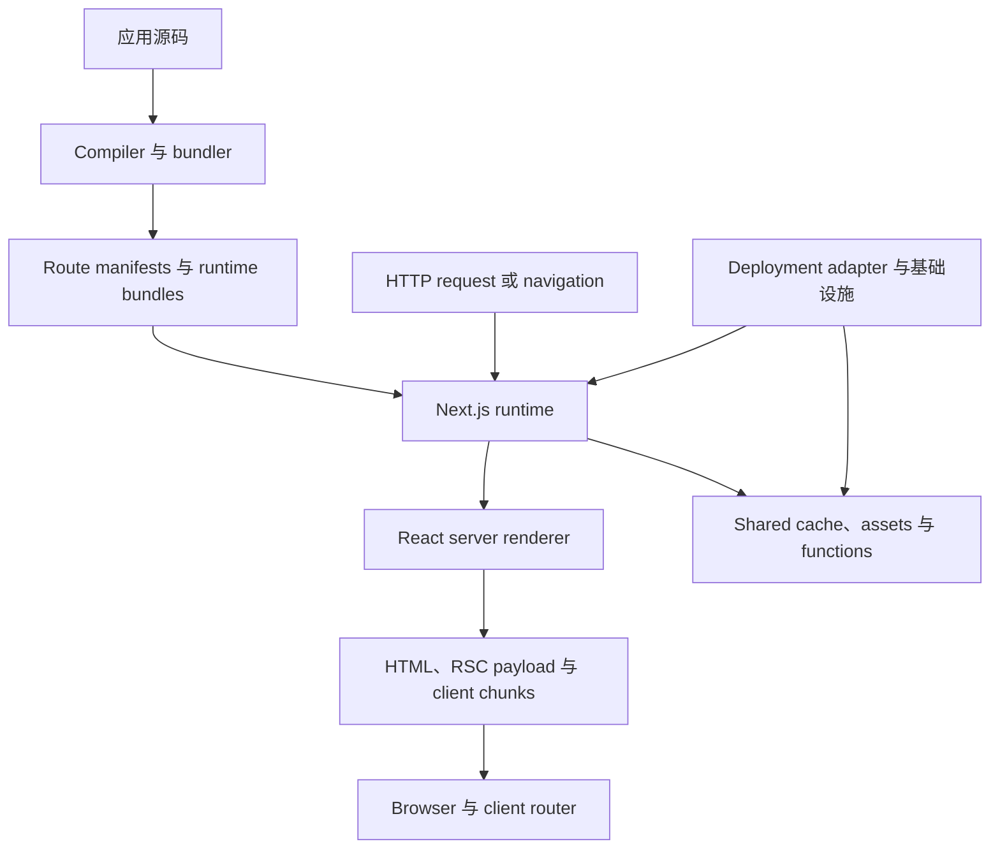
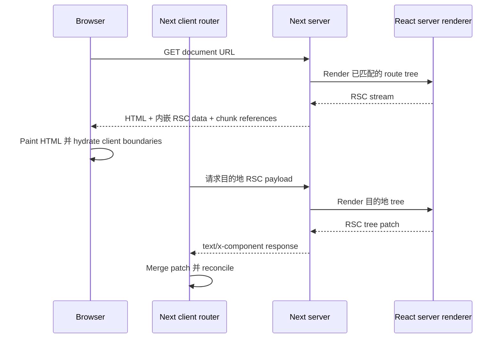
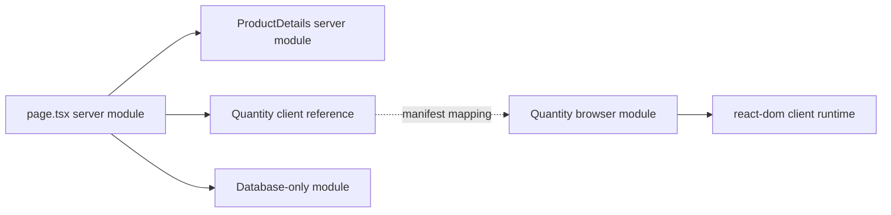
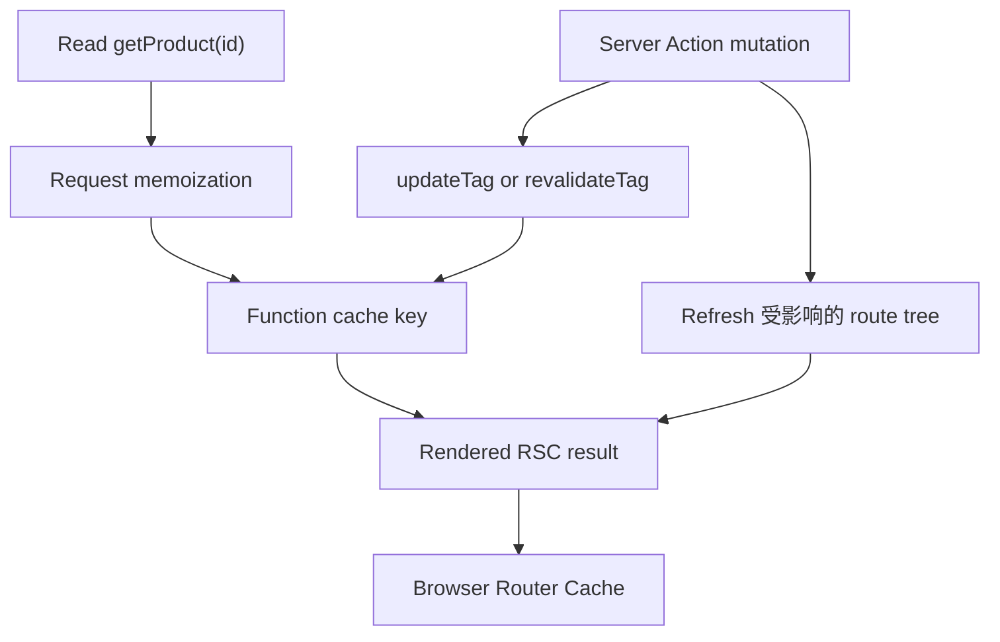
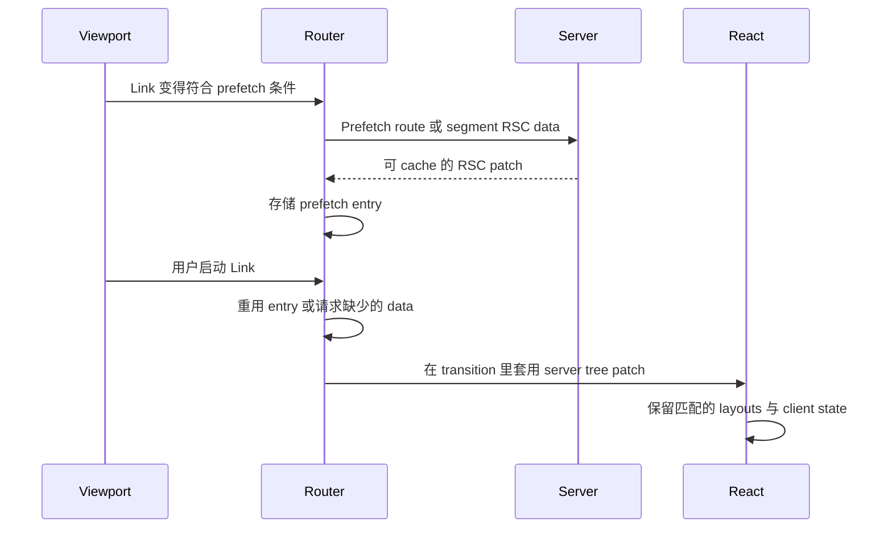
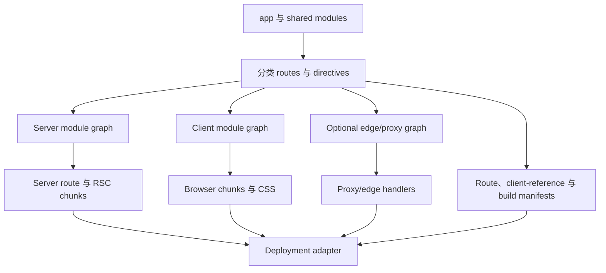
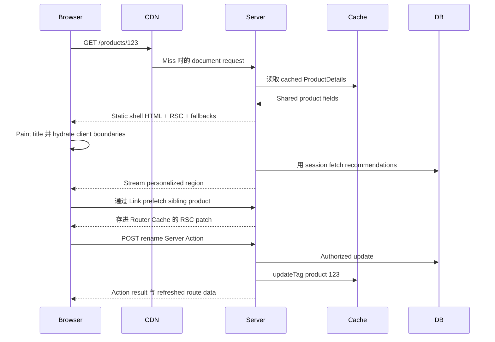

Next.js 常被介绍成「带有 file-system routing 与 server-side rendering 的 React」。这个描述并没有错，但压缩得太厉害，解释不了为什么加上 `'use client'` 会改变 bundle、为什么一个 request 返回 HTML 而另一个返回 `text/x-component`、为什么读取 cookie 会改变工作何时发生，或为什么 invalidate server data 不一定会取代浏览器里已有的内容。

更有用的模型是：Next.js 是围绕 React 的 **orchestrator**。在 build time，它把一棵 source tree 转成数个 module graphs 与 routing manifests。在 runtime，它选出一棵 route tree、协调 data 与 caches、请 React 产生 Server Component stream、可选择把该 stream 转成 HTML，并提供足够信息让 client router 在不 reload document 的情况下 merge 稍后的 server results。

<br />

```text
source modules
  → classify routes and server/client boundaries
  → emit server, client, and optional edge artifacts
  → match a request to a route tree
  → resolve cached and request-time work
  → produce a React Server Component payload
  → optionally produce and stream HTML
  → hydrate client boundaries
  → fetch and merge later route-tree patches
```

<br />

这篇文章针对 **Next.js 16.2.11 App Router**（这个 repository 里是 React 19.2.4），并假设你已熟悉 React、HTTP、JavaScript runtimes、Suspense 与 cache invalidation。它区分三种陈述：

- 一条 **React 规则**，例如 render purity，或 client-bound values 必须 serializable。
- 一份 **Next.js 契约**，例如 `page.tsx` 惯例或 `cacheTag`。
- 一项 **实现观察**，例如产生出来的 manifest field 或内部 request header。观察有助于调试，但应用代码不得依赖未文档化的格式。

Pages Router 只在旧词汇会造成歧义时出现。App Router 不会执行 `getStaticProps` 或 `getServerSideProps`；rendering 与 caching 决策现在在 route、component 与 function boundaries 组合。

<br />

---

## 1. Next.js 在 React 周围加上 Policy 与基础设施

React 定义 components、reconciliation、Suspense、Server Components 与 hydration。它不决定 URLs 如何对应到 component trees、component 在哪里执行、route 如何被 cache、images 如何被转换，或 server function 如何通过 HTTP 寻址。Next.js 做那些决策并把它们接起来。

一个 production Next.js 应用跨越四层：



这些 boundaries 很重要，因为同一个应用可以在 React 没变的情况下表现不同：

- **Compilation** 决定哪些 modules 可以出现在 browser chunk，并在 server 与 client graphs 之间建立 references。
- **Routing** 把 pathname 转成 layouts、pages、slots 与 boundaries 的有序 tree。
- **Rendering policy** 决定哪些工作可以在 request 之前发生、哪些必须在 request 期间发生，以及 Suspense fallback 在哪里切开两者。
- **Caching policy** 决定哪些 results 可以重用、给谁、多重久。
- **Deployment adapter** 把 Next.js output 对应到 processes、functions、CDN objects 与 shared caches。Vercel、长时间运行的 Node server，以及 AWS 上的 OpenNext，基础设施并不相同。

这个 repository 示范了这个区别。`next.config.ts` 启用 React Compiler、组合 Fumadocs 与 `next-intl`、定义 PostHog rewrites，并配置 image policy。`packages/infra/nextjs.ts` 再把 build 交给 SST 与 OpenNext。Next.js 拥有应用语义；OpenNext 把它们对应到 AWS resources。

把 Next.js 叫做「backend-for-frontend」有时有用，但仍低估了 compiler。叫做「meta-framework」是准确的，但仍低估了它的 runtime。比较耐用的心智模型是 **compiler 加上 request-time coordinator 加上 client router**，再通过 host-specific adapter 部署。

<br />

---

## 2. Route Tree 不只是 URL Matcher

`app` 底下的 folders 定义 **segments**。Special files 把行为挂到那些 segments：

```text
app/
  layout.tsx                  root layout
  [locale]/
    layout.tsx                locale layout
    loading.tsx               segment loading boundary
    error.tsx                 segment error boundary
    notes/
      page.tsx                /:locale/notes
      [slug]/
        page.tsx              /:locale/notes/:slug
```

`page.tsx` 让一个 segment 可被寻址。`layout.tsx` 包住它的 descendants，并在该 segment 仍被匹配的 navigations 中保持 identity。`template.tsx` 占类似位置，但每次 navigation 会拿到新的 identity，所以它的 client state 与 Effects 会重启。`loading.tsx`、`error.tsx` 与 `not-found.tsx` 不是全局 event listeners；它们在 route tree 的既定位置成为 boundaries。

Route groups 例如 `(marketing)` 用来组织或变化 layout composition，而不加 URL segment。Dynamic segments（`[id]`）、catch-all segments（`[...rest]`）与 optional catch-all segments（`[[...rest]]`）贡献 parameters。Parallel-route folders 例如 `@modal` 在 layout 里建立 named slots。Intercepting segments 例如 `(.)photo` 改变 client navigation 渲染哪棵 route tree，同时保留 canonical 的 direct-load route。

在 build time，Next.js 把这个 filesystem 编译成可执行的 route entries 与 manifests。这个网站的一次 production build 产出了 `app-paths-manifest.json` entry，对应：

```json
{
  "/[locale]/notes/[slug]/page": "app/[locale]/notes/[slug]/page.js",
  "/resume/route": "app/resume/route.js"
}
```

它也为 `[locale]`、`[slug]` 与 `[...rest]` 产出 route regular expressions。这些文件解释 runtime 行为，但它们的 schema 是内部的。受支持的界面仍是 source-level 的 file conventions。

Route tree 也定义 **state identity**。从 `/en/notes/a` navigation 到 `/en/notes/b` 时，root layout、locale layout 与 notes layout 可以保持 mounted，只改 leaf segment。Client router 套用 server 提供的 tree patch，而不是把页面当无关的 React root 重建。

这就是为什么 layouts 有一条让习惯 request templates 的人意外的限制：shared layout 不会只为了观察每次 URL 变化而 rerender。若互动 UI 需要目前的 pathname 或 search parameters，把那个观察放进带 `usePathname` 或 `useSearchParams` 的 Client Component。Server layout 的持久性是功能，不是 stale rendering。

<br />


<br />

---

## 3. Document Request 与 Navigation 是不同的 Pipelines

对 browser document request，runtime 大致做这些事：

1. 套用已配置的 headers、redirects、rewrites，以及 `proxy.ts` interception。
2. 把结果 URL 匹配到 App Router entry，并导出 route parameters。
3. 选择 runtime，并加载已编译、对应那棵 route tree 的 server modules。
4. 解析 prerendered、cached 与 request-time 工作。
5. 请 React 把 Server Component tree render 成 **RSC payload**。
6. 用 RSC result 加上 Client Component references，为初始画面产生 HTML。
7. 当 Suspense boundaries 就绪时，stream response bytes。
8. 让浏览器显示 HTML、加载 client chunks、消费 RSC data，并 hydrate Client Components。

之后的 client navigation，Next.js 通常不再请求另一份完整 HTML document。Client router 送出目前的 router-tree state，向 server 要到达目的地所需的 RSC data，再把返回的 patch merge 进既有 tree。



一份本地 Next.js 16.2.11 production 的 `routes-manifest.json` 让这个区别可见。它把 `rsc` 记成 request discriminator、把 `text/x-component` 记成 RSC content type，并把 `rsc, next-router-state-tree, next-router-prefetch, next-router-segment-prefetch` 放进 response 的 `Vary` policy。那些名称是运作证据，不是要人手重现的 API。用 reverse proxy 或 CDN 把它们剥掉或忽略 `Vary`，可能把 document、navigation 与 prefetch variants 塌成错误的 cached object。

`proxy.ts` 在 route render 之前参与，而且重要的是，在 response cache 能回答之前。它适合便宜的 request normalization、redirects、rewrites，以及粗粒度 access gates。它不是在读取或 mutate data 的代码里做 authorization 的替代品。Next.js 16 把惯例从 `middleware.ts` 改名，就是为了让这条 boundary 更清楚。这个 repository 的 `src/proxy.ts` 只跑 `next-intl` locale routing，并设 `localeDetection: false`，让 `/` redirects 对 CDN caching 保持确定性。

<br />

---

## 4. `'use client'` 切开 Module Graph

Server Components 是 App Router 的默认。短语「Server Component」并不代表「每次 HTTP request 都跑一次的 component」。它代表 component 实现留在 server graph，而其 rendered result 穿过 React Server Component boundary。

`'use client'` 是 **module-graph entry directive**：

```tsx
'use client'

import { useState } from 'react'

export function Quantity() {
  const [value, setValue] = useState(1)
  return <button onClick={() => setValue(value + 1)}>{value}</button>
}
```

这个 directive 在从 server graph import 时，把这个 module 的 exports 标成 client references。除非 graph 被另一条 boundary 切开，它的 transitive imports 也必须对 client bundler 可用。它不代表：

- 这个 component 在初始 load 没有 server-rendered HTML；
- 每个 descendant element 都必须在 client module 实现；
- 因为 parent 是 Server Component，这个 component 就可以 import server secrets；
- 浏览器可以调用任意 server functions。

Compiler 建立相关但不同的 graphs：



Server 可以 render `<Quantity />`，因为 RSC stream 编码了对其 client implementation 的 reference 以及 serializable props。浏览器稍后把那个 reference resolve 成 JavaScript chunk。Database module 只从 server graph 可达。

这就是为什么 boundary 放哪里是架构决策。把 `'use client'` 放在高层 application shell，可能把 providers、utility libraries 与 descendants 拉进 browser-reachable chunks。常见做法是把 data access 与 static composition 留在 server，把 directive 放在窄的 interactive leaves。

反向 composition 也很重要。Client Component 可以通过 `children` 这类 slot 接受 Server Component result：

```tsx
// Server Component
export default async function Page() {
  const details = await getProduct()
  return <InteractivePanel details={<ProductDetails product={details} />} />
}
```

`InteractivePanel` 收到的是已经描述好的 server-rendered subtree。它并不是在浏览器里 import 并执行 `ProductDetails`。

穿过 boundary 的 values 必须能被 React 的 serialization protocol 表示。普通 functions、带 private behavior 的 class instances、open database handles，以及任意 closures，都不是 props。Server Functions 是刻意的例外：React serialize 一个 Next.js 知道如何在 server 上 invoke 的 reference。

对必须在泄进 client graph 时让 compilation 失败的 modules 用 `server-only`，对依赖 browser semantics 的 modules 用 `client-only`。这些 markers 把架构假设变成 build-time check。

<br />

---

## 5. Flight 携带一棵 Tree，HTML 携带初始画面

RSC payload（常依 React 的 protocol 称为 **Flight payload**）不是 HTML，也不是 DOM 的 JSON 表示。它是一条 stream，可以编码已 render 的 Server Component output、pending Suspense 工作、Client Components 的 references、module metadata，以及 React serialization model 支持的 values。

对初始 request，有三份相关 outputs：

```text
RSC render
  ├─ RSC payload: authoritative server-rendered React tree and references
  ├─ HTML: initial visual representation produced from that result
  └─ client chunks: executable code for Client Component references
```

HTML 让浏览器在所有 application JavaScript 执行完之前就能 paint。RSC data 让 React 在 client 重建并 reconcile 同一棵逻辑 tree。Client chunks 为 interactive boundaries 提供行为。

**Hydration 作用在 Client Components**，不是 Server Components 的实现。Server Component 可以贡献大量 HTML，但它的 function body 不会只为了让浏览器重跑而被下载。浏览器在 RSC payload 里收到它的 rendered result。

这让「zero JavaScript」成为 per-subtree 的可能，而不是每个 RSC 应用的属性。一条 route 可以大部分是 server-rendered，但靠近 root 的一个 client provider 会造成宽的 interactive subtree 与可观的 JavaScript。

之后的 navigations，HTML 会是多余的，因为浏览器已经拥有 document 与 React root。Client 要 RSC data、resolve 任何新的 client references，并把 patch 对已保留的 layouts reconcile。这也是为什么把 RSC endpoint 当公开 JSON API 是错的：它是耦合到该 build 的 module references 与 router state 的 framework protocol。

Wire format 与产生出来的 client-reference mappings 刻意不是稳定的应用界面。检查它们来诊断 proxy、cache 或 bundle 问题；不要在产品代码里 parse 它们。

<br />

---

## 6. Rendering 是光谱，不是三种 Page Types

Pages Router 鼓励 route-level 词汇：CSR、SSR、SSG 与 ISR。那些词仍描述结果，但 App Router 的工作组合得更细。

有三个重要时间：

- **Build 或 revalidation time**：Next.js 可以 prerender 确定性工作，并持久化可重用的 output。
- **Request time**：runtime APIs 与 uncached 工作带著具体 request 执行。
- **Client time**：Client Components hydrate、处理 interactions，并可能做额外 fetching。

没有 Cache Components 时，Next.js 仍可分类并 prerender routes，而 `dynamic = 'force-static'` 这类 route-segment options 可以让意图明确。自 Next.js 15 起，`fetch` 默认不会放进 persistent cache。

设了 `cacheComponents: true` 后，Next.js 16 启用较新的 **Cache Components** 模型。一条 route 可以包含：

- 可以安全 prerender 的 static 工作；
- 用 `'use cache'` 标记的 cached 工作；
- 读取 `cookies()`、`headers()`、`searchParams` 或其他 dynamic source 的 request-time 工作。

Request-time 工作必须坐在 Suspense 底下，让 build 能产出 static shell 与 fallback，同时延后 dynamic region。Next.js 把这种 composition 称为 Partial Prerendering。

```tsx
import { Suspense } from 'react'

export default function ProductPage() {
  return (
    <>
      <ProductCatalog />
      <Suspense fallback={<RecommendationsSkeleton />}>
        <PersonalizedRecommendations />
      </Suspense>
    </>
  )
}
```

这条 boundary 是 scheduling 与 streaming boundary，不是 cache directive。Suspense 说明什么可以独立揭示。`'use cache'` 说明一个 result 可以在某个 key 与 lifetime 下重用。把它们混在一起会造成两种常见错误：期望 Suspense 去 cache 一个 query，以及期望 cached data 自动 stream。

这个 repository 目前使用明确的 static route exports，例如：

```ts
export const dynamic = 'force-static'
export const dynamicParams = false
```

而且 **没有** 在 `next.config.ts` 启用 `cacheComponents`。每个 locale page 目前都 opt into `force-static`，用 `generateStaticParams` 处理 locales 与 MDX slugs，未知 slugs 则用 `dynamicParams = false`。这是有效的 Next.js 16 配置：caching 是 build-time SSG 加上 CDN，不是 Cache Components。文章里使用 `'use cache'` 或 Server Actions 的例子描述的是更广的 framework 模型，不是这个网站目前 ship 的 APIs。

<br />

---

## 7. Data Dependencies 决定 Streaming 质量

Async Server Component 可以直接 query database 或 service：

```tsx
export default async function ProductPage({
  params,
}: {
  params: Promise<{ id: string }>
}) {
  const { id } = await params
  const product = await getProduct(id)
  return <ProductDetails product={product} />
}
```

把这个 call 绕过同一个应用的 Route Handler 没有好处。那样会加上 HTTP serialization、多一次 router pass，以及依赖部署的 network hop。当 component 与 Route Handler 都需要同一能力时，从两边使用 shared server-only function。

Component tree 可能意外把独立工作序列化：

```tsx
const product = await getProduct(id)
const inventory = await getInventory(id)
```

在 await 之前先启动独立 operations：

```tsx
const productPromise = getProduct(id)
const inventoryPromise = getInventory(id)

const [product, inventory] = await Promise.all([
  productPromise,
  inventoryPromise,
])
```

Component boundaries 也可以提早开始工作，并独立揭示：

```tsx
export default function Page({ params }: PageProps) {
  return (
    <>
      <Suspense fallback={<ProductSkeleton />}>
        <Product params={params} />
      </Suspense>
      <Suspense fallback={<InventorySkeleton />}>
        <Inventory params={params} />
      </Suspense>
    </>
  )
}
```

Streaming 修不好每一条 waterfall。若 `Inventory` 真的需要 product 的 database result，那个 dependency 是真的。若 dependency 只是因为 parent 在构建下一个 child 之前 await 了前一个，那条 waterfall 就是架构造成的。

React 的 request-scoped memoization 与 Next.js persistent caching 解决不同问题。Memoization 在一次 render/request lifecycle 内去除等价工作。Persistent caching 在 freshness policy 下跨 requests 重用 result。Memoized 但 uncached 的 query 仍可能在下一个 request 再跑；persistent cache 若 invalidation 错了，仍可能返回 stale data。

对浏览器拥有的 data（即时协作、高频 polling、offline state，或必须用 browser credentials 的 third-party API），client fetching 仍然合适。「Server first」是减少 waterfalls 与 credentials 暴露的默认，不是禁止 client data systems。

<br />

---

## 8. Caching 是一组 Lifetimes 与 Identities

「这页有没有被 cache？」通常是错的问题。Next.js 应用可以在几个 scopes 重用工作：

```text
one render/request
  request memoization deduplicates equivalent reads

many requests
  a data or function cache reuses a result by key

route output
  prerendered HTML and RSC output can be reused

one browser session
  the client router reuses prefetched and visited route segments

network edge or host
  a CDN may reuse HTTP responses according to host policy
```

每一层都有自己的 identity 与 invalidation 路径。一笔新鲜的 database row 不保证已经填满的 client Router Cache 里有新鲜的 RSC response。反过来说，`router.refresh()` 可以请求新的 server result，而不删除 persistent data-cache entry。

### Cache Components

在 Next.js 16，明确启用这个模型：

```ts
import type { NextConfig } from 'next'

const nextConfig: NextConfig = {
  cacheComponents: true,
}

export default nextConfig
```

然后 function 或 component 可以 opt into persistent reuse：

```tsx
import { cacheLife, cacheTag } from 'next/cache'

async function getProduct(id: string) {
  'use cache'
  cacheLife('hours')
  cacheTag(`product:${id}`)

  return db.product.findUniqueOrThrow({ where: { id } })
}
```

Cache key 不只是那个 string tag。Next.js 文档把 key 写成包含 build identifier、secure function identifier、serialized arguments，以及从 outer scope 提取的 serialized values。Tags 提供 entries 上的 invalidation index；它们不是主要 identity。

这个区别会抓住一个细微 bug：

```tsx
async function getProductForTenant(tenantId: string, productId: string) {
  'use cache'
  cacheTag(`product:${productId}`)
  return db.product.findFirstOrThrow({
    where: { tenantId, id: productId },
  })
}
```

`tenantId` 是 function arguments 的一部分，因此是 cache key 的一部分。不过 tag 会把每个 tenant 里带那个 ID 的 product 别名在一起。Invalidate 它可能 evict 比预期更多的 entries。若 tag 省略 tenant identity，而 invalidation 预期是 tenant-local，即使 reads 仍隔离，政策也没有效率。更危险的是，在 shared cached 工作里从 ambient mutable state 读取 tenant，会让 isolation 无法审计。

Runtime request APIs 不能在普通 `'use cache'` scope 里调用。在外面读它们，只传入刻意参与 identity 的 value：

```tsx
import { cookies } from 'next/headers'

async function Recommendations() {
  const sessionId = (await cookies()).get('session')?.value
  return <CachedRecommendations sessionId={sessionId} />
}

async function CachedRecommendations({
  sessionId,
}: {
  sessionId: string | undefined
}) {
  'use cache'
  return getRecommendations(sessionId)
}
```

这在机制上有效，但可能是坏政策：session ID 会在 shared cache 里建立 per-session entries。只在 hit rate 与 data classification 说得通时才 cache。

### Freshness 与 invalidation

`cacheLife` 用 named 或 custom profiles 定义 freshness。概念上，重要的视窗是：

- **stale**：clients 可以不检查就重用多久；
- **revalidate**：stale content 可以在 refresh 工作进行时被 serve 的时间点；
- **expire**：硬限制，超过后 request 必须等新鲜工作。

对 on-demand invalidation，语义不同：

```ts
import { revalidateTag, updateTag } from 'next/cache'

revalidateTag('products', 'max') // mark stale; next visit may serve stale while refreshing
updateTag('products')            // expire now for read-your-own-writes
```

`updateTag` 限于 Server Actions，用意是 mutation flows 里发起的用户应立刻看到 write。`revalidateTag(tag, 'max')` 用 stale-while-revalidate 语义，适合不必挡住下一个 reader 的情况。`revalidatePath` 依 path 针对 route output，但不能取代范围良好的 data tags。

<br />



<br />

Self-hosting 把 cache 语义变成 distributed-systems 问题。Process-local cache 在 replicas 之间不连贯，替换时也会消失。Next.js 支持 shared storage 的 custom cache handlers；host 或 adapter 也必须协调 invalidation 与 deployment build IDs。Framework 无法单靠声明，就让任意 Redis、filesystem、CDN 与 rolling-deployment topology 变得一致。

<br />

---

## 9. Navigation 套用 Server 产生的 Tree Patches

`<Link>` 不只是带 `preventDefault()` 的 anchor。它给 router 一个可以 prefetch、cache，并在保留 shared segments 的同时 transition 过去的目的地。Production prefetch 行为取决于 route 能否被 prerender，以及 loading boundaries 是否允许有用的 partial result。

在 navigation 时，router 概念上持有：

- 目前的 route tree；
- 已访问或 prefetched segments 的 cached RSC results；
- 属于被保留 Client Components 的 browser state；
- 一个目的地，以及到达它所需要的 server patch。



Prefetching 是推测。若 Server Component 在 render 期间做了本应是 mutation 的工作，它可能浪费 bandwidth 或触发不想要的 side effects。Render 必须可以安全地开始、重复、cache 与丢弃。

主要 navigation APIs 表达不同操作：

- `router.push` 与 `router.replace` 请求另一个 route-tree state。
- `router.back` 与 `router.forward` 与 browser history 整合。
- `router.refresh` 向 server 再要目前 route，并在保留相容的 client 与 browser state 下 merge result。
- `usePathname` 与 `useSearchParams` 观察 client router state。

`router.refresh` 不是万能 invalidation API。若 server 工作被 persistent cache，refresh 可以忠实返回同一个 cached value。在 write boundary invalidate 或 update data cache，然后 refresh，或让 Server Action response 更新 route。

Race handling 很重要。用户可以开始 navigation A，再在 A resolve 之前开始 navigation B。React transitions 与 router 可以丢弃过时的 render results，但作为 render side effect 触发的外部 mutation 无法撤回。这是另一个理由：reads 属于 render，writes 属于明确的 actions 或 handlers。

不要把不可信的 strings concatenate 进 `router.push` 或 `router.replace`。把 destinations 当 injection boundary；`javascript:` URL 可以在 page context 执行。

<br />

---

## 10. Server Actions 是有地址的 Mutations，不是受信任的 Functions

Server Action 是当作 mutation entry point 使用的 Server Function。`'use server'` 让 build 建立可以穿过 RSC boundary 的 server reference：

```ts
'use server'

import { updateTag } from 'next/cache'
import { z } from 'zod'
import { requireEditor } from '@/lib/auth'
import { db } from '@/lib/db'

const Input = z.object({
  id: z.string().uuid(),
  name: z.string().trim().min(1).max(120),
})

export async function renameProduct(formData: FormData) {
  const actor = await requireEditor()
  const input = Input.parse(Object.fromEntries(formData))

  await db.product.update({
    where: { id: input.id, tenantId: actor.tenantId },
    data: { name: input.name },
  })

  updateTag(`product:${actor.tenantId}:${input.id}`)
}
```

在 build time，被使用的 actions 拿到 opaque identifiers，并出现在 server-reference metadata；未使用的 actions 可以被消除。Invoke 时，client 送出带 action reference 与 serialized arguments 的 HTTP `POST`。Server 对目前 build resolve 该 reference、deserialize 支持的 values、执行 function，并可以同时返回 action result 与更新过的 UI data。

那个机制带来便利，不是信任：

1. 从 client 可达的 action 就是可被外部调用的 entry point。
2. 即使 TypeScript 说不是，它的 arguments 仍是敌意 input。
3. Authentication 证明身份；authorization 证明这个身份可以对这个 resource 做这个操作。
4. Captured variables 与 bound arguments 不是 authorization 系统。
5. IDs 是 opaque，不是 secret capabilities。

Next.js 包含 same-origin checks 与加密 closed-over values 这类 transport defenses。它也支持 allowed origins 与 request body limits 的配置。那些控制减少攻击面；它们不决定 tenant A 可否编辑 tenant B 的 row。

Mutations 需要普通的 distributed-systems 设计：

- 对 retried 的非幂等 operations 使用 idempotency key；
- 当 lost updates 重要时，使用 optimistic concurrency 或 version predicate；
- 对跨越多次 writes 的 invariants 使用 transaction；
- 在 transaction commits 之后做明确的 cache invalidation；
- 不泄漏 secrets 的 error mapping；
- 带 actor、resource、outcome 与 trace context 的 observability。

HTML forms 可以在 hydration 之前 invoke actions，这给了 progressive enhancement。Client transitions 可以加上 pending 与 optimistic UI。两种情况下 server 仍是权威。

<br />

---

## 11. 选最窄的 Server Entry Point

Server Components、Server Actions、Route Handlers 与 Proxy 都在 server side 执行，但它们解决不同问题。

### Server Component

用于为了 render 一棵 React tree 而存在的 reads。它可以直接存取 server-only modules，并通过 RSC stream 其 result。它不是公开 protocol boundary。

### Server Action

用于这个 React 应用发起的 mutations，当 action/form integration 与 UI refresh 有用时。从 security 角度看，把它当 private HTTP endpoint。

### Route Handler

用 `route.ts` 做明确的 HTTP resource：webhooks、公开 APIs、file responses、feeds、callbacks，或非 React clients 消费的 endpoints。

```ts
export async function GET(
  _request: Request,
  { params }: { params: Promise<{ id: string }> }
) {
  const { id } = await params
  const product = await getPublicProduct(id)
  return Response.json(product)
}
```

Route Handlers 使用 Web `Request` 与 `Response` APIs。它们不在 React component tree 里 render，而且 `route.ts` 不能与 `page.tsx` 占同一个 route segment。

### Proxy

用 root-level `proxy.ts` 在 route handling 之前拦截：redirects、rewrites、request headers、experiments，或粗粒度 gates。保持它便宜。它在每个匹配的 request 上跑，也不能取代受保护 data 旁边的 authorization。

Dependency 方向通常应是：

```text
Server Component ─┐
Server Action ────┼─→ shared server-only domain function → database/service
Route Handler ────┘
```

而不是：

```text
Server Component → HTTP fetch to this app's Route Handler → domain function
```

后者只在 HTTP boundary 本身就是被测试或消费的能力时才合理，不是当作通用 code-reuse 机制。

<br />

---

## 12. Dynamic APIs 把工作绑到 Request

在 Next.js 16，`params`、`searchParams`、`cookies()` 与 `headers()` 是 asynchronous：

```tsx
import { cookies, headers } from 'next/headers'

export default async function Page({
  params,
  searchParams,
}: {
  params: Promise<{ id: string }>
  searchParams: Promise<{ preview?: string }>
}) {
  const [{ id }, query, cookieStore, headerStore] = await Promise.all([
    params,
    searchParams,
    cookies(),
    headers(),
  ])

  // ...
}
```

Async 形状不是装饰。它让 Next.js 可以延后 request-bound 工作，并让 build/request boundary 可见。读取 request cookie 不能为每个用户产出一个共享的 prerendered value。

有 Cache Components 时，request-time APIs 属于 `'use cache'` 外面，而且通常在 Suspense 底下。没有 Cache Components 时，存取 request-bound data 会让相关 route 变成 dynamic，除非 configuration 另有说明。

Page 上的 `searchParams` 是 request data，可以让 page opt into request-time rendering。`useSearchParams` 是 client router hook。它们是相关的 values，但执行与 rendering 后果不同。

默认 runtime 是 Node.js。它有最广的 npm 与 platform API 相容性。Edge runtime 提供 Web APIs，环境较小，部署特性也不同，但「离用户更近」并不自动胜过 database 距离、cold-start 行为、connection limits，或不支持的 dependencies。

Cache Components 需要 Node.js，不支持 `runtime = 'edge'` 的 segment export。Proxy 在 Next.js 16 有自己的 runtime 规则。只有在完整 dependency path（包括 database、secrets、crypto、observability 与 cache backend）都支持时，才选 Edge。

Environment variables 有类似的 boundary。Server code 可以在 runtime 读 private values。以 `NEXT_PUBLIC_` 为前缀的 variables 可能在 build time 被替换进 client bundles；它们是公开的，而且常常固定在产生该 asset 的那个 build。Client reference 无法让 imported secret 保持私密。

<br />

---

## 13. Loading 与 Failure 跟随 Segment Boundaries

App Router 把数种 control-flow 结果变成 route-tree 行为：

- `loading.tsx` 为 segment 提供 Suspense fallback。
- `error.tsx` 为其下方未捕捉的 render/runtime failures 提供 Client Component error boundary。
- `global-error.tsx` 在 root layout 失败时取代它，且必须自己 render `<html>` 与 `<body>`。
- `not-found.tsx` 在其 boundary 处理 `notFound()` 与未匹配的 resources。
- `redirect()` 与 `permanentRedirect()` 用 framework control flow 终止目前 rendering path。
- 当启用时，authorization-specific helpers 可以把预期的未验证或 forbidden 状态导到专用 UI。

不要吞掉 framework control-flow errors：

```ts
try {
  const product = await getProduct(id)
  if (!product) notFound()
} catch (error) {
  // A blanket catch can accidentally intercept notFound/redirect control flow.
  unstable_rethrow(error)
}
```

宁可把 `try` block 收窄到可能失败的 operation。若 catch 必须包住 framework control flow，用文档化的 helper 把 framework errors rethrow。

Error boundary 不会让失败的 mutation 变成 transactional，retry UI 也不会让 action 变成幂等。Segment recovery 请 Next.js 重新 render 或 refetch 那个 segment。已经 commit 到外部系统的 side effects 仍然 committed。

依揭示顺序放 Suspense boundaries，而不是单纯包住每个 async function。一条太大的 boundary 会拖慢独立内容；几十条极小的 boundaries 可能造成视觉跳动与 protocol overhead。最好的 boundary 通常对应一个连贯的 skeleton 与独立的 latency domain。

<br />

---

## 14. Advanced Routing 用简单换 State Preservation

Parallel 与 intercepting routes 解决 URL、可见 layers 与 navigation history 不应对应到一棵简单 page tree 的情况。

Photo modal 是典型例子：

```text
app/
  @modal/
    default.tsx
    (.)photo/[id]/page.tsx
  photo/[id]/page.tsx
  layout.tsx
```

Soft navigation 可以把 `(.)photo/[id]` render 进目前 gallery 上的 `@modal` slot。直接请求 `/photo/123` 则 render canonical page。用 `router.back()` 关闭会还原前一个 history entry。当 Next.js 在 full reload 后无法恢复 slot 的 active state 时，`default.tsx` 提供 fallback。

这之所以强大，正因为 router 追踪的是一棵 tree，不是一个 component。它也很容易被过度使用。若 modal 不需要可分享的 URL、reload 语义或 history integration，local state 更简单。

Internationalization 是另一个 routing 关注点。这个网站用 `[locale]` 作为第一个 dynamic segment，并用 `next-intl` 做 locale validation、messages 与 navigation。它的 locale layout await `params`，对不支持的 locales 用 `notFound()` 拒绝，并调用 `setRequestLocale`，让本来 static 的 routes 可以依 locale 产生。

Rewrites 在可见 URL 底下运作。这个 repository 把 `/ingest/*` proxy 到 PostHog，同时让浏览器留在 first-party origin。一份 production `routes-manifest.json` 记录 rewrite phases 与 regexes。Rewrites 可以简化 integrations，但也影响 cache keys、observability、security headers，以及哪个 origin 看到 credentials。

Redirects 改变浏览器可见的 location。Rewrites 不会。Proxy 可以依 request data 选择其一。Route groups 两者都不改；它们只组织 source route tree。

<br />

---

## 15. Metadata 与 Asset Pipelines 是 Render Contract 的一部分

Metadata 不是另一次 HTML templating pass。在 App Router 里，它从 route tree 解析：static `metadata` exports、`generateMetadata`，以及 `opengraph-image`、`icon`、`robots` 这类 file conventions。Parent metadata 依文档规则与 child metadata merge；leaf routes 不会因为 export 了 partial title，就意外取代整个 parent object。

```tsx
export async function generateMetadata({
  params,
}: {
  params: Promise<{ locale: string; slug: string }>
}): Promise<Metadata> {
  const { locale, slug } = await params
  const page = getMdxContent('notes', slug, locale)

  return {
    title: page?.data.title ?? slug,
    description: page?.data.description,
    openGraph: {
      type: 'article',
      title: page?.data.title,
      description: page?.data.description,
    },
  }
}
```

`generateMetadata` 可以 await 与 page 相同的 server data。这对正确性有用，但若在 page body 之前造成 uncached 的序列 dependency，对 latency 就危险。共享底层 promise 或 cached function，让 metadata 与 page body 不会各自独立付完整成本，除非工作已经被 memoized。

Asset helpers 重要，因为它们改变 critical path：

- `next/image` 产生尺寸 variants、强制已配置的 remote hosts，并可以注入 responsive `srcset`/`sizes`。它是 rendering 与 caching subsystem，不是风格偏好。未限制的 remote host list 会变成开放的 image proxy。
- `next/font` self-host fonts、产生 subset CSS，并去掉常见的 third-party render-blocking request。Font metrics 与 `display` policy 仍决定 layout shift。
- `next/script` 控制 third-party JavaScript 何时争用 main thread。Strategy 选择是效能决策，不是语法决策。

Framework asset pipelines 与 deployment adapter 互动。Image optimization 可能依 host 跑在 function、edge，或 CDN 后面。Self-hosted 或 OpenNext 部署可以改变 `/_next/image` 在哪里执行，以及哪个 cache 存放转换后的 bytes。公开 component API 仍是 `next/image`；运营成本则不是。

<br />

---

## 16. Compilation 把一棵 Source Tree 变成多份 Artifacts

Next.js build 不是「bundle the app」。它分类 modules、产出多个 graphs，并写下 runtime 用来回答稍后 requests 的 manifests。



数个 compilers 共享那条 pipeline：

- **SWC** 转换 TypeScript/JSX，并参与 Fast Refresh 与 production transforms。
- 启用时，**React Compiler** 可以自动 memoize 符合条件的 components 与 hooks。它不取代 Server Components、Suspense 或 cache policy。这个 repository 在 `next.config.ts` 启用它。
- **Turbopack** 是 Next.js 16.2 的默认 bundler，当没有设 `--webpack` 也没有明确 override 时。这个 repository 的 `next dev` 与 `next build` scripts 都不传 `--webpack`，所以两者都用 Turbopack。它的工作是 module graph 与 chunking，不是另一套应用模型。

诊断 production 行为时，值得检查的重要 artifacts：

- 把 pathnames 或 patterns 对应到 compiled entries 的 route manifests；
- 把 RSC placeholders 接回 browser chunks 的 client-reference metadata；
- 在新部署后 invalidate shared caches 的 build identifiers；
- 揭示意外 client-bundle 膨胀的 server 与 client chunk lists。

Environment-variable substitution 是这份 compile-time 契约的一部分。`NEXT_PUBLIC_*` values 可以被 inline 进特定 build 的 client assets。因此轮换公开 analytics key 需要重建那些 assets，而在 runtime 读取的 server-only secret 则不必。

像 OpenNext 这类 deployment adapters 消费这些 artifacts，并把它们对应到 host resources：hashed assets 的 static objects、server rendering 的 functions 或 containers、HTML 与 RSC responses 的 CDN 行为，以及可选的 shared cache backends。这个 repository 的 `open-next.config.ts` override tag cache、incremental cache 与 queue backends（DynamoDB/S3/SQS lite adapters），并使用 Lambda streaming wrapper。以目前完全 static 的表面，那些 adapters 大多闲置，但一旦引入 ISR、Cache Components 或其他可变 server output，它们就会变成承重件。[用 SST 管理 AWS 基础设施与 DevOps](/notes/using-sst-for-aws-infra-and-devops) 说明 SST 如何接上 adapter。Next.js 契约是 artifact set 与 runtime 语义；adapter 决定用多少 processes、regions 与 cache stores 实现它们。

Self-hosting 暴露那份契约的 distributed-systems 边缘。多个 Node instances 需要 shared cache handler，才能有连贯的 `'use cache'` 与 revalidation 行为。Rolling deploys 必须让 build IDs 与 client references 对齐，以免旧的 browser session 调用一个不再理解其 action IDs 或 chunk map 的 server。CDN layers 必须尊重 HTML documents 与 RSC responses 之间的 content-type 与 `Vary` 区别。Adapter 限制也塑造架构：这个网站把 Orama search indexes 当 static JSON 从 CDN serve，而不是 Route Handler，因为 Lambda 上的 OpenNext 继承了 synchronous response size ceiling，让 `/api/search` 路径变脆。

<br />

---

## 17. Security 与 Observability 落在每个 Boundary

Next.js 把 code 与 data 移过数条 trust boundaries。当那些 boundaries 被当成 framework magic 时，security 工作就会失败。

| Boundary | 穿越的内容 | 需要的控制 |
| --- | --- | --- |
| Browser ↔ Server Action / Route Handler | 敌意 input 与 cookies | Authn、authz、validation、rate limits、CSRF/origin policy |
| Server Component → Client Component | Serialized props 与 references | 没有 secrets、没有 privileged objects、刻意的公开 data |
| Proxy → Route | Request headers 与 redirects | 只做便宜检查；不是唯一 authorization |
| App → External service | Credentials 与 PII | Scoped secrets、least privilege、audited egress |
| CDN ↔ Origin | Cached responses | 正确的 `Vary`，shared caches 里没有 private HTML |

Authentication 回答「这是谁？」Authorization 回答「这个 actor 可以对这个 resource 做这个操作吗？」Logged-in session cookie 不是把另一个 tenant 的 product 改名的权限。在执行 write 的 mutation 或 Route Handler 里，用 schema parse input 之后再 validate 与 authorize，而不只是在 render 该 form 的 Client Component 里做。

Secrets 属于 server-only modules 与 runtime configuration。把 secret import 进 client graph 是 compile-time 或 runtime leak，不是风格错误。Server Actions 里的 closed-over values 有 transport 保护，但一旦 action 可达，它们仍是可被外部调用的界面的一部分。

Defense in depth 仍然适用：

- Content Security Policy 与 trusted-types 决策，用来限制 XSS blast radius；
- Action endpoints 的 origin allowlists 与 body-size limits；
- 记录 actor、resource、outcome 与 request ID、但不倾倒 secrets 的 logging；
- 对 error tracking 可用、但不会变成公开 source dump 的 source maps。

`instrumentation.ts` 是注册 OpenTelemetry 或其他 boot-time observability 的受支持位置。宁可把 document requests、Flight navigations、Server Actions 与 Route Handlers 用同一套 trace model 关联。没有它，慢的「page」无法与慢的 mutation、cold function，或另一个 replica 上的 cache miss 区分。

<br />

---

## 18. Performance 是 Boundaries 的架构

多数 Next.js 效能失败是 boundary 错误：

1. Tree 里太高的 `'use client'` 扩大 hydration 与 JavaScript 表面。
2. Sequential awaits 把独立 latency domains 序列化。
3. 缺少 Suspense 迫使整个 response 等最慢的 region。
4. 过度 cache personalized data 造成巨大 key cardinality 或隐私事故。
5. 对 shared data under-caching，让每次 navigation 都变成 origin 工作。
6. 只量本地 `next dev` 会隐藏 production chunking、compression 与 cache 行为。

把那些选择接到用户可见的 metrics：

- **LCP** 关心 critical HTML、fonts 与 images 是否能被提早发现，以及 server 工作是否挡住最大内容。
- **INP** 关心 hydration、client JS 与 interaction handlers 造成的 main-thread contention。
- **CLS** 关心预留的 image/font 空间与晚注入的 UI。
- 一个 subtree 的 time-to-interactive 关心那个 subtree 拉进了多少 Client Component JavaScript。

Browser critical path 仍统治最后一公里。Next.js 可以把工作在那条路径上提早或延后，但它不能废除 parser blocking、layout 或 paint。那一层见 [Browser 中的 Critical Rendering Path](/notes/critical-rendering-path-in-the-browser)。至于 speculative render、commit 与 hydration 的 React 侧，见 [深入理解 React](/notes/understanding-react-in-depth)。

量 production builds。在 Network 检查 document 对上 `text/x-component` navigations、挂在 route 上的 client chunks 大小、image 是否走了 `/_next/image`，以及 mutation 是否造成预期的 cache miss。一份本地看起来很快、却 ship 了 400 KB client provider tree 的页面，并不快。

<br />

---

## 19. 从头到尾跟一页 Product Page

考虑一页 product page，它显示：

- 对所有用户 cache 的 shared catalog fields；
- 依 session cookie 的 personalized recommendations；
- 需验证的 rename form。

```tsx
import { Suspense } from 'react'
import { cookies } from 'next/headers'
import { cacheLife, cacheTag, updateTag } from 'next/cache'
import { z } from 'zod'
import { requireEditor } from '@/lib/auth'
import { db } from '@/lib/db'

export default async function ProductPage({
  params,
}: {
  params: Promise<{ id: string }>
}) {
  const { id } = await params

  return (
    <>
      <ProductDetails id={id} />
      <Suspense fallback={<RecommendationsSkeleton />}>
        <Recommendations id={id} />
      </Suspense>
      <Suspense fallback={null}>
        <RenameForm id={id} />
      </Suspense>
    </>
  )
}
```

<br />

Shared catalog fields 可以 cache。Recommendations 依赖 session cookie，所以留在 `'use cache'` 外面。

<br />

```tsx
async function ProductDetails({ id }: { id: string }) {
  'use cache'
  cacheLife('hours')
  cacheTag(`product:${id}`)

  const product = await db.product.findUniqueOrThrow({ where: { id } })
  return <h1>{product.name}</h1>
}

async function Recommendations({ id }: { id: string }) {
  const sessionId = (await cookies()).get('session')?.value
  const items = await getRecommendations(id, sessionId)
  return <RecommendationList items={items} />
}
```

<br />

Rename form 是 Server Action。Auth 跑两次：一次决定要不要渲染 form，一次在 action 里再确认。

<br />

```tsx
async function RenameForm({ id }: { id: string }) {
  await requireEditor()

  async function rename(formData: FormData) {
    'use server'
    const actor = await requireEditor()
    const input = z
      .object({
        id: z.string().uuid(),
        name: z.string().trim().min(1).max(120),
      })
      .parse(Object.fromEntries(formData))

    await db.product.update({
      where: { id: input.id, tenantId: actor.tenantId },
      data: { name: input.name },
    })
    updateTag(`product:${input.id}`)
  }

  return (
    <form action={rename}>
      <input type="hidden" name="id" value={id} />
      <input name="name" />
      <button type="submit">Rename</button>
    </form>
  )
}
```

追踪这个 lifecycle：



Production 调查应确认：

1. Build classification 显示 shared product 工作可 cache，recommendations 是 Suspense 底下的 request-time。
2. Document response 可以在 recommendations 完成前 paint product title。
3. 到另一个 product 的 client navigation 请求 RSC data，而不是完整 HTML document，除非 adapter 或 link configuration 另有强制。
4. Action POST 带目前 build 的 action identifier、validate input、再检查 authorization，并在 write commits 之后 update tag。
5. 两个 editors 同时 rename 需要应用层 concurrency 策略；Next.js 不会发明一个。
6. 部署后，旧 tab 可能在 reload 到新 build 的 references 之前，action invocation 失败。

若 recommendations 意外被放进 `'use cache'` 同时直接读 `cookies()`，build 应拒绝那种 composition。若它们依 session ID cache 而没有隐私审查，机制有效，政策仍可能是错的。

<br />

---

## 20. 调试问题与常见误解

当 Next.js 行为让我意外时，我会依序问这些：

1. **这是哪条 pipeline？** Document request、Flight navigation、prefetch、Server Action、Route Handler，还是 proxy？
2. **哪个 graph 拥有这个 module？** Server、client，还是 edge？有没有 directive 把 boundary 移得比预期更高？
3. **这个 value 何时被计算？** Build/revalidation time、request time，还是 client time？
4. **Cache identity 是什么？** Function arguments、captured values、tags、route path、build ID，以及 CDN variant。
5. **网络实际返回了什么？** HTML、`text/x-component`、JSON、redirect，还是带错误 `Vary` 的 cached CDN object？
6. **React 是 commit 了，还是只尝试了一次 render？** Streaming 与 transitions 可以放弃工作。
7. **Authorization 有没有在 write boundary 强制执行？** UI 隐藏不是 enforcement。
8. **Deployment adapter 有没有保留 headers、content types 与 shared cache 语义？**

### 误解

**「Next.js 只是 SSR。」** App Router routes 组合 prerendered、cached、streamed 与 request-time 工作。许多 production pages 是混合的。

**「`'use client'` 代表只在 client rendering。」** 它标记 client module-graph boundary。Component 仍可以 SSR 成 HTML，然后 hydrate。

**「所有 `fetch` calls 都会被 cache。」** 自 Next.js 15 起，`fetch` 默认不会被 persistent cache。明确的 Cache Components 与 cache APIs 定义重用。

**「Server Actions 因为是 server functions 所以安全。」** 它们是可达的 mutation endpoints。每次调用都要 validate input 并 authorize。

**「Dynamic 代表没有 caching。」** Request-time regions 可以坐在 cached regions 旁边。Dynamic APIs 强制为读取它们的工作做 request binding，不一定对每个 sibling。

**「Edge 一定更快。」** 当 workload 符合 runtime、瓶颈是靠近用户时，Edge 有帮助。当瓶颈是远程 database、不支持的 native dependency，或 connection pooling 模型时，它没有帮助。

**「RSC 取代 APIs。」** RSC 是 Next.js server 与 client runtimes 之间的 framework protocol。公开 clients、webhooks 与非 React 消费者仍需要 Route Handlers 或其他 HTTP APIs。

**「Fiber/Flight 细节是应用 APIs。」** 对诊断有用；作为产品契约则不稳定。依赖文档化行为与受支持的 entry points。

<br />

---

## 21. 最终心智模型

我用的最短且准确的模型是：

```text
Folders define a route tree.
Directives partition module graphs.
Server Components assemble data into a Flight tree.
Caches reuse work by explicit identity and lifetime.
Suspense divides what can stream independently.
HTML is an initial picture.
Flight is the authoritative server tree and references.
Client Components hydrate and own interaction.
Actions mutate through addressed server entry points.
Invalidation reconnects writes to later reads.
Adapters map artifacts onto infrastructure.
```

Next.js 不取代 React 的 rendering model。它决定哪些 React trees 为哪些 URLs 存在、它们的 modules 在哪里执行、哪些 results 可以重用、那些 results 如何穿过网络，以及浏览器如何把稍后的 server output merge 进已经 mounted 的 document。

Compile-time classification、request-time coordination 与 client navigation 是三个不同阶段。多数 production 事故来自把它们塌成一个含糊的「page rendered」想法。

至于 React 自身的 render/commit/hydration 机制，继续看 [深入理解 React](/notes/understanding-react-in-depth)。Browser pixels 与 main-thread 限制见 [Browser 中的 Critical Rendering Path](/notes/critical-rendering-path-in-the-browser)。这个 repository 的 AWS/OpenNext 交付路径见 [用 SST 管理 AWS 基础设施与 DevOps](/notes/using-sst-for-aws-infra-and-devops)。Server Components 所依赖的 React 19 APIs 见 [React 19 新功能](/notes/react-19-new-features)。

这篇文章中的实现观察对应 **Next.js 16.2.11** App Router 行为，以及这个 repository 安装的周边 React Server Components 模型。公开惯例（file names、文档化 directives、cache APIs 与受支持的 runtime functions）是耐用的契约。Manifest layouts、内部 headers 与确切的 Flight bytes 是今天 toolchain 的调试证据，不是要 hard-code 的 API。
