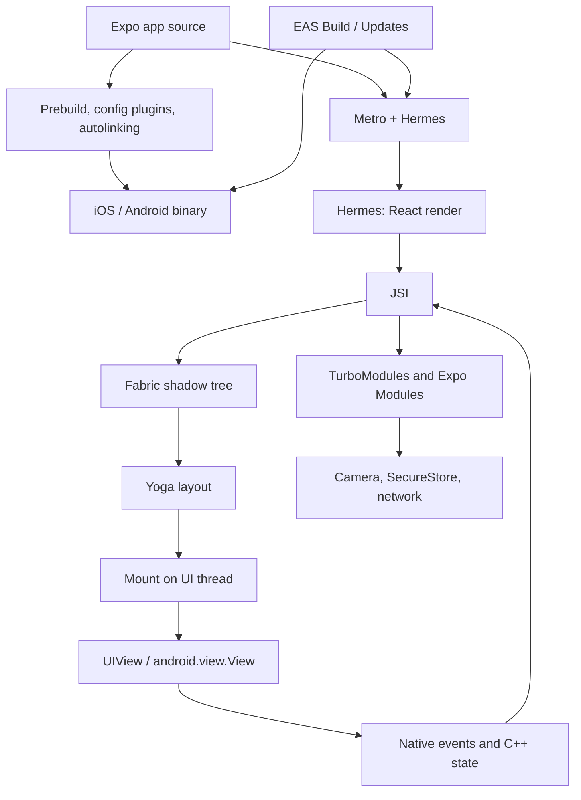

React Native 常被介绍成「React，但输出是 native views 而不是 DOM」。这个描述并没有错，但压缩得太厉害，解释不了为什么 `View` 里的 string 会 crash、为什么 scroll offset 上的 `useState` 会掉帧、为什么 Expo config plugin 不能 OTA 下发，或为什么 `useLayoutEffect` 可以在 device 上一次 commit 量到 view，但若你每帧 animate `height` 仍会失败。

我通过 **Expo** 交付 React Native，就像这个网站通过 Next.js 交付 React 一样。更有用的模型是：**Expo 是围绕 React Native 的 orchestrator**，而 React Native 是 **React 的 host renderer**。Expo 分类 native modules、产生 iOS 与 Android 项目、用 Metro bundle JavaScript，并把 artifacts 对应到 devices。React Native 把 React tree 转成 C++ shadow tree、跑 Yoga，并 mount `UIView` / `android.view.View` instances。React 仍拥有 elements、Fibers、lanes、render 与 commit。

<br />

```text
app source + app.json / config plugins
  → Expo prebuild / autolinking / Expo Modules
  → Metro bundle (Hermes bytecode)
  → React render (Fibers)
  → Fabric shadow nodes (C++, via JSI)
  → Yoga layout
  → mount native views
  → native events / C++ state / Expo Modules feed back
```

<br />

这篇文章针对 **Expo SDK 57**（`expo@57.0.9`、React Native **0.86.2**、React **19.2**、Hermes V1）。New Architecture 是默认，在这个 SDK line 里也是唯一受支持的 runtime。它假设你已熟悉 React 的 render/commit model。它区分四种陈述：

- 一条 **React 规则**，例如 render purity，或 state setter 会 schedule 工作而不是突变当前 closure。
- 一份 **React Native 契约**，例如 `<View>` 与 `<Text>` 是不同的 host components，或 Fabric 把 shadow tree mount 到 platform views。
- 一份 **Expo 契约**，例如 config plugins、Continuous Native Generation、Expo Modules、`expo-router` file routes，或 EAS Build 与 EAS Update 的分工。
- 一项 **实现观察**，例如 shadow-node field 或 Metro/Hermes 细节。观察有助于调试。应用代码不得依赖它们。

Legacy Bridge 与 `react-native init` 只在旧词汇会造成歧义时出现。Expo Go 是带固定 native module set 的 development host。它不是 production architecture。

<br />

---

## 1. Expo 在 React Native 周围加上 Policy 与基础设施

React 定义 components、reconciliation、Suspense 与 concurrent rendering。它不决定 TypeScript screen 如何变成 IPA、哪个 native module 被 link 进那个 binary、fonts 如何嵌入，或后来的 JavaScript bundle 如何替换随 store build 一起 ship 的那份 bundle。React Native 决定 host views 如何被创建与更新。Expo 决定 delivery path 的其余部分并把它接起来。

一个 production Expo 应用跨越数层：



这些 boundaries 很重要，因为同一组 screens 可以在 React 没变的情况下表现不同：

- **Config 与 prebuild** 决定 binary 里存在哪些 native code：permissions、fonts、splash 与 third-party modules。`app.json` / `app.config.ts` 加上 config plugins 是契约。`npx expo prebuild` 物化 `ios/` 与 `android/`。
- **Autolinking** 在 **app** package 的 `node_modules` 里发现 native modules 并注册它们。只存在于 shared workspace package 的 native dependency 对 autolinking 不可见。
- **Metro** 把 JavaScript/TypeScript graph 转成 Hermes 可执行的 bundle。开发时 Fast Refresh 替换那份 graph。Hermes V1 在 production 把它编译成 bytecode。
- **React Native** 负责 render、layout 与 mount。Expo 不会取代 Fabric。
- **EAS** 是 deployment adapter。EAS Build 产生 native binary。EAS Update / `expo-updates` 替换已包含匹配 native surface 的 binary 内的 JavaScript bundle。

把 Expo 叫做「managed workflow」低估了 compiler。把 React Native 叫做「带 JS bridge 的 native 应用」低估了 renderer。比较耐用的心智模型是 **native project generator 加上 bundler 加上 React renderer**，通过 host-specific adapter 部署。

我把 Expo 想成 [深入理解 Next.js](/notes/understanding-next-js-in-depth) 对待 Next.js 的方式：围绕 React core 的 policy 与基础设施。Next.js 把 URLs 对应到 browser 的 React trees。Expo 把 `app/` files 与 native modules 对应到 device 的 React trees。

<br />

---

## 2. React Native 是 Renderer，不是 Browser

Browser 解析 HTML、建立 DOM 与 CSSOM、style、layout、paint 与 composite。那条路径是 [Browser 中的 Critical Rendering Path](/notes/critical-rendering-path-in-the-browser)。React Native 不做任何那些事。没有 HTML、没有 CSSOM、也没有 DOM。JSX 仍产生 React elements。Host tree 是 platform views。

`<View>` 与 `<Text>` 不是带不同 default styles 的 div。它们是 **不同的 host components**，有不同的 native types 与不同的 layout rules。Yoga 可以 size 一个 `View`。Text metrics 来自 platform（`NSLayoutManager` / Android text layout）。String 只能作为 `Text` 的 child 才合法：

<br />

```tsx
import { StyleSheet, Text, View } from "react-native"

function Greeting({ name }: { name: string }) {
  return (
    <View style={styles.row}>
      <Text>Hello, {name}</Text>
    </View>
  )
}

const styles = StyleSheet.create({
  row: {
    gap: 8,
    padding: 16,
  },
})
```

<br />

这是非法的，在 production 会 crash：

<br />

```tsx
function Greeting({ name }: { name: string }) {
  return <View>Hello, {name}</View>
}
```

<br />

React Native 会尝试把那个 string mount 成不接受 raw text 的 view 的 host child。当 falsy number 或 empty string 漏进 tree 时，会出现同样的 crash：

<br />

```tsx
function Badge({ count }: { count: number }) {
  return (
    <View>
      {count && <Text>{count}</Text>}
    </View>
  )
}
```

<br />

当 `count` 是 `0` 时，JSX render 的是 `0`，不是 `false`。Fabric 随后会尝试在 `View` 底下创建 text host node。条件应放在 boolean 或 ternary 里：

<br />

```tsx
function Badge({ count }: { count: number }) {
  return (
    <View>
      {count > 0 ? <Text>{count}</Text> : null}
    </View>
  )
}
```

<br />

这是 React Native 契约，不是 lint 偏好。Web DOM 会把 `0` stringify 成 text node。Native host tree 不会。

Expo Go 不会改变这份契约。它是 prebuilt 应用，其 native module set 就是 Expo 在该 Go binary 里 ship 的内容。Config plugin、custom Expo Module 或新的 native dependency 在 **你的** binary 里存在之前，对 Go 不可见。Production development 使用 **dev client**（`expo-dev-client`）或 native surface 与 `app.json` 匹配的 EAS build。

<br />

---

## 3. 四棵树

[深入理解 React](/notes/understanding-react-in-depth) 区分 React elements、Fiber tree 与 host tree。Fabric 加上第四棵树，它活在 C++ 里：

<br />

```text
React elements   descriptions returned by components
Fiber tree       React's persistent bookkeeping and unit of work
Shadow tree      C++ layout tree (Yoga)
Host view tree   UIView / android.view.View on the UI thread
```

<br />

像 `HomeScreen` 或 `expo-router` layout 这样的 composite component 永远不会变成 shadow node。React 调用它，取它返回的 host elements，Fabric 只为那些 hosts 创建 shadow nodes：`View`、`Text`、`ScrollView`、来自 `expo-image` 的 `Image`，以及其他 native components。

Host Fiber 存储指向其 shadow node 的 JSI pointer。Element object 是暂时的描述。Fiber 记住 identity、hooks 与 lanes。Shadow node 持有 style、children 与 layout。Host view 是用户能看到的。

混淆这些层会产生常见错误。新的 element object 不代表新的 `UIView`。一次 component render 不代表 mount。JSX 里的 wrapper `View` 在 flattening 之后可能永远不会作为 native view 存在。Device 上改变的 `ScrollView` offset 不一定经过 React state。

<br />

---

## 4. Bridge 为何存在，以及它破坏了什么

在 New Architecture 之前，JavaScript 与 native code 通过 asynchronous queue 通信。Calls 被序列化成 JSON、post 过 bridge，并在另一端 decode。Layout 无法在 render 期间被同步读取。Native modules 在 startup 时被 eager 初始化。Concurrent React 无法 commit 一棵连贯的 native tree，因为 renderer 无法参与 React 18 的 scheduling model。

那个设计 ship 了很多应用。它也在每次跨越 boundary 的 frame 上征税：lists、gestures、cameras，以及任何需要比 JSON message 更大的 native object 的东西。

New Architecture 用 **JSI** 取代 queue，用 **Fabric** 取代 renderer，用 **TurboModules**（在 Expo 里还有 **Expo Modules API**）取代 native modules。Expo SDK 55 停止支持 legacy architecture。SDK 57 不把它作为 runtime 选项提供。撰写时 `expo@canary` 上可用的 React Native 0.87 继续这项移除。这篇文章描述的是你在 SDK 57 上实际运行的 architecture。

「Bridge」这个词仍出现在 blog posts 与旧 modules 的 interop layers 里。它不是 framework 所建立的契约。

<br />

---

## 5. JSI 是 Shared Memory，不是 Message Bus

**JSI**（JavaScript Interface）是一个 C++ API，让 JavaScript engine 持有 native object 的 reference，也让 native code 持有 JavaScript function 的 reference。JS 对 native 的 call 可以是 synchronous。Hot path 上没有 JSON round-trip。

那是 Fabric 在 render 期间创建 shadow nodes 所用的契约。也是 TurboModules 与 Expo Modules 暴露 `SecureStore`、camera frames 与 filesystem handles 所用的契约。像 VisionCamera 这样的 library 可以在不把约 30 MB 的 pixels 每秒六十次复制进 JSON string 的情况下处理 frame buffers。

Synchronous 不代表「免费」，也不代表「在另一条 thread」。Synchronous JSI call 仍占用发起它的 thread。若那条 thread 是 JS thread，重的 native call 仍会 stall React。若工作属于 UI thread，module 必须显式 hop 过去。

JSI 也不是 React API。应用代码应继续调用已文档化的 modules（`expo-secure-store`、`expo-image`、`react-native` host components）。那些 modules 是 JSI host objects 这一事实，是解释 latency 的实现观察，不是你在 screen 里该去 reach 的 type。

<br />

---

## 6. Threading

Fabric 被设计成 thread-safe，方式是保持 renderer structures immutable：updates clone 而不是 mutate。我几乎每次真正追查的 bug 里，有两条 thread 很重要：

- **JS thread** 跑 Hermes、React 的 render phase，以及大部分 Yoga 工作。
- **UI thread**（main thread）是唯一可以 create、update 或 destroy host views 的 thread。

高优先级的 native events 可以在 **UI thread** 上跑 render pipeline，这样 gesture 不会卡在 in-flight JS render 后面。较低优先级的工作可以被 interrupt。C++ state updates，例如 `ScrollView` offset，可以完全跳过 React 的 render phase。

<br />

```text
JS thread                         UI thread
  React render                      host view mutations
  most Yoga layout                  high-priority render (gestures)
  TurboModule / Expo Module JS      C++ state from native views
  Metro / Fast Refresh
```

<br />

这就是为什么「应用很慢」不是一个 diagnosis。长的 React render 占用 JS thread。Layout-thrashing animation 占用 Yoga。Main-thread native module 占用 UI thread 并 delay mount。Reanimated worklets 存在，是因为有些工作根本不能等 JS。

Hermes 不会给你第二条 JS thread。Concurrent React 可以在 JS thread 上 pause 并 restart 一次 render。它不会把 JavaScript 移到 UI thread，除非 renderer 显式在那里跑 high-priority pass。

<br />

---

## 7. Render、Commit 与 Mount

Fabric 的 pipeline 有三个 phase。官方文档称它们为 **render**、**commit** 与 **mount**。它们对应 React 的 render/commit 分割，外加一个 native publication step。

**Render。** React 把 composite components 归约成 host elements，并对每个 host，Fabric 在 C++ 里 synchronously 创建 shadow node。Element tree 里的 parent-child relationships 在 shadow tree 里镜像。这通常在 JS thread 上跑。React element tree 是 temporal 的。Fibers persist 并持有 JSI pointer。

**Commit。** 当 shadow tree 完成，Fabric 用 Yoga 计算 layout，并把那棵树 promote 成「next」。大部分 layout 是 C++。`Text` 与 `TextInput` 仍会 call 进 platform 取 metrics。Commit 不得 mutate host views。常见路径在 UI thread 之外执行；high-priority gesture 也可以改在 UI thread 跑完整条 pipeline。

**Mount。** UI thread diff 先前 mounted 的 shadow tree 与 next tree，flatten 不需要 host view 的 nodes，并 apply atomic mutations：create、update、insert、remove、delete。只有那时 pixels 才会改变。

<br />

```text
React render (JS)
  → shadow nodes (C++, via JSI)
  → commit: Yoga + promote next tree
  → mount: diff, flatten, mutate UIView / android.view.View
```

<br />

Initial render 对 empty tree diff，所以 mount 是一串 creates。Update 对两棵 immutable trees diff，可能只碰一个 `backgroundColor`。React 可以跳过 intermediate trees：后来完成的 render 可以对 last published tree mount，而不是对每一个被放弃的 attempt。

这是 concurrent features 在 native 上能运作的机械原因。Render 是 speculative。Mount 是 publication。永远没 finish 的 transition 不会 mutate host views。

<br />

---

## 8. Yoga、Flattening 与 Layout 可能付出的代价

Yoga 在 C++ 里实现 Flexbox-like layout。Styles 是 JavaScript objects，不是 CSS stylesheets。`gap`、`padding` 与 `flex` 是 shadow-node inputs。它们不是 browser cascade。

有两个后果。

第一，**view flattening**。只传递 layout 的 nested wrapper `View` 往往永远不会变成 host views。Fabric 把典型 600–1000 nodes 的 shadow tree 归约到大约 200 个 host views 的量级。当 native inspector 里缺少你写的 `View` 时，flattening 是可能原因，不是 missing mount。

第二，**layout 不是每帧都免费**。Animate `width`、`height`、`top`、`margin` 或 `padding` 会要求 Yoga recompute。Animate `transform` 与 `opacity` 可以在 GPU 上跑而不 relayout：

<br />

```tsx
import { useEffect, type ReactNode } from "react"
import Animated, {
  useAnimatedStyle,
  useSharedValue,
  withTiming,
} from "react-native-reanimated"
import { StyleSheet } from "react-native"

function SlideIn({
  visible,
  children,
}: {
  visible: boolean
  children: ReactNode
}) {
  const progress = useSharedValue(visible ? 1 : 0)

  useEffect(() => {
    progress.set(withTiming(visible ? 1 : 0))
  }, [progress, visible])

  const animatedStyle = useAnimatedStyle(() => {
    const value = progress.get()
    return {
      opacity: value,
      transform: [{ translateY: (1 - value) * 24 }],
    }
  })

  return (
    <Animated.View style={[styles.panel, animatedStyle]}>{children}</Animated.View>
  )
}

const styles = StyleSheet.create({
  panel: {
    borderCurve: "continuous",
    borderRadius: 12,
  },
})
```

<br />

Fabric 也让 **synchronous measurement** 能在同一 commit 里发生。`useLayoutEffect` 可以在 paint 之前读 layout。`onLayout` 在 view 后来改变时保持值 current。Prefer dispatch updater，这样 identical size 不会 schedule 另一次 render：

<br />

```tsx
import { useLayoutEffect, useRef, useState, type ReactNode } from "react"
import { StyleSheet, Text, View, type LayoutChangeEvent } from "react-native"

type Size = { width: number; height: number }

function MeasuredBox({ children }: { children: ReactNode }) {
  const ref = useRef<View>(null)
  const [size, setSize] = useState<Size | undefined>(undefined)

  useLayoutEffect(() => {
    const rect = ref.current?.getBoundingClientRect()
    if (rect) {
      setSize({ width: rect.width, height: rect.height })
    }
  }, [])

  function onLayout(event: LayoutChangeEvent) {
    const { width, height } = event.nativeEvent.layout
    setSize((current) => {
      if (current?.width === width && current.height === height) {
        return current
      }
      return { width, height }
    })
  }

  return (
    <View ref={ref} onLayout={onLayout} style={styles.box}>
      {children}
      {size ? (
        <Text>
          {size.width}×{size.height}
        </Text>
      ) : null}
    </View>
  )
}

const styles = StyleSheet.create({
  box: {
    gap: 8,
    padding: 16,
  },
})
```

<br />

`getBoundingClientRect` 是 0.82 之后的路径。较旧的 `measure` callback 是同一想法，但更多 asynchrony。两者都不是 animate layout properties 的借口。

<br />

---

## 9. Structural Sharing 与 C++ State

Shadow trees 是 immutable 的。React state update 从 changed node 到 root 克隆路径，并 **share** 未改变的 subtrees。Mount diff previous published tree 与 new tree。Sibling list 里的 Node 4 可以被 reuse，同时 Node 3 的 `backgroundColor` 被 rewrite。

这种 sharing 就是 keys 与 identity 仍然重要的原因：它们是 React 决定哪个 Fiber、哪个 shadow node、哪个 host view 存活的依据。也是为什么一个大 screen 若每行都返回新的 inline style object，仍可能比 screenshot 暗示的做更多工作。Style 是 cloning 的 input，即使 visual result 看起来一样。

Shadow tree 里大部分信息起源于 React 并向下流。 **C++ state** 是例外。有些 host components 保持 JavaScript 不拥有的 state。`ScrollView` offset 是 usual example：platform view scrolls，C++ 记录 offset，`measure` 这类 API 可以读它。React 没有 render 那次 update。

若我把那个 offset 放进 `useState`，我就发明了第二个 source of truth，并在每个 scroll event 上 schedule React render：

<br />

```tsx
function Feed() {
  const [scrollY, setScrollY] = useState(0)

  return (
    <ScrollView
      onScroll={(event) => {
        setScrollY(event.nativeEvent.contentOffset.y)
      }}
      scrollEventThrottle={16}
    />
  )
}
```

<br />

JS thread 现在在通往每一帧的路上 reconcile。Offset 已经存在于 C++。对 animation，Reanimated shared value 在 UI thread 上 update。对 non-reactive tracking，ref 就够：

<br />

```tsx
import Animated, {
  useAnimatedScrollHandler,
  useSharedValue,
} from "react-native-reanimated"

function Feed() {
  const scrollY = useSharedValue(0)

  const onScroll = useAnimatedScrollHandler({
    onScroll: (event) => {
      scrollY.set(event.contentOffset.y)
    },
  })

  return (
    <Animated.ScrollView onScroll={onScroll} scrollEventThrottle={16} />
  )
}
```

<br />

若 React 在中间 commit 了，C++ state commits 会 retry。Source of truth 留在 native。React 让开，直到 screen 真的需要 React state snapshot。

<br />

---

## 10. TurboModules、Codegen 与 Expo Modules

Legacy native modules 被 upfront 注册。Startup 为 camera、maps 与 analytics 付费，即使第一个 screen 从未用过它们。

**TurboModules** 通过 JSI lazy load。第一次 JS access 才 construct module。**Codegen** 读 TypeScript 或 Flow specs 并 generate native bindings，让 JS/native interface 在 build time 被检查，而不是在 production 的第一次 call。

Expo 的 **Expo Modules API** 坐在同一 JSI layer 上。`expo-secure-store`、`expo-camera`、`expo-font` 与 `expo-image` 是带 JavaScript entry points 的 native modules。它们不是围绕 `fetch` 的可选 wrappers。

两份 Expo 契约决定 module 是否存在于 binary 里。

**Autolinking** 扫描 app 的 `node_modules`。在 monorepo 里，`packages/ui` 用的 native dependency 也必须在 app package 里 declare。否则 prebuild 不会 link 它，JS import 会在 runtime fail，或 native symbol 会 missing。

**Config plugins** mutate 生成的 native project：Info.plist keys、Gradle permissions、embedded fonts、splash screens。Fonts 属于 `expo-font` plugin，这样它们在 process start 就存在，而不是在 async `useFonts` gate 之后：

<br />

```json
{
  "expo": {
    "plugins": [
      [
        "expo-font",
        {
          "fonts": ["./assets/fonts/Geist-Bold.otf"]
        }
      ]
    ]
  }
}
```

<br />

Images 属于 `expo-image`。它是带 native caching、blurhash placeholders 与 lists 用 recycling keys 的 Expo Module。`react-native` 的 `Image` 是较薄的 host wrapper：

<br />

```tsx
import { Image } from "expo-image"
import { StyleSheet } from "react-native"

function Avatar({ url }: { url: string }) {
  return (
    <Image
      source={{ uri: url }}
      contentFit="cover"
      cachePolicy="memory-disk"
      style={styles.avatar}
    />
  )
}

const styles = StyleSheet.create({
  avatar: {
    borderCurve: "continuous",
    borderRadius: 20,
    height: 40,
    width: 40,
  },
})
```

<br />

加上 plugin 或 native module 会改变 **native** surface。那需要 `npx expo prebuild`（或 EAS Build）与新的 binary。仅 JavaScript 的 changes 不需要。

<br />

---

## 11. Metro、Hermes 与 OTA 能替换什么

`npx expo start` 跑 Metro。Metro 从 Expo entry 走 module graph，resolve platform extensions（`*.ios.tsx`、`*.android.tsx`），并 serve bundle。开发时 Fast Refresh 替换 components，并在可能时 preserve state。Production 里 **Hermes V1**（自 SDK 56 起默认，包括 SDK 57）把 bundle 编译成 bytecode。

JS thread 仍是一条 thread。更便宜的 bytecode format 不会让 unbounded 的 feed `map` 变免费。

**EAS Update** / `expo-updates` 把新的 JavaScript bundle ship 到现有 binary。它不能加 native module、permission、通过 config plugin 注册的 font file，或新的 Expo Module。那些活在 IPA/APK 里。若 screen 在 OTA 之后开始 call `expo-camera`，而 binary 是在没有那个 module 的情况下 build 的，update 不会发明 native code。

那种 split 是 Expo 对 Next.js compiler 与 runtime 的 analog。Store build 是 native contract。Update 是给那份 contract 的新 React tree。

Hermes 也解释一些 debugging 形状。React Native DevTools 与 engine 对话。JS-only freeze 是 Hermes/React 问题。JS idle 时仍持续的 freeze 是 UI-thread 或 native-module 问题。

<br />

---

## 12. expo-router 是 Native Views 上的 Route Tree

`expo-router` 把 `app/` 下的 files 对应到 screens，就像 Next.js 把 `app/` 对应到 URL segments。这个 analog 有用但不完整。Next.js 为 document 产生 HTML 与 Flight tree。Expo Router 产生 Fabric mount 进 **native** navigator 的 React tree。

用 native stack。Expo Router 的 `Stack` 是 `@react-navigation/native-stack`。Transitions 与 back-swipe 在 UI thread 上跑。`@react-navigation/stack` 是 JS navigator：它通过 React animate views，并失去那种 native behavior。

<br />

```tsx
import { Stack } from "expo-router"

export default function Layout() {
  return <Stack />
}
```

<br />

当产品在意 platform feel 时，Tabs 也应该是 native 的：

<br />

```tsx
import { NativeTabs } from "expo-router/unstable-native-tabs"

export default function TabLayout() {
  return (
    <NativeTabs>
      <NativeTabs.Trigger name="index">
        <NativeTabs.Trigger.Label>Home</NativeTabs.Trigger.Label>
        <NativeTabs.Trigger.Icon sf="house.fill" md="home" />
      </NativeTabs.Trigger>
      <NativeTabs.Trigger name="settings">
        <NativeTabs.Trigger.Label>Settings</NativeTabs.Trigger.Label>
        <NativeTabs.Trigger.Icon sf="gear" md="settings" />
      </NativeTabs.Trigger>
    </NativeTabs>
  )
}
```

<br />

`expo-router/unstable-native-tabs` 这个 import 是 SDK 57 上的 Expo 契约。即使之后 module path 稳定下来，仍应优先用 native tabs，而不是 JS tab navigator。

Layout file 是 composite component。它有 Fiber identity。它不会自己变成 shadow node。Native stack 拥有 headers、gestures 与 large titles 的 host views。Custom JS header 是你现在必须 mount、style，并与 OS 保持 sync 的 React subtree。Prefer native header options。

这不是 routing tutorial。架构要点是 navigation 是 host tree 的一部分。若 transition 在 JavaScript 里跑，每一帧都 re-enter React。若它在 `UINavigationController` / Android native tab host 里跑，OS animate 时 React 可以 idle。

<br />

---

## 13. Native 上的 Concurrent React

Fabric 是让 React 18+ scheduling 在 device 上成真的东西。Legacy renderer 无法 cleanly 参与 transitions、Suspense，或来自 native events 的 automatic batching。

`startTransition` 可以把重的 screen update 标成 interruptible。设置 large list size 的 slider 可以让 gesture 保持 urgent、list 保持 transitional，与 web 上同一 pattern。Suspense 可以为 native tree 的一个 region 显示 fallback，而不 tear down 该 boundary 外已 commit 的 host views。

Synchronous layout 是另一半。在 legacy architecture 上，`onLayout` 加上 follow-up `setState` 常常 paint 一帧 tooltip 在错误位置。有了 Fabric，`useLayoutEffect` 加上 `getBoundingClientRect` 可以在一次 commit 里 measure 并 apply。那是 React 规则（layout effects 在 paint 之前跑）被 React Native 契约（renderer 可以 synchronously 读 layout）兑现。

Concurrent rendering 仍不是 parallelism。Hermes 跑工作。Fabric 可以 interrupt 它。UI thread 可以 take high-priority pass。Committed host tree 保持 coherent。

至于 React APIs 本身，见 [React 19 新功能](/notes/react-19-new-features) 与 [深入理解 React](/notes/understanding-react-in-depth)。这一节只说明那些 APIs 在 Expo SDK 57 上为何不是 no-ops。

<br />

---

## 14. 不能等 JS 的工作

60fps gesture 不能 round-trip 过 React render、Yoga 与 mount 到 JS thread 上仍感觉 native。Reanimated worklets 与 Gesture Handler 在 UI thread 上跑。SDK 57 pin 当前版本的 `react-native-reanimated`、`react-native-worklets` 与 `react-native-gesture-handler`。

`Pressable` 是 host press primitive。`TouchableOpacity` 是 legacy。Animated press states（scale、opacity）属于 `GestureDetector` 加 shared values，不属于 press-in 上的 JS `setState`。

Lists 是另一个 JS-thread trap。Map 每一行的 `ScrollView` 会为 offscreen content 创建 Fiber、shadow node，以及可能的 host view：

<br />

```tsx
function Feed({ items }: { items: Item[] }) {
  return (
    <ScrollView>
      {items.map((item) => (
        <ItemCard key={item.id} item={item} />
      ))}
    </ScrollView>
  )
}
```

<br />

Virtualizer 大约只 mount visible window。那是 Fabric budget，不是 stylistic preference：

<br />

```tsx
import { FlashList } from "@shopify/flash-list"
import { StyleSheet } from "react-native"

function Feed({ items }: { items: Item[] }) {
  return (
    <FlashList
      data={items}
      renderItem={({ item }) => <ItemCard item={item} />}
      keyExtractor={(item) => item.id}
      contentContainerStyle={styles.list}
    />
  )
}

const styles = StyleSheet.create({
  list: {
    padding: 16,
    gap: 12,
  },
})
```

<br />

LegendList 是同一想法。契约是「不要 mount 用户看不到的东西」。`renderItem` 上的 inline style objects 与 inline callbacks 在 compiler 没有 inline 它们时仍会 defeat memoization；hoist 或让 React Compiler 做。架构成本是 user scroll 时在 JS 与 UI threads 上额外的 render → extra shadow clones → extra mount diffs。

<br />

---

## 15. 从头到尾跟一次 Press

假设 Expo Router 里的 membership card screen。用户 press 一个 `Pressable`。Handler 用 `setState` 写 flag，并从 `expo-secure-store` 读 token。

路径是：

1. OS 在 UI thread 上把 touch 交给 host view。
2. Fabric / Gesture Handler 把 press route 进 JS 并 call `Pressable` handler。
3. `setState` 在 screen 的 Fiber 上 enqueue Hook update 并 schedule root（[深入理解 React](/notes/understanding-react-in-depth)）。
4. React 在 JS thread 上 render。Composite components 跑。Host elements 被创建。
5. Fabric 通过 JSI clone 或 create changed hosts 的 shadow nodes，并 share 其余部分。
6. Commit 跑 Yoga。Text metrics 可能 call 进 UIKit / Android。
7. Mount diff previous shadow tree、flatten wrappers，并在 UI thread 上 mutate native views。
8. `expo-secure-store` read 是 separate JSI call 进 Expo Module。它不经过 Fabric。它可能在 module 内部 hop threads。它永远不会变成 `View`。
9. 若 press 也 navigated，native stack 在 UI thread 上 animate，同时 React render destination screen。两者由 routing 耦合，不是由一个 function call。

在任何时刻 React 都不会 rewrite 已经跑过的 handler 里的 `pressed` binding。在任何时刻 half-finished render 都不会变成 half-mutated 的 `UIView` tree。SecureStore 不在 shadow tree 里。Card 的 `View` 在。

那一次 interaction 就是整个 stack：Expo Module、React scheduler、Fabric、Yoga 与 platform。

<br />

---

## 16. 我用来调试的问题

当 Expo screen 让我意外时，我会依序想这些：

1. **哪条 thread 忙？** JS freeze 对 UI freeze 对两者都 freeze。
2. **这是 Expo Go、dev client，还是 release binary？** Go 不能长出新的 native modules。
3. **是 React render、Fabric commit，还是 mount？** Component 里的 `console.log` 不能证明 `UIView` 改变了。
4. **这是 C++ state 还是 React state？** Scroll offset、text selection 与某些 gesture state 从未进入 `useState`。
5. **Flattening 是否移除了我在 native inspector 里找的那个 view？**
6. **这个 change 需要 native rebuild，还是 JS 就够？** Config plugins、permissions、fonts 与新的 Expo Modules 需要新 binary。EAS Update 不能发明它们。
7. **Autolinking 是否在查 app package？** 只在 workspace library 里的 native dep 是 missing link，不是 Metro cache issue。
8. **这是 host-component 契约吗？** `Text` 外的 strings、`0 && <Text />`、Gesture Handler list 里的 `TouchableOpacity`。
9. **Navigation 是 native 的吗？** JS stack 会在本该免费的 transition 期间显示为 React 工作。
10. **Layout 是否每帧都在跑？** Animated `height` 是 Yoga。Animated `transform` 不是。

这些问题比一直加 `memo` 直到 list 不再掉帧更可靠。

<br />

---

## 17. 常见误解

**「React Native 是 WebView。」** WebView 是应用里的 browser origin。Fabric mount platform views。混用两者是 security boundary，见 [Frontend Security in Next.js and React Native](/notes/frontend-security-nextjs-react-native)。它不是 `View` 如何被画出来。

**「Expo Go 就是 production 怎么运作。」** Go 是 prebuilt runtime。Production 是你的 EAS binary，加上可选的、fit 那份 binary 的 OTA JavaScript bundle。

**「Managed 代表没有 native。」** Managed 代表 Expo generate native project。应用仍是 UIKit 与 Android views。Config plugins 是 native edits。Expo Modules 是 native code。

**「Bridge 仍是 JS 与 native 怎么说话。」** 在 SDK 57 上不是。JSI 是契约。Interop 可能为旧 modules 存在。它不是 architecture。

**「JSI 代表 JavaScript 并行跑。」** JSI 是 shared-memory calling。Hermes 仍是一条 JS thread。Concurrent React interleave 工作。它不加 cores。

**「Fabric 是新的 React。」** Fabric 是 React Native 的 renderer。React 的 reconciler 是 [深入理解 React](/notes/understanding-react-in-depth) 描述的同一 core。Fabric 是 host config 与 C++ shadow tree。

**「EAS Update 可以 ship 新的 native module。」** 它 ship JavaScript。Native surface changes 需要新 build。

**「更多 `View` 代表更多 native views。」** Flattening 丢掉 wrappers。Virtualization 拒绝 mount offscreen rows。JSX shape 不是 host-tree shape。

**「`useLayoutEffect` 在 native 上没用。」** 在 legacy renderer 上 sync layout 很弱。在 SDK 57 的 Fabric 上，它是 measure 而不 visible jump 的方式。

<br />

---

## 最终心智模型

我用的最短且准确的模型是：

<br />

```text
Expo generates the native binary and the JS bundle.
Hermes runs React.
Fibers remember.
JSI shares memory with native.
Fabric builds a shadow tree.
Yoga lays out.
Mounting publishes UIView / android.view.View.
C++ state can bypass React.
OTA replaces JS, not native.
```

<br />

React Native 不会取代 React 的 rendering model。Expo 不会取代 React Native 的 renderer。Expo 决定哪些 modules 存在、native project 如何被 generate，以及 binary 与 bundle 如何到达 device。React Native 决定 React tree 如何变成 platform views。React 决定 updates 如何被 scheduled、rendered 与 committed。

保持 rendering pure，因为 Fabric 可能 restart 它。把 strings 放在 `Text` 里，因为 host tree 不是 DOM。当 UI thread 已经拥有 scroll 与 gestures 时，把它们移出 React state tree。把 config plugins 放在 binary 里，不要放在 EAS Update 里。用 native navigators，这样 transitions 不会 re-enter JavaScript。

至于 React 自己的 queues、lanes 与 commit phase，继续看 [深入理解 React](/notes/understanding-react-in-depth)。Web 对照见 [Browser 中的 Critical Rendering Path](/notes/critical-rendering-path-in-the-browser)。Server/document 侧对应的 orchestrator 见 [深入理解 Next.js](/notes/understanding-next-js-in-depth)。Device threat model（extractable bundle、SecureStore、WebView bridges）见 [Frontend Security in Next.js and React Native](/notes/frontend-security-nextjs-react-native)。

主要参考：Expo 的 [SDK 57 changelog](https://expo.dev/changelog/sdk-57)，以及 React Native 的 [architecture overview](https://reactnative.dev/architecture/overview)、[render pipeline](https://reactnative.dev/architecture/render-pipeline)、[threading model](https://reactnative.dev/architecture/threading-model) 与 [New Architecture](https://reactnative.dev/docs/the-new-architecture/landing-page) notes。公开的 Expo 与 React Native 契约是耐用的 API。Shadow-node internals 与 Metro 细节是今天 toolchain 的 debugging 证据，不是要 hard-code 的 API。

这篇文章中的实现观察对应 **Expo SDK 57** 与 React Native **0.86.2**（Hermes V1、New Architecture）。React Native 0.87 是下一个 Expo canary line，不是这个 SDK 的 runtime。
