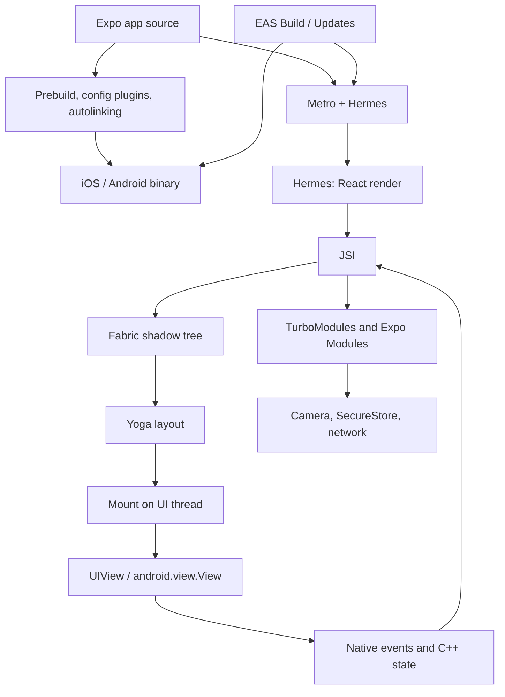

React Native 常被介绍成「React，但输出是 native views 而不是 DOM」。这跳过了为什么 `View` 里的 string 会 crash、为什么 scroll offset 上的 `useState` 会掉帧、为什么 Expo config plugin 不能 OTA 下发，或为什么 `useLayoutEffect` 可以在一次 commit 里量到 view，但若你每帧 animate `height` 仍会失败。

这个技术栈通过 **Expo** 交付 React Native，就像这个网站通过 Next.js 交付 React 一样。**Expo 是围绕 React Native 的 orchestrator。** React Native 是 **React 的 host renderer**。Expo 分类 native modules、产生 iOS 与 Android 项目、用 Metro bundle JavaScript，并把 artifacts 对应到 devices。React Native 把 React tree 转成 C++ shadow tree、跑 Yoga，并 mount `UIView` / `android.view.View` instances。React 仍拥有 elements、Fibers、lanes、render 与 commit。

<br />

```text
app source + app.json / config plugins
  → Expo prebuild / autolinking / Expo Modules
  → Metro bundle (Hermes bytecode)
  → React render (Fibers)
  → Fabric shadow nodes (C++, via JSI)
  → Yoga layout
  → mount native views
  → native events / C++ state / Expo Modules feed back
```

<br />

这篇文章针对 **Expo SDK 57**（`expo@57.0.9`、React Native **0.86.2**、React **19.2**、Hermes V1）。New Architecture 是默认，在这个 SDK line 里也是唯一受支持的 runtime。四种陈述：

- 一条 **React 规则**，例如 render purity，或 state setter 会 schedule 工作而不是突变当前 closure。
- 一份 **React Native 契约**，例如 `<View>` 与 `<Text>` 是不同的 host components。
- 一份 **Expo 契约**，例如 config plugins、Continuous Native Generation、Expo Modules、`expo-router`，或 EAS Build 与 EAS Update 的分工。
- 一项 **实现观察**，例如 shadow-node field。应用代码不得依赖它们。

Legacy Bridge 与 `react-native init` 只在旧词汇会造成歧义时出现。Expo Go 是带固定 native module set 的 development host。它不是 production architecture。

---

## 1. Expo 在 React Native 周围加上 Policy 与基础设施

React 定义 components、reconciliation、Suspense 与 concurrent rendering。它不决定 TypeScript screen 如何变成 IPA、哪个 native module 被 link、fonts 如何嵌入，或后来的 JavaScript bundle 如何替换随 store build 一起 ship 的那份。React Native 决定 host views 如何被创建。Expo 决定 delivery path 的其余部分。

<br />



<br />

- **Config 与 prebuild** 决定 binary 里存在哪些 native code。`app.json` / `app.config.ts` 加上 config plugins 是契约。`npx expo prebuild` 物化 `ios/` 与 `android/`。
- **Autolinking** 在 **app** package 的 `node_modules` 里发现 native modules。只存在于 shared workspace package 的 native dependency 不可见。
- **Metro** 把 JavaScript graph 转成 Hermes 可执行的 bundle。开发时 Fast Refresh 替换那份 graph。Hermes V1 在 production 把它编译成 bytecode。
- **React Native** 负责 render、layout 与 mount。Expo 不会取代 Fabric。
- **EAS** 是 deployment adapter。EAS Build 产生 native binary。EAS Update / `expo-updates` 替换已包含匹配 native surface 的 binary 内的 JavaScript bundle。

Expo 之于 React Native，就像 Next.js 之于 browser：围绕 React core 的 policy 与基础设施。Next.js 把 URLs 对应到 browser 的 React trees。Expo 把 `app/` files 与 native modules 对应到 device 的 React trees。

---

## 2. React Native 是 Renderer，不是 Browser

Browser 解析 HTML、建立 DOM 与 CSSOM、style、layout、paint 与 composite。那条路径是 [Browser 中的 Critical Rendering Path](/notes/critical-rendering-path-in-the-browser)。React Native 不做任何那些事。没有 HTML、没有 CSSOM、也没有 DOM。JSX 仍产生 React elements。Host tree 是 **platform views**。

`<View>` 与 `<Text>` 不是带不同 default styles 的 div。它们是 **不同的 host components**，有不同的 native types 与不同的 layout rules。Yoga 可以 size 一个 `View`。Text metrics 来自 platform（`NSLayoutManager` / Android text layout）。String 只能作为 `Text` 的 child 才合法。

<br />

```tsx
function Badge({ count }: { count: number }) {
  return (
    <View>
      {count > 0 ? <Text>{count}</Text> : null}
    </View>
  )
}
```

<br />

- React Native 会尝试把 raw string mount 成不接受 text 的 view 的 host child。`<View>Hello</View>` 在 production 会 crash。
- Web DOM 会把 `0` stringify 成 text node。Native host tree 不会。
- Expo Go 不会改变这份契约。它是 prebuilt 应用，其 native module set 就是 Expo 在该 Go binary 里 ship 的内容。Config plugin、custom Expo Module 或新的 native dependency 在 **你的** binary 里存在之前，对 Go 不可见。
- Production development 使用 **dev client**（`expo-dev-client`）或 native surface 与 `app.json` 匹配的 EAS build。

**失败：** `{count && <Text>{count}</Text>}` 当 `count` 是 `0`。JSX render 的是 `0`，不是 `false`。Fabric 随后会尝试在 `View` 底下创建 text host node。条件应放在 boolean 或 ternary 里。

---

## 3. 四棵树

[深入理解 React](/notes/understanding-react-in-depth) 区分 React elements、Fiber tree 与 host tree。Fabric 加上第四棵树，它活在 C++ 里。

<br />

```text
React elements   descriptions returned by components
Fiber tree       React's persistent bookkeeping and unit of work
Shadow tree      C++ layout tree (Yoga)
Host view tree   UIView / android.view.View on the UI thread
```

<br />

- 像 `HomeScreen` 或 `expo-router` layout 这样的 composite component 永远不会变成 shadow node。Fabric 只为 hosts 创建 shadow nodes：`View`、`Text`、`ScrollView`、来自 `expo-image` 的 `Image`。
- Host Fiber 存储指向其 shadow node 的 JSI pointer。Element 是暂时的描述。Fiber 记住 identity、hooks 与 lanes。Shadow node 持有 style、children 与 layout。Host view 是用户能看到的。
- 新的 element object 不代表新的 `UIView`。一次 component render 不代表 mount。JSX 里的 wrapper `View` 在 flattening 之后可能永远不会作为 native view 存在。
- Device 上改变的 `ScrollView` offset 不一定经过 React state。

---

## 4. JSI 取代了 Bridge

在 New Architecture 之前，JavaScript 与 native code 通过 asynchronous queue 通信。Calls 被序列化成 JSON、post 过 bridge，并在另一端 decode。Layout 无法在 render 期间被同步读取。Native modules 被 eager 初始化。Concurrent React 无法 commit 一棵连贯的 native tree。

New Architecture 用 **JSI** 取代 queue，用 **Fabric** 取代 renderer，用 **TurboModules**（在 Expo 里还有 **Expo Modules API**）取代 native modules。Expo SDK 55 丢掉了 legacy architecture。SDK 57 不把它作为 runtime 选项提供。

**JSI**（JavaScript Interface）是一个 C++ API，让 JavaScript engine 持有 native object 的 reference，也让 native code 持有 JavaScript function 的 reference。JS 对 native 的 call 可以是 **synchronous**。Hot path 上没有 JSON round-trip。

- 那是 Fabric 在 render 期间创建 shadow nodes 所用的契约，也是 TurboModules 与 Expo Modules 暴露 `SecureStore`、camera frames 与 filesystem handles 所用的契约。
- 像 VisionCamera 这样的 library 可以在不把约 30 MB 的 pixels 每秒六十次复制进 JSON string 的情况下处理 frame buffers。
- Synchronous 不代表免费，也不代表「在另一条 thread」。JS thread 上一次重的 JSI call 仍会 stall React。若工作属于 UI thread，module 必须显式 hop 过去。
- JSI 不是 React API。应用代码应继续调用已文档化的 modules。那些 modules 是 JSI host objects 这一事实解释 latency；它不是你在 screen 里该去 reach 的 type。

「Bridge」这个词仍出现在 blog posts 与旧 modules 的 interop layers 里。它不是 framework 所建立的契约。

---

## 5. Threading

Fabric 保持 renderer structures immutable：updates clone 而不是 mutate。几乎每条 production bug 里，有两条 thread 很重要。

<br />

```text
JS thread                         UI thread
  React render                      host view mutations
  most Yoga layout                  high-priority render (gestures)
  TurboModule / Expo Module JS      C++ state from native views
  Metro / Fast Refresh
```

<br />

- **JS thread** 跑 Hermes、React 的 render phase，以及大部分 Yoga 工作。
- **UI thread**（main thread）是唯一可以 create、update 或 destroy host views 的 thread。
- 高优先级的 native events 可以在 **UI thread** 上跑 render pipeline，这样 gesture 不会卡在 in-flight JS render 后面。较低优先级的工作可以被 interrupt。
- C++ state updates，例如 `ScrollView` offset，可以完全跳过 React 的 render phase。
- Hermes 不会给你第二条 JS thread。Concurrent React 可以在 JS thread 上 pause 并 restart 一次 render。它不会把 JavaScript 挪到 UI thread 上，除非 renderer 显式在那里跑一次高优先级 pass。

**失败：** 把「应用很慢」当成一种诊断。一次长的 React render 占用 JS thread。一次 layout-thrashing 的 animation 占用 Yoga。一个 main-thread native module 占用 UI thread 并推迟 mount。Reanimated worklets 存在，是因为有些工作根本不能等 JS。

---

## 6. Render、Commit 与 Mount

Fabric 的 pipeline 有三个 phases。官方文档称它们为 **render**、**commit** 与 **mount**。它们对应 React 的 render/commit 拆分，再加一步 native publication。

<br />

```text
React render (JS)
  → shadow nodes (C++, via JSI)
  → commit: Yoga + promote next tree
  → mount: diff, flatten, mutate UIView / android.view.View
```

<br />

- **Render。** React 把 composite components 收成 host elements。对每个 host，Fabric 同步在 C++ 里创建 shadow node。这通常跑在 JS thread 上。React element tree 是暂时的。Fibers 持久存在并持有 JSI pointer。
- **Commit。** Fabric 用 Yoga 计算 layout，并把那棵 tree promote 为「next」。大部分 layout 是 C++。`Text` 与 `TextInput` 仍会调用 platform 取 metrics。Commit 不得突变 host views。
- **Mount。** UI thread 把上一棵已 mount 的 shadow tree 与下一棵 diff，flatten 不需要 host view 的 nodes，并套用原子 mutations：create、update、insert、remove、delete。只有这时 pixels 才会变。
- 初次 render 对空树做 diff。一次 update 可能只碰一个 `backgroundColor`。React 可以跳过中间的 trees：一次稍后完成的 render 可以对上一次已发布的 tree mount，而不是对每一个被放弃的尝试。

这就是 concurrent features 能在 native 上工作的原因。Render 是 speculative 的。Mount 是 publication。一次从未完成的 transition 永远不会突变 host views。

---

## 7. Yoga、Flattening 与 Layout 可能付出的代价

Yoga 在 C++ 里实现一套 Flexbox-like 的 layout。Styles 是 JavaScript objects，不是 CSS stylesheets。`gap`、`padding` 与 `flex` 是 shadow-node inputs。它们不是 browser cascade。

<br />

```tsx
import { useEffect, type ReactNode } from "react"
import Animated, {
  useAnimatedStyle,
  useSharedValue,
  withTiming,
} from "react-native-reanimated"

function SlideIn({ visible, children }: { visible: boolean; children: ReactNode }) {
  const progress = useSharedValue(visible ? 1 : 0)

  useEffect(() => {
    progress.set(withTiming(visible ? 1 : 0))
  }, [progress, visible])

  const animatedStyle = useAnimatedStyle(() => {
    const value = progress.get()
    return {
      opacity: value,
      transform: [{ translateY: (1 - value) * 24 }],
    }
  })

  return <Animated.View style={animatedStyle}>{children}</Animated.View>
}
```

<br />

- **View flattening。** 只透传 layout 的 nested wrapper `View`s 往往永远不会变成 host views。Fabric 可以把一棵典型的 600–1000 nodes 的 shadow tree 减到大约 200 个 host views。Native inspector 里少了一个 `View`，往往是 flattening，不是 missing mount。
- Animate `width`、`height`、`top`、`margin` 或 `padding` 是在请 Yoga **每一帧** 重新计算。Animate `transform` 与 `opacity` 可以在 GPU 上跑，不必 relayout。
- Fabric 让 **synchronous measurement** 能在同一次 commit 里发生。`useLayoutEffect` 可以通过 `getBoundingClientRect`（0.82 之后的路径）在 paint 之前读 layout。`onLayout` 在 view 稍后改变时保持值是新的。Prefer dispatch updater，这样相同的 size 不会再 schedule 一次 render。
- 两种 measurement API 都不是每帧 animate layout properties 的借口。

**失败：** 每帧 animate `height`，然后奇怪为什么 Yoga 与 mount 保不住 60fps。

---

## 8. Structural Sharing 与 C++ State

Shadow trees 是 immutable 的。一次 React state update 会从改变的 node clone 到 root 的那条 path，并 **share** 未改变的 subtrees。Mount 把上一棵已发布的 tree 与新的一棵 diff。

Shadow tree 里的大部分信息源自 React 并向下流。**C++ state** 是例外。有些 host components 持有 JavaScript 并不拥有的 state。`ScrollView` offset 是常见例子：platform view 滚动，C++ 记录 offset，像 `measure` 这样的 APIs 可以读到它。React 并没有 render 那次 update。

<br />

```tsx
function Feed() {
  const [scrollY, setScrollY] = useState(0)

  return (
    <ScrollView
      onScroll={(event) => {
        setScrollY(event.nativeEvent.contentOffset.y)
      }}
      scrollEventThrottle={16}
    />
  )
}
```

<br />

- Keys 与 identity 仍然重要：它们决定哪条 Fiber、哪个 shadow node、哪个 host view 能活下来。
- 一个大 screen 若每一行都返回新的 inline style object，仍可能比截图看起来做更多工作。即便视觉结果看起来一样，style 仍是 cloning 的 input。
- 若 React 在中间 commit 了，C++ state commits 会 retry。Source of truth 仍留在 native。

**失败：** 把 scroll offset 放进 `useState`。JS thread 现在每一帧都要 reconcile。Offset 已经在 C++ 里。做 animation 时，Reanimated shared value 在 UI thread 上更新。做非 reactive 的 tracking，一个 ref 就够。

---

## 9. TurboModules、Codegen 与 Expo Modules

Legacy native modules 事先注册。Startup 为 camera、maps 与 analytics 付钱，哪怕第一屏从未用过它们。

**TurboModules** 通过 JSI 懒加载。第一次 JS access 才构造 module。**Codegen** 读取 TypeScript 或 Flow specs 并生成 native bindings，这样 JS/native interface 在 build time 被检查。

Expo 的 **Expo Modules API** 坐在同一层 JSI 上。`expo-secure-store`、`expo-camera`、`expo-font` 与 `expo-image` 是带 JavaScript entry points 的 native modules。它们不是 `fetch` 外面的可选 wrappers。

<br />

```json title="app.json"
{
  "expo": {
    "plugins": [
      [
        "expo-font",
        {
          "fonts": ["./assets/fonts/Geist-Bold.otf"]
        }
      ]
    ]
  }
}
```

<br />

- **Autolinking** 扫描 app 的 `node_modules`。在 monorepo 里，`packages/ui` 用到的 native dependency 也必须在 app package 里声明。否则 prebuild 不会 link 它。
- **Config plugins** 突变生成出来的 native project：Info.plist keys、Gradle permissions、embedded fonts、splash screens。Fonts 应放在 `expo-font` plugin 里，这样它们在 process start 时就存在，而不是等一个 async `useFonts` gate。
- Images 应放在 `expo-image`：native caching、blurhash placeholders、recycling keys。`react-native` 的 `Image` 是更薄的 host wrapper。
- 加上 plugin 或 native module 会改变 **native** surface。那需要 `npx expo prebuild`（或 EAS Build）以及一份新 binary。仅 JavaScript 的 changes 不需要。

---

## 10. Metro、Hermes 与 OTA 能替换什么

`npx expo start` 跑 Metro。Metro 从 Expo entry 走 module graph，resolve platform extensions（`*.ios.tsx`、`*.android.tsx`），并 serve 一份 bundle。开发时，Fast Refresh 在能保留 state 的地方替换 components。Production 里，**Hermes V1**（自 SDK 56 起默认，包括 SDK 57）把 bundle 编译成 bytecode。

- JS thread 仍是一条 thread。更便宜的 bytecode format 不会让对 feed 做无界 `map` 变免费。
- **EAS Update** / `expo-updates` 把新的 JavaScript bundle ship 到已有的 binary。它不能加上 native module、permission、通过 config plugin 注册的 font file，或新的 Expo Module。那些活在 IPA/APK 里。
- Store build 是 native 契约。Update 是给那份契约的一棵新 React tree。
- React Native DevTools 跟 engine 说话。仅 JS 的 freeze 是 Hermes/React 问题。JS 空闲时仍继续的 freeze 是 UI-thread 或 native-module 问题。

**失败：** 一个 screen 在 OTA 之后开始调用 `expo-camera`，对着一份没有那个 module 的 binary 构建。Update 不会发明 native code。

---

## 11. expo-router 是 Native Views 上的 Route Tree

`expo-router` 把 `app/` 下的 files 对应到 screens，就像 Next.js 把 `app/` 对应到 URL segments。这个类比有用，但不完整。Next.js 为 document 产生 HTML 与 Flight tree。Expo Router 产生一棵 React tree，Fabric 把它 mount 进 **native** navigator。

<br />

```tsx title="app/_layout.tsx"
import { Stack } from "expo-router"

export default function Layout() {
  return <Stack />
}
```

<br />

- 用 native stack。Expo Router 的 `Stack` 是 `@react-navigation/native-stack`。Transitions 与 back-swipe 跑在 UI thread 上。`@react-navigation/stack` 是 JS navigator：它通过 React animate views，并丢掉那种 native behavior。
- 当产品在意 platform feel 时，tabs 也应是 native 的。在 SDK 57 上那是 `expo-router/unstable-native-tabs`（`NativeTabs`）。即便那条 module path 稍后稳定下来，也 prefer native tabs。
- Layout file 是 composite component。它有 Fiber identity。它不会自己变成 shadow node。Native stack 拥有 headers、gestures 与 large titles 的 host views。Prefer native header options，而不是自定义 JS header。
- Navigation 是 host tree 的一部分。若 transition 跑在 JavaScript 里，每一帧都会 re-enter React。若它跑在 `UINavigationController` / Android native tab host 里，React 可以在 OS animate 时保持 idle。

---

## 12. Native 上的 Concurrent React

Fabric 让 React 18+ 的 scheduling 在 device 上成为真的。Legacy renderer 无法干净地参与 transitions、Suspense，或来自 native events 的 automatic batching。

- `startTransition` 可以把一次重的 screen update 标成 interruptible。一个 slider 在设置很大的 list size 时，可以让 gesture 保持 urgent、list 保持 transitional。
- Suspense 可以为 native tree 的一个 region 显示 fallback，而不拆掉该 boundary 外已 committed 的 host views。
- 在 legacy architecture 上，`onLayout` 加上后续的 `setState` 常常会把 tooltip 画错一帧位置。有了 Fabric，`useLayoutEffect` 加上 `getBoundingClientRect` 可以在一次 commit 里 measure 并套用。
- Concurrent rendering 仍然不是 parallelism。Hermes 跑这些工作。Fabric 可以 interrupt 它。UI thread 可以接手一次高优先级 pass。已 committed 的 host tree 保持连贯。

至于 React APIs 本身，见 [React 19 新功能](/notes/react-19-new-features) 与 [深入理解 React](/notes/understanding-react-in-depth)。那些 APIs 在 Expo SDK 57 上不是 no-ops。

---

## 13. 不能等 JS 的工作

60fps 的 gesture 无法 round-trip 过 JS thread 上的 React render、Yoga 与 mount，却仍感觉 native。Reanimated worklets 与 Gesture Handler 跑在 UI thread 上。SDK 57 pin 了当前版本的 `react-native-reanimated`、`react-native-worklets` 与 `react-native-gesture-handler`。

`Pressable` 是 host press primitive。`TouchableOpacity` 是 legacy。Animated press states 属于 `GestureDetector` 加上 shared values，而不是 press-in 时的 JS `setState`。

Lists 是另一个 JS-thread trap。一个把每一行都 `map` 出来的 `ScrollView`，会为 offscreen content 创建 Fiber、shadow node，以及可能的 host view。

<br />

```tsx
import { FlashList } from "@shopify/flash-list"

function Feed({ items }: { items: Item[] }) {
  return (
    <FlashList
      data={items}
      renderItem={({ item }) => <ItemCard item={item} />}
      keyExtractor={(item) => item.id}
    />
  )
}
```

<br />

- Virtualizer 大约 mount 可见窗口。那是一份 Fabric budget，不是风格偏好。LegendList 是同一想法。契约是「用户看不见的就不要 mount」。
- `renderItem` 上的 inline style objects 与 inline callbacks 在 compiler 没有 inline 它们时仍会打败 memoization；hoist，或让 React Compiler 来做。
- Extra render → extra shadow clones → extra mount diffs，发生在 JS 与 UI threads 上，而用户正在滚动。

---

## 14. 从头到尾跟一次 Press

Expo Router 里的一张 membership card screen。用户按下一个 `Pressable`。Handler 用 `setState` 写一个 flag，并从 `expo-secure-store` 读一个 token。

1. OS 在 UI thread 上把 touch 交给 host view。
2. Fabric / Gesture Handler 把 press 路由进 JS，并调用 `Pressable` handler。
3. `setState` 在 screen 的 Fiber 上 enqueue 一次 Hook update，并 schedule root（[深入理解 React](/notes/understanding-react-in-depth)）。
4. React 在 JS thread 上 render。Composite components 跑。Host elements 被创建。
5. Fabric 通过 JSI 为改变的 hosts clone 或创建 shadow nodes，并 share 其余部分。
6. Commit 跑 Yoga。Text metrics 可能调用进 UIKit / Android。
7. Mount 把上一棵 shadow tree diff，flatten wrappers，并在 UI thread 上突变 native views。
8. `expo-secure-store` 的读是另一次进入 Expo Module 的 JSI call。它不经过 Fabric。它可能在 module 内部 hop threads。它永远不会变成一个 `View`。
9. 若这次 press 也导航了，native stack 在 UI thread 上 animate，同时 React render 目标 screen。这两者由 routing 耦合，不是由一次 function call。

React 永远不会 rewrite 已经跑过的 handler 里的 `pressed` binding。一次 half-finished render 永远不会变成 half-mutated 的 `UIView` tree。SecureStore 不在 shadow tree 里。Card 的 `View` 在。

---

## 15. 调试问题与常见误解

当 Expo screen 意外时，依序想这些：

1. **哪条 thread 忙？** JS freeze 对 UI freeze 对两者都 freeze。
2. **这是 Expo Go、dev client，还是 release binary？** Go 不能长出新的 native modules。
3. **是 React render、Fabric commit，还是 mount？** Component 里的 `console.log` 不能证明 `UIView` 改变了。
4. **这是 C++ state 还是 React state？** Scroll offset、text selection 与某些 gesture state 从未进入 `useState`。
5. **Flattening 是否移除了 native inspector 里正在检查的那个 view？**
6. **这个 change 需要 native rebuild，还是 JS 就够？** Config plugins、permissions、fonts 与新的 Expo Modules 需要新 binary。EAS Update 不能发明它们。
7. **Autolinking 是否在查 app package？** 只在 workspace library 里的 native dep 是 missing link，不是 Metro cache issue。
8. **这是 host-component 契约吗？** `Text` 外的 strings、`0 && <Text />`、Gesture Handler list 里的 `TouchableOpacity`。
9. **Navigation 是 native 的吗？** JS stack 会在本该免费的 transition 期间显示为 React 工作。
10. **Layout 是否每帧都在跑？** Animated `height` 是 Yoga。Animated `transform` 不是。

这些问题比一直加 `memo` 直到 list 不再掉帧更可靠。

常见误解：

- **React Native 不是 WebView。** WebView 是应用里的 browser origin。Fabric mount platform views。混用两者是 security boundary，见 [Frontend Security in Next.js and React Native](/notes/frontend-security-nextjs-react-native)。
- **Expo Go 不是 production 怎么运作。** Production 是你的 EAS binary，加上可选的、fit 那份 binary 的 OTA JavaScript bundle。
- **Managed 不代表没有 native。** Expo generate native project。应用仍是 UIKit 与 Android views。Config plugins 是 native edits。Expo Modules 是 native code。
- **Bridge 不是 SDK 57 上 JS 与 native 怎么说话。** JSI 是契约。Interop 可能为旧 modules 存在。
- **JSI 不代表 JavaScript 并行跑。** JSI 是 shared-memory calling。Hermes 仍是一条 JS thread。
- **Fabric 不是新的 React。** Fabric 是 React Native 的 renderer。React 的 reconciler 是 [深入理解 React](/notes/understanding-react-in-depth) 描述的同一 core。
- **EAS Update 不能 ship 新的 native module。** 它 ship JavaScript。Native surface changes 需要新 build。
- **更多 `View`s 不代表更多 native views。** Flattening 丢掉 wrappers。Virtualization 拒绝 mount offscreen rows。
- **`useLayoutEffect` 在 native 上不是没用。** 在 SDK 57 的 Fabric 上，它是 measure 而不 visible jump 的方式。

---

## 最终心智模型

最短且准确的模型是：

<br />

```text
Expo generates the native binary and the JS bundle.
Hermes runs React.
Fibers remember.
JSI shares memory with native.
Fabric builds a shadow tree.
Yoga lays out.
Mounting publishes UIView / android.view.View.
C++ state can bypass React.
OTA replaces JS, not native.
```

<br />

React Native 不会取代 React 的 rendering model。Expo 不会取代 React Native 的 renderer。Expo 决定哪些 modules 存在、native project 如何被 generate，以及 binary 与 bundle 如何到达 device。React Native 决定 React tree 如何变成 platform views。React 决定 updates 如何被 scheduled、rendered 与 committed。

保持 rendering pure，因为 Fabric 可能 restart 它。把 strings 放在 `Text` 里，因为 host tree 不是 DOM。当 UI thread 已经拥有 scroll 与 gestures 时，把它们移出 React state tree。把 config plugins 放在 binary 里，不要放在 EAS Update 里。用 native navigators，这样 transitions 不会 re-enter JavaScript。

至于 React 自己的 queues、lanes 与 commit phase，继续看 [深入理解 React](/notes/understanding-react-in-depth)。Web 对照见 [Browser 中的 Critical Rendering Path](/notes/critical-rendering-path-in-the-browser)。Server/document 侧对应的 orchestrator 见 [深入理解 Next.js](/notes/understanding-next-js-in-depth)。Device threat model（extractable bundle、SecureStore、WebView bridges）见 [Frontend Security in Next.js and React Native](/notes/frontend-security-nextjs-react-native)。

主要参考：Expo 的 [SDK 57 changelog](https://expo.dev/changelog/sdk-57)，以及 React Native 的 [architecture overview](https://reactnative.dev/architecture/overview)、[render pipeline](https://reactnative.dev/architecture/render-pipeline)、[threading model](https://reactnative.dev/architecture/threading-model) 与 [New Architecture](https://reactnative.dev/docs/the-new-architecture/landing-page) notes。公开的 Expo 与 React Native 契约是耐用的 API。Shadow-node internals 与 Metro 细节是今天 toolchain 的 debugging 证据，不是要 hard-code 的 API。

这篇文章中的实现观察对应 **Expo SDK 57** 与 React Native **0.86.2**（Hermes V1、New Architecture）。React Native 0.87 是下一个 Expo canary line，不是这个 SDK 的 runtime。

---

## Recap Q&A

<Accordion type="single" collapsible>
  <AccordionItem value="rn-renderer">
    <AccordionTrigger>1. 为什么 React Native 是 renderer，不是 browser？</AccordionTrigger>
    <AccordionContent>

      - 没有 HTML、CSSOM 或 DOM。JSX 仍产生 React elements。Host tree 是 **platform views**。
      - `<View>` 与 `<Text>` 是不同的 host components，有不同的 native types。String 只能作为 `Text` 的 child 才合法。
      - `{count && <Text>{count}</Text>}` 在 `count` 是 `0` 时会 crash，因为 JSX render 的是 `0`，Fabric 试图在 `View` 底下 mount text。Web DOM 会 stringify 那个值。Native host 不会。
      - **Expo** 是围绕 React Native 的 orchestrator，就像 Next.js 围绕 React：prebuild、autolinking、Metro、EAS。
      - Expo Go 有固定的 native module set。Config plugin 在 **你的** binary 里存在之前不可见。Production development 使用 **dev client**。

    </AccordionContent>
  </AccordionItem>

  <AccordionItem value="rn-jsi-bridge">
    <AccordionTrigger>2. Bridge 破坏了什么，JSI 又是什么？</AccordionTrigger>
    <AccordionContent>

      - Legacy Bridge 是一条 **message bus**：JSON 走 async queue。New Architecture 是这个 SDK line 的默认。
      - **JSI** 是一个 C++ API，让 engine 持有 native object，也让 native code 持有 JS function。JS 对 native 的 call 可以是 **synchronous**。Hot path 上没有 JSON round-trip。
      - Fabric 用这种方式创建 shadow nodes。VisionCamera 可以处理 frames，而不把约 30 MB 的 pixels 每秒六十次复制进 JSON。
      - Synchronous 不代表免费。JS thread 上一次重的 JSI call 仍会 stall React。若工作属于 UI thread，module 必须 hop 过去。
      - 应用代码应继续调用已文档化的 modules。JSI 解释 latency；它不是你在 screen 里该去 reach 的 type。

    </AccordionContent>
  </AccordionItem>

  <AccordionItem value="rn-threading">
    <AccordionTrigger>3. 哪些 threads 重要，为什么「应用很慢」不是一种诊断？</AccordionTrigger>
    <AccordionContent>

      - **JS thread** 跑 Hermes、React 的 render phase，以及大部分 Yoga。**UI thread** 是唯一可以 create、update 或 destroy host views 的 thread。
      - 高优先级的 native events 可以在 **UI thread** 上跑 render pipeline，这样 gesture 不会卡在 in-flight JS render 后面。
      - C++ state，例如 `ScrollView` offset，可以完全跳过 React 的 render。
      - 一次长的 React render 占用 JS。一次 layout-thrashing 的 animation 占用 Yoga。一个 main-thread native module 占用 UI thread 并推迟 mount。
      - Reanimated worklets 存在，是因为有些工作不能等 JS。Hermes 不会给你第二条 JS thread。Concurrent React 可以在 JS thread 上 pause 一次 render；它不会把 JavaScript 挪到 UI thread 上，除非 renderer 显式在那里跑一次高优先级 pass。

    </AccordionContent>
  </AccordionItem>

  <AccordionItem value="rn-yoga">
    <AccordionTrigger>4. Yoga 做哪些 layout，什么不该 animate？</AccordionTrigger>
    <AccordionContent>

      - Fabric **render** 通过 JSI 创建 C++ shadow nodes。**Commit** 跑 Yoga 并 promote 下一棵 tree——它不得突变 host views。**Mount** 在 UI thread 上 diff、flatten，并套用原子 mutations。
      - 只透传 layout 的 nested wrapper `View`s 往往 **永远不会变成 host views**。Native inspector 里少了一个 `View`，往往是 flattening，不是 missing mount。
      - Styles 是 JavaScript objects，不是 CSS cascade。Animate `width`、`height`、`top`、`margin` 或 `padding` 是在请 Yoga **每一帧** 重新计算。改为 animate `transform` 与 `opacity`。
      - **失败：** 把 scroll offset 放进 `useState` 会掉帧，原因相同：你请 React render C++ state 已经在跟踪的东西。

    </AccordionContent>
  </AccordionItem>

  <AccordionItem value="rn-expo-router">
    <AccordionTrigger>5. expo-router 如何是一棵 route tree，Next.js 类比在哪里破裂？</AccordionTrigger>
    <AccordionContent>

      - `expo-router` 把 `app/` 下的 files 对应到 screens，就像 Next 把 `app/` 对应到 URL segments。Next.js 为 **document** 产生 HTML 与 Flight tree。Expo Router 产生一棵 React tree，Fabric 把它 mount 进 **native** navigator。
      - 用 native stack（`@react-navigation/native-stack`）。Transitions 与 back-swipe 跑在 UI thread 上。JS stack navigator 通过 React animate，并丢掉那种行为。
      - Expo config plugin 不能 OTA 下发。EAS Update 替换 JS bundle，不是 native binary。
      - Hermes bytecode 是 Metro emit 的东西。仅 JS 的 freeze 是 Hermes/React 问题。JS 空闲时的 freeze 是 UI-thread 或 native-module 问题。

    </AccordionContent>
  </AccordionItem>
</Accordion>
