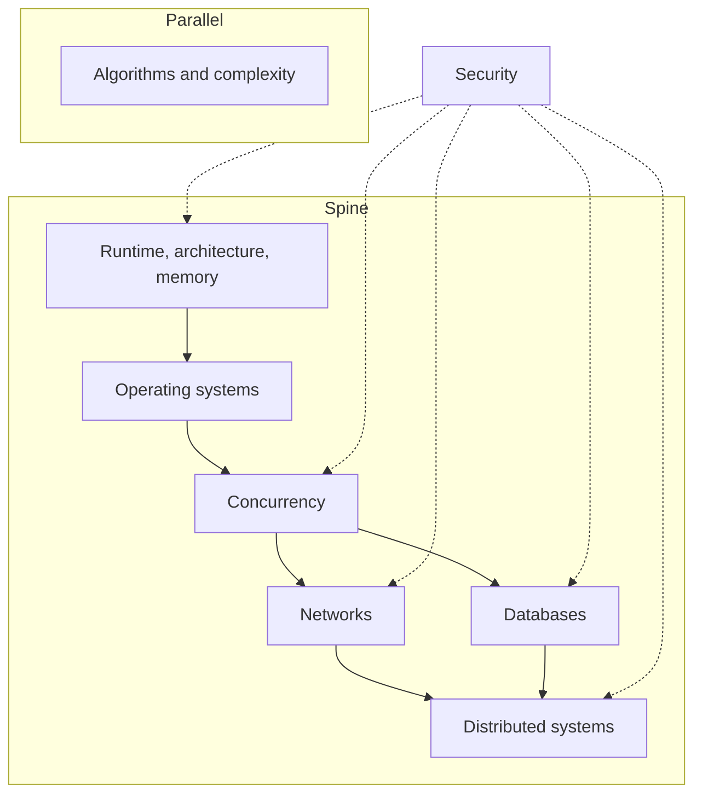

Production software is not a stack of libraries. Under the React tree, the Hono handler, and the Postgres query is a smaller set of models: how a program sits in memory, how the operating system schedules work, how more than one thing happens at once, how data moves across a network, how a database tells the truth, and how those truths diverge when there is more than one machine.

 

- This note maps those models as they show up in production TypeScript systems — browsers, Node, HTTP, Postgres. It is not a course catalog.
- Each node is a working definition, a place it shows up in production, and a failure mode worth defending.
- Algorithms sit beside the spine. Security cuts across it.

 

 

Walk the arrows. Do not start with distributed systems until a process can be named.

 

---

## Runtime, architecture, memory

A program is not the source file. It is instructions and data occupying a CPU, caches, and RAM.

 

- The **runtime** decides how that occupancy looks: a JavaScript engine (V8 in Chrome and Node) compiles functions, allocates on a **heap**, and records in-flight calls on a **stack**.
- Architecture is why **locality** matters — a cache line missed is a stall felt as jank — and why the main thread is a scarce machine, not an infinite loop.
- This shows up every time a component closes over a large array, a module-level cache holds parsed JSON forever, or a React list forces layout after writing styles. The engine will not drop what still has a live reference. Stack overflows from unbounded recursion are the same model: each call is a frame, and frames are finite.
- **Failure:** a closure or singleton cache that grows with every request or navigation. Memory does not leak because JavaScript is “garbage collected.” It leaks because a **reference remains**. The process hits a limit, the tab dies, and the heap snapshot shows an unbounded map.
- The runtime model is [Core JavaScript Concepts](/notes/core-javascript-concepts). What the host does while the stack is empty is [The JavaScript Event Loop in Depth](/notes/javascript-event-loop-in-depth). Why main-thread work becomes pixels is [The Critical Rendering Path in the Browser](/notes/critical-rendering-path-in-the-browser).

 

---

## Operating systems

The OS is the fiction that many programs share one machine.

 

- A **process** is an address space and a set of resources. A **thread** is a scheduled execution inside that space. **Virtual memory** makes each process believe it owns RAM. **I/O** is a request to the kernel, not a JavaScript promise — the promise is how the runtime hears back.
- Node’s JavaScript runs on **one thread**. Timers, DNS, and most filesystem work happen in the host, then a callback is queued. `worker_threads` and child processes are how additional JS threads or additional processes are obtained.
- A browser is several processes (site isolation) coordinating over IPC. None of that is “JavaScript is multi-threaded.” It is the OS offering isolation and scheduling, and the runtime choosing a thin slice of it.
- **Failure:** treating a Node process like a thread pool. A CPU-heavy `JSON.parse` of a large payload, a tight loop, or a synchronous `fs.readFileSync` in a request handler stops every other request on that process. The OS is still scheduling. The JS thread is not.
- The host side of this contract is [The JavaScript Event Loop in Depth](/notes/javascript-event-loop-in-depth).

 

---

## Concurrency

**Concurrency** is overlapping work. **Parallelism** is overlapping work on more than one core.

 

- JavaScript offers concurrency cheaply (`async`/`await`, queues, the event loop) and parallelism only when paid for (workers, multiple processes). Two `await`s interleave. They do not take a lock.
- React’s “concurrent” rendering is cooperative scheduling on one thread, not OS threads racing through shared state.
- This shows up when coalescing identical `fetch` calls, when a Hono handler awaits Drizzle and must not assume in-memory counters are safe across requests, and when a UI shows stale data because two updates landed out of order. The useful tools are queues, single-flight maps, and “this value is owned by one task.” Shared mutable memory is the expensive tool.
- **Failure:** reading-modify-writing a module-level object across `await` points and calling it safe because “Node is single-threaded.” Single-threaded means one **stack** at a time, not one **request** at a time. The second request runs in the gap. The counter, the cache, or the in-flight map is now wrong.
- The interleaving is [The JavaScript Event Loop in Depth](/notes/javascript-event-loop-in-depth).

 

---

## Networks

A network is a **lossy queue with variable delay**.

 

- **TCP** tries to deliver bytes in order. **TLS** authenticates the other end and encrypts the pipe. **HTTP** is a request/response convention on top. A timeout is not a negative acknowledgment. CORS is a browser policy, not a server access-control system. Cookies are a transport for credentials the server must still verify.
- This shows up in `fetch` with no timeout, in API Gateway sitting in front of Hono, in a CDN that caches a JSON response meant to be private, and in a cookie `Domain` that is one notch too wide. Latency is not an average. It is a tail. The rendering path waits on the critical bytes; everything else can wait.
- **Failure:** a client times out, retries a `POST`, and the timeout is treated as “the server never saw it.” The server may have committed. There are now two orders, two side effects, or two rows. The network did not fail uniquely. The assumption about what a missing response means failed.
- How bytes become a first paint is [The Critical Rendering Path in the Browser](/notes/critical-rendering-path-in-the-browser). The API and edge shape deployed in this stack is [Backend APIs with Hono, Drizzle, Zod OpenAPI, and SST](/notes/backend-apis-hono-sst). Cookie lifetime and `HttpOnly` belong with [Local Storage, Session Storage, and Cookies](/notes/browser-storage-localstorage-sessionstorage-cookies).

 

---

## Databases

A database is not a bucket of rows. It is a set of **constraints**, **indexes**, and **transactions** that decide which statements can be true at the same time.

 

- An index is a data structure that makes a lookup cheap and a write a little more expensive. Isolation is the contract between concurrent transactions — what one transaction is allowed to see of someone else’s in-flight work. The schema is the API. Application `WHERE` clauses are a habit, not a guarantee.
- This stack uses Postgres, Drizzle, and row-level security. Tenant isolation that lives only in Hono is one forgotten filter away from a leak. A query that is instant on a laptop is sequential scan in production. A read-modify-write without a transaction or a constraint is a lost update waiting for traffic.
- **Failure:** two requests read the same row, both increment, both write. Each transaction looks correct. The counter skipped a number. Isolation did not fail mysteriously. The pattern is check-then-act, and the database was never told to make it atomic.
- The isolation path is [Building a Multi-Tenant Backend with Hono, Better Auth, Drizzle, and Postgres RLS](/notes/multi-tenant-backend-drizzle-hono-better-auth). The statement model is [Core SQL Concepts](/notes/core-sql-concepts).

 

---

## Distributed systems

Once there is more than one machine, failure is the common case.

 

- Networks partition. Processes restart. Lambda can invoke the same handler twice. Clocks disagree. **Consistency** is a choice about what readers are allowed to believe. **Idempotency** is how a retry stops being a duplicate. The interesting bugs are not “the server is down.” They are “the server is up, and it is unknown whether the last request committed.”
- This shows up in SST stages and Lambda, in agent workflows that must survive a replay, and in RAG pipelines where ingest and retrieval share an index that must not cross tenants. A durable run, a namespace, and an idempotency key are the same idea: name the work so doing it twice is safe.
- **Failure:** a retry without an idempotency key. The first invocation wrote the row, timed out on the way back, and the second invocation wrote it again. The system is “highly available.” It is also duplicated. Availability without a write identity is just at-least-once delivery with extra steps.
- Stages and the deploy loop are [Using SST to Manage AWS Infrastructure and DevOps](/notes/using-sst-for-aws-infra-and-devops). The tenant-scoped index is [How to build a RAG system](/notes/how-to-build-a-rag-system). What an agent is allowed to remember, and where, is [Four levels of agent memory](/notes/four-levels-of-agent-memory).

 

---

## Data structures, algorithms, complexity

Algorithms are not a list of problem names. They are a small set of **patterns** for moving through data.

 

- A hash map for “has this been seen?”, two pointers on a sorted array, a heap for “top K,” a graph walk for connectivity. **Complexity** is the cost model — time and memory as the input grows — so nested loops can be distinguished from a linear scan before shipping. The input shape usually names the tool.
- This pattern applies when a list search is really a lookup, when a “simple” filter over every organization row should have been an index, and when a UI does O(n²) work per keystroke. The same map that solves Two Sum is the map that de-duplicates in-flight requests. Big-O does not dictate micro-optimizing twenty items. It marks which work will fall over at twenty thousand.
- **Failure:** nested loops over data that could have been keyed, while the actual bottleneck is a network round trip that was never measured. The CPU story gets optimized and the I/O story is missed. Complexity is a decision tool, not a sport.
- The patterns implemented in this stack are [Common Algorithms](/notes/common-algorithms).

 

---

## Security

Security is a **trust boundary** question: what this machine is allowed to believe about a message from that machine.

 

- **Authentication** answers who. **Authorization** answers what they may do. Nothing the client sends is a source of truth — not an `organizationId` in JSON, not a role in an unverified JWT, not a hidden form field. The browser is an untrusted host. So is a React Native bundle.
- This applies on every node above. Memory caches that include other tenants’ data, handlers that trust a header, cookies without `HttpOnly`, RLS that is missing on one table, a model that can search the wrong namespace — those are the same class of bug. The exploit is whatever the boundary failed to check.
- **Failure:** the client declares which organization it belongs to, and the API believes it. The query returns another tenant’s rows. Encryption in transit did not help. A user is authenticated and then allowed to pick their authorization.
- The class of failures is [Web Security and the OWASP Top 10](/notes/web-security-owasp-top-10). The two hosts in this stack are [Frontend Security in Next.js and React Native](/notes/frontend-security-nextjs-react-native). Tenant isolation as a database constraint is the multi-tenant note above.

 

---

## Walking the graph

The map is read in dependency order, not as a calendar.

 

- Runtime and memory before the OS, because a process is how the machine holds a program. OS before concurrency, because threads and I/O are what “at the same time” is built from.
- Concurrency before networks and databases, because both are concurrent systems with their own failure modes. Networks and databases before distributed systems, because distribution is those failures plus machines that do not share memory.
- Algorithms run in parallel whenever the problem is a data shape. Security is not a later chapter. It is a question on every node: what does this layer believe, and who taught it that?
- The map is useful when a production bug names its node. A hung tab is often the runtime. A stuck event loop is the OS contract. A wrong counter is concurrency. A duplicate charge is the network or the distributed retry. A slow list is algorithms or a missing index. A leak across tenants is security, and it is also the database.
- Knowing which model is in play is the work. The libraries change. The models do not.

---

## Recap Q&A

<Accordion type="single" collapsible>
  <AccordionItem value="cs-runtime">
    <AccordionTrigger>1. What is a runtime, and why does memory still leak under garbage collection?</AccordionTrigger>
    <AccordionContent>

      - A program is instructions and data occupying a CPU, caches, and RAM. The **runtime** decides how that occupancy looks: a JavaScript engine allocates on a **heap** and records in-flight calls on a **stack**.
      - Architecture is why locality matters and why the main thread is a scarce machine. The engine will not drop what still has a live reference. Unbounded recursion is the same model: frames are finite.
      - **Failure:** a closure or singleton cache that grows with every request. Memory does not leak because JavaScript is “garbage collected.” It leaks because a **reference remains**.
      - Walk the arrows. Do not start with distributed systems until a process can be named.

    </AccordionContent>
  </AccordionItem>

  <AccordionItem value="cs-os">
    <AccordionTrigger>2. What does the OS actually offer a Node or browser process?</AccordionTrigger>
    <AccordionContent>

      - A **process** is an address space. A **thread** is a scheduled execution inside it. **Virtual memory** makes each process believe it owns RAM. **I/O** is a request to the kernel; the promise is how the runtime hears back.
      - Node’s JavaScript runs on **one thread**. Timers, DNS, and most filesystem work happen in the host. `worker_threads` and child processes are how additional JS threads or processes are obtained.
      - A browser is several processes coordinating over IPC. None of that is “JavaScript is multi-threaded.”
      - **Failure:** treating a Node process like a thread pool. A CPU-heavy `JSON.parse`, a tight loop, or `fs.readFileSync` in a handler stops every other request on that process. The OS is still scheduling. The JS thread is not.

    </AccordionContent>
  </AccordionItem>

  <AccordionItem value="cs-concurrency">
    <AccordionTrigger>3. How is concurrency different from parallelism in this stack?</AccordionTrigger>
    <AccordionContent>

      - **Concurrency** is overlapping work. **Parallelism** is overlapping work on more than one core.
      - JavaScript offers concurrency cheaply (`async`/`await`, queues, the event loop) and parallelism only when paid for (workers, multiple processes). Two `await`s interleave. They do not take a lock.
      - React’s “concurrent” rendering is cooperative scheduling on one thread, not OS threads racing through shared state.
      - **Failure:** read-modify-write a module-level object across `await` points and call it safe because “Node is single-threaded.” Single-threaded means one **stack** at a time, not one **request** at a time. The second request runs in the gap.

    </AccordionContent>
  </AccordionItem>

  <AccordionItem value="cs-networks">
    <AccordionTrigger>4. What is a network, and what does a timeout not mean?</AccordionTrigger>
    <AccordionContent>

      - A network is a **lossy queue with variable delay**. TCP tries to deliver bytes in order. TLS authenticates and encrypts. HTTP is a request/response convention on top.
      - A timeout is **not** a negative acknowledgment. CORS is a browser policy, not a server access-control system. Cookies are a transport for credentials the server must still verify. Latency is a tail, not an average.
      - **Failure:** a client times out, retries a `POST`, and treats the timeout as “the server never saw it.” The server may have committed. There are now two orders. The assumption about what a missing response means failed.

    </AccordionContent>
  </AccordionItem>

  <AccordionItem value="cs-db-dist">
    <AccordionTrigger>5. What do databases and distributed systems force you to name?</AccordionTrigger>
    <AccordionContent>

      - A database is **constraints**, **indexes**, and **transactions**. The schema is the API. Application `WHERE` clauses are a habit. Isolation is the contract between concurrent transactions.
      - **Failure:** two requests read, both increment, both write — check-then-act, never told to be atomic.
      - Once there is more than one machine, failure is the common case. **Consistency** is what readers may believe. **Idempotency** is how a retry stops being a duplicate.
      - The interesting bug is “the server is up, and it is unknown whether the last request committed.” A durable run, a namespace, and an idempotency key are the same idea: name the work so doing it twice is safe.
      - Security cuts across every node: nothing the client sends is a source of truth.

    </AccordionContent>
  </AccordionItem>
</Accordion>
