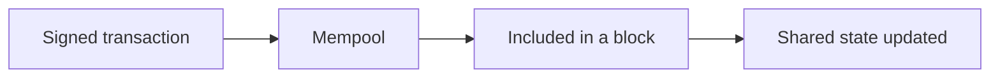
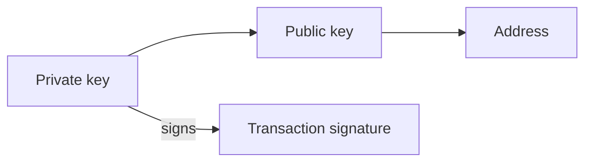
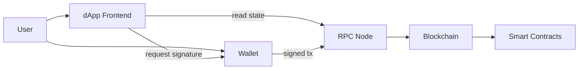
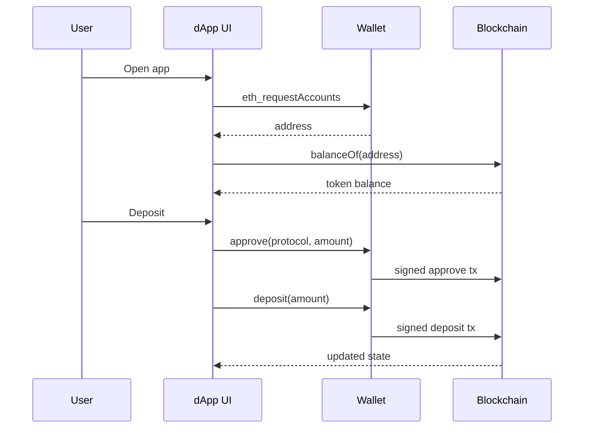

Most on-chain applications are built from the same handful of pieces: **wallets**, **smart contracts**, **tokens**, and **dApps**. Understanding how they connect — and what trust model each piece creates — is enough to read most Web3 architectures without drowning in cryptography.

<br />

This note uses an Ethereum / EVM framing because the ERC token standards live there. The same ideas transfer to other chains, even when the names change.

<br />

---

## Blockchain Fundamentals

A blockchain is a shared ledger that many independent nodes agree on. Once a transaction is confirmed, rewriting history is expensive by design. That shared state is what lets strangers transfer assets without a central bank in the middle.

<br />

The pieces that matter for application work:

- **Accounts** — identities on the chain. Externally owned accounts (EOAs) are controlled by private keys. Contract accounts are controlled by code.
- **Transactions** — signed messages that propose a state change: send value, call a contract, deploy code.
- **Consensus** — the network’s way of agreeing which transactions are valid and in what order.
- **Gas** — the fee paid to execute work on-chain. Every write costs something; reads through an RPC node usually do not.

<br />



<br />

I treat the chain as a **programmable settlement layer**: slow and expensive compared with a normal database, but useful when ownership and rules must be publicly verifiable.

<br />

---

## Wallets

A wallet is software (or hardware) that holds cryptographic keys and helps you sign transactions. It is not a bank account. The chain stores balances; the wallet stores the proof that you control an address.

<br />



<br />

The core ideas:

- A **private key** proves control. Anyone who has it can move assets from that address.
- A **public key / address** is what others use to send you assets or identify you on-chain.
- **Signing** means authorizing a specific transaction without broadcasting the private key itself.
- **Custody** is who holds the keys. Self-custody means you hold them. Custodial wallets mean a service holds them on your behalf.

<br />

Browser extensions and mobile wallets are mainly UX around keys: connect to a site, review a transaction, approve or reject. Hardware wallets keep the private key offline and only expose signatures.

<br />

When a dApp says “connect wallet,” it is asking for an address and a signing channel — not for your password to a company database:

<br />

```ts
// EIP-1193 provider injected by an extension wallet (e.g. window.ethereum)
const accounts = (await window.ethereum.request({
  method: "eth_requestAccounts",
})) as string[]

const address = accounts[0]
// address is public; the private key never leaves the wallet
```

<br />

That distinction shows up in every security review: phishing sites ask you to sign the wrong thing, not to “log in” in the Web2 sense.

<br />

---

## Smart Contracts

A smart contract is a program deployed on the blockchain. On Ethereum it is usually written in Solidity and runs on the EVM. Once deployed, its code and storage live at a contract address.

<br />

What makes contracts different from a normal backend:

- **Public state** — anyone can read balances, ownership, and often the bytecode.
- **Deterministic execution** — the same inputs and state produce the same result across honest nodes.
- **Permissionless calling** — anyone who pays gas can call a public function, subject to the contract’s own access checks.
- **Hard to change** — upgrades need an explicit pattern (proxy, governance, migration). There is no silent hotfix on immutable code.

<br />

A minimal shape looks like this:

<br />

```solidity
// SPDX-License-Identifier: MIT
pragma solidity ^0.8.24;

contract Escrow {
    address public payer;
    address public payee;
    bool public released;

    constructor(address _payee) payable {
        payer = msg.sender;
        payee = _payee;
    }

    function release() external {
        require(msg.sender == payer, "only payer");
        require(!released, "already released");
        released = true;
        payable(payee).transfer(address(this).balance);
    }
}
```

<br />

Contracts encode rules: who can call what, under which conditions, and what state changes. Bugs are expensive because funds and ownership often sit inside the contract itself.

<br />

I think of a smart contract as an **open, fee-metered API whose database is the chain**. The UI can lie; the contract’s state is what actually settles.

<br />

---

## Tokens

Tokens are assets represented by smart contracts that follow shared interfaces. Wallets, explorers, and dApps can support them without custom code for every project — that is why ERC standards matter.

<br />

### ERC-20 — fungible tokens

**ERC-20** is the standard for fungible tokens: every unit is interchangeable, like currency or points.

<br />

```solidity
interface IERC20 {
    function balanceOf(address account) external view returns (uint256);
    function transfer(address to, uint256 amount) external returns (bool);
    function approve(address spender, uint256 amount) external returns (bool);
    function transferFrom(address from, address to, uint256 amount) external returns (bool);
}
```

<br />

`approve` + `transferFrom` is how a protocol spends tokens on your behalf: you authorize a spender, then that contract pulls the amount.

<br />

Stablecoins, governance tokens, and in-game currencies are usually ERC-20. The important mental model is **balances**, not unique items.

<br />

### ERC-721 — non-fungible tokens (NFTs)

**ERC-721** is the standard for unique tokens. Each `tokenId` is its own asset with a single owner.

<br />

```solidity
interface IERC721 {
    function ownerOf(uint256 tokenId) external view returns (address);
    function safeTransferFrom(address from, address to, uint256 tokenId) external;
    function tokenURI(uint256 tokenId) external view returns (string memory);
}
```

<br />

Collectibles, tickets, and on-chain deeds are common ERC-721 uses. Two tokens from the same contract are **not** interchangeable if their IDs differ.

<br />

### ERC-1155 — multi-token standard

**ERC-1155** lets one contract manage many token types — fungible, non-fungible, or both — with batch transfers.

<br />

```solidity
interface IERC1155 {
    function balanceOf(address account, uint256 id) external view returns (uint256);
    function safeBatchTransferFrom(
        address from,
        address to,
        uint256[] calldata ids,
        uint256[] calldata amounts,
        bytes calldata data
    ) external;
}
```

<br />

Games and marketplaces often prefer ERC-1155 when a single collection mixes gold coins (fungible) with unique swords (supply of one) and limited skins (supply of N). Fewer deployments, cheaper batch operations.

<br />

### Comparison

| Standard | Fungibility | Identity model | Common uses |
| --- | --- | --- | --- |
| ERC-20 | Fungible | Amount per address | Currencies, points, governance |
| ERC-721 | Non-fungible | One owner per `tokenId` | Collectibles, tickets, unique rights |
| ERC-1155 | Mixed | Balance per address per `id` | Games, multi-asset collections |

<br />

All three are still just smart contracts. The ERC number is a shared interface so tooling can treat them consistently.

<br />

---

## Decentralized Applications (dApps)

A **dApp** is an application whose critical logic or ownership lives on-chain. The familiar shape is:

<br />

1. A **frontend** (often a normal web app) for UX
2. A **wallet** for identity and transaction signing
3. **Smart contracts** as the source of truth for assets and rules
4. An **RPC provider** so the frontend can read chain state and broadcast signed transactions

<br />



<br />

Reads can be free and frequent. Writes require a signature and gas. With a typed client, a read often looks like this:

<br />

```ts
import { createPublicClient, http, parseAbi } from "viem"
import { mainnet } from "viem/chains"

const client = createPublicClient({
  chain: mainnet,
  transport: http(),
})

const erc20Abi = parseAbi([
  "function balanceOf(address owner) view returns (uint256)",
])

const balance = await client.readContract({
  address: "0xA0b86991c6218b36c1d19D4a2e9Eb0cE3606eB48", // USDC
  abi: erc20Abi,
  functionName: "balanceOf",
  args: ["0xYourAddress"],
})
```

<br />

Many dApps still use centralized pieces — indexers, APIs, IPFS gateways, admin keys. “Decentralized” is a spectrum. What I look for is which parts can fail or censor without taking away the user’s assets.

<br />

---

## How They Fit Together

A concrete flow many products share:

<br />



<br />

1. User opens the dApp and **connects a wallet**. The app learns their address.
2. The UI **reads** balances and ownership through an RPC (`balanceOf`, `ownerOf`, etc.).
3. User wants to deposit an ERC-20 into a protocol. They first **approve** the contract as a spender, then call the deposit function — two signatures, two transactions (unless batched by a higher-level pattern).
4. The **smart contract** updates on-chain state.
5. The UI refreshes from the chain (or an indexer) and shows the new balances.

<br />

In TypeScript with a wallet client, the write side is roughly:

<br />

```ts
import { parseAbi, parseUnits } from "viem"

const erc20Abi = parseAbi([
  "function approve(address spender, uint256 amount) returns (bool)",
])

const protocol = "0xProtocolAddress"
const amount = parseUnits("100", 6) // 100 USDC (6 decimals)

// 1) User signs: allow the protocol to pull tokens
await walletClient.writeContract({
  address: "0xA0b86991c6218b36c1d19D4a2e9Eb0cE3606eB48",
  abi: erc20Abi,
  functionName: "approve",
  args: [protocol, amount],
})

// 2) User signs: protocol pulls and records the deposit
await walletClient.writeContract({
  address: protocol,
  abi: parseAbi(["function deposit(uint256 amount)"]),
  functionName: "deposit",
  args: [amount],
})
```

<br />

Swap that ERC-20 for an ERC-721 mint, or an ERC-1155 batch claim, and the wallet / contract / RPC shape stays the same. Only the token interface and the contract’s business rules change.

<br />

---

## Takeaways

The useful mental model is compact:

- A **wallet holds keys**, not the ledger itself — custody is about who can sign.
- A **smart contract** is public, fee-metered logic whose state settles ownership.
- **ERC-20**, **ERC-721**, and **ERC-1155** differ mainly in fungibility and how identity is modeled.
- A **dApp** combines frontend, wallet signatures, RPC, and contracts — the chain, not the UI, is the source of truth for assets.

<br />

Everything else — L2s, account abstraction, indexers, bridges — builds on this base.
