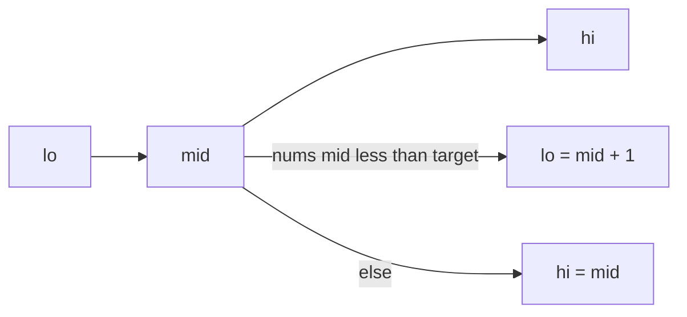
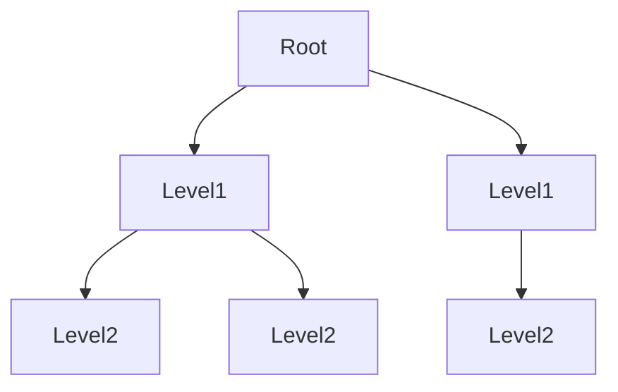

A small set of algorithm patterns shows up again and again: searching, traversing graphs, shrinking windows, caching, and trading memory for time. Recognizing the pattern matters more than memorizing problem names.

<br />

This note collects the patterns I reach for most often, each with a precise TypeScript implementation and a complexity note. The goal is a working mental map — when you see an input shape, you already know which tool fits.

<br />

---

## Pattern Map

| Pattern | Typical input | Reach for it when |
| --- | --- | --- |
| Hash map | Unsorted array / set | Need O(1) lookups or frequency counts |
| Two pointers | Sorted array, or pair from ends | Linear scan can replace nested loops |
| Sliding window | Array / string contiguous segment | Subarray or substring constraints |
| Binary search | Sorted array, or monotonic answer | Search space can be halved each step |
| Stack | Nested / matching structure | Latest-open / next-greater problems |
| Linked list | Pointer-based sequence | Reverse, cycle, constant-space walks |
| Tree DFS / BFS | Binary / n-ary tree | Depth vs level-order questions |
| Graph search | Grid or adjacency list | Connectivity, paths, components |
| Topological sort | Directed acyclic graph | Ordering with prerequisites |
| Heap | Stream or “top K” | Prefer extremes without full sort |
| Union-Find | Undirected connectivity | Merge components, detect cycles |
| Backtracking | Combinatorial search | Build all valid candidates |
| Dynamic programming | Overlapping subproblems | Optimal count / path with reuse |
| LRU | Cache with capacity | O(1) get/put with eviction |

<br />

---

## Hash Map — Two Sum

A hash map turns an expensive scan into constant-time lookups. Use it when you would otherwise nest loops to find a complement, count frequencies, or remember “have I seen this?”

<br />

```ts
function twoSum(nums: number[], target: number): [number, number] {
  const seen = new Map<number, number>() // value -> index

  for (let i = 0; i < nums.length; i++) {
    const need = target - nums[i]
    const j = seen.get(need)
    if (j !== undefined) return [j, i]
    seen.set(nums[i], i)
  }

  throw new Error("no pair sums to target")
}

twoSum([2, 7, 11, 15], 9) // [0, 1]
```

<br />

**Complexity:** O(n) time, O(n) space.

<br />

Variant: the same idea powers anagram checks (`Map` of character counts) and first-unique-character problems.

<br />

---

## Two Pointers — Pair With Target (Sorted)

When an array is sorted, two indices can move inward (or both forward) instead of searching with a nested loop. Move the pointer that reduces the error relative to the target.

<br />

```ts
function twoSumSorted(nums: number[], target: number): [number, number] {
  let left = 0
  let right = nums.length - 1

  while (left < right) {
    const sum = nums[left] + nums[right]
    if (sum === target) return [left, right]
    if (sum < target) left++
    else right--
  }

  throw new Error("no pair sums to target")
}

twoSumSorted([1, 2, 3, 4, 6], 6) // [1, 3] -> 2 + 4
```

<br />

**Complexity:** O(n) time, O(1) extra space (assuming the array is already sorted).

<br />

---

## Sliding Window — Longest Substring Without Repeating Characters

A window is a contiguous segment `[left, right]` that you expand and shrink while maintaining an invariant (unique characters, sum ≤ K, at most K distinct values).

<br />

```ts
function lengthOfLongestSubstring(s: string): number {
  const lastIndex = new Map<string, number>()
  let left = 0
  let best = 0

  for (let right = 0; right < s.length; right++) {
    const ch = s[right]
    const prev = lastIndex.get(ch)
    if (prev !== undefined && prev >= left) {
      left = prev + 1
    }
    lastIndex.set(ch, right)
    best = Math.max(best, right - left + 1)
  }

  return best
}

lengthOfLongestSubstring("abcabcbb") // 3 ("abc")
```

<br />

**Complexity:** O(n) time, O(min(n, alphabet)) space.

<br />

---

## Binary Search — Lower Bound

Binary search repeatedly cuts a monotonic search space in half. The careful version returns the first index where `nums[i] >= target` (lower bound / insertion point).

<br />



<br />

```ts
function lowerBound(nums: number[], target: number): number {
  let lo = 0
  let hi = nums.length // exclusive upper bound

  while (lo < hi) {
    const mid = lo + Math.floor((hi - lo) / 2)
    if (nums[mid] < target) lo = mid + 1
    else hi = mid
  }

  return lo
}

lowerBound([1, 3, 3, 5, 7], 3) // 1
lowerBound([1, 3, 3, 5, 7], 4) // 3 (insert before 5)
```

<br />

**Complexity:** O(log n) time, O(1) space.

<br />

Variant: when the array itself is not sorted but the *answer* is monotonic (e.g. minimum capacity that works), binary search on the answer instead.

<br />

---

## Stack — Valid Parentheses

A stack stores “still open” work. Matching brackets, path simplification, and monotonic next-greater problems all push and pop in LIFO order.

<br />

```ts
function isValidParentheses(s: string): boolean {
  const pairs: Record<string, string> = {
    ")": "(",
    "]": "[",
    "}": "{",
  }
  const stack: string[] = []

  for (const ch of s) {
    if (ch === "(" || ch === "[" || ch === "{") {
      stack.push(ch)
      continue
    }

    const expected = pairs[ch]
    if (!expected || stack.pop() !== expected) return false
  }

  return stack.length === 0
}

isValidParentheses("()[]{}") // true
isValidParentheses("(]") // false
```

<br />

**Complexity:** O(n) time, O(n) space.

<br />

---

## Linked List — Reverse and Cycle Detection

Linked-list problems are usually about careful pointer rewiring. Two classics: reverse the list in place, and detect a cycle with Floyd’s tortoise and hare.

<br />

```ts
type ListNode = {
  val: number
  next: ListNode | null
}

function reverseList(head: ListNode | null): ListNode | null {
  let prev: ListNode | null = null
  let curr = head

  while (curr) {
    const next = curr.next
    curr.next = prev
    prev = curr
    curr = next
  }

  return prev
}

function hasCycle(head: ListNode | null): boolean {
  let slow = head
  let fast = head

  while (fast?.next) {
    slow = slow!.next
    fast = fast.next.next
    if (slow === fast) return true
  }

  return false
}
```

<br />

**Complexity:** reverse is O(n) time, O(1) space; cycle detection is O(n) time, O(1) space.

<br />

---

## Tree DFS and BFS — Depth and Level Order

Trees are graphs without cycles. **DFS** goes deep (recursion or an explicit stack). **BFS** walks level by level with a queue — the usual choice for shortest path in an unweighted tree.

<br />

```ts
type TreeNode = {
  val: number
  left: TreeNode | null
  right: TreeNode | null
}

function maxDepth(root: TreeNode | null): number {
  if (!root) return 0
  return 1 + Math.max(maxDepth(root.left), maxDepth(root.right))
}

function levelOrder(root: TreeNode | null): number[][] {
  if (!root) return []

  const result: number[][] = []
  const queue: TreeNode[] = [root]

  while (queue.length > 0) {
    const size = queue.length
    const level: number[] = []

    for (let i = 0; i < size; i++) {
      const node = queue.shift()!
      level.push(node.val)
      if (node.left) queue.push(node.left)
      if (node.right) queue.push(node.right)
    }

    result.push(level)
  }

  return result
}
```

<br />

**Complexity:** both O(n) time and O(n) space in the worst case (skewed tree or wide level).

<br />



<br />

BFS visits each level fully before the next; DFS follows one branch to a leaf before backtracking.

<br />

---

## Graph — Number of Islands

A grid is a graph: each cell is a node, and 4-directional neighbors are edges. Flood-fill with DFS or BFS counts connected components of land.

<br />

```ts
function numIslands(grid: string[][]): number {
  if (grid.length === 0) return 0

  const rows = grid.length
  const cols = grid[0].length
  let count = 0

  function sink(r: number, c: number): void {
    if (r < 0 || c < 0 || r >= rows || c >= cols) return
    if (grid[r][c] !== "1") return

    grid[r][c] = "0"
    sink(r + 1, c)
    sink(r - 1, c)
    sink(r, c + 1)
    sink(r, c - 1)
  }

  for (let r = 0; r < rows; r++) {
    for (let c = 0; c < cols; c++) {
      if (grid[r][c] === "1") {
        count++
        sink(r, c)
      }
    }
  }

  return count
}

numIslands([
  ["1", "1", "0", "0"],
  ["1", "0", "0", "1"],
  ["0", "0", "1", "1"],
]) // 3
```

<br />

**Complexity:** O(rows × cols) time and O(rows × cols) space for the recursion stack in the worst case.

<br />

---

## Topological Sort — Course Schedule

When tasks have prerequisites, model them as a directed graph and produce an order where every edge `u → v` means `u` comes before `v`. Kahn’s algorithm uses indegrees and a queue.

<br />

```ts
function canFinish(numCourses: number, prerequisites: number[][]): boolean {
  const graph: number[][] = Array.from({ length: numCourses }, () => [])
  const indegree = Array.from({ length: numCourses }, () => 0)

  for (const [course, pre] of prerequisites) {
    graph[pre].push(course)
    indegree[course]++
  }

  const queue: number[] = []
  for (let i = 0; i < numCourses; i++) {
    if (indegree[i] === 0) queue.push(i)
  }

  let taken = 0
  while (queue.length > 0) {
    const course = queue.shift()!
    taken++

    for (const next of graph[course]) {
      indegree[next]--
      if (indegree[next] === 0) queue.push(next)
    }
  }

  return taken === numCourses // false means a cycle exists
}

canFinish(2, [[1, 0]]) // true
canFinish(2, [
  [1, 0],
  [0, 1],
]) // false
```

<br />

**Complexity:** O(V + E) time, O(V + E) space.

<br />

---

## Heap — Top K Frequent Elements

A heap keeps the current extreme efficiently. For “top K,” a size-K min-heap of frequencies avoids sorting the whole map.

<br />

```ts
function topKFrequent(nums: number[], k: number): number[] {
  const freq = new Map<number, number>()
  for (const n of nums) freq.set(n, (freq.get(n) ?? 0) + 1)

  type Item = { value: number; count: number }
  const heap: Item[] = []

  const siftUp = (i: number) => {
    while (i > 0) {
      const parent = Math.floor((i - 1) / 2)
      if (heap[parent].count <= heap[i].count) break
      ;[heap[parent], heap[i]] = [heap[i], heap[parent]]
      i = parent
    }
  }

  const siftDown = (i: number) => {
    while (true) {
      let smallest = i
      const left = 2 * i + 1
      const right = 2 * i + 2
      if (left < heap.length && heap[left].count < heap[smallest].count) {
        smallest = left
      }
      if (right < heap.length && heap[right].count < heap[smallest].count) {
        smallest = right
      }
      if (smallest === i) break
      ;[heap[smallest], heap[i]] = [heap[i], heap[smallest]]
      i = smallest
    }
  }

  for (const [value, count] of freq) {
    heap.push({ value, count })
    siftUp(heap.length - 1)
    if (heap.length > k) {
      heap[0] = heap.pop()!
      siftDown(0)
    }
  }

  return heap.map((item) => item.value)
}

topKFrequent([1, 1, 1, 2, 2, 3], 2) // [1, 2] (order among ties may vary)
```

<br />

**Complexity:** O(n log k) time, O(n) space for the frequency map (heap holds at most k items).

<br />

---

## Union-Find — Connected Components

Union-Find (Disjoint Set Union) maintains a partition of elements into components. `find` returns a representative; `union` merges two sets. Path compression + union by rank makes operations nearly O(1) amortized.

<br />

```ts
class UnionFind {
  private parent: number[]
  private rank: number[]
  components: number

  constructor(n: number) {
    this.parent = Array.from({ length: n }, (_, i) => i)
    this.rank = Array.from({ length: n }, () => 0)
    this.components = n
  }

  find(x: number): number {
    if (this.parent[x] !== x) {
      this.parent[x] = this.find(this.parent[x]) // path compression
    }
    return this.parent[x]
  }

  union(a: number, b: number): boolean {
    const ra = this.find(a)
    const rb = this.find(b)
    if (ra === rb) return false // already connected — edge is redundant

    if (this.rank[ra] < this.rank[rb]) this.parent[ra] = rb
    else if (this.rank[ra] > this.rank[rb]) this.parent[rb] = ra
    else {
      this.parent[rb] = ra
      this.rank[ra]++
    }

    this.components--
    return true
  }
}

function countComponents(n: number, edges: number[][]): number {
  const uf = new UnionFind(n)
  for (const [a, b] of edges) uf.union(a, b)
  return uf.components
}

countComponents(5, [
  [0, 1],
  [1, 2],
  [3, 4],
]) // 2
```

<br />

**Complexity:** effectively O(n + m α(n)) for n nodes and m edges — α is the inverse Ackermann function (tiny in practice).

<br />

---

## Backtracking — Subsets

Backtracking builds candidates incrementally and undoes the last choice (the “backtrack”) when exploring the next branch. Use it for subsets, permutations, combinations, and constraint search.

<br />

```ts
function subsets(nums: number[]): number[][] {
  const result: number[][] = []
  const path: number[] = []

  function dfs(start: number): void {
    result.push([...path])

    for (let i = start; i < nums.length; i++) {
      path.push(nums[i])
      dfs(i + 1)
      path.pop()
    }
  }

  dfs(0)
  return result
}

subsets([1, 2, 3])
// [[], [1], [1,2], [1,2,3], [1,3], [2], [2,3], [3]]
```

<br />

**Complexity:** O(n · 2ⁿ) time to generate and copy all subsets, O(n) extra space for the recursion path (excluding the output).

<br />

---

## Dynamic Programming — Climbing Stairs and Unique Paths

DP applies when a problem has **optimal substructure** and **overlapping subproblems**: solve smaller pieces once, reuse them. Start from the base cases and build up.

<br />

### 1D — climbing stairs

You can climb 1 or 2 steps. Ways to reach `n` = ways to reach `n - 1` + ways to reach `n - 2`.

<br />

```ts
function climbStairs(n: number): number {
  if (n <= 2) return n

  let prev2 = 1
  let prev1 = 2

  for (let i = 3; i <= n; i++) {
    const curr = prev1 + prev2
    prev2 = prev1
    prev1 = curr
  }

  return prev1
}

climbStairs(5) // 8
```

<br />

**Complexity:** O(n) time, O(1) space.

<br />

### 2D — unique paths

On an `m × n` grid, you may only move right or down. Paths to `(r, c)` = paths from above + paths from the left.

<br />

```ts
function uniquePaths(m: number, n: number): number {
  const dp = Array.from({ length: m }, () => Array.from({ length: n }, () => 1))

  for (let r = 1; r < m; r++) {
    for (let c = 1; c < n; c++) {
      dp[r][c] = dp[r - 1][c] + dp[r][c - 1]
    }
  }

  return dp[m - 1][n - 1]
}

uniquePaths(3, 7) // 28
```

<br />

**Complexity:** O(m · n) time, O(m · n) space (compressible to O(n) with a rolling row).

<br />

---

## LRU Cache

An LRU cache returns values in O(1) and evicts the least recently used key when full. In modern JavaScript, `Map` preserves insertion order, so moving a key to the end on each access implements LRU without a hand-rolled doubly linked list.

<br />

```ts
class LRUCache {
  private readonly capacity: number
  private readonly map = new Map<number, number>()

  constructor(capacity: number) {
    this.capacity = capacity
  }

  get(key: number): number {
    if (!this.map.has(key)) return -1
    const value = this.map.get(key)!
    this.map.delete(key)
    this.map.set(key, value) // move to most-recently used
    return value
  }

  put(key: number, value: number): void {
    if (this.map.has(key)) this.map.delete(key)
    this.map.set(key, value)

    if (this.map.size > this.capacity) {
      const oldest = this.map.keys().next().value as number
      this.map.delete(oldest)
    }
  }
}

const cache = new LRUCache(2)
cache.put(1, 1)
cache.put(2, 2)
cache.get(1) // 1
cache.put(3, 3) // evicts key 2
cache.get(2) // -1
```

<br />

**Complexity:** O(1) amortized get and put; O(capacity) space.

<br />

---

## Choosing a Pattern

A quick decision guide:

<br />

- **Need a fast lookup or frequency count?** Hash map.
- **Array is sorted, looking for a boundary or pair?** Binary search or two pointers.
- **Contiguous subarray / substring with a constraint?** Sliding window.
- **Matching or nested structure / next greater?** Stack.
- **Shortest path in an unweighted graph or level-order tree?** BFS.
- **Explore all paths, components, or hierarchies?** DFS.
- **Prerequisites / ordering on a DAG?** Topological sort.
- **Connectivity with many merges?** Union-Find.
- **Top K or running extreme?** Heap.
- **Overlapping subproblems with optimal reuse?** Dynamic programming.
- **Generate all candidates under constraints?** Backtracking.
- **Bounded cache with recency?** LRU.

<br />

If two patterns seem plausible, pick the one with the clearer invariant and state its time and space before coding.

<br />

---

## Takeaways

Master these patterns before chasing exotic algorithms. Most day-to-day problems are recombinations of hash maps, windows, binary search, graph traversal, heaps, and DP.

<br />

For every solution, be ready to state:

- the **pattern** you used
- **time** and **space** complexity
- what changes if the input is sorted, streaming, or too large for memory

<br />

Specialized tools (KMP, Bloom filters, consistent hashing) matter in narrower domains. The patterns above are the shared baseline.
