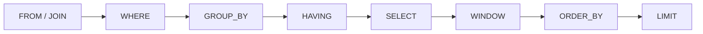

It is possible to ship Drizzle every day without a clear picture of what Postgres does with a statement. The ORM types the query. The database still evaluates a **relation**: rows in, rows out, in a fixed logical order.

These notes treat SQL as one pipeline. `FROM` and `JOIN` build a working row set. `WHERE` drops rows. `GROUP BY` and `HAVING` collapse and filter groups. `SELECT` names the output. Window functions compute across that output without collapsing it. `ORDER BY` and `LIMIT` are the last cut. Schema, RLS, and migrations are the wiring — [Backend APIs with Hono, Drizzle, Zod OpenAPI, and SST](/notes/backend-apis-hono-sst) and [Building a Multi-Tenant Backend with Hono, Better Auth, Drizzle, and Postgres RLS](/notes/multi-tenant-backend-drizzle-hono-better-auth). This note is the statement.

<br />

The examples share one shop: customers, orders, and line items. Constraints live in the `CREATE TABLE`. Indexes wait until cost.

<br />

```sql
CREATE TABLE customers (
  id         uuid PRIMARY KEY DEFAULT gen_random_uuid(),
  email      text NOT NULL UNIQUE,
  name       text NOT NULL,
  created_at timestamptz NOT NULL DEFAULT now()
);

CREATE TABLE orders (
  id          uuid PRIMARY KEY DEFAULT gen_random_uuid(),
  customer_id uuid NOT NULL REFERENCES customers (id),
  status      text NOT NULL,
  created_at  timestamptz NOT NULL DEFAULT now()
);

CREATE TABLE order_items (
  id         uuid PRIMARY KEY DEFAULT gen_random_uuid(),
  order_id   uuid NOT NULL REFERENCES orders (id),
  sku        text NOT NULL,
  qty        integer NOT NULL CHECK (qty > 0),
  unit_cents integer NOT NULL CHECK (unit_cents >= 0),
  UNIQUE (order_id, sku)
);
```

<br />

---

## Pattern Map

| Pattern | Typical input | Reach for it when |
| --- | --- | --- |
| Exists | Outer row, related table | Need “has at least one” / “has none” without duplicating the outer row |
| Keyset pagination | Ordered list | Next page after a known `(created_at, id)`, not `OFFSET` |
| Upsert | Insert that may collide | Unique key already exists — `ON CONFLICT` instead of check-then-insert |
| Top-N-per-group | Rows partitioned by a key | Latest order per customer, top SKUs per order — `ROW_NUMBER()` |

<br />

The patterns are the last stretch. The pipeline comes first.

<br />

---

## 1. Relation in, relation out

A table is a named relation: a bag of rows, each row a tuple of columns. A `SELECT` is not a procedure that visits a table. It is an expression that takes relations and returns a relation. The shape of the result — which columns, how many rows — is decided by the statement, not by a loop in application code.

<br />

A **key** is a constraint on which rows can exist, not a hint to the planner. `PRIMARY KEY` says this column identifies the row. `UNIQUE` on `customers.email` says two customers cannot share an email. `REFERENCES` says an order cannot name a customer that does not exist. Application `WHERE` clauses do not replace any of that.

<br />

**`NULL` is not a value.** It is the absence of one. `WHERE email = NULL` is never true; the predicate is `IS NULL`. Comparison with `NULL` yields unknown, and `WHERE` keeps only true. That is why `NOT IN (SELECT …)` becomes a trap when the subquery can return `NULL`, and why `NOT EXISTS` is the anti-join that still means what it says.

<br />

---

## 2. Logical evaluation order

Postgres does not run a statement left to right as written. It runs a **logical** pipeline. Physical execution — hash vs nested loop, index vs seq scan — is a later choice that must preserve this meaning.

<br />



<br />

`FROM` / `JOIN` produce the working row set. `WHERE` filters **rows**. `GROUP BY` collapses rows into groups; `HAVING` filters **groups**. `SELECT` names the output columns. Window functions then compute over that result without collapsing it further. `ORDER BY` sorts. `LIMIT` cuts. A `WITH` CTE is a named subquery plugged into `FROM`. It is not a different engine.

<br />

This order is why a `SELECT` alias is invisible to `WHERE`, and why a window function cannot appear in `WHERE` or `HAVING`. Those clauses have already run. Filter on a window with a subquery or a CTE — another `FROM`.

<br />

```sql
-- legal: filter rows before grouping
SELECT customer_id, count(*) AS order_count
FROM orders
WHERE status = 'shipped'
GROUP BY customer_id
HAVING count(*) >= 3;

-- illegal: alias and window are not in scope for WHERE
-- SELECT count(*) AS order_count FROM orders WHERE order_count > 0;
-- SELECT row_number() OVER (ORDER BY created_at) AS n FROM orders WHERE n = 1;
```

<br />

---

## 3. JOIN

A join is how `FROM` builds a wider row. **Inner** keeps matches. **Left** keeps every left row and fills the right side with `NULL` when there is no match. **Anti-join** keeps left rows that have **no** match — customers with no orders, orders with no items.

<br />

```sql
-- inner: orders that have a customer (all of them, given the FK)
SELECT c.email, o.id AS order_id, o.status
FROM orders o
JOIN customers c ON c.id = o.customer_id;

-- left: every customer, orders if they exist
SELECT c.email, o.id AS order_id
FROM customers c
LEFT JOIN orders o ON o.customer_id = c.id;
```

<br />

The left join duplicates a customer once per order. That is the cardinality trap: aggregating after a join without grouping will count the customer as many times as they have orders. When the question is “who has none?”, do not `LEFT JOIN … WHERE right.id IS NULL` as the first reflex. `NOT EXISTS` is the anti-join that does not duplicate, and it does not break on `NULL`.

<br />

```sql
SELECT c.email
FROM customers c
WHERE NOT EXISTS (
  SELECT 1
  FROM orders o
  WHERE o.customer_id = c.id
);
```

<br />

---

## 4. Aggregation

`GROUP BY` is the collapse. After `WHERE`, remaining rows are partitioned by the grouping keys. Each group becomes one output row. Ungrouped columns cannot appear in `SELECT` unless they are wrapped in an aggregate — Postgres will reject the statement rather than pick an arbitrary value.

<br />

`HAVING` is `WHERE` for groups. `WHERE` cannot see `count(*)`. `HAVING` can.

<br />

```sql
SELECT
  c.id,
  c.email,
  count(o.id) AS order_count,
  coalesce(sum(oi.qty * oi.unit_cents), 0) AS revenue_cents
FROM customers c
LEFT JOIN orders o ON o.customer_id = c.id
LEFT JOIN order_items oi ON oi.order_id = o.id
GROUP BY c.id, c.email
HAVING count(o.id) >= 1;
```

<br />

`count(o.id)` ignores `NULL`s from the left join, so customers with no orders are `0` and drop out of `HAVING`. `count(*)` would count the empty joined row as one. The aggregate you pick is a statement about which rows exist, not a synonym for “how many.”

<br />

---

## 5. Windows

A window function computes across related rows **without collapsing them**. `PARTITION BY` is the group. `ORDER BY` inside `OVER` is the order inside that group. The result is one value per input row, not one row per group.

<br />

That is the difference from `GROUP BY`. Aggregation answers “what is the sum for this customer?” Windows answer “what is this row’s rank among that customer’s orders?” and still return every order.

<br />

```sql
SELECT
  o.customer_id,
  o.id AS order_id,
  o.created_at,
  row_number() OVER (
    PARTITION BY o.customer_id
    ORDER BY o.created_at DESC, o.id DESC
  ) AS recency,
  sum(order_total.cents) OVER (
    PARTITION BY o.customer_id
    ORDER BY o.created_at, o.id
  ) AS running_cents
FROM orders o
JOIN (
  SELECT order_id, sum(qty * unit_cents) AS cents
  FROM order_items
  GROUP BY order_id
) order_total ON order_total.order_id = o.id;
```

<br />

`row_number()` is the essential window. Filter `recency = 1` in an outer query to get the latest order per customer. The running `sum()` shows the other half: a frame that grows with each order. The join is aggregated first so line items do not explode the window. Neither window belongs in `WHERE`.

<br />

---

## 6. Patterns

The map at the top is four shapes. Each is a short statement on the shop.

<br />

**Exists.** “Has at least one shipped order” is a semi-join. `JOIN` plus `DISTINCT` can answer it and also explode the row count. `EXISTS` stops at the first match and leaves the outer row intact.

<br />

```sql
SELECT c.email
FROM customers c
WHERE EXISTS (
  SELECT 1
  FROM orders o
  WHERE o.customer_id = c.id
    AND o.status = 'shipped'
);
```

<br />

**Keyset pagination.** `OFFSET n` still walks `n` rows. A keyset seek starts after the last row you already have. The sort key must be unique — `(created_at, id)` — or rows that share a timestamp will skip or repeat.

<br />

```sql
SELECT id, customer_id, created_at
FROM orders
WHERE (created_at, id) < (:cursor_created_at, :cursor_id)
ORDER BY created_at DESC, id DESC
LIMIT 20;
```

<br />

**Upsert.** Check-then-insert races. `ON CONFLICT` is one statement against a unique key the schema already declared — `customers.email`, or `(order_id, sku)`.

<br />

```sql
INSERT INTO customers (email, name)
VALUES ('ada@example.com', 'Ada')
ON CONFLICT (email) DO UPDATE
SET name = excluded.name
RETURNING id;
```

<br />

**Top-N-per-group.** `GROUP BY` cannot keep the non-grouped columns of the “top” row without a second pass. Number the rows, then keep `n <= 2`.

<br />

```sql
SELECT customer_id, order_id, created_at
FROM (
  SELECT
    o.customer_id,
    o.id AS order_id,
    o.created_at,
    row_number() OVER (
      PARTITION BY o.customer_id
      ORDER BY o.created_at DESC, o.id DESC
    ) AS n
  FROM orders o
) ranked
WHERE n <= 2;
```

<br />

---

## 7. Cost

An **index** is a data structure that makes a lookup cheap and a write a little more expensive. It is not a constraint. The unique index that enforces `customers.email` is both; a plain index on `orders.customer_id` is only an access path.

<br />

Without that path, `WHERE customer_id = $1` is a sequential scan: every row, every time. Instant on a laptop. Linear in production.

<br />

```sql
EXPLAIN SELECT id, status
FROM orders
WHERE customer_id = '11111111-1111-1111-1111-111111111111';

-- Seq Scan on orders
--   Filter: (customer_id = '11111111-…')
```

<br />

```sql
CREATE INDEX orders_customer_id_created_at_idx
  ON orders (customer_id, created_at DESC, id DESC);

EXPLAIN SELECT id, status
FROM orders
WHERE customer_id = '11111111-1111-1111-1111-111111111111';

-- Index Scan using orders_customer_id_created_at_idx on orders
--   Index Cond: (customer_id = '11111111-…')
```

<br />

The same index covers the keyset query: equality on `customer_id`, walk `created_at DESC, id DESC`. `EXPLAIN` is how you check that the statement you wrote is the access path you meant. `EXPLAIN (ANALYZE)` is how you check it against real row counts. Guessing from local data is how a seq scan ships.

<br />

---

## 8. Failure

Two requests read `qty`, both add one, both write. Each transaction looks correct. The row skipped a number. Isolation did not fail mysteriously. The pattern is check-then-act, and the database was never told to make it atomic — no `UPDATE order_items SET qty = qty + 1`, no `UNIQUE` to reject the duplicate insert.

<br />

```sql
-- lost update if two sessions do: read qty, add 1, write qty
UPDATE order_items
SET qty = qty + 1
WHERE id = :id;

-- missing unique: two inserts of the same email both succeed
-- UNIQUE (email) on customers is the constraint; ON CONFLICT is the statement
```

<br />

A forgotten unique constraint is a data bug that no amount of careful `WHERE` will fix after the fact. A read-modify-write without an atomic update or a constraint is a lost update waiting for traffic. The schema is the API. Application filters are a habit.

<br />

The isolation path in this stack — transactions, row-level security, tenant context — is [Building a Multi-Tenant Backend with Hono, Better Auth, Drizzle, and Postgres RLS](/notes/multi-tenant-backend-drizzle-hono-better-auth). The typed schema, the pool, and migrations as a deploy step are [Backend APIs with Hono, Drizzle, Zod OpenAPI, and SST](/notes/backend-apis-hono-sst).

<br />
