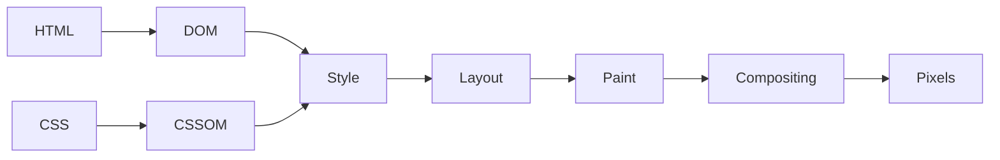
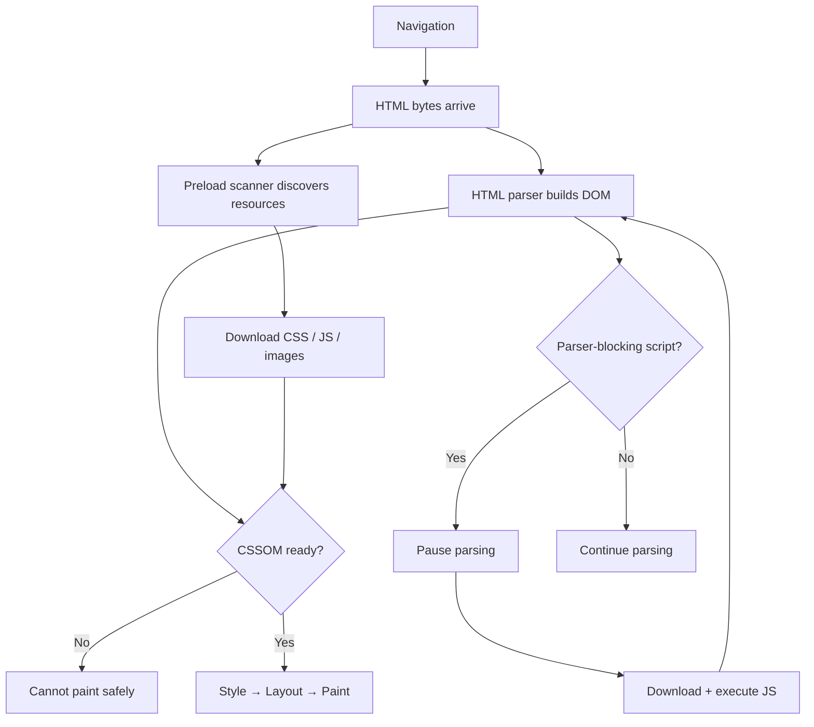
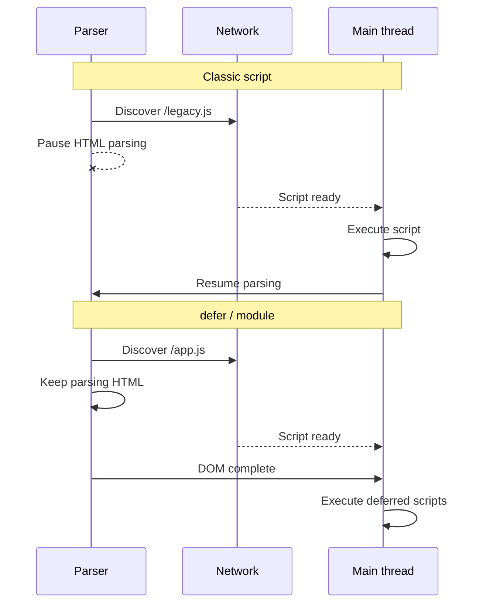
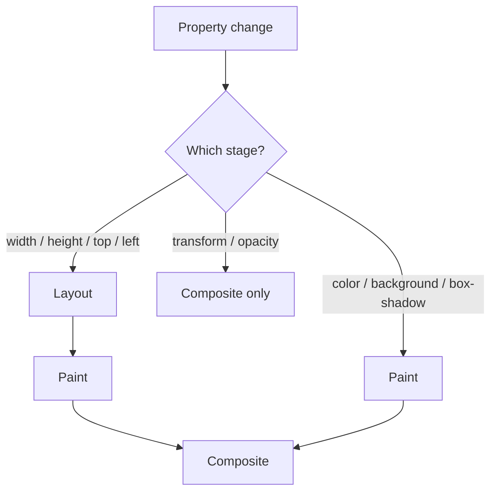
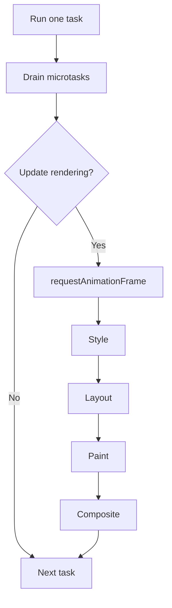
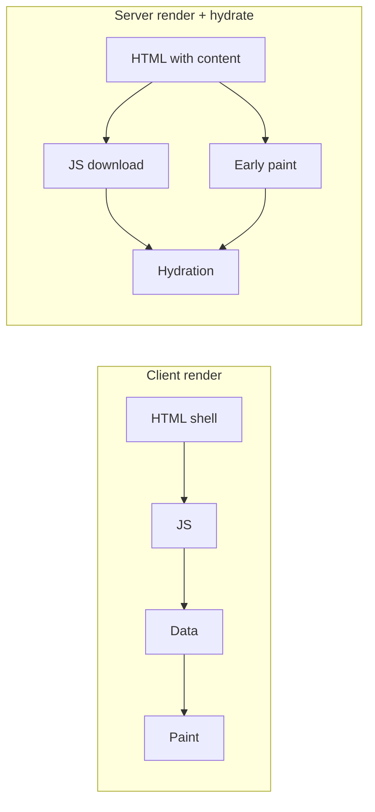
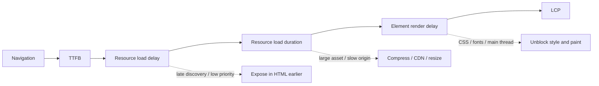

A browser does not wait for a complete page and render it once. It streams HTML, discovers resources, builds internal trees, runs JavaScript, calculates geometry, and paints incrementally.

The **critical rendering path** is the dependency chain between navigation and the pixels needed for the initial view. It crosses the network, HTML parser, CSS engine, JavaScript runtime, and rendering pipeline.

The useful performance question is not only "How large is the page?" It is: **Which resource or main-thread task is keeping the browser from producing the next important frame?**

<br />

---

## 1. The Rendering Pipeline

The simplified model is:

<br />



<br />

Real browsers pipeline and repeat these stages. The DOM can be built while HTML is still arriving, resources can download concurrently, and the browser can paint before the document is complete. JavaScript may later invalidate style, layout, or paint.

The critical path is therefore a **dependency graph**, not a fixed sequence. A late stylesheet delays rendering. A parser-blocking script delays markup and resource discovery. A large JavaScript task delays painting even when every resource is cached.

<br />



<br />

---

## 2. Network, HTML, and Resource Discovery

Rendering starts with the document request. DNS, connection setup, TLS, redirects, and server response time all happen before the browser can parse useful HTML. A slow **Time to First Byte** shifts every later stage.

Streaming HTML lets the browser process the response before the server finishes generating it. Critical CSS, fonts, images, and visible markup should therefore appear early in the response.

The HTML parser decodes bytes into tokens and builds the DOM incrementally. Browsers also use a **speculative preload scanner** to look ahead for declarative resources such as:

- `<link rel="stylesheet">`
- `<script src>`
- `` and `srcset`
- `<link rel="preload">`

This scanner can start requests while the main parser is blocked. It cannot reliably discover resources created by JavaScript, returned by a later API request, or referenced inside CSS that has not loaded.

That makes declarative HTML a performance feature. An `` is immediately visible to the browser. An image URL computed after JavaScript and data fetching becomes a late dependency.

<br />

---

## 3. CSS and JavaScript Blocking

CSS is parsed into the **CSSOM**. The browser needs applicable styles before it can determine which boxes exist and how they should look.

An external stylesheet in the document head is normally render-blocking:

<br />

```html
<link rel="stylesheet" href="/app.css" />
```

<br />

CSS usually does not stop DOM construction, but it prevents painting content that depends on incomplete styles. It can also delay a following script because JavaScript may inspect computed styles:

<br />

```html
<link rel="stylesheet" href="/app.css" />
<script>
  console.log(getComputedStyle(document.body).color)
</script>
```

<br />

The script waits for CSS, and the parser waits for the script. One stylesheet now affects both rendering and parsing.

CSS `@import` creates another waterfall because imported files are discovered only after the parent stylesheet is downloaded and parsed. Direct `<link>` elements expose requests earlier.

### Script loading

A classic script without attributes blocks the parser when encountered:

<br />

```html
<script src="/legacy.js"></script>
```

<br />

The alternatives have different semantics:

| Script | Execution | Ordering |
| --- | --- | --- |
| Classic | Blocks parser | Document order |
| `defer` | After parsing | Document order |
| `async` | As soon as ready | Load order |
| `type="module"` | Deferred by default | Module dependency order |

<br />



<br />

Application code should usually use a module or `defer`. Independent analytics may use `async`.

Deferring a script removes parser blocking, not its CPU cost. The browser still has to transfer, parse, compile, and execute it. Large startup tasks can delay rendering and interaction after the DOM is ready.

<br />

---

## 4. Style, Layout, Paint, and Compositing

### Style calculation

The browser combines the DOM with the CSSOM and resolves the cascade, inheritance, relative values, and matching rules. The result determines which boxes participate in rendering.

DOM nodes do not map one-to-one to boxes:

- `display: none` removes a subtree from layout.
- `visibility: hidden` preserves layout space.
- Pseudo-elements can create boxes without DOM nodes.
- Text can produce multiple line boxes.

Large DOMs and broad invalidation usually matter more than micro-optimizing ordinary selectors.

### Layout

Layout calculates box positions, dimensions, line breaks, and relationships. A width change can affect descendants, rewrap text, and move everything below a container.

Browsers batch this work until geometry is needed. Interleaving writes and reads can force repeated synchronous layouts:

<br />

```ts
for (const card of cards) {
  card.style.width = "50%"
  console.log(card.offsetWidth)
}
```

<br />

The write invalidates layout; `offsetWidth` demands current geometry. Batch reads before writes instead:

<br />

```ts
const widths = cards.map((card) => card.offsetWidth)

for (const [index, card] of cards.entries()) {
  card.style.width = `${widths[index] / 2}px`
}
```

<br />

APIs such as `getBoundingClientRect`, `offsetWidth`, and `getComputedStyle` are not inherently slow. They become expensive when they force the browser to flush pending style or layout work.

### Paint and compositing

Paint records drawing commands for text, backgrounds, borders, images, shadows, and effects. The browser rasterizes this work into tiles and may place content into composited layers.

<br />



<br />

Animations using `transform` and `opacity` can often run on the compositor without new layout or paint:

<br />

```css
.panel {
  transition:
    transform 180ms ease,
    opacity 180ms ease;
}
```

<br />

Animating `width`, `height`, `top`, or `left` commonly triggers layout and paint. Compositor work is still not free: layers use memory, require rasterization, and must be assembled every frame. Applying `will-change` everywhere can make performance worse.

<br />

---

## 5. The Main Thread and Rendering Opportunities

JavaScript and most rendering work share the main thread. A simplified event-loop turn is:

<br />



<br />

The browser does not paint after every task, but it needs the main thread to become available. Long JavaScript tasks delay input and frames. An unbounded microtask chain can also starve rendering because the browser drains microtasks before moving on.

Split CPU-heavy work into smaller tasks when the UI needs opportunities to respond. Use `requestAnimationFrame` to align visual writes with a frame, not as a place for expensive computation. Move suitable CPU work to a Web Worker when its communication cost is justified.

<br />

---

## 6. Optimizing the Initial View

The initial render usually needs visible HTML, applicable CSS, blocking scripts, main-thread rendering time, and any image or font required by the result. It does not need below-the-fold media, analytics, chat widgets, or most interaction code.

That dependency chain is optimized in this order:

1. Reduce redirects and TTFB; stream useful HTML early.
2. Make critical CSS, fonts, and the LCP image discoverable from HTML.
3. Remove parser-blocking scripts and CSS import chains.
4. Reduce critical CSS and JavaScript, not only total page size.
5. Keep third-party code outside the initial path.
6. Reduce style, layout, paint, and hydration work.

Use resource hints selectively:

<br />

```html
<link rel="preconnect" href="https://cdn.example.com" crossorigin />
<link
  rel="preload"
  href="/hero.avif"
  as="image"
  type="image/avif"
  fetchpriority="high"
/>
```

<br />

`preconnect` spends resources preparing a connection. `preload` competes for bandwidth and must match the final request's type and credentials mode. Overusing either can delay more important resources.

Give images dimensions so layout space exists before they load:

<br />

```html

```

<br />

Do not lazy-load the LCP image. Use `loading="lazy"` for offscreen media.

For fonts, serve WOFF2 subsets and allow fallback text to render:

<br />

```css
@font-face {
  font-family: "Inter";
  src: url("/fonts/inter-latin.woff2") format("woff2");
  font-display: swap;
  font-weight: 100 900;
}
```

<br />

On long pages, `content-visibility: auto` can skip offscreen rendering work. CSS containment and list virtualization can also reduce work, but both change behavior and should be introduced only after measurement.

<br />

---

## 7. Framework Rendering and Hydration

A client-rendered application often delays meaningful content until JavaScript, framework startup, and data fetching complete.

Server rendering moves content and resource references into the HTML, allowing earlier discovery and paint. It does not remove JavaScript cost. A page can paint quickly and then become unresponsive while a large hydration task runs.

<br />



<br />

Streaming SSR, selective hydration, islands, and Server Components all target the same problem: reduce startup work and keep non-critical JavaScript out of the initial dependency chain.

The relevant architecture questions are:

- Which content must be in the first HTML response?
- Which components need client-side JavaScript?
- When do code and data become discoverable?
- Can hydration happen in smaller boundaries?
- Is the framework creating server-to-client request waterfalls?

<br />

---

## 8. Measuring the Path

Use a production build and inspect both the Network waterfall and a Performance trace:

- **Network** reveals late discovery, priority, queueing, and transfer time.
- **Main** reveals parsing, script execution, style, layout, paint, and long tasks.
- **Frames** reveals missed rendering deadlines.
- **Experience** reveals layout shifts and Core Web Vitals.

For a slow **Largest Contentful Paint**, divide the time into:

1. **TTFB**
2. **Resource load delay**
3. **Resource load duration**
4. **Element render delay**

<br />



<br />

High load delay points to discovery or priority. High load duration points to asset size or origin speed. High render delay points to CSS, fonts, decoding, JavaScript, or main-thread contention.

The surrounding metrics explain different failures:

- **FCP**: when the first content appears.
- **LCP**: when the largest visible content appears.
- **CLS**: unexpected movement.
- **INP**: interaction latency until the next paint.

A page can have a fast LCP and poor INP if hydration or third-party scripts occupy the main thread afterward. Lab traces explain causes; real-user monitoring shows how often users encounter them.

<br />

---

## Final Mental Model

The critical rendering path consumes three limited resources:

- **Network time** to discover and transfer critical bytes.
- **Main-thread time** to parse, execute, style, and lay out.
- **Rendering capacity** to paint, rasterize, and composite frames.

Fast pages expose important resources early, avoid accidental blockers, minimize startup JavaScript, reserve layout space, and defer work outside the initial viewport.

The goal is not to make every resource load immediately. It is to create the shortest possible dependency chain between navigation and the pixels the user came to see.
