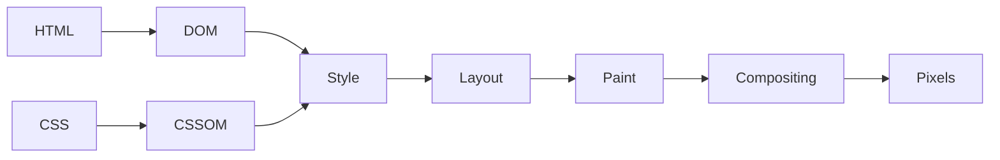
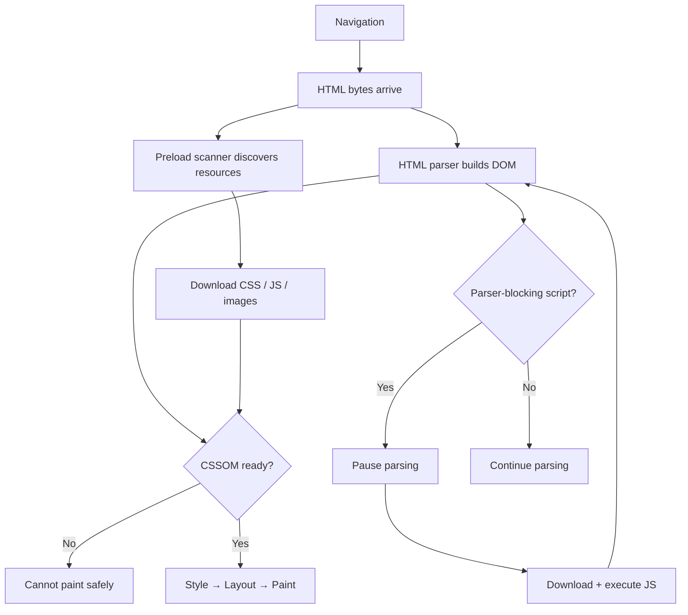
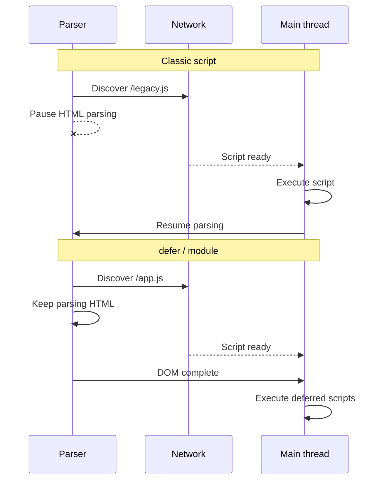
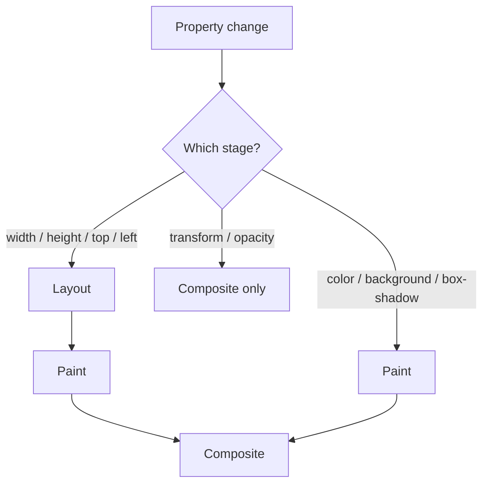
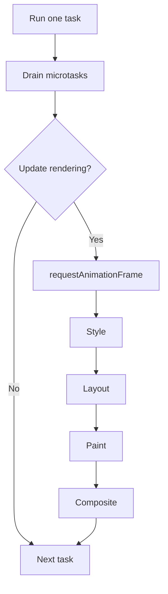
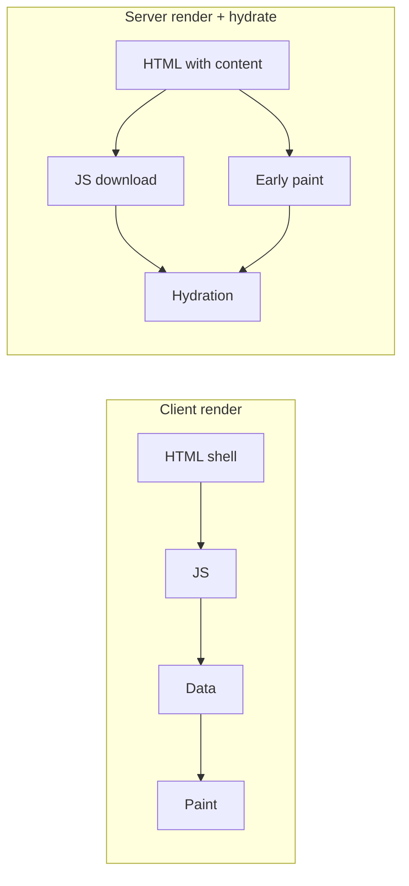
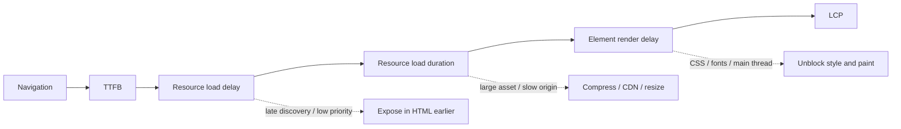

A browser does not wait for a complete page and render it once. It streams HTML, discovers resources, builds internal trees, runs JavaScript, calculates geometry, and paints incrementally.

The **critical rendering path** is the dependency chain between navigation and the pixels needed for the initial view. The useful question is: **which resource or main-thread task is keeping the browser from producing the next important frame?**

<br />

---

## 1. The Rendering Pipeline

The simplified pipeline is HTML → **DOM**, CSS → **CSSOM**, then style, layout, paint, compositing, pixels. Real browsers pipeline and repeat these stages.

<br />



<br />



<br />

- The DOM can build while HTML is still arriving. The browser can paint before the document is complete. JavaScript may later invalidate style, layout, or paint.
- The path is a **dependency graph**, not a fixed sequence.
- A late stylesheet delays rendering. A parser-blocking script delays markup and resource discovery. A large JavaScript task delays painting even when every resource is cached.

---

## 2. Network, HTML, and Resource Discovery

Rendering starts with the document request. DNS, connection setup, TLS, redirects, and server response time all happen before the browser can parse useful HTML. A slow **Time to First Byte** shifts every later stage.

- Streaming HTML lets the browser process the response before the server finishes. Critical CSS, fonts, images, and visible markup should appear early.
- The HTML parser builds the DOM incrementally. A **speculative preload scanner** looks ahead for `<link rel="stylesheet">`, `<script src>`, `` / `srcset`, and `<link rel="preload">`.
- The scanner can start requests while the main parser is blocked. It cannot reliably discover resources created by JavaScript, returned by a later API, or referenced inside CSS that has not loaded.
- **Failure:** an image URL computed after JavaScript and data fetching. An `` in HTML is immediately visible to the browser. Declarative HTML is a performance feature.

---

## 3. CSS and JavaScript Blocking

CSS is parsed into the **CSSOM**. The browser needs applicable styles before it can determine which boxes exist and how they should look. An external stylesheet in the document head is normally **render-blocking**.

<br />

```html
<link rel="stylesheet" href="/app.css" />
<script>
  console.log(getComputedStyle(document.body).color)
</script>
```

<br />

| Script | Execution | Ordering |
| --- | --- | --- |
| Classic | Blocks parser | Document order |
| `defer` | After parsing | Document order |
| `async` | As soon as ready | Load order |
| `type="module"` | Deferred by default | Module dependency order |

<br />



<br />

- CSS usually does not stop DOM construction, but it prevents painting content that depends on incomplete styles. It can also delay a following script because JavaScript may inspect computed styles — the script waits for CSS, and the parser waits for the script.
- CSS `@import` creates a waterfall: imported files are discovered only after the parent stylesheet is parsed. Direct `<link>` exposes requests earlier.
- Application code should usually use a module or `defer`. Independent analytics may use `async`.
- **Failure:** treating `defer` as free. It removes parser blocking, not CPU cost. Transfer, parse, compile, and execute still happen. A large startup task can delay rendering after the DOM is ready.

---

## 4. Style, Layout, Paint, and Compositing

Style resolves the cascade. Layout calculates geometry. Paint records drawing commands. Compositing assembles layers into frames.

<br />

```ts
for (const card of cards) {
  card.style.width = "50%"
  console.log(card.offsetWidth)
}
```

<br />



<br />

- DOM nodes do not map one-to-one to boxes: `display: none` removes a subtree from layout; `visibility: hidden` preserves space; pseudo-elements can create boxes without DOM nodes.
- Large DOMs and broad invalidation usually matter more than micro-optimizing ordinary selectors. A width change can rewrap text and move everything below a container.
- Animating `transform` and `opacity` can often run on the compositor without new layout or paint. Animating `width`, `height`, `top`, or `left` commonly triggers layout and paint.
- **Failure:** interleaving writes and reads — set `style.width`, then read `offsetWidth` — forces **synchronous layout** in a loop. Batch reads before writes. `getBoundingClientRect` is not inherently slow; it is expensive when it flushes pending work. `will-change` everywhere can make performance worse: layers use memory.

---

## 5. The Main Thread and Rendering Opportunities

JavaScript and most rendering work share the **main thread**. The browser does not paint after every task, but it needs the main thread to become available.

<br />



<br />

- Long JavaScript tasks delay input and frames.
- Use `requestAnimationFrame` to align visual writes with a frame, not as a place for expensive computation. Move suitable CPU work to a Web Worker when its communication cost is justified.
- **Failure:** an unbounded microtask chain starves rendering because the checkpoint drains before the browser can update the rendering.

---

## 6. Optimizing the Initial View

The initial render needs visible HTML, applicable CSS, blocking scripts, main-thread rendering time, and any image or font required by the result. It does not need below-the-fold media, analytics, chat widgets, or most interaction code.

<br />

```html
<link rel="preconnect" href="https://cdn.example.com" crossorigin />
<link
  rel="preload"
  href="/hero.avif"
  as="image"
  type="image/avif"
  fetchpriority="high"
/>

```

<br />

- Reduce redirects and TTFB; stream useful HTML early. Make critical CSS, fonts, and the LCP image discoverable from HTML.
- Remove parser-blocking scripts and CSS import chains. Reduce **critical** CSS and JavaScript, not only total page size. Keep third-party code outside the initial path.
- Give images dimensions so layout space exists before they load. Do not lazy-load the LCP image. Use `loading="lazy"` for offscreen media. Serve WOFF2 subsets with `font-display: swap`.
- On long pages, `content-visibility: auto` can skip offscreen rendering work. CSS containment and list virtualization change behavior — introduce them after measurement.
- **Failure:** overusing `preconnect` / `preload`. `preload` competes for bandwidth and must match the final request's type and credentials mode.

---

## 7. Framework Rendering and Hydration

A client-rendered application often delays meaningful content until JavaScript, framework startup, and data fetching complete. **Server rendering** moves content and resource references into HTML, allowing earlier discovery and paint. It does not remove JavaScript cost.

<br />



<br />

- A page can paint quickly and then become unresponsive while a large **hydration** task runs.
- Streaming SSR, selective hydration, islands, and Server Components all target the same problem: reduce startup work and keep non-critical JavaScript out of the initial dependency chain.
- Ask which content must be in the first HTML, which components need client JS, when code and data become discoverable, whether hydration can happen in smaller boundaries, and whether the framework is creating server-to-client request waterfalls.
- **Failure:** treating a fast first paint as a fast page. Hydration can still occupy the main thread afterward.

---

## 8. Measuring the Path

Use a production build. Inspect the Network waterfall and a Performance trace.

<br />



<br />

- **Network** reveals late discovery, priority, queueing, and transfer. **Main** reveals parsing, script execution, style, layout, paint, and long tasks. **Frames** reveals missed deadlines. **Experience** reveals layout shifts and Core Web Vitals.
- For slow **Largest Contentful Paint**, split time into **TTFB**, resource load delay, resource load duration, and element render delay. High load delay → discovery or priority. High load duration → asset size or origin. High render delay → CSS, fonts, decoding, JavaScript, or main-thread contention.
- **FCP**: first content. **LCP**: largest visible content. **CLS**: unexpected movement. **INP**: interaction latency until the next paint.
- Lab traces explain causes; real-user monitoring shows how often users encounter them.
- **Failure:** a fast LCP with poor INP. Hydration or third-party scripts can occupy the main thread after the largest paint.

---

## Final Mental Model

The critical rendering path consumes three limited resources: **network time** to discover and transfer critical bytes, **main-thread time** to parse, execute, style, and lay out, and **rendering capacity** to paint, rasterize, and composite frames.

Fast pages expose important resources early, avoid accidental blockers, minimize startup JavaScript, reserve layout space, and defer work outside the initial viewport. The goal is the shortest dependency chain between navigation and the pixels the user came to see.

---

## Recap Q&A

<Accordion type="single" collapsible>
  <AccordionItem value="crp-pipeline">
    <AccordionTrigger>1. What is the critical rendering path, and is it a fixed sequence?</AccordionTrigger>
    <AccordionContent>

      - The **critical rendering path** is the dependency chain between navigation and the pixels needed for the initial view.
      - The simplified pipeline is HTML → **DOM**, CSS → **CSSOM**, then style, layout, paint, compositing, pixels. Real browsers pipeline and repeat these stages.
      - The path is a **dependency graph**, not a fixed sequence. A late stylesheet delays rendering. A parser-blocking script delays markup and resource discovery. A large JavaScript task delays painting even when every resource is cached.
      - The useful question is which resource or main-thread task is keeping the next important frame from happening.

    </AccordionContent>
  </AccordionItem>

  <AccordionItem value="crp-blocking">
    <AccordionTrigger>2. How do CSS and JavaScript block parsing or painting?</AccordionTrigger>
    <AccordionContent>

      - An external stylesheet in the head is normally **render-blocking**. CSS usually does not stop DOM construction, but it prevents painting content that depends on incomplete styles, and it can delay a following script that inspects computed styles.
      - CSS `@import` creates a waterfall; direct `<link>` exposes requests earlier.
      - A classic `<script src>` **blocks the parser**. `defer` and `type="module"` run after parsing, in order. `async` runs as soon as ready, in load order.
      - Application code should usually be a module or `defer`.
      - **Failure:** treating defer as free. It removes parser blocking, not CPU cost. A large startup task can delay rendering after the DOM is ready.

    </AccordionContent>
  </AccordionItem>

  <AccordionItem value="crp-layout-paint">
    <AccordionTrigger>3. What forces layout, and what can stay on the compositor?</AccordionTrigger>
    <AccordionContent>

      - Style resolves the cascade. Layout calculates geometry. Paint records drawing commands. Compositing assembles layers into frames.
      - Interleaving writes and reads — set `style.width`, then read `offsetWidth` — forces **synchronous layout** in a loop. Batch reads before writes. `getBoundingClientRect` is expensive when it flushes pending work.
      - Animating `transform` and `opacity` can often run on the compositor without new layout or paint. Animating `width`, `height`, `top`, or `left` commonly triggers layout and paint.
      - Layers use memory. `will-change` everywhere can make performance worse.
      - **Failure:** an unbounded microtask chain can starve frames because the checkpoint drains first. JavaScript and most rendering share the **main thread**.

    </AccordionContent>
  </AccordionItem>

  <AccordionItem value="crp-hydration">
    <AccordionTrigger>4. What does server rendering buy, and what does hydration still cost?</AccordionTrigger>
    <AccordionContent>

      - Client rendering often delays meaningful content until JavaScript, framework startup, and data fetching complete.
      - **Server rendering** moves content and resource references into HTML, allowing earlier discovery and paint. It does not remove JavaScript cost.
      - A page can paint quickly and then become unresponsive while a large **hydration** task runs.
      - Streaming SSR, selective hydration, islands, and Server Components all reduce startup work and keep non-critical JavaScript out of the initial dependency chain.
      - Ask which content must be in the first HTML, which components need client JS, and whether hydration can happen in smaller boundaries.

    </AccordionContent>
  </AccordionItem>

  <AccordionItem value="crp-lcp">
    <AccordionTrigger>5. How do you measure a slow Largest Contentful Paint?</AccordionTrigger>
    <AccordionContent>

      - Use a production build. Network reveals late discovery and transfer. Main reveals parse, script, style, layout, paint, and long tasks.
      - For slow **LCP**, split time into **TTFB**, resource load delay, resource load duration, and element render delay.
      - Do not lazy-load the LCP image. Give images dimensions. Make critical CSS, fonts, and the LCP image discoverable from HTML.
      - Optimize in that order: reduce redirects and stream HTML early; remove parser-blocking scripts and CSS import chains; reduce critical CSS and JS, not only total page size; keep third parties off the initial path.
      - **Failure:** overusing `preload`. It competes for bandwidth and must match the final request.

    </AccordionContent>
  </AccordionItem>
</Accordion>
