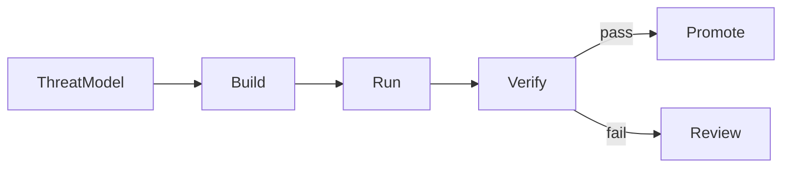

**DevSecOps** integrates security into the software delivery lifecycle. Instead of treating security as a final review before release, teams include security decisions in design, development, continuous integration, deployment, and runtime operations.

This note focuses on the delivery process. Application-level risks are covered in [Web Security and the OWASP Top 10](/notes/web-security-owasp-top-10), the broader delivery pipeline is described in [Frontend CI/CD for React and React Native](/notes/frontend-ci-cd-for-react-and-react-native), and stage-based infrastructure is covered in [Using SST to Manage AWS Infrastructure and DevOps](/notes/using-sst-for-aws-infra-and-devops).

<br />

---

## 1. A Mental Model

A DevSecOps process can be understood through three recurring activities:

- **Build** — control what code, dependencies, and workflow definitions enter the repository.
- **Run** — limit what the CI/CD pipeline and its credentials are allowed to do.
- **Verify** — collect enough evidence to decide whether an artifact can be released.



<br />

| Activity   | Main question                                                                 | Example risk                                                                      |
| ---------- | ----------------------------------------------------------------------------- | --------------------------------------------------------------------------------- |
| **Build**  | Did the change introduce unexpected code, dependencies, or workflow behavior? | A compromised package or a mutable CI action is included in the build             |
| **Run**    | Which identity does the pipeline use, and what resources can it access?       | A pull-request job receives production credentials or broad cloud permissions     |
| **Verify** | Which checks must pass before the artifact can be promoted?                   | An artifact is released without security scans, provenance, or an approval policy |

These controls complement application security; they do not replace it. The application must still authenticate users, authorize actions, validate input, and protect data. [Security in Next.js](/notes/security-in-next-js) covers those concerns for the web application.

<br />

---

## 2. Security Throughout the Lifecycle

Several security activities contribute different kinds of evidence:

- **Threat modeling** identifies important assets, trust boundaries, likely misuse cases, and suitable controls before implementation.
- **Automated checks** provide repeatable feedback on every relevant change.
- **Manual review and penetration testing** examine behavior that automated tools may not understand.
- **Runtime monitoring** detects suspicious or unexpected behavior after release.

The phrase **shift left** means moving useful feedback earlier in the lifecycle, where a problem is usually easier to correct. It does not mean that every security responsibility moves to developers. Platform and security teams still provide reusable controls, guidance, and incident support, while developers apply those controls to the systems they own.

Automation should also have an explicit response policy. A finding may block a pull request, require review before release, or create a tracked remediation item. The appropriate response depends on severity, reachability, confidence, and the system's risk profile.

<br />

---

## 3. Start with a Threat Model

Tools are most useful when the team first identifies what needs protection.

| Asset                   | Security concern                                    | Typical location                                                              |
| ----------------------- | --------------------------------------------------- | ----------------------------------------------------------------------------- |
| **User session**        | An attacker may impersonate a user                  | Better Auth session cookie; see [OWASP A07](/notes/web-security-owasp-top-10) |
| **Runtime secrets**     | An attacker may gain application or database access | SST Secrets linked to server-side resources                                   |
| **Deployment identity** | An attacker may change what production runs         | GitHub OIDC federation to an AWS IAM role                                     |
| **Release artifact**    | Unreviewed or altered code may reach users          | The web or mobile artifact produced by CI                                     |

From these assets, the team can define concrete security goals:

- Only reviewed code and approved dependencies enter a release.
- Secrets remain within the environment and workload that need them.
- Deployment credentials are short-lived and narrowly scoped.
- The promoted artifact can be traced to its source commit and build process.
- Infrastructure changes are represented by a reviewable diff.

These goals provide a basis for choosing controls and deciding which failures should block delivery.

<br />

---

## 4. What Security Checks Provide

Each class of check observes a different part of the system. No single scanner establishes that an application is secure.

| Control                                         | Evidence it provides                                                       | Common point of enforcement                      |
| ----------------------------------------------- | -------------------------------------------------------------------------- | ------------------------------------------------ |
| **Software composition analysis (SCA)**         | Identifies known vulnerabilities and policy violations in dependencies     | Pull request or scheduled scan                   |
| **Secret scanning**                             | Detects credentials or private keys committed to source or exposed in logs | Pre-commit, pull request, and repository history |
| **Static application security testing (SAST)**  | Finds selected insecure patterns without running the application           | Pull request                                     |
| **Infrastructure-as-code scanning**             | Checks resource definitions for risky permissions and network exposure     | Pull request                                     |
| **Dynamic application security testing (DAST)** | Tests a running application for observable security problems               | Preview, staging, or release                     |
| **SBOM and provenance**                         | Records the contents and origin of a release artifact                      | Build and release                                |

Results need context. For example, an SCA finding may refer to code that is not reachable in production, while a lower-scored issue may affect an internet-facing authentication path. Teams should document which severities and conditions block delivery, how exceptions are approved, and when an exception expires.

A pull-request workflow can keep broad permissions out of quality and security jobs:

```yaml title="quality job"
name: CI

on:
  pull_request:
  push:
    branches: [main, develop]

permissions:
  contents: read

jobs:
  build:
    runs-on: ubuntu-latest
    timeout-minutes: 60
    steps:
      - uses: actions/checkout@fbc6f3992d24b796d5a048ff273f7fcc4a7b6c09 # v5
      - uses: oven-sh/setup-bun@0c5077e51419868618aeaa5fe8019c62421857d6 # v2
        with:
          bun-version: 1.3.14
      - run: bun install --frozen-lockfile
      - run: bun run lint
      - run: bun run check-types
      - run: bun run --filter web test
      - run: bun run build
      - run: bun run security:scan # project-defined security checks
```

<br />

- `permissions: contents: read` gives the job only the repository access it needs.
- `--frozen-lockfile` ensures CI uses the dependency graph reviewed in the pull request.
- A project-level security script provides a local and CI entry point for the selected scans.
- Third-party actions can be pinned to full commit SHAs so that a mutable version tag cannot change the executed code unexpectedly.

The detailed CI/CD structure, including previews and artifact promotion, is covered in the [Frontend CI/CD note](/notes/frontend-ci-cd-for-react-and-react-native).

<br />

---

## 5. Pipeline Identity and Least Privilege

A CI/CD workflow acts as a machine identity. Its permissions should be managed in the same way as any other service identity.

This repository deploys after a successful push to a deployment branch. The deploy job uses GitHub OIDC to obtain short-lived AWS credentials for an IAM role:

```yaml title="deploy job"
deploy:
  needs: build
  if: github.event_name == 'push'
  environment:
    name: ${{ github.ref_name == 'main' && 'production' || 'dev' }}
  permissions:
    id-token: write
    contents: read
  steps:
    - uses: aws-actions/configure-aws-credentials@ff717079ee2060e4bcee96c4779b553acc87447c # v4
      with:
        role-to-assume: ${{ secrets.AWS_ROLE_ARN }}
        aws-region: ap-east-1
    - run: bunx sst deploy --stage "$SST_STAGE"
```

<br />

- **OIDC federation** replaces long-lived AWS access keys with temporary credentials. AWS can restrict trust by repository, branch, workflow, and environment. User authentication with OIDC is a separate use case described in [OAuth 2.0 and OIDC Explained](/notes/oauth-2-and-oidc-explained).
- **`id-token: write`** belongs only on jobs that need to request an OIDC token.
- **GitHub Environments** can separate `dev` and `production`, hold environment-specific configuration, and require approval before deployment.
- **Pull-request workflows** should not receive production secrets. Extra care is required with `pull_request_target`, because it runs in the context of the base repository.

Local deployment uses a developer's AWS profile, while CI uses the federated role. Keeping these identities separate makes their permissions and audit trails easier to understand.

<br />

---

## 6. Secret Boundaries

Secrets should be stored according to who needs them and when they are needed.

| Location                | Appropriate contents                                         | Access boundary                                  |
| ----------------------- | ------------------------------------------------------------ | ------------------------------------------------ |
| **SST Secrets**         | Database URL, Better Auth secret, edge credentials, API keys | Server-side resources linked to a specific stage |
| **GitHub Environments** | Deployment role ARN, notification webhook, signing material  | Jobs authorized for the selected environment     |
| **Client bundle**       | Public configuration only                                    | Anyone who can download the application          |

Important implications:

- SST-linked values are intended for server-side use. [Using SST](/notes/using-sst-for-aws-infra-and-devops) explains linking in more detail.
- Values prefixed with `NEXT_PUBLIC_*` are included in browser-facing code and must be treated as public. See [Security in Next.js](/notes/security-in-next-js).
- If a secret is committed to Git, removing it from the latest revision is not sufficient. The credential should be revoked or rotated.
- Logs also require a data policy. Security events can be useful, but tokens, cookies, connection strings, and sensitive personal data should be redacted.

<br />

---

## 7. Supply-Chain Integrity

OWASP **A03 Software Supply Chain Failures** covers compromised dependencies and build paths. **A08 Software or Data Integrity Failures** includes accepting artifacts without adequate integrity checks.

Practical controls include:

- **Commit the lockfile** and use frozen installs so that CI does not resolve an unreviewed dependency graph.
- **Pin third-party workflow actions** to full commit SHAs, with an update bot proposing reviewed upgrades.
- **Build once and promote the same artifact** through preview, testing, and production where the platform permits it.
- **Generate an SBOM** to record included components.
- **Record provenance** to link an artifact to its source commit, workflow, and builder.

SBOMs and provenance improve traceability; they do not replace code review, testing, or vulnerability management. React Native also includes native dependencies managed through Gradle and CocoaPods, so its supply-chain review must cover more than the JavaScript dependency graph. See [Security in React Native](/notes/security-in-react-native).

<br />

---

## 8. Runtime Operations

DevSecOps continues after deployment. Runtime controls and operational feedback show whether assumptions made during development remain valid.

For this site, examples include:

- A **Web Application Firewall (WAF)** on the production CloudFront Router.
- **Basic Authentication** on non-production environments, using credentials from SST Secrets.
- Logging and alerts for authorization denials, administrative actions, and webhook signature failures.

Alerting should identify an owner and an expected response. Logs should contain enough context for investigation without exposing the secret or personal data involved.

Some security decisions should **fail closed**. For example, an authorization dependency that times out should not grant access, and a required security check that cannot run should not be treated as successful. Teams should apply this principle selectively because availability and safety requirements differ by system.

Disaster recovery addresses a related but separate concern: restoring service and data after a serious failure. See [Disaster Recovery in System Design](/notes/disaster-recovery-in-system-design) for RTO, RPO, backup, and failover strategies.

<br />

---

## 9. Ownership and Review

Controls are more reliable when ownership is explicit.

| Control                             | Typical author                    | Enforcement                                 | Operational owner             |
| ----------------------------------- | --------------------------------- | ------------------------------------------- | ----------------------------- |
| Threat model and SAST policy        | Feature and security engineers    | Pull-request CI                             | Team that triages findings    |
| Lockfile, action pins, scan scripts | Developers and platform engineers | CI configuration                            | Dependency update process     |
| IAM trust and environments          | Platform or infrastructure team   | OIDC conditions and environment rules       | Cloud and GitHub audit owners |
| Runtime secrets                     | Service owner                     | Resource linking and server-only boundaries | Secret rotation process       |
| WAF, edge authentication, alerts    | Infrastructure and service teams  | Infrastructure deployment                   | On-call team                  |

A dependency, workflow, or IAM change should receive the level of review appropriate to the access it introduces. Infrastructure as code makes these changes visible in the same review process as application code.

<br />

---

## 10. Practical Defaults

The following defaults provide a reasonable starting point for this stack:

- Define the threat model before selecting security tools.
- Use OIDC federation for CI deployments instead of long-lived cloud access keys.
- Give workflow jobs only the permissions they require.
- Commit the lockfile, use frozen installs, and pin third-party actions.
- Keep runtime secrets in SST and environment-specific deployment data in GitHub Environments.
- Treat `NEXT_PUBLIC_*` values as public.
- Build once and promote the same artifact when the delivery platform supports it.
- Define which security findings block delivery and how exceptions are reviewed.
- Assign owners to alerts and document the expected response.
- Keep WAF and non-production access policy in reviewable infrastructure code.

DevSecOps is therefore a coordination model as much as a toolchain: security requirements guide development, automated controls provide timely evidence, and operations confirm that the deployed system continues to behave as expected.

---

## Recap Q&A

<Accordion type="single" collapsible>
  <AccordionItem value="dso-what">
    <AccordionTrigger>1. What is DevSecOps?</AccordionTrigger>
    <AccordionContent>

      - DevSecOps integrates security into design, development, CI/CD, deployment, and runtime operations.
      - A useful model is **build** (control inputs), **run** (limit pipeline permissions), and **verify** (collect release evidence).
      - It complements application security and manual review rather than replacing them.

    </AccordionContent>

  </AccordionItem>

  <AccordionItem value="dso-signals">
    <AccordionTrigger>2. Why are several kinds of security checks needed?</AccordionTrigger>
    <AccordionContent>

      - SCA examines dependencies, secret scanning finds exposed credentials, SAST checks source patterns, and IaC scanning checks infrastructure definitions.
      - DAST observes a running application, while SBOMs and provenance record what was built and where it came from.
      - Each control provides limited evidence, so results still require risk-based policy and review.

    </AccordionContent>

  </AccordionItem>

  <AccordionItem value="dso-identity">
    <AccordionTrigger>3. How should a deployment pipeline authenticate to AWS?</AccordionTrigger>
    <AccordionContent>

      - GitHub OIDC can provide short-lived AWS credentials for a narrowly scoped IAM role.
      - Only deployment jobs need `id-token: write`; build and pull-request jobs should keep minimal permissions.
      - GitHub Environments can separate stages and add approval rules for production.

    </AccordionContent>

  </AccordionItem>

  <AccordionItem value="dso-secrets-supply">
    <AccordionTrigger>4. How are secrets and supply-chain integrity handled?</AccordionTrigger>
    <AccordionContent>

      - Store runtime secrets in SST, deployment configuration in protected GitHub Environments, and only public values in the client bundle.
      - Commit the lockfile, use frozen installs, pin third-party actions, and promote the same artifact after testing.
      - SBOMs describe artifact contents; provenance records the source and build process.

    </AccordionContent>

  </AccordionItem>

  <AccordionItem value="dso-owner">
    <AccordionTrigger>5. What makes a security control operationally effective?</AccordionTrigger>
    <AccordionContent>

      - The control has a defined purpose, enforcement point, owner, and response procedure.
      - Findings have documented blocking and exception policies.
      - Runtime alerts reach a responsible team, while logs retain useful context without exposing secrets.

    </AccordionContent>

  </AccordionItem>
</Accordion>
