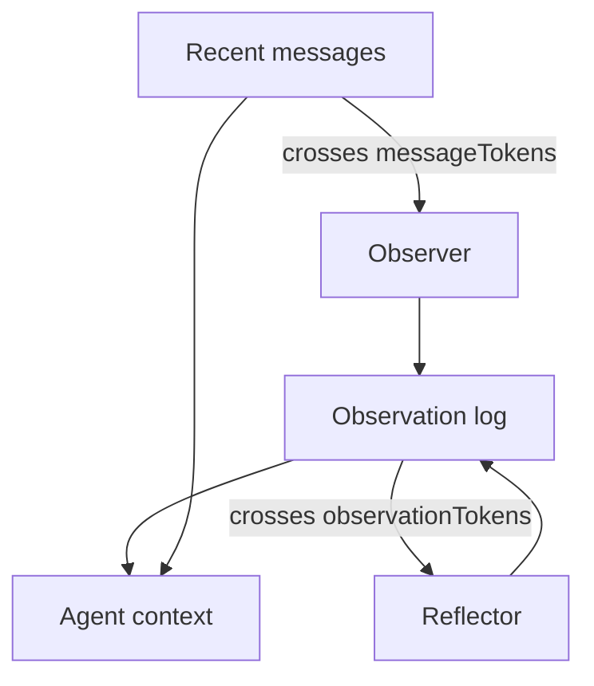

LLMs have the memory of a goldfish. You can write that you like bikes, then ask for facts about them, and the model stares back like the guy from *Memento*. The naive fix is to stuff the last *N* messages into every request. That works for ten turns. It dies on tool dumps, new threads, and any goal that sat in message one.

This is Mastra’s four-level ladder, in the order they shipped it. Alex Becker walks through the same stack in [Four levels of agent memory](https://www.youtube.com/watch?v=18iIHQtIPmc). It is not the CoALA taxonomy (working / episodic / semantic / procedural). Those names describe *kinds of knowledge*. These four levels describe *where the tokens live* and *what you pay* to keep them.

Storage is required for all of them. `new Memory()` with no options is already level 1. The rest are flags on the same object.

<br />

---

## 1. Conversation history

A thread is one conversation. A resource is the owner: a user, an org, a project. Studio invents both. When you call `generate` or `stream` yourself, you pass them.

Mastra loads the last *N* messages from storage and puts them in the context window. Default `lastMessages` is 10. The reason it works is trivial: the model can see “I like bikes” when you say “tell me facts about them.”

<br />

```ts
import { Agent } from "@mastra/core/agent"
import { Memory } from "@mastra/memory"

export const agent = new Agent({
  id: "chat-agent",
  name: "Chat agent",
  instructions: "You are a helpful assistant.",
  model: "openai/gpt-5-mini",
  memory: new Memory({
    options: {
      lastMessages: 10,
    },
  }),
})
```

<br />

From the client, send **only the new message**. Mastra already has the thread. Shipping the full history is redundant, and client timestamps will reorder messages against the store.

This level fails in two ways that feel like bugs and are not:

- The window is a sliding cut. If the user’s goal was the first message and you then burned 30 tool turns, the goal is gone.
- A new thread has no history. Same agent, same human, empty context. That is not intelligence. That is a session cookie.

Tool results make the cut arrive sooner than you expect. A single `llms.txt` fetch can be 10k tokens. History is the right default for short chats. It is not a memory system.

<br />

---

## 2. Working memory

Working memory is a scratchpad the model can see on every turn, even hundreds of messages later, even on a new thread if the scope is `resource`. You give it empty fields. The agent fills them with `updateWorkingMemory`. The filled block is injected into the system instruction, which the user never sees.

It supplements history. It does not replace it. Use it for facts that do not change: name, “hate mistakes,” “prefer concise replies,” “build a $10M SaaS.” Coding agents and any long-horizon task live here.

<br />

```ts
import { Agent } from "@mastra/core/agent"
import { Memory } from "@mastra/memory"

export const agent = new Agent({
  id: "personal-assistant",
  name: "Personal assistant",
  instructions: "You are a helpful personal assistant.",
  model: "openai/gpt-5-mini",
  memory: new Memory({
    options: {
      workingMemory: {
        enabled: true,
        scope: "resource",
        template: `# User Profile
- **Name**:
- **Preferences**:
- **Current Goal**:
`,
      },
    },
  }),
})
```

<br />

`scope: "resource"` is the default: one scratchpad per user across threads. `scope: "thread"` isolates it to this conversation. Switching scopes does not migrate data.

You can use a Zod `schema` instead of a Markdown `template`. Not both. Templates replace the whole block on each update. Schemas merge: send only the fields that changed; set a field to `null` to delete it.

Working memory is small on purpose. You have to predefine the fields, which does not feel agentic. It is also the wrong place for a growing event log. If you are stuffing conversation summaries into the template, skip to level 4.

When observational memory is on, `observationalMemory.observation.manageWorkingMemory` lets the Observer write the scratchpad so the main agent does not have to remember the tool.

<br />

---

## 3. Semantic recall

Semantic recall is RAG over *message history*, not over your product corpus. That distinction matters. The org-scoped document index in [How to build a RAG system](/notes/how-to-build-a-rag-system) is a library the agent searches with a tool. Semantic recall is automatic: every new message is embedded, and future messages query that vector store for similar turns.

“I like dogs, mine is called Nas Barkley.” Later, in another thread: “what animals do I like?” The lookup is by meaning, not the word `dogs`. Mastra injects the hits as an extra system block: remembered from a different conversation.

<br />

```ts
import { Agent } from "@mastra/core/agent"
import { Memory } from "@mastra/memory"
import { LibSQLStore, LibSQLVector } from "@mastra/libsql"
import { ModelRouterEmbeddingModel } from "@mastra/core/llm"

export const agent = new Agent({
  id: "support-agent",
  name: "Support agent",
  instructions: "You are a helpful support agent.",
  model: "openai/gpt-5-mini",
  memory: new Memory({
    storage: new LibSQLStore({
      id: "agent-storage",
      url: "file:./local.db",
    }),
    vector: new LibSQLVector({
      id: "agent-vector",
      url: "file:./local.db",
    }),
    embedder: new ModelRouterEmbeddingModel("openai/text-embedding-3-small"),
    options: {
      semanticRecall: {
        topK: 3,
        messageRange: 2,
        scope: "resource",
      },
    },
  }),
})
```

<br />

`topK` is how many hits. `messageRange` is the surrounding turns to pull with each hit. Too much and the model drowns. Too little and you miss the fact. `scope: "resource"` searches all threads for that user; LibSQL, Postgres, MongoDB, OracleDB, and Upstash support it.

Disabled by default. It needs a vector store and an embedder. Same embedding model on write and query, same rule as document RAG.

The costs are real:

- Recall is imprecise. You will tune `topK` and `messageRange` per product.
- You now run an embedder and a vector store. Latency on every turn.
- The injected system block changes with the query. The prompt prefix is never stable enough to hit the cache. In production, cached input tokens are usually the largest saving. Semantic recall spends them.

The gains are also real: meaning-based lookup, cross-thread recall, and a history that can grow without stuffing the whole log into the window.

Do not confuse this with the Pinecone document pipeline. Message RAG is for “what did we already say.” Document RAG is for “what is in the handbook.” Different indexes. Different tenancy. Different tools.

<br />

---

## 4. Observational memory

Observational memory is the one modeled on how people remember, and how they forget. Two ambient agents: an **Observer** and a **Reflector**. They are always there. They are not always running.

When message tokens cross a threshold (default 30,000; demos often use 2k so you can watch it), the Observer compresses the raw history into a dense observation log: priority markers, timestamps, the sliver that still matters. A 10k-token tool result can become ~160 tokens. The rest is allowed to die.

When the observation log itself crosses its threshold (default 40,000), the Reflector rewrites the whole log. It drops low-priority lines, merges related facts, and keeps the window bounded no matter how long the thread runs. Reflections do not stack as a third infinite layer. Each reflection *is* the new log. New observations append after it.

<br />



<br />

The observations are **stable**. They append. They do not reshuffle the system prefix every turn. That is the cache argument against semantic recall, inverted.

The Observer and Reflector run in the background. In Studio you can click them for a demo. In a real agent they are async and non-blocking. Compaction in a coding harness often pauses the user for a minute and throws away the wrong details. This loop is supposed to do neither.

<br />

```ts
import { Agent } from "@mastra/core/agent"
import { LibSQLStore } from "@mastra/libsql"
import { Memory } from "@mastra/memory"

export const agent = new Agent({
  id: "long-horizon-agent",
  name: "Long-horizon agent",
  instructions: "You are a helpful assistant.",
  model: "openai/gpt-5-mini",
  memory: new Memory({
    storage: new LibSQLStore({
      id: "memory-storage",
      url: "file:./memory.db",
    }),
    options: {
      observationalMemory: {
        model: "google/gemini-2.5-flash",
      },
    },
  }),
})
```

<br />

`observationalMemory: true` defaults the Observer/Reflector model to `google/gemini-2.5-flash`. Storage is required. Supported adapters today: `@mastra/pg`, `@mastra/libsql`, `@mastra/mysql`, `@mastra/mongodb`, `@mastra/convex`, `@mastra/oracledb`.

Mastra’s LongMemEval numbers from the video, same model across the first three rows: working memory ~55% (not designed for this benchmark), semantic recall ~80%, observational memory ~84%. Gemini 2.5 Flash on OM was reported at ~95%, the highest verifiable score they quoted. Treat those as Mastra’s published scores, not an independent bake-off.

This is the level that survives noisy tool calls: page snapshots, `llms.txt`, MCP dumps. It is also the level that compounds. A workshop-helper agent that writes event copy for weeks will start keeping “second person, short hook, no hype” as observations, not as a field you remembered to put in a template.

Two extras worth knowing:

- `retrieval: true` gives the agent a `recall` tool over the raw messages that produced an observation. `{ vector: true }` adds semantic search on that store. Compression does not have to mean the original wording is gone.
- `observation.manageWorkingMemory` lets OM own the scratchpad. Working memory stays small and structured; OM stops the main agent from spending a tool call on it.

<br />

---

## 5. Which level

<br />

| Level | Primitive | Use when | Breaks when |
| --- | --- | --- | --- |
| Conversation history | `lastMessages` | Short threads, UI transcript | Goal falls out of the window; new thread |
| Working memory | `workingMemory` | Stable facts and the current goal | You need an event log or undeclared fields |
| Semantic recall | `semanticRecall` | Sparse facts across a long, multi-thread history | You need prompt cache, or recall is too fuzzy |
| Observational memory | `observationalMemory` | Long horizon, noisy tools, cache-stable context | You refused to run a storage adapter |

<br />

Mastra’s current recommendation is observational memory for long-context agents. The earlier levels still exist and still compose. History is what the model sees *right now*. Working memory is the form. Semantic recall is a search. Observational memory is how the window stays small without going blank.

A `new Memory()` with no options is conversation history. That is the weather agent in this repo. Graduate when the thread is no longer a chat.

<br />

---

## 6. Invariants

1. Persist through a storage adapter. Memory is not the context window.
2. The client sends the new message. The server loads the thread. Never both.
3. `thread` is the conversation. `resource` is the owner. Cross-thread recall is a resource query, not a missing `threadId`.
4. Working memory is a small, always-on block. Do not grow it into a diary.
5. Semantic recall over messages is not document RAG. Different index, different tenant story. Same embedding model on write and query in both.
6. Observational memory keeps a cacheable prefix by appending observations. Semantic recall busts that prefix on purpose.
7. Isolation is a server concern. `resource` is not something the model gets to pick.

Four levels. Same `Memory` object. The sophistication is which tokens you keep, and which you are willing to forget.
