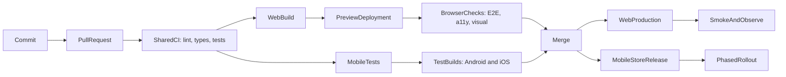

Frontend CI/CD is the system that turns a commit into evidence and, eventually, a release. It is more than a YAML file: it defines which checks must pass, which artifact is trusted, who may promote it, and how the team recovers when production is unhealthy.

This guide uses a **fictional** TypeScript product with a React web app, a React Native mobile app, and shared packages. Commands such as `pnpm deploy:web` are deliberate provider-neutral boundaries; a real team implements them with its chosen hosting or mobile delivery platform.

<br />

---

## 1. CI, Continuous Delivery, and Continuous Deployment

These terms describe different promises.

| Practice                        | Promise                                                       | Typical trigger                     |
| ------------------------------- | ------------------------------------------------------------- | ----------------------------------- |
| **Continuous Integration (CI)** | Every change is merged frequently and automatically validated | Pull request or push                |
| **Continuous Delivery**         | Every accepted commit produces a releasable artifact          | Successful CI, then human approval  |
| **Continuous Deployment**       | Every accepted commit is released automatically               | Successful CI on the release branch |

For frontend products, “CD” splits into two different delivery models:

- **Web:** the team can usually publish an immutable artifact and switch traffic to it within minutes.
- **React Native:** native binaries must be signed, submitted to stores, reviewed, and rolled out. Automation can make a build continuously **deliverable**, but Apple and Google still control part of the release timeline.

Do not call a pipeline “continuous deployment” merely because it runs `build`. A build that remains on a CI runner has not been delivered anywhere.

<br />

---

## 2. A Production-Shaped Example

Assume a workspace with explicit boundaries:

```text
apps/
  web/                  React web application
  mobile/               React Native application
packages/
  api-client/           typed transport and generated contracts
  domain/               framework-independent business rules
  ui-tokens/            shared colors, spacing, and typography
scripts/
  deploy-web.mjs        provider adapter for preview and production
  submit-mobile.mjs     store submission adapter
.github/workflows/
  pull-request.yml
  release-web.yml
  release-mobile.yml
```

The exact monorepo tool is less important than one property: every check must be runnable locally with the same command CI uses.

```json title="package.json"
{
  "packageManager": "pnpm@10.15.0",
  "scripts": {
    "format:check": "prettier --check .",
    "lint": "eslint . --max-warnings=0",
    "typecheck": "tsc -b --pretty false",
    "test": "vitest run --coverage",
    "test:mobile": "jest --ci --runInBand",
    "build:web": "pnpm --filter web build",
    "test:e2e:web": "playwright test",
    "test:e2e:mobile": "maestro test apps/mobile/e2e",
    "deploy:web": "node scripts/deploy-web.mjs",
    "submit:mobile": "node scripts/submit-mobile.mjs"
  }
}
```

Pin the package-manager version and commit the lockfile. `pnpm install --frozen-lockfile` should fail if `package.json` and the lockfile disagree; CI must not silently resolve a different dependency graph.

<br />

---

## 3. The End-to-End Pipeline

The shared validation path should be fast. Web and mobile delivery diverge only after the code has passed common quality gates.



A practical target:

1. **Before push:** format and lint changed files.
2. **Pull request:** install, lint, format, type-check, test, build, and scan.
3. **Preview:** deploy the web artifact; run browser, accessibility, and visual checks against its URL.
4. **Mobile test builds:** produce unsigned simulator builds or internally signed device builds.
5. **Merge:** create a production candidate from the reviewed commit.
6. **Release:** promote the same web artifact; sign and submit native binaries.
7. **Verify:** run smoke tests and watch errors, performance, and business signals.
8. **Recover:** roll back web traffic or stop the mobile rollout.

<br />

---

## 4. Pull-Request CI with GitHub Actions

Start with least privilege, cancellation of stale runs, deterministic installation, and parallel jobs.

```yaml title=".github/workflows/pull-request.yml"
name: Pull request

on:
  pull_request:

permissions:
  contents: read

concurrency:
  group: pr-${{ github.event.pull_request.number }}
  cancel-in-progress: true

env:
  NODE_VERSION: "22"
  PNPM_VERSION: "10.15.0"

jobs:
  quality:
    runs-on: ubuntu-latest
    timeout-minutes: 15
    steps:
      - uses: actions/checkout@v4
      - uses: pnpm/action-setup@v4
        with:
          version: ${{ env.PNPM_VERSION }}
      - uses: actions/setup-node@v4
        with:
          node-version: ${{ env.NODE_VERSION }}
          cache: pnpm
      - run: pnpm install --frozen-lockfile
      - run: pnpm format:check
      - run: pnpm lint
      - run: pnpm typecheck
      - run: pnpm test

  web-build:
    needs: quality
    runs-on: ubuntu-latest
    timeout-minutes: 15
    steps:
      - uses: actions/checkout@v4
      - uses: pnpm/action-setup@v4
        with:
          version: ${{ env.PNPM_VERSION }}
      - uses: actions/setup-node@v4
        with:
          node-version: ${{ env.NODE_VERSION }}
          cache: pnpm
      - run: pnpm install --frozen-lockfile
      - run: pnpm build:web
      - uses: actions/upload-artifact@v4
        with:
          name: web-${{ github.sha }}
          path: apps/web/dist
          if-no-files-found: error
          retention-days: 7

  mobile-js:
    needs: quality
    runs-on: ubuntu-latest
    timeout-minutes: 15
    steps:
      - uses: actions/checkout@v4
      - uses: pnpm/action-setup@v4
        with:
          version: ${{ env.PNPM_VERSION }}
      - uses: actions/setup-node@v4
        with:
          node-version: ${{ env.NODE_VERSION }}
          cache: pnpm
      - run: pnpm install --frozen-lockfile
      - run: pnpm test:mobile
```

In a larger system, extract Node and package-manager setup into a **composite action** or reusable workflow. Do not abstract three lines on day one; abstract when many workflows must stay synchronized.

### Why this shape works

- `permissions: contents: read` denies write access unless a job explicitly needs it.
- `concurrency` cancels an obsolete run after another commit reaches the pull request.
- `timeout-minutes` prevents a deadlocked test from consuming a runner indefinitely.
- `needs` makes dependencies visible. Independent jobs can run in parallel.
- Artifact names include the commit SHA, making provenance easier to inspect.
- The package-store cache accelerates installation without treating `node_modules` as a deployable artifact.

For higher supply-chain assurance, pin third-party actions to full commit SHAs and use an update bot to propose upgrades. Version tags such as `@v4` are readable, but they are mutable references.

<br />

---

## 5. Design Quality Gates by Cost and Signal

Put quick, deterministic checks early and expensive environment-dependent checks later.

| Gate               | What it proves                                 | Failure should block         |
| ------------------ | ---------------------------------------------- | ---------------------------- |
| Prettier / ESLint  | Consistent syntax and agreed static rules      | Pull request                 |
| `tsc --noEmit`     | Type contracts compose                         | Pull request                 |
| Unit tests         | Pure logic and domain rules behave correctly   | Pull request                 |
| Component tests    | User-observable component behavior works       | Pull request                 |
| Web build          | Bundler and production configuration are valid | Pull request                 |
| Browser E2E        | Critical journeys work in a real browser       | Merge or release             |
| Accessibility      | Serious automated WCAG violations are absent   | Merge                        |
| Visual regression  | Reviewed pages did not change unexpectedly     | Merge with baseline approval |
| Performance budget | Bundle and key journeys remain within limits   | Merge or release             |
| Native build       | Gradle/Xcode project compiles and packages     | Release                      |
| Post-release smoke | The deployed system is reachable and usable    | Continue rollout             |

Coverage is supporting evidence, not the goal. A pipeline with 95% line coverage can still miss a broken login redirect, an invalid iOS entitlement, or a JavaScript chunk that fails behind a CDN.

Quarantine a flaky test only with an owner, a reason, and an expiry date. Blind retries hide intermittent production risks.

<br />

---

## 6. Web Preview, Browser Tests, and Promotion

A preview deployment changes E2E from “the app started on localhost” to “the candidate works through its actual hosting boundary.”

```yaml title="Preview and browser checks"
web-preview:
  needs: web-build
  runs-on: ubuntu-latest
  environment: preview
  permissions:
    contents: read
    pull-requests: write
  outputs:
    url: ${{ steps.deploy.outputs.url }}
  steps:
    - uses: actions/checkout@v4
    - uses: actions/download-artifact@v4
      with:
        name: web-${{ github.sha }}
        path: apps/web/dist
    - id: deploy
      env:
        DEPLOY_TOKEN: ${{ secrets.WEB_PREVIEW_TOKEN }}
      run: |
        url="$(pnpm deploy:web --environment preview --artifact apps/web/dist)"
        echo "url=$url" >> "$GITHUB_OUTPUT"

web-e2e:
  needs: web-preview
  runs-on: ubuntu-latest
  timeout-minutes: 20
  steps:
    - uses: actions/checkout@v4
    - uses: pnpm/action-setup@v4
      with:
        version: "10.15.0"
    - uses: actions/setup-node@v4
      with:
        node-version: "22"
        cache: pnpm
    - run: pnpm install --frozen-lockfile
    - run: pnpm exec playwright install --with-deps chromium
    - run: pnpm test:e2e:web
      env:
        BASE_URL: ${{ needs.web-preview.outputs.url }}
```

The deploy command is an adapter: it uploads the supplied artifact and prints the resulting URL. It must not rebuild. Build once, record a digest, test that artifact, and promote the same bytes.

### Frontend-specific preview gates

- Run the few journeys that protect revenue, authentication, data loss, and navigation.
- Scan representative pages with Axe, but keep manual accessibility testing because automation cannot assess every WCAG requirement.
- Capture visual baselines at controlled viewport sizes and fonts.
- Enforce a compressed JavaScript budget and investigate large route-level changes.
- Run Lighthouse or user-flow performance tests in a stable environment; noisy synthetic scores should warn before they block.
- Upload source maps to the error-monitoring system, then prevent public source-map listing if the product requires it.

### Production promotion

Protect the `production` GitHub Environment with required reviewers. A production job should receive the tested artifact’s identifier or digest:

```yaml title="Production promotion"
deploy-production:
  needs: [web-preview, web-e2e]
  if: github.ref == 'refs/heads/main'
  runs-on: ubuntu-latest
  environment: production
  permissions:
    contents: read
    id-token: write
  steps:
    - uses: actions/download-artifact@v4
      with:
        name: web-${{ github.sha }}
        path: apps/web/dist
    - run: pnpm deploy:web --environment production --artifact apps/web/dist
    - run: pnpm smoke:web
      env:
        BASE_URL: https://example.invalid
```

`id-token: write` enables OpenID Connect for short-lived cloud credentials when the provider supports it. Prefer this to permanent access keys. Grant it only to the deployment job, not the pull-request workflow.

<br />

---

## 7. Web Configuration, Artifacts, and Rollback

Browser code cannot hold a secret. Any value embedded in the web bundle—including variables prefixed with conventions such as `PUBLIC_`—must be treated as public.

Separate:

- **Build-time public configuration:** API origin, analytics project ID, feature defaults.
- **Runtime server configuration:** credentials used only by server functions or a backend-for-frontend.
- **Deployment credentials:** available only to the deployment job.

Decide whether configuration is baked into each artifact or injected at runtime. Baked configuration is simpler and more reproducible; runtime configuration allows one artifact to move through environments but needs a carefully designed loading mechanism.

For rollback:

1. Keep immutable releases addressed by digest or release ID.
2. Change the production alias or traffic pointer to the last known-good release.
3. Purge only the CDN entries that must change; fingerprinted assets should remain immutable.
4. Run smoke checks after rollback.
5. Preserve logs and the failed artifact for diagnosis.

Rebuilding an old Git commit is not as safe as promoting the original artifact: dependencies, base images, and external build services may have changed.

<br />

---

## 8. React Native CI Is Two Pipelines

React Native has a fast JavaScript pipeline and a slower native pipeline.

### JavaScript layer

Run on Linux for most pull requests:

- ESLint, formatting, and TypeScript
- Jest and React Native Testing Library
- tests for reducers, state machines, deep links, API adapters, and offline behavior
- Metro bundle generation to catch unresolved modules

### Native layer

Run when native files, dependencies, release configuration, or a release tag changes:

- Android build on Linux with Gradle and an appropriate JDK
- iOS build on macOS with Xcode, CocoaPods or Swift Package Manager
- simulator/emulator smoke tests
- device E2E with Maestro or Detox
- signing, packaging, and store submission only in protected release jobs

macOS runners are slower, more expensive, and constrained to installed Xcode versions. Do not run a full signed iOS archive for every documentation-only change. Use path filters carefully, while still running periodic full builds to detect drift.

<br />

---

## 9. Mobile Test Builds and E2E

Internal builds let product and QA test the candidate before store submission.

```yaml title="Mobile internal builds"
jobs:
  android-internal:
    runs-on: ubuntu-latest
    environment: mobile-internal
    steps:
      - uses: actions/checkout@v4
      - uses: actions/setup-java@v4
        with:
          distribution: temurin
          java-version: "17"
          cache: gradle
      - run: corepack enable
      - run: pnpm install --frozen-lockfile
      - run: pnpm mobile:build:android --profile internal
        env:
          ANDROID_KEYSTORE_BASE64: ${{ secrets.ANDROID_KEYSTORE_BASE64 }}
          ANDROID_KEYSTORE_PASSWORD: ${{ secrets.ANDROID_KEYSTORE_PASSWORD }}
      - uses: actions/upload-artifact@v4
        with:
          name: android-internal-${{ github.sha }}
          path: apps/mobile/android/app/build/outputs/**/*.apk

  ios-simulator:
    runs-on: macos-latest
    steps:
      - uses: actions/checkout@v4
      - run: corepack enable
      - run: pnpm install --frozen-lockfile
      - run: pnpm mobile:build:ios --profile simulator
      - run: pnpm test:e2e:mobile --platform ios
```

Prefer an unsigned iOS simulator build for pull-request smoke tests. Import certificates and provisioning profiles only when a protected job genuinely needs a signed device or App Store archive.

Mobile E2E is inherently more variable than unit tests. Stabilize it with:

- fixed simulator/OS versions;
- isolated test accounts and resettable backend state;
- accessibility IDs reserved for stable interactions;
- screenshots, videos, and device logs uploaded on failure;
- a small release-blocking suite plus broader scheduled coverage.

<br />

---

## 10. Tagged Mobile Releases

Native releases need explicit versioning and controlled credentials. One common policy is:

- marketing version in source, such as `3.4.0`;
- monotonically increasing iOS build number;
- monotonically increasing Android version code;
- annotated tag such as `mobile-v3.4.0`;
- protected GitHub Environment approval before submission.

```yaml title=".github/workflows/release-mobile.yml"
name: Release mobile

on:
  push:
    tags:
      - "mobile-v*"

permissions:
  contents: read

jobs:
  validate-tag:
    runs-on: ubuntu-latest
    outputs:
      version: ${{ steps.version.outputs.value }}
    steps:
      - uses: actions/checkout@v4
      - id: version
        run: |
          value="${GITHUB_REF_NAME#mobile-v}"
          node scripts/assert-version.mjs "$value"
          echo "value=$value" >> "$GITHUB_OUTPUT"
      - run: corepack enable
      - run: pnpm install --frozen-lockfile
      - run: pnpm lint && pnpm typecheck && pnpm test && pnpm test:mobile

  build-android:
    needs: validate-tag
    runs-on: ubuntu-latest
    environment: mobile-production
    steps:
      - uses: actions/checkout@v4
      - run: pnpm mobile:build:android --profile production
      - uses: actions/upload-artifact@v4
        with:
          name: android-${{ needs.validate-tag.outputs.version }}
          path: apps/mobile/android/app/build/outputs/**/*.aab

  build-ios:
    needs: validate-tag
    runs-on: macos-latest
    environment: mobile-production
    steps:
      - uses: actions/checkout@v4
      - run: pnpm mobile:build:ios --profile production
      - uses: actions/upload-artifact@v4
        with:
          name: ios-${{ needs.validate-tag.outputs.version }}
          path: apps/mobile/build/**/*.ipa

  submit:
    needs: [validate-tag, build-android, build-ios]
    runs-on: ubuntu-latest
    environment: mobile-store-submit
    steps:
      - uses: actions/download-artifact@v4
      - run: pnpm submit:mobile --track internal
        env:
          APP_STORE_API_KEY: ${{ secrets.APP_STORE_API_KEY }}
          PLAY_SERVICE_ACCOUNT_JSON: ${{ secrets.PLAY_SERVICE_ACCOUNT_JSON }}
```

The abbreviated build jobs assume setup and signing are hidden behind audited scripts or reusable workflows. In production, make those steps explicit enough to diagnose and rotate.

Submit to TestFlight and Play internal testing first. Promote the approved binary through beta and production tracks instead of rebuilding it for each track.

<br />

---

## 11. Signing and Secret Boundaries

Mobile signing deserves a stricter threat model than ordinary CI.

- Store signing files as encrypted CI secrets or in a dedicated secrets manager.
- Restrict production signing to protected environments and trusted branches/tags.
- Never expose production secrets to pull requests from forks.
- Avoid `pull_request_target` with untrusted code checkout; it can combine write-capable secrets with attacker-controlled code.
- Mask sensitive output and ensure shell tracing does not print credentials.
- Rotate certificates, API keys, and service accounts before expiry.
- Separate build credentials from store-submission credentials.
- Give store API accounts the smallest roles that can upload or promote builds.

Where possible, use short-lived identity federation. Some store-signing materials remain long-lived by platform design, so compensate with access controls, audit logs, and rotation.

<br />

---

## 12. Mobile Rollout and Recovery

Mobile rollback is not the inverse of web deployment. An installed binary cannot normally be removed from every device.

Use a layered response:

1. **Stop the phased rollout** in App Store Connect or Play Console.
2. **Disable the affected feature** with a server-side flag when possible.
3. **Roll back the backend contract** only if older installed clients remain compatible.
4. **Ship an over-the-air update** only for JavaScript/assets that are compatible with the installed native runtime.
5. **Submit a hotfix binary** for native crashes, entitlement mistakes, SDK changes, or incompatible native modules.
6. **Communicate minimum supported versions** if the backend must eventually reject unsafe clients.

An OTA system must bind updates to a runtime or compatibility version. Sending JavaScript that expects a native module absent from the installed binary can create an immediate crash loop.

Prefer staged rollout percentages and monitor:

- crash-free users and sessions;
- app start and screen-render latency;
- API error rate by app version;
- login, checkout, or other critical conversion;
- device model and OS-specific regressions.

<br />

---

## 13. Reusable Workflows Without a YAML Monolith

As pipelines grow, separate responsibilities:

```text
pull-request.yml       orchestration and PR permissions
release-web.yml        production web policy
release-mobile.yml     tag and store policy
reusable-node.yml      install, lint, types, unit tests
reusable-android.yml   JDK, Gradle, signing, artifact
reusable-ios.yml       Xcode, signing, archive, artifact
```

Call reusable workflows with explicit inputs and secret inheritance only when required:

```yaml title="Reusable quality workflow"
jobs:
  quality:
    uses: ./.github/workflows/reusable-node.yml
    with:
      node-version: "22"
    secrets: {}
```

Keep policy at the caller:

- which branches or tags trigger;
- which environment must approve;
- what permissions are granted;
- whether a failure blocks promotion.

Keep mechanics in the reusable workflow:

- toolchain setup;
- deterministic install;
- build commands;
- artifact naming and upload.

Avoid a single workflow with dozens of conditionals for web, iOS, Android, preview, staging, and production. It becomes difficult to understand which permissions and secrets each path receives.

<br />

---

## 14. Observability Is Part of Delivery

A green deployment command proves only that the platform accepted an artifact.

After web deployment:

- request the health page and one critical authenticated journey;
- detect console errors and failed asset requests;
- verify the release identifier exposed by the app;
- compare error rate, latency, and key business signals with the previous release;
- confirm source maps resolve stack traces to the correct commit.

After mobile submission and rollout:

- verify store processing status;
- install the exact build from the internal track;
- check deep links, push registration, permissions, login, and upgrade paths;
- segment crash and API telemetry by version and platform.

Attach a release identity—commit SHA, web artifact digest, mobile version, and build number—to logs and telemetry. Without it, “errors increased after release” is harder to prove and reverse.

<br />

---

## 15. Common Failure Modes

| Symptom                                       | Likely cause                                                              | First response                                                     |
| --------------------------------------------- | ------------------------------------------------------------------------- | ------------------------------------------------------------------ |
| CI works locally but not on runners           | Unpinned runtime, lockfile drift, case-sensitive path, hidden local state | Reproduce in a clean container; compare tool versions              |
| Old PR deploy overwrites a newer preview      | Missing concurrency or environment-specific release ID                    | Cancel stale runs; make preview names PR-specific                  |
| E2E is intermittently red                     | Shared data, animation/timing assumptions, unstable selector              | Capture traces; isolate state; wait on observable behavior         |
| Production differs from preview               | Rebuilt artifact or different build-time variables                        | Promote the tested digest; record configuration                    |
| Web deploy succeeds but users see mixed files | Mutable filenames or incorrect CDN cache headers                          | Fingerprint assets; avoid caching HTML as immutable                |
| iOS build suddenly fails                      | Runner Xcode changed, certificate expired, Pods drifted                   | Pin runner/toolchain where possible; inspect signing and lockfiles |
| Android release installs but cannot call API  | Release-only network/security config or wrong environment                 | Test signed internal build against production-like services        |
| Store rejects a binary                        | Metadata, entitlement, privacy manifest, SDK policy                       | Validate before submission; keep compliance ownership explicit     |
| OTA update crashes older clients              | Runtime compatibility was not enforced                                    | Halt update; target compatible runtime; ship binary hotfix         |
| Rollback restores code but not behavior       | Backend/schema/config change is not backward-compatible                   | Use expand-contract changes and version-aware flags                |

Failure summaries should link directly to traces, screenshots, logs, artifacts, and the commit. Notifications without diagnostic context create noise.

<br />

---

## 16. A Sensible Adoption Order

Do not build the final platform in one pull request.

1. Make lint, type-check, unit tests, and builds deterministic locally.
2. Run them on every pull request with branch protection.
3. Upload immutable artifacts and record their commit SHA.
4. Add web previews and a small Playwright release-blocking suite.
5. Add accessibility, visual, and performance signals.
6. Protect production with environment approval and short-lived credentials.
7. Add React Native simulator and Android debug builds.
8. Automate signed internal builds, then store submission.
9. Add post-release verification, phased rollout, and rehearsed rollback.
10. Measure duration, failure rate, flaky tests, and deployment recovery time.

The mature pipeline is not the one with the most jobs. It is the one that gives fast, credible evidence, minimizes privileged work, promotes the exact artifact that was tested, and makes recovery routine.
