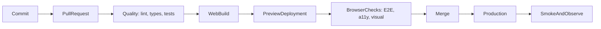

Frontend CI/CD is the system that turns a commit into evidence and, eventually, a release. It is more than a YAML file: it defines which checks must pass, which artifact is trusted, who may promote it, and how the team recovers when production is unhealthy.

This guide uses a **fictional** TypeScript product with a React web app and shared packages. Commands such as `pnpm deploy:web` are deliberate provider-neutral boundaries; a real team implements them with its chosen hosting platform. The example artifact is a static `dist` directory. A server-rendered React app produces a different bundle shape, but the rule does not change: **build once, record a digest, test those bytes, and promote the same artifact**. React Native delivery — EAS Workflows, stage secrets, and store submission — is [React Native CI/CD with EAS Workflows](/notes/react-native-ci-cd-with-eas-workflows).

<br />

---

## 1. CI, Continuous Delivery, and Continuous Deployment

These terms describe different promises.

| Practice                        | Promise                                                       | Typical trigger                     |
| ------------------------------- | ------------------------------------------------------------- | ----------------------------------- |
| **Continuous Integration (CI)** | Every change is merged frequently and automatically validated | Pull request or push                |
| **Continuous Delivery**         | Every accepted commit produces a releasable artifact          | Successful CI, then human approval  |
| **Continuous Deployment**       | Every accepted commit is released automatically               | Successful CI on the release branch |

React web can support either delivery model. The team can usually publish an immutable artifact and switch traffic to it within minutes. Whether a human must approve production is a **policy** choice, not a platform limitation.

Do not call a pipeline “continuous deployment” merely because it runs `build`. A build that remains on a CI runner has not been delivered anywhere.

<br />

---

## 2. A Production-Shaped Example

Assume a workspace with explicit boundaries:

```text
apps/
  web/                  React web application
packages/
  api-client/           typed transport and generated contracts
  domain/               framework-independent business rules
  ui-tokens/            shared colors, spacing, and typography
scripts/
  deploy-web.mjs        provider adapter for preview and production
.github/workflows/
  pull-request.yml
  release-web.yml
```

The exact monorepo tool is less important than one property: every check must be runnable locally with the same command CI uses.

```json title="package.json"
{
  "packageManager": "pnpm@10.15.0",
  "scripts": {
    "format:check": "prettier --check .",
    "lint": "eslint . --max-warnings=0",
    "typecheck": "tsc -b --pretty false",
    "test": "vitest run --coverage",
    "build:web": "pnpm --filter web build",
    "test:e2e:web": "playwright test",
    "smoke:web": "pnpm test:e2e:web --grep @smoke",
    "deploy:web": "node scripts/deploy-web.mjs"
  }
}
```

Pin the package-manager version and commit the lockfile. `pnpm install --frozen-lockfile` should fail if `package.json` and the lockfile disagree; CI must not silently resolve a different dependency graph.

<br />

---

## 3. The End-to-End Pipeline

Keep the validation path fast. Preview and production are the same artifact at different traffic pointers.



A practical target:

1. **Before push:** format and lint changed files.
2. **Pull request:** install, lint, format, type-check, test, build, and scan. What "scan" must prove is [DevSecOps](/notes/devsecops).
3. **Preview:** deploy the web artifact; run browser, accessibility, and visual checks against its URL.
4. **Merge:** create a production candidate from the reviewed commit.
5. **Release:** promote the same artifact. Do not rebuild.
6. **Verify:** run smoke tests and watch errors, performance, and business signals.
7. **Recover:** point production traffic at the last known-good release.

<br />

---

## 4. Pull-Request CI with GitHub Actions

Start with least privilege, cancellation of stale runs, deterministic installation, and parallel jobs.

```yaml title=".github/workflows/pull-request.yml"
name: Pull request

on:
  pull_request:

permissions:
  contents: read

concurrency:
  group: pr-${{ github.event.pull_request.number }}
  cancel-in-progress: true

env:
  NODE_VERSION: "22"
  PNPM_VERSION: "10.15.0"

jobs:
  quality:
    runs-on: ubuntu-latest
    timeout-minutes: 15
    steps:
      - uses: actions/checkout@v4
      - uses: pnpm/action-setup@v4
        with:
          version: ${{ env.PNPM_VERSION }}
      - uses: actions/setup-node@v4
        with:
          node-version: ${{ env.NODE_VERSION }}
          cache: pnpm
      - run: pnpm install --frozen-lockfile
      - run: pnpm format:check
      - run: pnpm lint
      - run: pnpm typecheck
      - run: pnpm test

  web-build:
    needs: quality
    runs-on: ubuntu-latest
    timeout-minutes: 15
    steps:
      - uses: actions/checkout@v4
      - uses: pnpm/action-setup@v4
        with:
          version: ${{ env.PNPM_VERSION }}
      - uses: actions/setup-node@v4
        with:
          node-version: ${{ env.NODE_VERSION }}
          cache: pnpm
      - run: pnpm install --frozen-lockfile
      - run: pnpm build:web
      - uses: actions/upload-artifact@v4
        with:
          name: web-${{ github.sha }}
          path: apps/web/dist
          if-no-files-found: error
          retention-days: 7
```

In a larger system, extract Node and package-manager setup into a **composite action** or reusable workflow. Do not abstract three lines on day one; abstract when many workflows must stay synchronized.

### Why this shape works

- `permissions: contents: read` denies write access unless a job explicitly needs it.
- `concurrency` cancels an obsolete run after another commit reaches the pull request.
- `timeout-minutes` prevents a deadlocked test from consuming a runner indefinitely.
- `needs` makes dependencies visible. Independent jobs can run in parallel.
- Artifact names include the commit SHA, making provenance easier to inspect.
- The package-store cache accelerates installation without treating `node_modules` as a deployable artifact.

For higher supply-chain assurance, pin third-party actions to full commit SHAs and use an update bot to propose upgrades. Version tags such as `@v4` are readable, but they are mutable references.

<br />

---

## 5. Design Quality Gates by Cost and Signal

Put quick, deterministic checks early and expensive environment-dependent checks later.

| Gate               | What it proves                                 | Failure should block         |
| ------------------ | ---------------------------------------------- | ---------------------------- |
| Prettier / ESLint  | Consistent syntax and agreed static rules      | Pull request                 |
| `tsc --noEmit`     | Type contracts compose                         | Pull request                 |
| Unit tests         | Pure logic and domain rules behave correctly   | Pull request                 |
| Component tests    | User-observable component behavior works       | Pull request                 |
| Web build          | Bundler and production configuration are valid | Pull request                 |
| Browser E2E        | Critical journeys work in a real browser       | Merge or release             |
| Accessibility      | Serious automated WCAG violations are absent   | Merge                        |
| Visual regression  | Reviewed pages did not change unexpectedly     | Merge with baseline approval |
| Performance budget | Bundle and key journeys remain within limits   | Merge or release             |
| Post-release smoke | The deployed system is reachable and usable    | Continue rollout             |

Coverage is supporting evidence, not the goal. A pipeline with 95% line coverage can still miss a broken login redirect, a hydration mismatch, or a JavaScript chunk that fails behind a CDN.

Quarantine a flaky test only with an owner, a reason, and an expiry date. Blind retries hide intermittent production risks.

<br />

---

## 6. Preview, Browser Tests, and Promotion

A preview deployment changes E2E from “the app started on localhost” to “the candidate works through its actual hosting boundary.”

```yaml title="Preview and browser checks"
web-preview:
  needs: web-build
  runs-on: ubuntu-latest
  environment: preview
  permissions:
    contents: read
    pull-requests: write
  outputs:
    url: ${{ steps.deploy.outputs.url }}
  steps:
    - uses: actions/checkout@v4
    - uses: actions/download-artifact@v4
      with:
        name: web-${{ github.sha }}
        path: apps/web/dist
    - id: deploy
      env:
        DEPLOY_TOKEN: ${{ secrets.WEB_PREVIEW_TOKEN }}
      run: |
        url="$(pnpm deploy:web --environment preview --artifact apps/web/dist)"
        echo "url=$url" >> "$GITHUB_OUTPUT"

web-e2e:
  needs: web-preview
  runs-on: ubuntu-latest
  timeout-minutes: 20
  steps:
    - uses: actions/checkout@v4
    - uses: pnpm/action-setup@v4
      with:
        version: "10.15.0"
    - uses: actions/setup-node@v4
      with:
        node-version: "22"
        cache: pnpm
    - run: pnpm install --frozen-lockfile
    - run: pnpm exec playwright install --with-deps chromium
    - run: pnpm test:e2e:web
      env:
        BASE_URL: ${{ needs.web-preview.outputs.url }}
```

The deploy command is an adapter: it uploads the supplied artifact and prints the resulting URL. It must not rebuild. Build once, record a digest, test that artifact, and promote the same bytes.

### Frontend-specific preview gates

- Run the few journeys that protect revenue, authentication, data loss, and navigation.
- Scan representative pages with Axe, but keep manual accessibility testing because automation cannot assess every WCAG requirement.
- Capture visual baselines at controlled viewport sizes and fonts.
- Enforce a compressed JavaScript budget and investigate large route-level changes.
- Run Lighthouse or user-flow performance tests in a stable environment; noisy synthetic scores should warn before they block.
- Upload source maps to the error-monitoring system, then prevent public source-map listing if the product requires it.

### Production promotion

Protect the `production` GitHub Environment with required reviewers. A production job should receive the tested artifact’s identifier or digest:

```yaml title="Production promotion"
deploy-production:
  needs: [web-preview, web-e2e]
  if: github.ref == 'refs/heads/main'
  runs-on: ubuntu-latest
  environment: production
  permissions:
    contents: read
    id-token: write
  steps:
    - uses: actions/download-artifact@v4
      with:
        name: web-${{ github.sha }}
        path: apps/web/dist
    - run: pnpm deploy:web --environment production --artifact apps/web/dist
    - run: pnpm smoke:web
      env:
        BASE_URL: https://example.invalid
```

`id-token: write` enables OpenID Connect for short-lived cloud credentials when the provider supports it. Prefer this to permanent access keys. Grant it only to the deployment job, not the pull-request workflow.

<br />

---

## 7. Configuration, Artifacts, and Rollback

Browser code cannot hold a secret. Any value embedded in the web bundle—including variables prefixed with conventions such as `PUBLIC_`—must be treated as public.

Separate:

- **Build-time public configuration:** API origin, analytics project ID, feature defaults.
- **Runtime server configuration:** credentials used only by server functions or a backend-for-frontend.
- **Deployment credentials:** available only to the deployment job.

Decide whether configuration is baked into each artifact or injected at runtime. Baked configuration is simpler and more reproducible; runtime configuration allows one artifact to move through environments but needs a carefully designed loading mechanism.

A static React build and a server-rendered React app fail differently here. A Vite `dist` has no private server runtime: every `import.meta.env` value that reaches the client is public. A Next.js or similar server bundle can keep secrets on the server, but only if those values are never inlined into a Client Component or a public environment prefix.

For rollback:

1. Keep immutable releases addressed by digest or release ID.
2. Change the production alias or traffic pointer to the last known-good release.
3. Purge only the CDN entries that must change; fingerprinted assets should remain immutable.
4. Run smoke checks after rollback.
5. Preserve logs and the failed artifact for diagnosis.

Rebuilding an old Git commit is not as safe as promoting the original artifact: dependencies, base images, and external build services may have changed.

A percentage canary is optional and useful. Feature flags can hide a risky path without rolling back the whole release, but a flag is not a substitute for an immutable artifact you can restore in one traffic switch.

<br />

---

## 8. Secret Boundaries and Deployment Identity

Web deployment looks simple, and that makes it easy to get wrong: a preview token with production scope is enough to publish the wrong site.

- Restrict production deploy credentials to a protected GitHub Environment and trusted branches.
- Use a separate, lower-privilege token for preview deployments.
- Never expose production secrets to pull requests from forks.
- Avoid `pull_request_target` with untrusted code checkout; it can combine write-capable secrets with attacker-controlled code.
- Mask sensitive output and ensure shell tracing does not print credentials.
- Rotate deploy tokens, cloud roles, and monitoring keys before expiry.
- Prefer short-lived identity federation over long-lived access keys.

The pull-request workflow should not be able to deploy production. The production job should not be able to run untrusted pull-request code. Those two identities stay separate even when both live in the same repository.

<br />

---

## 9. Reusable Workflows Without a YAML Monolith

As pipelines grow, separate responsibilities:

```text
pull-request.yml       orchestration and PR permissions
release-web.yml        production web policy
reusable-node.yml      install, lint, types, unit tests
reusable-preview.yml   download artifact, deploy, emit URL
```

Call reusable workflows with explicit inputs and secret inheritance only when required:

```yaml title="Reusable quality workflow"
jobs:
  quality:
    uses: ./.github/workflows/reusable-node.yml
    with:
      node-version: "22"
    secrets: {}
```

Keep policy at the caller:

- which branches or tags trigger;
- which environment must approve;
- what permissions are granted;
- whether a failure blocks promotion.

Keep mechanics in the reusable workflow:

- toolchain setup;
- deterministic install;
- build commands;
- artifact naming and upload.

Avoid a single workflow with dozens of conditionals for preview, staging, and production. It becomes difficult to understand which permissions and secrets each path receives.

<br />

---

## 10. Observability Is Part of Delivery

A green deployment command proves only that the platform accepted an artifact.

After web deployment:

- request the health page and one critical authenticated journey;
- detect console errors and failed asset requests;
- verify the release identifier exposed by the app;
- compare error rate, latency, and key business signals with the previous release;
- confirm source maps resolve stack traces to the correct commit.

Attach a release identity—commit SHA and artifact digest—to logs and telemetry. Without it, “errors increased after release” is harder to prove and reverse.

<br />

---

## 11. Common Failure Modes

| Symptom                                       | Likely cause                                                              | First response                                                     |
| --------------------------------------------- | ------------------------------------------------------------------------- | ------------------------------------------------------------------ |
| CI works locally but not on runners           | Unpinned runtime, lockfile drift, case-sensitive path, hidden local state | Reproduce in a clean container; compare tool versions              |
| Old PR deploy overwrites a newer preview      | Missing concurrency or environment-specific release ID                    | Cancel stale runs; make preview names PR-specific                  |
| E2E is intermittently red                     | Shared data, animation/timing assumptions, unstable selector              | Capture traces; isolate state; wait on observable behavior         |
| Production differs from preview               | Rebuilt artifact or different build-time variables                        | Promote the tested digest; record configuration                    |
| Web deploy succeeds but users see mixed files | Mutable filenames or incorrect CDN cache headers                          | Fingerprint assets; avoid caching HTML as immutable                |
| Client routes 404 after deploy                | Hosting serves files only; SPA fallback or SSR routing is missing         | Configure the platform fallback before calling the deploy green    |
| Source maps are publicly listed               | Maps uploaded next to assets without access control                       | Upload maps only to the error service; block public listing        |
| Rollback restores code but not behavior       | Backend/schema/config change is not backward-compatible                   | Use expand-contract changes and version-aware flags                |

Failure summaries should link directly to traces, screenshots, logs, artifacts, and the commit. Notifications without diagnostic context create noise.

<br />

---

## 12. A Sensible Adoption Order

Do not build the final platform in one pull request.

1. Make lint, type-check, unit tests, and the web build deterministic locally.
2. Run them on every pull request with branch protection.
3. Upload immutable artifacts and record their commit SHA.
4. Add web previews and a small Playwright release-blocking suite.
5. Add accessibility, visual, and performance signals.
6. Protect production with environment approval and short-lived credentials.
7. Add post-release verification, a rehearsed traffic rollback, and optional canary.
8. Measure duration, failure rate, flaky tests, and deployment recovery time.

The mature pipeline is not the one with the most jobs. It is the one that gives fast, credible evidence, minimizes privileged work, promotes the exact artifact that was tested, and makes recovery routine.

Native binaries, over-the-air JavaScript, and Expo EAS are [React Native CI/CD with EAS Workflows](/notes/react-native-ci-cd-with-eas-workflows).
