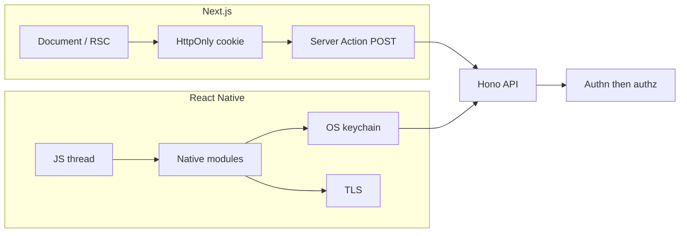

"Frontend security" is not one threat model. A **Next.js** document lives in a browser **origin**. A **React Native** screen lives in a **device**, behind a JavaScript bundle that anyone with the IPA or APK can read. Both UIs are untrusted. Both still talk to the same Hono / Better Auth API. Authorization does not move into the component tree because the renderer changed.

The category map is [Web Security and the OWASP Top 10](/notes/web-security-owasp-top-10). This note is how those failures look in the two clients I actually ship: **Next.js 16 App Router** and **React Native / Expo**.

<br />

It is a defensive reading. I describe failure modes and attacker goals. I do not reproduce exploits.

<br />

---

## 1. Two Hosts

A Next.js request and a React Native request leave the device through different isolation units, then meet the same server:

<br />



<br />

| | Next.js | React Native |
| --- | --- | --- |
| Isolation unit | Browser origin | App ID / keychain access group |
| Session | `HttpOnly; Secure; SameSite` cookie | SecureStore / Keychain / Keystore — never AsyncStorage |
| XSS surface | DOM, `dangerouslySetInnerHTML`, `next/script` | WebView plus any JS bridge you expose |
| Secrets | `server-only` modules; `NEXT_PUBLIC_*` is public | Nothing in the binary is secret |
| Deep entry | `searchParams`, open redirects, `router.push` | Custom URL schemes, universal links, push payloads |

<br />

The shared lie is the same on both: **the UI is not authorization**. Hiding a button, checking a role in a Client Component, or storing `isAdmin` in AsyncStorage does not decide whether a row may be read. The server does. [Understanding Next.js in Depth](/notes/understanding-next-js-in-depth) covers the rendering machinery; [Local Storage, Session Storage, and Cookies](/notes/browser-storage-localstorage-sessionstorage-cookies) covers why the cookie jar is a different primitive from Web Storage. Here the question is what each host can actually enforce.

<br />

---

## 2. The Server/Client Graph

Next.js compiles one source tree into **several module graphs**. `'use client'` is a bundle boundary, not a security flag. Everything that module imports — and everything those imports import — can appear in a browser chunk. A secret that crosses that boundary is a leak at build time, not a styling mistake.

`import "server-only"` makes the contract explicit. A client import then fails the build instead of shipping the database URL:

<br />

```ts
import "server-only"

import { db } from "./db"

export async function getBillingAccount(organizationId: string) {
  return db.query.billingAccounts.findFirst({
    where: (table, { eq }) => eq(table.organizationId, organizationId),
  })
}
```

<br />

`NEXT_PUBLIC_*` is a rebuild-time public constant. It is inlined into client assets. Rotating it means rebuilding those assets. Anything that must stay secret is read at **runtime** on the server, from SST Secrets or the environment the function actually runs in — never prefixed for the browser.

RSC props serialize across the same boundary. A Server Component that passes a privileged object into a Client Component has published it to the browser, Flight payload included. Pass the **public view** the UI needs: a display name, not a session, a Stripe customer id the client should not hold, or a role the client will "enforce."

React's `experimental_taintUniqueValue` and `experimental_taintObjectReference` can fail the render if a tainted secret would otherwise serialize. I treat them as a belt. They do not replace refusing to pass the value. If the Client Component does not need it, it should not be in the props.

`'use client'` too high in the tree also widens XSS blast radius: more JavaScript on the origin, more chance a later Markdown renderer or analytics snippet runs in a fatter graph. Keep client islands small because of hydration and because of the origin.

<br />

---

## 3. Server Actions Are Public POSTs

`'use server'` does not mean "only my form can call this." The build creates a server reference. The browser POSTs that reference plus serialized arguments. From a security perspective the action is an HTTP endpoint that happens to refresh UI.

Next.js adds transport defenses: same-origin checks, encrypted closed-over values, `serverActions.allowedOrigins`, body-size limits. Those reduce CSRF and confused-proxy cases. They do **not** decide whether this session may rename this product. Bound arguments and closed-over IDs are not capabilities. An opaque action id is not a secret.

Authorize beside the write, after parsing input, every time:

<br />

```ts
"use server"

import { updateTag } from "next/cache"
import { z } from "zod"
import { requireEditor } from "@/lib/auth"
import { db } from "@/lib/db"

const Input = z.object({
  id: z.string().uuid(),
  name: z.string().trim().min(1).max(120),
})

export async function renameProduct(formData: FormData) {
  const actor = await requireEditor()
  const input = Input.parse(Object.fromEntries(formData))

  await db.product.update({
    where: { id: input.id, tenantId: actor.tenantId },
    data: { name: input.name },
  })

  updateTag(`product:${actor.tenantId}:${input.id}`)
}
```

<br />

`requireEditor()` reads the session cookie on the **server**. The Client Component that rendered the form is not part of the trust decision. TypeScript on the form fields is not a parser. Zod is. Tenant scope on the `where` is authorization, not a courtesy filter.

Allowed origins belong in `next.config` when the app sits behind a reverse proxy whose host is not the public origin. They are a CSRF / confused-proxy control:

<br />

```ts
const nextConfig = {
  serverActions: {
    allowedOrigins: ["app.example.com"],
    bodySizeLimit: "1mb",
  },
}
```

<br />

The longer argument — progressive enhancement, idempotency, error mapping — lives in the Next.js note's Server Actions section. The security sentence is short: **reachable means callable**.

<br />

---

## 4. `proxy.ts` Is a Cheap Gate

In Next.js 16, root-level `proxy.ts` replaces `middleware.ts`. It runs before the route tree. That makes it the right place for redirects, rewrites, extra headers, and coarse "is there a session cookie at all?" checks. It is the wrong place to be the only authorization.

Matchers miss paths. Rewrites change what the app thinks the URL is. Edge/proxy runtimes should stay cheap: they are on every matching request. A cookie-presence check that redirects to `/login` improves UX. It does not prove the user may load `/organizations/[id]/billing`. That proof belongs next to the data — in the Server Action, the Route Handler, or the Hono API behind them.

<br />

```ts
import { NextResponse } from "next/server"
import type { NextRequest } from "next/server"

export function proxy(request: NextRequest) {
  const session = request.cookies.get("session")
  const isApp = request.nextUrl.pathname.startsWith("/app")

  if (isApp && !session) {
    return NextResponse.redirect(new URL("/login", request.url))
  }

  return NextResponse.next()
}

export const proxyConfig = {
  matcher: ["/app/:path*"],
}
```

<br />

A missing matcher on `/app/export` or a Route Handler under `/api` is not a theoretical gap. I still authorize in the handler. Proxy is a gate on the sidewalk, not the lock on the vault.

Do not copy identity into a request header here and then trust that header in a Server Component. The session cookie is the identity. Anything `proxy.ts` adds is still just a header.

<br />

---

## 5. Cache vs Privacy

Next.js will happily cache a personalized tree if you let it. A shared CDN entry that includes another user's HTML or RSC payload is a privacy incident that looks like a performance win.

Reading `cookies()`, `headers()`, or a user-specific `searchParams` binds the work to **this request**. That output must not become one object for every visitor. Shared catalog fields can be cached. Recommendations, dashboards, and anything keyed by session stay dynamic — or they are cached with a key that is actually private and a `Vary` the CDN honors.

The failure mode is not "forgot `revalidateTag`." It is **caching the wrong audience**. A full-route cache of `/account` is a cross-user leak waiting for a hit. Split the tree: public catalog under `'use cache'` or ISR; the session-shaped region stays a request-time Server Component.

<br />

```tsx
import { cookies } from "next/headers"
import { getBillingSummary } from "@/lib/billing"

async function BillingPanel() {
  const session = (await cookies()).get("session")?.value
  const summary = await getBillingSummary(session)

  return (
    <BillingSummaryView
      currency={summary.currency}
      nextInvoice={summary.nextInvoice}
    />
  )
}

export default async function AccountPage() {
  return (
    <>
      <Catalog />
      <BillingPanel />
    </>
  )
}
```

<br />

`Catalog` can be cached for everyone. `BillingPanel` reads the cookie on the server and passes **display fields** into the client view, not the session. The Next.js note's cache section is the mechanism; the security rule is: if it would be wrong to show user A's page to user B, it does not belong in a shared cache.

Source maps follow the same audience rule. Error tracking may need them. A public `/.map` dump is a source leak.

<br />

---

## 6. XSS in React and Next.js

React escapes text children. `{user.name}` in a `<p>` is data. That default is why most React apps are not a constant XSS fire drill. The remaining holes are the places we opt out:

- `dangerouslySetInnerHTML` — the name is the warning. CMS HTML, Markdown pipelines, and "rich text from the API" are the usual sources. If the product truly needs markup, sanitize with a maintained library on the **server** before it reaches the client, then still assume a miss:

<br />

```ts
import "server-only"
import { JSDOM } from "jsdom"
import createDOMPurify from "dompurify"

const purify = createDOMPurify(new JSDOM("").window)

export function sanitizeArticleHtml(html: string) {
  return purify.sanitize(html, { USE_PROFILES: { html: true } })
}
```

<br />

The Client Component then renders a string the server already reduced. Sanitization is not a license to skip CSP.

- `next/script` and inline snippets — third-party tags are script on your origin. Prefer `next/script` with an explicit strategy over ad-hoc injection, and keep the allowlist of hosts in CSP.
- User-controlled `href`, `src`, and `router.push` — a non-http(s) scheme in a destination is an injection into the page context. Do not concatenate `searchParams` into those APIs.
- Hydration is not a sanitizer. Markup that is unsafe on the server is unsafe after hydrate.

CSP is a **backup**, not a substitute for not rendering untrusted HTML. The header set I start from is in the OWASP note's misconfiguration section. Next.js can emit those headers from `next.config` or `proxy.ts`; the policy still has to match the scripts you actually load.

Trusted Types, where the browser supports them, shrink the remaining `innerHTML` sinks. I do not treat them as required for every marketing site. I do treat `dangerouslySetInnerHTML` as a review comment every time.

<br />

---

## 7. Untrusted Navigation

`searchParams`, callback URLs, and `next/image` sources are attacker-controlled input that happens to look like routing.

Open redirects: a `?next=` parameter that you pass to `redirect()` or `router.push` will send the user wherever the link said. Allowlist **paths on this origin**, reject protocol-relative URLs, and default to a known-safe location:

<br />

```ts
const ALLOWED_NEXT = new Set(["/app", "/settings", "/billing"])

export function safeNextPath(value: string | undefined) {
  if (!value || !value.startsWith("/") || value.startsWith("//")) {
    return "/app"
  }

  return ALLOWED_NEXT.has(value) ? value : "/app"
}
```

<br />

`searchParams` used as a query, a filter, or an id still belong in Zod on the server. The URL is not a trusted database. A public `?preview=true` that skips auth because a Server Component checked the query string is an insecure design, not a routing trick.

`next/image` will fetch remote URLs you allow. `remotePatterns` is an allowlist against using the optimizer as an open proxy:

<br />

```ts
images: {
  remotePatterns: [
    {
      protocol: "https",
      hostname: "cdn.example.com",
    },
  ],
}
```

<br />

A wildcard hostname here is the same class of bug as fetching a caller-supplied URL from a Server Action. Prefer a specific host. Local static imports do not need this; user-uploaded or CMS images do.

<br />

---

## 8. The Bundle Is Not a Secret

React Native's threat model starts where Next.js's server graph ends. There is no `'use client'` fence. Metro's output ships on the device. Anyone who can install the app can inspect the JavaScript. API keys, "hidden" feature flags, and hardcoded HMAC secrets in the bundle are public constants with extra steps.

The attacker goal is **credentials that were never supposed to leave the build laptop**: a Firebase admin-shaped key that was only meant for the app, a shared API secret, a bypass flag.

Defense is the same sentence as `NEXT_PUBLIC_*`, applied to the whole binary: **the app holds public identifiers and user-bound tokens, not authority**. The Hono API still authenticates every call.

Public by design, and fine in the binary: a Mapbox public token with URL restrictions, a Firebase *client* config, an OAuth client id for a public native client. Not fine: a database URL, an HMAC that mints sessions, a "debug admin" compile-time flag that skips auth, a Stripe secret key. Expo's `extra` in `app.json` is still in the bundle. EAS secrets that are baked into the client at build time are `NEXT_PUBLIC_*` again.

I also assume release JS can be pretty-printed. Hermes bytecode slows casual reading; it is not encryption. Treat minification as size, not secrecy.

Identity on mobile is a **short-lived access token in memory** plus a **refresh token in the OS secret store**, issued by the same Better Auth (or OAuth) server the web app uses. I do not put session material in AsyncStorage, Redux Persist, or unencrypted MMKV. Those are `localStorage` with a native accent: any JS in the app, and often the backup disk, can read them.

Jailbreak / root detection is not a boundary. It is a weak signal. I do not build product security on it.

<br />

---

## 9. SecureStore, Keychain, and Keystore

iOS Keychain and Android Keystore are the isolation unit that cookies are on the web. `expo-secure-store` (or a thin wrapper over the same APIs) is how JS asks the OS to hold a blob the rest of the app should not casually dump to disk.

<br />

```ts
import * as SecureStore from "expo-secure-store"

const REFRESH_KEY = "auth.refresh"

export async function persistRefreshToken(token: string) {
  await SecureStore.setItemAsync(REFRESH_KEY, token, {
    keychainAccessible: SecureStore.WHEN_UNLOCKED_THIS_DEVICE_ONLY,
  })
}

export async function readRefreshToken() {
  return SecureStore.getItemAsync(REFRESH_KEY)
}

export async function clearSession() {
  await SecureStore.deleteItemAsync(REFRESH_KEY)
}
```

<br />

`WHEN_UNLOCKED_THIS_DEVICE_ONLY` keeps the refresh token off iCloud Keychain backups when the product does not need cross-device restore. That is a product trade-off, not a universal rule. Access tokens stay in memory when the session can be refreshed; a process death then costs a refresh, not a stolen long-lived bearer in a world-readable file.

SecureStore is not magic. A compromised device, a malicious keyboard, or a backup you opted into can still expose it. It is the right **app-side** store for refresh tokens the way `HttpOnly` is the right browser-side store for session ids. The server still rotates, expires, and revokes.

Screenshot and recents protection (`FLAG_SECURE`, iOS screen-capture notifications) is policy for banking-shaped screens. It is not cryptography. I use it where a flash of a membership barcode or a health record in the app switcher is the actual harm.

<br />

---

## 10. TLS and Pinning

On the web, the browser and Let's Encrypt did most of this for you. On mobile, the OS still verifies the public PKI: **App Transport Security** on iOS, **Network Security Config** on Android. Cleartext HTTP is off unless you explicitly punch a hole. I do not punch holes for production API hosts.

A typical Android baseline is: system CAs only, no cleartext:

<br />

```xml
<network-security-config>
  <base-config cleartextTrafficPermitted="false">
    <trust-anchors>
      <certificates src="system" />
    </trust-anchors>
  </base-config>
</network-security-config>
```

<br />

Certificate pinning is defense in depth for high-risk apps: the client additionally requires a known key or SPKI for `api.example.com`. It raises the cost of a rogue CA or a corporate TLS-intercept box. It also means **you need a rotation story** before the pin expires, or you ship a brick. I pin only when the threat model includes hostile networks and the team can rotate pins with an app update or a backup pin.

I am not going to discuss bypassing pins. The defensive bar is: ATS / NSC on, no user-installed CAs trusted for the API if the OS lets you say so, pinning only with rotation, and the API still requires a real user session. Transport security does not replace authorization.

<br />

---

## 11. Deep Links

A custom URL scheme (`myapp://`) is not an origin. Other apps on the device can often register the same scheme. A verified **universal link** (iOS) or **App Link** (Android) is associated with an HTTPS domain you control. That is the mobile equivalent of "this navigation came from a host we proved."

The attacker goal is **to open the app on a chosen path with chosen query params**: an OAuth redirect, a password-reset token, a campaign URL that sets `organizationId`, a promo code that the app trusts because it arrived in-app.

Defense:

- Prefer associated domains over raw schemes for anything that carries a token or chooses an account.
- Treat every incoming URL as untrusted input. Parse it. Allowlist paths. Do not execute whatever query string arrived.
- OAuth on mobile goes through the **system browser (or in-app browser tab) plus PKCE**, not an embedded WebView that the app can script. The app never sees the user's password; it sees an authorization code that the OS delivered to the claimed redirect.
- FCM (and other push) payloads are the same class. A campaign deep link that opens a membership offer is marketing. A push that the client interprets as "mark this invoice paid" is an unsigned RPC. The membership apps I shipped used Firebase Cloud Messaging for promos and milestones — the URL was a hint to navigate, not a command to mutate.

<br />

```ts
import * as Linking from "expo-linking"

const CAMPAIGN_PATHS = new Set(["/offers", "/card", "/inbox"])

export function pathFromDeepLink(url: string) {
  const parsed = Linking.parse(url)
  const path = parsed.path ? `/${parsed.path}` : "/"

  if (!CAMPAIGN_PATHS.has(path)) {
    return "/home"
  }

  return path
}
```

<br />

Query params from that URL still need the same Zod treatment as Next.js `searchParams`. They do not become `fetch` bodies without a session.

<br />

---

## 12. WebView

A WebView is a **browser origin inside the app**. HTML it loads can run script in that origin. If you also expose a JavaScript bridge into native modules — camera, file system, session store — you have given that page a privileged RPC.

The attacker goal is **to run script in the WebView with the app's privileges**: a loaded help article, a payment iframe you thought was sealed, a `file://` page, a redirect to content you do not control.

Defense is to treat third-party or CMS HTML as you would on the web, then remove the extra guns:

- Prefer an **in-app browser tab** (Safari View Controller / Chrome Custom Tabs, `expo-web-browser`) for pages that are not your UI. They get the real browser's origin isolation and the system cookie jar, not your bridge.
- If you must WebView your own content, lock navigation to an allowlisted https origin, disable file access you do not need, and do not inject a bridge that can read SecureStore or fire authenticated API calls.

<br />

```tsx
const ALLOWED_HOST = "help.example.com"

function onShouldStartLoadWithRequest(request: { url: string }) {
  try {
    const url = new URL(request.url)
    return url.protocol === "https:" && url.hostname === ALLOWED_HOST
  } catch {
    return false
  }
}
```

<br />

`injectedJavaScript` is `dangerouslySetInnerHTML` for native. User content does not belong there.

A membership card rendered in React Native views does not need a WebView. A partner FAQ often does not either.

<br />

---

## 13. Native Modules and Push

Third-party native code is supply chain with a second compiler. An npm package that also ships an Android Gradle plugin or a CocoaPod can do anything the OS grants the app: network, keychain access you configured, camera. The OWASP supply-chain category applies; the extra fact is that **JS review does not see the native half**.

I pin versions, read what `autolinking` pulled in, and treat a new native module as a permissions review: what entitlements does this add? Does a camera SDK need Bluetooth? Does an analytics SDK need the advertising identifier?

A **device push token** identifies a device to APNs or FCM. It does not identify a user. Binding a token to an account happens on the server after a verified session. Losing the token, or accepting a token the client posted for someone else, is how notifications leak to the wrong person.

<br />

```ts
export async function registerPushToken(deviceToken: string) {
  await api.post("/devices", { deviceToken })
}

export async function logout() {
  await api.post("/devices/unregister").catch(() => undefined)
  await clearSession()
}
```

<br />

Register the token on login; unregister on logout; do not authorize a mutation because a push arrived. `/devices` still authenticates with the session from SecureStore — the token is a destination, not a credential.

The JS thread can be paused; native work continues. That is a correctness issue and a security issue when a logout must also cancel in-flight uploads and wipe SecureStore. Logout is a native operation, not only a React state reset.

<br />

---

## 14. Defaults I Use

**Next.js**

- Secrets stay behind `server-only`. `NEXT_PUBLIC_*` is for public identifiers. RSC props are a public API.
- Server Actions and Route Handlers authenticate and authorize on the server, after Zod. `proxy.ts` is a cheap cookie gate, not the lock.
- Personalized HTML and RSC never go in a shared cache.
- Text is data. Markup is a review. Navigation and `remotePatterns` are allowlists. CSP backs the origin; it does not define it.

**React Native**

- The bundle is public. Refresh tokens live in SecureStore / Keychain, not AsyncStorage. Access tokens stay in memory when the product allows.
- ATS / Network Security Config on; pinning only with a rotation plan.
- Universal links over raw schemes. OAuth via system browser and PKCE. Deep links and push payloads are untrusted input.
- No privileged WebView bridge. Logout wipes the secret store and the push binding.

Both still end at the same sentence as the OWASP note: the origin (or the keychain), the session, and the authorization check are the product. The renderer is not.
