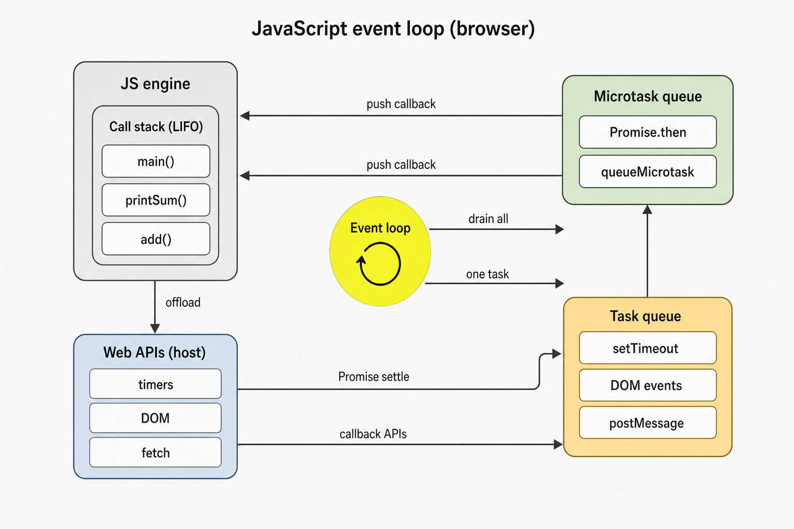
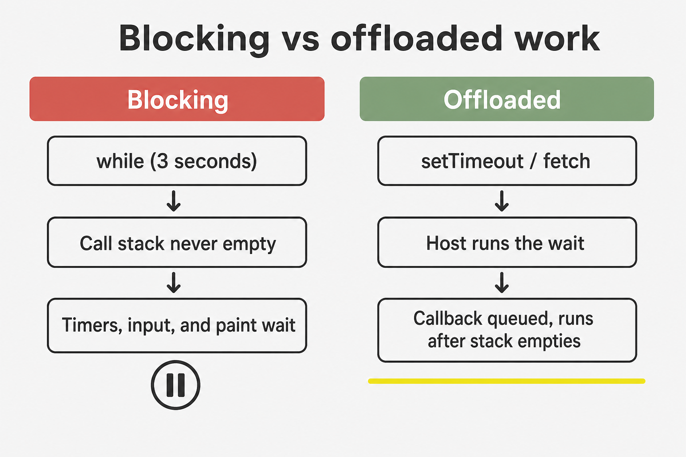
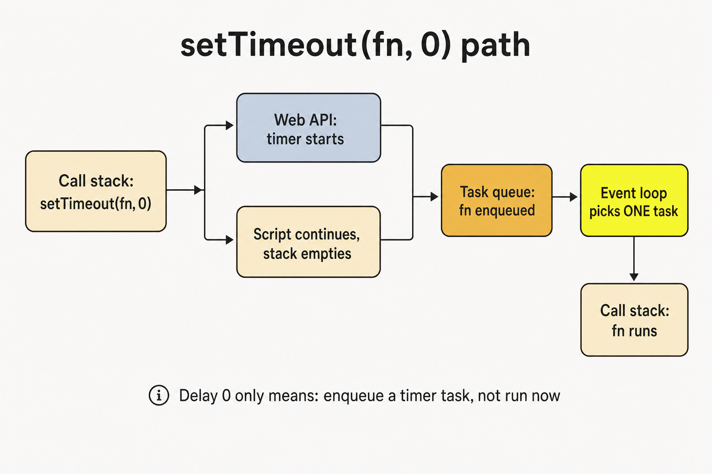
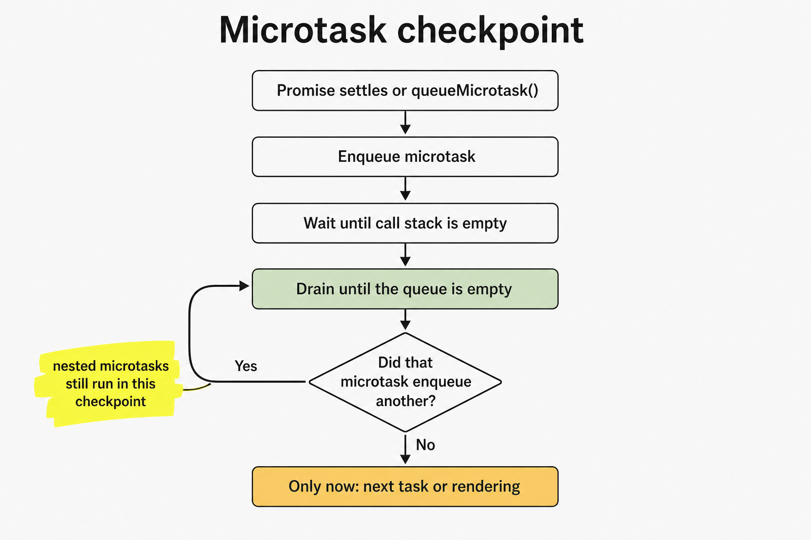
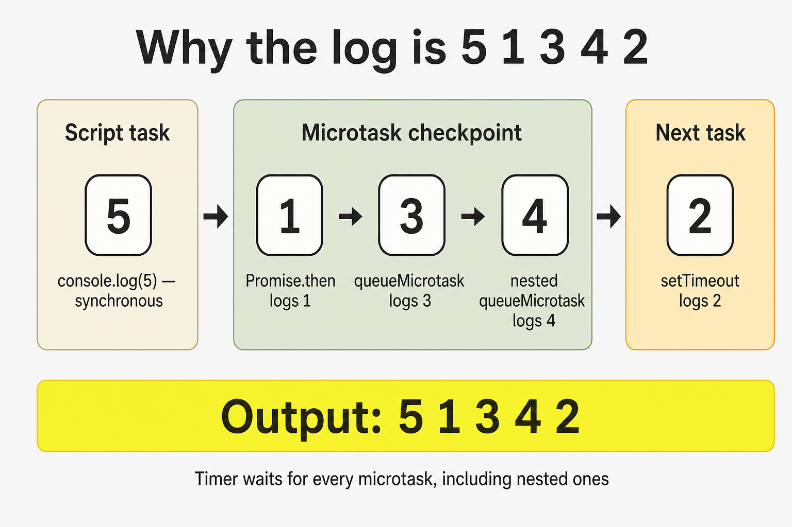
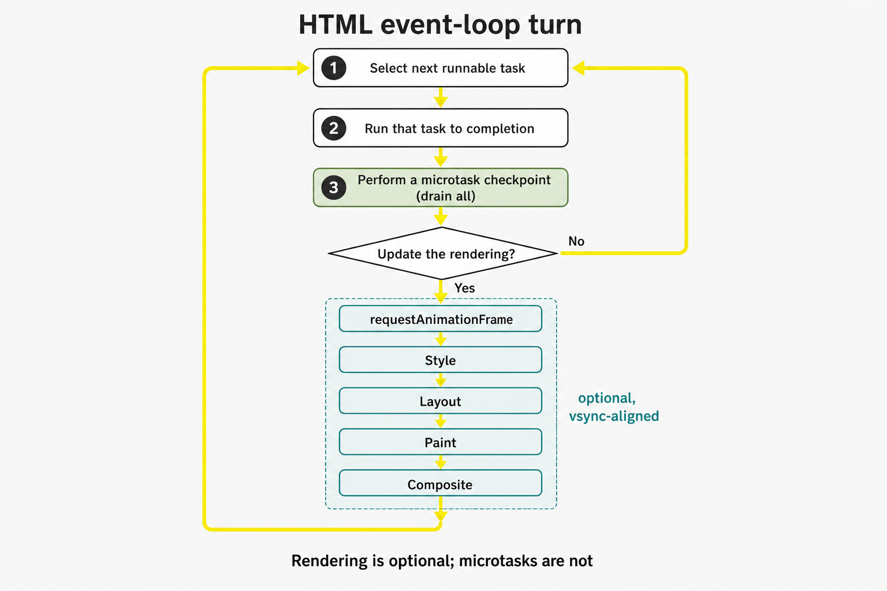
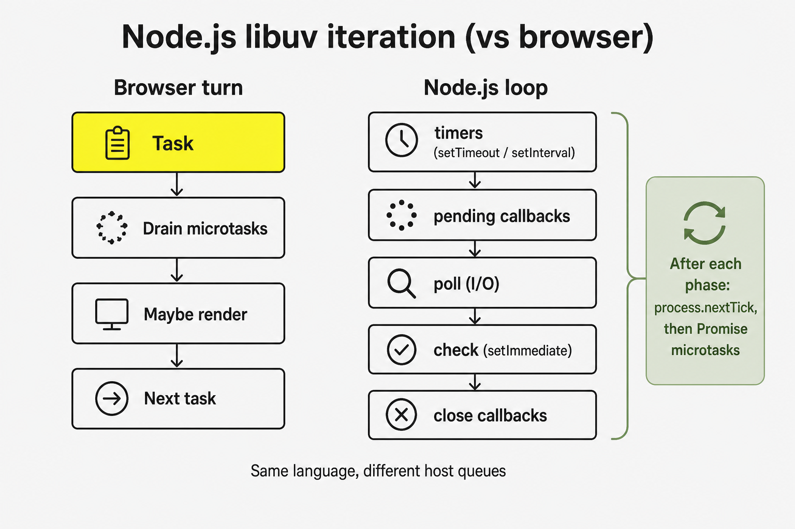

JavaScript is single-threaded. That does not mean the browser is idle while a timer ticks or a network response arrives. It means **the engine runs only one piece of JavaScript at a time**, on a **call stack**, while the **host** — the browser, Node.js, Deno — does other work in the background and later asks the engine to run callbacks.

The coordinator for that handoff is the **event loop**. It is not a JavaScript feature. ECMAScript specifies how functions call each other and how Promise jobs are queued. The HTML Standard specifies how a browser turns those jobs, timers, input, networking, and rendering into a repeating turn: run one **task**, drain **all microtasks**, maybe **update the rendering**, then take another task.

This note follows that model in the same order as [Lydia Hallie's visualization](https://www.youtube.com/watch?v=eiC58R16hb8): stack, host APIs, task queue, microtask queue, then the classic `5 1 3 4 2` ordering puzzle. After the video's recap it continues into the WHATWG algorithm, rendering starvation, Node.js as a different host, and workers. The survey version of the same runtime is [Core JavaScript Concepts](/notes/core-javascript-concepts).

<br />



<br />

Synchronous code runs on the stack. Host APIs finish work off the stack and enqueue a callback. Whenever the stack is empty, the event loop prefers the **microtask queue** and empties it completely, then moves **one** task onto the stack.

---

## 1. The Call Stack

The **call stack** is a last-in, first-out record of what the engine is currently executing. Calling a function pushes an **execution context**. Returning or throwing pops it. Only the frame at the top runs.

<br />

```ts
function add(a: number, b: number): number {
  return a + b
}

function printSum(): void {
  const result = add(2, 3)
  console.log(result)
}

printSum()
```

<br />

The stack grows `printSum` → `add`, then shrinks as each function returns. Nothing else — no timer callback, no click handler, no Promise `.then` — can run while those frames are still there. JavaScript does not preempt the current function to go do something else.

That is the single-threaded constraint. A tight loop does not "share the thread." It owns it:

<br />

```ts
const start = Date.now()
while (Date.now() - start < 3000) {
  // The page cannot paint, handle clicks, or fire timers.
}
```

<br />



<br />

The useful question is not "is this asynchronous?" It is **does this keep a frame on the stack, or does it return and let the host finish the work?**

---

## 2. Web APIs Are the Host, Not the Engine

V8, JavaScriptCore, and SpiderMonkey evaluate JavaScript. They do not implement `setTimeout`, `document.querySelector`, or `fetch`. Those are **Web APIs**: interfaces the host exposes to script.

When script calls a callback-based host API, the typical path is:

1. The call runs on the stack and returns almost immediately.
2. The host starts the actual work — a timer, a network request, a DOM listener.
3. When that work completes, the host does **not** push the callback onto the stack. It places it on a queue and waits for the event loop.

<br />

```ts
console.log("A")

setTimeout(() => {
  console.log("C")
}, 1000)

console.log("B")

// A, B, then C after the timer and after the stack is empty
```

<br />

`setTimeout` itself is synchronous. It only **schedules**. The delay argument is handed to the host. One second later the host has a callback ready. Whether that callback runs at 1000ms, 1004ms, or much later depends on the stack and on queues described below — not on the timer alone.

The same split applies to other callback-based APIs: `addEventListener`, `XMLHttpRequest`, `MessageChannel`, older Node `fs.readFile(path, cb)`. Completion happens in the host. Resumption happens through a queue.

Promise-based APIs still use the host for the I/O. The difference is which queue the **continuation** joins. `fetch(url).then(onResponse)` waits on the network in the host, then queues `onResponse` as a **microtask** once the Promise settles. That distinction is the rest of this note.

---

## 3. The Task Queue

The HTML Standard calls these **tasks**. Informal writing often says **macrotasks**. Timers, user input, `postMessage`, parsing a classic `<script>`, and many networking callbacks become tasks.

A simplified rule is enough for most debugging:

- The event loop runs **one** selected task.
- It then performs a **microtask checkpoint**.
- Only after that does it consider another task.

A nested `setTimeout` therefore cannot continue inside its parent's current turn. It schedules **future** work:

<br />

```ts
const order: string[] = []

setTimeout(() => {
  order.push("timeout-1")
  setTimeout(() => {
    order.push("timeout-2")
  }, 0)
}, 0)

setTimeout(() => {
  order.push("timeout-3")
}, 0)

// Typical order: timeout-1 → timeout-3 → timeout-2
```

<br />

One global FIFO queue is a cartoon. The host maintains **task sources** — timer, DOM manipulation, user interaction, networking, history traversal — and may have more than one queue. The event loop **selects** a runnable task from a source. Starvation of one source is possible in theory; in practice the mental model "one task, then microtasks" still predicts what your code does.

Script evaluation is itself a task. The file you load, or the classic script the parser executes, is the first task of that story. Everything that happens "at the top level" of a module or script is that task running to completion.

---

## 4. `setTimeout(fn, 0)` Is Not Immediate

A delay of `0` means "as soon as you are allowed to run a timer task," not "before the next line." The host may also clamp nested timers — HTML requires a minimum of 4ms after a nesting level of 5 — but clamping is secondary. The primary delay is the event loop.

<br />



<br />

The callback waits for **all** of the following:

- The current task to finish and the stack to empty.
- Every microtask queued so far, and every microtask those microtasks enqueue.
- Any earlier tasks already waiting.

That is why a zero-delay timer still loses to `Promise.resolve().then(...)` and to `queueMicrotask(...)`. The timer is ready. It is in the wrong queue.

---

## 5. The Microtask Queue

**Microtasks** are the piece most first explanations omit. After a task finishes and the JavaScript execution context stack is empty, the host performs a **microtask checkpoint**: run the oldest microtask, repeat until the queue is **empty**.

Sources that enqueue microtasks:

- Promise reaction jobs: `.then`, `.catch`, `.finally`
- `async` function continuations after `await`
- `queueMicrotask(fn)`
- `MutationObserver` callbacks

<br />



<br />

Draining until empty is the important rule. A microtask that calls `queueMicrotask` or resolves another Promise adds work to the **same** checkpoint. That work runs before the next timer, click, or paint.

<br />

```ts
const order: string[] = []

setTimeout(() => {
  order.push("task")
}, 0)

queueMicrotask(() => {
  order.push("micro-1")
  queueMicrotask(() => {
    order.push("micro-2")
  })
})

Promise.resolve().then(() => {
  order.push("promise")
})

// After the timeout finally runs:
// micro-1 → promise → micro-2 → task
```

<br />

`queueMicrotask` and `Promise.resolve().then` share one queue. Order is the order they were scheduled. They are not a faster thread. They are a **higher-priority queue on the same thread**.

The risk is the dual of the benefit. An unbounded chain of microtasks never returns to the task queue or to rendering:

<br />

```ts
function starve(): void {
  queueMicrotask(starve)
}

starve()
// Timers, clicks, and frames wait until this stops.
```

<br />

That is not theoretical. A Promise `then` that always schedules another `then`, or an `await` loop that never yields to a task, can freeze a page without a single `while`.

`await` is syntax on top of Promises, not a second scheduler. An `async` function always returns a Promise. Reaching `await` suspends that function and lets the current stack unwind. When the awaited value settles, the remainder of the function is queued as a microtask. Even `await Promise.resolve()` yields. It does not continue synchronously on the next line.

---

## 6. Promisifying a Callback Moves the Continuation

Wrapping a callback-based API in a Promise does not turn the host work into a microtask. It changes **what happens after** the host task runs.

<br />

```ts
function delay(ms: number): Promise<void> {
  return new Promise((resolve) => {
    setTimeout(resolve, ms)
  })
}

delay(0).then(() => {
  console.log("then")
})
```

<br />

`setTimeout` still schedules a **task**. When that task runs, it calls `resolve`. Settling the Promise then queues the `.then` handler as a **microtask**. That microtask runs before the next timer or click, but **after** the timer task that resolved the Promise.

Compare:

<br />

```ts
Promise.resolve().then(() => console.log("microtask first"))
setTimeout(() => console.log("task second"), 0)

delay(0).then(() => console.log("microtask after its timer task"))
```

<br />

The first `.then` is queued during the current task, so it wins the first checkpoint. `delay(0).then` cannot run until its timer task has run. Promisifying delays the **continuation** relative to already-queued microtasks, and advances it relative to later tasks.

This is the video's "promisify" beat: the host API still uses the task queue; Promise reactions still use the microtask queue. You have to know which side of `resolve` you are on.

---

## 7. Walkthrough: Why the Log Is `5 1 3 4 2`

Hallie's challenge is the shortest program that forces every part of the model to show up:

<br />

```ts
Promise.resolve().then(() => console.log(1))

setTimeout(() => console.log(2), 10)

queueMicrotask(() => {
  console.log(3)
  queueMicrotask(() => console.log(4))
})

console.log(5)

// 5, 1, 3, 4, 2
```

<br />

**During the script task**, while the stack is still running the module:

1. `Promise.resolve()` creates an already-fulfilled Promise. `.then` immediately queues its handler on the **microtask** queue. Nothing logs yet.
2. `setTimeout` hands the callback and a 10ms delay to the host. The host starts a timer. The callback is not on any JS queue yet.
3. `queueMicrotask` queues the second microtask.
4. `console.log(5)` is synchronous. It logs **5**.
5. Meanwhile the timer may expire. When it does, the host enqueues `() => console.log(2)` on the **task** queue. That is still the wrong queue to run next.

The script task finishes. The stack is empty.

**Microtask checkpoint:**

6. Oldest microtask: the Promise handler. It logs **1**.
7. Next: the `queueMicrotask` callback. It logs **3**, then queues another microtask.
8. The checkpoint is not done. The nested callback runs and logs **4**.
9. The microtask queue is empty.

**Next task:**

10. The timer callback moves onto the stack and logs **2**.

<br />



<br />

If the 10ms timer had not expired before the checkpoint, the log would still be `5 1 3 4 2` — the timer would simply join the task queue a little later. Microtasks do not wait for the timer. The timer waits for microtasks.

Swap `queueMicrotask` for another `Promise.resolve().then` and the numbers stay in the same queues. The puzzle is not about `queueMicrotask` as a special API. It is about **when the stack empties** and **which queue each callback joined**.

---

## 8. The HTML Event-Loop Algorithm

The visualization is a map. The HTML Standard is the territory. A browser event-loop turn, simplified but closer to the spec:

<br />



<br />

Three details the cartoon usually skips:

**The checkpoint can run whenever the JS stack is empty**, not only at the end of a named "turn." Promise reactions never interrupt the function that resolved them. They run as soon as that stack has unwound.

**Rendering is optional.** The browser aims at the display refresh — often 60Hz or 120Hz — not at "after every task." Skipping a rendering opportunity is normal. Skipping every opportunity because the main thread is busy is jank.

**`requestAnimationFrame` is not a microtask.** It runs during "update the rendering," after the checkpoint and before style and layout. Scheduling DOM writes in rAF aligns them with a frame. Doing heavy computation there still blocks paint; it only times the block to vsync.

The [critical rendering path](/notes/critical-rendering-path-in-the-browser) is what happens inside that rendering branch: style, layout, paint, composite. The event loop decides **when** the branch is allowed to run. A long task delays it. A microtask chain that never empties delays it indefinitely, because the checkpoint must finish first.

That coupling is why "async" JavaScript can still miss frames. `await` in a tight loop yields microtasks, not tasks. To give the browser a chance to paint or handle input, the work has to return to a **task** — `setTimeout`, `scheduler.yield()` where it exists, `MessageChannel`, or a Worker.

---

## 9. Node.js Is a Different Host

The language is the same. The loop is not. Node.js is driven by **libuv** phases, not by HTML's "task, microtasks, maybe render."

A compact picture of one Node iteration:

<br />



<br />

| Mechanism | Browser | Node.js |
| --- | --- | --- |
| Timer callback | Task (timer source) | `timers` phase |
| Promise `.then` / `queueMicrotask` | Microtask queue | Microtask queue, after `nextTick` |
| `process.nextTick` | Does not exist | Drains before Promises, after the current operation |
| `setImmediate` | Does not exist | `check` phase |
| `setTimeout(fn, 0)` vs `setImmediate` | N/A | Order depends on which phase you scheduled from |
| Rendering | "Update the rendering" | None; this is a server |

<br />

`process.nextTick` is the sharp edge. It is **not** a microtask in the HTML sense, and it has **higher** priority than Promise jobs. A `nextTick` loop starves I/O the way a microtask loop starves rendering. Prefer `queueMicrotask` or a Promise when you want "after this stack, before I/O" without jumping the Promise queue.

Do not port browser ordering puzzles to Node and expect the same log. `setImmediate` and `setTimeout(fn, 0)` from the main module are famously unordered. From an I/O callback, `setImmediate` usually wins because `check` follows `poll` in the same iteration.

Deno and Bun sit closer to the browser for timers and microtasks, then add their own I/O. The portable rule is still: **know the host's queues, not only the language's Promises.**

---

## 10. Workers Have Their Own Loops

A **Web Worker**, **Shared Worker**, or **Service Worker** is not a second stack on the same loop. It is another agent: its own heap, its own call stack, its own task and microtask queues, its own event loop.

`postMessage` is a host API. The message is serialized, delivered, and queued as a **task** on the receiving agent's loop. A worker can compute while the page's loop paints. It cannot touch the page's DOM. Sharing memory requires `SharedArrayBuffer` and explicit coordination; it does not merge the two loops.

That is the actual way to get parallelism in browser JavaScript: another event loop, talking through tasks. Offloading a `while` to a worker frees the page's stack. It does not make the worker's own stack preemptive. A worker can still starve **its** timers and **its** message handlers with a long task or a microtask chain.

---

## 11. What Enqueues Where

| API | Queue | Notes |
| --- | --- | --- |
| Sync function call | Call stack, immediately | Blocks everything else |
| `setTimeout` / `setInterval` | Task | Delay is a lower bound |
| `addEventListener` callback | Task | User-interaction or other DOM source |
| `postMessage` / `MessageChannel` | Task | Useful for yielding to rendering |
| `fetch` completion then `.then` | Host I/O, then microtask | The network is not a microtask |
| `Promise.then` / `.catch` / `.finally` | Microtask | Even on an already-settled Promise |
| `queueMicrotask` | Microtask | Same queue as Promise jobs |
| `async` function after `await` | Microtask | `await` always yields |
| `MutationObserver` | Microtask | Runs in the same checkpoint |
| `requestAnimationFrame` | Rendering | After microtasks, before paint |
| `requestIdleCallback` | Idle task | Not a microtask; may never run under load |
| `process.nextTick` | Node nextTick queue | Before Promise microtasks, each phase |
| `setImmediate` | Node `check` phase | After poll |

<br />

When a log order surprises you, three questions usually isolate it:

1. **What is on the stack right now?** That code finishes first, always.
2. **What was queued as a microtask?** It all runs before the next task and before rendering.
3. **What must wait for a later task?** Timers, input, messages, and the next script.

Memorizing `5 1 3 4 2` is less useful than being able to draw those three buckets for any snippet. The event loop is not magic and it is not parallelism. It is a policy for when a single thread is allowed to run the next callback.
