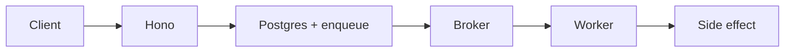
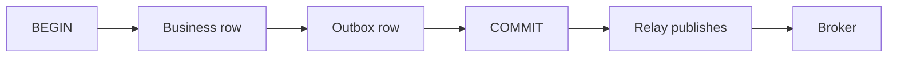

A request cycle is the wrong place for work that is slow, bursty, or must survive this process dying. A **message queue** is a durable buffer between a producer and a consumer. The HTTP handler authenticates, persists the intent, enqueues, and returns **202**.

The typed API through production protect, monitor, and recover is [Backend APIs with Hono, Drizzle, Zod OpenAPI, and SST](/notes/backend-apis-hono-sst). Stages and the deploy loop are [Using SST to Manage AWS Infrastructure and DevOps](/notes/using-sst-for-aws-infra-and-devops). This note is the queue.

<br />

---

## Pattern Map

| Pattern | Typical input | Reach for it when |
| --- | --- | --- |
| Async offload | HTTP request | The response does not need the finished result — email, thumbnails, invoices |
| Fan-out | One event, many subscribers | Several independent consumers must see the same write |
| Buffering | Spike vs worker capacity | Inbound RPS can jump; workers should not |
| Reliability | Side effect that must retry | The work has to happen after this process is gone |

<br />

---

## 1. Why a queue exists

A queue **decouples** the producer from the consumer. The producer does not wait for the side effect. The consumer does not have to be up at the moment of the write.

<br />

- **Decouple.** Hono returns. A worker, maybe on a different process, maybe later, does the email, the webhook, the search index.
- **Buffer.** A 10x spike is a queue-depth problem, not an API-fleet problem. Ingest scales with requests; workers scale with depth.
- **Retry.** The process that accepted the request can die. The broker still has the message. Work that must happen after this box is gone belongs on a queue.

<br />

**Failure:** doing CRM sync, emails, and domain workflows **in the request** so a spike takes down the API and the provider's retries amplify it. Ingest is a write-ahead log. Everything else is a consumer.

<br />

---

## 2. Producer, broker, consumer

Three roles. The **producer** writes a message. The **broker** stores it durably and hands it out. The **consumer** does the work and **acks**.

<br />



<br />

- The handler stays thin: validate, persist intent, enqueue, **202**. A status row is what the user can read later.
- The broker is the shock absorber — SQS on this stack, or the equivalent. It is not the source of truth for the business write. Postgres is.
- The worker pulls, applies, acks. If it crashes before ack, the broker delivers again.

<br />

```ts title="src/routes/invoices.ts"
app.post("/invoices/:id/send", async (c) => {
  const { id } = c.req.valid("param")
  const eventId = c.req.header("idempotency-key") ?? crypto.randomUUID()

  await db.transaction(async (tx) => {
    await tx.update(invoices).set({ status: "queued" }).where(eq(invoices.id, id))
    await tx.insert(outbox).values({
      id: eventId,
      type: "invoice.send",
      payload: { invoiceId: id },
    })
  })

  return c.json({ id, status: "queued" }, 202)
})
```

<br />

**Failure:** enqueueing work that has not been durably recorded. Crash equals lost intent. If it must happen even when the queue is down, the **database write in the request** is the source of truth; the queue is a relay.

<br />

---

## 3. Stay in the request vs leave it

Work stays on the request cycle when the user **cannot continue without the answer**. It leaves when the HTTP response does not need the finished result.

<br />

| Stays synchronous | Leaves for a queue |
| --- | --- |
| Password check | Email, outbound webhooks |
| Price on screen | Thumbnails, search indexing |
| Payment **authorization** the UI is about to display | Invoices, flaky third parties |

<br />

Even the synchronous path stays thin. Authenticate, persist, return. A payment authorization is a yes or no the UI needs now; charging a card and sending a receipt are not the same job.

<br />

**Failure:** **sync-over-async** — enqueue then block the socket until the worker finishes. The latency, the timeout, and the retry policy of the broker are now the latency of the HTTP request. The other is returning **200** before persist: crash equals lost events.

<br />

---

## 4. Queue vs pub/sub vs stream

A **queue** hands each message to **one** consumer. **Pub/sub** hands the same message to **every** subscriber. A **stream** is a replayable log: consumers keep an offset and can re-read.

<br />

| Shape | Who gets the message | Reach for it when |
| --- | --- | --- |
| Queue | One of N competing consumers | A job should run once — send this invoice |
| Pub/sub | Every subscriber | One write, many independent reactions — cache bust, notify, audit |
| Stream | Each consumer group, by offset | Replay, multiple independent readers, ordered history |

<br />

- Competing consumers on a queue raise throughput. They do not fan out. If two services must both see the order, that is pub/sub or two queues fed from an outbox.
- A stream (Kafka, Kinesis) is not a better queue. It is a log. Offsets, retention, and replay are the point. Using it as a disposable work queue wastes the model.
- Redis pub/sub is a **bus**, not a broker: no durability, no retry. Fine for WebSocket fan-out across instances. Not for invoices.

<br />

**Failure:** one queue, two consumers that both need the event, and calling it fan-out. One of them never sees the message. The other is publishing only in-process — it works on one box, silent on the other three.

<br />

---

## 5. Delivery semantics

**At-most-once** means send and forget: duplicates are rare, **loss is allowed**. **At-least-once** means retry until ack: **duplicates are allowed**, loss is not. Most brokers in production are at-least-once.

<br />

- "Exactly-once" in application space is usually at-least-once **plus an idempotent consumer**. The broker will deliver twice. The consumer must make twice safe.
- Lambda can invoke the same handler twice. A client timeout is not a negative acknowledgment. The network is a lossy queue with variable delay. Design for at-least-once even when the slide says exactly-once.
- Publishers stay boring: same key, same payload. Consumers stay idempotent anyway, because retries still happen.

<br />

**Failure:** treating the broker's "exactly-once" checkbox as a substitute for an inbox. FIFO SQS deduplicates a window. It does not make a double charge impossible after the window, after a crash mid-side-effect, or after a second producer.

<br />

---

## 6. Idempotent consumers

Given at-least-once: a stable **event id**, an **inbox** table with a unique constraint, **database effects and the inbox insert in one transaction**. **Ack after** that durable write.

<br />

```sql
CREATE TABLE inbox (
  event_id   uuid PRIMARY KEY,
  processed_at timestamptz NOT NULL DEFAULT now()
);

-- same transaction as the business effect
INSERT INTO inbox (event_id) VALUES ($1);
UPDATE invoices SET status = 'sent' WHERE id = $2;
```

<br />

- Side effects as **upserts**, not blind increments. `UPDATE … SET sent_at = now() WHERE sent_at IS NULL` is safe to retry. `SET send_count = send_count + 1` is not.
- For Stripe or email, persist an operation row and pass the provider's **idempotency key** before ack. The provider is another at-least-once system.
- A unique constraint on `event_id` is the lock. Check-then-insert races; `ON CONFLICT` is one statement. The schema is the API — [Core SQL Concepts](/notes/core-sql-concepts).

<br />

**Failure:** acking before the side effect, or doing the side effect without recording the id — the retry then double-charges. Catching errors and still acking so the poison message vanishes. At-least-once only helps if failure **nacks** and success is **idempotent**.

<br />

---

## 7. Dual-write and the outbox

The dual-write is: `COMMIT` the business row, then publish. The process can die between them. The row exists; the message does not. Or the message exists; the row rolled back.

<br />



<br />

- The **outbox** fixes it: in the **same Postgres transaction**, the business row and an outbox row are written. A relay publishes to the broker. Delivery is still at-least-once, so consumers stay idempotent.
- Distributed transactions are not run across services. Two-phase commit **blocks on in-doubt transactions** and couples availability of every participant. Each service's database stays transactional; coordination is with messages.
- A **saga** is a sequence of local transactions. If step three fails, **compensations** run for one and two. Compensation is not undo. A payment compensation is a **refund**, with its own audit — durable and retryable.

<br />

**Failure:** skipping the outbox and hoping a send after `COMMIT` is good enough. It fails at the first crash. Treating compensation as a rollback of a distributed transaction is the other — the money already moved.

<br />

---

## 8. Ordering and competing consumers

**FIFO is per key**, not global. A queue with many consumers raises throughput and **breaks order** unless messages that must stay ordered share a key.

<br />

- SQS standard: best-effort order, at-least-once, nearly unlimited throughput. SQS FIFO: per `MessageGroupId`, exactly-once *within a deduplication window*, lower throughput.
- Kafka / Kinesis: order inside a **partition**. Pick the partition key the same way you pick a FIFO group — `invoiceId`, not `tenantId` if one tenant can hot-spot the log.
- Competing consumers: N workers pull from one queue. Throughput scales. Two messages for the same invoice can run at once unless they share a group or the consumer serializes on a row lock.

<br />

**Failure:** requiring global order on a hot queue, then adding consumers to "fix latency." Latency drops. The invoice is sent before it is generated. Order is a keying problem, not a replica-count problem.

<br />

---

## 9. Retry, jitter, DLQ

Classify first. Timeouts, 503s, lock contention, "connection reset" — **retry**. Validation errors, 400s, unknown event types — **do not retry**; they will not heal and they will occupy the consumer forever.

<br />

- Four controls: **exponential backoff** (`base * 2^attempt`, with a cap), **jitter** so ten thousand workers do not wake on the same millisecond, **max attempts** so poison cannot loop all night, **dead-letter queue** after the ceiling with a metric and a page if DLQ depth rises.
- The retry lives in the **queue** (visibility timeout, built-in backoff) or a library with the same shape — not a `while` inside the handler. Retry only **idempotent** handlers.
- A silent DLQ is a lost business event with extra steps. Depth is a page, not a dashboard curiosity.

<br />

**Failure:** retrying a non-idempotent POST, or retrying forever with no DLQ so one bad JSON sits on a hot partition. Backing off **without jitter** after a shared outage is a thundering herd.

<br />

---

## 10. Backpressure

Workers scale on **queue depth**, not inbound RPS. The API absorbs; the worker fleet is the throttle.

<br />

- Visibility timeout must be **longer than the handler**. If the timeout fires while the worker is still running, another consumer takes the same message — a duplicate the inbox must survive.
- Cap concurrency per worker. A handler that opens twenty Postgres sessions and is allowed unlimited in-flight messages will exhaust the pool before the queue looks deep.
- On SIGTERM: stop fetching, finish current messages, **nack** if the deadline hits, close the DB pool last. Draining HTTP but keeping consumers running until kill is how in-flight jobs get a second delivery plus a 502.

<br />

**Failure:** autoscaling the API on RPS while the worker count is a constant. The queue grows without bound, visibility timeouts pile up, and every retry looks like more traffic. The other is a visibility timeout of 30s on a handler that calls a third party that takes 45.

<br />

---

## 11. Broker choices

The broker is a durability and delivery contract, not a brand. On this stack the AWS default is **SQS**, wired through SST the same way the API is — [Using SST to Manage AWS Infrastructure and DevOps](/notes/using-sst-for-aws-infra-and-devops).

<br />

| Broker | Shape | Reach for it when |
| --- | --- | --- |
| **SQS** | Queue, at-least-once, optional FIFO | Default work queue on AWS. Lambda or a worker fleet consumes. |
| **RabbitMQ** | Queue + routing | Complex routing keys, existing AMQP ops, not already on AWS. |
| **Kafka / Kinesis** | Replayable log | Multiple independent readers, ordered history, replay. |
| **Redis lists / streams** | Fast, weaker durability | Ephemeral jobs, caches, fan-out. Not money. |

<br />

- SQS standard is the production default for "do this job." FIFO when a key must stay ordered and throughput allows it.
- Kafka as a work queue without offsets-as-a-product is usually SQS with extra ops. Redis as the invoice broker is a durability bet the AOF will not lose a write during failover.
- The handler still does not know about the broker. An adapter enqueues. Tests can swap the adapter. The inbox and the outbox stay in Postgres.

<br />

**Failure:** picking Kafka because "we might need replay later," then treating consumer groups like competing-consumer queues and wondering why a crashed reader stalls a partition. Or putting the only copy of an invoice send in a Redis list.

<br />

---

## 12. Tenant and traces

A worker that processes "generate invoice" without the tenant on the message **and** a membership check at consume time will write into whichever database connection it happens to hold.

<br />

- Every message carries `organizationId` from the verified request. The consumer opens the RLS transaction for that org. Tenant is not taken from the job payload alone if a client could enqueue it. Isolation that lives only in Hono is one forgotten filter away from a leak — [Building a Multi-Tenant Backend with Hono, Better Auth, Drizzle, and Postgres RLS](/notes/multi-tenant-backend-drizzle-hono-better-auth).
- A **correlation id** is born at the edge and copied everywhere that request goes. Every queue message puts it in **attributes**, not only in a JSON body someone might strip. **W3C `traceparent`** is the structured form.
- Generate if missing, never trust it for auth, and index it. A user's "it failed at 14:02" jumps from the gateway span through the worker that handled the SQS hop.

<br />

**Failure:** HTTP-only ids — the consumer logs a new uuid and the trail dies at the queue. A worker that trusts `organizationId` in the payload with no RLS. The queue did not leak. The consumer did.

<br />

---

## Recap Q&A

<Accordion type="single" collapsible>
  <AccordionItem value="mq-when">
    <AccordionTrigger>1. When should a request leave the request cycle for a queue?</AccordionTrigger>
    <AccordionContent>

      - Work comes off the request cycle when the **HTTP response does not need the finished result**, or when the work is slow, bursty, or must **retry after this process is gone**. Email, outbound webhooks, thumbnails, invoices, search indexing, flaky third parties — that is a **queue**. Authenticate, persist the intent, enqueue, return **202**.
      - It stays synchronous when the user cannot continue without the answer: password check, a price on screen, a payment **authorization** the UI is about to display. Even then the handler stays thin.
      - If it must happen even when the queue is down, the **database write in the request** is the source of truth; the queue is a relay.
      - **Failure:** **sync-over-async** — enqueue then block the socket until the worker finishes. The other is queueing work that has not been durably recorded — crash equals lost intent.

    </AccordionContent>
  </AccordionItem>

  <AccordionItem value="mq-delivery">
    <AccordionTrigger>2. What does at-least-once actually require of the consumer?</AccordionTrigger>
    <AccordionContent>

      - **At-most-once** means send and forget: duplicates are rare, **loss is allowed**. **At-least-once** means retry until ack: **duplicates are allowed**, loss is not. Most brokers in production are at-least-once.
      - "Exactly-once" in application space is at-least-once **plus an idempotent consumer**: a stable **event id**, an **inbox** unique constraint, **effects and the inbox insert in one transaction**. **Ack after** that durable write.
      - Side effects as **upserts**, not blind increments. For Stripe or email, pass the provider's idempotency key **before** ack.
      - **Failure:** acking before the side effect, or doing the side effect without recording the id. At-least-once only helps if failure **nacks** and success is **idempotent**.

    </AccordionContent>
  </AccordionItem>

  <AccordionItem value="mq-outbox">
    <AccordionTrigger>3. Why is COMMIT-then-publish a dual-write, and what does the outbox change?</AccordionTrigger>
    <AccordionContent>

      - `COMMIT` the business row, then publish: the process can die between them. The row exists and the message does not — or the reverse.
      - The **outbox** writes the business row and an outbox row in the **same Postgres transaction**. A relay publishes to the broker. Delivery is still at-least-once, so consumers stay idempotent.
      - Distributed transactions are not run across services. Coordination is with messages. A **saga** is local transactions plus **compensations** — a refund, not undo.
      - **Failure:** skipping the outbox and hoping a send after `COMMIT` is good enough. It fails at the first crash.

    </AccordionContent>
  </AccordionItem>

  <AccordionItem value="mq-retry">
    <AccordionTrigger>4. How do you retry a failing worker without poisoning the queue?</AccordionTrigger>
    <AccordionContent>

      - Classify first. Timeouts, 503s, lock contention — **retry**. Validation errors, 400s, unknown event types — **do not retry**.
      - Four controls: **exponential backoff** with a cap, **jitter**, **max attempts**, **dead-letter queue** after the ceiling — with a metric and a page if DLQ depth rises.
      - The retry lives in the **queue**, not a `while` inside the handler. Retry only **idempotent** handlers. Visibility timeout must be longer than the handler.
      - **Failure:** retrying forever with no DLQ so one bad JSON sits on a hot partition. Backing off **without jitter** after a shared outage is a thundering herd. A silent DLQ is a lost business event with extra steps.

    </AccordionContent>
  </AccordionItem>

  <AccordionItem value="mq-shapes">
    <AccordionTrigger>5. When is a queue the wrong shape — and what do you use instead?</AccordionTrigger>
    <AccordionContent>

      - A **queue** hands each message to **one** of N competing consumers. Right for "send this invoice."
      - **Pub/sub** hands the same message to **every** subscriber. Right for one write, many independent reactions. Redis pub/sub is a bus, not a broker — fine for WebSocket fan-out, not for invoices.
      - A **stream** is a replayable log. Offsets, retention, and replay are the point. Kafka as a disposable work queue wastes the model.
      - **Failure:** one queue, two consumers that both need the event, and calling it fan-out. One of them never sees the message.

    </AccordionContent>
  </AccordionItem>
</Accordion>
