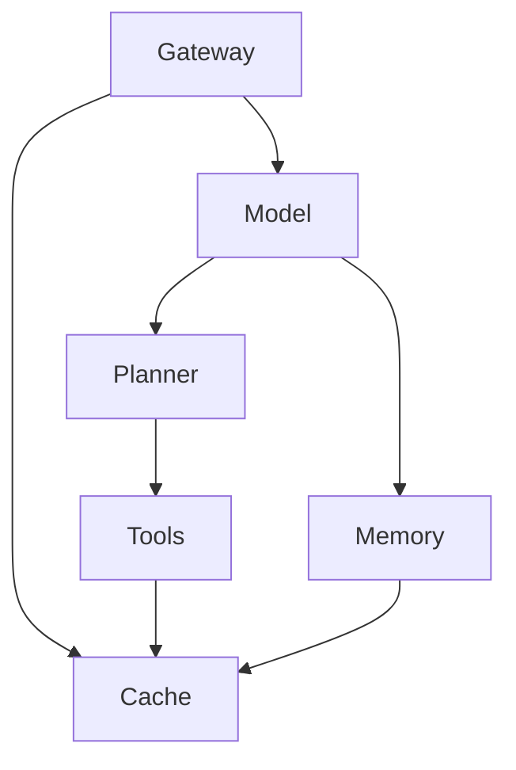
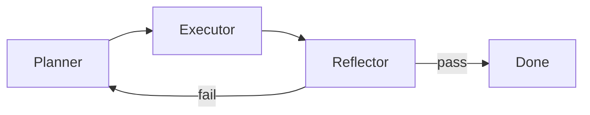

Production agents fail at the harness, not the model. A stronger LLM does not replace identity checks, retry bounds, cache invalidation, or capacity isolation. The model chooses the next action. The system decides whether that action is allowed, how long it may run, and what happens when it is wrong.

白白说大模型 walks the same ground as a ByteDance-style interview set in [Agent系统架构与工程落地十连问快问快答](https://www.youtube.com/watch?v=x-s1Dbp4BE4). This note is a production reading of those ten questions for a **Mastra**, **Hono**, **Better Auth**, and **Pinecone** stack. Where tokens live is covered in [Four levels of agent memory](/notes/four-levels-of-agent-memory). Where documents become searchable is covered in [How to build a RAG system](/notes/how-to-build-a-rag-system). Cache and queues are the same primitives as in [Caching in System Design](/notes/caching-in-system-design) and [Message Queues in System Design](/notes/message-queues-in-system-design).

<br />

---

## 1. Six-layer production shape

Do not start by drawing boxes. Start by naming who is allowed to do what. A production agent is six layers that already exist in ordinary backends, with a model sitting in the middle of the request:

<br />



<br />

| Layer        | Job                                                                 | In this stack                                              |
| ------------ | ------------------------------------------------------------------- | ---------------------------------------------------------- |
| **Gateway**  | Authenticate, rate-limit, and route the session                     | Hono + Better Auth. Org membership before the agent runs   |
| **Model**    | Infer and decide the next step                                      | The LLM. Not a source of identity                          |
| **Memory**   | Read and write dialogue and long-lived context                      | Mastra `Memory` plus a store                               |
| **Planner**  | Split intent into executable steps with acceptance criteria         | Agent loop, or a Mastra workflow that bounds the loop      |
| **Tools**    | Touch the world: APIs, databases, search                            | `createTool` with Zod schemas                              |
| **Cache**    | Reuse hot results. Never a second source of truth                   | Redis or equivalent, keyed and versioned                   |

The Gateway is airport security: it runs before anything expensive. Session, `userId`, and `organizationId` come from a verified Better Auth session and membership check, then land in Mastra `requestContext` — the same contract as [Building a Multi-Tenant Backend with Hono, Better Auth, Drizzle, and Postgres RLS](/notes/multi-tenant-backend-drizzle-hono-better-auth). The model never picks the tenant.

**Failure:** putting org, role, or namespace in a tool argument the model can fill in. That is a leak, not a feature.

<br />

---

## 2. Plan, execute, reflect as a state machine

A useful agent is not “think harder.” It is a **state machine** with three roles:

- **Planner** — emit ordered steps and an acceptance check for each. Complex intent becomes a flow the rest of the system can follow.
- **Executor** — call tools and models in that order. It follows the plan. It does not invent a new product surface.
- **Reflector** — validate the result against the acceptance check. On failure, re-plan **with the failure reason attached**, the way a navigator recalculates after a blocked road.

<br />



<br />

Without hard stops, the loop tries to save itself forever and burns the context window. Three locks are not optional:

1. **Max retry rounds** — a ceiling on re-plans, not a suggestion.
2. **Per-step timeout** — a hung tool is a failed step, not a longer wait.
3. **Human fallback** — high-risk or exhausted paths stop and wait for a person.

**Failure:** an unbounded ReAct loop. That is a token incinerator with a chat UI.

<br />

---

## 3. Memory is organization, not length

Longer context is not better memory. Memory that cannot be addressed, expired, or invalidated is just a larger prompt. The ops view is four tiers. They are not the same cut as Mastra’s token-level ladder in [Four levels of agent memory](/notes/four-levels-of-agent-memory) — that note is *where tokens live*. This table is *where durable data lives*:

<br />

| Tier | What it holds                         | Typical store                         | When you read it                    |
| ---- | ------------------------------------- | ------------------------------------- | ----------------------------------- |
| **L1** | Short-term session context (hot)    | Redis, session cache                  | Every turn                          |
| **L2** | Rolling session summary             | Compressed text beside the thread     | When the raw window no longer fits  |
| **L3** | Long-term user or org profile       | Vector recall                         | Sparse facts across sessions        |
| **L4** | Business facts that must not drift  | Postgres / the product database       | Prices, stock, entitlements, policy |

L4 is the source of truth. A vector hit that disagrees with Postgres is a stale index, not a better answer.

Cache keys must be finer than “this user.” A reusable shape is `userId + sessionId + toolId + result`, each key bound to a **TTL**, a **version**, and an **active invalidation** path. A messy cache is worse than no cache: dirty rows pollute every later turn.

**Failure:** treating the context window as the product database, or caching tool results without a version so a price change never lands.

<br />

---

## 4. Vector store by scale

Pick the store for the QPS and the tenancy model you actually have, not the one in last week’s demo.

<br />

| Store        | Fit                                      | Cost of being wrong                                         |
| ------------ | ---------------------------------------- | ----------------------------------------------------------- |
| **Chroma**   | Local prototypes. Fast to start          | No serious distribution. Query quality falls as the corpus grows |
| **Pinecone** | Managed hybrid search. This repo’s path  | Data lives in a vendor. Cost rises with QPS and dimension   |
| **Milvus**   | Private, cloud-native, storage/compute split | You operate it. The payoff is billion-scale retrieval     |

High-QPS product search is not “more vectors.” Category, price, and stock are **filters**, not neighbors. The RAG note already partitions a single Pinecone hybrid index by `namespace = organizationId`. Stay on that path until the corpus and concurrency actually require a self-hosted cluster.

**Failure:** embedding SKUs as prose and hoping cosine similarity enforces “in stock in this region.”

<br />

---

## 5. Function-calling armor

A tool call is an untrusted intern with production credentials. Five checks sit between the model’s JSON and the side effect:

1. **Schema validation** — the call matches the Zod (or JSON Schema) contract.
2. **Parameter completion** — fill server-owned fields from `requestContext`, not from the model.
3. **Permission check** — the session may actually invoke this tool on this row.
4. **Idempotency** — refunds, writes, and sends carry a key so a retry is not a double charge.
5. **Result validation** — the tool output is shaped before it re-enters the context window.

When the same tool fails twice, **circuit-break**:

- Record the error class and **drop that tool from the current context** so the model cannot spin.
- Cut the executor, feed the error into the planner, and force a new plan.
- Return a **rule-based fallback** instead of another hallucinated call.
- Hand off to a human before the token bill and the user experience both collapse.

Identity for permission checks is the session, never a role string in the tool args.

**Failure:** parsing free-text “function calls” or retrying a mutating tool because the model asked again.

<br />

---

## 6. Tool descriptions as contracts

A description is the instruction manual the model actually reads. Vague tools overlap. Overlapping tools get called for the wrong job. The contract has four parts:

- **Purpose** — when to call it.
- **Boundaries** — which data it touches.
- **Input constraints** — required fields and formats.
- **Forbidden uses** — what it must not do, and which tool to call instead.

Inventory lookup is not price lookup. If the description does not say so, the model will use one tool for both.

<br />

```ts title="src/mastra/tools/query-inventory.ts"
import { createTool } from "@mastra/core/tools"
import { z } from "zod"

export const queryInventory = createTool({
  id: "query-inventory",
  description:
    "Call when the user asks whether a specific item is for sale or in stock in a region. Requires item_id (numeric) and region_code (province/city/district). Do not use this for price, coupons, recommendations, rankings, or shop search — call query-price or the matching catalog tool instead.",
  inputSchema: z.object({
    itemId: z.string().regex(/^\d+$/).describe("Numeric product id"),
    regionCode: z.string().min(1).describe("Standardized region code"),
  }),
  execute: async ({ itemId, regionCode }, { requestContext }) => {
    const organizationId = requestContext.get("organizationId")
    return lookupStock({ organizationId, itemId, regionCode })
  },
})
```

<br />

`organizationId` is read from context, not from the schema. The model cannot shop across tenants by inventing an id.

**Failure:** one “do everything” `search` tool whose description is a single sentence.

<br />

---

## 7. Chunk size by corpus

There is no universal chunk size. The unit is **semantic integrity plus recall accuracy**, and it changes with the file:

<br />

| Corpus                 | Size / shape              | Rule                                                                 |
| ---------------------- | ------------------------- | -------------------------------------------------------------------- |
| **Customer-service FAQ** | 300–500 characters      | One question–answer pair per chunk. Do not span two FAQs             |
| **Technical docs**       | 800–1200 characters     | Split on Markdown headings and fenced code. Never bisect a code block |
| **Product records**      | Structured JSON / metadata | Price, material, stock, reviews as fields. Retrieve by filter, not by paragraph |

Layout-aware parsing (Reducto in the RAG note) is the ingest step that makes those splits real. This section is only the policy. Do not re-chunk in the chat turn.

**Failure:** a 2k-token sliding window across an FAQ corpus. Retrieval will return the wrong question with the right-looking answer.

<br />

---

## 8. When retrieval is irrelevant

Vector similarity alone is a lucky dip. If the top hits do not answer the question, debug in order: **chunking → index → rank**. Then apply four levers that already sit on the RAG read path:

1. **Hybrid search** — BM25 (or sparse) for exact tokens, dense vectors for paraphrase. Neither is enough alone.
2. **Query rewrite** — normalize the user’s phrasing before embed (“Apple phone” → “iPhone”) so the index sees the term it was built with.
3. **Reranker** — retrieve a wide candidate set, score it, keep the top two or three. Dumping twenty chunks into the window is how relevance dies.
4. **Hard business filters** — brand, price range, in-stock, `organizationId`. These are predicates, not similarities.

**Failure:** raising `topK` until something looks right. That hides a bad index behind a larger prompt.

<br />

---

## 9. Latency is P95, not average

Users need to **see something quickly**, not wait for the full graph. Optimize the tail:

- **Parallelize** independent tools. If two calls have no data dependency, start them together (`Promise.all`). Serial-by-default is a self-inflicted P95.
- **Cache** high-frequency identical queries in Redis. Skip the model when the answer cannot have changed.
- **Precompute** expensive aggregations offline. A cron that writes a snapshot is cheaper than a tool that joins on every turn.
- **Route** simple intents to a small model. Reserve the large model for decisions that need it.
- **Stream** partial tokens. Long work should go async with visible progress, not a silent 30-second request.
- **Time out**. An external API that will not return is a failed step. Cut it and reflect. Waiting forever is how P95 becomes P100.

**Failure:** measuring mean latency on a chat that fans out five tools in series, then blaming the model.

<br />

---

## 10. Scale the stateless side

The move under load is to **split stateless orchestration from stateful storage**.

- **Gateway** — rate-limit, queue, and shed load before the agent loop. It is a dam, not a passthrough.
- **Stateless workers** — the plan/execute/reflect process, Hono handlers, Mastra runs with no local session files. Horizontal scale (HPA on queue depth and P95) can add replicas in seconds.
- **Stateful resources** — model API concurrency, vector-index connection pools, third-party tool quotas. These do not scale by adding pods. Cap them and isolate waiters.

Separate **long tasks** from **short tasks**. One research crawl that holds a model slot for minutes will starve every “what’s my order status?” turn if they share a pool.

**Failure:** running the agent loop inside the web process and hoping Kubernetes will clone the Postgres connections and the vendor RPM limit.

<br />

---

The model still chooses the next action. The harness bounds retries, identity, cache, and capacity so that choice cannot take the product down with it. The ten questions above are the interview form of that sentence. The video is [here](https://www.youtube.com/watch?v=x-s1Dbp4BE4).
