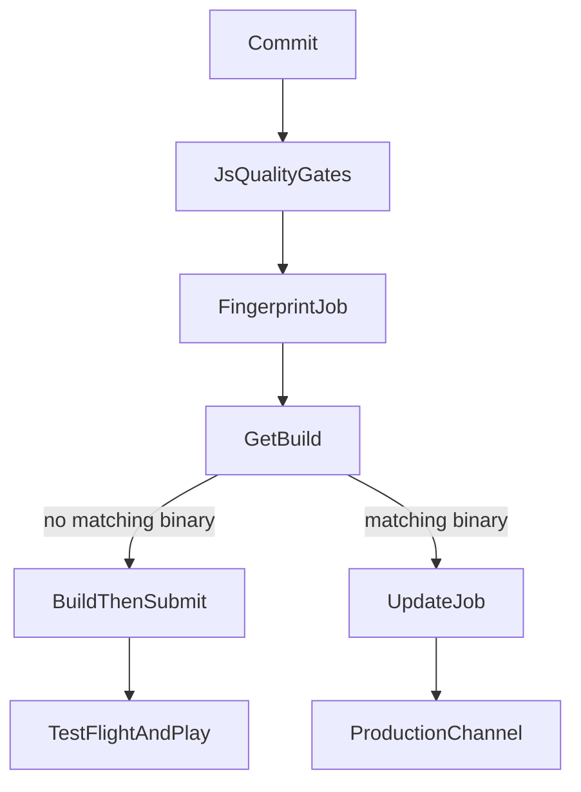
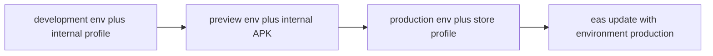
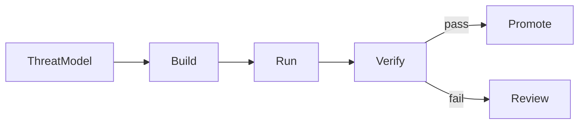

React Native CI/CD is the system that turns a commit into a signed binary, an over-the-air JavaScript bundle, or both — and that can stop a bad release after devices already have it. It is not a YAML file that runs `eas build`. It decides which native surface is trusted, which environment a job may read, who may submit to a store, and how the team recovers when crash-free sessions drop.

The provider-neutral web pipeline is [Frontend CI/CD for React](/notes/frontend-ci-cd-for-react). The general security process is [DevSecOps](/notes/devsecops). The device threat model is [Security in React Native](/notes/security-in-react-native). This note is the Expo playbook: **EAS Workflows** orchestrating Build, Submit, and Update, with GitHub Actions or another org CI keeping the JavaScript quality gates.

This guide uses a **fictional** Expo app that ships through Continuous Native Generation. Native `ios/` and `android/` directories are generated, not committed. The same baseline as [Understanding React Native in Depth](/notes/understanding-react-native-in-depth): Expo is the orchestrator; React Native is the renderer; EAS is the delivery adapter.

<br />

---

## 1. Mobile CD Is Not Web CD

On the web, a team can usually publish an immutable artifact and switch traffic to it within minutes. On React Native, Apple and Google still own part of the timeline. Automation can make a build continuously **deliverable**. It cannot skip store review, signing, or the fact that an installed binary cannot be yanked from every device.

An Expo app ships to three targets. Which EAS service delivers it depends on what changed:

| Target | EAS service | When to use |
| --- | --- | --- |
| App stores | EAS Build and EAS Submit | New releases, native code, permissions, SDK upgrades |
| Installed devices | EAS Update | TypeScript and assets that fit the installed native runtime |
| Web | EAS Hosting | An Expo Router web app alongside native releases |

EAS Build compiles a native binary. That is minutes to hours. EAS Update replaces the JavaScript bundle inside a binary that already contains the matching native surface. That is seconds. A config plugin, a new Expo Module, a permission, or an SDK bump needs a new binary. An EAS Update cannot invent them. That contract is the same one [Understanding React Native in Depth](/notes/understanding-react-native-in-depth) uses for prebuild versus Metro.

Do not call a pipeline “continuous deployment” because it triggered a cloud build. A binary sitting on expo.dev has not been delivered. An update that crashes older clients is not a hotfix.

<br />



<br />

---

## 2. EAS Is Four Services, One Dashboard

**EAS Workflows** is Expo’s CI/CD service. Workflows run on EAS-hosted Linux and macOS workers. They automate builds, over-the-air updates, store submissions, Maestro tests, and EAS Hosting deploys. When the EAS project is linked to GitHub, a push, pull request, label, cron schedule, or App Store Connect event can start a run. Any workflow can also start with `eas workflow:run`, regardless of its `on` trigger.

The other three services are the primitives Workflows sequences:

| Service | Job | What it produces |
| --- | --- | --- |
| **EAS Build** | `type: build` | A signed or simulator binary for a profile in `eas.json` |
| **EAS Submit** | `type: submit` / `type: testflight` | An upload to Play Console or App Store Connect |
| **EAS Update** | `type: update` / `type: update-rollout` | A JavaScript bundle on a channel or branch |

Jobs without `needs` run in parallel. `needs` waits for success. `after` waits for completion whether the upstream job passed or failed. Artifacts, logs, and test results land on expo.dev.

Expo’s own recommendation: use Workflows for Expo-shaped work — builds, updates, submissions, Maestro. Use another CI service when the pipeline depends on Docker, custom runners, or a large non-mobile job graph. That is not a slight. Workflows is purpose-built; GitHub Actions is general-purpose.

Current platform limits, as documented: **no shared workflow files** (each YAML is independent; custom functions reuse step sequences only) and **no matrix builds**.

<br />

---

## 3. The Project Contract

Assume a CNG workspace:

```text
app/                    Expo Router screens
app.config.ts           dynamic config; reads process.env
eas.json                build, submit, and CLI policy
.eas/workflows/         EAS Workflows YAML
.maestro/               thin device journeys
package.json
```

`eas build:configure` writes the default `eas.json` profiles. Names are conventional, not magic — a profile can be called `foo` — but the three defaults match how teams actually ship:

```json title="eas.json"
{
  "build": {
    "development": {
      "developmentClient": true,
      "distribution": "internal",
      "environment": "development"
    },
    "preview": {
      "distribution": "internal",
      "environment": "preview"
    },
    "production": {
      "environment": "production"
    }
  }
}
```

- **development** includes `expo-dev-client`. It is never submitted to a store. Internal distribution puts it on physical devices; an iOS Simulator variant needs `"ios": { "simulator": true }` on its own profile.
- **preview** is production-like for QA: no dev tools, internal distribution. Android preview is usually an APK; store production is an AAB.
- **production** is the store binary. It installs through TestFlight or Play, not by sideloading, unless Android explicitly sets `"buildType": "apk"`.

Production signing is configured once, not in pull-request YAML:

```sh
eas credentials:configure-build -p android -e production
eas credentials:configure-build -p ios -e production
```

`eas update:configure` installs `expo-updates` and wires channels. A new native build is required after that library first lands in the binary.

Create the first workflows from templates, then edit:

```sh
npm install -g eas-cli
eas workflow:create --template build
eas workflow:create --template deploy
eas workflow:run .eas/workflows/build.yml
```

The `deploy` template fingerprints the project, then builds and submits when native characteristics changed, or publishes an update when a matching binary already exists.

<br />

---

## 4. Stages and Environment Secrets

A stage is not a Git branch. It is a **named set of variables** that Build, Update, Workflows, and Hosting all resolve the same way. Local `.env` files are for a laptop. They are gitignored, so a remote job never sees them unless someone committed them — which is a leak, not a workflow.

EAS ships three environments by default: `development`, `preview`, and `production`. Custom names exist on Enterprise and Production plans. A variable can live in one environment or several.



### Build profile to environment

Set `environment` on each profile so the mapping is explicit. If you omit it, EAS infers:

- `production` when `distribution` is `store`
- `development` when `developmentClient` is `true`
- `preview` for everything else

```sh
eas env:set --name EXPO_PUBLIC_API_URL --value https://api.example.com --environment production --visibility plaintext
eas env:list --environment production
eas env:pull --environment production
```

`eas env:pull` writes a local `.env` for that environment. Keep the file gitignored. Secret-visibility values are not written out.

For EAS Update on SDK 55 or later, `--environment` is required. That flag uses **only** the named EAS environment and ignores local `.env` files, so the update bundle matches the binary that was built with the same environment. Secret-visibility variables are not available during an update: they are not readable outside EAS servers, and they must not be values the bundle needs.

```sh
eas update --environment production
eas env:exec --environment production 'npx sentry-expo-upload-sourcemaps dist'
```

### Workflow job environment

When you omit `jobs.<job_id>.environment`, the default depends on the job type:

| Job | Default environment |
| --- | --- |
| `build` | The profile’s `eas.json` `environment`, or the inference rules above |
| `submit` | Inherited from the submitted build |
| `maestro` / `maestro-cloud` | `preview` |
| `fingerprint`, `update`, `deploy`, custom | `production` |

Set `environment` explicitly on fingerprint and update jobs so they match the build they are pairing with. A fingerprint computed in `production` will not match a binary built with `preview` variables. That is a wrong hash, not a flaky job.

```yaml title=".eas/workflows/fingerprint-and-build.yml"
name: Fingerprint and build

jobs:
  fingerprint:
    type: fingerprint
    environment: production
  build_ios:
    needs: [fingerprint]
    type: build
    params:
      platform: ios
      profile: production
```

### Visibility

| Visibility | Who can read it | Use for |
| --- | --- | --- |
| **Plain text** | Dashboard, EAS CLI, job logs | Public config: `EXPO_PUBLIC_API_URL`, `APP_VARIANT` |
| **Sensitive** | Dashboard (toggle), EAS CLI; obfuscated in job logs | Tokens the laptop must see, such as `SENTRY_AUTH_TOKEN` |
| **Secret** | EAS servers only; obfuscated in logs | Job-time values: `NPM_TOKEN`, a `google-services.json` file |

Expo’s rule, stated twice because it is the one teams skip: **anything in client-side code is public**. `EXPO_PUBLIC_*` is inlined into the Metro bundle. `app.json` `extra` is in the bundle. Hermes bytecode slows casual reading; it is not encryption. Secret visibility does **not** protect a value you embed in the application. It exists so a build job can install private npm packages or read a file the runner needs. That is the same sentence as [Security in React Native](/notes/security-in-react-native): the binary holds public identifiers and user-bound tokens, not authority.

Scope is project-wide or account-wide. Account-wide variables merge with project variables on the job. Types are strings or files. A file variable such as `GOOGLE_SERVICES_JSON` arrives as a path on the runner:

```js title="app.config.ts"
export default {
  android: {
    googleServicesFile:
      process.env.GOOGLE_SERVICES_JSON ?? "/local/path/to/google-services.json",
  },
}
```

Plain-text and sensitive variables are available when EAS CLI resolves dynamic app config. Secret variables are not: they never leave EAS servers.

### Promotion rule

One API origin, one bundle identifier, one update channel per environment. Do not promote a preview binary to production by rewriting env after the fact. Public config is baked at build or update time. True secrets stay on the server — the same Hono / Better Auth API the web app uses. Signing material and store API keys never appear on pull-request jobs.

<br />

---

## 5. Workflow Files, Triggers, and Pre-Packaged Jobs

Workflows live in `.eas/workflows/` at the project root, the same way GitHub Actions live in `.github/workflows/`. The trigger syntax looks familiar. The difference is pre-packaged jobs: `type: build` brings the worker, Xcode or the Android SDK, credentials, and artifact upload. There is no `runs-on` to invent for the common path.

```yaml title=".eas/workflows/build.yml"
name: Create Production Builds

on:
  push:
    branches: ["main"]

jobs:
  build_android:
    type: build
    params:
      platform: android
      profile: production
  build_ios:
    type: build
    params:
      platform: ios
      profile: production
```

Triggers, from the syntax reference:

- `on.push`, `on.pull_request`, `on.pull_request_labeled`, `on.pull_request_comment`, `on.ref_delete`
- `on.schedule.cron`
- `on.workflow_dispatch` with inputs
- `on.app_store_connect` (`app_version`, `build_upload`, `external_beta`, `beta_feedback`) after the App Store Connect connection is configured on the project
- `eas workflow:run` and the REST API, with or without an `on` block

Pre-packaged jobs that a production pipeline actually uses:

| `type` | Role |
| --- | --- |
| `build` | Native binary for `android` or `ios` and a profile |
| `fingerprint` | Native-characteristic hashes (`android_fingerprint_hash`, `ios_fingerprint_hash`). **CNG only** — committed `ios/` or `android/` makes this job fail |
| `get-build` | Existing EAS build matching a fingerprint, profile, or other filters |
| `update` | Publish an OTA bundle to a channel or branch |
| `update-rollout` | Change the percentage of users who receive an update |
| `submit` | Send a build to Play or App Store Connect |
| `testflight` | Upload and/or submit to TestFlight |
| `maestro` | Simulator/emulator flows against a `build_id` (docs mark this **alpha**) |
| `repack` | Replace the JS bundle in an existing binary and re-sign — a build-time update for tests |
| `require-approval` | Human gate; approve is success, reject is failure |
| `github-comment` | PR comment with a QR code or build link |
| `slack` | Notification |
| `branch-delete` | Clean an update branch when a git ref is deleted |
| `deploy` | EAS Hosting |
| `doc` | Markdown in the run log |

Custom jobs use `steps`, `eas/checkout`, `eas/install_node_modules`, and `set-output`. Prefer EAS environment variables over inline `env` on fingerprint and build jobs so hashes stay consistent. Inline `env` overrides the selected environment and must be repeated everywhere the hash is computed.

Reference variables as `${{ env.VARIABLE_NAME }}` or `process.env.NAME` / `$NAME` on the worker.

<br />

---

## 6. Preview: Fingerprint, Then Update or Build

Most pull requests change TypeScript, not native code. Rebuilding iOS on every docs tweak wastes a macOS worker and a signing slot. The official pattern is fingerprint → get-build → update if a binary exists, build if it does not.

```yaml title=".eas/workflows/preview.yml"
name: Build or update preview

on:
  pull_request:
    branches: ["main"]

jobs:
  fingerprint:
    type: fingerprint
    environment: preview

  android_get_build:
    needs: [fingerprint]
    type: get-build
    params:
      fingerprint_hash: ${{ needs.fingerprint.outputs.android_fingerprint_hash }}
      platform: android
      profile: preview

  android_update:
    needs: [android_get_build]
    if: ${{ needs.android_get_build.outputs.build_id }}
    type: update
    environment: preview
    params:
      channel: preview
      platform: android

  android_build:
    needs: [android_get_build]
    if: ${{ !needs.android_get_build.outputs.build_id }}
    type: build
    params:
      platform: android
      profile: preview
```

Repeat the get-build / update / build trio for iOS. Add a `github-comment` job so reviewers install the preview without leaving the pull request.

Fingerprint hashes native characteristics: dependencies, native project files, configuration. Match `environment` to the build profile. Prefer EAS environment variables over job-level `env` so the same names resolve to the same values on fingerprint, build, and update.

JavaScript quality gates — format, lint, `tsc`, Jest, React Native Testing Library — still belong on every pull request. Run them in GitHub Actions or a custom Workflows job. EAS does not replace [How to Write Tests in React Native](/notes/how-to-write-tests-in-react-native).

<br />

---

## 7. Production: The Official Deploy Workflow

The documented “deploy to production” workflow on push to `main`:

1. Hash native characteristics in the `production` environment.
2. Look up an existing production build per platform.
3. If none exists, build and `submit`.
4. If one exists, publish an update on the `production` branch.

```yaml title=".eas/workflows/deploy.yml"
name: Deploy to production

on:
  push:
    branches: ["main"]

jobs:
  fingerprint:
    name: Fingerprint
    type: fingerprint
    environment: production
  get_android_build:
    name: Check for existing android build
    needs: [fingerprint]
    type: get-build
    params:
      fingerprint_hash: ${{ needs.fingerprint.outputs.android_fingerprint_hash }}
      profile: production
  get_ios_build:
    name: Check for existing ios build
    needs: [fingerprint]
    type: get-build
    params:
      fingerprint_hash: ${{ needs.fingerprint.outputs.ios_fingerprint_hash }}
      profile: production
  build_android:
    name: Build Android
    needs: [get_android_build]
    if: ${{ !needs.get_android_build.outputs.build_id }}
    type: build
    params:
      platform: android
      profile: production
  build_ios:
    name: Build iOS
    needs: [get_ios_build]
    if: ${{ !needs.get_ios_build.outputs.build_id }}
    type: build
    params:
      platform: ios
      profile: production
  submit_android_build:
    name: Submit Android Build
    needs: [build_android]
    type: submit
    params:
      build_id: ${{ needs.build_android.outputs.build_id }}
  submit_ios_build:
    name: Submit iOS Build
    needs: [build_ios]
    type: submit
    params:
      build_id: ${{ needs.build_ios.outputs.build_id }}
  publish_android_update:
    name: Publish Android update
    needs: [get_android_build]
    if: ${{ needs.get_android_build.outputs.build_id }}
    type: update
    params:
      branch: production
      platform: android
  publish_ios_update:
    name: Publish iOS update
    needs: [get_ios_build]
    if: ${{ needs.get_ios_build.outputs.build_id }}
    type: update
    params:
      branch: production
      platform: ios
```

This is Continuous Delivery of a **decision**, not Continuous Deployment of every commit to every phone. Store review still happens. An update still has to fit the installed runtime version. Expo’s update FAQ is explicit: follow App Store and Play guidelines for the **content** of an update, not only the mechanism. Behavioral changes often still need review. A later store binary should include the same fix so new installs are not permanently dependent on OTA.

Runtime version policy is the compatibility gate. The `fingerprint` policy changes the runtime whenever native characteristics change. A manual `runtimeVersion` string is complete control and complete responsibility. Shipping JavaScript that calls a native module absent from the installed binary is a crash loop. `expo-updates` may roll back to the last working update; do not design as if that always saves you.

If an update is unhealthy, republish a previous update on top of it — Expo’s documented revert — then follow with a store binary if the native surface was wrong.

<br />

---

## 8. Approvals, TestFlight, Rollout, and App Store Connect

Store submission is privileged work. Put a human gate in front of it when the organization requires one:

```yaml title="Approval before submit"
jobs:
  require_approval:
    name: Submit to stores?
    needs: [build_ios, build_android]
    type: require-approval
  submit_ios:
    needs: [require_approval]
    type: submit
    params:
      build_id: ${{ needs.build_ios.outputs.build_id }}
```

`require-approval` has no parameters. Approve is success; reject is failure. Jobs that `needs` it run only on approve. Jobs that `after` it can branch on `failure()`.

Prefer TestFlight and Play internal testing before production tracks. `type: testflight` uploads and optionally submits. Promote the **same** binary through tracks; do not rebuild for each track.

`update-rollout` changes the percentage of users who receive an already-published update. Pair it with `require-approval` when production JavaScript is the blast radius. Monitor crash-free sessions, then expand or republish the previous update.

App Store Connect triggers close the loop the store owns. After connecting the app under Project settings → General → Connections:

```yaml title=".eas/workflows/asc-ready.yml"
name: React to App Store Connect events

on:
  app_store_connect:
    app_version:
      states:
        - ready_for_review
        - waiting_for_review

jobs:
  send_slack_notification:
    type: slack
    environment: production
    params:
      webhook_url: ${{ env.SLACK_WEBHOOK_URL }}
      message: "App version is ready for review or waiting for review."
```

Create `SLACK_WEBHOOK_URL` in the `production` environment before the workflow runs.

Tag-based releases are the other production trigger. Expo’s CI/CD tutorial treats version tags as an extension of the `main` deploy: the same fingerprint decision, a slower human cadence.

<br />

---

## 9. DevSecOps on the React Native Pipeline

[DevSecOps](/notes/devsecops) is Build / Run / Verify. This section applies that model to Expo. It does not replace application security. The UI is still not authorization. The API still authenticates every call.



### Build — what enters the graph

React Native has **three** dependency graphs: npm, Gradle, and CocoaPods. A frozen JavaScript lockfile is necessary and not sufficient. Commit Podfile.lock and the Gradle lockfile when the project generates them; review config plugins and `app.config.ts` the way a native team reviews an Xcode project. Under CNG, those files **are** the native project.

- Secret scanning on every pull request. Block committed `.env`, keystores, `.p8` keys, and a `google-services.json` that holds a server key. File-type EAS secrets exist so those files never live in git.
- Software composition analysis on npm **and** native modules.
- When GitHub Actions is the JS gate, pin third-party actions to full commit SHAs. Version tags are mutable.
- `EXPO_PUBLIC_*` and `extra` reviews are part of code review, not a later security pass.

### Run — pipeline identity

`EXPO_TOKEN` (or an SSO-backed robot user) is the EAS machine identity when another CI triggers EAS. A token that can submit production must not be available to `pull_request` from forks.

- Separate EAS environments so a preview job cannot resolve production secrets.
- Signing lives in `eas credentials`, not as base64 blobs on the CI runner. Store API keys (App Store Connect `.p8`, Play service account) belong on submit and TestFlight jobs, after approval when policy requires it.
- Trigger production Workflows through the Expo GitHub app on the linked repository. Do not use `pull_request_target` with write-capable secrets and an untrusted checkout.
- For internal ad hoc iOS builds on CI, refresh the provisioning profile so newly registered devices are included: `refresh_ad_hoc_provisioning_profile: true` on the build job, or `--refresh-ad-hoc-provisioning-profile` on `eas build --non-interactive`.

Optional Apple repair credentials when a profile must be re-signed from CI: `EXPO_ASC_API_KEY_PATH`, `EXPO_ASC_KEY_ID`, `EXPO_ASC_ISSUER_ID`, `EXPO_APPLE_TEAM_ID`, `EXPO_APPLE_TEAM_TYPE`. Those are store-identity secrets, not app-bundle constants.

### Verify — evidence before promote

| Gate | What it proves | Blocks |
| --- | --- | --- |
| Lint, types, Jest / RNTL | JS behavior and contracts | Pull request |
| Secret scan + SCA | No new credential or known-bad dependency | Pull request |
| Fingerprint + get-build | Native surface matches a known binary or needs a new one | Release decision |
| Maestro (thin suite) | Critical journeys on a simulator/emulator | Merge or release |
| `require-approval` | A person accepted store or production OTA risk | Submit / rollout |
| Crash-free sessions by version | The released artifact is habitable | Continue rollout |

Fingerprint plus get-build is provenance for the native layer: you promote a known binary, or you admit you need a new one. You do not silently rebuild “the same” commit with a different Xcode.

OTA is not a security escape hatch. Store guidelines still apply. A runtime-incompatible update is a reliability incident. Response, in order:

1. Halt an `update-rollout` or republish the previous update.
2. Stop a store phased release.
3. Disable the feature with a server flag if the contract allows it.
4. Ship a hotfix binary when the native surface, entitlements, or SDK is wrong.

Attach a release identity — commit SHA, fingerprint hash, app version, build number — to telemetry. Without it, “errors increased after release” is a feeling.

<br />

---

## 10. Maestro on EAS

The cheap tests stay in Jest. Maestro proves native seams: Android Back, permission sheets, a keyboard covering a button. That split is [How to Write Tests in React Native](/notes/how-to-write-tests-in-react-native). Expo’s `maestro` job is documented as **alpha**. Treat it as a thin release-blocking suite, not a second copy of the Jest graph.

```yaml title="Maestro against a simulator build"
jobs:
  test:
    type: maestro
    environment: preview
    params:
      build_id: ${{ needs.build_ios_simulator.outputs.build_id }}
      flow_path: ./maestro/flows
```

Android emulator tests want a nested-virtualization worker (`linux-large-nested-virtualization` when recording the screen or using a heavy system image). `shards` is experimental. `retries` defaults to 0; `retry_failed_only` defaults to true. Maestro reads `MAESTRO_*` environment variables from the job.

To keep pull-request E2E cheap, fingerprint → get-build → `repack` when a matching binary exists, otherwise `build`, then Maestro. Repack rebundles JavaScript, swaps it into the old binary, and re-signs. That is a one-to-two-minute test binary, not a full native compile.

Stabilize device tests the same way the test note does: fixed simulator versions, isolated accounts, accessibility IDs, artifacts on failure. Quarantine a flake with an owner and an expiry, not an infinite retry.

<br />

---

## 11. Hybrid: GitHub Actions for JS, EAS for Native

Most organizations already have GitHub Actions (or GitLab, CircleCI, Bitbucket). Expo documents both a full Workflows migration and a hybrid: keep lint and unit tests where the rest of the company lives; hand native work to EAS.

Link the GitHub repository in the EAS dashboard and install the Expo GitHub app. Then either put `on.push` on the workflow file, or call Workflows from Actions.

Official “trigger a build from GitHub Actions” shape (versions as documented on the EAS Build CI page):

```yaml title=".github/workflows/eas-build.yml"
name: EAS Build
on:
  workflow_dispatch:
  push:
    branches:
      - main
jobs:
  build:
    name: Install and build
    runs-on: ubuntu-latest
    steps:
      - uses: actions/checkout@v5
      - uses: actions/setup-node@v6
        with:
          node-version: 24
          cache: npm
      - name: Setup Expo and EAS
        uses: expo/expo-github-action@v8
        with:
          eas-version: latest
          token: ${{ secrets.EXPO_TOKEN }}
      - name: Install dependencies
        run: npm ci
      - name: Build on EAS
        run: eas build --platform all --non-interactive --no-wait
```

`--no-wait` exits after the build is **triggered**. The Actions job is green if EAS accepted the work, not if the IPA exists. You are not billed Actions minutes while EAS compiles. Remove `--no-wait` only when the next step must see a finished binary.

The same page documents Travis, GitLab, Bitbucket, and CircleCI with `npx eas-cli build --platform all --non-interactive --no-wait` and `EXPO_TOKEN`.

To keep JS gates on Actions and the fingerprint decision on EAS:

```yaml title="Lint, then eas workflow:run"
- name: Setup EAS
  uses: expo/expo-github-action@v8
  with:
    eas-version: latest
    token: ${{ secrets.EXPO_TOKEN }}
- name: Run EAS Workflow
  run: eas workflow:run .eas/workflows/deploy.yml --wait --json
```

`--wait --json` is the documented way to block until the workflow finishes and parse job outputs. A production token still must not be available to fork pull requests.

Before CI can be non-interactive, run `eas build` once per platform from a laptop so project id, identifiers, and credentials exist.

<br />

---

## 12. Enterprise Alternatives

EAS Workflows is the default for an Expo CNG app that wants one dashboard and no macOS fleet. It is the wrong default when the org already standardized on another mobile CI, cannot send source to Expo’s workers, or needs Docker and custom runners. Expo says that last case itself.

| Approach | Use when | Trade-off |
| --- | --- | --- |
| **EAS Workflows** | Expo/RN, fingerprint/repack/update as first-class jobs, managed signing | No matrix, no shared YAML, Expo-shaped jobs only |
| **GitHub Actions + EAS CLI** | Org-standard JS CI; EAS as the native backend | You still manage `EXPO_TOKEN` and Actions minutes if you `--wait` |
| **Bitrise** | Mixed native + RN fleets, visual editor, SSO / enterprise plans, Fastlane step | You configure Gradle/Xcode/signing; OTA is not EAS Update |
| **Codemagic** | YAML `codemagic.yaml`, Expo prebuild on the builder, App Store Connect API publish | More shell than pre-packaged Expo jobs; CNG apps must prebuild on CI if `ios/` is not committed |
| **Fastlane on self-hosted macOS** | Air-gapped, Apple Developer Enterprise Program, bank laptop policies | You own Ruby (3.3+ preferred), Bundler, Match or ASC API keys, Xcode pins |

Fastlane remains the store-automation layer underneath many of these stacks, including EAS’s own iOS path. Official Fastlane setup is Bundler + `Gemfile`, `bundle exec fastlane`, UTF-8 locale, and App Store Connect API authentication — not Apple ID + app-specific password on a shared CI user.

Do not start new work on **App Center** (retired) or **Classic Updates**. `expo publish` cannot create new updates. Existing Classic Updates still serve old binaries; migrate to EAS Update or a self-hosted `expo-updates` server.

A regulated team can still use EAS Build as a compiler and keep promotion policy in GitHub Environments or Bitrise pipelines. The fingerprint decision can run via `@expo/fingerprint` on any CI if the hashes are stored. The constraint is identity: whoever can upload a production binary or publish a production channel is a deploy key, and must be treated as one.

<br />

---

## 13. Failure Modes and Adoption Order

| Symptom | Likely cause | First response |
| --- | --- | --- |
| Fingerprint never matches a known build | Job `environment` ≠ profile environment; inline `env` on one side only; committed `ios/`/`android/` | Align environments; keep CNG; drop inline `env` |
| Preview update points at production API | `eas update` used the wrong `--environment`, or a custom job defaulted to `production` | Set `environment:` on the update job; require `--environment` |
| Secret in the binary | `EXPO_PUBLIC_*` or `extra` held a credential | Rotate; move authority to the API; secret visibility cannot un-bake a bundle |
| CI green, no IPA | `--no-wait` only proved EAS accepted the trigger | `--wait` or watch expo.dev before calling it delivered |
| iOS ad hoc missing a new device | Stale provisioning profile | `refresh_ad_hoc_provisioning_profile: true` |
| OTA crash loop | JS expects a native module the binary lacks | Republish previous update; ship a binary; tighten runtime policy |
| Store rejects the binary | Privacy manifest, encryption, SDK policy | Validate before `submit`; keep compliance ownership explicit |
| Fork PR saw production secrets | Token on `pull_request` from forks, or `pull_request_target` | Scope tokens; trigger production only from the Expo GitHub app on trusted refs |

Do not build the final platform in one pull request.

1. Make lint, type-check, and Jest deterministic locally (`test:ci`).
2. Run them on every pull request.
3. Configure `eas.json` profiles and `eas credentials` for development and preview.
4. Put variables in EAS environments; gitignore `.env*`; never put secrets in `EXPO_PUBLIC_*`.
5. Add a preview workflow: fingerprint → get-build → update or build.
6. Add a thin Maestro suite against a simulator or a repacked binary.
7. Configure production credentials and `eas update:configure`.
8. Adopt the official deploy workflow; add `require-approval` before store submit if policy requires it.
9. Hybrid or full Workflows: JS gates on org CI, native on EAS — or Workflows only, if the org can live with Expo’s limits.
10. Rehearse rollback: republish an update, halt a rollout, stop a store phase. Measure duration, flake rate, and recovery time.

The mature pipeline is not the one with the most job types. It is the one that decides build versus update from a fingerprint, keeps stage secrets in the environment that owns them, promotes a known binary, and treats OTA as a compatibility-constrained delivery path — not a way around the store.
