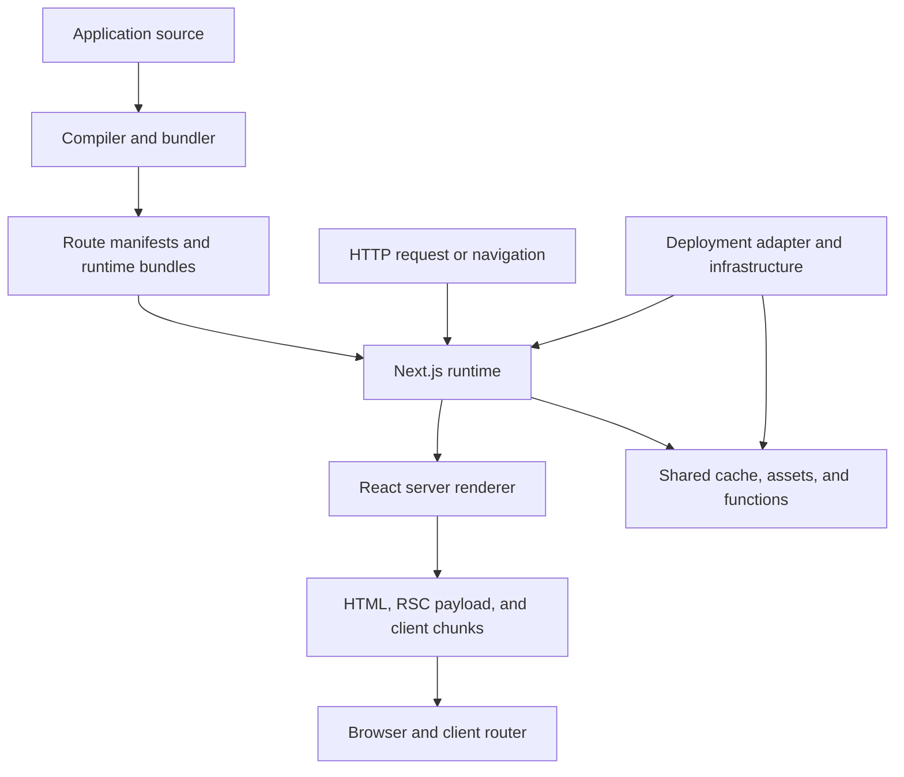
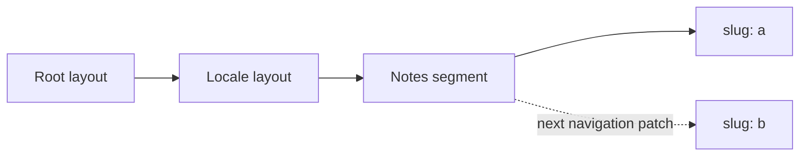
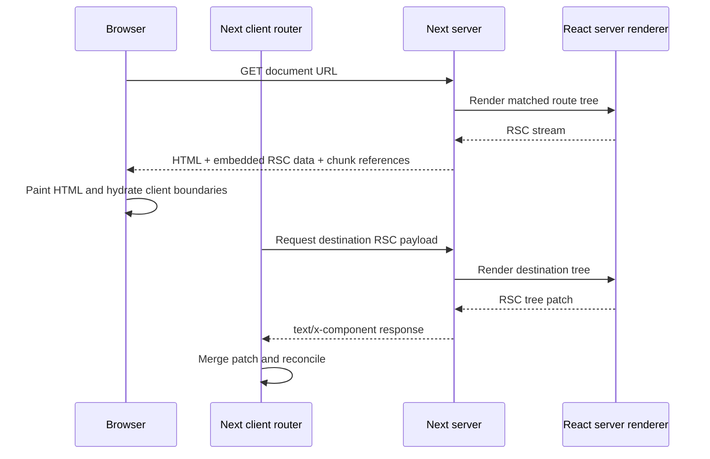
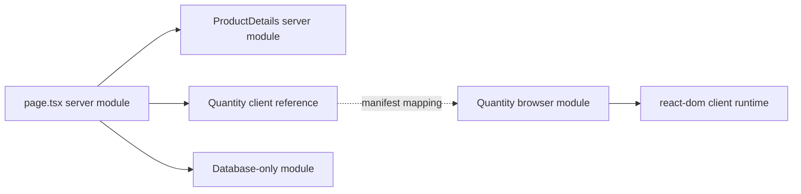
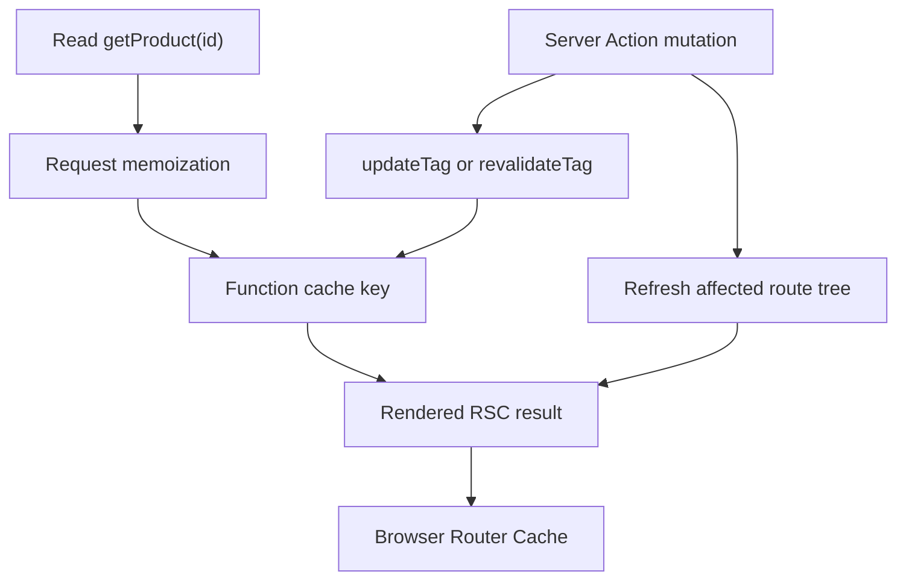
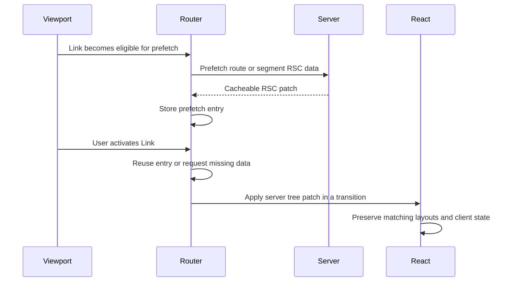
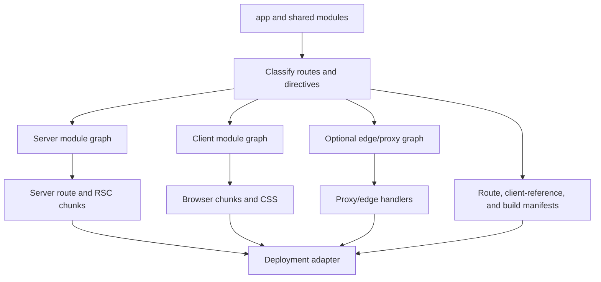
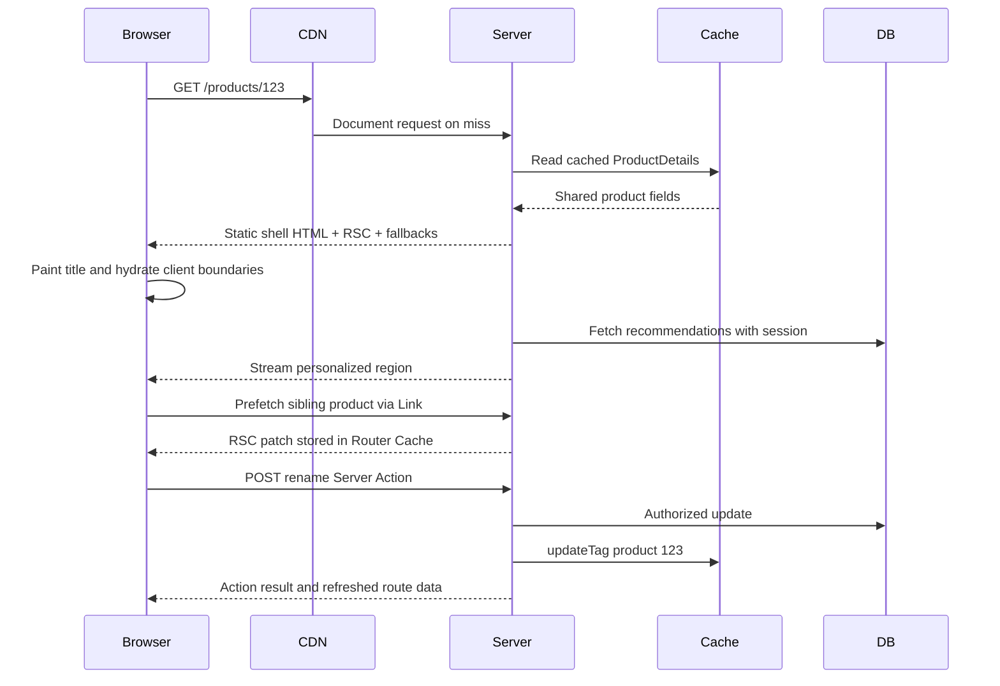

Next.js is often introduced as "React with file-system routing and SSR." That skips why `'use client'` changes a bundle, why one request returns HTML and another `text/x-component`, why a cookie changes when work can happen, and why invalidating server data does not always replace what the browser already has.

The useful model: Next.js is an **orchestrator around React**. At build time it turns one source tree into several module graphs. At runtime it selects a **route tree**, coordinates caches, asks React for a Server Component stream, optionally converts that to HTML, and lets the client router merge later patches without reloading the document.

<br />

```text
source modules
  → classify routes and server/client boundaries
  → emit server, client, and optional edge artifacts
  → match a request to a route tree
  → resolve cached and request-time work
  → produce a React Server Component payload
  → optionally produce and stream HTML
  → hydrate client boundaries
  → fetch and merge later route-tree patches
```

<br />

This note targets **Next.js 16.2.11 App Router** (React 19.2.4 here). Three kinds of statements:

- A **React rule**, such as render purity or serializable client-bound values.
- A **Next.js contract**, such as `page.tsx` or `cacheTag`.
- An **implementation observation**, such as a manifest field or an internal header. Useful for debugging. Application code must not depend on undocumented formats.

App Router does not run `getStaticProps` or `getServerSideProps`. Rendering and caching compose at route, component, and function boundaries.

---

## 1. Next.js Adds Policy and Infrastructure Around React

React defines components, reconciliation, Suspense, Server Components, and hydration. It does not decide how URLs map to trees, where a component executes, how a route is cached, or how a server function is addressed over HTTP.

<br />



<br />

- **Compilation** decides which modules can appear in a browser chunk and creates references between server and client graphs.
- **Routing** converts a pathname into layouts, pages, slots, and boundaries.
- **Rendering policy** decides which work can happen before a request, which must happen during it, and where Suspense divides the two.
- **Caching policy** decides which results can be reused, for whom, and for how long.
- **The deployment adapter** maps output to processes, functions, CDN objects, and shared caches. Vercel, a long-running Node server, and OpenNext on AWS are not identical.

This repository's `next.config.ts` enables the React Compiler, composes Fumadocs and `next-intl`, defines PostHog rewrites, and configures image policy. `packages/infra/nextjs.ts` then hands the build to SST and OpenNext.

The durable model is a **compiler plus request-time coordinator plus client router**, deployed through a host-specific adapter.

---

## 2. The Route Tree Is More Than a URL Matcher

Folders under `app` define **segments**. Special files attach behavior to those segments.

<br />

```text
app/
  layout.tsx                  root layout
  [locale]/
    layout.tsx                locale layout
    loading.tsx               segment loading boundary
    error.tsx                 segment error boundary
    notes/
      page.tsx                /:locale/notes
      [slug]/
        page.tsx              /:locale/notes/:slug
```

<br />

- `page.tsx` makes a segment addressable. `layout.tsx` wraps descendants and **keeps identity** across navigations where that segment stays matched.
- `template.tsx` occupies a similar position but receives a **new identity** on navigation, so client state and Effects restart.
- `loading.tsx`, `error.tsx`, and `not-found.tsx` become boundaries at defined positions. They are not global event listeners.
- Route groups such as `(marketing)` organize without adding a URL segment. `[id]`, `[...rest]`, and `[[...rest]]` contribute parameters. `@modal` is a parallel slot. `(.)photo` intercepts a client navigation while preserving a canonical direct-load route.
- Build manifests (`app-paths-manifest.json`, route regexes) explain runtime behavior. Their schema is **internal**. The supported interface remains the file conventions.
- During `/en/notes/a` → `/en/notes/b`, shared layouts can stay mounted. The client router applies a server **tree patch**, not a new React root.

<br />



<br />

**Failure:** putting URL observation in a server layout and expecting it to see every navigation. Pathname and search params belong in a Client Component with `usePathname` or `useSearchParams`. Layout persistence is a feature.

---

## 3. A Document Request and a Navigation Are Different Pipelines

A document request matches a route, resolves caches, renders an **RSC payload**, converts that to HTML, streams bytes as Suspense boundaries become ready, then hydrates Client Components. A later client navigation usually does **not** request another HTML document.

<br />



<br />

- The client router sends its current tree state and asks for the RSC data needed to reach the destination, then **merges the patch**.
- A local `routes-manifest.json` records `rsc` as the request discriminator, `text/x-component` as the RSC content type, and `Vary` on `rsc, next-router-state-tree, next-router-prefetch, next-router-segment-prefetch`.
- Those names are operational evidence, not an API. A proxy or CDN that strips them can cache the wrong variant.
- `proxy.ts` runs **before** a route renders and **before** a response cache can answer. Cheap redirects, rewrites, coarse gates. Not authorization for the code that reads or mutates data.
- Next.js 16 renamed `middleware.ts` to `proxy.ts`. This repository's `src/proxy.ts` only runs `next-intl` locale routing, with `localeDetection: false` so `/` redirects stay deterministic for CDN caching.

---

## 4. `'use client'` Splits a Module Graph

Server Components are the default. The phrase does not mean "runs once per HTTP request." It means the implementation stays in the **server graph** and the rendered result crosses the RSC boundary.

`'use client'` is a **module-graph entry directive**.

<br />

```tsx
'use client'

import { useState } from 'react'

export function Quantity() {
  const [value, setValue] = useState(1)
  return <button onClick={() => setValue(value + 1)}>{value}</button>
}
```

<br />



<br />

- The directive marks this module's exports as client references when imported from the server graph. Transitive imports must be client-reachable unless another boundary cuts the graph.
- It does **not** mean: no server HTML, every descendant is a client module, the component can import server secrets, or the browser can call arbitrary server functions.
- The server can render `<Quantity />` because the RSC stream encodes a **reference** plus serializable props. A database module stays in the server graph.
- A Client Component can receive a Server Component result through `children`. It is not importing and executing that server module in the browser.
- Values crossing the boundary must be serializable. **Server Functions** are the deliberate exception: a reference Next.js knows how to invoke.
- Use `server-only` and `client-only` so a leak fails at compile time.

**Failure:** `'use client'` on a high-level shell. Providers, utilities, and descendants get pulled into browser-reachable chunks. Place the directive at **narrow interactive leaves**.

---

## 5. Flight Carries a Tree, HTML Carries an Initial Picture

The RSC payload — often called the **Flight payload** — is not HTML and not a JSON picture of the DOM. It is a stream of rendered Server Component output, pending Suspense work, Client Component references, and serializable values.

<br />

```text
RSC render
  ├─ RSC payload: authoritative server-rendered React tree and references
  ├─ HTML: initial visual representation produced from that result
  └─ client chunks: executable code for Client Component references
```

<br />

- HTML lets the browser paint before application JavaScript executes. RSC reconstructs the same logical tree. Client chunks supply behavior for interactive boundaries.
- **Hydration applies to Client Components**, not to Server Component implementations. The browser receives the Server Component's **rendered result**, not its function body.
- "Zero JavaScript" is a per-subtree possibility. One client provider near the root can still widen the interactive surface.
- Later navigations skip HTML because the browser already owns a document. Treating an RSC endpoint as a public JSON API is wrong: it is coupled to the build's module references and router state.

**Failure:** parsing Flight bytes or generated client-reference maps in product code. Inspect them to diagnose a proxy, cache, or bundle problem. They are not a stable application interface.

---

## 6. Rendering Is a Spectrum, Not Three Page Types

Pages Router vocabulary — CSR, SSR, SSG, ISR — still describes outcomes. App Router work composes more finely, at three times: **build or revalidation**, **request**, and **client**.

<br />

```tsx
import { Suspense } from 'react'

export default function ProductPage() {
  return (
    <>
      <ProductCatalog />
      <Suspense fallback={<RecommendationsSkeleton />}>
        <PersonalizedRecommendations />
      </Suspense>
    </>
  )
}
```

<br />

- Without Cache Components, Next.js can still classify and prerender routes. Since Next.js 15, `fetch` is **not** placed in a persistent cache by default.
- With `cacheComponents: true`, a route can mix prerendered work, `'use cache'`, and request-time work that reads `cookies()`, `headers()`, or `searchParams`.
- Request-time work must sit under **Suspense** so the build can emit a static shell — Partial Prerendering.
- Suspense is a **streaming** boundary. `'use cache'` is **reuse** under a key and lifetime.
- This repository uses `dynamic = 'force-static'`, `dynamicParams = false`, and `generateStaticParams`. It does **not** enable `cacheComponents`. Caching here is build-time SSG plus CDN.

**Failure:** expecting Suspense to cache a query, or expecting cached data to stream automatically.

---

## 7. Data Dependencies Determine Streaming Quality

An async Server Component can query a database directly. Routing that call through this application's Route Handler adds HTTP serialization, another router pass, and a deployment-dependent hop. Share a **server-only function** instead.

<br />

```tsx
const productPromise = getProduct(id)
const inventoryPromise = getInventory(id)

const [product, inventory] = await Promise.all([
  productPromise,
  inventoryPromise,
])
```

<br />

- Independent `await getProduct` then `await getInventory` **serializes** work that could overlap. Start both, then `Promise.all`, or reveal them under sibling Suspense boundaries.
- Streaming cannot repair a real data dependency. It can repair a parent that awaited one child before constructing the next.
- Request **memoization** deduplicates equivalent work during one render. A **persistent cache** reuses a result across requests. A memoized uncached query still runs again next time; a persistent cache can still return stale data.
- Browser-owned data — live collaboration, high-frequency polling, offline state, third-party APIs that need browser credentials — still belongs on the client.

**Failure:** sequential `await` of independent reads. That waterfall is architectural, not inherent.

---

## 8. Caching Is a Set of Lifetimes and Identities

"Is this page cached?" is the wrong question. A Next.js application can reuse work at several scopes.

<br />

```text
one render/request
  request memoization deduplicates equivalent reads

many requests
  a data or function cache reuses a result by key

route output
  prerendered HTML and RSC output can be reused

one browser session
  the client router reuses prefetched and visited route segments

network edge or host
  a CDN may reuse HTTP responses according to host policy
```

<br />

- Each layer has its own identity and invalidation. A fresh database row does not guarantee a fresh RSC response already sitting in the **Router Cache**. `router.refresh()` can request a new server result without deleting a persistent data-cache entry.
- Enable Cache Components with `cacheComponents: true`. Then `'use cache'` plus `cacheLife` and `cacheTag` opt a function into persistent reuse.

<br />

```tsx
import { cacheLife, cacheTag } from 'next/cache'

async function getProduct(id: string) {
  'use cache'
  cacheLife('hours')
  cacheTag(`product:${id}`)
  return db.product.findUniqueOrThrow({ where: { id } })
}
```

<br />

- The cache **key** includes the build identifier, a secure function identifier, serialized arguments, and serialized values captured from outer scope. Tags are an **invalidation index**, not the primary identity.
- Runtime request APIs cannot be called inside `'use cache'`. Read `cookies()` outside and pass only the value that should participate in identity. Caching by session ID is mechanically valid and often a bad policy.
- `cacheLife` windows: **stale** (reuse without checking), **revalidate** (serve stale while refreshing), **expire** (must wait for fresh work).
- `revalidateTag(tag, 'max')` marks stale. `updateTag` expires now for read-your-own-writes and is restricted to **Server Actions**. `revalidatePath` targets route output; it does not replace scoped data tags.

<br />



<br />

Self-hosting turns this into a distributed-systems problem. A process-local cache is not coherent across replicas. Next.js supports custom cache handlers; the host must still coordinate invalidation and build IDs.

**Failure:** tagging `product:${productId}` while the function also takes `tenantId`. Reads stay isolated by arguments; invalidation is the wrong width. Reading a tenant from ambient mutable state inside shared cached work makes isolation unauditable.

---

## 9. Navigation Applies Server-Produced Tree Patches

`<Link>` is not merely an anchor with `preventDefault()`. It gives the router a destination it can prefetch, cache, and transition to while preserving shared segments.

<br />



<br />

- Prefetching is speculation. Render must be safe to start, repeat, cache, and discard. Do not mutate as a render side effect.
- `router.push` and `router.replace` request another route-tree state. `back` and `forward` integrate with browser history. `refresh` re-requests the current route and merges, preserving compatible client state.
- `usePathname` and `useSearchParams` observe client router state.
- `router.refresh` is not a universal invalidation API. If server work is persistently cached, a refresh can faithfully return the same value. Invalidate at the write boundary, then refresh.

**Failure:** concatenating untrusted strings into `router.push` or `router.replace`. Treat destinations as an injection boundary; a `javascript:` URL can execute in the page context.

---

## 10. Server Actions Are Addressed Mutations, Not Trusted Functions

A Server Action is a Server Function used as a mutation entry point. `'use server'` creates a server reference that can cross the RSC boundary.

<br />

```ts
'use server'

import { updateTag } from 'next/cache'
import { z } from 'zod'
import { requireEditor } from '@/lib/auth'
import { db } from '@/lib/db'

const Input = z.object({
  id: z.string().uuid(),
  name: z.string().trim().min(1).max(120),
})

export async function renameProduct(formData: FormData) {
  const actor = await requireEditor()
  const input = Input.parse(Object.fromEntries(formData))

  await db.product.update({
    where: { id: input.id, tenantId: actor.tenantId },
    data: { name: input.name },
  })

  updateTag(`product:${actor.tenantId}:${input.id}`)
}
```

<br />

- The client sends an HTTP **POST** carrying the action reference and serialized arguments. Unused actions can be eliminated at build time.
- An action reachable from the client is an **externally callable entry point**. Arguments are hostile input even when TypeScript says otherwise.
- Authentication proves identity. Authorization proves this identity may perform this operation on this resource. Captured variables are not an authorization system. IDs are opaque, not secret capabilities.
- Same-origin checks, encrypted closures, origin allowlists, and body limits reduce attack surface. They do not decide whether tenant A may edit tenant B's row.
- Mutations still need idempotency keys, optimistic concurrency, transactions, invalidation **after** commit, error mapping that does not leak secrets, and observability.
- HTML forms can invoke actions before hydration. The server remains the authority.

---

## 11. Choose the Narrowest Server Entry Point

Server Components, Server Actions, Route Handlers, and Proxy all execute on the server. They solve different problems.

- **Server Component:** reads that exist to render a React tree. Direct access to server-only modules. Not a public protocol boundary.
- **Server Action:** mutations initiated by this React application. Treat it as a private HTTP endpoint.
- **Route Handler:** an explicit HTTP resource — webhooks, public APIs, files, feeds, non-React clients. Web `Request` / `Response`. A `route.ts` cannot occupy the same segment as a `page.tsx`.
- **Proxy:** interception before route handling. Keep it cheap. It runs on every matching request. It does not replace authorization beside protected data.

<br />

```text
Server Component ─┐
Server Action ────┼─→ shared server-only domain function → database/service
Route Handler ────┘
```

<br />

**Failure:** Server Component → HTTP fetch to this app's Route Handler → domain function, used as generic reuse. The HTTP boundary is justified only when that boundary itself is the capability being tested or consumed.

---

## 12. Dynamic APIs Bind Work to a Request

In Next.js 16, `params`, `searchParams`, `cookies()`, and `headers()` are **asynchronous**.

<br />

```tsx
import { cookies, headers } from 'next/headers'

export default async function Page({
  params,
  searchParams,
}: {
  params: Promise<{ id: string }>
  searchParams: Promise<{ preview?: string }>
}) {
  const [{ id }, query, cookieStore, headerStore] = await Promise.all([
    params,
    searchParams,
    cookies(),
    headers(),
  ])

  // ...
}
```

<br />

- The async shape lets Next.js defer request-bound work. Reading a cookie cannot produce one shared prerendered value for every user.
- With Cache Components, request-time APIs belong outside `'use cache'` and normally below Suspense. Without Cache Components, they make the relevant route dynamic unless configuration says otherwise.
- `searchParams` on a page is request data. `useSearchParams` is a client router hook. Related values, different execution and rendering consequences.
- The default runtime is **Node.js**. Edge offers Web APIs with a smaller environment. Cache Components require Node and do not support `runtime = 'edge'`. "Closer to users" does not automatically beat database distance, cold starts, or unsupported dependencies.
- `NEXT_PUBLIC_*` variables may be substituted into client bundles at **build** time. They are public. A client import cannot keep a secret private.

---

## 13. Loading and Failure Follow Segment Boundaries

App Router turns control-flow outcomes into route-tree behavior.

- `loading.tsx` supplies a Suspense fallback for a segment.
- `error.tsx` supplies a Client Component error boundary for uncaught failures below it.
- `global-error.tsx` replaces the root layout when that layout fails and must render its own `<html>` and `<body>`.
- `not-found.tsx` handles `notFound()` and unmatched resources at its boundary.
- `redirect()` and `permanentRedirect()` terminate the current rendering path.

<br />

```ts
try {
  const product = await getProduct(id)
  if (!product) notFound()
} catch (error) {
  unstable_rethrow(error)
}
```

<br />

- Do not swallow framework control-flow errors. Narrow the `try` to the operation that can fail, or rethrow with `unstable_rethrow`.
- An error boundary does not make a failed mutation transactional. Retrying UI does not make an action idempotent. Side effects already committed to an external system remain committed.

**Failure:** one large Suspense boundary delaying independent content, or dozens of tiny boundaries causing visual churn. Place boundaries by reveal order and latency domain, not around every async function.

---

## 14. Advanced Routing Trades Simplicity for State Preservation

Parallel and intercepting routes solve cases where the URL, visible layers, and navigation history should not map to one simple page tree.

<br />

```text
app/
  @modal/
    default.tsx
    (.)photo/[id]/page.tsx
  photo/[id]/page.tsx
  layout.tsx
```

<br />

- A soft navigation can render `(.)photo/[id]` into the `@modal` slot over the current gallery. A direct request to `/photo/123` renders the canonical page. `router.back()` restores history. `default.tsx` supplies a fallback after a full reload.
- If a modal does not need a shareable URL, reload semantics, or history integration, local state is simpler.
- This site uses `[locale]` as the first dynamic segment and `next-intl` for validation, messages, and navigation. The locale layout awaits `params`, rejects unsupported locales with `notFound()`, and calls `setRequestLocale` so otherwise static routes can be generated per locale.
- **Rewrites** keep the browser URL. **Redirects** change it. Route groups change neither. This repository proxies `/ingest/*` to PostHog while keeping the browser on the first-party origin.

---

## 15. Metadata and Asset Pipelines Are Part of the Render Contract

Metadata is resolved from the route tree: static `metadata` exports, `generateMetadata`, and file conventions such as `opengraph-image`, `icon`, and `robots`. Parent metadata **merges** with child metadata; a partial leaf export does not wipe the parent object.

- `generateMetadata` can await the same server data as the page. Share the underlying promise or cached function so metadata does not serialize the body unless the work is already memoized.
- `next/image` produces sized variants, enforces configured remote hosts, and injects `srcset` / `sizes`. An unrestricted remote host list becomes an **open image proxy**.
- `next/font` self-hosts fonts, generates subset CSS, and removes a common third-party render-blocking request. Font metrics and `display` still determine layout shift.
- `next/script` controls when third-party JavaScript contends for the main thread. Strategy is a performance decision, not a syntax decision.
- Image optimization may run in a function, at the edge, or behind a CDN depending on host. The public API remains `next/image`; the operational cost does not.

---

## 16. Compilation Turns One Source Tree into Several Artifacts

A Next.js build is not "bundle the app." It classifies modules, emits multiple graphs, and writes manifests the runtime uses to answer later requests.

<br />



<br />

- **SWC** transforms TypeScript/JSX. The **React Compiler**, enabled in this repository, can automatically memoize eligible components. It does not replace Server Components, Suspense, or cache policy.
- **Turbopack** is the default bundler in Next.js 16.2. This repository's `next dev` and `next build` scripts do not pass `--webpack`.
- Inspect route manifests, client-reference metadata, build identifiers, and chunk lists when diagnosing production behavior.
- `NEXT_PUBLIC_*` values can be inlined into client assets for a specific build. Rotating a public analytics key requires rebuilding those assets. A server-only secret read at runtime does not.
- OpenNext maps artifacts onto host resources. This repository's `open-next.config.ts` overrides tag cache, incremental cache, and queue backends (DynamoDB/S3/SQS lite) and uses a Lambda streaming wrapper. With the current fully static surface those adapters stay largely idle. [Using SST to Manage AWS Infrastructure and DevOps](/notes/using-sst-for-aws-infra-and-devops) covers how SST wires the adapter.
- Rolling deploys must keep build IDs and client references aligned so an old browser session does not call a server that no longer understands its action IDs. CDN layers must honor content-type and `Vary`. This site serves Orama search indexes as static JSON because OpenNext on Lambda inherits a synchronous response size ceiling that made `/api/search` brittle.

---

## 17. Security and Observability Sit at Every Boundary

Next.js moves code and data across several trust boundaries. Security work fails when those boundaries are treated as framework magic.

| Boundary | What crosses it | Required controls |
| --- | --- | --- |
| Browser ↔ Server Action / Route Handler | Hostile input and cookies | Authn, authz, validation, rate limits, CSRF/origin policy |
| Server Component → Client Component | Serialized props and references | No secrets, no privileged objects, intentional public data |
| Proxy → Route | Request headers and redirects | Cheap checks only; no sole authorization |
| App → External service | Credentials and PII | Scoped secrets, least privilege, audited egress |
| CDN ↔ Origin | Cached responses | Correct `Vary`, no private HTML in shared caches |

<br />

- Authentication answers "who is this?" Authorization answers "may this actor perform this operation on this resource?" Validate and authorize **inside** the mutation or Route Handler, after parsing input with a schema.
- Secrets belong in server-only modules and runtime configuration. Closed-over values in Server Actions receive transport protections, but they remain part of an externally callable interface once the action is reachable.
- Defense in depth still applies: CSP, origin allowlists, body-size limits, logs that record actor/resource/outcome without dumping secrets, source maps available to error tracking without becoming a public dump.
- `instrumentation.ts` is the supported place to register OpenTelemetry. Correlate document requests, Flight navigations, Server Actions, and Route Handlers through one trace model.

---

## 18. Performance Is an Architecture of Boundaries

Most Next.js performance failures are boundary mistakes.

1. A `'use client'` too high in the tree widens hydration and JavaScript.
2. Sequential awaits serialize independent latency domains.
3. Missing Suspense forces the whole response to wait for the slowest region.
4. Over-caching personalized data creates huge key cardinality or privacy incidents.
5. Under-caching shared data turns every navigation into origin work.
6. Measuring only local `next dev` hides production chunking, compression, and cache behavior.

- **LCP** cares whether critical HTML, fonts, and images are discoverable early and whether server work blocks the largest content.
- **INP** cares about main-thread contention from hydration, client JS, and handlers.
- **CLS** cares about reserved image/font space and late-injected UI.
- Time-to-interactive for a subtree cares about how much Client Component JavaScript that subtree pulled in.

The browser critical path still governs the last mile. See [The Critical Rendering Path in the Browser](/notes/critical-rendering-path-in-the-browser). For React's speculative render, commit, and hydration, see [Understanding React in Depth](/notes/understanding-react-in-depth).

Measure production builds: document versus `text/x-component`, client chunk size, whether an image went through `/_next/image`, and whether a mutation caused an expected cache miss.

---

## 19. Following One Product Page End to End

A product page shows shared catalog fields cached for all users, personalized recommendations based on a session cookie, and an authenticated rename form.

<br />



<br />

- Shared `ProductDetails` uses `'use cache'` + `cacheTag`. Recommendations read `cookies()` **outside** cache, under Suspense.
- The document can paint the product title before recommendations finish.
- Auth to **render** the form is not auth to **run** the action. The action re-checks, validates, writes, then `updateTag`.
- A client navigation to another product requests RSC data, not a full HTML document, unless the adapter or link configuration forces otherwise.
- Concurrent renames from two editors need an application-level concurrency strategy. Next.js will not invent one.
- After deployment, an old tab may fail action invocation until it reloads onto the new build's references.

**Failure:** putting `cookies()` inside `'use cache'` — the build should reject that composition. Caching by session ID without a privacy review: the mechanism works and the policy may still be wrong.

---

## 20. Debugging Questions and Common Misconceptions

When Next.js behavior surprises, these questions in order:

1. **Which pipeline is this?** Document request, Flight navigation, prefetch, Server Action, Route Handler, or proxy?
2. **Which graph owns this module?** Server, client, or edge?
3. **When was this value computed?** Build/revalidation time, request time, or client time?
4. **What is the cache identity?** Function arguments, captured values, tags, route path, build ID, and CDN variant.
5. **What did the network actually return?** HTML, `text/x-component`, JSON, a redirect, or a cached CDN object with the wrong `Vary`?
6. **Did React commit, or only attempt a render?** Streaming and transitions can abandon work.
7. **Was authorization enforced at the write boundary?** UI hiding is not enforcement.
8. **Is the deployment adapter preserving headers, content types, and shared cache semantics?**

Common misconceptions:

- **Next.js is not only SSR.** App Router routes compose prerendered, cached, streamed, and request-time work.
- **`'use client'` does not mean client-only rendering.** It marks a module-graph boundary. The component can still SSR into HTML and then hydrate.
- **`fetch` is not cached by default** since Next.js 15. Explicit Cache Components and cache APIs define reuse.
- **Server Actions are reachable mutation endpoints.** Validate input and authorize every call.
- **Dynamic does not mean no caching.** Request-time regions can sit beside cached regions.
- **Edge is not always faster.** It helps when the workload fits the runtime and the bottleneck is proximity to the user.
- **RSC does not replace APIs.** Public clients, webhooks, and non-React consumers still need Route Handlers.
- **Fiber/Flight details are not application APIs.** Useful for diagnosis; unstable as product contracts.

---

## 21. Final Mental Model

The shortest accurate model:

<br />

```text
Folders define a route tree.
Directives partition module graphs.
Server Components assemble data into a Flight tree.
Caches reuse work by explicit identity and lifetime.
Suspense divides what can stream independently.
HTML is an initial picture.
Flight is the authoritative server tree and references.
Client Components hydrate and own interaction.
Actions mutate through addressed server entry points.
Invalidation reconnects writes to later reads.
Adapters map artifacts onto infrastructure.
```

<br />

Next.js does not replace React's rendering model. It decides which React trees exist for which URLs, where their modules execute, which results may be reused, how those results cross the network, and how a browser merges later server output into an already mounted document.

Compile-time classification, request-time coordination, and client navigation are three different phases. Most production incidents come from collapsing them into one vague idea of "the page rendered."

For React's own render/commit/hydration machinery, continue with [Understanding React in Depth](/notes/understanding-react-in-depth). For browser pixels and main-thread constraints, see [The Critical Rendering Path in the Browser](/notes/critical-rendering-path-in-the-browser). For this repository's AWS/OpenNext delivery path, see [Using SST to Manage AWS Infrastructure and DevOps](/notes/using-sst-for-aws-infra-and-devops). For React 19 APIs that Server Components build on, see [What's New in React 19](/notes/react-19-new-features).

The implementation observations in this article correspond to **Next.js 16.2.11** App Router behavior as installed in this repository. Public conventions — file names, documented directives, cache APIs, and supported runtime functions — are the durable contract. Manifest layouts, internal headers, and exact Flight bytes are debugging evidence for today's toolchain, not an API to hard-code.

---

## Recap Q&A

<Accordion type="single" collapsible>
  <AccordionItem value="next-orchestrator">
    <AccordionTrigger>1. What does Next.js add around React, and what is a route tree?</AccordionTrigger>
    <AccordionContent>

      - Next.js is an **orchestrator around React**. React defines components, reconciliation, Suspense, Server Components, and hydration. It does not decide how URLs map to trees, where a component executes, how a route is cached, or how a server function is addressed over HTTP.
      - At build time Next turns one source tree into several module graphs. At runtime it selects a **route tree**, coordinates data and caches, asks React for a Server Component stream, optionally converts that to HTML, and lets the client router merge later patches without reloading the document.
      - App Router does not run `getStaticProps`. Rendering and caching compose at route, component, and function boundaries.
      - A document request and a client navigation are different pipelines: HTML plus hydration versus an RSC patch against preserved layouts.

    </AccordionContent>
  </AccordionItem>

  <AccordionItem value="next-use-client">
    <AccordionTrigger>2. What does `'use client'` actually split?</AccordionTrigger>
    <AccordionContent>

      - Server Components are the default. The phrase does not mean "runs once per HTTP request." It means the implementation stays in the **server graph** and the rendered result crosses the RSC boundary.
      - `'use client'` is a **module-graph entry directive**. It does not mean there is no server HTML, that every descendant must be a client module, or that the component can import server secrets because its parent was a Server Component.
      - Put the directive at **narrow interactive leaves**. On a high-level shell it pulls providers and utilities into browser chunks.
      - A Client Component can still receive a Server Component result through `children`. Values crossing the boundary must be serializable. Use `server-only` so a leak fails at compile time.

    </AccordionContent>
  </AccordionItem>

  <AccordionItem value="next-caching">
    <AccordionTrigger>3. Why is “is this page cached?” the wrong question?</AccordionTrigger>
    <AccordionContent>

      - A Next.js app can reuse work at several scopes: request memoization, a data/function cache, prerendered HTML and RSC, the client Router Cache, and a CDN. Each layer has its own **identity and invalidation**.
      - A fresh database row does not guarantee a fresh RSC response already sitting in the browser. `router.refresh()` can request a new server result without deleting a persistent data-cache entry.
      - `'use cache'` plus `cacheTag` / `cacheLife` is reuse under a key and lifetime. **Suspense** is a streaming boundary, not a cache.
      - Tags are an invalidation index; arguments and captured scope are the key.
      - **Failure:** omit tenant identity from a tag and invalidation is the wrong width. Expecting Suspense to cache a query, or expecting cached data to stream automatically.

    </AccordionContent>
  </AccordionItem>

  <AccordionItem value="next-server-actions">
    <AccordionTrigger>4. Why is a Server Action not a trusted function?</AccordionTrigger>
    <AccordionContent>

      - `'use server'` creates a server reference that can cross the RSC boundary. On invocation the client sends an HTTP **POST** with the action reference and serialized arguments.
      - An action reachable from the client is an **externally callable entry point**. Arguments are hostile input even when TypeScript says otherwise.
      - Authentication proves identity; authorization proves this identity may perform this operation on this resource. Captured variables are not an authorization system. IDs are opaque, not secret capabilities.
      - Same-origin checks and encrypted closed-over values reduce attack surface; they do not decide whether tenant A may edit tenant B's row.
      - Validate with Zod, authorize in the action, invalidate cache **after** the transaction commits. HTML forms can invoke actions before hydration. The server remains the authority.

    </AccordionContent>
  </AccordionItem>

  <AccordionItem value="next-streaming">
    <AccordionTrigger>5. What determines streaming quality, and how does sequential await hurt?</AccordionTrigger>
    <AccordionContent>

      - An async Server Component can query a database directly. Routing that call through the same app's Route Handler adds HTTP serialization and a hop.
      - Independent `await getProduct` then `await getInventory` **serializes** work that could overlap. Start both, then `Promise.all`. Sequential await of independent data is a waterfall you introduced.
      - Request-time work (`cookies()`, `headers()`, `searchParams`) must sit under **Suspense** if you want a static shell plus a deferred region — Partial Prerendering.
      - The boundary says what can be revealed independently. Data dependencies, not the number of files, decide whether the stream looks like a shell or a stall.

    </AccordionContent>
  </AccordionItem>
</Accordion>
