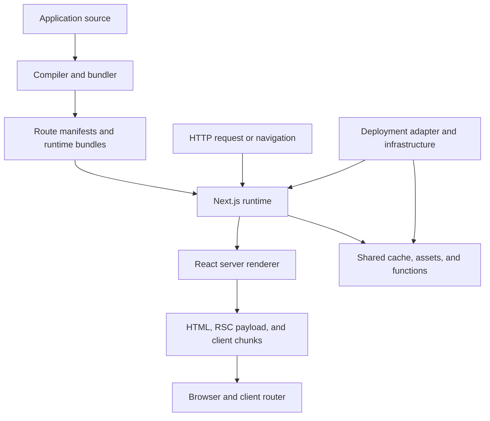
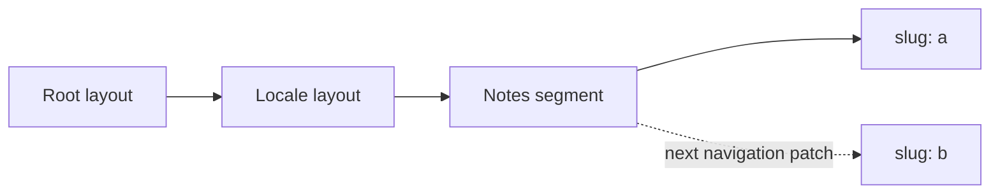
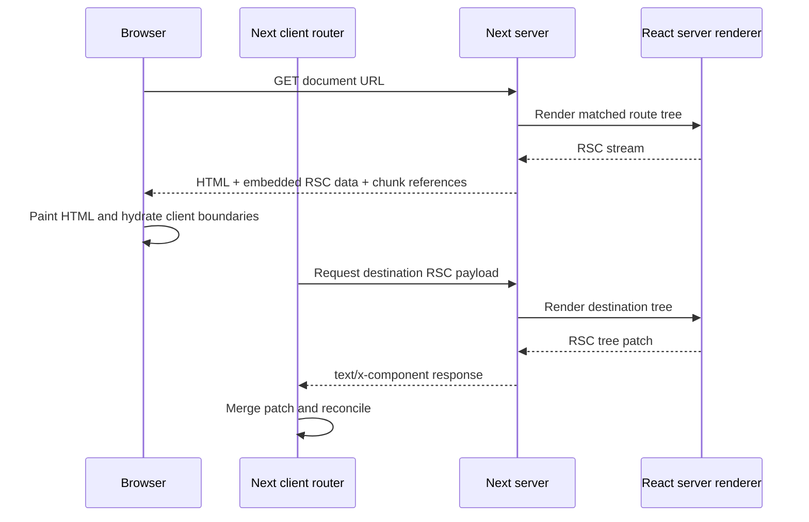
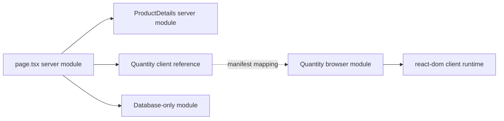
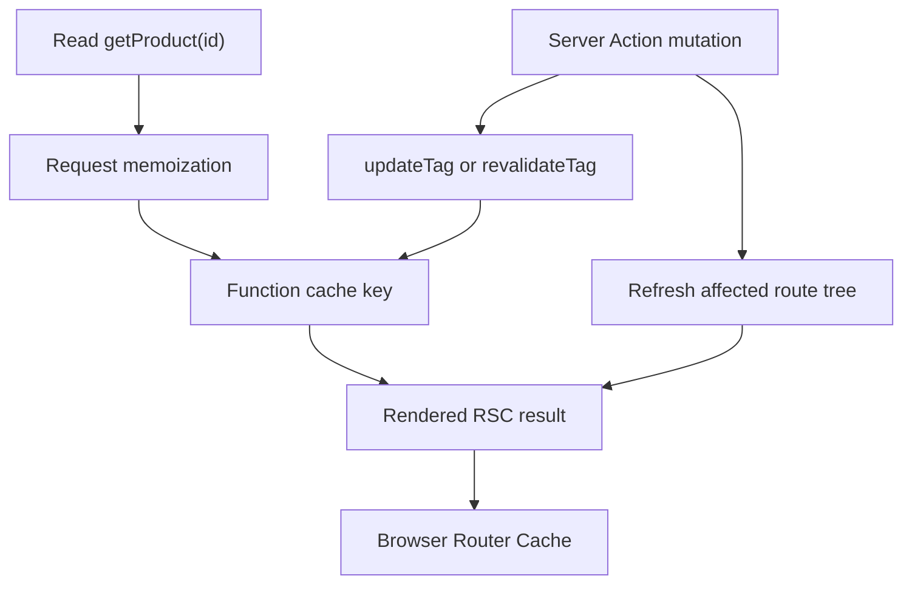
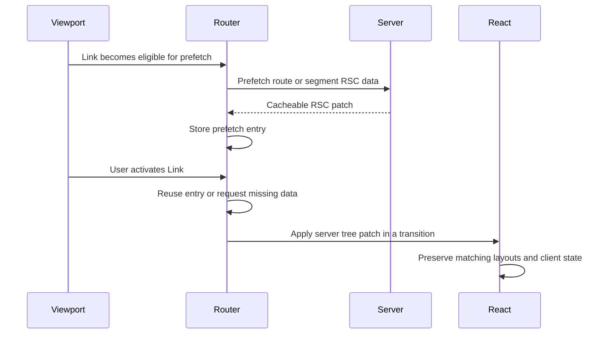
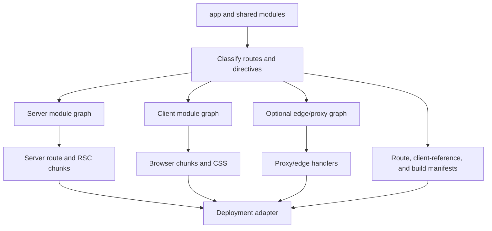
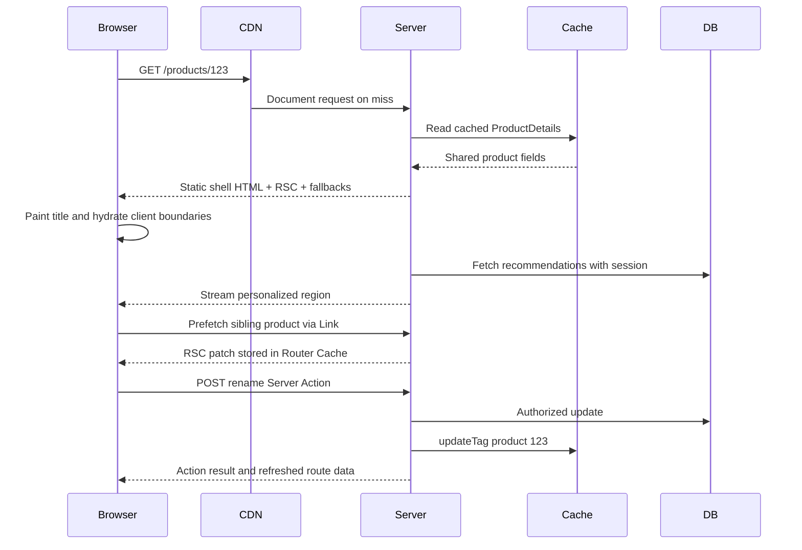

Next.js is often introduced as "React with file-system routing and server-side rendering." That description is not wrong, but it is too compressed to explain why adding `'use client'` changes a bundle, why one request returns HTML while another returns `text/x-component`, why reading a cookie changes when work can happen, or why invalidating server data does not always replace what is already in the browser.

The more useful model is that Next.js is an **orchestrator around React**. At build time it turns one source tree into several module graphs and routing manifests. At runtime it selects a route tree, coordinates data and caches, asks React to produce a Server Component stream, optionally converts that stream into HTML, and exposes enough information for the client router to merge later server results without reloading the document.

<br />

```text
source modules
  → classify routes and server/client boundaries
  → emit server, client, and optional edge artifacts
  → match a request to a route tree
  → resolve cached and request-time work
  → produce a React Server Component payload
  → optionally produce and stream HTML
  → hydrate client boundaries
  → fetch and merge later route-tree patches
```

<br />

This article targets **Next.js 16.2.11 App Router** (React 19.2.4 in this repository) and assumes familiarity with React, HTTP, JavaScript runtimes, Suspense, and cache invalidation. It distinguishes three kinds of statements:

- A **React rule**, such as render purity or the requirement that client-bound values be serializable.
- A **Next.js contract**, such as the `page.tsx` convention or `cacheTag`.
- An **implementation observation**, such as a generated manifest field or an internal request header. Observations are useful for debugging, but application code must not depend on undocumented formats.

The Pages Router appears only where old vocabulary causes ambiguity. App Router does not execute `getStaticProps` or `getServerSideProps`; rendering and caching decisions now compose at route, component, and function boundaries.

<br />

---

## 1. Next.js Adds Policy and Infrastructure Around React

React defines components, reconciliation, Suspense, Server Components, and hydration. It does not decide how URLs map to component trees, where a component executes, how a route is cached, how images are transformed, or how a server function is addressed over HTTP. Next.js makes those decisions and connects them.

A production Next.js application spans four layers:



The boundaries matter because the same application can behave differently without React changing:

- **Compilation** decides which modules can appear in a browser chunk and creates references between server and client graphs.
- **Routing** converts a pathname into an ordered tree of layouts, pages, slots, and boundaries.
- **Rendering policy** decides which work can happen before a request, which must happen during it, and where a Suspense fallback divides the two.
- **Caching policy** decides which results can be reused, for whom, and for how long.
- **The deployment adapter** maps Next.js output to processes, functions, CDN objects, and shared caches. Vercel, a long-running Node server, and OpenNext on AWS do not have identical infrastructure.

This repository demonstrates the distinction. `next.config.ts` enables the React Compiler, composes Fumadocs and `next-intl`, defines PostHog rewrites, and configures image policy. `packages/infra/nextjs.ts` then hands the build to SST and OpenNext. Next.js owns the application semantics; OpenNext maps them onto AWS resources.

Calling Next.js a "backend-for-frontend" is sometimes useful, but it still underspecifies the compiler. Calling it a "meta-framework" is accurate, but underspecifies its runtime. The durable mental model is a **compiler plus request-time coordinator plus client router**, deployed through a host-specific adapter.

<br />

---

## 2. The Route Tree Is More Than a URL Matcher

Folders under `app` define **segments**. Special files attach behavior to those segments:

```text
app/
  layout.tsx                  root layout
  [locale]/
    layout.tsx                locale layout
    loading.tsx               segment loading boundary
    error.tsx                 segment error boundary
    notes/
      page.tsx                /:locale/notes
      [slug]/
        page.tsx              /:locale/notes/:slug
```

A `page.tsx` makes a segment addressable. A `layout.tsx` wraps its descendants and keeps its identity across navigations where that segment remains matched. A `template.tsx` occupies a similar position but receives a new identity on navigation, so its client state and Effects restart. `loading.tsx`, `error.tsx`, and `not-found.tsx` are not global event listeners; they become boundaries at defined positions in the route tree.

Route groups such as `(marketing)` organize or vary layout composition without adding a URL segment. Dynamic segments (`[id]`), catch-all segments (`[...rest]`), and optional catch-all segments (`[[...rest]]`) contribute parameters. Parallel-route folders such as `@modal` create named slots in a layout. Intercepting segments such as `(.)photo` change which route tree is rendered for a client navigation while preserving a canonical direct-load route.

At build time, Next.js compiles this filesystem into executable route entries and manifests. A production build of this site emitted an `app-paths-manifest.json` entry mapping:

```json
{
  "/[locale]/notes/[slug]/page": "app/[locale]/notes/[slug]/page.js",
  "/resume/route": "app/resume/route.js"
}
```

It also emitted route regular expressions for `[locale]`, `[slug]`, and `[...rest]`. These files explain runtime behavior, but their schema is internal. The supported interface remains the source-level file conventions.

The route tree also defines **state identity**. During a navigation from `/en/notes/a` to `/en/notes/b`, the root layout, locale layout, and notes layout can remain mounted while the leaf segment changes. The client router applies a server-provided tree patch instead of rebuilding the page as an unrelated React root.

That is why layouts have a constraint that surprises people coming from request templates: a shared layout does not rerender merely to observe every URL change. If interactive UI needs the current pathname or search parameters, put that observation in a Client Component with `usePathname` or `useSearchParams`. The server layout's persistence is a feature, not stale rendering.

<br />



<br />

---

## 3. A Document Request and a Navigation Are Different Pipelines

For a browser document request, the runtime broadly does this:

1. Apply configured headers, redirects, rewrites, and `proxy.ts` interception.
2. Match the resulting URL to an App Router entry and derive route parameters.
3. Select the runtime and load the compiled server modules for the matched route tree.
4. Resolve prerendered, cached, and request-time work.
5. Ask React to render the Server Component tree into an **RSC payload**.
6. Use the RSC result plus Client Component references to produce HTML for the initial view.
7. Stream response bytes as Suspense boundaries become ready.
8. Let the browser display HTML, load client chunks, consume the RSC data, and hydrate Client Components.

On a later client navigation, Next.js usually does not request another complete HTML document. The client router sends its current router-tree state and asks the server for RSC data needed to reach the destination. It then merges the returned patch into the existing tree.



A local Next.js 16.2.11 production `routes-manifest.json` makes the distinction visible. It records `rsc` as the request discriminator, `text/x-component` as the RSC content type, and `rsc, next-router-state-tree, next-router-prefetch, next-router-segment-prefetch` in the response's `Vary` policy. Those names are operational evidence, not an API to reproduce manually. Using a reverse proxy or CDN that strips them or ignores `Vary` can collapse document, navigation, and prefetch variants into the wrong cached object.

`proxy.ts` participates before a route renders and, importantly, before a response cache can answer. It is suitable for cheap request normalization, redirects, rewrites, and coarse access gates. It is not a replacement for authorization in the code that reads or mutates data. In Next.js 16 the convention was renamed from `middleware.ts` to make that boundary clearer. This repository's `src/proxy.ts` only runs `next-intl` locale routing, with `localeDetection: false` so `/` redirects stay deterministic for CDN caching.

<br />

---

## 4. `'use client'` Splits a Module Graph

Server Components are the default in the App Router. The phrase "Server Component" does not mean "a component that always runs once per HTTP request." It means its component implementation stays in the server graph and its rendered result crosses the React Server Component boundary.

`'use client'` is a **module-graph entry directive**:

```tsx
'use client'

import { useState } from 'react'

export function Quantity() {
  const [value, setValue] = useState(1)
  return <button onClick={() => setValue(value + 1)}>{value}</button>
}
```

The directive marks this module's exports as client references when imported from the server graph. Its transitive imports must also be available to the client bundler unless the graph is cut through another boundary. It does not mean:

- the component has no server-rendered HTML on the initial load;
- every descendant element must be implemented in a client module;
- the component can import server secrets because its parent was a Server Component;
- the browser can call arbitrary server functions.

The compiler creates related but distinct graphs:



The server can render `<Quantity />` because the RSC stream encodes a reference to its client implementation and serializable props. The browser later resolves that reference to a JavaScript chunk. A database module remains reachable only from the server graph.

This is why boundary placement is an architectural decision. Putting `'use client'` on a high-level application shell can pull providers, utility libraries, and descendants into browser-reachable chunks. The usual pattern is to keep data access and static composition on the server and place the directive at narrow interactive leaves.

The reverse composition is also important. A Client Component can accept a Server Component result through a slot such as `children`:

```tsx
// Server Component
export default async function Page() {
  const details = await getProduct()
  return <InteractivePanel details={<ProductDetails product={details} />} />
}
```

`InteractivePanel` receives an already described server-rendered subtree. It is not importing and executing `ProductDetails` in the browser.

Values crossing the boundary must be representable by React's serialization protocol. Ordinary functions, class instances with private behavior, open database handles, and arbitrary closures are not props. Server Functions are a deliberate exception: React serializes a reference that Next.js knows how to invoke on the server.

Use `server-only` for modules that must fail compilation when they leak into a client graph, and `client-only` for modules that depend on browser semantics. These markers turn an architectural assumption into a build-time check.

<br />

---

## 5. Flight Carries a Tree, HTML Carries an Initial Picture

The RSC payload—often called the **Flight payload** after React's protocol—is not HTML and is not a JSON representation of the DOM. It is a stream that can encode rendered Server Component output, pending Suspense work, references to Client Components, module metadata, and values supported by React's serialization model.

For an initial request, there are three related outputs:

```text
RSC render
  ├─ RSC payload: authoritative server-rendered React tree and references
  ├─ HTML: initial visual representation produced from that result
  └─ client chunks: executable code for Client Component references
```

The HTML lets the browser paint before all application JavaScript executes. The RSC data lets React reconstruct and reconcile the same logical tree on the client. The client chunks supply behavior for interactive boundaries.

**Hydration applies to Client Components**, not to the implementation of Server Components. A Server Component may contribute substantial HTML, but its function body is not downloaded merely so the browser can rerun it. The browser receives its rendered result in the RSC payload.

This makes "zero JavaScript" a per-subtree possibility, not a property of every RSC application. A route can be mostly server-rendered while one client provider near the root causes a wide interactive subtree and significant JavaScript.

On subsequent navigations, HTML would be redundant because the browser already owns a document and React root. The client asks for RSC data, resolves any new client references, and reconciles the patch against preserved layouts. This is also why treating an RSC endpoint as a public JSON API is incorrect: it is a framework protocol coupled to the build's module references and router state.

The wire format and generated client-reference mappings are deliberately not stable application interfaces. Inspect them to diagnose a proxy, cache, or bundle problem; do not parse them in product code.

<br />

---

## 6. Rendering Is a Spectrum, Not Three Page Types

The Pages Router encouraged a route-level vocabulary: CSR, SSR, SSG, and ISR. Those terms still describe outcomes, but App Router work composes more finely.

There are three important times:

- **Build or revalidation time**: Next.js can prerender deterministic work and persist reusable output.
- **Request time**: runtime APIs and uncached work execute with a concrete request.
- **Client time**: Client Components hydrate, handle interactions, and may perform additional fetching.

Without Cache Components, Next.js can still classify and prerender routes, and route-segment options such as `dynamic = 'force-static'` can make intent explicit. Since Next.js 15, `fetch` is not placed in a persistent cache by default.

With `cacheComponents: true`, Next.js 16 enables the newer **Cache Components** model. A route can contain:

- static work that is safe to prerender;
- cached work marked with `'use cache'`;
- request-time work that reads `cookies()`, `headers()`, `searchParams`, or another dynamic source.

Request-time work must sit under Suspense so the build can emit a static shell and a fallback while deferring the dynamic region. Next.js describes this composition as Partial Prerendering.

```tsx
import { Suspense } from 'react'

export default function ProductPage() {
  return (
    <>
      <ProductCatalog />
      <Suspense fallback={<RecommendationsSkeleton />}>
        <PersonalizedRecommendations />
      </Suspense>
    </>
  )
}
```

The boundary is a scheduling and streaming boundary, not a cache directive. Suspense says what can be revealed independently. `'use cache'` says a result can be reused under a key and lifetime. Conflating them causes two common mistakes: expecting Suspense to cache a query, and expecting cached data to stream automatically.

This repository currently uses explicit static route exports such as:

```ts
export const dynamic = 'force-static'
export const dynamicParams = false
```

and does **not** enable `cacheComponents` in `next.config.ts`. Every locale page currently opts into `force-static`, with `generateStaticParams` for locales and MDX slugs and `dynamicParams = false` for unknown slugs. That is a valid Next.js 16 configuration: caching is build-time SSG plus CDN, not Cache Components. Article examples that use `'use cache'` or Server Actions describe the broader framework model, not APIs this site currently ships.

<br />

---

## 7. Data Dependencies Determine Streaming Quality

An async Server Component can query a database or service directly:

```tsx
export default async function ProductPage({
  params,
}: {
  params: Promise<{ id: string }>
}) {
  const { id } = await params
  const product = await getProduct(id)
  return <ProductDetails product={product} />
}
```

There is no benefit in routing this call through the same application's Route Handler. Doing so adds HTTP serialization, another router pass, and a deployment-dependent network hop. Use a shared server-only function from both the component and Route Handler when both need the same capability.

The component tree can accidentally serialize independent work:

```tsx
const product = await getProduct(id)
const inventory = await getInventory(id)
```

Start independent operations before awaiting:

```tsx
const productPromise = getProduct(id)
const inventoryPromise = getInventory(id)

const [product, inventory] = await Promise.all([
  productPromise,
  inventoryPromise,
])
```

Component boundaries can also start work early and reveal it independently:

```tsx
export default function Page({ params }: PageProps) {
  return (
    <>
      <Suspense fallback={<ProductSkeleton />}>
        <Product params={params} />
      </Suspense>
      <Suspense fallback={<InventorySkeleton />}>
        <Inventory params={params} />
      </Suspense>
    </>
  )
}
```

Streaming cannot repair every waterfall. If `Inventory` genuinely needs the product's database result, that dependency is real. If the dependency exists only because a parent awaited one child before constructing the next, the waterfall is architectural.

React's request-scoped memoization and Next.js persistent caching solve different problems. Memoization deduplicates equivalent work during one render/request lifecycle. Persistent caching reuses a result across requests subject to freshness policy. A memoized uncached query can still run again on the next request; a persistent cache can still return stale data if invalidation is wrong.

For browser-owned data—live collaboration, high-frequency polling, offline state, or a third-party API that must use browser credentials—client fetching remains appropriate. "Server first" is a default for reducing waterfalls and credentials exposure, not a ban on client data systems.

<br />

---

## 8. Caching Is a Set of Lifetimes and Identities

"Is this page cached?" is usually the wrong question. A Next.js application can reuse work at several scopes:

```text
one render/request
  request memoization deduplicates equivalent reads

many requests
  a data or function cache reuses a result by key

route output
  prerendered HTML and RSC output can be reused

one browser session
  the client router reuses prefetched and visited route segments

network edge or host
  a CDN may reuse HTTP responses according to host policy
```

Each layer has its own identity and invalidation path. A fresh database row does not guarantee a fresh RSC response in an already populated client Router Cache. Conversely, `router.refresh()` can request a new server result without deleting a persistent data-cache entry.

### Cache Components

In Next.js 16, enable the model explicitly:

```ts
import type { NextConfig } from 'next'

const nextConfig: NextConfig = {
  cacheComponents: true,
}

export default nextConfig
```

Then a function or component can opt into persistent reuse:

```tsx
import { cacheLife, cacheTag } from 'next/cache'

async function getProduct(id: string) {
  'use cache'
  cacheLife('hours')
  cacheTag(`product:${id}`)

  return db.product.findUniqueOrThrow({ where: { id } })
}
```

The cache key is not only the string tag. Next.js documents the key as including the build identifier, a secure function identifier, serialized arguments, and serialized values captured from outer scope. Tags provide an invalidation index over entries; they are not their primary identity.

That distinction catches a subtle bug:

```tsx
async function getProductForTenant(tenantId: string, productId: string) {
  'use cache'
  cacheTag(`product:${productId}`)
  return db.product.findFirstOrThrow({
    where: { tenantId, id: productId },
  })
}
```

`tenantId` is part of the function arguments and therefore part of the cache key. The tag, however, aliases every tenant's product with that ID. Invalidating it may evict more entries than intended. If the tag omits tenant identity and an invalidation is expected to be tenant-local, the policy is inefficient even if the reads remain isolated. More dangerously, reading a tenant from ambient mutable state inside shared cached work can make isolation impossible to audit.

Runtime request APIs cannot be called inside a normal `'use cache'` scope. Read them outside and pass only the value that intentionally participates in identity:

```tsx
import { cookies } from 'next/headers'

async function Recommendations() {
  const sessionId = (await cookies()).get('session')?.value
  return <CachedRecommendations sessionId={sessionId} />
}

async function CachedRecommendations({
  sessionId,
}: {
  sessionId: string | undefined
}) {
  'use cache'
  return getRecommendations(sessionId)
}
```

This is mechanically valid but may be a bad policy: a session ID creates per-session entries in a shared cache. Cache only when the hit rate and data classification justify it.

### Freshness and invalidation

`cacheLife` defines freshness using named or custom profiles. Conceptually, the important windows are:

- **stale**: how long clients may reuse without checking;
- **revalidate**: when stale content can be served while refresh work happens;
- **expire**: the hard limit after which a request must wait for fresh work.

For on-demand invalidation, the semantics differ:

```ts
import { revalidateTag, updateTag } from 'next/cache'

revalidateTag('products', 'max') // mark stale; next visit may serve stale while refreshing
updateTag('products')            // expire now for read-your-own-writes
```

`updateTag` is restricted to Server Actions and is intended for mutation flows where the initiating user should observe the write immediately. `revalidateTag(tag, 'max')` uses stale-while-revalidate semantics and is suitable when blocking the next reader is unnecessary. `revalidatePath` targets route output by path but does not replace well-scoped data tags.

<br />



<br />

Self-hosting turns cache semantics into a distributed-systems problem. A process-local cache is not coherent across replicas and disappears on replacement. Next.js supports custom cache handlers for shared storage; a host or adapter must also coordinate invalidation and deployment build IDs. The framework cannot make an arbitrary Redis, filesystem, CDN, and rolling-deployment topology consistent by declaration alone.

<br />

---

## 9. Navigation Applies Server-Produced Tree Patches

`<Link>` is not merely an anchor with `preventDefault()`. It gives the router a destination it can prefetch, cache, and transition to while preserving shared segments. Production prefetch behavior depends on whether the route can be prerendered and whether loading boundaries allow a useful partial result.

At navigation time, the router conceptually holds:

- the current route tree;
- cached RSC results for visited or prefetched segments;
- browser state belonging to preserved Client Components;
- a destination and the server patch needed to reach it.



Prefetching is speculation. It can waste bandwidth or trigger undesirable side effects if a Server Component performs work during render that should have been a mutation. Render must be safe to start, repeat, cache, and discard.

The main navigation APIs express different operations:

- `router.push` and `router.replace` request another route-tree state.
- `router.back` and `router.forward` integrate with browser history.
- `router.refresh` asks the server for the current route again and merges the result while preserving compatible client and browser state.
- `usePathname` and `useSearchParams` observe client router state.

`router.refresh` is not a universal invalidation API. If server work is persistently cached, a refresh can faithfully return the same cached value. Invalidate or update the data cache at the write boundary, then refresh or let the Server Action response update the route.

Race handling matters. A user can start navigation A, then navigation B before A resolves. React transitions and the router can discard obsolete render results, but an external mutation triggered as a render side effect cannot be undone. This is another reason reads belong in render and writes belong in explicit actions or handlers.

Do not concatenate untrusted strings into `router.push` or `router.replace`. Treat destinations as an injection boundary; a `javascript:` URL can execute in the page context.

<br />

---

## 10. Server Actions Are Addressed Mutations, Not Trusted Functions

A Server Action is a Server Function used as a mutation entry point. `'use server'` causes the build to create a server reference that can cross the RSC boundary:

```ts
'use server'

import { updateTag } from 'next/cache'
import { z } from 'zod'
import { requireEditor } from '@/lib/auth'
import { db } from '@/lib/db'

const Input = z.object({
  id: z.string().uuid(),
  name: z.string().trim().min(1).max(120),
})

export async function renameProduct(formData: FormData) {
  const actor = await requireEditor()
  const input = Input.parse(Object.fromEntries(formData))

  await db.product.update({
    where: { id: input.id, tenantId: actor.tenantId },
    data: { name: input.name },
  })

  updateTag(`product:${actor.tenantId}:${input.id}`)
}
```

At build time, used actions receive opaque identifiers and appear in server-reference metadata; unused actions can be eliminated. On invocation, the client sends an HTTP `POST` carrying the action reference and serialized arguments. The server resolves the reference against the current build, deserializes supported values, executes the function, and can return both an action result and updated UI data.

That mechanism creates convenience, not trust:

1. An action reachable from the client is an externally callable entry point.
2. Its arguments are hostile input even when TypeScript says otherwise.
3. Authentication proves an identity; authorization proves this identity may perform this operation on this resource.
4. Captured variables and bound arguments are not an authorization system.
5. IDs are opaque, not secret capabilities.

Next.js includes transport defenses such as same-origin checks and encrypted closed-over values. It also supports configuration for allowed origins and request body limits. Those controls reduce attack surface; they do not decide whether tenant A may edit tenant B's row.

Mutations need ordinary distributed-systems design:

- an idempotency key for retried non-idempotent operations;
- optimistic concurrency or a version predicate when lost updates matter;
- a transaction for invariants spanning multiple writes;
- explicit cache invalidation after the transaction commits;
- error mapping that does not leak secrets;
- observability carrying actor, resource, outcome, and trace context.

HTML forms can invoke actions before hydration, which gives progressive enhancement. Client transitions can add pending and optimistic UI. The server remains the authority in both cases.

<br />

---

## 11. Choose the Narrowest Server Entry Point

Server Components, Server Actions, Route Handlers, and Proxy all execute on the server side, but they solve different problems.

### Server Component

Use for reads that exist to render a React tree. It can access server-only modules directly and streams its result through RSC. It is not a public protocol boundary.

### Server Action

Use for mutations initiated by this React application when action/form integration and UI refresh are useful. Treat it as a private HTTP endpoint from a security perspective.

### Route Handler

Use `route.ts` for an explicit HTTP resource: webhooks, public APIs, file responses, feeds, callbacks, or endpoints consumed by non-React clients.

```ts
export async function GET(
  _request: Request,
  { params }: { params: Promise<{ id: string }> }
) {
  const { id } = await params
  const product = await getPublicProduct(id)
  return Response.json(product)
}
```

Route Handlers use the Web `Request` and `Response` APIs. They do not render inside the React component tree, and a `route.ts` cannot occupy the same route segment as a `page.tsx`.

### Proxy

Use root-level `proxy.ts` for interception before route handling: redirects, rewrites, request headers, experiments, or coarse gates. Keep it cheap. It runs on every matching request, and it does not replace authorization beside protected data.

The dependency direction should normally be:

```text
Server Component ─┐
Server Action ────┼─→ shared server-only domain function → database/service
Route Handler ────┘
```

not:

```text
Server Component → HTTP fetch to this app's Route Handler → domain function
```

The latter is justified only when the HTTP boundary itself is the capability being tested or consumed, not as a generic code-reuse mechanism.

<br />

---

## 12. Dynamic APIs Bind Work to a Request

In Next.js 16, `params`, `searchParams`, `cookies()`, and `headers()` are asynchronous:

```tsx
import { cookies, headers } from 'next/headers'

export default async function Page({
  params,
  searchParams,
}: {
  params: Promise<{ id: string }>
  searchParams: Promise<{ preview?: string }>
}) {
  const [{ id }, query, cookieStore, headerStore] = await Promise.all([
    params,
    searchParams,
    cookies(),
    headers(),
  ])

  // ...
}
```

The async shape is not cosmetic. It allows Next.js to defer request-bound work and makes the build/request boundary visible. Reading a request cookie cannot produce one shared prerendered value for every user.

With Cache Components, request-time APIs belong outside `'use cache'` and normally below Suspense. Without Cache Components, accessing request-bound data makes the relevant route dynamic unless configuration says otherwise.

`searchParams` on a page is request data and can opt the page into request-time rendering. `useSearchParams` is a client router hook. They are related values with different execution and rendering consequences.

The default runtime is Node.js. It has the broadest npm and platform API compatibility. The Edge runtime offers Web APIs with a smaller environment and different deployment characteristics, but "closer to users" does not automatically beat database distance, cold-start behavior, connection limits, or unsupported dependencies.

Cache Components require Node.js and do not support a segment export of `runtime = 'edge'`. Proxy has its own runtime rules in Next.js 16. Choose Edge only after the complete dependency path—including database, secrets, crypto, observability, and cache backend—supports it.

Environment variables have a similar boundary. Server code can read private values at runtime. Variables prefixed with `NEXT_PUBLIC_` may be substituted into client bundles at build time; they are public and often fixed to the build that produced the asset. A client reference cannot keep an imported secret private.

<br />

---

## 13. Loading and Failure Follow Segment Boundaries

App Router turns several control-flow outcomes into route-tree behavior:

- `loading.tsx` supplies a Suspense fallback for a segment.
- `error.tsx` supplies a Client Component error boundary for uncaught render/runtime failures below it.
- `global-error.tsx` replaces the root layout when that layout fails and must render its own `<html>` and `<body>`.
- `not-found.tsx` handles `notFound()` and unmatched resources at its boundary.
- `redirect()` and `permanentRedirect()` terminate the current rendering path with framework control flow.
- authorization-specific helpers can route expected unauthenticated or forbidden states to dedicated UI when enabled.

Do not swallow framework control-flow errors:

```ts
try {
  const product = await getProduct(id)
  if (!product) notFound()
} catch (error) {
  // A blanket catch can accidentally intercept notFound/redirect control flow.
  unstable_rethrow(error)
}
```

Prefer narrowing the `try` block to the operation that can fail. If a catch must surround framework control flow, rethrow framework errors with the documented helper.

An error boundary does not make a failed mutation transactional, and retrying UI does not make an action idempotent. Segment recovery asks Next.js to rerender or refetch that segment. Side effects already committed to an external system remain committed.

Place Suspense boundaries according to reveal order, not simply around every async function. One large boundary delays independent content; dozens of tiny boundaries can cause visual churn and protocol overhead. The best boundary usually corresponds to a coherent skeleton and an independent latency domain.

<br />

---

## 14. Advanced Routing Trades Simplicity for State Preservation

Parallel and intercepting routes solve cases where the URL, visible layers, and navigation history should not map to one simple page tree.

A photo modal is the canonical example:

```text
app/
  @modal/
    default.tsx
    (.)photo/[id]/page.tsx
  photo/[id]/page.tsx
  layout.tsx
```

A soft navigation can render `(.)photo/[id]` into the `@modal` slot over the current gallery. A direct request to `/photo/123` renders the canonical page. Closing with `router.back()` restores the prior history entry. `default.tsx` supplies a fallback when Next.js cannot recover a slot's active state after a full reload.

This is powerful precisely because the router tracks a tree, not one component. It is also easy to overuse. If a modal does not need a shareable URL, reload semantics, or history integration, local state is simpler.

Internationalization is another routing concern. This site uses `[locale]` as the first dynamic segment and `next-intl` for locale validation, messages, and navigation. Its locale layout awaits `params`, rejects unsupported locales with `notFound()`, and calls `setRequestLocale` so otherwise static routes can be generated per locale.

Rewrites operate below the visible URL. This repository proxies `/ingest/*` to PostHog while keeping the browser on the first-party origin. A production `routes-manifest.json` records the rewrite phases and regexes. Rewrites can simplify integrations, but they also affect cache keys, observability, security headers, and which origin sees credentials.

Redirects change the browser-visible location. Rewrites do not. Proxy can choose either based on request data. Route groups change neither; they only organize the source route tree.

<br />

---

## 15. Metadata and Asset Pipelines Are Part of the Render Contract

Metadata is not a separate HTML templating pass. In the App Router it is resolved from the route tree: static `metadata` exports, `generateMetadata`, and file conventions such as `opengraph-image`, `icon`, and `robots`. Parent metadata merges with child metadata according to documented rules; leaf routes do not replace the entire parent object by accident of exporting a partial title.

```tsx
export async function generateMetadata({
  params,
}: {
  params: Promise<{ locale: string; slug: string }>
}): Promise<Metadata> {
  const { locale, slug } = await params
  const page = getMdxContent('notes', slug, locale)

  return {
    title: page?.data.title ?? slug,
    description: page?.data.description,
    openGraph: {
      type: 'article',
      title: page?.data.title,
      description: page?.data.description,
    },
  }
}
```

`generateMetadata` can await the same server data as the page. That is useful for correctness and dangerous for latency if it creates an uncached sequential dependency ahead of the page body. Share the underlying promise or cached function so metadata and page body do not each pay the full cost independently unless the work is already memoized.

Asset helpers matter because they change the critical path:

- `next/image` produces sized variants, enforces configured remote hosts, and can inject responsive `srcset`/`sizes`. It is a rendering and caching subsystem, not a style preference. An unrestricted remote host list becomes an open image proxy.
- `next/font` self-hosts fonts, generates subset CSS, and removes a common third-party render-blocking request. Font metrics and `display` policy still determine layout shift.
- `next/script` controls when third-party JavaScript contends for the main thread. Strategy choice is a performance decision, not a syntax decision.

Framework asset pipelines interact with the deployment adapter. Image optimization may run in a function, at the edge, or behind a CDN depending on host. A self-hosted or OpenNext deployment can change where `/_next/image` executes and which cache stores the transformed bytes. The public component API remains `next/image`; the operational cost does not.

<br />

---

## 16. Compilation Turns One Source Tree into Several Artifacts

A Next.js build is not "bundle the app." It classifies modules, emits multiple graphs, and writes manifests that the runtime uses to answer later requests.



Several compilers share that pipeline:

- **SWC** transforms TypeScript/JSX and participates in Fast Refresh and production transforms.
- The **React Compiler**, when enabled, can automatically memoize eligible components and hooks. It does not replace Server Components, Suspense, or cache policy. This repository enables it in `next.config.ts`.
- **Turbopack** is the default bundler in Next.js 16.2 when neither `--webpack` nor an explicit override is set. This repository's `next dev` and `next build` scripts do not pass `--webpack`, so both use Turbopack. Its job is the module graph and chunking work, not a separate application model.

Important artifacts to inspect when diagnosing production behavior:

- route manifests that map pathnames or patterns to compiled entries;
- client-reference metadata that reconnects RSC placeholders to browser chunks;
- build identifiers that invalidate shared caches after a new deployment;
- server and client chunk lists that reveal accidental client-bundle expansion.

Environment-variable substitution is part of this compile-time contract. `NEXT_PUBLIC_*` values can be inlined into client assets for a specific build. Rotating a public analytics key therefore requires a rebuild of those assets, while a server-only secret read at runtime does not.

Deployment adapters such as OpenNext consume these artifacts and map them onto host resources: static objects for hashed assets, functions or containers for server rendering, CDN behavior for HTML and RSC responses, and optional shared cache backends. This repository's `open-next.config.ts` overrides tag cache, incremental cache, and queue backends (DynamoDB/S3/SQS lite adapters) and uses a Lambda streaming wrapper. With the current fully static surface those adapters stay largely idle, but they become load-bearing as soon as ISR, Cache Components, or other mutable server output is introduced. [Using SST to Manage AWS Infrastructure and DevOps](/notes/using-sst-for-aws-infra-and-devops) covers how SST wires the adapter. The Next.js contract is the artifact set and runtime semantics; the adapter decides how many processes, regions, and cache stores implement them.

Self-hosting exposes the distributed-systems edge of that contract. Multiple Node instances need a shared cache handler for coherent `'use cache'` and revalidation behavior. Rolling deploys must keep build IDs and client references aligned so an old browser session does not call a server that no longer understands its action IDs or chunk map. CDN layers must honor content-type and `Vary` distinctions between HTML documents and RSC responses. Adapter limits also shape architecture: this site serves Orama search indexes as static JSON from CDN rather than a Route Handler, because OpenNext on Lambda inherits a synchronous response size ceiling that made an `/api/search` path brittle.

<br />

---

## 17. Security and Observability Sit at Every Boundary

Next.js moves code and data across several trust boundaries. Security work fails when those boundaries are treated as framework magic.

| Boundary | What crosses it | Required controls |
| --- | --- | --- |
| Browser ↔ Server Action / Route Handler | Hostile input and cookies | Authn, authz, validation, rate limits, CSRF/origin policy |
| Server Component → Client Component | Serialized props and references | No secrets, no privileged objects, intentional public data |
| Proxy → Route | Request headers and redirects | Cheap checks only; no sole authorization |
| App → External service | Credentials and PII | Scoped secrets, least privilege, audited egress |
| CDN ↔ Origin | Cached responses | Correct `Vary`, no private HTML in shared caches |

Authentication answers "who is this?" Authorization answers "may this actor perform this operation on this resource?" A logged-in session cookie is not permission to rename another tenant's product. Validate and authorize inside the mutation or Route Handler that performs the write, after parsing input with a schema, not only in the Client Component that rendered the form.

Secrets belong in server-only modules and runtime configuration. Importing a secret into a client graph is a compile-time or runtime leak, not a styling mistake. Closed-over values in Server Actions receive transport protections, but they remain part of an externally callable interface once the action is reachable.

Defense in depth still applies:

- Content Security Policy and trusted-types decisions for XSS blast radius;
- origin allowlists and body-size limits for action endpoints;
- logging that records actor, resource, outcome, and request ID without dumping secrets;
- source maps that are available to error tracking without becoming a public source dump.

`instrumentation.ts` is the supported place to register OpenTelemetry or other boot-time observability. Prefer correlating document requests, Flight navigations, Server Actions, and Route Handlers through one trace model. Without that, a slow "page" is indistinguishable from a slow mutation, a cold function, or a cache miss on a different replica.

<br />

---

## 18. Performance Is an Architecture of Boundaries

Most Next.js performance failures are boundary mistakes:

1. A `'use client'` too high in the tree widens the hydration and JavaScript surface.
2. Sequential awaits serialize independent latency domains.
3. Missing Suspense forces the whole response to wait for the slowest region.
4. Over-caching personalized data creates huge key cardinality or privacy incidents.
5. Under-caching shared data turns every navigation into origin work.
6. Measuring only local `next dev` hides production chunking, compression, and cache behavior.

Connect those choices to user-visible metrics:

- **LCP** cares whether critical HTML, fonts, and images are discoverable early and whether server work blocks the largest content.
- **INP** cares about main-thread contention from hydration, client JS, and interaction handlers.
- **CLS** cares about reserved image/font space and late-injected UI.
- Time-to-interactive for a subtree cares about how much Client Component JavaScript that subtree pulled in.

The browser critical path still governs the last mile. Next.js can move work earlier or later on that path, but it cannot repeal parser blocking, layout, or paint. For that layer, see [The Critical Rendering Path in the Browser](/notes/critical-rendering-path-in-the-browser). For the React side of speculative render, commit, and hydration, see [Understanding React in Depth](/notes/understanding-react-in-depth).

Measure production builds. Inspect Network for document versus `text/x-component` navigations, the size of client chunks attached to a route, whether an image went through `/_next/image`, and whether a mutation caused an expected cache miss. A green local page that ships a 400 KB client provider tree is not fast.

<br />

---

## 19. Following One Product Page End to End

Consider a product page that shows:

- shared catalog fields cached for all users;
- personalized recommendations based on a session cookie;
- an authenticated rename form.

```tsx
import { Suspense } from 'react'
import { cookies } from 'next/headers'
import { cacheLife, cacheTag, updateTag } from 'next/cache'
import { z } from 'zod'
import { requireEditor } from '@/lib/auth'
import { db } from '@/lib/db'

export default async function ProductPage({
  params,
}: {
  params: Promise<{ id: string }>
}) {
  const { id } = await params

  return (
    <>
      <ProductDetails id={id} />
      <Suspense fallback={<RecommendationsSkeleton />}>
        <Recommendations id={id} />
      </Suspense>
      <Suspense fallback={null}>
        <RenameForm id={id} />
      </Suspense>
    </>
  )
}
```

<br />

Shared catalog fields can be cached. Recommendations wait on the session cookie, so they stay outside `'use cache'`.

<br />

```tsx
async function ProductDetails({ id }: { id: string }) {
  'use cache'
  cacheLife('hours')
  cacheTag(`product:${id}`)

  const product = await db.product.findUniqueOrThrow({ where: { id } })
  return <h1>{product.name}</h1>
}

async function Recommendations({ id }: { id: string }) {
  const sessionId = (await cookies()).get('session')?.value
  const items = await getRecommendations(id, sessionId)
  return <RecommendationList items={items} />
}
```

<br />

The rename form is a Server Action. Auth runs twice: once to decide whether to render the form, and again inside the action.

<br />

```tsx
async function RenameForm({ id }: { id: string }) {
  await requireEditor()

  async function rename(formData: FormData) {
    'use server'
    const actor = await requireEditor()
    const input = z
      .object({
        id: z.string().uuid(),
        name: z.string().trim().min(1).max(120),
      })
      .parse(Object.fromEntries(formData))

    await db.product.update({
      where: { id: input.id, tenantId: actor.tenantId },
      data: { name: input.name },
    })
    updateTag(`product:${input.id}`)
  }

  return (
    <form action={rename}>
      <input type="hidden" name="id" value={id} />
      <input name="name" />
      <button type="submit">Rename</button>
    </form>
  )
}
```

Trace the lifecycle:



What a production investigation should confirm:

1. Build classification shows shared product work as cacheable and recommendations as request-time under Suspense.
2. The document response can paint the product title before recommendations finish.
3. A client navigation to another product requests RSC data, not a full HTML document, unless the adapter or link configuration forces otherwise.
4. The action POST carries an action identifier from the current build, validates input, re-checks authorization, and updates the tag after the write commits.
5. Concurrent renames from two editors need an application-level concurrency strategy; Next.js will not invent one.
6. After deployment, an old tab may fail action invocation until it reloads onto the new build's references.

If recommendations were accidentally placed inside `'use cache'` while reading `cookies()` directly, the build should reject that composition. If they were cached by session ID without a privacy review, the mechanism works and the policy may still be wrong.

<br />

---

## 20. Debugging Questions and Common Misconceptions

When Next.js behavior surprises, these questions in order:

1. **Which pipeline is this?** Document request, Flight navigation, prefetch, Server Action, Route Handler, or proxy?
2. **Which graph owns this module?** Server, client, or edge? Did a directive move the boundary higher than intended?
3. **When was this value computed?** Build/revalidation time, request time, or client time?
4. **What is the cache identity?** Function arguments, captured values, tags, route path, build ID, and CDN variant.
5. **What did the network actually return?** HTML, `text/x-component`, JSON, a redirect, or a cached CDN object with the wrong `Vary`?
6. **Did React commit, or only attempt a render?** Streaming and transitions can abandon work.
7. **Was authorization enforced at the write boundary?** UI hiding is not enforcement.
8. **Is the deployment adapter preserving headers, content types, and shared cache semantics?**

### Misconceptions

**"Next.js is only SSR."** App Router routes compose prerendered, cached, streamed, and request-time work. Many production pages are mixed.

**"`'use client'` means client-only rendering."** It marks a client module-graph boundary. The component can still SSR into HTML and then hydrate.

**"All `fetch` calls are cached."** Since Next.js 15, `fetch` is not persistently cached by default. Explicit Cache Components and cache APIs define reuse.

**"Server Actions are secure because they are server functions."** They are reachable mutation endpoints. Validate input and authorize every call.

**"Dynamic means no caching."** Request-time regions can sit beside cached regions. Dynamic APIs force request binding for the work that reads them, not necessarily for every sibling.

**"Edge is always faster."** Edge helps when the workload fits the runtime and the bottleneck is proximity to the user. It does not help when the bottleneck is a distant database, unsupported native dependency, or connection pooling model.

**"RSC replaces APIs."** RSC is a framework protocol between Next.js server and client runtimes. Public clients, webhooks, and non-React consumers still need Route Handlers or other HTTP APIs.

**"Fiber/Flight details are application APIs."** Useful for diagnosis; unstable as product contracts. Depend on documented behavior and supported entry points.

<br />

---

## 21. Final Mental Model

The shortest accurate model is:

```text
Folders define a route tree.
Directives partition module graphs.
Server Components assemble data into a Flight tree.
Caches reuse work by explicit identity and lifetime.
Suspense divides what can stream independently.
HTML is an initial picture.
Flight is the authoritative server tree and references.
Client Components hydrate and own interaction.
Actions mutate through addressed server entry points.
Invalidation reconnects writes to later reads.
Adapters map artifacts onto infrastructure.
```

Next.js does not replace React's rendering model. It decides which React trees exist for which URLs, where their modules execute, which results may be reused, how those results cross the network, and how a browser merges later server output into an already mounted document.

Compile-time classification, request-time coordination, and client navigation are three different phases. Most production incidents come from collapsing them into one vague idea of "the page rendered."

For React's own render/commit/hydration machinery, continue with [Understanding React in Depth](/notes/understanding-react-in-depth). For browser pixels and main-thread constraints, see [The Critical Rendering Path in the Browser](/notes/critical-rendering-path-in-the-browser). For this repository's AWS/OpenNext delivery path, see [Using SST to Manage AWS Infrastructure and DevOps](/notes/using-sst-for-aws-infra-and-devops). For React 19 APIs that Server Components build on, see [What's New in React 19](/notes/react-19-new-features).

The implementation observations in this article correspond to **Next.js 16.2.11** App Router behavior and the surrounding React Server Components model as installed in this repository. Public conventions—file names, documented directives, cache APIs, and supported runtime functions—are the durable contract. Manifest layouts, internal headers, and exact Flight bytes are debugging evidence for today's toolchain, not an API to hard-code.
