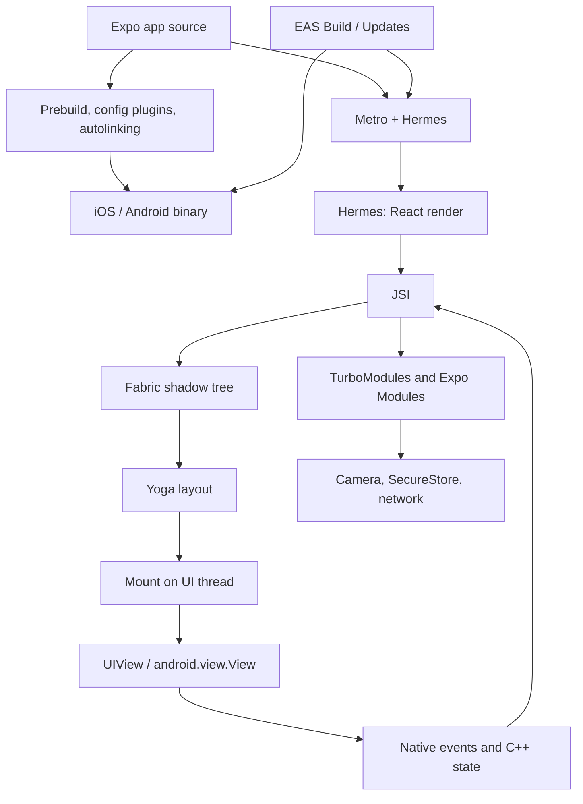

React Native is often introduced as "React, but the output is native views instead of the DOM." That skips why a string inside a `View` crashes, why `useState` on scroll offset drops frames, why an Expo config plugin does not ship over the air, or why `useLayoutEffect` can measure a view in one commit and still fail if you animate `height` every frame.

This stack ships React Native **through Expo**, the same way this site ships React through Next.js. **Expo is an orchestrator around React Native.** React Native is a **host renderer for React**. Expo classifies native modules, generates iOS and Android projects, bundles JavaScript with Metro, and maps artifacts onto devices. React Native turns a React tree into a C++ shadow tree, runs Yoga, and mounts `UIView` / `android.view.View` instances. React still owns elements, Fibers, lanes, render, and commit.

<br />

```text
app source + app.json / config plugins
  → Expo prebuild / autolinking / Expo Modules
  → Metro bundle (Hermes bytecode)
  → React render (Fibers)
  → Fabric shadow nodes (C++, via JSI)
  → Yoga layout
  → mount native views
  → native events / C++ state / Expo Modules feed back
```

<br />

This note targets **Expo SDK 57** (`expo@57.0.9`, React Native **0.86.2**, React **19.2**, Hermes V1). The New Architecture is the default and, in this SDK line, the only supported runtime. Four kinds of statements:

- A **React rule**, such as render purity or a state setter scheduling work rather than mutating the current closure.
- A **React Native contract**, such as `<View>` and `<Text>` being different host components.
- An **Expo contract**, such as config plugins, Continuous Native Generation, Expo Modules, `expo-router`, or the split between EAS Build and EAS Update.
- An **implementation observation**, such as a shadow-node field. Application code must not depend on them.

The legacy Bridge and `react-native init` appear only where old vocabulary causes ambiguity. Expo Go is a development host with a fixed native module set. It is not the production architecture.

---

## 1. Expo Adds Policy and Infrastructure Around React Native

React defines components, reconciliation, Suspense, and concurrent rendering. It does not decide how a TypeScript screen becomes an IPA, which native module is linked, how fonts are embedded, or how a later JavaScript bundle replaces the one that shipped with the store build. React Native decides how host views are created. Expo decides the rest of the delivery path.

<br />



<br />

- **Config and prebuild** decide which native code exists in the binary. `app.json` / `app.config.ts` plus config plugins are the contract. `npx expo prebuild` materializes `ios/` and `android/`.
- **Autolinking** discovers native modules in the **app** package's `node_modules`. A native dependency that lives only in a shared workspace package is invisible.
- **Metro** turns the JavaScript graph into a bundle Hermes can execute. Fast Refresh replaces that graph in development. Hermes V1 compiles it to bytecode for production.
- **React Native** renders, lays out, and mounts. Expo does not replace Fabric.
- **EAS** is the deployment adapter. EAS Build produces a native binary. EAS Update / `expo-updates` replaces the JavaScript bundle inside a binary that already contains the matching native surface.

Expo is to React Native what Next.js is to the browser: policy and infrastructure around a React core. Next.js maps URLs to React trees for a browser. Expo maps `app/` files and native modules to React trees for a device.

---

## 2. React Native Is a Renderer, Not a Browser

A browser parses HTML, builds a DOM and CSSOM, styles, lays out, paints, and composites. That path is [The Critical Rendering Path in the Browser](/notes/critical-rendering-path-in-the-browser). React Native does none of that. There is no HTML, no CSSOM, and no DOM. JSX still produces React elements. The host tree is **platform views**.

`<View>` and `<Text>` are not divs with different default styles. They are **different host components** with different native types and different layout rules. Yoga can size a `View`. Text metrics come from the platform (`NSLayoutManager` / Android text layout). A string is only legal as a child of `Text`.

<br />

```tsx
function Badge({ count }: { count: number }) {
  return (
    <View>
      {count > 0 ? <Text>{count}</Text> : null}
    </View>
  )
}
```

<br />

- React Native tries to mount a raw string as a host child of a view that does not accept text. `<View>Hello</View>` crashes in production.
- The web DOM will stringify `0` into a text node. The native host tree will not.
- Expo Go does not change this contract. It is a prebuilt app whose native module set is whatever Expo shipped in that Go binary. A config plugin, custom Expo Module, or new native dependency is invisible to Go until it exists in **your** binary.
- Production development uses a **dev client** (`expo-dev-client`) or an EAS build whose native surface matches `app.json`.

**Failure:** `{count && <Text>{count}</Text>}` when `count` is `0`. JSX renders `0`, not `false`. Fabric then attempts to create a text host node under a `View`. The condition belongs in a boolean or a ternary.

---

## 3. Four Trees

[Understanding React in Depth](/notes/understanding-react-in-depth) separates React elements, the Fiber tree, and the host tree. Fabric adds a fourth tree that lives in C++.

<br />

```text
React elements   descriptions returned by components
Fiber tree       React's persistent bookkeeping and unit of work
Shadow tree      C++ layout tree (Yoga)
Host view tree   UIView / android.view.View on the UI thread
```

<br />

- A composite component such as `HomeScreen` or an `expo-router` layout never becomes a shadow node. Fabric creates shadow nodes only for hosts: `View`, `Text`, `ScrollView`, `Image` from `expo-image`.
- A host Fiber stores a JSI pointer to its shadow node. The element is a temporary description. The Fiber remembers identity, hooks, and lanes. The shadow node holds style, children, and layout. The host view is what the user can see.
- A new element object does not mean a new `UIView`. A component render does not mean a mount. A wrapper `View` in JSX may never exist as a native view after flattening.
- A `ScrollView` offset that changed on the device did not necessarily pass through React state.

---

## 4. JSI Replaced the Bridge

Before the New Architecture, JavaScript and native code talked through an asynchronous queue. Calls were serialized to JSON, posted across the bridge, and decoded on the other side. Layout could not be read synchronously during render. Native modules were initialized eagerly. Concurrent React could not commit a coherent native tree.

The New Architecture replaces that queue with **JSI**, the renderer with **Fabric**, and native modules with **TurboModules** (and, in Expo, the **Expo Modules API**). Expo SDK 55 dropped the legacy architecture. SDK 57 does not offer it as a runtime option.

**JSI** (JavaScript Interface) is a C++ API that lets a JavaScript engine hold a reference to a native object, and native code hold a reference to a JavaScript function. A JS call into native can be **synchronous**. There is no JSON round-trip on the hot path.

- That is the contract Fabric uses to create shadow nodes during render, and the contract TurboModules and Expo Modules use to expose `SecureStore`, camera frames, and filesystem handles.
- A library such as VisionCamera can process frame buffers without copying ~30 MB of pixels into a JSON string sixty times a second.
- Synchronous does not mean free, and it does not mean "on another thread." A heavy JSI call on the **JS thread** still stalls React. If the work belongs on the UI thread, the module must hop there explicitly.
- JSI is not a React API. Application code should keep calling documented modules. The fact that those modules are JSI host objects explains latency; it is not a type to reach for in a screen.

The word "bridge" still appears in blog posts and in interop layers for old modules. It is not the contract the framework is built on.

---

## 5. Threading

Fabric keeps renderer structures immutable: updates clone rather than mutate. Two threads matter for almost every production bug.

<br />

```text
JS thread                         UI thread
  React render                      host view mutations
  most Yoga layout                  high-priority render (gestures)
  TurboModule / Expo Module JS      C++ state from native views
  Metro / Fast Refresh
```

<br />

- The **JS thread** runs Hermes, React's render phase, and most Yoga work.
- The **UI thread** (main thread) is the only thread that may create, update, or destroy host views.
- High-priority native events can run the render pipeline **on the UI thread** so a gesture is not stuck behind an in-flight JS render. Lower-priority work can be interrupted.
- C++ state updates, such as a `ScrollView` offset, can skip React's render phase entirely.
- Hermes does not give you a second JS thread. Concurrent React can pause and restart a render on the JS thread. It does not move JavaScript onto the UI thread unless the renderer explicitly runs a high-priority pass there.

**Failure:** treating "the app is slow" as one diagnosis. A long React render occupies the JS thread. A layout-thrashing animation occupies Yoga. A main-thread native module occupies the UI thread and delays mount. Reanimated worklets exist because some work must not wait for JS at all.

---

## 6. Render, Commit, and Mount

Fabric's pipeline has three phases. Official documentation calls them **render**, **commit**, and **mount**. They correspond to React's render/commit split, with an extra native publication step.

<br />

```text
React render (JS)
  → shadow nodes (C++, via JSI)
  → commit: Yoga + promote next tree
  → mount: diff, flatten, mutate UIView / android.view.View
```

<br />

- **Render.** React reduces composite components to host elements. For each host, Fabric synchronously creates a shadow node in C++. This usually runs on the JS thread. The React element tree is temporal. Fibers persist and hold the JSI pointer.
- **Commit.** Fabric calculates layout with Yoga and promotes that tree to "next." Most layout is C++. `Text` and `TextInput` still call into the platform for metrics. Commit must not mutate host views.
- **Mount.** The UI thread diffs the previously mounted shadow tree against the next one, flattens nodes that do not need a host view, and applies atomic mutations: create, update, insert, remove, delete. Only then do pixels change.
- An initial render diffs against an empty tree. An update may touch a single `backgroundColor`. React can skip intermediate trees: a later completed render can mount against the last published tree, not against every abandoned attempt.

This is why concurrent features work on native. Render is speculative. Mount is the publication. A transition that never finishes never mutates host views.

---

## 7. Yoga, Flattening, and What Layout May Cost

Yoga implements a Flexbox-like layout in C++. Styles are JavaScript objects, not CSS stylesheets. `gap`, `padding`, and `flex` are shadow-node inputs. They are not a browser cascade.

<br />

```tsx
import { useEffect, type ReactNode } from "react"
import Animated, {
  useAnimatedStyle,
  useSharedValue,
  withTiming,
} from "react-native-reanimated"

function SlideIn({ visible, children }: { visible: boolean; children: ReactNode }) {
  const progress = useSharedValue(visible ? 1 : 0)

  useEffect(() => {
    progress.set(withTiming(visible ? 1 : 0))
  }, [progress, visible])

  const animatedStyle = useAnimatedStyle(() => {
    const value = progress.get()
    return {
      opacity: value,
      transform: [{ translateY: (1 - value) * 24 }],
    }
  })

  return <Animated.View style={animatedStyle}>{children}</Animated.View>
}
```

<br />

- **View flattening.** Nested wrapper `View`s that only pass through layout often never become host views. Fabric can reduce a typical shadow tree of 600–1000 nodes to on the order of 200 host views. A missing `View` in the native inspector is often flattening, not a missing mount.
- Animating `width`, `height`, `top`, `margin`, or `padding` asks Yoga to recompute **every frame**. Animating `transform` and `opacity` can run on the GPU without relayout.
- Fabric makes **synchronous measurement** possible in the same commit. `useLayoutEffect` can read layout before paint via `getBoundingClientRect` (the post-0.82 path). `onLayout` keeps the value current when the view later changes. Prefer a dispatch updater so an identical size does not schedule another render.
- Neither measurement API is an excuse to animate layout properties.

**Failure:** animating `height` every frame, then wondering why Yoga and mount cannot keep 60fps.

---

## 8. Structural Sharing and C++ State

Shadow trees are immutable. A React state update clones the path from the changed node to the root and **shares** unchanged subtrees. Mount diffs the previous published tree against the new one.

Most information in the shadow tree originates in React and flows down. **C++ state** is the exception. Some host components keep state that JavaScript does not own. `ScrollView` offset is the usual example: the platform view scrolls, C++ records the offset, and APIs such as `measure` can read it. React did not render that update.

<br />

```tsx
function Feed() {
  const [scrollY, setScrollY] = useState(0)

  return (
    <ScrollView
      onScroll={(event) => {
        setScrollY(event.nativeEvent.contentOffset.y)
      }}
      scrollEventThrottle={16}
    />
  )
}
```

<br />

- Keys and identity still matter: they decide which Fiber, which shadow node, and which host view survive.
- A large screen that returns a new inline style object on every row can still do more work than the screenshot suggests. The style is an input to cloning even when the visual result looks identical.
- C++ state commits retry if React committed in between. The source of truth stays native.

**Failure:** putting scroll offset in `useState`. The JS thread now reconciles on the way to every frame. The offset already exists in C++. For animation, a Reanimated shared value updates on the UI thread. For non-reactive tracking, a ref is enough.

---

## 9. TurboModules, Codegen, and Expo Modules

Legacy native modules were registered up front. Startup paid for camera, maps, and analytics even if the first screen never used them.

**TurboModules** load lazily through JSI. The first JS access constructs the module. **Codegen** reads TypeScript or Flow specs and generates the native bindings so the JS/native interface is checked at build time.

Expo's **Expo Modules API** sits on the same JSI layer. `expo-secure-store`, `expo-camera`, `expo-font`, and `expo-image` are native modules with JavaScript entry points. They are not optional wrappers around `fetch`.

<br />

```json title="app.json"
{
  "expo": {
    "plugins": [
      [
        "expo-font",
        {
          "fonts": ["./assets/fonts/Geist-Bold.otf"]
        }
      ]
    ]
  }
}
```

<br />

- **Autolinking** scans the app's `node_modules`. In a monorepo, a native dependency used by `packages/ui` must also be declared in the app package. Otherwise prebuild will not link it.
- **Config plugins** mutate the generated native project: Info.plist keys, Gradle permissions, embedded fonts, splash screens. Fonts belong in the `expo-font` plugin so they exist at process start, not after an async `useFonts` gate.
- Images belong in `expo-image`: native caching, blurhash placeholders, recycling keys. `react-native`'s `Image` is the thinner host wrapper.
- Adding a plugin or a native module changes the **native** surface. That requires `npx expo prebuild` (or EAS Build) and a new binary. JavaScript-only changes do not.

---

## 10. Metro, Hermes, and What OTA Can Replace

`npx expo start` runs Metro. Metro walks the module graph from the Expo entry, resolves platform extensions (`*.ios.tsx`, `*.android.tsx`), and serves a bundle. In development, Fast Refresh replaces components while preserving state where it can. In production, **Hermes V1** (default since SDK 56, including SDK 57) compiles the bundle to bytecode.

- The JS thread is still one thread. A cheaper bytecode format does not make an unbounded `map` over a feed free.
- **EAS Update** / `expo-updates` ships a new JavaScript bundle to an existing binary. It cannot add a native module, a permission, a font file registered through a config plugin, or a new Expo Module. Those live in the IPA/APK.
- The store build is the native contract. The update is a new React tree for that contract.
- React Native DevTools talks to the engine. A JS-only freeze is a Hermes/React problem. A freeze that continues while JS is idle is a UI-thread or native-module problem.

**Failure:** a screen that starts calling `expo-camera` after an OTA, against a binary built without that module. The update does not invent the native code.

---

## 11. expo-router Is a Route Tree on Native Views

`expo-router` maps files under `app/` to screens, the way Next.js maps `app/` to URL segments. The analogy is useful and incomplete. Next.js produces HTML and a Flight tree for a document. Expo Router produces a React tree that Fabric mounts into a **native** navigator.

<br />

```tsx title="app/_layout.tsx"
import { Stack } from "expo-router"

export default function Layout() {
  return <Stack />
}
```

<br />

- Use the native stack. Expo Router's `Stack` is `@react-navigation/native-stack`. Transitions and back-swipe run on the UI thread. `@react-navigation/stack` is a JS navigator: it animates views through React and loses that native behavior.
- Tabs should be native too when the product cares about platform feel. On SDK 57 that is `expo-router/unstable-native-tabs` (`NativeTabs`). Prefer native tabs even if that module path later stabilizes.
- A layout file is a composite component. It has Fiber identity. It does not become a shadow node of its own. The native stack owns host views for headers, gestures, and large titles. Prefer native header options over a custom JS header.
- Navigation is part of the host tree. If the transition runs in JavaScript, every frame re-enters React. If it runs in `UINavigationController` / the Android native tab host, React can stay idle while the OS animates.

---

## 12. Concurrent React on Native

Fabric is what makes React 18+ scheduling real on device. The legacy renderer could not participate cleanly in transitions, Suspense, or automatic batching from native events.

- `startTransition` can mark a heavy screen update as interruptible. A slider that sets a large list size can keep the gesture urgent and the list transitional.
- Suspense can show a fallback for a region of the native tree without tearing down the committed host views outside that boundary.
- On the legacy architecture, `onLayout` plus a follow-up `setState` often painted one frame of a tooltip in the wrong place. With Fabric, `useLayoutEffect` plus `getBoundingClientRect` can measure and apply in one commit.
- Concurrent rendering is still not parallelism. Hermes runs the work. Fabric can interrupt it. The UI thread can take a high-priority pass. The committed host tree stays coherent.

For the React APIs themselves, see [React 19 New Features](/notes/react-19-new-features) and [Understanding React in Depth](/notes/understanding-react-in-depth). Those APIs are not no-ops on Expo SDK 57.

---

## 13. Work That Cannot Wait for JS

A 60fps gesture cannot round-trip through React render, Yoga, and mount on the JS thread and still feel native. Reanimated worklets and Gesture Handler run on the UI thread. SDK 57 pins current versions of `react-native-reanimated`, `react-native-worklets`, and `react-native-gesture-handler`.

`Pressable` is the host press primitive. `TouchableOpacity` is legacy. Animated press states belong in a `GestureDetector` plus shared values, not in a JS `setState` on press-in.

Lists are the other JS-thread trap. A `ScrollView` that maps every row creates a Fiber, a shadow node, and potentially a host view for offscreen content.

<br />

```tsx
import { FlashList } from "@shopify/flash-list"

function Feed({ items }: { items: Item[] }) {
  return (
    <FlashList
      data={items}
      renderItem={({ item }) => <ItemCard item={item} />}
      keyExtractor={(item) => item.id}
    />
  )
}
```

<br />

- A virtualizer mounts roughly the visible window. That is a Fabric budget, not a stylistic preference. LegendList is the same idea. The contract is "do not mount what the user cannot see."
- Inline style objects and inline callbacks on `renderItem` still defeat memoization when the compiler is not inlining them; hoist or let the React Compiler do it.
- Extra render → extra shadow clones → extra mount diffs on the JS and UI threads while the user is scrolling.

---

## 14. Following One Press End to End

A membership card screen in Expo Router. The user presses a `Pressable`. The handler writes a flag with `setState` and reads a token from `expo-secure-store`.

1. The OS delivers a touch to the host view on the UI thread.
2. Fabric / Gesture Handler routes the press into JS and calls the `Pressable` handler.
3. `setState` enqueues a Hook update on the screen's Fiber and schedules the root ([Understanding React in Depth](/notes/understanding-react-in-depth)).
4. React renders on the JS thread. Composite components run. Host elements are created.
5. Fabric clones or creates shadow nodes for changed hosts, via JSI, and shares the rest.
6. Commit runs Yoga. Text metrics may call into UIKit / Android.
7. Mount diffs the previous shadow tree, flattens wrappers, and mutates native views on the UI thread.
8. The `expo-secure-store` read is a separate JSI call into an Expo Module. It does not go through Fabric. It may hop threads inside the module. It never becomes a `View`.
9. If the press also navigated, the native stack animates on the UI thread while React renders the destination screen. Those two are coupled by routing, not by one function call.

React never rewrites the `pressed` binding in the handler that already ran. A half-finished render never becomes a half-mutated `UIView` tree. SecureStore is not in the shadow tree. The card's `View` is.

---

## 15. Debugging Questions and Common Misconceptions

When an Expo screen surprises, work through these in order:

1. **Which thread is busy?** JS freeze versus UI freeze versus both.
2. **Is this Expo Go, a dev client, or a release binary?** Go cannot grow new native modules.
3. **Did React render, Fabric commit, or mount?** A `console.log` in a component does not prove a `UIView` changed.
4. **Is this C++ state or React state?** Scroll offset, text selection, and some gesture state never entered `useState`.
5. **Did flattening remove the view under inspection in the native inspector?**
6. **Does this change need a native rebuild, or is JS enough?** Config plugins, permissions, fonts, and new Expo Modules need a new binary. EAS Update cannot invent them.
7. **Is autolinking looking at the app package?** A native dep only in a workspace library is a missing link, not a Metro cache issue.
8. **Is this a host-component contract?** Strings outside `Text`, `0 && <Text />`, `TouchableOpacity` in a Gesture Handler list.
9. **Is navigation native?** A JS stack will show up as React work during a transition that should have been free.
10. **Is layout running every frame?** Animated `height` is Yoga. Animated `transform` is not.

These questions beat adding `memo` until a list stops dropping frames.

Common misconceptions:

- **React Native is not a WebView.** A WebView is a browser origin inside the app. Fabric mounts platform views. Mixing the two is a security boundary, covered in [Frontend Security in Next.js and React Native](/notes/frontend-security-nextjs-react-native).
- **Expo Go is not how production works.** Production is your EAS binary plus, optionally, an OTA JavaScript bundle that fits that binary.
- **Managed does not mean no native.** Expo generates the native project. The app is still UIKit and Android views. Config plugins are native edits. Expo Modules are native code.
- **The Bridge is not how JS talks to native on SDK 57.** JSI is the contract. Interop may exist for old modules.
- **JSI does not mean JavaScript runs in parallel.** JSI is shared-memory calling. Hermes is still one JS thread.
- **Fabric is not a new React.** Fabric is React Native's renderer. React's reconciler is the same core described in [Understanding React in Depth](/notes/understanding-react-in-depth).
- **EAS Update cannot ship a new native module.** It ships JavaScript. Native surface changes need a new build.
- **More `View`s does not mean more native views.** Flattening drops wrappers. Virtualization refuses to mount offscreen rows.
- **`useLayoutEffect` is not useless on native.** On Fabric in SDK 57, it is how you measure without a visible jump.

---

## Final Mental Model

The shortest accurate model:

<br />

```text
Expo generates the native binary and the JS bundle.
Hermes runs React.
Fibers remember.
JSI shares memory with native.
Fabric builds a shadow tree.
Yoga lays out.
Mounting publishes UIView / android.view.View.
C++ state can bypass React.
OTA replaces JS, not native.
```

<br />

React Native does not replace React's rendering model. Expo does not replace React Native's renderer. Expo decides which modules exist, how the native project is generated, and how a binary and a bundle reach a device. React Native decides how a React tree becomes platform views. React decides how updates are scheduled, rendered, and committed.

Keep rendering pure because Fabric may restart it. Keep strings in `Text` because the host tree is not a DOM. Keep scroll and gestures off the React state tree when the UI thread already owns them. Keep config plugins in the binary, not in an EAS Update. Use native navigators so transitions do not re-enter JavaScript.

For React's own queues, lanes, and commit phase, continue with [Understanding React in Depth](/notes/understanding-react-in-depth). For the web contrast, see [The Critical Rendering Path in the Browser](/notes/critical-rendering-path-in-the-browser). For Next.js as the analogous orchestrator on the server/document side, see [Understanding Next.js in Depth](/notes/understanding-next-js-in-depth). For the device threat model (extractable bundle, SecureStore, WebView bridges), see [Frontend Security in Next.js and React Native](/notes/frontend-security-nextjs-react-native).

Primary references: Expo's [SDK 57 changelog](https://expo.dev/changelog/sdk-57), and React Native's [architecture overview](https://reactnative.dev/architecture/overview), [render pipeline](https://reactnative.dev/architecture/render-pipeline), [threading model](https://reactnative.dev/architecture/threading-model), and [New Architecture](https://reactnative.dev/docs/the-new-architecture/landing-page) notes. Public Expo and React Native contracts are the durable API. Shadow-node internals and Metro details are debugging evidence for today's toolchain, not an API to hard-code.

The implementation observations in this article correspond to **Expo SDK 57** with React Native **0.86.2** (Hermes V1, New Architecture). React Native 0.87 is the next Expo canary line, not this SDK's runtime.

---

## Recap Q&A

<Accordion type="single" collapsible>
  <AccordionItem value="rn-renderer">
    <AccordionTrigger>1. Why is React Native a renderer, not a browser?</AccordionTrigger>
    <AccordionContent>

      - There is no HTML, CSSOM, or DOM. JSX still produces React elements. The host tree is **platform views**.
      - `<View>` and `<Text>` are different host components with different native types. A string is only legal as a child of `Text`.
      - `{count && <Text>{count}</Text>}` crashes when `count` is `0` because JSX renders `0` and Fabric tries to mount text under a `View`. The web DOM will stringify that. The native host will not.
      - **Expo** is the orchestrator around React Native the way Next.js is around React: prebuild, autolinking, Metro, EAS.
      - Expo Go has a fixed native module set. A config plugin is invisible until it exists in **your** binary. Production development uses a **dev client**.

    </AccordionContent>
  </AccordionItem>

  <AccordionItem value="rn-jsi-bridge">
    <AccordionTrigger>2. What did the Bridge break, and what is JSI instead?</AccordionTrigger>
    <AccordionContent>

      - The legacy Bridge was a **message bus**: JSON over an async queue. The New Architecture is the default in this SDK line.
      - **JSI** is a C++ API that lets the engine hold a native object and native code hold a JS function. A JS call into native can be **synchronous**. There is no JSON round-trip on the hot path.
      - Fabric creates shadow nodes this way. VisionCamera can process frames without copying ~30 MB of pixels into JSON sixty times a second.
      - Synchronous does not mean free. A heavy JSI call on the **JS thread** still stalls React. If the work belongs on the UI thread, the module must hop there.
      - Application code should keep calling documented modules. JSI explains latency; it is not a type you reach for in a screen.

    </AccordionContent>
  </AccordionItem>

  <AccordionItem value="rn-threading">
    <AccordionTrigger>3. Which threads matter, and why is “the app is slow” not one diagnosis?</AccordionTrigger>
    <AccordionContent>

      - The **JS thread** runs Hermes, React's render phase, and most Yoga. The **UI thread** is the only thread that may create, update, or destroy host views.
      - High-priority native events can run the render pipeline **on the UI thread** so a gesture is not stuck behind an in-flight JS render.
      - C++ state, such as a `ScrollView` offset, can skip React's render entirely.
      - A long React render occupies JS. A layout-thrashing animation occupies Yoga. A main-thread native module occupies the UI thread and delays mount.
      - Reanimated worklets exist because some work must not wait for JS. Hermes does not give you a second JS thread. Concurrent React can pause a render on the JS thread; it does not move JavaScript onto the UI thread unless the renderer explicitly runs a high-priority pass there.

    </AccordionContent>
  </AccordionItem>

  <AccordionItem value="rn-yoga">
    <AccordionTrigger>4. What does Yoga layout, and what should you not animate?</AccordionTrigger>
    <AccordionContent>

      - Fabric **render** creates C++ shadow nodes via JSI. **Commit** runs Yoga and promotes the next tree — it must not mutate host views. **Mount** on the UI thread diffs, flattens, and applies atomic mutations.
      - Nested wrapper `View`s that only pass through layout often **never become host views**. Missing a `View` in the native inspector is often flattening, not a missing mount.
      - Styles are JavaScript objects, not a CSS cascade. Animating `width`, `height`, `top`, `margin`, or `padding` asks Yoga to recompute **every frame**. Animate `transform` and `opacity` instead.
      - **Failure:** `useState` on scroll offset drops frames for the same reason: you asked React to render what C++ state already tracks.

    </AccordionContent>
  </AccordionItem>

  <AccordionItem value="rn-expo-router">
    <AccordionTrigger>5. How is expo-router a route tree, and where does the Next.js analogy break?</AccordionTrigger>
    <AccordionContent>

      - `expo-router` maps files under `app/` to screens the way Next maps `app/` to URL segments. Next.js produces HTML and a Flight tree for a **document**. Expo Router produces a React tree that Fabric mounts into a **native** navigator.
      - Use the native stack (`@react-navigation/native-stack`). Transitions and back-swipe run on the UI thread. The JS stack navigator animates through React and loses that.
      - An Expo config plugin does not ship over the air. EAS Update replaces the JS bundle, not the native binary.
      - Hermes bytecode is what Metro emits. A JS-only freeze is a Hermes/React problem. A freeze while JS is idle is a UI-thread or native-module problem.

    </AccordionContent>
  </AccordionItem>
</Accordion>
