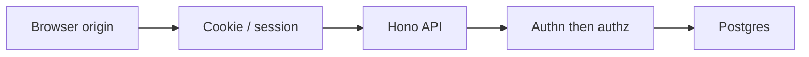

Web security is not a scanner score. Most production bugs are not exotic cryptography. They are a **trust boundary** that the application treats as solid when it is not.

Three boundaries show up again and again:

- The **browser origin** — which scripts may read the page and its storage
- The **cookie jar** — which requests automatically carry a session
- The **server authorization check** — which rows and actions a verified identity may actually touch

The [OWASP Top 10:2025](https://owasp.org/Top10/2025/) is a map of how those boundaries fail, not a checklist to memorize. This note walks each category as *what fails*, *what an attacker is trying to achieve*, and *how I defend it* in a **Next.js**, **Hono**, **Better Auth**, **Drizzle**, and **PostgreSQL** stack.

<br />

It is a defensive reading. I describe failure modes and attacker goals. I do not reproduce exploits.

<br />

---

## 1. A Mental Model

A typical authenticated request crosses four places that must agree:

<br />



<br />

The origin is the browser's isolation unit. Scripts from `https://app.example.com` may read that origin's DOM, `localStorage`, and non-`HttpOnly` cookies. They may not read another origin. **XSS collapses this unit**: once hostile script runs on the origin, the browser will happily hand it whatever that origin can see.

Authentication answers **who** is making the request. Authorization answers **what they may do**. Logging in is not permission to read another organization's project, another user's invoice, or an internal URL the server can reach.

Nothing the client sends is a source of truth: object IDs in the URL, roles in JSON, `X-Organization-Id` headers, hidden form fields. The server must derive identity from a verified session and decide access from membership and policy. I wrote that isolation path in [Building a Multi-Tenant Backend with Hono, Better Auth, Drizzle, and Postgres RLS](/notes/multi-tenant-backend-drizzle-hono-better-auth). Cookie lifetime and `HttpOnly` belong with [Local Storage, Session Storage, and Cookies](/notes/browser-storage-localstorage-sessionstorage-cookies).

The rest of this note is those three sentences applied to each Top 10 category.

<br />

---

## 2. The 2025 Map

| ID | Category | What actually fails |
| --- | --- | --- |
| A01 | Broken Access Control | The server trusts identity or object IDs the client can change. SSRF now lives here. |
| A02 | Security Misconfiguration | Debug, CORS, headers, or cloud defaults left open. |
| A03 | Software Supply Chain Failures | A compromised dependency, lockfile, or build/publish path. |
| A04 | Cryptographic Failures | Secrets in transit or at rest, or homemade crypto. |
| A05 | Injection | Untrusted input concatenated into SQL, HTML, commands, or prompts. |
| A06 | Insecure Design | The feature is unsafe even when implemented "correctly." |
| A07 | Authentication Failures | Weak session, reset, or MFA design. |
| A08 | Software or Data Integrity Failures | Unsigned artifacts, untrusted deserialization, or unverified CI output. |
| A09 | Security Logging and Alerting Failures | No signal, or signal with nobody paged. |
| A10 | Mishandling of Exceptional Conditions | Fail-open, leaked internals, or logic bugs on error paths. |

<br />

A01 stayed at number one. Misconfiguration and supply chain moved up. SSRF was folded into broken access control: making the server fetch a URL the caller should not reach is the same class of bug as making it return a row the caller should not read. A10 is new: systems that fail open, leak internals, or take the wrong branch when something exceptional happens.

<br />

---

## 3. A01 Broken Access Control

Access control fails when the server **returns or fetches a resource based on a client-chosen identifier** without proving that this identity may touch it. Two shapes show up constantly:

- **Object-level** — the route exists for this user, but the ID belongs to someone else (`/projects/:id` with no tenant check).
- **Function-level** — the route should not exist for this role at all (a member hitting an owner-only billing export).

Changing a project ID in the URL, swapping an organization header, or asking the server to retrieve a URL on the caller's behalf are the same mistake: the API trusted the request more than the session.

The attacker goal is **confused deputy**. They already have some legitimate access, or they can send a request that looks ordinary. They want a row, file, or internal service that policy would deny if the server actually checked.

Defense is identity from the session, tenancy from a verified membership check, and a database that still says no if application code forgets a filter.

<br />

```ts
import { APIError } from "better-auth/api"
import { createMiddleware } from "hono/factory"
import { auth } from "../auth"

type Variables = {
  userId: string
  organizationId: string
  memberRole: string
}

export const requireTenant = createMiddleware<{ Variables: Variables }>(
  async (c, next) => {
    const session = await auth.api.getSession({ headers: c.req.raw.headers })

    if (!session) {
      return c.json(
        { code: "UNAUTHORIZED", message: "Authentication is required." },
        401
      )
    }

    const organizationId = c.req.param("organizationId")
    if (!organizationId) {
      return c.json(
        {
          code: "ORGANIZATION_REQUIRED",
          message: "An organization ID is required.",
        },
        400
      )
    }

    try {
      const { role } = await auth.api.getActiveMemberRole({
        headers: c.req.raw.headers,
        query: { organizationId },
      })

      c.set("userId", session.user.id)
      c.set("organizationId", organizationId)
      c.set("memberRole", role)
    } catch (error) {
      if (error instanceof APIError && error.statusCode < 500) {
        return c.json(
          {
            code: "FORBIDDEN",
            message: "You cannot access this organization.",
          },
          403
        )
      }

      throw error
    }

    await next()
  }
)
```

<br />

Handlers then load by id **inside** that tenant, not from a global table:

<br />

```ts
const [project] = await withTenant(organizationId, (tx) =>
  tx
    .select()
    .from(projects)
    .where(
      and(eq(projects.id, projectId), eq(projects.organizationId, organizationId))
    )
)

if (!project) {
  return c.json({ code: "NOT_FOUND", message: "Project not found." }, 404)
}
```

<br />

Postgres RLS is the second gate. A missed `WHERE` should return zero rows, not another tenant's data. That is the whole point of the multi-tenant note.

SSRF is the same class on the network side. If a handler fetches a URL from the request body — a webhook target, an image to proxy, a link to unfurl — the server is acting as the caller. Allowlist schemes and hosts, block link-local and metadata ranges, and do not follow redirects to a destination you have not re-checked. Prefer not to fetch caller-supplied URLs at all.

Never copy `userId`, role, or tenant from a client-controlled header. The session cookie is the identity; the route's organization ID is a claim that middleware must verify.

<br />

---

## 4. A02 Security Misconfiguration

Misconfiguration is leaving a **dangerous default on** in an environment that is reachable. Frameworks, clouds, and CDNs are secure only in the configuration you actually shipped. Debug error pages, `Access-Control-Allow-Origin: *` with credentials, open S3 listings, default database passwords, and missing security headers are the same category: the product assumed the platform's defaults were production-ready.

The attacker goal is **reconnaissance that becomes access**. They want stack traces, admin consoles, directory listings, or a CORS policy that lets another origin read authenticated responses.

Defense is explicit production policy: tight CORS, no debug, no stack traces to the client, and a small set of headers on every response.

<br />

```http
Content-Security-Policy: default-src 'self'; object-src 'none'; base-uri 'self'; frame-ancestors 'none'
X-Content-Type-Options: nosniff
Referrer-Policy: strict-origin-when-cross-origin
Set-Cookie: session=opaque; Path=/; HttpOnly; Secure; SameSite=Lax
```

<br />

CSP is a **backup** for XSS, not a substitute for not rendering untrusted HTML. `object-src 'none'` and `frame-ancestors 'none'` close two old embedding paths. `nosniff` stops the browser from treating a downloaded file as JavaScript. Cookie flags are session policy; they are documented with storage because that is where people get them wrong.

On the API, CORS should name the app origin, not the world. The SST API Gateway example in [Backend APIs with Hono, Drizzle, Zod OpenAPI, and SST](/notes/backend-apis-hono-sst) already does this:

<br />

```ts
cors: {
  allowOrigins: ["https://app.example.com"],
  allowMethods: ["GET", "POST", "PUT", "PATCH", "DELETE", "OPTIONS"],
  allowHeaders: ["Content-Type", "Authorization"],
  allowCredentials: true,
}
```

<br />

`allowCredentials: true` only makes sense with an explicit origin. A wildcard origin with cookies is a misconfiguration, not a convenience.

I also stage-gate OpenAPI and Scalar in production. A public reference is free reconnaissance. Cloud buckets, database security groups, and leftover `/debug` routes are the same review: if it is reachable and not required, it is open.

<br />

---

## 5. A03 Software Supply Chain Failures

Supply chain failure is **running code you did not intend to run**. In 2025 this category expanded past "forgot to bump lodash." It includes a malicious maintainer, a typosquatted package, a compromised publisher account, a poisoned GitHub Action, and a build that installs whatever `latest` means today.

The attacker goal is **execution in your install or CI**. They do not need to break your authorization if they can ship a postinstall script into the laptop that has production secrets, or into the pipeline that publishes the app.

Defense is pinning, provenance, and a small install surface:

- Commit the lockfile and install with `npm ci` / `pnpm install --frozen-lockfile`. CI that mutates the lockfile is not reproducing the same tree.
- Prefer packages with provenance where the ecosystem supports it, and review `npm audit` as a signal, not a score.
- Pin GitHub Actions to a full commit SHA, not a floating tag. Tags move; SHAs do not.

<br />

```yaml
- uses: actions/checkout@<full-commit-sha>
```

<br />

- Do not run lifecycle scripts from untrusted packages. `ignore-scripts` is a reasonable default for apps that do not need native compilation at install time.
- Keep production images and Lambda bundles generated from the same lockfile the PR reviewed. Do not `npm install` on the server.

This is not a supply-chain textbook. The practical bar is: **the artifact that runs in production is the artifact the pull request described**, and third-party code cannot silently change between review and deploy.

<br />

---

## 6. A04 Cryptographic Failures

Cryptographic failure is **protecting a secret with something that is not actually a secret**, or with a construction you invented. TLS off, passwords stored reversibly, API keys in the Next.js client bundle, JWTs in `localStorage`, and homemade "encryption" of database columns are the usual forms.

The attacker goal is **the plaintext**: session tokens, password hashes they can brute-force cheaply, personal data at rest, or a signing key that lets them mint their own sessions.

Defense is boring on purpose:

- TLS everywhere, including between the app and Postgres, Redis, and object storage. Internal networks are not a cryptographic boundary.
- Let Better Auth (or the platform) hash passwords. Do not store reversible credentials.
- Put secrets in **SST Secrets** / Parameter Store, not in git, `.env` committed by accident, or `NEXT_PUBLIC_*` variables. Anything prefixed for the browser is public.
- I do not put access tokens in `localStorage`. An XSS on the origin can read it, and unlike an `HttpOnly` cookie the value is easy to replay from another client. Opaque session cookies with `HttpOnly; Secure; SameSite` are the default. The storage note covers why.

I also do not invent crypto. Token binding, envelope encryption, and key rotation are library problems. Application code should call a maintained primitive and keep the key out of the repo.

<br />

---

## 7. A05 Injection

Injection is **data interpreted as code in another language**. SQL, HTML, a shell, LDAP, and an LLM tool prompt are all interpreters. Concatenating untrusted input into those strings is the bug. XSS is injection into the HTML or JavaScript context of the origin; SQL injection is the same idea against the database.

The attacker goal is **to make the interpreter do something the application did not mean**: read extra rows, run a script in another user's browser, or invoke a tool the model should not have called.

Defense is **parameterized APIs and treating untrusted values as data**.

Drizzle (and every query builder worth using) sends values out of band. The SQL text is constant; the user string never becomes syntax:

<br />

```ts
const [user] = await db
  .select()
  .from(users)
  .where(eq(users.email, email))
```

<br />

String-built SQL is the failure mode. I do not show it. If a raw fragment is unavoidable, it is a constant owned by the codebase, never a request field.

On the HTML side, React already escapes text children. The remaining holes are `dangerouslySetInnerHTML`, `href` values that can become a script URL, and Markdown or rich-text pipelines that emit raw HTML. I keep user content as data, sanitize HTML through a maintained library if the product truly needs markup, and put CSP behind it.

Every Hono route still validates shape before the handler thinks:

<br />

```ts
import { z } from "@hono/zod-openapi"

const CreateProject = z.object({
  name: z.string().min(1).max(80),
  slug: z.string().regex(/^[a-z0-9-]+$/),
})
```

<br />

Zod is not a security boundary by itself — a valid slug can still belong to another tenant — but it stops the interpreter-shaped strings from arriving as "just a string." For agents, treat model output and retrieved documents as untrusted too: they are injection sources into the next prompt or tool call.

<br />

---

## 8. A06 Insecure Design

Insecure design is a feature that **cannot be implemented safely** without changing the product. Authorization bolted on after the schema is public, an export endpoint with no rate limit, a password-reset flow that confirms whether an email exists, a delete button with no confirmation and no audit, a "share by sequential ID" model — the code can be clean and the threat still wins.

The attacker goal is **to use the product as designed**, just harder than the happy path. They do not need a memory-corruption bug if the design already lets a member enumerate invoices or a stranger reset someone else's account.

Defense happens before the handler:

- Threat-model the object: *can a member of org A read org B's row if they guess the UUID?* If the answer depends on obscurity, the design is wrong. UUIDs are not access control.
- Destructive actions need an extra factor the attacker does not get for free: re-auth, a confirmation token, or an out-of-band approval.
- Rate-limit login, reset, invite, and export. Those endpoints are brute-force and enumeration surfaces even when the crypto is fine.
- Do not leak account existence in error text. "If that email exists, we sent a message" is a product copy decision with a security consequence.

The multi-tenant architecture is a design choice, not an implementation trick. Identity, request context, and RLS have to agree **before** the first `projects` table exists. Retrofits miss a job, a webhook, or an admin script.

<br />

---

## 9. A07 Authentication Failures

Authentication failure is **accepting a proof of identity that is too easy to steal, guess, or reuse**. Session tokens in JavaScript, sessions that never expire, password reset tokens that last a week, credential stuffing with no lockout, and MFA that can be skipped on "remember this device" forever.

The attacker goal is **to become the user**. Stolen cookies, reused passwords, and reset-flow confusion are more common than breaking the hash.

Defense is a maintained auth library and a tight session cookie.

Better Auth already owns password hashing, session records, and cookie issuance. I keep the session in a cookie the page script cannot read:

<br />

```http
Set-Cookie: session=opaque-value; Path=/; HttpOnly; Secure; SameSite=Lax
```

<br />

`HttpOnly` keeps XSS from trivially exporting the session. `Secure` keeps it off HTTP. `SameSite=Lax` is the default I start from for cookie-based CSRF reduction on ordinary navigations; mutating cross-site POSTs need a stricter analysis (SameSite, origin checks, or anti-CSRF tokens) depending on the cookie and the API layout.

I also:

- Rotate the session on login and on privilege change.
- Expire idle and absolute sessions. "Logged in forever" is a stolen-laptop feature.
- Return the same error for unknown users and wrong passwords.
- Prefer a standard MFA path from the library over a custom one.

The frontend should not invent a parallel auth scheme with bearer tokens in `localStorage` "because SPA." The browser already has a credential container. Use it.

<br />

---

## 10. A08 Software or Data Integrity Failures

Integrity failure is **trusting an artifact you did not verify**. Insecure deserialization, `eval` of a string from the network, a CI artifact copied from an unsigned URL, a webhook accepted because the path is obscure, a client-side package updated in place without a lockfile.

A03 is "the ecosystem shipped hostile code." A08 is "this process accepted a blob without checking who signed it." They overlap; the distinction is useful. Supply chain is the pipeline. Integrity is the trust check at the boundary.

The attacker goal is **to make your runtime accept their bytes as yours**: a webhook that creates an admin, a serialized object that becomes a function call, an image tag that moved under you.

Defense is verify-then-parse:

<br />

```ts
const signature = c.req.header("webhook-signature")
const rawBody = await c.req.text()

if (!signature || !verifyWebhook(rawBody, signature, webhookSecret)) {
  return c.json({ code: "UNAUTHORIZED", message: "Invalid signature." }, 401)
}

const event = WebhookEvent.parse(JSON.parse(rawBody))
```

<br />

Read the raw body, check the signature against a secret that never ships to the client, then parse. Do not `JSON.parse` first and sign the object you already trusted.

I do not `eval`, `new Function`, or deserialize into objects that can carry behavior. Pin container image digests in deploy config. Treat CI outputs as untrusted until the same pipeline that signed them produced them.

<br />

---

## 11. A09 Security Logging and Alerting Failures

Logging failure is **not knowing you were attacked until a customer says so**. Missing logs are one half. Logs nobody reads are the other. The 2025 name change to *alerting* is the point: a warehouse of JSON with no page is not a control.

The attacker goal is **time**. Quiet enumeration, a slow drain of another tenant's export endpoint, or a burst of 403s on admin routes should be visible while it is cheap to stop.

I log security-relevant events, not request bodies:

<br />

```ts
logger.warn({
  event: "authz.denied",
  userId,
  organizationId,
  action: "project:read",
  resourceId,
  requestId: c.get("requestId"),
})
```

<br />

Useful events: login success and failure, password reset, permission denials, admin actions, tenant switches, webhook signature failures. Not useful: cookies, tokens, passwords, full credit-card fields, or raw authorization headers. Those turn the log store into a second breach.

Alert on **rate and shape**, not on every 401. A spike of denials on one resource, resets for many accounts from one IP, or a sudden export volume is a page. A single mistyped password is not.

Request IDs on every response make the app log, the API Gateway log, and the database log joinable. Without that, alerting is archaeology.

<br />

---

## 12. A10 Mishandling of Exceptional Conditions

This category is new in 2025. It is **the wrong behavior when something goes sideways**: fail-open authorization when the membership service times out, a 500 that includes the SQL and the connection string, a catch block that returns 200 with empty data, a retry that processes a webhook twice and double-charges.

The attacker goal is **to force the exceptional path**. Timeouts, malformed JSON, missing headers, and partial database failures are inputs. If deny depends on a successful lookup, then a failed lookup is an allow.

Defense is **fail closed**, map errors, and keep internals off the wire.

<br />

```ts
app.onError((error, c) => {
  logger.error({
    event: "unhandled",
    err: error,
    requestId: c.get("requestId"),
  })

  return c.json(
    { code: "INTERNAL_ERROR", message: "Something went wrong." },
    500
  )
})
```

<br />

If `getActiveMemberRole` throws a 5xx-class error, the middleware must not skip ahead as an anonymous member. Deny or fail the request. The 403 branch in the A01 middleware is the 4xx case — unknown or non-member. Anything else rethrows into this handler. A timeout that becomes "no membership, continue" is fail-open.

I never return ORM messages, Postgres error codes, or stack traces to the client. Those are logs. The user-facing body is a stable `code` plus a generic message.

Idempotency keys on payments and webhook handlers belong here too. An exceptional retry should not become a second side effect. Unique constraints in Postgres are a better duplicate detector than a comment that says "should only run once."

<br />

---

## 13. Defaults I Use

These are working defaults, not a certification:

- **Session cookies**, not bearer tokens in JavaScript. `HttpOnly; Secure; SameSite`. Identity comes from Better Auth's session, never from a client-supplied header.
- **Authorize on the server**, every time. Membership for this organization, permission for this action, row loaded inside the tenant transaction. RLS as the second gate.
- **Parameterized queries and Zod**. Untrusted input is data. HTML is data unless a sanitizer I trust says otherwise.
- **CSP and tight CORS** in production. No debug pages, no public OpenAPI, no wildcard origins with credentials.
- **Pin the supply chain.** Lockfile in git, frozen installs, Actions pinned to SHAs, secrets in SST not in the repo.
- **Fail closed.** Timeouts and thrown errors are denials, not anonymous access. Clients get a generic 4xx/5xx; logs get the detail.
- **Log and alert** on authz denials, admin actions, and signature failures — without logging secrets.

The origin, the cookie, and the authorization check are the product. OWASP's list is a way to notice when one of them is pretending to be stronger than it is.
