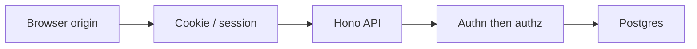

Web security is not a scanner score. Most production bugs are a **trust boundary** the application treats as solid when it is not.

Three boundaries recur:

- The **browser origin** — which scripts may read the page and its storage
- The **cookie jar** — which requests automatically carry a session
- The **server authorization check** — which rows and actions a verified identity may actually touch

The [OWASP Top 10:2025](https://owasp.org/Top10/2025/) maps how those boundaries fail. This note is a defensive reading for a **Next.js**, **Hono**, **Better Auth**, **Drizzle**, and **PostgreSQL** stack: failure modes and attacker goals, not exploits.

<br />

---

## 1. A Mental Model

A typical authenticated request must agree in four places:

<br />



<br />

- The origin is the browser's isolation unit. Scripts from `https://app.example.com` may read that origin's DOM, `localStorage`, and non-`HttpOnly` cookies.
- **XSS collapses this unit**: once hostile script runs on the origin, the browser hands it whatever that origin can see.
- Authentication answers **who**. Authorization answers **what they may do**. A login is not permission to read another organization's row.
- Nothing the client sends is a source of truth: object IDs, roles in JSON, `X-Organization-Id` headers, hidden fields. Identity comes from a verified session; access from membership and policy.

That isolation path is [Building a Multi-Tenant Backend with Hono, Better Auth, Drizzle, and Postgres RLS](/notes/multi-tenant-backend-drizzle-hono-better-auth). Cookie lifetime and `HttpOnly` belong with [Local Storage, Session Storage, and Cookies](/notes/browser-storage-localstorage-sessionstorage-cookies).

<br />

---

## 2. The 2025 Map

| ID | Category | What actually fails |
| --- | --- | --- |
| A01 | Broken Access Control | The server trusts identity or object IDs the client can change. SSRF now lives here. |
| A02 | Security Misconfiguration | Debug, CORS, headers, or cloud defaults left open. |
| A03 | Software Supply Chain Failures | A compromised dependency, lockfile, or build/publish path. |
| A04 | Cryptographic Failures | Secrets in transit or at rest, or homemade crypto. |
| A05 | Injection | Untrusted input concatenated into SQL, HTML, commands, or prompts. |
| A06 | Insecure Design | The feature is unsafe even when implemented "correctly." |
| A07 | Authentication Failures | Weak session, reset, or MFA design. |
| A08 | Software or Data Integrity Failures | Unsigned artifacts, untrusted deserialization, or unverified CI output. |
| A09 | Security Logging and Alerting Failures | No signal, or signal with nobody paged. |
| A10 | Mishandling of Exceptional Conditions | Fail-open, leaked internals, or logic bugs on error paths. |

<br />

- A01 stayed at number one. Misconfiguration and supply chain moved up.
- **SSRF** was folded into broken access control: making the server fetch a URL the caller should not reach is the same class as returning a row they should not read.
- **A10** is new: fail-open, leaked internals, or the wrong branch when something exceptional happens.

<br />

---

## 3. A01 Broken Access Control

Access control fails when the server **returns or fetches a resource based on a client-chosen identifier** without proving that this identity may touch it.

- **Object-level** — the route exists for this user, but the ID belongs to someone else (`/projects/:id` with no tenant check).
- **Function-level** — the route should not exist for this role at all (a member hitting an owner-only billing export).
- The attacker goal is **confused deputy**: they already have some access, or can send an ordinary-looking request, and want a row, file, or internal service policy would deny.
- Defense is identity from the session, tenancy from a verified membership check, and a database that still says no if application code forgets a filter.

<br />

```ts
const session = await auth.api.getSession({ headers: c.req.raw.headers })
if (!session) return c.json({ code: "UNAUTHORIZED" }, 401)

const organizationId = c.req.param("organizationId")
try {
  const { role } = await auth.api.getActiveMemberRole({
    headers: c.req.raw.headers,
    query: { organizationId },
  })
  c.set("userId", session.user.id)
  c.set("organizationId", organizationId)
  c.set("memberRole", role)
} catch (error) {
  if (error instanceof APIError && error.statusCode < 500) {
    return c.json({ code: "FORBIDDEN" }, 403)
  }
  throw error
}
```

<br />

- Handlers then load by id **inside** that tenant: `and(eq(projects.id, projectId), eq(projects.organizationId, organizationId))`. A miss is 404, not another tenant's row.
- Postgres **RLS** is the second gate. A missed `WHERE` should return zero rows.
- **SSRF** is the same class on the network. If a handler fetches a caller-supplied URL, allowlist schemes and hosts, block link-local and metadata ranges, and do not follow redirects you have not re-checked. Prefer not to fetch caller-supplied URLs at all.

**Failure:** copying `userId`, role, or tenant from a client-controlled header. The session cookie is the identity; the route's organization ID is a claim middleware must verify.

<br />

---

## 4. A02 Security Misconfiguration

Misconfiguration is leaving a **dangerous default on** in an environment that is reachable.

- Debug error pages, `Access-Control-Allow-Origin: *` with credentials, open S3 listings, default database passwords, and missing security headers are the same category.
- The attacker goal is **reconnaissance that becomes access**: stack traces, admin consoles, directory listings, or a CORS policy that lets another origin read authenticated responses.
- Defense is explicit production policy: tight CORS, no debug, no stack traces to the client, and a small set of headers on every response.

<br />

```ts
cors: {
  allowOrigins: ["https://app.example.com"],
  allowMethods: ["GET", "POST", "PUT", "PATCH", "DELETE", "OPTIONS"],
  allowHeaders: ["Content-Type", "Authorization"],
  allowCredentials: true,
}
```

<br />

- Starting headers: `Content-Security-Policy: default-src 'self'; object-src 'none'; base-uri 'self'; frame-ancestors 'none'`, `X-Content-Type-Options: nosniff`, `Referrer-Policy: strict-origin-when-cross-origin`, `Set-Cookie: … HttpOnly; Secure; SameSite=Lax`.
- **CSP** is a backup for XSS, not a substitute for not rendering untrusted HTML. The SST API Gateway example in [Backend APIs with Hono, Drizzle, Zod OpenAPI, and SST](/notes/backend-apis-hono-sst) already names the app origin.

**Failure:** `allowCredentials: true` with a wildcard origin. OpenAPI and Scalar in production are free reconnaissance. If a bucket, security group, or `/debug` route is reachable and not required, it is open.

<br />

---

## 5. A03 Software Supply Chain Failures

Supply chain failure is **running code you did not intend to run**: a malicious maintainer, a typosquatted package, a compromised publisher, a poisoned GitHub Action, or a build that installs whatever `latest` means today.

- The attacker goal is **execution in your install or CI**. They do not need to break authorization if they can ship a postinstall script into the laptop that has production secrets.
- Commit the lockfile and install with `npm ci` / `pnpm install --frozen-lockfile`. CI that mutates the lockfile is not reproducing the same tree.
- Pin GitHub Actions to a full commit SHA, not a floating tag. Prefer packages with provenance where the ecosystem supports it; treat `npm audit` as a signal, not a score.
- Do not run lifecycle scripts from untrusted packages. `ignore-scripts` is a reasonable default when the app does not need native compilation at install time.
- Keep production images and Lambda bundles generated from the same lockfile the PR reviewed. Do not `npm install` on the server.

<br />

```yaml
- uses: actions/checkout@<full-commit-sha>
```

<br />

The practical bar: **the artifact that runs in production is the artifact the pull request described**.

<br />

---

## 6. A04 Cryptographic Failures

Cryptographic failure is **protecting a secret with something that is not actually a secret**, or with a construction you invented.

- TLS off, passwords stored reversibly, API keys in the Next.js client bundle, JWTs in `localStorage`, and homemade column "encryption" are the usual forms.
- The attacker goal is **the plaintext**: session tokens, cheap-to-brute hashes, personal data at rest, or a signing key that mints sessions.
- TLS everywhere, including between the app and Postgres, Redis, and object storage. Internal networks are not a cryptographic boundary.
- Let Better Auth hash passwords. Put secrets in **SST Secrets** / Parameter Store, not in git or `NEXT_PUBLIC_*`. Anything prefixed for the browser is public.
- Application code does not invent crypto. Call a maintained primitive and keep the key out of the repo.

**Failure:** access tokens in `localStorage`. XSS on the origin can read them, and unlike an `HttpOnly` cookie they are easy to replay from another client.

<br />

---

## 7. A05 Injection

Injection is **data interpreted as code in another language**. SQL, HTML, a shell, LDAP, and an LLM tool prompt are all interpreters.

- Concatenating untrusted input into those strings is the bug. XSS is injection into the HTML or JavaScript context of the origin.
- The attacker goal is to make the interpreter do something the application did not mean: extra rows, a script in another user's browser, or a tool the model should not have called.
- Defense is **parameterized APIs** and treating untrusted values as data.

<br />

```ts
const [user] = await db
  .select()
  .from(users)
  .where(eq(users.email, email))
```

<br />

- Drizzle sends values **out of band**. The SQL text is constant. A raw fragment, if unavoidable, is a constant owned by the codebase, never a request field.
- React already escapes text children. Remaining holes: `dangerouslySetInnerHTML`, `href` values that can become a script URL, Markdown that emits raw HTML.
- Every Hono route still validates shape with Zod before the handler thinks. Zod is not a security boundary by itself — a valid slug can still belong to another tenant — but it stops interpreter-shaped strings from arriving as "just a string."

**Failure:** treating model output and retrieved documents as trusted. They are injection sources into the next prompt or tool call.

<br />

---

## 8. A06 Insecure Design

Insecure design is a feature that **cannot be implemented safely** without changing the product.

- Authorization bolted on after the schema is public, an export with no rate limit, a reset flow that confirms whether an email exists, "share by sequential ID" — the code can be clean and the threat still wins.
- The attacker goal is **to use the product as designed**, just harder than the happy path. They do not need a memory-corruption bug if a member can enumerate invoices.
- Threat-model the object: *can a member of org A read org B's row if they guess the UUID?* If the answer depends on obscurity, the design is wrong. UUIDs are not access control.
- Destructive actions need an extra factor the attacker does not get for free: re-auth, a confirmation token, or out-of-band approval.
- Rate-limit login, reset, invite, and export. Do not leak account existence in error text.

The multi-tenant architecture is a design choice, not an implementation trick. Identity, request context, and RLS have to agree **before** the first `projects` table exists.

<br />

---

## 9. A07 Authentication Failures

Authentication failure is **accepting a proof of identity that is too easy to steal, guess, or reuse**.

- Session tokens in JavaScript, sessions that never expire, reset tokens that last a week, credential stuffing with no lockout, MFA that can be skipped on "remember this device" forever.
- The attacker goal is **to become the user**. Stolen cookies, reused passwords, and reset-flow confusion are more common than breaking the hash.
- Better Auth already owns password hashing, session records, and cookie issuance.

<br />

```http
Set-Cookie: session=opaque-value; Path=/; HttpOnly; Secure; SameSite=Lax
```

<br />

- `HttpOnly` keeps XSS from trivially exporting the session. `Secure` keeps it off HTTP. `SameSite=Lax` is the default starting point for cookie-based CSRF reduction on ordinary navigations; mutating cross-site POSTs need a stricter analysis.
- Rotate the session on login and on privilege change. Expire idle and absolute sessions.
- Return the same error for unknown users and wrong passwords. Prefer a standard MFA path from the library.

**Failure:** inventing a parallel auth scheme with bearer tokens in `localStorage` "because SPA." The browser already has a credential container.

<br />

---

## 10. A08 Software or Data Integrity Failures

Integrity failure is **trusting an artifact you did not verify**.

- Insecure deserialization, `eval` of a network string, a CI artifact copied from an unsigned URL, a webhook accepted because the path is obscure.
- A03 is "the ecosystem shipped hostile code." A08 is "this process accepted a blob without checking who signed it." Supply chain is the pipeline. Integrity is the trust check at the boundary.
- The attacker goal is **to make your runtime accept their bytes as yours**: a webhook that creates an admin, a serialized object that becomes a function call.

<br />

```ts
const signature = c.req.header("webhook-signature")
const rawBody = await c.req.text()

if (!signature || !verifyWebhook(rawBody, signature, webhookSecret)) {
  return c.json({ code: "UNAUTHORIZED" }, 401)
}

const event = WebhookEvent.parse(JSON.parse(rawBody))
```

<br />

- Read the raw body, check the signature against a secret that never ships to the client, **then** parse.
- Application code does not `eval`, `new Function`, or deserialize into objects that can carry behavior. Pin container image digests. Treat CI outputs as untrusted until the same pipeline that signed them produced them.

**Failure:** `JSON.parse` first and signing the object you already trusted.

<br />

---

## 11. A09 Security Logging and Alerting Failures

Logging failure is **not knowing you were attacked until a customer says so**. Missing logs are one half. Logs nobody reads are the other.

- The 2025 name change to *alerting* is the point: a warehouse of JSON with no page is not a control.
- The attacker goal is **time**. Quiet enumeration, a slow drain of another tenant's export, or a burst of 403s on admin routes should be visible while it is cheap to stop.
- Log security-relevant events, not request bodies: login success and failure, password reset, permission denials, admin actions, tenant switches, webhook signature failures.

<br />

```ts
logger.warn({
  event: "authz.denied",
  userId,
  organizationId,
  action: "project:read",
  resourceId,
  requestId: c.get("requestId"),
})
```

<br />

- Not useful: cookies, tokens, passwords, full card fields, or raw authorization headers. Those turn the log store into a second breach.
- Alert on **rate and shape**, not on every 401. A spike of denials on one resource is a page. A single mistyped password is not.
- Request IDs on every response make the app log, the API Gateway log, and the database log joinable.

<br />

---

## 12. A10 Mishandling of Exceptional Conditions

This category is new in 2025. It is **the wrong behavior when something goes sideways**.

- Fail-open authorization when the membership service times out, a 500 that includes the SQL and the connection string, a catch that returns 200 with empty data, a retry that double-charges.
- The attacker goal is **to force the exceptional path**. Timeouts, malformed JSON, missing headers, and partial database failures are inputs.
- Defense is **fail closed**, map errors, and keep internals off the wire.

<br />

```ts
app.onError((error, c) => {
  logger.error({ event: "unhandled", err: error, requestId: c.get("requestId") })
  return c.json({ code: "INTERNAL_ERROR", message: "Something went wrong." }, 500)
})
```

<br />

- If `getActiveMemberRole` throws a 5xx-class error, middleware must not skip ahead as an anonymous member. The 403 branch is the 4xx case — unknown or non-member. Anything else rethrows.
- ORM messages, Postgres error codes, and stack traces are never returned to the client. The user-facing body is a stable `code` plus a generic message.
- Idempotency keys on payments and webhook handlers belong here. Unique constraints in Postgres are a better duplicate detector than a comment that says "should only run once."

**Failure:** a timeout that becomes "no membership, continue." If deny depends on a successful lookup, then a failed lookup is an allow.

<br />

---

## 13. Defaults

These are working defaults, not a certification:

- **Session cookies**, not bearer tokens in JavaScript. `HttpOnly; Secure; SameSite`. Identity comes from Better Auth's session, never from a client-supplied header.
- **Authorize on the server**, every time. Membership for this organization, permission for this action, row loaded inside the tenant transaction. RLS as the second gate.
- **Parameterized queries and Zod**. Untrusted input is data. HTML is data unless a trusted sanitizer says otherwise.
- **CSP and tight CORS** in production. No debug pages, no public OpenAPI, no wildcard origins with credentials.
- **Pin the supply chain.** Lockfile in git, frozen installs, Actions pinned to SHAs, secrets in SST not in the repo.
- **Fail closed.** Timeouts and thrown errors are denials, not anonymous access. Clients get a generic 4xx/5xx; logs get the detail.
- **Log and alert** on authz denials, admin actions, and signature failures — without logging secrets.

The origin, the cookie, and the authorization check are the product. OWASP's list is a way to notice when one of them is pretending to be stronger than it is.

---

## Recap Q&A

<Accordion type="single" collapsible>
  <AccordionItem value="owasp-boundaries">
    <AccordionTrigger>1. Which trust boundaries keep showing up, and what is the Top 10 for?</AccordionTrigger>
    <AccordionContent>

      - Most production bugs are a **trust boundary** the application treats as solid when it is not.
      - Three recur: the **browser origin**, the **cookie jar**, and the **server authorization check**.
      - The OWASP Top 10:2025 is a **map** of how those boundaries fail, not a checklist to memorize.
      - A typical authenticated request must agree from origin → cookie → Hono API → authn then authz → Postgres.
      - This is a defensive reading: failure modes and attacker goals, not exploits.

    </AccordionContent>
  </AccordionItem>

  <AccordionItem value="owasp-a01">
    <AccordionTrigger>2. What actually fails in A01 Broken Access Control?</AccordionTrigger>
    <AccordionContent>

      - The server **returns or fetches a resource based on a client-chosen identifier** without proving that this identity may touch it.
      - **Object-level**: the route exists, but the ID belongs to someone else. **Function-level**: the route should not exist for this role at all.
      - **SSRF** now lives here: making the server fetch a URL the caller should not reach is the same class as returning a row they should not read.
      - The attacker goal is **confused deputy**. Defense is identity from the session, tenancy from a verified membership check, and RLS as the second gate.
      - **Failure:** the API trusted a client-chosen project ID or organization header more than the session.

    </AccordionContent>
  </AccordionItem>

  <AccordionItem value="owasp-injection">
    <AccordionTrigger>3. What is injection, and why is parameterized SQL not the whole defense?</AccordionTrigger>
    <AccordionContent>

      - Injection is **data interpreted as code in another language** — SQL, HTML, a shell, an LLM tool prompt.
      - Drizzle sends values **out of band**; the SQL text is constant. A raw fragment, if unavoidable, is a constant owned by the codebase.
      - React already escapes text children. Remaining holes: `dangerouslySetInnerHTML`, `href` that can become a script URL, Markdown that emits raw HTML.
      - Every Hono route still validates shape with Zod. CSP is a **backup**, not a substitute.
      - **Failure:** treating model output and retrieved documents as trusted.

    </AccordionContent>
  </AccordionItem>

  <AccordionItem value="owasp-authn">
    <AccordionTrigger>4. What does A07 Authentication Failures look like in this stack?</AccordionTrigger>
    <AccordionContent>

      - Accepting a proof of identity that is too easy to steal, guess, or reuse: tokens in JavaScript, sessions that never expire, reset tokens that last a week, no lockout, MFA that can be skipped forever.
      - The attacker goal is **to become the user**. Stolen cookies and reused passwords are more common than breaking the hash.
      - Better Auth owns hashing, session records, and cookie issuance. The session stays `HttpOnly; Secure; SameSite=Lax`.
      - Rotate on login and privilege change. Expire idle and absolute sessions. Return the same error for unknown users and wrong passwords.
      - **Failure:** inventing a parallel scheme with bearer tokens in `localStorage` "because SPA."

    </AccordionContent>
  </AccordionItem>

  <AccordionItem value="owasp-misconfig-supply">
    <AccordionTrigger>5. How do misconfiguration and supply chain fail differently from access control?</AccordionTrigger>
    <AccordionContent>

      - **Misconfiguration** is leaving a dangerous default on: debug pages, wildcard CORS with credentials, open buckets, missing headers.
      - `allowCredentials: true` only makes sense with an **explicit** origin. OpenAPI/Scalar in production is free reconnaissance.
      - **Supply chain** (A03) is a compromised dependency, lockfile, or build/publish path. **Integrity** (A08) is accepting a blob without checking who signed it.
      - Defense is explicit production policy, a lockfile, verified CI artifacts, and signed webhooks.
      - A01 stayed at number one. A10 is new: fail-open, leaked internals, or the wrong branch on an exceptional path.

    </AccordionContent>
  </AccordionItem>
</Accordion>
