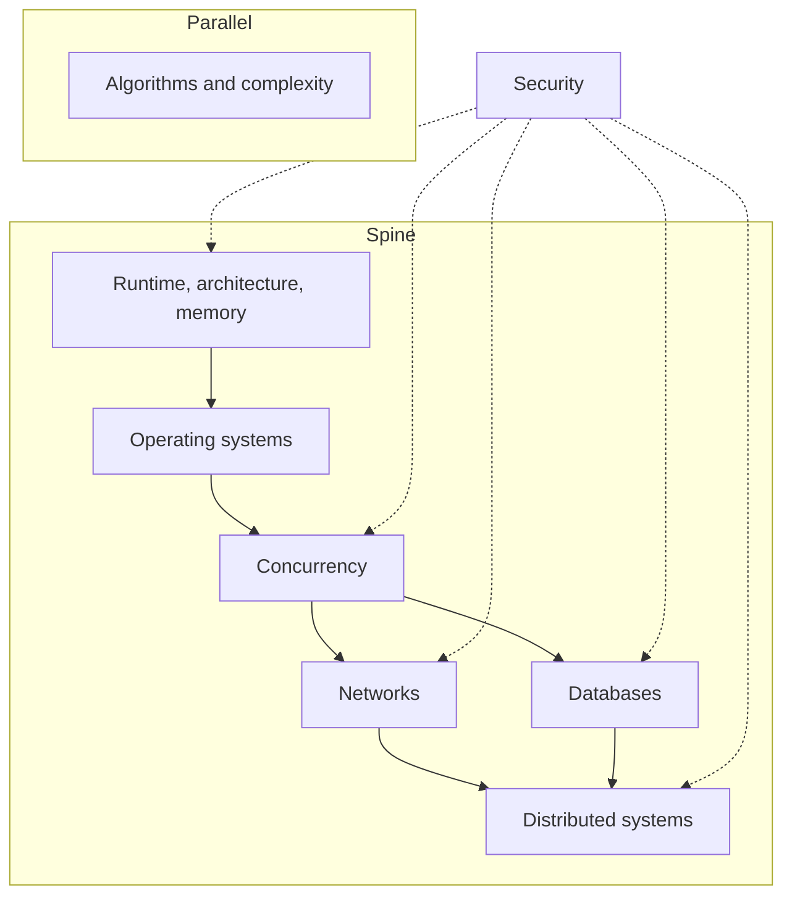

Production software 不是一疊 libraries。在 React tree、Hono handler 與 Postgres query 底下，是更小的一組模型：程式如何佔用 memory、operating system 如何調度工作、不止一件事如何同時發生、資料如何穿過 network、database 如何陳述真相，以及當機器不止一台時這些真相如何分叉。

 

這篇 note 是這些模型在 production TypeScript 系統裡的地圖——browsers、Node、HTTP、Postgres。它不是一份課程目錄。每個 node 都是可工作的定義、它在 production 出現的位置，以及一種值得辯護的 failure mode。Algorithms 坐在主脊旁邊。Security 橫切過去。

 

 

順著箭頭走。若還說不清什麼是 process，就不要從 distributed systems 開始。

 

---

## Runtime、architecture、memory

程式不是 source file。它是佔用 CPU、caches 與 RAM 的 instructions 和 data。**Runtime** 決定這種佔用長什麼樣：JavaScript engine（Chrome 與 Node 裡的 V8）編譯 functions、在 **heap** 上分配，並在 **stack** 上記錄進行中的 calls。Architecture 解釋為什麼 locality 重要——miss 一條 cache line，就是會被當成 jank 感受到的 stall——以及為什麼 main thread 是稀缺機器，不是無限迴圈。

 

每次 component 把大型 array close over、module-level cache 把 parsed JSON 永遠留住，或 React list 在寫完 styles 之後強迫 layout，都會撞上這個模型。Engine 不會因為仍有 live reference 就替 runtime 丟掉它。Unbounded recursion 導致的 stack overflow 是同一套模型：每次 call 都是一個 frame，frame 是有限的。Event loop 與 rendering path，是 stack 空到能做其他工作時發生的事。

 

**Failure mode：** 一個隨每個 request 或 navigation 增長的 closure 或 singleton cache。Memory 不是因為 JavaScript「有 garbage collection」就不 leak。它 leak，是因為 reference 還在。Process 撞上 limit，tab 死掉，heap snapshot 裡是一張沒有設界的 map。

 

Runtime 模型見 [JavaScript 核心概念](/notes/core-javascript-concepts)。Host 在 stack 為空時做什麼，見 [深入理解 JavaScript Event Loop](/notes/javascript-event-loop-in-depth)。Main-thread 工作如何變成 pixels，見 [Browser 裡的 Critical Rendering Path](/notes/critical-rendering-path-in-the-browser)。

 

---

## Operating systems

OS 是「許多 programs 共用一台機器」的虛構。**Process** 是一塊 address space 加上一組 resources。**Thread** 是這塊空間裡被調度的一條執行。**Virtual memory** 讓每個 process 相信自己擁有 RAM。**I/O** 是向 kernel 提出的請求，不是 JavaScript promise——promise 只是 runtime 聽見回音的方式。

 

Node 的 JavaScript 跑在一條 thread 上。Timers、DNS 與多數 filesystem 工作發生在 host 裡，然後 callback 入隊。`worker_threads` 與 child processes 是取得更多 JS threads 或更多 processes 的方式。Browser 是若干 processes（site isolation）透過 IPC 協調。這些都不等於「JavaScript 是 multi-threaded」。那是 OS 提供 isolation 與 scheduling，runtime 只切了薄薄一片。

 

**Failure mode：** 把 Node process 當成 thread pool。Request handler 裡對巨大 payload 做 CPU-heavy 的 `JSON.parse`、一段 tight loop，或同步的 `fs.readFileSync`，會停掉這個 process 上的每一個其他 request。OS 仍在調度。JS thread 沒有。

 

這份契約的 host 一側是 [深入理解 JavaScript Event Loop](/notes/javascript-event-loop-in-depth)。

 

---

## Concurrency

Concurrency 是重疊的工作。**Parallelism** 是在不止一個 core 上重疊。JavaScript 讓 concurrency 很便宜（`async`/`await`、queues、event loop），parallelism 只有付出代價才有（workers、多個 processes）。兩個 `await` 會交錯。它們不會拿 lock。React 的「concurrent」rendering 是一條 thread 上的 cooperative scheduling，不是 OS threads 在 shared state 裡賽跑。

 

Coalesce 相同的 `fetch`、Hono handler await Drizzle 時不能假設 in-memory counters 跨 request 安全、UI 因為兩次 update 順序顛倒而顯示 stale data——這些場景都會用到它。有用的工具是 queues、single-flight maps，以及「這個值只屬於一個 task」。Shared mutable memory 是昂貴的工具。

 

**Failure mode：** 隔著 `await` 對 module-level object 做 read-modify-write，並因為「Node 是 single-threaded」就稱它安全。Single-threaded 表示一次只有一個 stack，不是一次只有一個 request。第二個 request 跑在空隙裡。Counter、cache 或 in-flight map 現在是錯的。

 

交錯本身見 [深入理解 JavaScript Event Loop](/notes/javascript-event-loop-in-depth)。

 

---

## Networks

Network 是帶可變 delay 的會丟東西的 queue。**TCP** 試圖按序送達 bytes。**TLS** 認證對端並加密這條管。**HTTP** 是疊在上面的 request/response 約定。Timeout 不是 negative acknowledgment。CORS 是 browser policy，不是 server 的 access-control 系統。Cookies 是 credentials 的運輸層，server 仍必須驗證。

 

這在沒有 timeout 的 `fetch`、Hono 前面的 API Gateway、把本該 private 的 JSON cache 住的 CDN，以及 `Domain` 寬了一檔的 cookie 裡都會出現。Latency 不是平均值。它是 tail。Rendering path 等的是 critical bytes；其餘都可以等。

 

**Failure mode：** Client timeout 後重試 `POST`，timeout 被當成「server 從沒見過它」。Server 可能已經 commit。現在有兩筆 orders、兩次 side effects，或兩行 rows。Network 並沒有以唯一的方式失敗。失敗的是對「缺失的 response 意味著什麼」的假設。

 

Bytes 如何變成 first paint，見 [Browser 裡的 Critical Rendering Path](/notes/critical-rendering-path-in-the-browser)。這套 stack 實際部署的 API 與 edge 形狀見 [用 Hono、Drizzle、Zod OpenAPI 與 SST 打造 Backend APIs](/notes/backend-apis-hono-sst)。Cookie lifetime 與 `HttpOnly` 屬於 [Local Storage、Session Storage 與 Cookies](/notes/browser-storage-localstorage-sessionstorage-cookies)。

 

---

## Databases

Database 不是一桶 rows。它是一組 **constraints**、**indexes** 與 **transactions**，決定哪些 statements 可以同時為真。Index 是讓 lookup 變便宜、write 稍貴一點的 data structure。Isolation 是 concurrent transactions 之間的契約——一個 transaction 被允許看到別人 in-flight 工作的哪些部分。Schema 才是 API。Application 裡的 `WHERE` 是習慣，不是保證。

 

這套 stack 用 Postgres、Drizzle 與 row-level security 處理這件事。只活在 Hono 裡的 tenant isolation，少一個 filter 就會 leak。筆電上瞬間返回的 query，在 production 是 sequential scan。沒有 transaction 或 constraint 的 read-modify-write，是等流量到來的 lost update。

 

**Failure mode：** 兩個 requests 讀同一行，都 increment，都 write。每個 transaction 看起來都正確。Counter 跳過了一個數字。Isolation 沒有神秘地失敗。模式是 check-then-act，而 database 從未被要求把它做成 atomic。

 

Isolation 路徑見 [用 Hono、Better Auth、Drizzle 與 Postgres RLS 打造 Multi-Tenant 後端](/notes/multi-tenant-backend-drizzle-hono-better-auth)。Statement 模型見 [SQL 核心概念](/notes/core-sql-concepts)。

 

---

## Distributed systems

一旦機器不止一台，failure 就是常態。Networks 會 partition。Processes 會重啟。Lambda 可能把同一個 handler invoke 兩次。Clocks 會不一致。**Consistency** 是選擇讓 readers 可以相信什麼。**Idempotency** 是讓 retry 不再變成 duplicate 的方法。有趣的 bugs 不是「server 掛了」，而是「server 還在，而不知道上一個 request 有沒有 commit」。

 

這在 SST stages 與 Lambda、必須撐過 replay 的 agent workflows，以及 ingest 與 retrieval 共用、絕不能跨 tenants 的 RAG index 裡都會出現。Durable run、namespace 與 idempotency key 是同一個想法：給工作命名，讓做兩次是安全的。

 

**Failure mode：** 沒有 idempotency key 的 retry。第一次 invocation 寫了 row，回來的路上 timeout，第二次又寫了一次。系統「highly available」。它也 duplicated。沒有 write identity 的 availability，只是多了幾步的 at-least-once delivery。

 

Stages 與 deploy loop 見 [用 SST 管理 AWS 基礎設施與 DevOps](/notes/using-sst-for-aws-infra-and-devops)。Tenant-scoped index 見 [如何搭建一套 RAG 系統](/notes/how-to-build-a-rag-system)。Agent 被允許記住什麼、記在哪裡，見 [Agent memory 的四個層級](/notes/four-levels-of-agent-memory)。

 

---

## Data structures、algorithms、complexity

Algorithms 不是問題名稱的清單。它們是穿過 data 的一小套 **patterns**：hash map 回答「這個見過嗎？」，sorted array 上的 two pointers，heap 回答「top K」，graph walk 回答 connectivity。**Complexity** 是 cost model——input 變大時的 time 與 memory——讓 ship 之前就能把 nested loop 和 linear scan 分開。Input 形狀通常已經點名該用哪把工具。

 

當 list search 其實是 lookup、對每個 organization row 的「簡單」filter 本該是 index、UI 每次 keystroke 做 O(n²) 工作時，這套 pattern 就派上用場。解決 Two Sum 的那張 map，也是 de-duplicate in-flight requests 的那張 map。Big-O 不是叫對二十個 items 做 micro-optimize。它指出哪份工作會在兩萬時倒下。

 

**Failure mode：** 對本來可以 keyed 的 data 套 nested loops，而真正的 bottleneck 是從未測量的 network round trip。CPU 故事被優化了，I/O 故事被錯過。Complexity 是決策工具，不是競技。

 

這套 stack 實際實作的 patterns 見 [常用 Algorithms](/notes/common-algorithms)。

 

---

## Security

Security 是 **trust boundary** 問題：這台機器被允許對來自那台機器的 message 相信什麼。**Authentication** 回答是誰。**Authorization** 回答他們可以做什麼。Client 送來的任何東西都不是 source of truth——JSON 裡的 `organizationId` 不是，未 verify 的 JWT 裡的 role 不是，hidden form field 也不是。Browser 是 untrusted host。React Native bundle 也是。

 

上面每個 node 都會用到它。Cache 進其他 tenants 資料的 memory、相信某個 header 的 handlers、沒有 `HttpOnly` 的 cookies、少了一張表的 RLS、能搜到錯誤 namespace 的 model——都是同一類 bug。Exploit 就是這條 boundary 沒檢查到的東西。

 

**Failure mode：** Client 聲明它屬於哪個 organization，API 相信了。Query 返回另一個 tenant 的 rows。Transit 中的 encryption 幫不上忙。User 被 authenticate 了，然後被允許自己挑 authorization。

 

這類 failures 見 [Web Security and the OWASP Top 10](/notes/web-security-owasp-top-10)。這套 stack 的兩個 hosts 見 [Frontend Security in Next.js and React Native](/notes/frontend-security-nextjs-react-native)。作為 database constraint 的 tenant isolation，見上面的 multi-tenant note。

 

---

## 怎麼走這張圖

地圖按 dependency 順序讀，不當成日曆。Runtime 與 memory 先於 OS，因為 process 是機器托住 program 的方式。OS 先於 concurrency，因為 threads 與 I/O 才是「同時」的建材。Concurrency 先於 networks 與 databases，因為後兩者本身就是帶各自 failure modes 的 concurrent systems。Networks 與 databases 先於 distributed systems，因為 distribution 就是那些 failures，外加不共享 memory 的機器。只要問題是 data 形狀，algorithms 就可以並行學。Security 不是後面一章。它是每個 node 都要問的問題：這一層相信什麼，誰教它的？

 

當 production bug 能叫出它的 node 時，這張地圖才有用。Hung tab 常常是 runtime。卡住的 event loop 是 OS 契約。錯誤的 counter 是 concurrency。重複扣款是 network 或 distributed retry。慢的 list 是 algorithms 或缺失的 index。跨 tenants 的 leak 是 security，也是 database。知道正在用哪套模型，才是工作。Libraries 會換。模型不會。
