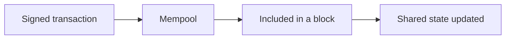
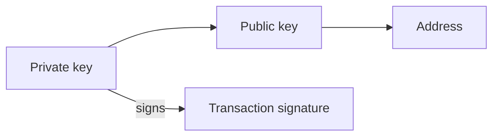
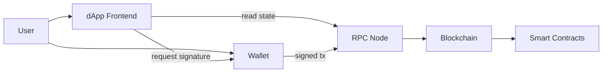
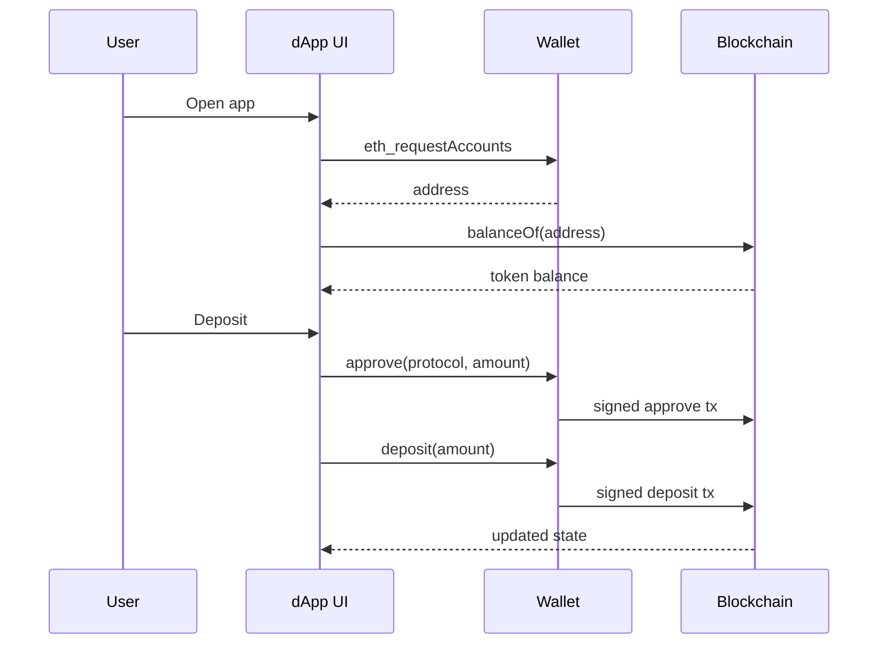

大多數 on-chain applications 都由同一小撮零件組成：**wallets**、**smart contracts**、**tokens** 與 **dApps**。搞清楚它們如何串連，以及每一塊建立什麼 trust model，就足以讀懂多數 Web3 architectures，而不必淹沒在 cryptography 裡。

<br />

這篇 note 用 Ethereum / EVM 作為框架，因為 ERC token standards 住在那裡。同樣的想法可以轉移到其他 chains，即使名稱不同。

<br />

---

## Blockchain 基礎

Blockchain 是一份由許多獨立 nodes 共同同意的 shared ledger。一旦 transaction 被確認，改寫歷史在設計上就是昂貴的。那份 shared state 讓陌生人可以轉移 assets，中間不必有中央銀行。

<br />

對 application 工作真正重要的零件：

- **Accounts**：chain 上的身份。Externally owned accounts (EOAs) 由 private keys 控制。Contract accounts 由 code 控制。
- **Transactions**：已簽署的 messages，提出一次 state change：送 value、呼叫 contract、deploy code。
- **Consensus**：網絡同意哪些 transactions 有效、以及順序為何的方式。
- **Gas**：在 on-chain 執行工作所付的 fee。每次 write 都有成本；透過 RPC node 的 reads 通常沒有。

<br />



<br />

我把 chain 當成 **programmable settlement layer**：跟普通 database 相比又慢又貴，但當 ownership 與規則必須可公開驗證時，它就有用。

<br />

---

## Wallets

Wallet 是持有 cryptographic keys、並幫你簽署 transactions 的軟件（或硬件）。它不是銀行帳戶。Chain 存 balances；wallet 存你控制某個 address 的證明。

<br />



<br />

核心想法：

- **Private key** 證明控制權。任何人拿到它，就可以從該 address 移走 assets。
- **Public key / address** 是別人用來送你 assets，或在 on-chain 識別你的東西。
- **Signing** 代表授權一筆特定 transaction，而不廣播 private key 本身。
- **Custody** 是誰持有 keys。Self-custody 代表你自己持有。Custodial wallets 代表服務代表你持有。

<br />

Browser extensions 與 mobile wallets 主要是 keys 周圍的 UX：連到一個 site、檢視一筆 transaction、批准或拒絕。Hardware wallets 把 private key 留在 offline，只暴露 signatures。

<br />

當 dApp 說「connect wallet」，它是在要一個 address 與一條 signing channel，而不是要你登入某間公司 database 的密碼：

<br />

```ts
// EIP-1193 provider injected by an extension wallet (e.g. window.ethereum)
const accounts = (await window.ethereum.request({
  method: "eth_requestAccounts",
})) as string[]

const address = accounts[0]
// address is public; the private key never leaves the wallet
```

<br />

這個區別會出現在每一次 security review：phishing sites 要你簽署錯的東西，而不是 Web2 意義上的「登入」。

<br />

---

## Smart Contracts

Smart contract 是 deploy 到 blockchain 上的程式。在 Ethereum 上通常用 Solidity 寫，跑在 EVM 上。一旦 deployed，它的 code 與 storage 住在一個 contract address。

<br />

Contracts 跟普通 backend 不同的地方：

- **Public state**：任何人都可以讀 balances、ownership，常常還能讀 bytecode。
- **Deterministic execution**：相同 inputs 與 state，在誠實 nodes 上產生相同結果。
- **Permissionless calling**：任何付了 gas 的人都可以呼叫 public function，但受 contract 自己的 access checks 約束。
- **Hard to change**：upgrades 需要明確 pattern（proxy、governance、migration）。Immutable code 沒有 silent hotfix。

<br />

最小形狀看起來像這樣：

<br />

```solidity
// SPDX-License-Identifier: MIT
pragma solidity ^0.8.24;

contract Escrow {
    address public payer;
    address public payee;
    bool public released;

    constructor(address _payee) payable {
        payer = msg.sender;
        payee = _payee;
    }

    function release() external {
        require(msg.sender == payer, "only payer");
        require(!released, "already released");
        released = true;
        payable(payee).transfer(address(this).balance);
    }
}
```

<br />

Contracts 編碼規則：誰可以呼叫什麼、在什麼條件下、以及什麼 state changes。Bugs 很昂貴，因為 funds 與 ownership 往往就坐在 contract 本身裡面。

<br />

我把 smart contract 想成 **一套開放、按 fee 計量的 API，而其 database 就是 chain**。UI 可以說謊；真正 settle 的是 contract 的 state。

<br />

---

## Tokens

Tokens 是由遵循共享 interfaces 的 smart contracts 所代表的 assets。Wallets、explorers 與 dApps 不必為每個專案寫自訂 code 就能支援它們，這正是 ERC standards 重要的原因。

<br />

### ERC-20：fungible tokens

**ERC-20** 是 fungible tokens 的 standard：每個單位都可互換，像貨幣或 points。

<br />

```solidity
interface IERC20 {
    function balanceOf(address account) external view returns (uint256);
    function transfer(address to, uint256 amount) external returns (bool);
    function approve(address spender, uint256 amount) external returns (bool);
    function transferFrom(address from, address to, uint256 amount) external returns (bool);
}
```

<br />

`approve` + `transferFrom` 是 protocol 代表你花費 tokens 的方式：你授權一個 spender，然後那個 contract 把金額拉走。

<br />

Stablecoins、governance tokens 與 in-game currencies 通常是 ERC-20。重要的心智模型是 **balances**，不是 unique items。

<br />

### ERC-721：non-fungible tokens (NFTs)

**ERC-721** 是 unique tokens 的 standard。每個 `tokenId` 都是自己的 asset，只有一個 owner。

<br />

```solidity
interface IERC721 {
    function ownerOf(uint256 tokenId) external view returns (address);
    function safeTransferFrom(address from, address to, uint256 tokenId) external;
    function tokenURI(uint256 tokenId) external view returns (string memory);
}
```

<br />

Collectibles、tickets 與 on-chain deeds 是常見的 ERC-721 用途。同一個 contract 的兩個 tokens，只要 IDs 不同，就 **不可** 互換。

<br />

### ERC-1155：multi-token standard

**ERC-1155** 讓一個 contract 管理多種 token types（fungible、non-fungible，或兩者），並支援 batch transfers。

<br />

```solidity
interface IERC1155 {
    function balanceOf(address account, uint256 id) external view returns (uint256);
    function safeBatchTransferFrom(
        address from,
        address to,
        uint256[] calldata ids,
        uint256[] calldata amounts,
        bytes calldata data
    ) external;
}
```

<br />

Games 與 marketplaces 在單一 collection 混了 gold coins（fungible）、unique swords（supply 為一）與 limited skins（supply 為 N）時，往往偏好 ERC-1155。更少 deployments，更便宜的 batch operations。

<br />

### 比較

| Standard | Fungibility | Identity model | Common uses |
| --- | --- | --- | --- |
| ERC-20 | Fungible | Amount per address | Currencies, points, governance |
| ERC-721 | Non-fungible | One owner per `tokenId` | Collectibles, tickets, unique rights |
| ERC-1155 | Mixed | Balance per address per `id` | Games, multi-asset collections |

<br />

三者仍然只是 smart contracts。ERC number 是共享 interface，讓 tooling 能一致地對待它們。

<br />

---

## Decentralized Applications (dApps)

**dApp** 是 critical logic 或 ownership 住在 on-chain 的應用。熟悉的形狀是：

<br />

1. 一個 **frontend**（常常是普通 web app）負責 UX
2. 一個 **wallet** 負責 identity 與 transaction signing
3. **Smart contracts** 作為 assets 與規則的 source of truth
4. 一個 **RPC provider**，讓 frontend 能讀 chain state 並廣播已簽署的 transactions

<br />



<br />

Reads 可以免費且頻繁。Writes 需要 signature 與 gas。搭配 typed client，一次 read 常常長這樣：

<br />

```ts
import { createPublicClient, http, parseAbi } from "viem"
import { mainnet } from "viem/chains"

const client = createPublicClient({
  chain: mainnet,
  transport: http(),
})

const erc20Abi = parseAbi([
  "function balanceOf(address owner) view returns (uint256)",
])

const balance = await client.readContract({
  address: "0xA0b86991c6218b36c1d19D4a2e9Eb0cE3606eB48", // USDC
  abi: erc20Abi,
  functionName: "balanceOf",
  args: ["0xYourAddress"],
})
```

<br />

許多 dApps 仍然使用 centralized pieces：indexers、APIs、IPFS gateways、admin keys。「Decentralized」是一個光譜。我看的是哪些部分可以失敗或審查，而不拿走用戶的 assets。

<br />

---

## 它們如何組合

許多產品共享的具體流程：

<br />



<br />

1. 用戶打開 dApp 並 **connects a wallet**。App 得知他們的 address。
2. UI 透過 RPC **reads** balances 與 ownership（`balanceOf`、`ownerOf` 等）。
3. 用戶要把 ERC-20 deposit 進 protocol。他們先 **approve** contract 作為 spender，再呼叫 deposit function：兩次 signatures、兩筆 transactions（除非被更高層 pattern 批次處理）。
4. **Smart contract** 更新 on-chain state。
5. UI 從 chain（或 indexer）刷新，並顯示新的 balances。

<br />

在 TypeScript 搭配 wallet client 時，write 這一側大致是：

<br />

```ts
import { parseAbi, parseUnits } from "viem"

const erc20Abi = parseAbi([
  "function approve(address spender, uint256 amount) returns (bool)",
])

const protocol = "0xProtocolAddress"
const amount = parseUnits("100", 6) // 100 USDC (6 decimals)

// 1) User signs: allow the protocol to pull tokens
await walletClient.writeContract({
  address: "0xA0b86991c6218b36c1d19D4a2e9Eb0cE3606eB48",
  abi: erc20Abi,
  functionName: "approve",
  args: [protocol, amount],
})

// 2) User signs: protocol pulls and records the deposit
await walletClient.writeContract({
  address: protocol,
  abi: parseAbi(["function deposit(uint256 amount)"]),
  functionName: "deposit",
  args: [amount],
})
```

<br />

把那個 ERC-20 換成 ERC-721 mint，或 ERC-1155 batch claim，wallet / contract / RPC 的形狀仍然一樣。改變的只有 token interface 與 contract 的 business rules。

<br />

---

## 重點

有用的心智模型很精簡：

- **Wallet 持有 keys**，不是 ledger 本身；custody 關乎誰可以簽署。
- **Smart contract** 是公開、按 fee 計量的 logic，其 state 結算 ownership。
- **ERC-20**、**ERC-721** 與 **ERC-1155** 的差異，主要在 fungibility 以及 identity 如何被建模。
- **dApp** 組合 frontend、wallet signatures、RPC 與 contracts；對 assets 來說，source of truth 是 chain，不是 UI。

<br />

其餘一切（L2s、account abstraction、indexers、bridges）都建立在這個基礎上。
