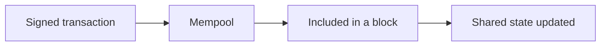
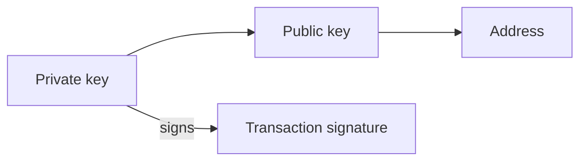
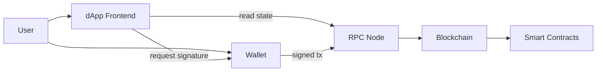
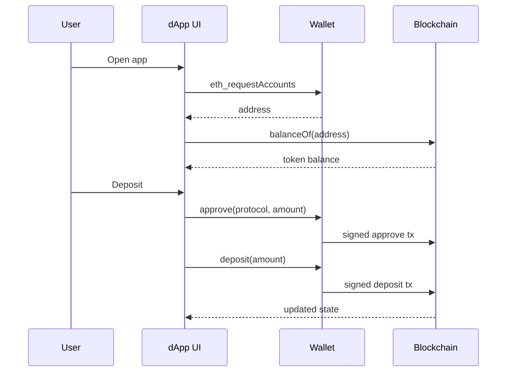

大多數 on-chain applications 都由同一小撮零件組成：**wallets**、**smart contracts**、**tokens** 與 **dApps**。搞清楚它們如何串連，以及每一塊建立什麼 trust model，就足以讀懂多數 Web3 architectures，而不必淹沒在 cryptography 裡。

這篇 note 用 Ethereum / EVM 作為框架，因為 ERC token standards 住在那裡。同樣的想法可以轉移到其他 chains，即使名稱不同。

<br />

---

## Blockchain 基礎

Blockchain 是一份由許多獨立 nodes 共同同意的 shared ledger。一旦 transaction 被確認，改寫歷史在設計上就是昂貴的。

- **Accounts** — chain 上的身份。Externally owned accounts (EOAs) 由 private keys 控制。Contract accounts 由 code 控制。
- **Transactions** — 已籤署的 messages，提出一次 state change：送 value、呼叫 contract、deploy code。
- **Consensus** — 網絡同意哪些 transactions 有效、以及順序為何的方式。
- **Gas** — 在 on-chain 執行工作所付的 fee。每次 write 都有成本；透過 RPC node 的 reads 通常沒有。

<br />



<br />

chain 是 **programmable settlement layer**：跟普通 database 相比又慢又貴，但當 ownership 與規則必須可公開驗證時，它就有用。

<br />

---

## Wallets

Wallet 是持有 cryptographic keys、並幫你籤署 transactions 的軟件（或硬件）。它不是銀行帳戶。Chain 存 balances；wallet 存你控制某個 address 的證明。

<br />



<br />

- **Private key** 證明控制權。任何人拿到它，就可以從該 address 移走 assets。
- **Public key / address** 是別人用來送你 assets，或在 on-chain 識別你的東西。
- **Signing** 代表授權一筆特定 transaction，而不廣播 private key 本身。
- **Custody** 是誰持有 keys。Self-custody 代表你自己持有。Custodial wallets 代表服務代表你持有。
- Browser extensions 與 mobile wallets 主要是 keys 周圍的 UX。Hardware wallets 把 private key 留在 offline，只暴露 signatures。

當 dApp 說「connect wallet」，它是在要一個 address 與一條 signing channel，而不是要你登入某間公司 database 的密碼：

<br />

```ts
const accounts = (await window.ethereum.request({
  method: "eth_requestAccounts",
})) as string[]

const address = accounts[0]
// address is public; the private key never leaves the wallet
```

<br />

**Failure：** 把「connect」當成 Web2 login。Phishing sites 要你籤錯東西，而不是輸入密碼。

<br />

---

## Smart Contracts

Smart contract 是部署在 blockchain 上的 program。在 Ethereum 上通常用 Solidity 寫，跑在 EVM 上。一旦 deployed，它的 code 與 storage 就住在一個 contract address。

- **Public state** — 任何人都可以讀 balances、ownership，常常也能讀 bytecode。
- **Deterministic execution** — 同樣的 inputs 與 state，在誠實 nodes 上產生同樣的結果。
- **Permissionless calling** — 任何付得起 gas 的人都可以呼叫 public function，仍受 contract 自己的 access checks 約束。
- **Hard to change** — upgrades 需要明確 pattern（proxy、governance、migration）。Immutable code 上沒有靜默 hotfix。

<br />

```solidity
// SPDX-License-Identifier: MIT
pragma solidity ^0.8.24;

contract Escrow {
    address public payer;
    address public payee;
    bool public released;

    constructor(address _payee) payable {
        payer = msg.sender;
        payee = _payee;
    }

    function release() external {
        require(msg.sender == payer, "only payer");
        require(!released, "already released");
        released = true;
        payable(payee).transfer(address(this).balance);
    }
}
```

<br />

- Contracts 編碼規則：誰能呼叫什麼、在什麼條件下、以及 state 如何改變。
- Smart contract 是一份 **開放、按 fee 計量的 API，database 就是 chain**。UI 可以撒謊；真正結算的是 contract 的 state。

**Failure：** 把 UI 當成 source of truth。Bugs 很貴，因為 funds 與 ownership 常常就坐在 contract 裡面。

<br />

---

## Tokens

Tokens 是由遵循共享 interfaces 的 smart contracts 表示的 assets。Wallets、explorers 與 dApps 不必為每個 project 寫自定義 code 就能支持它們——這就是 ERC standards 重要的原因。

**ERC-20** 是 fungible tokens 的標準：每一單位都可以互換。心智模型是 **balances**，不是獨特物品。`approve` + `transferFrom` 是 protocol 代表你花 tokens 的方式。

<br />

```solidity
interface IERC20 {
    function balanceOf(address account) external view returns (uint256);
    function transfer(address to, uint256 amount) external returns (bool);
    function approve(address spender, uint256 amount) external returns (bool);
    function transferFrom(address from, address to, uint256 amount) external returns (bool);
}
```

<br />

**ERC-721** 是 unique tokens 的標準。每個 `tokenId` 都是自己的 asset，只有一個 owner。Collectibles、tickets 與 on-chain deeds 是常見用途。同一份 contract 裡的兩個 tokens，只要 IDs 不同，就 **不可**互換。

**ERC-1155** 讓一份 contract 管理多種 token types——fungible、non-fungible，或兩者都有——並支持 batch transfers。Games 與 marketplaces 在單一 collection 混了 gold coins（fungible）、unique swords（supply 為一）與 limited skins（supply 為 N）時，往往偏好它。更少 deployments，更便宜的 batch operations。

| Standard | Fungibility | Identity model | Common uses |
| --- | --- | --- | --- |
| ERC-20 | Fungible | Amount per address | Currencies, points, governance |
| ERC-721 | Non-fungible | One owner per `tokenId` | Collectibles, tickets, unique rights |
| ERC-1155 | Mixed | Balance per address per `id` | Games, multi-asset collections |

<br />

三者仍然只是 smart contracts。ERC number 是共享 interface，讓 tooling 能一致地對待它們。

<br />

---

## Decentralized Applications (dApps)

**dApp** 是 critical logic 或 ownership 住在 on-chain 的應用。

- 一個 **frontend**（常常是普通 web app）負責 UX
- 一個 **wallet** 負責 identity 與 transaction signing
- **Smart contracts** 作為 assets 與規則的 source of truth
- 一個 **RPC provider**，讓 frontend 能讀 chain state 並廣播已籤署的 transactions

<br />



<br />

- Reads 可以免費且頻繁。Writes 需要 signature 與 gas。
- 許多 dApps 仍使用中心化零件——indexers、APIs、IPFS gateways、admin keys。「Decentralized」是一條光譜。真正重要的是：哪些部分失敗或審查時，不會奪走用戶的 assets。

<br />

---

## 它們如何組合

許多產品共用的一條具體流程：

<br />



<br />

- User 打開 dApp 並 **connect wallet**。App 得知他們的 address。
- UI 透過 RPC **讀取** balances 與 ownership（`balanceOf`、`ownerOf`）。
- 要 deposit 一筆 ERC-20，他們先 **approve** contract 作為 spender，再呼叫 deposit——兩次 signatures、兩筆 transactions，除非被更高層 pattern batch。
- **Smart contract** 更新 on-chain state。UI 從 chain 或 indexer 刷新。

<br />

```ts
import { parseAbi, parseUnits } from "viem"

const amount = parseUnits("100", 6) // 100 USDC (6 decimals)

await walletClient.writeContract({
  address: "0xA0b86991c6218b36c1d19D4a2e9Eb0cE3606eB48",
  abi: parseAbi(["function approve(address spender, uint256 amount) returns (bool)"]),
  functionName: "approve",
  args: ["0xProtocolAddress", amount],
})

await walletClient.writeContract({
  address: "0xProtocolAddress",
  abi: parseAbi(["function deposit(uint256 amount)"]),
  functionName: "deposit",
  args: [amount],
})
```

<br />

把那筆 ERC-20 換成 ERC-721 mint，或 ERC-1155 batch claim，wallet / contract / RPC 的形狀仍然一樣。變的只有 token interface 與 contract 的業務規則。

<br />

---

## 要點

- **Wallet 持有 keys**，不是 ledger 本身——custody 講的是誰能籤。
- **Smart contract** 是公開、按 fee 計量的 logic，其 state 結算 ownership。
- **ERC-20**、**ERC-721** 與 **ERC-1155** 的主要差別在 fungibility，以及 identity 如何建模。
- **dApp** 組合 frontend、wallet signatures、RPC 與 contracts——對 assets 來說，source of truth 是 chain，不是 UI。

其他一切——L2s、account abstraction、indexers、bridges——都建立在這個底座上。

---

## Recap Q&A

<Accordion type="single" collapsible>
  <AccordionItem value="chain-wallet">
    <AccordionTrigger>1. Wallet 持有什麼，「connect wallet」實際在要什麼？</AccordionTrigger>
    <AccordionContent>

      - Wallet 持有 **cryptographic keys**，並幫你 **籤署** transactions。它不是銀行帳戶。
      - Chain 存 balances；wallet 存你控制某個 address 的證明。
      - **Private key** 證明控制權。任何人拿到它，就可以移走 assets。**Signing** 授權一筆特定 transaction，而不廣播 key。**Custody** 是誰持有 keys。
      - 「Connect wallet」要的是一個 **address** 與一條 **signing channel**——不是某間公司 database 的密碼。Private key 從不離開 wallet。
      - Hardware wallets 把 key 留在 offline，只暴露 signatures。
      - **Failure：** phishing sites 要你籤錯東西，而不是 Web2 意義上的「登入」。

    </AccordionContent>
  </AccordionItem>

  <AccordionItem value="chain-contracts">
    <AccordionTrigger>2. Smart contract 與普通 backend 有何不同？</AccordionTrigger>
    <AccordionContent>

      - Smart contract 是部署在 chain 上的 program。**Public state**、**deterministic execution**、**permissionless calling**（任何付得起 gas 的人，仍受 contract 自己的 checks 約束），以及 **hard to change**。
      - Upgrades 需要明確 pattern。Immutable code 上沒有靜默 hotfix。
      - 它是一份 **開放、按 fee 計量的 API，database 就是 chain**。UI 可以撒謊；真正結算的是 contract 的 state。
      - Bugs 很貴，因為 funds 與 ownership 常常就坐在 contract 裡面。
      - EOAs 由 keys 控制。Contract accounts 由 code 控制。

    </AccordionContent>
  </AccordionItem>

  <AccordionItem value="chain-tokens">
    <AccordionTrigger>3. ERC-20 與 ERC-721 實際標準化了什麼？</AccordionTrigger>
    <AccordionContent>

      - Tokens 是由遵循共享 interfaces 的 contracts 表示的 assets，所以 wallets 與 dApps 不必為每個 project 寫自定義 code 就能支持它們。
      - **ERC-20** 是 fungible：每一單位都可以互換。心智模型是 **balances**。`approve` + `transferFrom` 是 protocol 代表你花 tokens 的方式。
      - **ERC-721** 是 unique tokens。每個 `tokenId` 只有一個 owner。同一份 contract 裡的兩個 tokens，只要 IDs 不同，就 **不可**互換。
      - Collectibles、tickets、deeds。Gas 計量 writes；透過 RPC 的 reads 通常不消耗 on-chain gas。

    </AccordionContent>
  </AccordionItem>

  <AccordionItem value="chain-dapp">
    <AccordionTrigger>4. dApp 由哪些零件組成，哪一塊才是 source of truth？</AccordionTrigger>
    <AccordionContent>

      - **dApp** 的 critical logic 或 ownership 住在 on-chain：一個負責 UX 的 **frontend**、一個負責 identity 與 signing 的 **wallet**、作為 source of truth 的 **smart contracts**，以及一個用來讀 state 並廣播已籤署 transactions 的 **RPC provider**。
      - Reads 可以免費且頻繁。Writes 需要 signature 與 gas。
      - Accounts、transactions、consensus 與 gas 是 ledger primitives。
      - 一旦 transaction 被確認，改寫歷史在設計上就是昂貴的。那份 shared state 讓陌生人可以轉移 assets，中間不必有中央銀行。

    </AccordionContent>
  </AccordionItem>

  <AccordionItem value="chain-fit">
    <AccordionTrigger>5. 一次典型 deposit 裡，它們如何組合？</AccordionTrigger>
    <AccordionContent>

      - User connect wallet；app 得知他們的 address。UI 透過 RPC **讀取** balances。
      - 要 deposit 一筆 ERC-20，他們先 **approve** contract 作為 spender，再呼叫 deposit——兩次 signatures、兩筆 transactions，除非被 batch。
      - Contract 更新 on-chain state。UI 從 chain 或 indexer 刷新。
      - 用 Ethereum / EVM 作為框架，因為 ERC standards 住在那裡。同樣的想法可以轉移到其他 chains，即使名稱不同。

    </AccordionContent>
  </AccordionItem>
</Accordion>
