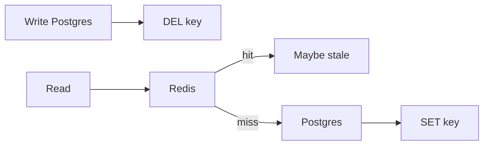

**Cache** 是一份更快、更小的副本。Disk 大約一毫秒。RAM 大約一百納秒。Caching 用 storage 與 invalidation 換 latency 與 load。Database 仍是 source of truth。Cache 是一個可能出錯的 hint。

這篇 note 依 [Evan 的 walkthrough](https://www.youtube.com/watch?v=1NngTUYPdpI)。Statement 模型見 [SQL 核心概念](/notes/core-sql-concepts)。這套 stack 上的 HTTP 與 CDN reuse 見 [深入理解 Next.js](/notes/understanding-next-js-in-depth)。這篇 note 講的是 application cache。

<br />

---

## Pattern Map

| Pattern | Who talks to the DB | Reach for it when |
| --- | --- | --- |
| Cache-aside | App，在 miss 時 | Default。只有被請求過的 keys 活在 Redis 裡 |
| Write-through | Cache，同步地 | Reads 必須新鮮，且可以接受更慢的 writes |
| Write-behind | Cache，稍後 | 高 write throughput；可以接受一點 loss |
| Read-through / CDN | Cache，在 miss 時 | Proxy 自己填自己 —— CDN edges，不是 Hono + Redis |

<br />

---

## 1. 為什麼需要 cache

先點名 bottleneck。沒有 bottleneck 的 cache，只是帶 TTL 的複雜度。

<br />

- **Load.** 一條 read-heavy 的路徑正在拖垮 Postgres。Profile fetches、homepage feed、每次 request 都重算的 join。
- **Latency.** Disk path 達不到的 non-functional。Memory 離 CPU 更近；query 不是。
- **Cost of compute.** 把 posts、follows、likes join 起來的 personalized feed。把結果 cache 六十秒。不要每次 scroll 都重算。

<br />

**Failure:** 因為「我們總是 cache」就在每張表前面丟一個 Redis。Write path 多了 dual-write。Read path 多了 stale keys。Postgres 從來不是問題。

<br />

---

## 2. 它住在哪

四個地方。Application data 的 production 預設是 **external**。

<br />


<br />

| Layer | What it buys | What it costs |
| --- | --- | --- |
| **External**（Redis、Memcached） | 跨 replicas 共享。一次 miss 填滿每一個 Hono process。 | 一次 network hop。又一個要跑的 component。 |
| **In-process** | 沒有 hop。最快。Config、小 lookup tables、Redis 前面的 hot key。 | 每個 replica 有自己的副本。不 coherent。跟 process 一起死。 |
| **CDN** | Network latency，不是 disk vs RAM。Media、public assets，有時 public HTML。 | Shared cache。Private responses 需要 `Vary`，通常不該來這裡。 |
| **Client** | Request 根本不離開裝置。HTTP cache、`localStorage`、on-device。 | 控制最少。Stale 是用戶的問題，直到他們 sync。 |

<br />

- 所有 Hono tasks 共享一個 Redis。一個 replica 填了 key，其他就能複用。這就是 external 作為預設的原因。
- In-process 適合每個 request 都需要、幾乎不變的東西——feature flags、一張 country table——或作為 hot Redis key 前面的盾。它不是 fleet 裡 Redis 的替代。
- CDN 是 edge 上的 read-through。Origin 是 S3 或 API。常見的 production 用法是 images、video segments、static files。這套 repo 的 HTTP/CDN 故事見 [深入理解 Next.js](/notes/understanding-next-js-in-depth)。Browser storage 見 [Local Storage、Session Storage 與 Cookies](/notes/browser-storage-localstorage-sessionstorage-cookies)。

<br />

**Failure:** 把 in-process map 當成唯一的 cache，然後擴到兩個 ECS tasks。Replica A 有新 profile。Replica B 還握著舊的。Local cache 是 performance hint，不是 source of truth。

<br />

---

## 3. Cache-aside

App 擁有 cache。先查 Redis。Hit：返回。Miss：load Postgres，填 Redis，返回。只有真正被請求過的 keys 佔用 memory。

<br />

```ts title="src/lib/cache.ts"
async function getProfile(orgId: string, userId: string) {
  const key = `profile:${orgId}:${userId}`
  const hit = await redis.get(key)
  if (hit) return JSON.parse(hit)

  const row = await db.query.profiles.findFirst({
    where: and(eq(profiles.organizationId, orgId), eq(profiles.id, userId)),
  })
  if (row) await redis.set(key, JSON.stringify(row), "EX", 60)
  return row
}
```

<br />

- 這是 production 預設。Redis 不需要 write-through adapter。Hono 跟兩邊說話。Redis 掛了，reads 落到 Postgres——更慢，仍然正確。
- Miss 是貴的路徑：DB + fill + return。這正是讓 cache 保持 warm 的理由，不是另選 architecture 的理由。
- App 擁有 TTL 與 invalidation。這份控制，是 cache-aside 勝過把 miss 藏起來的 library 的原因。

<br />

**Failure:** miss 時填進去卻沒有 TTL，然後永不刪 key。Cache 變成第二份無界、stale 的 database。

<br />

---

## 4. Write-through、write-behind、read-through

這套 stack 用 cache-aside 讀。另外三個改的是誰寫、以及 database 何時聽到。

<br />

| Pattern | Write path | Trade |
| --- | --- | --- |
| **Write-through** | App（或 library）在 success 之前寫 cache **和** DB | Fresh reads。更慢的 writes。Dual-write。Cache 填滿沒人讀的 keys。 |
| **Write-behind** | 寫 cache；稍後 flush DB，常常成批 | Fast writes。**Durability** 是代價。Flush 前 cache crash 就是 loss。 |
| **Read-through** | App 只跟 cache 說話；cache 在 miss 時 load DB | 以 cache 為 proxy 的 cache-aside。CDN 就是這樣填的。需要 Redis 並不提供的 library。 |

<br />

- Redis 與 Memcached 並不原生做 write-through。要靠 library（或你自己的兩次 writes）。兩次 writes 就是 dual-write：cache 成功、DB 失敗，或反過來。兩邊完美一致，就是 [outbox](/notes/message-queues-in-system-design) 在 queue 路徑上要避開的同一個問題。
- Write-behind 屬於可以接受丟掉一批的 analytics 與 counters。緩衝在 Redis、再 flush 到 Postgres 的 view counts 就是這個 pattern。Invoices 不是。
- Read-through 是 CDN miss：edge 去 fetch origin，存下來，返回。對 Hono + Redis，cache-aside 是同一想法，只是沒有 adapter。

<br />

**Failure:** 在錢上用 write-behind。把 Redis 當成它並不是的 write-through engine，然後奇怪一次 crash 弄丟了那次 write 的唯一副本。

<br />

---

## 5. Keys、TTL、eviction

Memory 比 dataset 小。必須有東西離開。先給 key 起名，再給 policy 起名。

<br />

- Key 就是 cached value 的 identity：`profile:${orgId}:${userId}`，不是 `user:${userId}`。Permission decision 永遠不要 cache 在省略 user 或 tenant 的 key 下。Isolation 只活在 Hono 裡，少一個 filter 就會漏 —— [用 Hono、Better Auth、Drizzle 與 Postgres RLS 打造 Multi-Tenant 後端](/notes/multi-tenant-backend-drizzle-hono-better-auth)。
- **LRU** 趕走最近沒被碰過的。通常的預設。**LFU** 趕走很少被碰的，哪怕一秒前剛碰過——適合少數 keys 佔絕大多數訪問。**FIFO** 簡單，很少正確。LRU 的實現見 [常用 Algorithms](/notes/common-algorithms)。
- **TTL** 是 freshness bound，不是用來取代 LRU 的 eviction policy。Sessions、feeds、API responses 用時鐘。集合在時鐘響之前就滿了，仍由 LRU 決定誰離開。
- Payload shape 變了就 version key（`profile:v2:...`）。靠掃 Redis 來 invalidating「所有 profiles」，等於承認 key 太寬。

<br />

**Failure:** cache `canEdit:${docId}` 卻沒有 `userId` 或 `organizationId`。每個 principal 共享一個 decision。Cache 沒有洩漏。Key 洩漏了。

<br />

---

## 6. Invalidation

大多數系統讀 cache、寫 database。那扇窗口就是 stale data。沒有完美修法。Freshness 是產品選擇。

<br />



<br />

- **Invalidate on write.** `UPDATE` row，`DEL` key。下一次 read miss 再填。優先 **delete** 而不是 update-in-place：並發的 miss 可能 reload 舊 row，在你的 write 之後再 `SET` 回去。
- **Short TTL** 當一點 staleness 可以接受。Newsfeed 六十秒。Profile picture 五分鐘。把這個 bound 說出來。
- **Accept eventual** 給 feeds、counts、search。剛保存的那個人仍然需要 read-your-writes——在 `POST` 裡返回寫進去的 entity，或短窗口內讀 primary。Cache 是給其他人的。

<br />

**Failure:** writer 往 Redis `SET` 新值，同時一次在 `COMMIT` 之前開始的 miss 把舊 row 寫回去。Delete the key。讓 cache-aside refill。

<br />

---

## 7. Stampede

一把熱 key 過期。有一秒每條 request 都 miss。一條 query 變成十萬條。Database 就是那群羊。

<br />

- **Singleflight / request coalescing.** 第一次 miss load Postgres。其餘等待，再讀這次 fill。跨 replicas，用一把短 Redis lock（`SET key:lock NX EX 5`），只讓一個 process rebuild。
- **Cache warming.** 在 55s 刷新 homepage，讓 60s TTL 永遠別響。Warming 幫的是 TTL expiry。它幫不了 invalidate-on-write——那次 miss 才是目的。
- **Stale-while-revalidate.** Soft TTL 之後仍返回舊值，同時一條 request refresh。只在 hard TTL 之後才 block。
- **TTL jitter.** 不要讓每把 feed key 在同一秒過期。隨機散開，相關 keys 就不會一起 miss。

<br />

**Failure:** stampede 再加上把 **transient failure** cache 很久——dependency 的 500 存成 `"not found"`。接下來一分鐘每個 client 都確信這個 profile 不存在。Stampede 就是「每個 client 都在 expiry 上同步了」。

<br />

---

## 8. Hot keys

一把 key 吃掉幾乎全部 traffic。Cluster hit rate 看起來很好。一個 shard 著火了。Caching 放大 reads。它不能讓 Taylor Swift 變成無限。

<br />

- **Replicate the hot key** 到各個 shards，讓 Hono 可以挑任意 replica。其餘 keyspace 仍保持 partitioned。
- **In-process 放在 Redis 前面**，擋住那幾把否則會打爆一個 node 的 keys。App memory 吸收重複；Redis 只在 cold start 或 eviction 時看到 miss storm。
- Hot key 與 hot row 是同一種形狀。Redis 沒有創造它。它把它集中了。

<br />

**Failure:** 加了 Redis 就宣布 read path 解決了，因為 p99 下降——除了一把現在在高峰熔化單個 node 的 `profile:` key。Bottleneck 搬家了。它沒有消失。

<br />

---

## 9. 什麼不該 cache

不是所有慢的東西都該被記住。

<br />

- **Secrets 與 session tokens** 放進 shared cache，卻沒有與 source 相同的控制。Crash dumps、`KEYS *`、不該看見它們的 replica。
- **Authorization** 放在省略 principal 的 key 下。可以 cache 渲染好的 public document。不要 cache「這個 user 可不可以 edit」。
- **Private HTML 與 JSON 放上 shared CDN。** `Vary` 是必須的，而且經常仍是錯的。Personalized 或 tenant-scoped payloads 離開 edge。[深入理解 Next.js](/notes/understanding-next-js-in-depth) 是 `Vary` 與 Cache Components 那條路徑。
- **Negative transients.** 真的是 404 的 404 可以短暫 cache。503 不行。

<br />

**Failure:** CDN cache 了一份本該 private 的 JSON，或 in-process map 隨每個 `organizationId` 增長直到 task OOM。Memory 不會因為 Redis 有 LRU 就不洩漏。它洩漏是因為 **這個 process** 握著一份 reference。

<br />

---

## Recap Q&A

<Accordion type="single" collapsible>
  <AccordionItem value="cache-when">
    <AccordionTrigger>1. 什麼時候該讓 read 離開 database，進 cache？</AccordionTrigger>
    <AccordionContent>

      - 先點名 bottleneck：一條正在拖垮 Postgres 的 **read-heavy** 路徑、一次 **expensive** 的 join 或 feed、disk path 達不到的 latency bound。
      - Cache 那些讀得多、變得夠慢、fetch 或 compute 很貴的資料。不是每張表。
      - Database 仍是 source of truth。Cache 是一份更快、更小的副本。
      - **Failure:** 沒有 bottleneck 的 cache——write path 上的 dual-writes，read path 上的 stale keys，而 Postgres 從來不是問題。

    </AccordionContent>
  </AccordionItem>

  <AccordionItem value="cache-aside">
    <AccordionTrigger>2. 什麼是 cache-aside，另外三個 pattern 何時贏？</AccordionTrigger>
    <AccordionContent>

      - **Cache-aside**：app 查 Redis，miss 時 load Postgres 再填。只有被請求過的 keys 佔用 memory。Redis 掛了，reads 落到 Postgres。這是 production 預設。
      - **Write-through**：success 之前寫 cache 和 DB——fresh reads，更慢的 writes，dual-write。**Write-behind**：寫 cache，稍後 flush——fast writes；**durability** 是代價。**Read-through**：cache 在 miss 時自己 load，CDN 就是這樣填的。
      - Redis 並不原生做 write-through。Analytics counters 可以 write-behind。Invoices 不行。
      - **Failure:** 在錢上用 write-behind，或把 Redis 當成它並不是的 write-through engine。

    </AccordionContent>
  </AccordionItem>

  <AccordionItem value="cache-invalidate">
    <AccordionTrigger>3. 怎麼不讓 cache 繼續返回 database 已經換掉的值？</AccordionTrigger>
    <AccordionContent>

      - 大多數系統讀 cache、寫 database。那扇窗口就是 stale。Freshness 是產品選擇，不是 checkbox。
      - **Invalidate on write** —— `DEL` key，讓 cache-aside refill。優先 delete 而不是 update-in-place。一點 staleness 可接受時用 **short TTL**。Feeds 與 counts **接受 eventual**；用別的方式給 writer read-your-writes。
      - **Failure:** writer `SET` 的同時，一次並發 miss 把舊 row 寫回去。Delete the key。

    </AccordionContent>
  </AccordionItem>

  <AccordionItem value="cache-stampede">
    <AccordionTrigger>4. 什麼是 cache stampede，怎麼擋住它？</AccordionTrigger>
    <AccordionContent>

      - 一把熱 key 過期，一千條 requests 一起 miss。一條 query 變成羊群。Database 是受害者。
      - **Singleflight** 讓一次 miss 去填，其餘等待。跨 replicas，一把短 lock。TTL keys 死前先 **warm**。**Stale-while-revalidate**。**Jitter** 讓相關 keys 不要在同一秒過期。
      - **Failure:** 把一次 transient 500 cache 成很久的 `"not found"`。Stampede 就是「每個 client 都在 expiry 上同步了」。

    </AccordionContent>
  </AccordionItem>

  <AccordionItem value="cache-hot">
    <AccordionTrigger>5. 什麼是 hot key，為什麼好看的 hit rate 救不了你？</AccordionTrigger>
    <AccordionContent>

      - 一把 key 吃掉幾乎全部 traffic。Cluster hit rate 看起來很好。一個 shard 著火了。Caching 放大 reads。它不能讓一個 profile 變成無限。
      - 把 hot key **replicate** 到各個 shards。在 Redis 前面放一個很小的 **in-process** cache 擋住那幾把 keys。
      - Permission decision 永遠不要 cache 在省略 user 或 tenant 的 key 下。Private JSON 不屬於 shared CDN。
      - **Failure:** 加了 Redis 就宣布這條 path 解決了，因為 p99 下降，除了一把現在熔化一個 node 的 key。

    </AccordionContent>
  </AccordionItem>
</Accordion>
