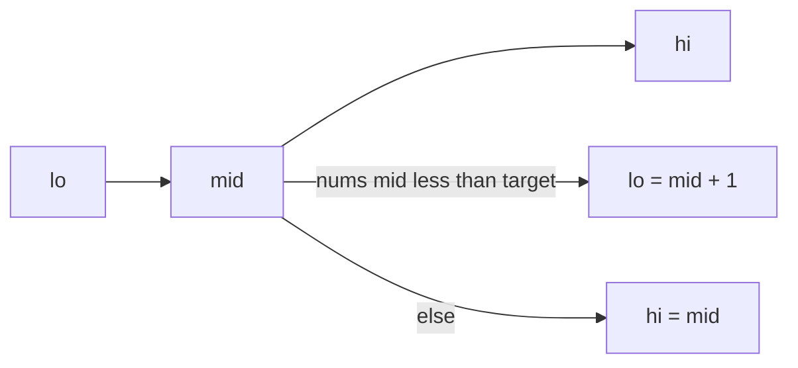
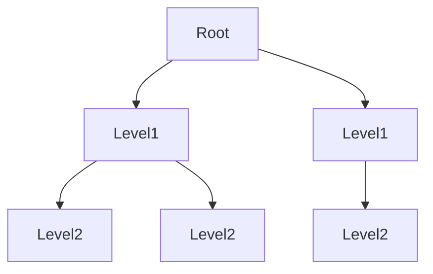

一小組 algorithm patterns 會反覆出現：搜索、遍歷 graphs、收縮 windows、caching，以及用 memory 換 time。

<br />

- 認出 **pattern**，比背問題名稱更重要。
- **Input 形狀** 通常已經點名了工具。
- 下面每個 pattern 都附上精確的 TypeScript 實作與 complexity 說明。

<br />

---

## Pattern 地圖

| Pattern | Typical input | Reach for it when |
| --- | --- | --- |
| Hash map | Unsorted array / set | 需要 O(1) lookups 或 frequency counts |
| Two pointers | Sorted array, or pair from ends | Linear scan 可以取代 nested loops |
| Sliding window | Array / string contiguous segment | Subarray 或 substring 約束 |
| Binary search | Sorted array, or monotonic answer | Search space 每一步可以減半 |
| Stack | Nested / matching structure | Latest-open / next-greater 問題 |
| Linked list | Pointer-based sequence | Reverse、cycle、constant-space walks |
| Tree DFS / BFS | Binary / n-ary tree | Depth vs level-order 問題 |
| Graph search | Grid or adjacency list | Connectivity、paths、components |
| Topological sort | Directed acyclic graph | 帶 prerequisites 的排序 |
| Heap | Stream or 「top K」 | 要 extremes 但不想完整 sort |
| Union-Find | Undirected connectivity | Merge components、detect cycles |
| Backtracking | Combinatorial search | 建立所有 valid candidates |
| Dynamic programming | Overlapping subproblems | 可重用的 optimal count / path |
| LRU | Cache with capacity | O(1) get/put 搭配 eviction |

<br />

---

## Hash Map：Two Sum

**Hash map** 把昂貴的 scan 變成 constant-time lookups。

<br />

```ts
function twoSum(nums: number[], target: number): [number, number] {
  const seen = new Map<number, number>() // value -> index

  for (let i = 0; i < nums.length; i++) {
    const need = target - nums[i]
    const j = seen.get(need)
    if (j !== undefined) return [j, i]
    seen.set(nums[i], i)
  }

  throw new Error("no pair sums to target")
}

twoSum([2, 7, 11, 15], 9) // [0, 1]
```

<br />

- 當你本來會 nest loops 去找 complement、數 frequencies，或記住「是否已經見過？」時，就用它。
- **Complexity:** O(n) time, O(n) space.
- 同一個想法支撐 anagram checks（character counts 的 `Map`）以及 first-unique-character 問題。
- **Failure：** 對本來可以 keyed 的 data 做 nested loops。

<br />

---

## Two Pointers：Pair With Target (Sorted)

當 array 已 **sorted**，兩個 indices 可以向內（或一起向前）移動，而不必用 nested loop 搜索。

<br />

```ts
function twoSumSorted(nums: number[], target: number): [number, number] {
  let left = 0
  let right = nums.length - 1

  while (left < right) {
    const sum = nums[left] + nums[right]
    if (sum === target) return [left, right]
    if (sum < target) left++
    else right--
  }

  throw new Error("no pair sums to target")
}

twoSumSorted([1, 2, 3, 4, 6], 6) // [1, 3] -> 2 + 4
```

<br />

- 移動那個能相對 target 減少 error 的 pointer。
- **Complexity:** O(n) time, O(1) extra space（假設 array 已經 sorted）。
- **Failure：** 在 unsorted array 上套 inward pointers——移動規則假定有序。

<br />

---

## Sliding Window：Longest Substring Without Repeating Characters

**Window** 是一段 contiguous segment `[left, right]`，你一邊 expand 一邊 shrink，同時維持一個 invariant。

<br />

```ts
function lengthOfLongestSubstring(s: string): number {
  const lastIndex = new Map<string, number>()
  let left = 0
  let best = 0

  for (let right = 0; right < s.length; right++) {
    const ch = s[right]
    const prev = lastIndex.get(ch)
    if (prev !== undefined && prev >= left) {
      left = prev + 1
    }
    lastIndex.set(ch, right)
    best = Math.max(best, right - left + 1)
  }

  return best
}

lengthOfLongestSubstring("abcabcbb") // 3 ("abc")
```

<br />

- 用於 unique characters、sum ≤ K，或最多 K 個 distinct values——grow 與 shrink 一段 range，而不是從頭開始。
- **Complexity:** O(n) time, O(min(n, alphabet)) space.
- **Failure：** shrink `left` 時沒有檢查 last occurrence 是否仍在 window 裡。

<br />

---

## Binary Search：Lower Bound

**Binary search** 反覆把 monotonic search space 切成兩半。

<br />



<br />

```ts
function lowerBound(nums: number[], target: number): number {
  let lo = 0
  let hi = nums.length // exclusive upper bound

  while (lo < hi) {
    const mid = lo + Math.floor((hi - lo) / 2)
    if (nums[mid] < target) lo = mid + 1
    else hi = mid
  }

  return lo
}

lowerBound([1, 3, 3, 5, 7], 3) // 1
lowerBound([1, 3, 3, 5, 7], 4) // 3 (insert before 5)
```

<br />

- 仔細的版本返回第一個滿足 `nums[i] >= target` 的 index（**lower bound** / insertion point）。
- 當 array 本身未 sorted，但 *answer* 是 monotonic 的（例如能用的最小 capacity），就對 **answer** 做 binary search。
- **Complexity:** O(log n) time, O(1) space.
- **Failure：** 混用 inclusive 與 exclusive bounds——`hi = nums.length` 是 exclusive；`hi = mid`（不是 `mid - 1`）才能保住 invariant。

<br />

---

## Stack：Valid Parentheses

**Stack** 存放「仍未關閉」的工作，並按 LIFO 順序 pop。

<br />

```ts
function isValidParentheses(s: string): boolean {
  const pairs: Record<string, string> = {
    ")": "(",
    "]": "[",
    "}": "{",
  }
  const stack: string[] = []

  for (const ch of s) {
    if (ch === "(" || ch === "[" || ch === "{") {
      stack.push(ch)
      continue
    }

    const expected = pairs[ch]
    if (!expected || stack.pop() !== expected) return false
  }

  return stack.length === 0
}

isValidParentheses("()[]{}") // true
isValidParentheses("(]") // false
```

<br />

- Matching brackets、path simplification，以及 monotonic **next-greater** 問題，都會 push 與 pop。
- **Complexity:** O(n) time, O(n) space.
- **Failure：** 因為每個 closer 都匹配了就 return true，卻沒檢查 stack 是否為空——剩下的 openers 仍然無效。

<br />

---

## Linked List：Reverse and Cycle Detection

Linked-list 問題通常是小心的 **pointer rewiring**。

<br />

```ts
type ListNode = {
  val: number
  next: ListNode | null
}

function reverseList(head: ListNode | null): ListNode | null {
  let prev: ListNode | null = null
  let curr = head

  while (curr) {
    const next = curr.next
    curr.next = prev
    prev = curr
    curr = next
  }

  return prev
}

function hasCycle(head: ListNode | null): boolean {
  let slow = head
  let fast = head

  while (fast?.next) {
    slow = slow!.next
    fast = fast.next.next
    if (slow === fast) return true
  }

  return false
}
```

<br />

- 兩個經典：in place reverse 整條 list，以及用 **Floyd’s tortoise and hare** 偵測 cycle。
- **Complexity:** reverse 是 O(n) time, O(1) space；cycle detection 是 O(n) time, O(1) space.
- **Failure：** 在保存 `next` 之前就 rewire `curr.next`——list 的其餘部分就沒了。

<br />

---

## Tree DFS and BFS：Depth and Level Order

Trees 是沒有 cycles 的 graphs。**DFS** 往深處走；**BFS** 一層一層走。

<br />

```ts
type TreeNode = {
  val: number
  left: TreeNode | null
  right: TreeNode | null
}

function maxDepth(root: TreeNode | null): number {
  if (!root) return 0
  return 1 + Math.max(maxDepth(root.left), maxDepth(root.right))
}

function levelOrder(root: TreeNode | null): number[][] {
  if (!root) return []

  const result: number[][] = []
  const queue: TreeNode[] = [root]

  while (queue.length > 0) {
    const size = queue.length
    const level: number[] = []

    for (let i = 0; i < size; i++) {
      const node = queue.shift()!
      level.push(node.val)
      if (node.left) queue.push(node.left)
      if (node.right) queue.push(node.right)
    }

    result.push(level)
  }

  return result
}
```

<br />



<br />

- DFS 用 recursion 或顯式 stack。BFS 用 **queue**——unweighted tree 上 shortest path 的通常選擇。
- BFS 在進入下一層之前走完當前層；DFS 沿一條 branch 走到 leaf 再 backtrack。
- **Complexity:** 兩者最壞都是 O(n) time 與 O(n) space（skewed tree 或很寬的 level）。
- **Failure：** 問題是 unweighted tree 上的 shortest path 卻用 DFS——那是 BFS。

<br />

---

## Graph：Number of Islands

Grid 是一張 graph：每個 cell 是 node，四方向 neighbors 是 edges。

<br />

```ts
function numIslands(grid: string[][]): number {
  if (grid.length === 0) return 0

  const rows = grid.length
  const cols = grid[0].length
  let count = 0

  function sink(r: number, c: number): void {
    if (r < 0 || c < 0 || r >= rows || c >= cols) return
    if (grid[r][c] !== "1") return

    grid[r][c] = "0"
    sink(r + 1, c)
    sink(r - 1, c)
    sink(r, c + 1)
    sink(r, c - 1)
  }

  for (let r = 0; r < rows; r++) {
    for (let c = 0; c < cols; c++) {
      if (grid[r][c] === "1") {
        count++
        sink(r, c)
      }
    }
  }

  return count
}

numIslands([
  ["1", "1", "0", "0"],
  ["1", "0", "0", "1"],
  ["0", "0", "1", "1"],
]) // 3
```

<br />

- 用 DFS 或 BFS 做 **flood-fill**，計算 land 的 connected components。
- **Complexity:** O(rows × cols) time，最壞 O(rows × cols) space 給 recursion stack。
- **Failure：** 數 cells 而不是 connected components——flood-fill 必須把整座 island 標成 visited。

<br />

---

## Topological Sort：Course Schedule

當 tasks 有 prerequisites 時，把它們建成 **directed graph**，並產出一個順序，使得每條 edge `u → v` 都表示 `u` 在 `v` 之前。

<br />

```ts
function canFinish(numCourses: number, prerequisites: number[][]): boolean {
  const graph: number[][] = Array.from({ length: numCourses }, () => [])
  const indegree = Array.from({ length: numCourses }, () => 0)

  for (const [course, pre] of prerequisites) {
    graph[pre].push(course)
    indegree[course]++
  }

  const queue: number[] = []
  for (let i = 0; i < numCourses; i++) {
    if (indegree[i] === 0) queue.push(i)
  }

  let taken = 0
  while (queue.length > 0) {
    const course = queue.shift()!
    taken++

    for (const next of graph[course]) {
      indegree[next]--
      if (indegree[next] === 0) queue.push(next)
    }
  }

  return taken === numCourses // false means a cycle exists
}

canFinish(2, [[1, 0]]) // true
canFinish(2, [
  [1, 0],
  [0, 1],
]) // false
```

<br />

- **Kahn’s algorithm** 用 indegrees 與 queue。
- **Complexity:** O(V + E) time, O(V + E) space.
- **Failure：** 假定每張 directed graph 都有順序——`taken !== numCourses` 表示有 cycle。

<br />

---

## Heap：Top K Frequent Elements

**Heap** 高效地保住當前的 extreme。對「top K」來說，一個 size-K 的 frequencies min-heap，可以避免 sort 整張 map。

<br />

```ts
function topKFrequent(nums: number[], k: number): number[] {
  const freq = new Map<number, number>()
  for (const n of nums) freq.set(n, (freq.get(n) ?? 0) + 1)

  type Item = { value: number; count: number }
  const heap: Item[] = []

  const siftUp = (i: number) => {
    while (i > 0) {
      const parent = Math.floor((i - 1) / 2)
      if (heap[parent].count <= heap[i].count) break
      ;[heap[parent], heap[i]] = [heap[i], heap[parent]]
      i = parent
    }
  }

  const siftDown = (i: number) => {
    while (true) {
      let smallest = i
      const left = 2 * i + 1
      const right = 2 * i + 2
      if (left < heap.length && heap[left].count < heap[smallest].count) {
        smallest = left
      }
      if (right < heap.length && heap[right].count < heap[smallest].count) {
        smallest = right
      }
      if (smallest === i) break
      ;[heap[smallest], heap[i]] = [heap[i], heap[smallest]]
      i = smallest
    }
  }

  for (const [value, count] of freq) {
    heap.push({ value, count })
    siftUp(heap.length - 1)
    if (heap.length > k) {
      heap[0] = heap.pop()!
      siftDown(0)
    }
  }

  return heap.map((item) => item.value)
}

topKFrequent([1, 1, 1, 2, 2, 3], 2) // [1, 2] (order among ties may vary)
```

<br />

- 在 stream 或「top K」上，當你需要 extremes 卻不想完整 sort 時，就用它。
- **Complexity:** O(n log k) time，frequency map 佔 O(n) space（heap 最多持有 k 個 items）。
- **Failure：** 當 size-K heap 就夠時，卻去 sort 整張 frequency map。

<br />

---

## Union-Find：Connected Components

**Union-Find**（Disjoint Set Union）維護一份把 elements 分成 components 的 partition。

<br />

```ts
class UnionFind {
  private parent: number[]
  private rank: number[]
  components: number

  constructor(n: number) {
    this.parent = Array.from({ length: n }, (_, i) => i)
    this.rank = Array.from({ length: n }, () => 0)
    this.components = n
  }

  find(x: number): number {
    if (this.parent[x] !== x) {
      this.parent[x] = this.find(this.parent[x]) // path compression
    }
    return this.parent[x]
  }

  union(a: number, b: number): boolean {
    const ra = this.find(a)
    const rb = this.find(b)
    if (ra === rb) return false // already connected — edge is redundant

    if (this.rank[ra] < this.rank[rb]) this.parent[ra] = rb
    else if (this.rank[ra] > this.rank[rb]) this.parent[rb] = ra
    else {
      this.parent[rb] = ra
      this.rank[ra]++
    }

    this.components--
    return true
  }
}

function countComponents(n: number, edges: number[][]): number {
  const uf = new UnionFind(n)
  for (const [a, b] of edges) uf.union(a, b)
  return uf.components
}

countComponents(5, [
  [0, 1],
  [1, 2],
  [3, 4],
]) // 2
```

<br />

- `find` 返回 representative；`union` 合併兩個 sets。
- **Path compression** + union by rank 讓 operations 接近 amortized O(1)。
- **Complexity:** n 個 nodes 與 m 條 edges 實際上是 O(n + m α(n))——α 是 inverse Ackermann function（實務上很小）。
- **Failure：** union 之前沒有先 `find`——你合併的是 nodes 而不是它們的 roots，partition 就破了。

<br />

---

## Backtracking：Subsets

**Backtracking** 增量建立 candidates，並在探索下一條 branch 時撤銷上一次選擇。

<br />

```ts
function subsets(nums: number[]): number[][] {
  const result: number[][] = []
  const path: number[] = []

  function dfs(start: number): void {
    result.push([...path])

    for (let i = start; i < nums.length; i++) {
      path.push(nums[i])
      dfs(i + 1)
      path.pop()
    }
  }

  dfs(0)
  return result
}

subsets([1, 2, 3])
// [[], [1], [1,2], [1,2,3], [1,3], [2], [2,3], [3]]
```

<br />

- 用於 subsets、permutations、combinations，以及 constraint search。
- **Complexity:** 產生並 copy 所有 subsets 是 O(n · 2ⁿ) time，recursion path 額外 O(n) space（不含 output）。
- **Failure：** 忘了 `path.pop()`——後面的 branches 會共享一份被 mutate 的 path。

<br />

---

## Dynamic Programming：Climbing Stairs and Unique Paths

當問題有 **optimal substructure** 與 **overlapping subproblems** 時，用 **dynamic programming**：較小的 pieces 只解一次，再重用。

<br />

- 從 **base cases** 出發往上建。
- **Failure：** 子問題重疊時卻 recurse 而不 reuse——那是 exponential，不是 DP。

<br />

### 1D：climbing stairs

你可以爬 1 或 2 步。到達 `n` 的 ways = 到達 `n - 1` 的 ways + 到達 `n - 2` 的 ways。

<br />

```ts
function climbStairs(n: number): number {
  if (n <= 2) return n

  let prev2 = 1
  let prev1 = 2

  for (let i = 3; i <= n; i++) {
    const curr = prev1 + prev2
    prev2 = prev1
    prev1 = curr
  }

  return prev1
}

climbStairs(5) // 8
```

<br />

- **Complexity:** O(n) time, O(1) space.

<br />

### 2D：unique paths

在 `m × n` grid 上，你只能向右或向下。到 `(r, c)` 的 paths = 從上方來的 paths + 從左方來的 paths。

<br />

```ts
function uniquePaths(m: number, n: number): number {
  const dp = Array.from({ length: m }, () => Array.from({ length: n }, () => 1))

  for (let r = 1; r < m; r++) {
    for (let c = 1; c < n; c++) {
      dp[r][c] = dp[r - 1][c] + dp[r][c - 1]
    }
  }

  return dp[m - 1][n - 1]
}

uniquePaths(3, 7) // 28
```

<br />

- **Complexity:** O(m · n) time, O(m · n) space（用 rolling row 可壓到 O(n)）。

<br />

---

## LRU Cache

**LRU** cache 以 O(1) 返回 values，滿了就驅逐 least recently used key。

<br />

```ts
class LRUCache {
  private readonly capacity: number
  private readonly map = new Map<number, number>()

  constructor(capacity: number) {
    this.capacity = capacity
  }

  get(key: number): number {
    if (!this.map.has(key)) return -1
    const value = this.map.get(key)!
    this.map.delete(key)
    this.map.set(key, value) // move to most-recently used
    return value
  }

  put(key: number, value: number): void {
    if (this.map.has(key)) this.map.delete(key)
    this.map.set(key, value)

    if (this.map.size > this.capacity) {
      const oldest = this.map.keys().next().value as number
      this.map.delete(oldest)
    }
  }
}

const cache = new LRUCache(2)
cache.put(1, 1)
cache.put(2, 2)
cache.get(1) // 1
cache.put(3, 3) // evicts key 2
cache.get(2) // -1
```

<br />

- 在現代 JavaScript 裡，`Map` 保留 insertion order，所以每次 access 把 key 移到末尾，就能實作 LRU，而不必手寫 doubly linked list。
- **Complexity:** amortized O(1) get 與 put；O(capacity) space.
- **Failure：** `get` 只讀卻沒有 `delete` + `set`——insertion order 就不再追蹤 recency。

<br />

---

## 選擇 Pattern

選 **invariant** 最清楚的那個 pattern，然後在寫 code 之前先說出 time 與 space。

<br />

- **需要 fast lookup 或 frequency count？** Hash map。
- **Array 已 sorted，在找 boundary 或 pair？** Binary search 或 two pointers。
- **帶約束的 contiguous subarray / substring？** Sliding window。
- **Matching 或 nested structure / next greater？** Stack。
- **Unweighted graph 的 shortest path 或 level-order tree？** BFS。
- **探索所有 paths、components 或 hierarchies？** DFS。
- **DAG 上的 prerequisites / ordering？** Topological sort。
- **大量 merges 的 connectivity？** Union-Find。
- **Top K 或 running extreme？** Heap。
- **Overlapping subproblems 加上 optimal reuse？** Dynamic programming。
- **在約束下產生所有 candidates？** Backtracking。
- **帶 recency 的 bounded cache？** LRU。

<br />

---

## 要點

先掌握這些 patterns，再去追 exotic algorithms。大多數日常問題都是 hash maps、windows、binary search、graph traversal、heaps 與 DP 的重組。

<br />

- 對每一個解，要能說出 **pattern**、**time** 與 **space** complexity，以及如果 input 是 sorted、streaming，或大到放不進 memory，會怎麼變。
- 專門工具（KMP、Bloom filters、consistent hashing）在更窄的領域才重要。上面這些 patterns 才是共享的 baseline。
- **Failure：** 優化 nested loops，而真正的瓶頸是從未被衡量過的 network round trip。Complexity 是決策工具，不是競技。

---

## Recap Q&A

<Accordion type="single" collapsible>
  <AccordionItem value="algo-map">
    <AccordionTrigger>1. 為什麼認出 pattern 比問題名稱更重要？</AccordionTrigger>
    <AccordionContent>

      - 一小組 patterns 會反覆出現：搜索、遍歷 graphs、收縮 windows、caching，用 memory 換 time。
      - **Input 形狀** 通常已經點名了工具：unsorted lookups 用 hash map，sorted array 上用 two pointers，contiguous segment 用 sliding window，answer space 是 monotonic 時用 binary search。
      - 專門工具（KMP、Bloom filters、consistent hashing）在更窄的領域才重要。
      - Hash maps、windows、binary search、graph traversal、heaps 與 DP 是共享的 baseline。大多數日常問題都是這些的重組。

    </AccordionContent>
  </AccordionItem>

  <AccordionItem value="algo-linear">
    <AccordionTrigger>2. 什麼時候該用 hash map、two pointers，或 sliding window？</AccordionTrigger>
    <AccordionContent>

      - 在 unsorted array 上需要 O(1) lookups 或 frequency counts 時用 **hash map**——Two Sum 是原型。
      - 當 sorted array 上的 linear scan（或從兩端取 pair）可以取代 nested loops 時，用 **two pointers**。
      - 當約束是 contiguous subarray 或 substring 時，用 **sliding window**：grow 與 shrink 一段 range，而不是從頭開始。
      - 如果兩個 patterns 看起來都合理，選 **invariant 更清楚** 的那個，並在寫 code 之前先說出 time 與 space。
      - **Failure：** 對本來可以 keyed 的 data 做 nested loops。

    </AccordionContent>
  </AccordionItem>

  <AccordionItem value="algo-search-stack">
    <AccordionTrigger>3. Binary search 與 stack 實際用來做什麼？</AccordionTrigger>
    <AccordionContent>

      - **Binary search** 每一步把 sorted array 或 monotonic answer space 減半——包括「對 answer 搜索」（lower bound）。
      - Invariant 是 bound 左邊的一切讓 predicate 失敗，右邊的一切讓它透過。
      - **Stack** 是 latest-open / next-greater：matching parentheses、nested structure。
      - Linked-list reverse 與 cycle detection 是 constant-space pointer walks，不是另一族數學。

    </AccordionContent>
  </AccordionItem>

  <AccordionItem value="algo-graphs-dp">
    <AccordionTrigger>4. 如何在 BFS、DFS、topo sort、Union-Find、heaps 與 DP 之間選擇？</AccordionTrigger>
    <AccordionContent>

      - Unweighted graph 的 shortest path 或 level-order trees 用 **BFS**。探索所有 paths、components 或 hierarchies 用 **DFS**。
      - DAG 上帶 prerequisites 的 ordering 用 **topological sort**。大量 merges 的 undirected connectivity 用 **Union-Find**。
      - 要 top K 或 running extreme 卻不想完整 sort 時用 **heap**。Overlapping subproblems 有 optimal reuse 時用 **DP**。產生所有 valid candidates 用 **backtracking**。
      - LRU 是帶 eviction 的 O(1) get/put：hash map 加上 insertion-order recency。
      - Complexity 標出哪份工作會在兩萬時倒下。它並不要求對二十個 items 做 micro-optimize。

    </AccordionContent>
  </AccordionItem>

  <AccordionItem value="algo-choose">
    <AccordionTrigger>5. 每一個解，你都該能說出什麼？</AccordionTrigger>
    <AccordionContent>

      - 你用的 **pattern**、**time** 與 **space** complexity，以及如果 input 是 sorted、streaming，或大到放不進 memory，會怎麼變。
      - 解開 Two Sum 的同一張 map，也是把 in-flight requests 去重的那張 map。
      - **Failure：** 優化 nested loops，而真正的瓶頸是從未被衡量過的 network round trip。Complexity 是決策工具，不是競技。

    </AccordionContent>
  </AccordionItem>
</Accordion>
