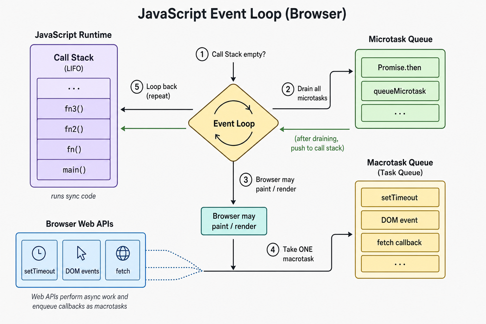

可以每天使用 promises 與 `async`/`await`，卻仍然不清楚 runtime 底下在做什麼。這些筆記由內而外重溫 JavaScript 的 execution model。

這些概念構成一個系統：同步程式碼在 **call stack** 上執行，host environment 處理 stack 之外的工作，而 **event loop** 協調何時可以跑佇列中的 callbacks。Closures 解釋 functions 如何保留 state；promises、`async`/`await` 與 generators 則提供不同方式來暫停與恢復工作。

這篇 note 講的是 code 何時執行。`class`、prototype 與 `this` 在 [TypeScript Class 與 Runtime Identity](/notes/typescript-classes-and-runtime-identity)。

<br />



瀏覽器 event loop 一覽：同步程式碼在 call stack 上執行，host APIs 在背景完成工作並 enqueue tasks，而 promise reactions 進入優先級更高的 microtask queue。每當 stack 清空，event loop 就把下一個 callback 推進去——先 microtasks，再一次一個 task。

---

## 1. Event Loop

常見的第一印象是：event loop 只是檢查非同步工作有沒有做完。更有用的模型是：瀏覽器每次 event-loop iteration 通常會跑 **一個 task**、排空 **所有 microtasks**、給瀏覽器一次 render 機會，然後再進入另一個 task。Stack、host APIs、兩條 queues，以及 `5 1 3 4 2` 排序謎題的完整 walkthrough 在 [深入理解 JavaScript Event Loop](/notes/javascript-event-loop-in-depth)。

<br />

重要後果是：JavaScript 不會中斷目前在 stack 上的程式碼。Timer 可能在背景結束，但它的 callback 必須等到目前這個 task 及其 microtasks 做完。這就是為什麼零毫秒的 timer 仍然不會立刻執行。

<br />

```ts
const log: string[] = []

log.push("sync start")

setTimeout(() => {
  log.push("macrotask")
}, 0)

Promise.resolve().then(() => {
  log.push("microtask")
})

log.push("sync end")

// After the timer runs:
// ["sync start", "sync end", "microtask", "macrotask"]
```

<br />

---

## 2. Call Stack

**Call stack** 是 JavaScript 對「目前正在做什麼」的紀錄。它是後進先出結構：呼叫 function 會 push 一個 frame，return 或 throw 則移除該 frame。只有最上方的 frame 可以執行。

<br />

這解釋了為什麼深度遞迴即使演算法邏輯正確仍可能失敗。每一次 recursive call 都會再消耗一個 stack frame，直到 engine 碰到上限。對深度無界的輸入，iteration 或其他常數 stack 技巧更安全。ES2015 規範了 proper tail calls，可讓某些遞迴形狀變成常數空間，但主流 engines 裡只有 JavaScriptCore 實作了——recursion depth 仍是實務限制。

<br />

```ts
function factorialRecursive(n: number): number {
  if (!Number.isInteger(n) || n < 0) {
    throw new RangeError("n must be a non-negative integer")
  }
  if (n <= 1) return 1
  return n * factorialRecursive(n - 1)
}

function factorialIterative(n: number): number {
  if (!Number.isInteger(n) || n < 0) {
    throw new RangeError("n must be a non-negative integer")
  }

  let result = 1
  for (let i = 2; i <= n; i++) {
    result *= i
  }
  return result
}

// Same result; iterative keeps O(1) stack frames
factorialRecursive(5) // 120
factorialIterative(5) // 120
```

<br />

---

## 3. Macrotask Queue

**Macrotask** 是常見術語，而 HTML specification 通常只稱它們為 **tasks**。Timers、用戶互動與 messages 可以把工作放進 task queues。瀏覽器可能維護多條 queues，並選擇下一個可跑的 task，所以「單一全域 FIFO queue」只是簡化的 mental model。

<br />

要記住的規則是：event loop 跑一個選中的 task，然後在選下一個 task 之前做 microtask checkpoint。因此巢狀的 `setTimeout` 只是排程未來的工作；它不能在父級目前這一輪裡繼續跑。

<br />

```ts
const order: string[] = []

setTimeout(() => {
  order.push("timeout-1")
  setTimeout(() => {
    order.push("timeout-2")
  }, 0)
}, 0)

setTimeout(() => {
  order.push("timeout-3")
}, 0)

// Typical order: timeout-1 → timeout-3 → timeout-2
```

<br />

---

## 4. Microtask Queue

**Microtasks** 是理解非同步 JavaScript 時最常被漏掉的一塊。Promise handlers、`queueMicrotask` 與 `MutationObserver` callbacks 使用這條優先級更高的 queue。當一個 task 結束且 stack 為空後，runtime 會排空 microtasks，**直到 queue 清空**。

<br />

這解釋了為什麼 promise handlers 會在已就緒的 `setTimeout` callback 之前執行。它也帶有風險：一個 microtask 可以再 enqueue 另一個 microtask，所以無界鏈可能無限期延遲 timers、用戶輸入與 rendering。

<br />

```ts
const order: string[] = []

setTimeout(() => {
  order.push("macrotask")
}, 0)

queueMicrotask(() => {
  order.push("micro-1")
  queueMicrotask(() => {
    order.push("micro-2")
  })
})

Promise.resolve().then(() => {
  order.push("promise")
})

// Final order after the timeout runs:
// micro-1 → promise → micro-2 → macrotask
```

<br />

---

## 5. Execution Context

**Execution context** 把 call stack 與 scope 連起來。當 JavaScript 進入 global code 或呼叫 function 時，它會建立執行該程式碼所需的環境：bindings、outer lexical environment，以及 `this` value。

<br />

每次 function call 都有自己的 context 與 stack frame。Function return 後 frame 會被移除，但若回傳的 function 對它形成 closure，其 lexical environment 仍可被觸達。Arrow functions 多了一個有用區別：它們不建立自己的 `this`；而是從周圍 context 捕捉它。

<br />

```ts
const obj = {
  label: "object",
  regular(this: { label: string }): string {
    const arrow = (): string => this.label
    return arrow()
  },
}

const globalLabel = "global"

function outer(prefix: string) {
  const local = "inner"

  function inner(): string {
    // Scope chain: inner → outer → global
    return `${prefix}:${local}:${globalLabel}`
  }

  return inner
}

// The regular method receives `obj` as `this`, and its arrow captures it.
obj.regular() // "object"

// The returned function retains `prefix` and `local`.
outer("ctx")() // "ctx:inner:global"
```

<br />

---

## 6. Closures

**Closure** 最好不要想成某種特殊類型的 function。Function 天然帶有對建立時 lexical environment 的存取，即使它在 outer function 已經 return 之後才被呼叫。

<br />

這讓 private state、event handlers，以及許多 hook patterns 成為可能。Closure 保留了什麼值得刻意處理：被捕捉的 objects 會保持可達；在 loop 裡用 `var` 建立的 callbacks 會共用同一個 function-scoped binding。`let` loop variable 則為每次 iteration 建立新 binding，避免那個常見陷阱。

<br />

```ts
function createCounter(start = 0) {
  let count = start

  return {
    inc(): number {
      count += 1
      return count
    },
    value(): number {
      return count
    },
  }
}

const counter = createCounter(10)
counter.inc() // 11
counter.inc() // 12
counter.value() // 12 — `count` is private to the closure
```

<br />

---

## 7. Promises

**Promise** 代表一個操作最終的結果。它從 `pending` 開始，然後變成 `fulfilled` 或 `rejected`。一個容易忽略的細節是：呼叫 `.then`、`.catch` 或 `.finally` 並不會立刻跑 handler；已 settled 的 promise 會把該 handler 排進 microtask queue。

<br />

Promise combinators 若當成不同的協調策略，會比較好選：`Promise.all` 快速失敗，`Promise.allSettled` 記錄每個結果，`Promise.race` 以第一個結果 settle。在 await 之前先啟動多個 promises，可以讓底層操作重疊進行。

<br />

```ts
type User = { id: string; name: string }
type Settings = { theme: "light" | "dark" }

function delay<T>(value: T, milliseconds: number): Promise<T> {
  return new Promise((resolve) => {
    setTimeout(() => resolve(value), milliseconds)
  })
}

// Both timers start immediately; neither waits for the other.
const userPromise = delay<User>({ id: "1", name: "Ada" }, 100)
const settingsPromise = delay<Settings>({ theme: "dark" }, 50)

Promise.all([userPromise, settingsPromise]).then(([user, settings]) => {
  console.log(user.name, settings.theme)
  // "Ada", "dark" — after roughly 100 ms, not 150 ms
})
```

<br />

---

## 8. Async/Await

`async`/`await` 是建在 promises 上的語法，而不是另一套 concurrency 系統。`async` function 永遠回傳 promise。當它碰到 `await`，該 function 會交出控制權；等 awaited promise settle 後，函式其餘部分會以 microtask 排程繼續。

<br />

`await` 不會阻塞 JavaScript thread，也不會讓 JavaScript 變成多執行緒。它只暫停那個 async function。彼此獨立的操作應一起啟動，而不是逐個 await。

<br />

```ts
type User = { id: string; name: string }
type Settings = { theme: "light" | "dark" }

async function getJson<T>(url: string): Promise<T> {
  const response = await fetch(url)
  if (!response.ok) {
    throw new Error(`HTTP ${response.status}`)
  }

  // This assertion describes the expected shape; it does not validate it.
  return (await response.json()) as T
}

async function loadDashboard(userId: string) {
  // Start both independent requests before waiting.
  const userPromise = getJson<User>(`/api/users/${userId}`)
  const settingsPromise = getJson<Settings>("/api/settings")

  const [user, settings] = await Promise.all([
    userPromise,
    settingsPromise,
  ])

  return { user, settings }
}
```

<br />

---

## 9. Generators

**Generator**（`function*`）是暫停執行的另一個角度。呼叫 generator 不會立刻跑它的 body。它回傳一個 iterator，每次 `.next()` 會恢復執行，直到下一個 `yield` 或 function return。

<br />

這讓 generators 適合 lazy sequences，因為只有在被要求時才產生值。使用 **async generator** 時，`.next()` 回傳 iterator result 的 promise，而 `for await...of` 會等待每個結果。當值隨時間到來時——例如分頁 responses 或 streams——這個模式很有用。

<br />

```ts
function* range(start: number, end: number): Generator<number, void, unknown> {
  for (let i = start; i < end; i++) {
    console.log(`producing ${i}`)
    yield i
  }
}

const values = range(0, 3) // logs nothing: the body has not run

values.next() // logs "producing 0"; { value: 0, done: false }
values.next() // logs "producing 1"; { value: 1, done: false }
// 2 is not produced unless another value is requested.
```

<br />

---

## 重點

<br />

這些不是彼此孤立的 JavaScript 功能。Call stack 與 execution contexts 解釋目前在跑什麼。Task queues、microtasks 與 event loop 解釋延後的工作何時可以跑。Closures 解釋為什麼 state 仍可觸達；promises、`async`/`await` 與 generators 則提供不同方式組織會暫停與恢復的工作。

當 async 程式碼行為出乎意料時，三個問題能解決大多數情況：**目前 stack 上是什麼？什麼會被排成 microtask？什麼必須等下一個 task？** 這個 mental model 比背個別 event-loop 範例的輸出更有用。
