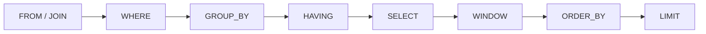

可以每天用 Drizzle 出貨，卻仍然不清楚 Postgres 對一條 statement 做了什麼。ORM 給 query 加上類型。Database 求值的仍然是一個 **relation**：rows 進去，rows 出來，邏輯順序固定。

這些筆記把 SQL 當成一條 pipeline。`FROM` 與 `JOIN` 造出工作中的 row set。`WHERE` 丟掉 rows。`GROUP BY` 與 `HAVING` 摺疊並過濾 groups。`SELECT` 給 output 命名。Window functions 在那份 output 上計算，但不摺疊它。`ORDER BY` 與 `LIMIT` 是最後一刀。Schema、RLS 與 migrations 是接線 —— [用 Hono、Drizzle、Zod OpenAPI 與 SST 打造 Backend APIs](/notes/backend-apis-hono-sst) 和 [用 Hono、Better Auth、Drizzle 與 Postgres RLS 打造 Multi-Tenant 後端](/notes/multi-tenant-backend-drizzle-hono-better-auth)。這篇 note 講的是 statement。

<br />

例子共用一家 shop：customers、orders、line items。Constraints 寫在 `CREATE TABLE` 裡。Indexes 等到講 cost 再出現。

<br />

```sql
CREATE TABLE customers (
  id         uuid PRIMARY KEY DEFAULT gen_random_uuid(),
  email      text NOT NULL UNIQUE,
  name       text NOT NULL,
  created_at timestamptz NOT NULL DEFAULT now()
);

CREATE TABLE orders (
  id          uuid PRIMARY KEY DEFAULT gen_random_uuid(),
  customer_id uuid NOT NULL REFERENCES customers (id),
  status      text NOT NULL,
  created_at  timestamptz NOT NULL DEFAULT now()
);

CREATE TABLE order_items (
  id         uuid PRIMARY KEY DEFAULT gen_random_uuid(),
  order_id   uuid NOT NULL REFERENCES orders (id),
  sku        text NOT NULL,
  qty        integer NOT NULL CHECK (qty > 0),
  unit_cents integer NOT NULL CHECK (unit_cents >= 0),
  UNIQUE (order_id, sku)
);
```

<br />

---

## Pattern 地圖

| Pattern | Typical input | Reach for it when |
| --- | --- | --- |
| Exists | Outer row，related table | 需要「至少有一條」/「一條都沒有」，又不想把 outer row 複製出來 |
| Keyset pagination | Ordered list | 從已知的 `(created_at, id)` 取下一頁，而不是 `OFFSET` |
| Upsert | 可能碰撞的 insert | Unique key 已經存在 —— 用 `ON CONFLICT`，不要 check-then-insert |
| Top-N-per-group | 按 key 分區的 rows | 每個 customer 最新的 order、每個 order 的 top SKUs —— `ROW_NUMBER()` |

<br />

Patterns 是最後一段。Pipeline 在先。

<br />

---

## 1. Relation 進去，relation 出來

Table 是一個有名字的 relation：一袋 rows，每行是一組 columns 的 tuple。`SELECT` 不是一段去拜訪 table 的 procedure。它是一個表達式：吃進 relations，吐出 relation。結果的形狀 —— 哪些 columns、多少 rows —— 由 statement 決定，不是由 application code 裡的 loop 決定。

<br />

**Key** 是對「哪些 rows 可以存在」的 constraint，不是給 planner 的 hint。`PRIMARY KEY` 說這一列標識這行。`customers.email` 上的 `UNIQUE` 說兩個 customers 不能共用一個 email。`REFERENCES` 說 order 不能點名一個不存在的 customer。Application 裡的 `WHERE` 替代不了其中任何一條。

<br />

**`NULL` 不是一個值。** 它是值的缺席。`WHERE email = NULL` 永遠不為 true；predicate 是 `IS NULL`。與 `NULL` 比較得到 unknown，而 `WHERE` 只留下 true。所以 subquery 可能返回 `NULL` 時，`NOT IN (SELECT …)` 會變成陷阱；`NOT EXISTS` 才是仍然說它所聲稱之事的 anti-join。

<br />

---

## 2. 邏輯求值順序

Postgres 不會按書寫順序從左到右跑 statement。它跑的是一條 **logical** pipeline。物理執行 —— hash vs nested loop、index vs seq scan —— 是必須保住這層含義的後續選擇。

<br />



<br />

`FROM` / `JOIN` 造出工作中的 row set。`WHERE` 過濾 **rows**。`GROUP BY` 把 rows 摺疊成 groups；`HAVING` 過濾 **groups**。`SELECT` 給 output columns 命名。Window functions 再在那份結果上計算，而不繼續摺疊。`ORDER BY` 排序。`LIMIT` 截斷。`WITH` CTE 是插進 `FROM` 的 named subquery。它不是另一台引擎。

<br />

這個順序解釋了為什麼 `SELECT` alias 對 `WHERE` 不可見，以及為什麼 window function 不能出現在 `WHERE` 或 `HAVING` 裡。那些子句已經跑完了。要按 window 過濾，用 subquery 或 CTE —— 再一次 `FROM`。

<br />

```sql
-- legal: filter rows before grouping
SELECT customer_id, count(*) AS order_count
FROM orders
WHERE status = 'shipped'
GROUP BY customer_id
HAVING count(*) >= 3;

-- illegal: alias and window are not in scope for WHERE
-- SELECT count(*) AS order_count FROM orders WHERE order_count > 0;
-- SELECT row_number() OVER (ORDER BY created_at) AS n FROM orders WHERE n = 1;
```

<br />

---

## 3. JOIN

Join 是 `FROM` 造出更寬一行的方式。**Inner** 留下 matches。**Left** 留下每一行左邊，右邊沒有 match 時填 `NULL`。**Anti-join** 留下 **沒有** match 的左邊 —— 沒有 orders 的 customers，沒有 items 的 orders。

<br />

```sql
-- inner: orders that have a customer (all of them, given the FK)
SELECT c.email, o.id AS order_id, o.status
FROM orders o
JOIN customers c ON c.id = o.customer_id;

-- left: every customer, orders if they exist
SELECT c.email, o.id AS order_id
FROM customers c
LEFT JOIN orders o ON o.customer_id = c.id;
```

<br />

Left join 會按 order 的數量把 customer 複製出來。那是 cardinality 陷阱：join 之後不做 grouping 就 aggregate，會把同一個 customer 數成他們有多少張 orders。問題是「誰一張都沒有？」時，不要把 `LEFT JOIN … WHERE right.id IS NULL` 當成第一反射。`NOT EXISTS` 是不會複製、也不會被 `NULL` 弄壞的 anti-join。

<br />

```sql
SELECT c.email
FROM customers c
WHERE NOT EXISTS (
  SELECT 1
  FROM orders o
  WHERE o.customer_id = c.id
);
```

<br />

---

## 4. Aggregation

`GROUP BY` 是摺疊。`WHERE` 之後，剩下的 rows 按 grouping keys 分區。每個 group 變成一行 output。未分組的 columns 不能出現在 `SELECT` 裡，除非包進 aggregate —— Postgres 會拒絕這條 statement，而不是隨便挑一個值。

<br />

`HAVING` 是 groups 的 `WHERE`。`WHERE` 看不見 `count(*)`。`HAVING` 可以。

<br />

```sql
SELECT
  c.id,
  c.email,
  count(o.id) AS order_count,
  coalesce(sum(oi.qty * oi.unit_cents), 0) AS revenue_cents
FROM customers c
LEFT JOIN orders o ON o.customer_id = c.id
LEFT JOIN order_items oi ON oi.order_id = o.id
GROUP BY c.id, c.email
HAVING count(o.id) >= 1;
```

<br />

`count(o.id)` 會忽略 left join 帶來的 `NULL`，所以沒有 orders 的 customers 是 `0`，會被 `HAVING` 丟掉。`count(*)` 會把那行空的 joined row 算成一。你選的 aggregate 是在陳述哪些 rows 存在，不是「多少」的同義詞。

<br />

---

## 5. Windows

Window function 在相關 rows 上計算，**但不摺疊它們**。`PARTITION BY` 是 group。`OVER` 裡的 `ORDER BY` 是這個 group 內部的順序。結果是每個 input row 一個值，不是每個 group 一行。

<br />

這就是與 `GROUP BY` 的差別。Aggregation 回答「這個 customer 的 sum 是多少？」Windows 回答「這一行在該 customer 的 orders 裡排第幾？」並且仍然返回每一張 order。

<br />

```sql
SELECT
  o.customer_id,
  o.id AS order_id,
  o.created_at,
  row_number() OVER (
    PARTITION BY o.customer_id
    ORDER BY o.created_at DESC, o.id DESC
  ) AS recency,
  sum(order_total.cents) OVER (
    PARTITION BY o.customer_id
    ORDER BY o.created_at, o.id
  ) AS running_cents
FROM orders o
JOIN (
  SELECT order_id, sum(qty * unit_cents) AS cents
  FROM order_items
  GROUP BY order_id
) order_total ON order_total.order_id = o.id;
```

<br />

`row_number()` 是那條 essential window。在外層 query 裡過濾 `recency = 1`，就得到每個 customer 最新的 order。Running `sum()` 是另一半：一個隨每張 order 增長的 frame。Join 先做 aggregation，line items 才不會把 window 炸開。兩個 windows 都不屬於 `WHERE`。

<br />

---

## 6. Patterns

開頭那張地圖是四種形狀。每一種都是 shop 上的一條短 statement。

<br />

**Exists。** 「至少有一張 shipped order」是 semi-join。`JOIN` 加 `DISTINCT` 也能答，同時會把 row count 炸開。`EXISTS` 在第一條 match 處停下，並保持 outer row 完整。

<br />

```sql
SELECT c.email
FROM customers c
WHERE EXISTS (
  SELECT 1
  FROM orders o
  WHERE o.customer_id = c.id
    AND o.status = 'shipped'
);
```

<br />

**Keyset pagination。** `OFFSET n` 仍然要走過 `n` 行。Keyset seek 從你已經拿到的最後一行之後開始。Sort key 必須 unique —— `(created_at, id)` —— 否則共享同一個 timestamp 的 rows 會跳過或重複。

<br />

```sql
SELECT id, customer_id, created_at
FROM orders
WHERE (created_at, id) < (:cursor_created_at, :cursor_id)
ORDER BY created_at DESC, id DESC
LIMIT 20;
```

<br />

**Upsert。** Check-then-insert 會 race。`ON CONFLICT` 是對著 schema 已經聲明的 unique key 的一條 statement —— `customers.email`，或 `(order_id, sku)`。

<br />

```sql
INSERT INTO customers (email, name)
VALUES ('ada@example.com', 'Ada')
ON CONFLICT (email) DO UPDATE
SET name = excluded.name
RETURNING id;
```

<br />

**Top-N-per-group。** `GROUP BY` 沒法在一次裡留下「top」那一行的未分組 columns。給 rows 編號，再留下 `n <= 2`。

<br />

```sql
SELECT customer_id, order_id, created_at
FROM (
  SELECT
    o.customer_id,
    o.id AS order_id,
    o.created_at,
    row_number() OVER (
      PARTITION BY o.customer_id
      ORDER BY o.created_at DESC, o.id DESC
    ) AS n
  FROM orders o
) ranked
WHERE n <= 2;
```

<br />

---

## 7. Cost

**Index** 是讓 lookup 變便宜、write 稍貴一點的 data structure。它不是 constraint。強制 `customers.email` 的 unique index 兩者都是；`orders.customer_id` 上的普通 index 只是 access path。

<br />

沒有這條 path，`WHERE customer_id = $1` 就是 sequential scan：每次每一行。筆電上瞬間返回。Production 裡隨資料線性變慢。

<br />

```sql
EXPLAIN SELECT id, status
FROM orders
WHERE customer_id = '11111111-1111-1111-1111-111111111111';

-- Seq Scan on orders
--   Filter: (customer_id = '11111111-…')
```

<br />

```sql
CREATE INDEX orders_customer_id_created_at_idx
  ON orders (customer_id, created_at DESC, id DESC);

EXPLAIN SELECT id, status
FROM orders
WHERE customer_id = '11111111-1111-1111-1111-111111111111';

-- Index Scan using orders_customer_id_created_at_idx on orders
--   Index Cond: (customer_id = '11111111-…')
```

<br />

同一個 index 也覆蓋 keyset query：`customer_id` 上的 equality，再沿 `created_at DESC, id DESC` 走。`EXPLAIN` 用來確認你寫的 statement 是你以為的 access path。`EXPLAIN (ANALYZE)` 用來對照真實 row counts。憑本地資料猜測，是 seq scan 被送上線的方式。

<br />

---

## 8. Failure

兩個 requests 讀 `qty`，都加一，都 write。每個 transaction 看起來都正確。這一行跳過了一個數字。Isolation 沒有神秘地失敗。模式是 check-then-act，而 database 從未被要求把它做成 atomic —— 沒有 `UPDATE order_items SET qty = qty + 1`，也沒有 `UNIQUE` 去拒絕重複 insert。

<br />

```sql
-- lost update if two sessions do: read qty, add 1, write qty
UPDATE order_items
SET qty = qty + 1
WHERE id = :id;

-- missing unique: two inserts of the same email both succeed
-- UNIQUE (email) on customers is the constraint; ON CONFLICT is the statement
```

<br />

忘掉 unique constraint，是再多小心的 `WHERE` 事後也修不好的 data bug。沒有 atomic update 或 constraint 的 read-modify-write，是等流量到來的 lost update。Schema 才是 API。Application filters 是習慣。

<br />

這套 stack 的 isolation 路徑 —— transactions、row-level security、tenant context —— 見 [用 Hono、Better Auth、Drizzle 與 Postgres RLS 打造 Multi-Tenant 後端](/notes/multi-tenant-backend-drizzle-hono-better-auth)。Typed schema、pool，以及作為 deploy step 的 migrations，見 [用 Hono、Drizzle、Zod OpenAPI 與 SST 打造 Backend APIs](/notes/backend-apis-hono-sst)。

<br />
