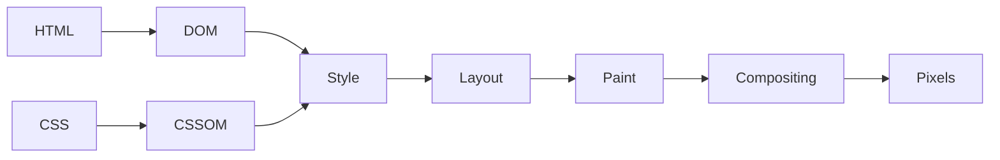
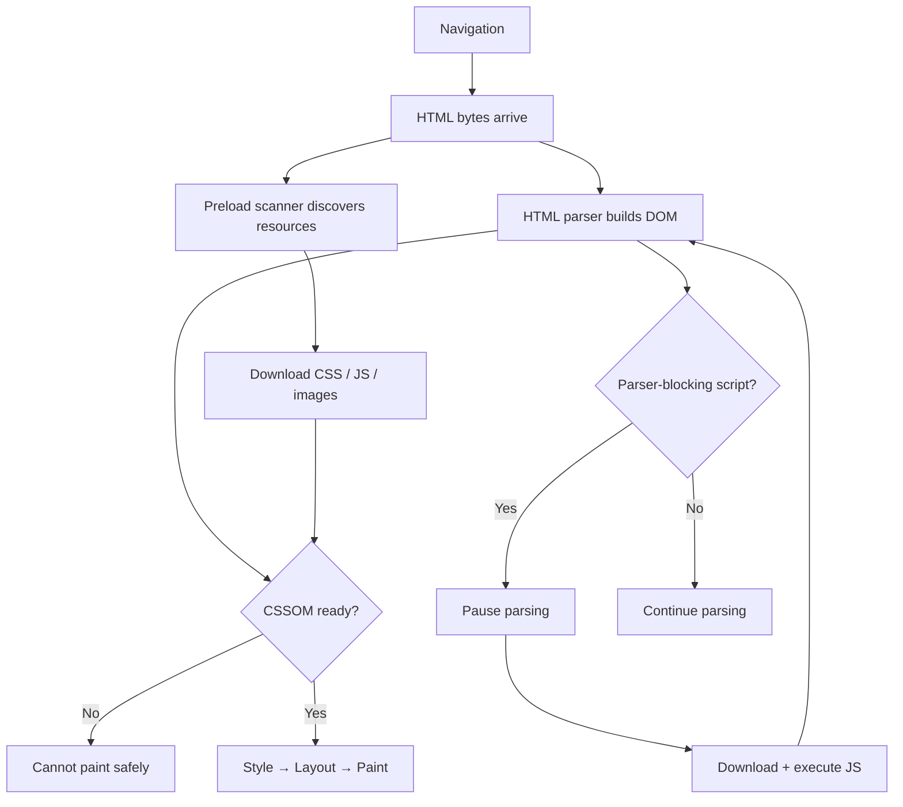
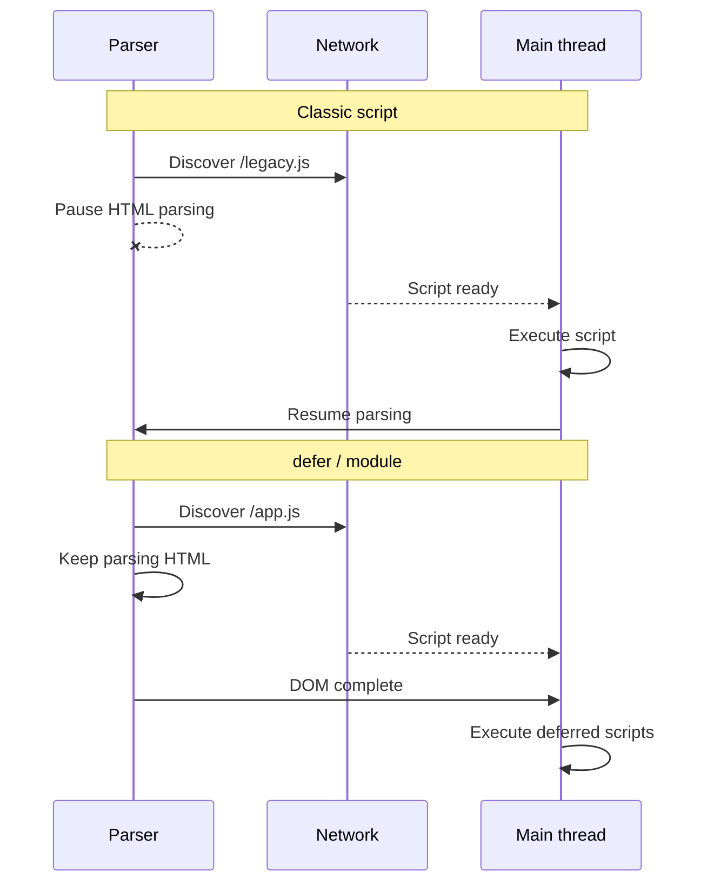
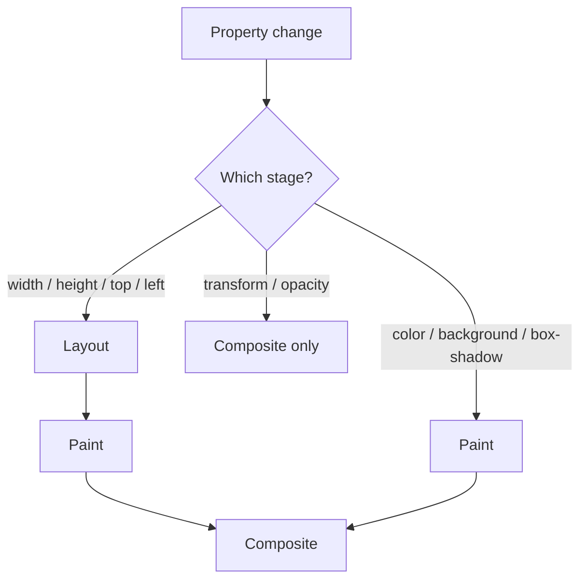
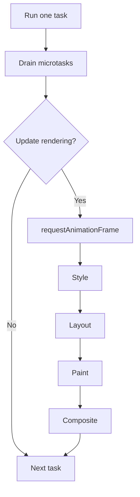
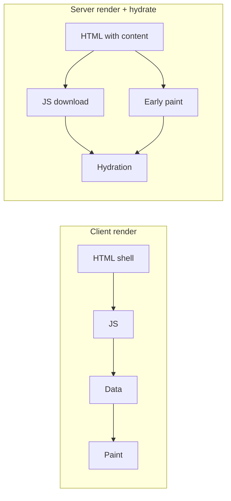
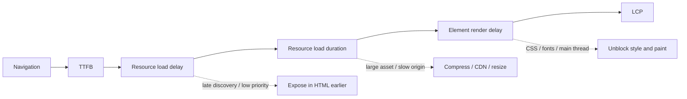

Browser 不會等整頁下載完才一次渲染。它會串流 HTML、發現資源、建立內部 trees、執行 JavaScript、計算 geometry，並逐步 paint。

**Critical rendering path** 是從 navigation 到初始畫面所需 pixels 之間的依賴鏈。它橫跨 network、HTML parser、CSS engine、JavaScript runtime，以及 rendering pipeline。

有用的效能問題不只是「頁面有多大？」，而是：**哪一項資源或 main-thread 任務，正阻止 browser 產出下一個重要的 frame？**

<br />

---

## 1. The Rendering Pipeline

簡化模型如下：

<br />



<br />

真實的 browser 會 pipeline 並重複這些階段。DOM 可以在 HTML 仍在到達時建立，資源可以並行下載，browser 也可以在 document 尚未完成時就 paint。之後 JavaScript 仍可能讓 style、layout 或 paint 失效。

因此 critical path 是一張 **dependency graph**，而不是固定序列。晚到的 stylesheet 會延遲 rendering。Parser-blocking script 會延遲 markup 與資源發現。即使所有資源都已 cached，大型 JavaScript task 仍會延遲 painting。

<br />



<br />

---

## 2. Network、HTML 與 Resource Discovery

Rendering 始於 document request。DNS、connection setup、TLS、redirects，以及 server response time，都發生在 browser 能解析有用 HTML 之前。緩慢的 **Time to First Byte** 會把後面每個階段都往後推。

串流 HTML 讓 browser 能在 server 尚未完成生成回應前就開始處理。因此 critical CSS、fonts、images，以及可見的 markup，應盡早出現在 response 裡。

HTML parser 把 bytes 解碼成 tokens，並逐步建立 DOM。Browsers 也會使用 **speculative preload scanner** 預先尋找 declarative resources，例如：

- `<link rel="stylesheet">`
- `<script src>`
- `` 與 `srcset`
- `<link rel="preload">`

這個 scanner 可以在 main parser 被擋住時仍開始發 request。它無法可靠地發現由 JavaScript 建立、由稍後 API request 回傳，或引用於尚未載入 CSS 裡的資源。

因此 declarative HTML 本身就是一項效能特性。`` 對 browser 立刻可見；在 JavaScript 與資料抓取之後才算出來的 image URL，則變成晚到的依賴。

<br />

---

## 3. CSS 與 JavaScript Blocking

CSS 會被解析成 **CSSOM**。Browser 需要適用的 styles，才能決定有哪些 boxes，以及它們應如何呈現。

放在 document head 的外部 stylesheet，通常是 render-blocking：

<br />

```html
<link rel="stylesheet" href="/app.css" />
```

<br />

CSS 通常不會阻止 DOM construction，但會阻止依賴未完成 styles 的內容被 paint。它也可能延遲後面的 script，因為 JavaScript 可能會檢查 computed styles：

<br />

```html
<link rel="stylesheet" href="/app.css" />
<script>
  console.log(getComputedStyle(document.body).color)
</script>
```

<br />

Script 要等 CSS，parser 又要等 script。一份 stylesheet 現在同時影響 rendering 與 parsing。

CSS `@import` 會造成另一條 waterfall，因為 imported files 要等到 parent stylesheet 下載並解析後才會被發現。直接的 `<link>` 元素能更早暴露 requests。

### Script loading

沒有額外 attributes 的 classic script，在遇到時會擋住 parser：

<br />

```html
<script src="/legacy.js"></script>
```

<br />

替代方案有不同語意：

| Script | Execution | Ordering |
| --- | --- | --- |
| Classic | Blocks parser | Document order |
| `defer` | After parsing | Document order |
| `async` | As soon as ready | Load order |
| `type="module"` | Deferred by default | Module dependency order |

<br />



<br />

應用程式碼通常應使用 module 或 `defer`。獨立的 analytics 可以用 `async`。

Defer 一個 script 能移除 parser blocking，但不會消除它的 CPU 成本。Browser 仍需要 transfer、parse、compile 並 execute。大型 startup tasks 即使在 DOM ready 之後，仍可能延遲 rendering 與互動。

<br />

---

## 4. Style、Layout、Paint 與 Compositing

### Style calculation

Browser 會把 DOM 與 CSSOM 結合，並解析 cascade、inheritance、relative values，以及 matching rules。結果決定哪些 boxes 參與 rendering。

DOM nodes 與 boxes 並非一對一對應：

- `display: none` 會把 subtree 從 layout 移除。
- `visibility: hidden` 會保留 layout 空間。
- Pseudo-elements 可以在沒有 DOM nodes 的情況下建立 boxes。
- Text 可以產生多個 line boxes。

大型 DOMs 與大範圍 invalidation，通常比微優化一般 selectors 更重要。

### Layout

Layout 計算 box positions、dimensions、line breaks 與 relationships。寬度變更可能影響 descendants、重排文字，並移動 container 下方的所有內容。

Browsers 會把這類工作 batch 到需要 geometry 為止。交錯 writes 與 reads 可能迫使重複的 synchronous layouts：

<br />

```ts
for (const card of cards) {
  card.style.width = "50%"
  console.log(card.offsetWidth)
}
```

<br />

Write 會讓 layout 失效；`offsetWidth` 則要求當前 geometry。應改為先 batch reads，再寫入：

<br />

```ts
const widths = cards.map((card) => card.offsetWidth)

for (const [index, card] of cards.entries()) {
  card.style.width = `${widths[index] / 2}px`
}
```

<br />

像 `getBoundingClientRect`、`offsetWidth` 與 `getComputedStyle` 這類 APIs 本身並不慢。當它們迫使 browser flush 尚未完成的 style 或 layout 工作時，才會變得昂貴。

### Paint and compositing

Paint 會記錄文字、背景、邊框、images、陰影與特效的 drawing commands。Browser 會把這些工作 rasterize 成 tiles，並可能把內容放到 composited layers。

<br />



<br />

使用 `transform` 與 `opacity` 的 animations，往往可以在 compositor 上執行，而不需新的 layout 或 paint：

<br />

```css
.panel {
  transition:
    transform 180ms ease,
    opacity 180ms ease;
}
```

<br />

動畫化 `width`、`height`、`top` 或 `left`，通常會觸發 layout 與 paint。Compositor 工作也不是免費的：layers 佔用記憶體、需要 rasterization，而且每 frame 都要組裝。到處套用 `will-change` 可能反而讓效能更差。

<br />

---

## 5. Main Thread 與 Rendering Opportunities

JavaScript 與大部分 rendering 工作共用 main thread。簡化的 event-loop turn 如下：

<br />



<br />

Browser 不會在每個 task 之後都 paint，但它需要 main thread 變得可用。長時間的 JavaScript tasks 會延遲 input 與 frames。無上限的 microtask chain 也可能餓死 rendering，因為 browser 會先 drain microtasks 才繼續往下。

當 UI 需要回應機會時，應把 CPU-heavy 工作拆成較小的 tasks。用 `requestAnimationFrame` 讓視覺 writes 對齊 frame，而不是拿它做昂貴計算。當通訊成本合理時，可把適合的 CPU 工作移到 Web Worker。

<br />

---

## 6. 優化初始畫面

初始 render 通常需要可見 HTML、適用的 CSS、blocking scripts、main-thread rendering time，以及結果所需的任何 image 或 font。它不需要 below-the-fold media、analytics、chat widgets，或大部分互動程式碼。

該依賴鏈可按以下順序優化：

1. 減少 redirects 與 TTFB；盡早串流有用的 HTML。
2. 讓 critical CSS、fonts 與 LCP image 可從 HTML 被發現。
3. 移除 parser-blocking scripts 與 CSS import chains。
4. 減少 critical CSS 與 JavaScript，而不只是總頁面大小。
5. 把 third-party 程式碼留在初始 path 之外。
6. 減少 style、layout、paint 與 hydration 工作。

有選擇地使用 resource hints：

<br />

```html
<link rel="preconnect" href="https://cdn.example.com" crossorigin />
<link
  rel="preload"
  href="/hero.avif"
  as="image"
  type="image/avif"
  fetchpriority="high"
/>
```

<br />

`preconnect` 會消耗資源來準備 connection。`preload` 會競爭 bandwidth，且必須與最終 request 的 type 與 credentials mode 一致。過度使用任何一個，都可能延遲更重要的資源。

為 images 提供 dimensions，讓 layout 空間在載入前就存在：

<br />

```html

```

<br />

不要 lazy-load LCP image。對螢幕外的 media 使用 `loading="lazy"`。

對於 fonts，提供 WOFF2 subsets，並允許 fallback text 先渲染：

<br />

```css
@font-face {
  font-family: "Inter";
  src: url("/fonts/inter-latin.woff2") format("woff2");
  font-display: swap;
  font-weight: 100 900;
}
```

<br />

在長頁面上，`content-visibility: auto` 可以跳過螢幕外的 rendering 工作。CSS containment 與 list virtualization 也能減少工作量，但兩者都會改變行為，應在測量之後才引入。

<br />

---

## 7. Framework Rendering 與 Hydration

Client-rendered application 往往要等到 JavaScript、framework startup 與 data fetching 完成後，才會出現有意義的內容。

Server rendering 把內容與資源引用移進 HTML，讓更早的 discovery 與 paint 成為可能。它並沒有消除 JavaScript 成本。一頁可以很快 paint，然後在大型 hydration task 執行時變得無法回應。

<br />



<br />

Streaming SSR、selective hydration、islands 與 Server Components，都在處理同一個問題：減少 startup 工作，並把非關鍵 JavaScript 留在初始 dependency chain 之外。

相關的架構問題是：

- 哪些內容必須出現在第一份 HTML response？
- 哪些 components 需要 client-side JavaScript？
- Code 與 data 何時變得可被發現？
- Hydration 能否在更小的 boundaries 進行？
- Framework 是否正在造成 server-to-client request waterfalls？

<br />

---

## 8. 測量這條 Path

使用 production build，並同時檢查 Network waterfall 與 Performance trace：

- **Network** 揭示晚到的 discovery、priority、queueing 與 transfer time。
- **Main** 揭示 parsing、script execution、style、layout、paint 與 long tasks。
- **Frames** 揭示錯過的 rendering deadlines。
- **Experience** 揭示 layout shifts 與 Core Web Vitals。

對於緩慢的 **Largest Contentful Paint**，把時間拆成：

1. **TTFB**
2. **Resource load delay**
3. **Resource load duration**
4. **Element render delay**

<br />



<br />

高 load delay 指向 discovery 或 priority。高 load duration 指向 asset 大小或 origin 速度。高 render delay 指向 CSS、fonts、decoding、JavaScript，或 main-thread contention。

周圍的 metrics 說明不同失敗：

- **FCP**：第一個內容何時出現。
- **LCP**：最大可見內容何時出現。
- **CLS**：非預期的位移。
- **INP**：互動到下一次 paint 的延遲。

一頁可以有很快的 LCP，但若 hydration 或 third-party scripts 之後佔用 main thread，INP 仍可能很差。Lab traces 解釋原因；real-user monitoring 顯示用戶有多常遇到它們。

<br />

---

## 最終心智模型

Critical rendering path 消耗三種有限資源：

- **Network time**：發現並傳輸關鍵 bytes。
- **Main-thread time**：parse、execute、style 與 lay out。
- **Rendering capacity**：paint、rasterize 與 composite frames。

快速的頁面會盡早暴露重要資源、避免意外 blockers、減少 startup JavaScript、預留 layout 空間，並把初始 viewport 之外的工作延後。

目標不是讓每個資源立刻載入，而是在 navigation 與用戶前來查看的那些 pixels 之間，建立最短可能的 dependency chain。
