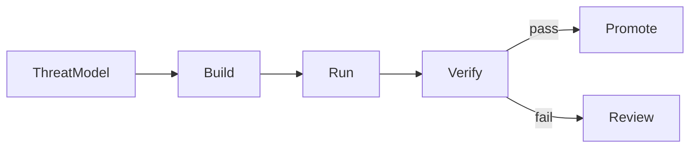

**DevSecOps** 是把資訊安全整合到軟件交付生命週期的實踐。安全不再只是發佈前的最後一次檢查，而是涵蓋設計、開發、持續整合、部署與日常運作的一系列決策和控制。

本文集中討論交付流程。應用層風險見 [Web Security and the OWASP Top 10](/notes/web-security-owasp-top-10)，完整的交付管線見 [React 與 React Native 的 Frontend CI/CD](/notes/frontend-ci-cd-for-react-and-react-native)，以 stage 管理基礎設施則見 [用 SST 管理 AWS 基礎設施與 DevOps](/notes/using-sst-for-aws-infra-and-devops)。

<br />

---

## 1. 心智模型

DevSecOps 流程可以分成三項持續進行的活動：

- **Build** — 控制哪些程式碼、相依套件和工作流程定義可以進入程式碼庫。
- **Run** — 限制 CI/CD 管線及其憑證可以執行的操作。
- **Verify** — 收集足夠證據，判斷產出物是否適合發佈。



<br />

| 活動       | 主要問題                                               | 風險例子                                              |
| ---------- | ------------------------------------------------------ | ----------------------------------------------------- |
| **Build**  | 變更是否加入了非預期的程式碼、相依套件或工作流程行為？ | 被入侵的套件或可變的 CI Action 被納入 build           |
| **Run**    | 管線使用哪個身分？它可以存取哪些資源？                 | Pull-request job 取得 production 憑證或過大的雲端權限 |
| **Verify** | 產出物被 promote 前，哪些檢查必須通過？                | 未經安全掃描、來源證明或審批便直接發佈                |

這些控制是應用安全的補充，而不是替代品。應用仍然需要身分驗證、授權、輸入驗證與資料保護。[Next.js 裡的 Security](/notes/security-in-next-js) 詳細說明這些 web application concerns。

<br />

---

## 2. 把安全放進整個生命週期

不同的安全活動會提供不同類型的證據：

- **威脅建模（threat modeling）** 在開發前識別重要資產、信任邊界、可能的濫用情境與合適的控制。
- **自動化檢查** 對每項相關變更提供可重複的回饋。
- **人工審查和滲透測試** 檢查自動化工具未必能理解的行為。
- **執行期監控** 在發佈後偵測可疑或非預期行為。

**Shift left** 是把有用的回饋提前到生命週期較早的階段，讓問題更容易修正。它不代表所有安全責任都交給開發人員。平台與安全團隊仍然需要提供可重用的控制、指引與事故支援；開發人員則把這些控制套用到自己負責的系統。

自動化檢查亦需要明確的處理政策。檢測結果可以阻擋 pull request、要求發佈前審批，或建立有期限的修正項目。應採取哪種處理方式，取決於嚴重程度、可觸及性、可信度和系統本身的風險。

<br />

---

## 3. 從 Threat Model 開始

團隊先確認需要保護的對象，工具才有清晰目的。

| Asset                   | Security concern                       | 常見位置                                                                     |
| ----------------------- | -------------------------------------- | ---------------------------------------------------------------------------- |
| **User session**        | 攻擊者可能冒充使用者                   | Better Auth session cookie；見 [OWASP A07](/notes/web-security-owasp-top-10) |
| **Runtime secrets**     | 攻擊者可能取得應用或資料庫存取權       | Link 到伺服器端資源的 SST Secrets                                            |
| **Deployment identity** | 攻擊者可能改變 production 執行的內容   | GitHub OIDC federation 到 AWS IAM role                                       |
| **Release artifact**    | 未經審查或被竄改的程式碼可能到達使用者 | CI 產生的 web 或 mobile 產出物                                               |

從這些資產可以推導出具體的安全目標：

- Release 只包含已審查的程式碼與獲准使用的相依套件。
- Secrets 只留在需要它們的環境和 workload。
- Deployment credentials 使用短有效期，並限制權限範圍。
- Promoted artifact 可以追溯到來源 commit 和 build process。
- 基礎設施變更以可審查的 diff 呈現。

這些目標可用來選擇控制，並決定哪些失敗需要阻擋交付。

<br />

---

## 4. 各類安全檢查提供甚麼

每一類檢查觀察系統的不同部分。任何單一掃描工具都不能證明應用已經安全。

| Control                                          | 提供的證據                                            | 常見執行位置                                   |
| ------------------------------------------------ | ----------------------------------------------------- | ---------------------------------------------- |
| **Software composition analysis（SCA）**         | 識別相依套件中已知的漏洞和違反政策情況                | Pull request 或 scheduled scan                 |
| **Secret scanning**                              | 偵測提交到程式碼庫或出現在 logs 的憑證和 private keys | Pre-commit、pull request 與 repository history |
| **Static application security testing（SAST）**  | 在不執行應用的情況下找出指定的不安全模式              | Pull request                                   |
| **Infrastructure-as-code scanning**              | 檢查資源定義中過大的權限或 network exposure           | Pull request                                   |
| **Dynamic application security testing（DAST）** | 從執行中的應用觀察安全問題                            | Preview、staging 或 release                    |
| **SBOM 與 provenance**                           | 記錄 release artifact 的內容和來源                    | Build 與 release                               |

檢查結果仍需要結合實際情境。例如，一項 SCA finding 可能位於 production 不會執行的程式路徑；相反，分數較低的問題也可能影響公開的驗證流程。團隊應記錄哪些嚴重程度和條件會阻擋交付、例外如何審批，以及例外何時到期。

Pull-request workflow 可以避免品質與安全 jobs 取得不必要的權限：

```yaml title="quality job"
name: CI

on:
  pull_request:
  push:
    branches: [main, develop]

permissions:
  contents: read

jobs:
  build:
    runs-on: ubuntu-latest
    timeout-minutes: 60
    steps:
      - uses: actions/checkout@fbc6f3992d24b796d5a048ff273f7fcc4a7b6c09 # v5
      - uses: oven-sh/setup-bun@0c5077e51419868618aeaa5fe8019c62421857d6 # v2
        with:
          bun-version: 1.3.14
      - run: bun install --frozen-lockfile
      - run: bun run lint
      - run: bun run check-types
      - run: bun run --filter web test
      - run: bun run build
      - run: bun run security:scan # project-defined security checks
```

<br />

- `permissions: contents: read` 只提供 job 所需的程式碼庫存取權。
- `--frozen-lockfile` 確保 CI 使用 pull request 中已審查的 dependency graph。
- Project-level security script 為本地和 CI 提供一致的掃描入口。
- 第三方 actions 可以 pin 到完整 commit SHA，避免可變的 version tag 在未經審查下改變實際執行的程式碼。

Preview 與 artifact promotion 等完整結構見 [Frontend CI/CD 文章](/notes/frontend-ci-cd-for-react-and-react-native)。

<br />

---

## 5. 管線身分與最小權限

CI/CD workflow 是一種機器身分，其權限管理方式應與其他服務身分一致。

這個程式碼庫會在 deployment branch 成功 push 後部署。Deploy job 使用 GitHub OIDC，為 AWS IAM role 取得短有效期憑證：

```yaml title="deploy job"
deploy:
  needs: build
  if: github.event_name == 'push'
  environment:
    name: ${{ github.ref_name == 'main' && 'production' || 'dev' }}
  permissions:
    id-token: write
    contents: read
  steps:
    - uses: aws-actions/configure-aws-credentials@ff717079ee2060e4bcee96c4779b553acc87447c # v4
      with:
        role-to-assume: ${{ secrets.AWS_ROLE_ARN }}
        aws-region: ap-east-1
    - run: bunx sst deploy --stage "$SST_STAGE"
```

<br />

- **OIDC federation** 以臨時憑證取代長期有效的 AWS access keys。AWS 可以按 repository、branch、workflow 和 environment 限制 trust policy。使用者登入所用的 OIDC 是另一個 use case，見 [OAuth 2.0 與 OIDC 解釋](/notes/oauth-2-and-oidc-explained)。
- **`id-token: write`** 只應授予需要取得 OIDC token 的 jobs。
- **GitHub Environments** 可以分隔 `dev` 與 `production`、保存各環境的設定，並在 production deployment 前要求審批。
- **Pull-request workflows** 不應取得 production secrets。使用 `pull_request_target` 時要特別小心，因為它在 base repository 的執行環境中運作。

本地 deployment 使用開發人員的 AWS profile，CI 則使用 federated role。分開這兩種身分，能令權限和 audit trails 更清晰。

<br />

---

## 6. Secret 邊界

Secret 的儲存位置應由使用者和使用時機決定。

| 位置                    | 合適內容                                                     | Access boundary                  |
| ----------------------- | ------------------------------------------------------------ | -------------------------------- |
| **SST Secrets**         | Database URL、Better Auth secret、edge credentials、API keys | Link 到特定 stage 的伺服器端資源 |
| **GitHub Environments** | Deployment role ARN、notification webhook、signing material  | 獲准使用該 environment 的 jobs   |
| **Client bundle**       | 只限公開設定                                                 | 所有可以下載應用的人             |

由此可得幾項重要原則：

- SST-linked values 是供伺服器端使用的資料。[用 SST](/notes/using-sst-for-aws-infra-and-devops) 有更詳細的 linking 說明。
- `NEXT_PUBLIC_*` values 會進入瀏覽器端程式碼，因此必須視為公開資料。見 [Next.js 裡的 Security](/notes/security-in-next-js)。
- Secret 一旦提交到 Git，只從最新 revision 移除並不足夠；相關憑證應立即 revoke 或 rotate。
- Logs 亦需要資料政策。Security events 有助調查，但 tokens、cookies、connection strings 與敏感個人資料應被遮蔽。

<br />

---

## 7. 軟件供應鏈與完整性

OWASP **A03 Software Supply Chain Failures** 涵蓋被入侵的相依套件和 build paths。**A08 Software or Data Integrity Failures** 則包括在缺乏足夠完整性檢查下接受 artifacts。

常見控制包括：

- **提交 lockfile** 並使用 frozen installs，避免 CI resolve 出未經審查的 dependency graph。
- **把第三方 workflow actions pin 到完整 commit SHA**，再由 update bot 提出升級 pull requests。
- **Build once, promote the same artifact**：在平台支援的情況下，preview、testing 與 production 使用同一份 artifact。
- **產生 SBOM**，記錄 artifact 包含哪些元件。
- **記錄 provenance**，把 artifact 連結到來源 commit、workflow 和 builder。

SBOM 和 provenance 改善可追溯性，但不取代程式碼審查、測試或漏洞管理。React Native 亦包含由 Gradle 和 CocoaPods 管理的 native dependencies，因此供應鏈審查不能只檢查 JavaScript dependency graph。詳見 [React Native 裡的 Security](/notes/security-in-react-native)。

<br />

---

## 8. 執行期運作

DevSecOps 在部署後仍然繼續。執行期控制與營運回饋能確認開發階段的假設在 production 是否仍然成立。

這個網站的例子包括：

- Production CloudFront Router 上的 **Web Application Firewall（WAF）**。
- Non-production environments 的 **Basic Authentication**，憑證來自 SST Secrets。
- 對授權拒絕、管理操作和 webhook signature failures 建立記錄與警報。

每項警報都應有明確負責人和預期處理方式。Logs 要保留足夠的調查資料，同時避免洩漏相關 secret 或個人資料。

部分安全決策應採用 **fail closed**。例如，授權依賴服務逾時不應變成允許存取；必要的 security check 無法執行時，也不應視為成功。這項原則需要按系統情況使用，因為每個系統對可用性和安全性的要求不同。

Disaster recovery 是相關但獨立的議題，處理嚴重故障後如何恢復服務和資料。RTO、RPO、backup 與 failover strategies 見 [System Design 裡的 Disaster Recovery](/notes/disaster-recovery-in-system-design)。

<br />

---

## 9. 權責與審查

當權責清晰，controls 才能穩定運作。

| Control                             | 一般由誰編寫                     | Enforcement                                | Operational owner            |
| ----------------------------------- | -------------------------------- | ------------------------------------------ | ---------------------------- |
| Threat model 與 SAST policy         | Feature 和 security engineers    | Pull-request CI                            | 負責分類 findings 的團隊     |
| Lockfile、action pins、scan scripts | Developers 和 platform engineers | CI configuration                           | Dependency update process    |
| IAM trust 與 environments           | Platform 或 infrastructure team  | OIDC conditions 和 environment rules       | Cloud 與 GitHub audit owners |
| Runtime secrets                     | Service owner                    | Resource linking 與 server-only boundaries | Secret rotation process      |
| WAF、edge authentication、alerts    | Infrastructure 與 service teams  | Infrastructure deployment                  | On-call team                 |

Dependency、workflow 或 IAM 變更應按照新引入的存取權限接受相應審查。Infrastructure as code 讓這些變更與 application code 一樣，能在同一個 review process 中被看見。

<br />

---

## 10. 實用預設值

以下預設值適合作為這套 stack 的起點：

- 選擇安全工具前先定義 threat model。
- CI deployment 使用 OIDC federation，避免長期有效的雲端 access keys。
- 每個 workflow job 只取得必要權限。
- 提交 lockfile、使用 frozen installs，並 pin 第三方 actions。
- Runtime secrets 放在 SST；各環境的部署資料放在 GitHub Environments。
- 把 `NEXT_PUBLIC_*` values 視為公開資料。
- 交付平台支援時，build 一次並 promote 同一份 artifact。
- 定義哪些 findings 會阻擋交付，以及例外的審查流程。
- 為警報指定負責人，並記錄預期處理方式。
- 把 WAF 和 non-production access policy 放在可審查的 infrastructure code。

因此，DevSecOps 不只是一套工具，也是協作模式：安全要求指導開發，自動化 controls 提供及時證據，而營運工作則確認已部署系統繼續按預期運作。

---

## Recap Q&A

<Accordion type="single" collapsible>
  <AccordionItem value="dso-what">
    <AccordionTrigger>1. 甚麼是 DevSecOps？</AccordionTrigger>
    <AccordionContent>

      - DevSecOps 把安全整合到設計、開發、CI/CD、部署與執行期運作。
      - 一個實用模型是 **build**（控制輸入）、**run**（限制管線權限）與 **verify**（收集發佈證據）。
      - 它是應用安全和人工審查的補充，而不是替代品。

    </AccordionContent>

  </AccordionItem>

  <AccordionItem value="dso-signals">
    <AccordionTrigger>2. 為甚麼需要多種安全檢查？</AccordionTrigger>
    <AccordionContent>

      - SCA 檢查相依套件，secret scanning 找出外洩憑證，SAST 檢查 source patterns，而 IaC scanning 檢查基礎設施定義。
      - DAST 觀察執行中的應用；SBOM 和 provenance 則記錄建出了甚麼，以及它來自哪裡。
      - 每項 control 只提供有限證據，因此結果仍需要風險政策和審查。

    </AccordionContent>

  </AccordionItem>

  <AccordionItem value="dso-identity">
    <AccordionTrigger>3. Deployment pipeline 應如何向 AWS 驗證身分？</AccordionTrigger>
    <AccordionContent>

      - GitHub OIDC 可為權限範圍明確的 IAM role 提供短有效期 AWS credentials。
      - 只有 deployment jobs 需要 `id-token: write`；build 和 pull-request jobs 應維持最小權限。
      - GitHub Environments 可以分隔 stages，並為 production 加入審批規則。

    </AccordionContent>

  </AccordionItem>

  <AccordionItem value="dso-secrets-supply">
    <AccordionTrigger>4. Secrets 與軟件供應鏈完整性應如何處理？</AccordionTrigger>
    <AccordionContent>

      - Runtime secrets 放在 SST，部署設定放在受保護的 GitHub Environments，client bundle 只放公開資料。
      - 提交 lockfile、使用 frozen installs、pin 第三方 actions，並在測試後 promote 同一份 artifact。
      - SBOM 描述 artifact contents；provenance 記錄來源和 build process。

    </AccordionContent>

  </AccordionItem>

  <AccordionItem value="dso-owner">
    <AccordionTrigger>5. 一項安全控制要具備甚麼才算有效？</AccordionTrigger>
    <AccordionContent>

      - Control 需要清晰目的、執行位置、負責人和處理程序。
      - Findings 要有明確的阻擋和例外政策。
      - Runtime alerts 要傳到負責團隊；logs 則保留有用資料，同時避免暴露 secrets。

    </AccordionContent>

  </AccordionItem>
</Accordion>
