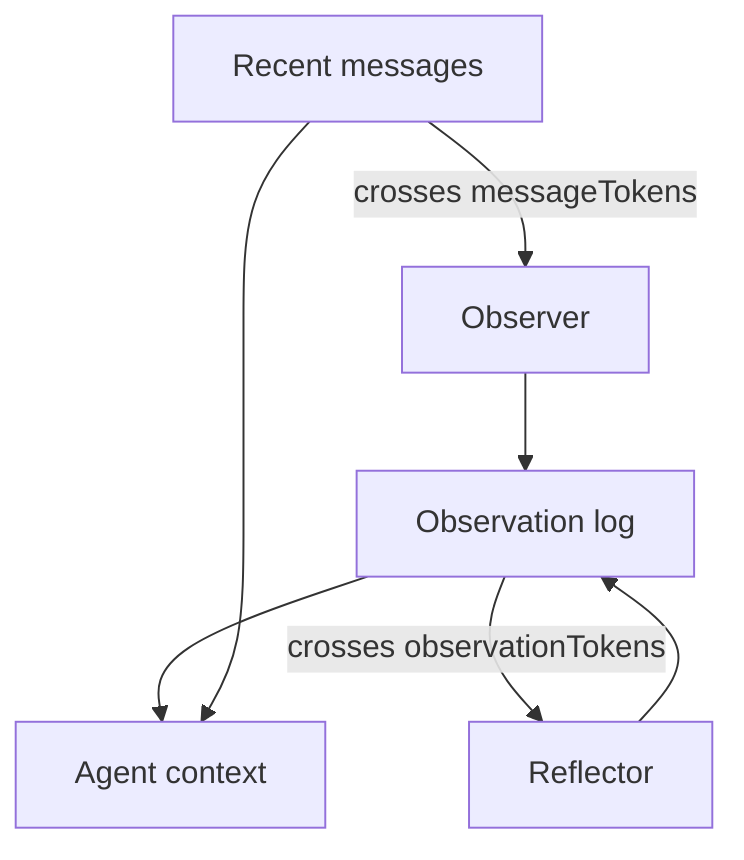

LLM 會忘。把最近 *N* 則 messages 塞進每次 request，十輪還能撐。碰上 tool dumps、新 thread，或任何停在第一則 message 的 goal，就會崩。

這是 Mastra 的四層階梯，按他們推出的順序。Alex Becker 在 [Four levels of agent memory](https://www.youtube.com/watch?v=18iIHQtIPmc) 走同一套 stack。這不是 CoALA taxonomy（working / episodic / semantic / procedural）。那些名字描述的是*知識種類*。這四個層級描述的是*tokens 住在哪裡*，以及*你付什麼代價*去留住它們。

所有層級都需要 storage。不帶 options 的 `new Memory()` 已經是 level 1。其餘都是同一個 object 上的 flags。

<br />

---

## 1. Conversation history

**Thread** 是一次 conversation。**Resource** 是擁有者：一個 user、一個 org、一個 project。Studio 會兩邊都產生。自己呼叫 `generate` 或 `stream` 時，你要傳進去。

Mastra 從 storage 載入最近 *N* 則 messages，放進 context window。預設 `lastMessages` 是 10。

<br />

```ts
import { Agent } from "@mastra/core/agent"
import { Memory } from "@mastra/memory"

export const agent = new Agent({
  id: "chat-agent",
  name: "Chat agent",
  instructions: "You are a helpful assistant.",
  model: "openai/gpt-5-mini",
  memory: new Memory({
    options: {
      lastMessages: 10,
    },
  }),
})
```

<br />

- 從 client 端，**只送新 message**。Mastra 已經有 thread。把完整 history 再送一次是多餘的，而且 client timestamps 會跟 store 裡的 messages 搶順序。
- Window 是滑動切割。若用戶的 goal 在第一則 message，接著燒掉 30 個 tool turns，goal 就沒了。
- 新 thread 沒有 history。同一個 agent、同一個人、空的 context。那是 session cookie，不是 intelligence。
- Tool results 會讓切割來得比你預期更早。一次 `llms.txt` fetch 可以是 10k tokens。

**Failure：** 把 history 當成一套 memory 系統。它對短 chats 是正確的預設。

<br />

---

## 2. Working memory

Working memory 是一塊 **scratchpad**，模型每個 turn 都看得到——即使幾百則 messages 之後，即使在新 thread 上（若 scope 是 `resource`）。

你給它空欄位。Agent 用 `updateWorkingMemory` 填進去。填好的區塊會注入 system instruction，用戶永遠看不到。

<br />

```ts
memory: new Memory({
  options: {
    workingMemory: {
      enabled: true,
      scope: "resource",
      template: `# User Profile
- **Name**:
- **Preferences**:
- **Current Goal**:
`,
    },
  },
})
```

<br />

- 它補充 history。它不取代 history。用在不會變的事實：名字、preferences、當前 goal。Coding agents 與任何 long-horizon task 都活在這裡。
- `scope: "resource"` 是預設：每個 user 跨 threads 共用一塊 scratchpad。`scope: "thread"` 把它隔離到這次 conversation。切換 scopes 不會遷移資料。
- 可以用 Zod `schema`，而不是 Markdown `template`。不能兩個都用。Templates 每次 update 會替換整塊。Schemas 會 merge：只送改過的 fields；把 field 設成 `null` 來刪除。
- Working memory 故意很小。你必須預先定義 fields。當 observational memory 打開時，`observationalMemory.observation.manageWorkingMemory` 讓 Observer 寫 scratchpad，主 agent 就不必記得那個 tool。

**Failure：** 把 conversation summaries 塞進 template，或把它養成 event log。那是第四級。

<br />

---

## 3. Semantic recall

Semantic recall 是針對 *message history* 的 RAG，不是針對你的 product corpus。

每則新 message 都會被 embed，之後的 messages 會查詢那個 vector store 找相似 turns。「I like dogs, mine is called Nas Barkley。」後來，在另一個 thread：「what animals do I like?」Lookup 按 meaning。Mastra 把 hits 注入成額外的 system block。

<br />

```ts
memory: new Memory({
  storage: new LibSQLStore({ id: "agent-storage", url: "file:./local.db" }),
  vector: new LibSQLVector({ id: "agent-vector", url: "file:./local.db" }),
  embedder: new ModelRouterEmbeddingModel("openai/text-embedding-3-small"),
  options: {
    semanticRecall: { topK: 3, messageRange: 2, scope: "resource" },
  },
})
```

<br />

- `topK` 是命中數量。`messageRange` 是每個 hit 要一併拉回的周圍 turns。太多，模型會淹死。太少，你會錯過那個 fact。
- `scope: "resource"` 搜尋該 user 的所有 threads；LibSQL、Postgres、MongoDB、OracleDB 與 Upstash 支援它。
- 預設關閉。它需要 vector store 與 embedder。Write 與 query 用同一個 embedding model，規則跟 document RAG 一樣。
- Recall 不精確——你得按產品調 `topK` 與 `messageRange`。你現在要跑 embedder 與 vector store。每一輪都有 latency。
- [如何搭建一套 RAG 系統](/notes/how-to-build-a-rag-system) 裡的 org-scoped document index 是 agent 用 tool 搜尋的 library。Message RAG 是「我們說過什麼」。不同 indexes。不同 tenancy。不同 tools。

**Failure：** 注入的 system block 會隨 query 改變。Prompt prefix 永遠不夠穩定，打不中 cache。在 production，cached input tokens 通常是最大的節省。Semantic recall 把它們花掉。

<br />

---

## 4. Observational memory

Observational memory 建模的是人如何記得，以及如何忘記。兩個 ambient agents：**Observer** 與 **Reflector**。它們一直在。它們不總是在跑。

當 message tokens 越過閾值（預設 30,000；demos 常用 2k 好讓你看著它發生），Observer 把 raw history 壓成一份 dense observation log：priority markers、timestamps，以及仍然重要的那一絲。一次 10k-token 的 tool result 可以變成約 160 tokens。

當 observation log 本身越過它的閾值（預設 40,000），Reflector 重寫整份 log。它丟掉低優先級行、合併相關 facts，並讓 window 保持有界。Reflections 不會疊成第三層無限層。每次 reflection *就是* 新的 log。新的 observations 接在它後面。

<br />



<br />

- Observations 是 **stable** 的。它們 append。它們不會每一輪都重排 system prefix——這是對 semantic recall 那個 cache 論點的反轉。
- Observer 與 Reflector 在背景跑。在 Studio 裡你可以點它們做 demo。在真正的 agent 裡它們是 async、non-blocking。Coding harness 裡的 compaction 常常讓用戶停一分鐘，還丟掉錯誤的細節。這個 loop 兩邊都不該做。

<br />

```ts
memory: new Memory({
  storage: new LibSQLStore({ id: "memory-storage", url: "file:./memory.db" }),
  options: {
    observationalMemory: { model: "google/gemini-2.5-flash" },
  },
})
```

<br />

- `observationalMemory: true` 把 Observer/Reflector model 預設成 `google/gemini-2.5-flash`。Storage 是必需的。目前支援的 adapters：`@mastra/pg`、`@mastra/libsql`、`@mastra/mysql`、`@mastra/mongodb`、`@mastra/convex`、`@mastra/oracledb`。
- 影片裡 Mastra 的 LongMemEval 數字，前三行用同一個 model：working memory 約 55%（不是為這個 benchmark 設計的）、semantic recall 約 80%、observational memory 約 84%。Gemini 2.5 Flash 在 OM 上被報成約 95%。把這些當成 Mastra 公布的分數，不是獨立 bake-off。
- 這是能撐過 noisy tool calls 的層級：page snapshots、`llms.txt`、MCP dumps。它也會累積——一個連續幾週寫活動文案的 workshop-helper，會把「second person, short hook, no hype」留成 observations，而不是你記得放進 template 的一個 field。
- `retrieval: true` 給 agent 一個 `recall` tool，可以回到產生 observation 的原始 messages。`{ vector: true }` 再給那個 store 加上 semantic search。Compression 不必等於原文消失。
- `observation.manageWorkingMemory` 讓 OM 接管 scratchpad。Working memory 保持小而 structured；OM 讓主 agent 不必為此花一次 tool call。

<br />

---

## 5. Which level

<br />

| Level | Primitive | 適用場景 | 何時失效 |
| --- | --- | --- | --- |
| Conversation history | `lastMessages` | 短 threads、UI transcript | Goal 滑出 window；新 thread |
| Working memory | `workingMemory` | 穩定 facts 與當前 goal | 你需要 event log 或未宣告的 fields |
| Semantic recall | `semanticRecall` | 跨很長、多 thread history 的稀疏 facts | 你需要 prompt cache，或 recall 太模糊 |
| Observational memory | `observationalMemory` | Long horizon、noisy tools、cache-stable context | 你拒絕跑 storage adapter |

<br />

- Mastra 目前對 long-context agents 的建議是 observational memory。前面幾級仍然存在，仍然可以組合。
- History 是模型 *此刻*看見的。Working memory 是表單。Semantic recall 是搜尋。Observational memory 是讓 window 保持小、又不至於空白的方式。
- 不帶 options 的 `new Memory()` 就是 conversation history。這個 repo 裡的 weather agent 就是這樣。當 thread 不再只是聊天時，再升級。

<br />

---

## 6. Invariants

1. 透過 storage adapter 持久化。Memory 不是 context window。
2. Client 送新 message。Server 載入 thread。絕不要兩邊都做。
3. `thread` 是 conversation。`resource` 是擁有者。跨 thread recall 是一次 resource query，不是缺了 `threadId`。
4. Working memory 是一塊小的、始終在線的 block。不要把它養成日記。
5. 針對 messages 的 semantic recall 不是 document RAG。不同 index，不同 tenant 故事。兩邊 write 與 query 都用同一個 embedding model。
6. Observational memory 靠 append observations 保持可 cache 的 prefix。Semantic recall 是故意打爆那個 prefix。
7. Isolation 是 server 的事。`resource` 不是模型可以自己挑的。

四個層級。同一個 `Memory` object。精妙之處在於你留下哪些 tokens，以及你願意忘掉哪些。

---

## Recap Q&A

<Accordion type="single" collapsible>
  <AccordionItem value="mem-history">
    <AccordionTrigger>1. Conversation history 實際留下什麼，何時會崩？</AccordionTrigger>
    <AccordionContent>

      - **Thread** 是一次 conversation。**Resource** 是擁有者：一個 user、一個 org、一個 project。
      - Mastra 從 storage 載入最近 *N* 則 messages 放進 context window。預設 `lastMessages` 是 10。
      - 不帶 options 的 `new Memory()` 已經是這一級。四個層級都需要 storage。
      - 當 goal 滑出 window、碰上 **新 thread**，或一次 tool dump（`llms.txt`）把切割打爆時，它就會崩。
      - Client 送新 message。Server 載入 thread。絕不要兩邊都做。
      - **Failure：** 把 history 當成一套 memory 系統。它對短 chats 是正確的預設。

    </AccordionContent>
  </AccordionItem>

  <AccordionItem value="mem-working">
    <AccordionTrigger>2. 什麼該進 working memory，什麼不該？</AccordionTrigger>
    <AccordionContent>

      - Working memory 是一塊 **scratchpad**，模型每個 turn 都看得到，即使在新 thread 上（若 scope 是 `resource`）。
      - 空欄位，agent 用 `updateWorkingMemory` 填進去，注入 system instruction。用在不會變的事實：名字、preferences、當前 goal。
      - 它 **補充** history。它不取代 history。
      - `scope: "resource"` 是每個 user 跨 threads 共用一塊 scratchpad。`scope: "thread"` 隔離。切換 scopes 不會遷移資料。
      - Templates 替換整塊；schemas 會 merge。Working memory 故意很小。
      - **Failure：** 把 conversation summaries 塞進 template。那是 observational memory。不要把它養成日記。

    </AccordionContent>
  </AccordionItem>

  <AccordionItem value="mem-semantic">
    <AccordionTrigger>3. Semantic recall 跟 document RAG 差在哪裡？</AccordionTrigger>
    <AccordionContent>

      - Semantic recall 是針對 **message history** 的 RAG，不是針對 product corpus。每則新 message 都會被 embed；之後的 messages 查詢那個 vector store。Hits 注入成額外的 system block。
      - `topK` 與 `messageRange` 是旋鈕。Write 與 query 用同一個 embedding model。
      - Document RAG 是「handbook 裡有什麼」——對 tenant namespace 的 tool。Message RAG 是「我們說過什麼」。不同 indexes。不同 tenancy。不同 tools。
      - Isolation 是 server 的事。`resource` 不是模型可以自己挑的。
      - **Failure：** 注入的 prefix **會隨 query 改變**，所以 prompt 永遠不夠穩定，打不中 cache。

    </AccordionContent>
  </AccordionItem>

  <AccordionItem value="mem-observational">
    <AccordionTrigger>4. Observer 與 Reflector 如何讓 window 保持小、又不至於空白？</AccordionTrigger>
    <AccordionContent>

      - 當 message tokens 越過閾值，**Observer** 把 raw history 壓成一份 dense observation log。一次 10k-token 的 tool result 可以變成約 160 tokens。
      - 當 log 本身越過閾值，**Reflector** 重寫它：丟掉低優先級行、合併相關 facts。每次 reflection *就是* 新的 log。
      - Observations **append**。它們不會每一輪都重排 system prefix——這是對 semantic recall 那個 cache 論點的反轉。
      - 它們在背景跑，async、non-blocking。這是能撐過 noisy tool calls 與 long-horizon work 的層級。
      - Storage 是必需的。`retrieval: true` 仍可回到產生 observation 的原始 messages。Compression 不必等於原文消失。

    </AccordionContent>
  </AccordionItem>

  <AccordionItem value="mem-which">
    <AccordionTrigger>5. 怎麼選層級？</AccordionTrigger>
    <AccordionContent>

      - 短 threads 用 history。穩定 facts 與當前 goal 用 working memory。
      - 跨很長、多 thread history 的稀疏 facts 用 semantic recall——如果你花得起 cache。
      - Long horizon、noisy tools，以及 cache-stable prefix 用 observational memory。
      - Mastra 目前對 long-context agents 的建議是 observational memory。前面幾級仍然可以組合。
      - 這四個層級描述的是*tokens 住在哪裡*以及*你付了什麼代價*，不是 CoALA 的知識種類。當 thread 不再只是聊天時，再升級。Memory 不是 context window。

    </AccordionContent>
  </AccordionItem>
</Accordion>
