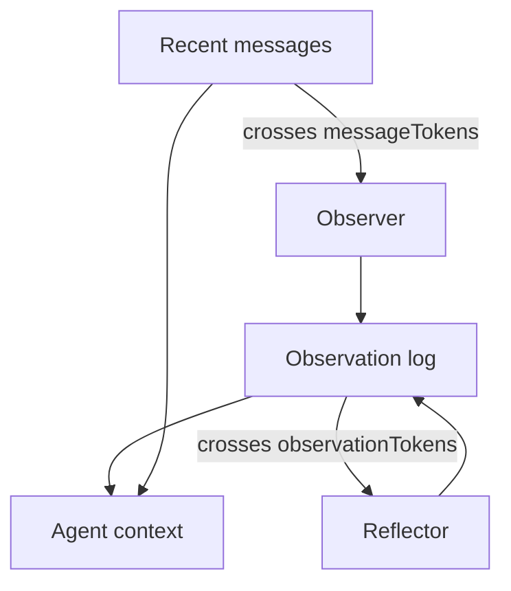

LLM 的記憶像金魚。你可以寫自己喜歡單車，接著問關於它們的事實，模型卻像《Memento》裡的男主角一樣一臉茫然。天真的修法是把最近 *N* 則 messages 塞進每次 request。十個 turns 還行。碰上 tool dumps、新 threads，或任何停在第一則 message 的 goal，它就死了。

這是 Mastra 的四層階梯，按他們推出的順序。Alex Becker 在 [Four levels of agent memory](https://www.youtube.com/watch?v=18iIHQtIPmc) 走同一套 stack。這不是 CoALA taxonomy（working / episodic / semantic / procedural）。那些名字描述的是*知識種類*。這四個層級描述的是*tokens 住在哪裡*，以及*你付什麼代價*去留住它們。

所有層級都需要 storage。不帶 options 的 `new Memory()` 已經是 level 1。其餘都是同一個 object 上的 flags。

<br />

---

## 1. Conversation history

一個 thread 就是一次 conversation。一個 resource 是擁有者：user、org、或 project。Studio 會自己產生兩者。當你自己呼叫 `generate` 或 `stream` 時，要傳進去。

Mastra 從 storage 載入最近 *N* 則 messages，放進 context window。預設 `lastMessages` 是 10。能用的原因很無聊：你說「告訴我關於它們的事實」時，模型看得到「我喜歡單車」。

<br />

```ts
import { Agent } from "@mastra/core/agent"
import { Memory } from "@mastra/memory"

export const agent = new Agent({
  id: "chat-agent",
  name: "Chat agent",
  instructions: "You are a helpful assistant.",
  model: "openai/gpt-5-mini",
  memory: new Memory({
    options: {
      lastMessages: 10,
    },
  }),
})
```

<br />

從 client 端，**只送新 message**。Mastra 已經有 thread。把完整 history 再送一次是多餘的，而且 client timestamps 會跟 store 對不上，把 messages 排亂。

這個層級會以兩種感覺像 bugs、但其實不是的方式失敗：

- Window 是滑動切割。若用戶的 goal 在第一則 message，接著燒掉 30 個 tool turns，goal 就沒了。
- 新 thread 沒有 history。同一個 agent、同一個人、空的 context。那不是 intelligence。那是 session cookie。

Tool results 會讓切割來得比你預期更早。一次 `llms.txt` fetch 可以是 10k tokens。History 對短 chats 是正確的預設。它不是一套 memory 系統。

<br />

---

## 2. Working memory

Working memory 是一塊 scratchpad，模型每個 turn 都看得到——即使幾百則 messages 之後，即使在新 thread 上（若 scope 是 `resource`）。你給它空欄位。Agent 用 `updateWorkingMemory` 填進去。填好的區塊會注入 system instruction，用戶永遠看不到。

它補充 history。它不取代 history。用在不會變的事實：名字、「討厭犯錯」、「偏好簡潔回覆」、「做一個 $10M SaaS」。Coding agents 與任何 long-horizon task 都活在這裡。

<br />

```ts
import { Agent } from "@mastra/core/agent"
import { Memory } from "@mastra/memory"

export const agent = new Agent({
  id: "personal-assistant",
  name: "Personal assistant",
  instructions: "You are a helpful personal assistant.",
  model: "openai/gpt-5-mini",
  memory: new Memory({
    options: {
      workingMemory: {
        enabled: true,
        scope: "resource",
        template: `# User Profile
- **Name**:
- **Preferences**:
- **Current Goal**:
`,
      },
    },
  }),
})
```

<br />

`scope: "resource"` 是預設：每個 user 跨 threads 共用一塊 scratchpad。`scope: "thread"` 把它隔離在這次 conversation。切換 scopes 不會遷移資料。

你可以用 Zod `schema` 取代 Markdown `template`。不能兩者並用。Templates 每次 update 都整塊替換。Schemas 會 merge：只送有改的欄位；把欄位設成 `null` 來刪除。

Working memory 刻意保持小。你必須預先定義欄位，這感覺不太 agentic。它也不是放不斷增長的 event log 的地方。若你把 conversation summaries 塞進 template，跳到 level 4。

當 observational memory 開啟時，`observationalMemory.observation.manageWorkingMemory` 讓 Observer 寫入 scratchpad，主 agent 就不必記住那個 tool。

<br />

---

## 3. Semantic recall

Semantic recall 是對 *message history* 做 RAG，不是對你的產品 corpus。這個區別很重要。[如何搭建一套 RAG 系統](/notes/how-to-build-a-rag-system) 裡 org-scoped 的 document index，是 agent 用 tool 搜尋的圖書館。Semantic recall 是自動的：每則新 message 都會被 embed，之後的 messages 會查那個 vector store，找相似的 turns。

「我喜歡狗，我的叫 Nas Barkley。」之後在另一個 thread：「我喜歡什麼動物？」查找靠的是意思，不是 `dogs` 這個詞。Mastra 把 hits 注入成額外的 system block：從另一次 conversation 記下來的。

<br />

```ts
import { Agent } from "@mastra/core/agent"
import { Memory } from "@mastra/memory"
import { LibSQLStore, LibSQLVector } from "@mastra/libsql"
import { ModelRouterEmbeddingModel } from "@mastra/core/llm"

export const agent = new Agent({
  id: "support-agent",
  name: "Support agent",
  instructions: "You are a helpful support agent.",
  model: "openai/gpt-5-mini",
  memory: new Memory({
    storage: new LibSQLStore({
      id: "agent-storage",
      url: "file:./local.db",
    }),
    vector: new LibSQLVector({
      id: "agent-vector",
      url: "file:./local.db",
    }),
    embedder: new ModelRouterEmbeddingModel("openai/text-embedding-3-small"),
    options: {
      semanticRecall: {
        topK: 3,
        messageRange: 2,
        scope: "resource",
      },
    },
  }),
})
```

<br />

`topK` 是 hit 數量。`messageRange` 是每個 hit 要一併拉回來的周圍 turns。太多，模型會淹死。太少，你會漏掉事實。`scope: "resource"` 搜尋該 user 的所有 threads；LibSQL、Postgres、MongoDB、OracleDB 與 Upstash 支援它。

預設關閉。它需要 vector store 與 embedder。Write 與 query 用同一個 embedding model，跟 document RAG 同一條規則。

代價是真的：

- Recall 不精確。你會按產品調 `topK` 與 `messageRange`。
- 你現在要跑 embedder 與 vector store。每個 turn 都有 latency。
- 注入的 system block 隨 query 改變。Prompt prefix 永遠不夠穩定，打不中 cache。Production 裡，cached input tokens 通常是最大的節省。Semantic recall 把它們花掉。

好處也是真的：依意思查找、跨 thread recall，以及 history 可以增長，卻不必把整份 log 塞進 window。

不要把它跟 Pinecone document pipeline 搞混。Message RAG 處理「我們已經說過什麼」。Document RAG 處理「handbook 裡有什麼」。不同 indexes。不同 tenancy。不同 tools。

<br />

---

## 4. Observational memory

Observational memory 是按人如何記住、如何忘記來建模的那一層。兩個 ambient agents：**Observer** 與 **Reflector**。它們一直都在。它們不是一直在跑。

當 message tokens 跨過門檻（預設 30,000；demos 常設 2k 讓你看得到），Observer 把原始 history 壓成一份稠密的 observation log：priority markers、timestamps、仍然重要的那一小片。一份 10k-token 的 tool result 可以變成 ~160 tokens。其餘允許死去。

當 observation log 本身跨過門檻（預設 40,000），Reflector 重寫整份 log。它丟掉低優先的行、合併相關事實，並讓 window 無論 thread 跑多久都保持有界。Reflections 不會疊成第三層無限層。每次 reflection *就是* 新的 log。新的 observations 接在它後面。

<br />



<br />

Observations 是**穩定的**。它們只 append。它們不會每個 turn 重排 system prefix。那是對 semantic recall 的 cache 論點，反過來用。

Observer 與 Reflector 在背景跑。在 Studio 你可以點它們看 demo。在真正的 agent 裡，它們是 async、non-blocking。Coding harness 的 compaction 常常讓用戶停一分鐘，還丟掉不該丟的細節。這個 loop 兩邊都不該做。

<br />

```ts
import { Agent } from "@mastra/core/agent"
import { LibSQLStore } from "@mastra/libsql"
import { Memory } from "@mastra/memory"

export const agent = new Agent({
  id: "long-horizon-agent",
  name: "Long-horizon agent",
  instructions: "You are a helpful assistant.",
  model: "openai/gpt-5-mini",
  memory: new Memory({
    storage: new LibSQLStore({
      id: "memory-storage",
      url: "file:./memory.db",
    }),
    options: {
      observationalMemory: {
        model: "google/gemini-2.5-flash",
      },
    },
  }),
})
```

<br />

`observationalMemory: true` 會把 Observer/Reflector model 預設成 `google/gemini-2.5-flash`。Storage 是必須的。目前支援的 adapters：`@mastra/pg`、`@mastra/libsql`、`@mastra/mysql`、`@mastra/mongodb`、`@mastra/convex`、`@mastra/oracledb`。

影片裡 Mastra 的 LongMemEval 數字，前三列用同一個 model：working memory ~55%（不是為這個 benchmark 設計的）、semantic recall ~80%、observational memory ~84%。Gemini 2.5 Flash 在 OM 上據報 ~95%，是他們引用的最高可核實分數。把它們當 Mastra 發布的分數，不是獨立 bake-off。

這是能撐過嘈雜 tool calls 的層級：page snapshots、`llms.txt`、MCP dumps。它也是會複利的層級。一個幫工作坊寫活動文案好幾週的 agent，會開始把「第二人稱、短 hook、不要 hype」當成 observations 留下，而不是你記得塞進 template 的欄位。

兩個值得知道的額外能力：

- `retrieval: true` 給 agent 一個 `recall` tool，可查產生某則 observation 的原始 messages。`{ vector: true }` 在那個 store 上加上 semantic search。Compression 不必等於原文消失。
- `observation.manageWorkingMemory` 讓 OM 擁有 scratchpad。Working memory 保持小而 structured；OM 讓主 agent 不必為此花一次 tool call。

<br />

---

## 5. Which level

<br />

| Level | Primitive | Use when | Breaks when |
| --- | --- | --- | --- |
| Conversation history | `lastMessages` | 短 threads、UI transcript | Goal 滑出 window；新 thread |
| Working memory | `workingMemory` | 穩定事實與當前 goal | 你需要 event log 或未宣告的欄位 |
| Semantic recall | `semanticRecall` | 跨長、multi-thread history 的稀疏事實 | 你需要 prompt cache，或 recall 太模糊 |
| Observational memory | `observationalMemory` | Long horizon、嘈雜 tools、cache-stable context | 你拒絕跑 storage adapter |

<br />

Mastra 目前對 long-context agents 的建議是 observational memory。前面的層級仍然存在，仍然可以組合。History 是模型*此刻*看到的。Working memory 是表格。Semantic recall 是搜尋。Observational memory 是讓 window 保持小、卻不會空白的方式。

不帶 options 的 `new Memory()` 就是 conversation history。這 repo 裡的 weather agent 就是這樣。當 thread 不再只是 chat 時，再升級。

<br />

---

## 6. Invariants

1. 透過 storage adapter persist。Memory 不是 context window。
2. Client 送新 message。Server 載入 thread。絕不要兩邊都送。
3. `thread` 是 conversation。`resource` 是擁有者。跨 thread recall 是 resource query，不是缺了 `threadId`。
4. Working memory 是一塊小的、always-on 區塊。不要把它養成長篇日記。
5. 對 messages 的 semantic recall 不是 document RAG。不同 index，不同 tenant 故事。兩邊 write 與 query 都用同一個 embedding model。
6. Observational memory 靠 append observations 維持可 cache 的 prefix。Semantic recall 是刻意打爆那個 prefix。
7. Isolation 是 server 的事。`resource` 不是 model 可以自己選的。

四個層級。同一個 `Memory` object。精妙之處在於你留哪些 tokens，以及你願意忘記哪些。
