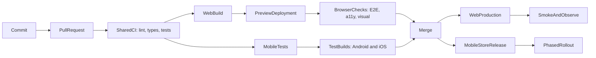

Frontend CI/CD 是把一個 commit 轉化成證據，最終成為 release 的系統。它不只是一份 YAML：它定義哪些檢查必須通過、哪個 artifact 值得信任、誰可以 promote，以及 production 不健康時團隊如何復原。

本文使用一個**虛構的** TypeScript 產品：包含 React web app、React Native mobile app，以及共享 packages。像 `pnpm deploy:web` 這類 command 是刻意保留的 provider-neutral 邊界；真實團隊會用所選 hosting 或 mobile delivery 平台實作它們。

<br />

---

## 1. CI、Continuous Delivery 與 Continuous Deployment

三個術語承諾的事情不同。

| Practice                        | Promise                                   | Typical trigger           |
| ------------------------------- | ----------------------------------------- | ------------------------- |
| **Continuous Integration (CI)** | 每次變更都經常合併並自動驗證              | Pull request 或 push      |
| **Continuous Delivery**         | 每個獲接受的 commit 都產生可發佈 artifact | CI 成功後由人手批准       |
| **Continuous Deployment**       | 每個獲接受的 commit 都自動發佈            | Release branch 的 CI 成功 |

對 frontend 產品而言，「CD」會分成兩種 delivery model：

- **Web：**團隊通常可在數分鐘內發佈 immutable artifact，並把流量切換到該版本。
- **React Native：**native binaries 必須簽署、提交 stores、經過審核，再逐步 rollout。自動化可讓 build 持續保持 **deliverable**，但 Apple 與 Google 仍控制部分 release 時間。

不要因 pipeline 執行了 `build` 就稱它為「continuous deployment」。只留在 CI runner 上的 build 並未 delivery 到任何地方。

<br />

---

## 2. 一個接近 Production 的範例

假設 workspace 有清晰邊界：

```text
apps/
  web/                  React web application
  mobile/               React Native application
packages/
  api-client/           typed transport and generated contracts
  domain/               framework-independent business rules
  ui-tokens/            shared colors, spacing, and typography
scripts/
  deploy-web.mjs        provider adapter for preview and production
  submit-mobile.mjs     store submission adapter
.github/workflows/
  pull-request.yml
  release-web.yml
  release-mobile.yml
```

具體使用哪個 monorepo 工具不是重點。重要的是：每個 check 都必須可以在本機用與 CI 相同的 command 執行。

```json title="package.json"
{
  "packageManager": "pnpm@10.15.0",
  "scripts": {
    "format:check": "prettier --check .",
    "lint": "eslint . --max-warnings=0",
    "typecheck": "tsc -b --pretty false",
    "test": "vitest run --coverage",
    "test:mobile": "jest --ci --runInBand",
    "build:web": "pnpm --filter web build",
    "test:e2e:web": "playwright test",
    "test:e2e:mobile": "maestro test apps/mobile/e2e",
    "deploy:web": "node scripts/deploy-web.mjs",
    "submit:mobile": "node scripts/submit-mobile.mjs"
  }
}
```

固定 package manager 版本並 commit lockfile。當 `package.json` 與 lockfile 不一致時，`pnpm install --frozen-lockfile` 應該失敗；CI 不應悄悄 resolve 另一套 dependency graph。

<br />

---

## 3. End-to-End Pipeline

共享 validation path 應保持快速。Web 與 mobile 只在通過共同 quality gates 後才分流。



一個實用目標：

1. **Push 前：**format 與 lint 已修改檔案。
2. **Pull request：**install、lint、format、type-check、test、build 和 scan。
3. **Preview：**deploy web artifact；針對 URL 跑 browser、accessibility 與 visual checks。
4. **Mobile test builds：**產生 unsigned simulator builds 或有 internal signing 的 device builds。
5. **Merge：**由已 review 的 commit 建立 production candidate。
6. **Release：**promote 同一個 web artifact；簽署並提交 native binaries。
7. **Verify：**執行 smoke tests，觀察 errors、performance 與 business signals。
8. **Recover：**rollback web traffic 或停止 mobile rollout。

<br />

---

## 4. 用 GitHub Actions 建立 Pull-Request CI

由 least privilege、取消過時 runs、deterministic installation 和 parallel jobs 開始。

```yaml title=".github/workflows/pull-request.yml"
name: Pull request

on:
  pull_request:

permissions:
  contents: read

concurrency:
  group: pr-${{ github.event.pull_request.number }}
  cancel-in-progress: true

env:
  NODE_VERSION: "22"
  PNPM_VERSION: "10.15.0"

jobs:
  quality:
    runs-on: ubuntu-latest
    timeout-minutes: 15
    steps:
      - uses: actions/checkout@v4
      - uses: pnpm/action-setup@v4
        with:
          version: ${{ env.PNPM_VERSION }}
      - uses: actions/setup-node@v4
        with:
          node-version: ${{ env.NODE_VERSION }}
          cache: pnpm
      - run: pnpm install --frozen-lockfile
      - run: pnpm format:check
      - run: pnpm lint
      - run: pnpm typecheck
      - run: pnpm test

  web-build:
    needs: quality
    runs-on: ubuntu-latest
    timeout-minutes: 15
    steps:
      - uses: actions/checkout@v4
      - uses: pnpm/action-setup@v4
        with:
          version: ${{ env.PNPM_VERSION }}
      - uses: actions/setup-node@v4
        with:
          node-version: ${{ env.NODE_VERSION }}
          cache: pnpm
      - run: pnpm install --frozen-lockfile
      - run: pnpm build:web
      - uses: actions/upload-artifact@v4
        with:
          name: web-${{ github.sha }}
          path: apps/web/dist
          if-no-files-found: error
          retention-days: 7

  mobile-js:
    needs: quality
    runs-on: ubuntu-latest
    timeout-minutes: 15
    steps:
      - uses: actions/checkout@v4
      - uses: pnpm/action-setup@v4
        with:
          version: ${{ env.PNPM_VERSION }}
      - uses: actions/setup-node@v4
        with:
          node-version: ${{ env.NODE_VERSION }}
          cache: pnpm
      - run: pnpm install --frozen-lockfile
      - run: pnpm test:mobile
```

在較大型系統，可把 Node 和 package manager setup 抽成 **composite action** 或 reusable workflow。不要為第一天的三行 YAML 過早 abstraction；當多個 workflows 必須保持同步時才抽取。

### 為何這個結構有效

- `permissions: contents: read` 拒絕 write access，除非某個 job 明確需要。
- `concurrency` 在 pull request 收到新 commit 後取消過時 run。
- `timeout-minutes` 防止 deadlocked test 無限佔用 runner。
- `needs` 讓 dependencies 可見，獨立 jobs 可 parallel 執行。
- Artifact name 包含 commit SHA，較容易追蹤 provenance。
- Package-store cache 加快 install，但不把 `node_modules` 當作 deployable artifact。

如要提高 supply-chain assurance，可把 third-party actions pin 到完整 commit SHA，再用 update bot 提出升級。`@v4` 這類 version tags 易讀，但屬 mutable references。

<br />

---

## 5. 按成本與訊號設計 Quality Gates

快速且 deterministic 的 checks 放前面；昂貴並依賴 environment 的 checks 放後面。

| Gate               | 證明甚麼                                   | Failure 應阻擋         |
| ------------------ | ------------------------------------------ | ---------------------- |
| Prettier / ESLint  | Syntax 一致並遵守 agreed static rules      | Pull request           |
| `tsc --noEmit`     | Type contracts 可正確組合                  | Pull request           |
| Unit tests         | Pure logic 與 domain rules 正確            | Pull request           |
| Component tests    | 使用者可觀察的 component behavior 正常     | Pull request           |
| Web build          | Bundler 與 production config 有效          | Pull request           |
| Browser E2E        | 關鍵 journeys 在 real browser 正常         | Merge 或 release       |
| Accessibility      | 沒有嚴重 automated WCAG violations         | Merge                  |
| Visual regression  | 經 review 的頁面沒有非預期改變             | Merge，baseline 需批准 |
| Performance budget | Bundle 與 key journeys 保持在 limits 內    | Merge 或 release       |
| Native build       | Gradle/Xcode project 可 compile 和 package | Release                |
| Post-release smoke | Deployed system 可連接且可用               | 繼續 rollout           |

Coverage 是 supporting evidence，不是目標。即使 pipeline 有 95% line coverage，也可能漏掉壞掉的 login redirect、無效 iOS entitlement，或在 CDN 後無法載入的 JavaScript chunk。

只有在 flaky test 有 owner、reason 與 expiry date 時才 quarantine。盲目 retry 會隱藏間歇性 production risk。

<br />

---

## 6. Web Preview、Browser Tests 與 Promotion

Preview deployment 把 E2E 從「app 能在 localhost 啟動」提升為「candidate 能跨越真實 hosting boundary 正常工作」。

```yaml title="Preview and browser checks"
web-preview:
  needs: web-build
  runs-on: ubuntu-latest
  environment: preview
  permissions:
    contents: read
    pull-requests: write
  outputs:
    url: ${{ steps.deploy.outputs.url }}
  steps:
    - uses: actions/checkout@v4
    - uses: actions/download-artifact@v4
      with:
        name: web-${{ github.sha }}
        path: apps/web/dist
    - id: deploy
      env:
        DEPLOY_TOKEN: ${{ secrets.WEB_PREVIEW_TOKEN }}
      run: |
        url="$(pnpm deploy:web --environment preview --artifact apps/web/dist)"
        echo "url=$url" >> "$GITHUB_OUTPUT"

web-e2e:
  needs: web-preview
  runs-on: ubuntu-latest
  timeout-minutes: 20
  steps:
    - uses: actions/checkout@v4
    - uses: pnpm/action-setup@v4
      with:
        version: "10.15.0"
    - uses: actions/setup-node@v4
      with:
        node-version: "22"
        cache: pnpm
    - run: pnpm install --frozen-lockfile
    - run: pnpm exec playwright install --with-deps chromium
    - run: pnpm test:e2e:web
      env:
        BASE_URL: ${{ needs.web-preview.outputs.url }}
```

Deploy command 是 adapter：上載指定 artifact 並印出 URL。它不可重新 build。應只 build 一次、記錄 digest、test 該 artifact，再 promote 相同 bytes。

### Frontend-specific preview gates

- 執行少量但能保護 revenue、authentication、data loss 與 navigation 的 journeys。
- 用 Axe 掃描代表性頁面，但仍保留 manual accessibility testing，因自動化無法評估所有 WCAG requirements。
- 在固定 viewport sizes 與 fonts 下 capture visual baselines。
- 限制 compressed JavaScript budget，調查大型 route-level 變更。
- 在穩定 environment 執行 Lighthouse 或 user-flow performance tests；noise 大的 synthetic score 應先 warning，穩定後才 blocking。
- 把 source maps 上載到 error-monitoring system；若產品需要，避免 source maps 可被公開 listing。

### Production promotion

在 GitHub `production` Environment 設 required reviewers。Production job 應接收已 test artifact 的 identifier 或 digest：

```yaml title="Production promotion"
deploy-production:
  needs: [web-preview, web-e2e]
  if: github.ref == 'refs/heads/main'
  runs-on: ubuntu-latest
  environment: production
  permissions:
    contents: read
    id-token: write
  steps:
    - uses: actions/download-artifact@v4
      with:
        name: web-${{ github.sha }}
        path: apps/web/dist
    - run: pnpm deploy:web --environment production --artifact apps/web/dist
    - run: pnpm smoke:web
      env:
        BASE_URL: https://example.invalid
```

當 provider 支援時，`id-token: write` 可讓 OpenID Connect 取得 short-lived cloud credentials。它比 permanent access keys 安全。只授予 deployment job，不要授予 pull-request workflow。

<br />

---

## 7. Web Configuration、Artifacts 與 Rollback

Browser code 無法保存 secret。任何嵌入 web bundle 的值——包括使用 `PUBLIC_` 之類 convention 的 variables——都必須視為 public。

分開管理：

- **Build-time public configuration：**API origin、analytics project ID、feature defaults。
- **Runtime server configuration：**只供 server functions 或 backend-for-frontend 使用的 credentials。
- **Deployment credentials：**只供 deployment job 使用。

團隊要決定 config 是 bake 進每個 artifact，還是在 runtime inject。Baked config 較簡單並容易 reproduce；runtime config 可讓同一 artifact 跨 environments，但需要經過設計的 loading mechanism。

Rollback 流程：

1. 保留以 digest 或 release ID 定址的 immutable releases。
2. 把 production alias 或 traffic pointer 指回 last known-good release。
3. 只 purge 必須改變的 CDN entries；fingerprinted assets 應保持 immutable。
4. Rollback 後執行 smoke checks。
5. 保存 logs 與 failed artifact 供 diagnosis。

重新 build 舊 Git commit 不如 promote 原始 artifact 安全，因 dependencies、base images 與 external build services 可能已改變。

<br />

---

## 8. React Native CI 其實是兩條 Pipelines

React Native 有快速的 JavaScript pipeline，以及較慢的 native pipeline。

### JavaScript layer

大部分 pull requests 可在 Linux 執行：

- ESLint、formatting 與 TypeScript
- Jest 與 React Native Testing Library
- reducers、state machines、deep links、API adapters 和 offline behavior tests
- Metro bundle generation，用來發現 unresolved modules

### Native layer

當 native files、dependencies、release config 或 release tag 改變時執行：

- 在 Linux 用 Gradle 與適當 JDK 建 Android build
- 在 macOS 用 Xcode、CocoaPods 或 Swift Package Manager 建 iOS build
- simulator/emulator smoke tests
- 用 Maestro 或 Detox 跑 device E2E
- 只在受保護 release jobs 中進行 signing、packaging 與 store submission

macOS runners 較慢、成本較高，而且受已安裝 Xcode 版本限制。不要每次 documentation-only change 都跑完整 signed iOS archive。可以謹慎使用 path filters，同時安排 periodic full builds 來發現 drift。

<br />

---

## 9. Mobile Test Builds 與 E2E

Internal builds 讓 product 和 QA 在 store submission 前測試 candidate。

```yaml title="Mobile internal builds"
jobs:
  android-internal:
    runs-on: ubuntu-latest
    environment: mobile-internal
    steps:
      - uses: actions/checkout@v4
      - uses: actions/setup-java@v4
        with:
          distribution: temurin
          java-version: "17"
          cache: gradle
      - run: corepack enable
      - run: pnpm install --frozen-lockfile
      - run: pnpm mobile:build:android --profile internal
        env:
          ANDROID_KEYSTORE_BASE64: ${{ secrets.ANDROID_KEYSTORE_BASE64 }}
          ANDROID_KEYSTORE_PASSWORD: ${{ secrets.ANDROID_KEYSTORE_PASSWORD }}
      - uses: actions/upload-artifact@v4
        with:
          name: android-internal-${{ github.sha }}
          path: apps/mobile/android/app/build/outputs/**/*.apk

  ios-simulator:
    runs-on: macos-latest
    steps:
      - uses: actions/checkout@v4
      - run: corepack enable
      - run: pnpm install --frozen-lockfile
      - run: pnpm mobile:build:ios --profile simulator
      - run: pnpm test:e2e:mobile --platform ios
```

Pull-request smoke tests 優先使用 unsigned iOS simulator build。只有受保護 job 真正需要 signed device 或 App Store archive 時，才 import certificates 與 provisioning profiles。

Mobile E2E 天生比 unit tests 更容易受環境影響。可用以下方式穩定：

- 固定 simulator/OS versions；
- 使用 isolated test accounts 與可 reset backend state；
- 保留 accessibility IDs 作穩定 interactions；
- failure 時上載 screenshots、videos 與 device logs；
- 保持一套小型 release-blocking suite，另以 scheduled jobs 跑較廣 coverage。

<br />

---

## 10. 用 Tag 建立 Mobile Releases

Native releases 需要明確 versioning 與受控 credentials。常見 policy：

- source 內有 marketing version，例如 `3.4.0`；
- 單調遞增的 iOS build number；
- 單調遞增的 Android version code；
- annotated tag，例如 `mobile-v3.4.0`；
- submission 前須經 protected GitHub Environment approval。

```yaml title=".github/workflows/release-mobile.yml"
name: Release mobile

on:
  push:
    tags:
      - "mobile-v*"

permissions:
  contents: read

jobs:
  validate-tag:
    runs-on: ubuntu-latest
    outputs:
      version: ${{ steps.version.outputs.value }}
    steps:
      - uses: actions/checkout@v4
      - id: version
        run: |
          value="${GITHUB_REF_NAME#mobile-v}"
          node scripts/assert-version.mjs "$value"
          echo "value=$value" >> "$GITHUB_OUTPUT"
      - run: corepack enable
      - run: pnpm install --frozen-lockfile
      - run: pnpm lint && pnpm typecheck && pnpm test && pnpm test:mobile

  build-android:
    needs: validate-tag
    runs-on: ubuntu-latest
    environment: mobile-production
    steps:
      - uses: actions/checkout@v4
      - run: pnpm mobile:build:android --profile production
      - uses: actions/upload-artifact@v4
        with:
          name: android-${{ needs.validate-tag.outputs.version }}
          path: apps/mobile/android/app/build/outputs/**/*.aab

  build-ios:
    needs: validate-tag
    runs-on: macos-latest
    environment: mobile-production
    steps:
      - uses: actions/checkout@v4
      - run: pnpm mobile:build:ios --profile production
      - uses: actions/upload-artifact@v4
        with:
          name: ios-${{ needs.validate-tag.outputs.version }}
          path: apps/mobile/build/**/*.ipa

  submit:
    needs: [validate-tag, build-android, build-ios]
    runs-on: ubuntu-latest
    environment: mobile-store-submit
    steps:
      - uses: actions/download-artifact@v4
      - run: pnpm submit:mobile --track internal
        env:
          APP_STORE_API_KEY: ${{ secrets.APP_STORE_API_KEY }}
          PLAY_SERVICE_ACCOUNT_JSON: ${{ secrets.PLAY_SERVICE_ACCOUNT_JSON }}
```

以上 shortened build jobs 假設 setup 與 signing 隱藏在經 audit scripts 或 reusable workflows 內。Production implementation 要讓相關 steps 足夠明確，便於 diagnosis 和 rotation。

先 submit 到 TestFlight 與 Play internal testing。把經批准 binary promote 到 beta 與 production tracks，而不是每個 track 都重新 build。

<br />

---

## 11. Signing 與 Secret Boundaries

Mobile signing 需要比一般 CI 更嚴格的 threat model。

- 把 signing files 存成 encrypted CI secrets，或放在專用 secrets manager。
- Production signing 只限 protected environments 與 trusted branches/tags。
- 絕不向來自 forks 的 pull requests 暴露 production secrets。
- 避免用 `pull_request_target` checkout untrusted code；這可能把具 write 權限 secrets 與 attacker-controlled code 放在一起。
- Mask sensitive output，並確保 shell tracing 不會印出 credentials。
- 在 certificates、API keys 與 service accounts 到期前 rotate。
- 分開 build credentials 和 store-submission credentials。
- Store API accounts 只給可 upload 或 promote builds 的最小 roles。

可行時使用 short-lived identity federation。部分 store-signing materials 因平台設計仍是 long-lived，因此要用 access controls、audit logs 與 rotation 補償。

<br />

---

## 12. Mobile Rollout 與 Recovery

Mobile rollback 不是 web deployment 的反向操作。已安裝 binary 通常無法從所有 devices 移除。

採用分層 response：

1. 在 App Store Connect 或 Play Console **停止 phased rollout**。
2. 可行時用 server-side flag **關閉受影響 feature**。
3. 只有舊 installed clients 仍 compatible 時才 **rollback backend contract**。
4. 只對與 installed native runtime compatible 的 JavaScript/assets **發佈 OTA update**。
5. Native crashes、entitlement 錯誤、SDK changes 或 incompatible native modules 要 **提交 hotfix binary**。
6. 若 backend 最終必須拒絕不安全 clients，清晰傳達 **minimum supported versions**。

OTA system 必須把 update 綁定 runtime 或 compatibility version。向 installed binary 發送依賴不存在 native module 的 JavaScript，可能造成即時 crash loop。

應使用 staged rollout percentages，並監控：

- crash-free users 與 sessions；
- app start 與 screen-render latency；
- 依 app version 分組的 API error rate；
- login、checkout 或其他 critical conversion；
- device model 與 OS-specific regressions。

<br />

---

## 13. Reusable Workflows，而不是 YAML Monolith

Pipeline 變大時，要分開 responsibilities：

```text
pull-request.yml       orchestration and PR permissions
release-web.yml        production web policy
release-mobile.yml     tag and store policy
reusable-node.yml      install, lint, types, unit tests
reusable-android.yml   JDK, Gradle, signing, artifact
reusable-ios.yml       Xcode, signing, archive, artifact
```

以明確 inputs 呼叫 reusable workflows；只有必要時才傳 secrets：

```yaml title="Reusable quality workflow"
jobs:
  quality:
    uses: ./.github/workflows/reusable-node.yml
    with:
      node-version: "22"
    secrets: {}
```

Policy 留在 caller：

- 哪些 branches 或 tags trigger；
- 哪個 environment 必須 approve；
- 授予甚麼 permissions；
- failure 是否阻止 promotion。

Mechanics 留在 reusable workflow：

- toolchain setup；
- deterministic install；
- build commands；
- artifact naming 與 upload。

避免用一份 workflow 加數十個 conditionals 同時處理 web、iOS、Android、preview、staging 與 production。否則很難理解每條 path 取得哪些 permissions 與 secrets。

<br />

---

## 14. Observability 是 Delivery 的一部分

Green deployment command 只能證明平台接受了 artifact。

Web deploy 後：

- request health page 與一個 critical authenticated journey；
- 偵測 console errors 與 failed asset requests；
- verify app exposed release identifier；
- 比較新舊 release 的 error rate、latency 與 key business signals；
- 確認 source maps 把 stack traces 對應到正確 commit。

Mobile submission 與 rollout 後：

- verify store processing status；
- 從 internal track 安裝同一個 build；
- 檢查 deep links、push registration、permissions、login 與 upgrade paths；
- 按 version 和 platform segment crash 與 API telemetry。

在 logs 與 telemetry 加上 release identity：commit SHA、web artifact digest、mobile version 與 build number。缺少這些資料，就難以證明和逆轉「release 後 errors 上升」。

<br />

---

## 15. 常見 Failure Modes

| Symptom                                | Likely cause                                                            | First response                                             |
| -------------------------------------- | ----------------------------------------------------------------------- | ---------------------------------------------------------- |
| CI 本機成功但 runner 失敗              | Runtime 未 pin、lockfile drift、case-sensitive path、hidden local state | 在 clean container reproduce；比較 tool versions           |
| 舊 PR deploy 覆蓋較新 preview          | 缺少 concurrency 或 environment-specific release ID                     | 取消 stale runs；preview names 加 PR ID                    |
| E2E 間歇性變紅                         | Shared data、animation/timing assumptions、unstable selector            | Capture traces；隔離 state；等待 observable behavior       |
| Production 與 preview 不同             | Rebuilt artifact 或 build-time variables 不同                           | Promote tested digest；記錄 configuration                  |
| Web deploy 成功但 users 看到混合 files | Mutable filenames 或 CDN cache headers 錯誤                             | Fingerprint assets；不要把 HTML 當 immutable cache         |
| iOS build 突然失敗                     | Runner Xcode 改變、certificate expired、Pods drifted                    | 盡量 pin runner/toolchain；檢查 signing 與 lockfiles       |
| Android release 可安裝但不能 call API  | Release-only network/security config 或 wrong environment               | 對 production-like services 測試 signed internal build     |
| Store 拒絕 binary                      | Metadata、entitlement、privacy manifest、SDK policy                     | Submission 前 validate；明確 compliance ownership          |
| OTA update 令舊 clients crash          | 未 enforce runtime compatibility                                        | Halt update；target compatible runtime；發佈 binary hotfix |
| Rollback 恢復 code 但未恢復 behavior   | Backend/schema/config change 非 backward-compatible                     | 使用 expand-contract changes 與 version-aware flags        |

Failure summary 應直接連到 traces、screenshots、logs、artifacts 與 commit。沒有 diagnostic context 的 notification 只會製造 noise。

<br />

---

## 16. 合理的 Adoption Order

不要在一個 pull request 建造最終平台。

1. 先令 lint、type-check、unit tests 與 builds 在本機 deterministic。
2. 每個 pull request 都執行，並設定 branch protection。
3. Upload immutable artifacts，記錄 commit SHA。
4. 加入 web previews 與小型 Playwright release-blocking suite。
5. 加入 accessibility、visual 與 performance signals。
6. 用 environment approval 與 short-lived credentials 保護 production。
7. 加入 React Native simulator 與 Android debug builds。
8. 自動化 signed internal builds，再自動化 store submission。
9. 加入 post-release verification、phased rollout 與演練過的 rollback。
10. 量度 duration、failure rate、flaky tests 與 deployment recovery time。

成熟 pipeline 不是 jobs 最多的 pipeline，而是能快速提供可信證據、把 privileged work 減到最少、promote 真正測試過的 artifact，並令 recovery 成為日常操作的 pipeline。
